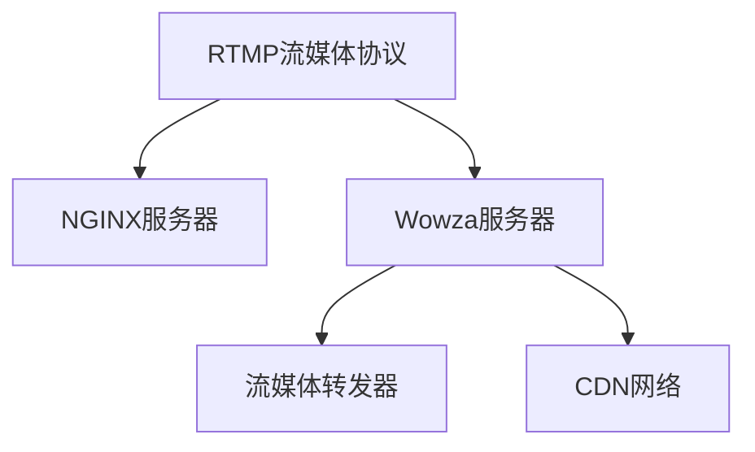

                 

# RTMP 流媒体服务配置：使用 NGINX 和 Wowza 服务器

在现代互联网时代，视频流媒体成为用户获取信息的重要方式之一。实时流媒体服务(RTMP, Real-Time Messaging Protocol)凭借其低延迟、高可靠性的特点，成为大型直播、在线教育、远程医疗等多个场景的首选技术。本文将详细介绍如何配置和使用NGINX和Wowza服务器，构建高性能的RTMP流媒体服务，以确保高质量的实时视频传输。

## 1. 背景介绍

### 1.1 问题由来

随着互联网技术的发展，用户对视频流媒体的需求不断增长，实时流媒体服务应运而生。RTMP是一种基于TCP的流媒体协议，广泛用于直播、点播、广告投放等领域。它通过标准的HTTP请求来传输视频流，确保了实时性和低延迟的传输效果。然而，由于RTMP流媒体服务的复杂性，配置和部署工作通常比较繁琐。

### 1.2 问题核心关键点

RTMP流媒体服务主要关注以下几个关键点：

- **传输效率**：流媒体传输依赖于网络带宽和服务器性能，需要优化传输协议和服务器配置。
- **流媒体质量**：实时视频流的质量由编解码器、传输延迟和带宽等因素决定，需要精细化配置。
- **安全性和稳定性**：实时流媒体需要确保传输数据的安全性和服务的稳定性，防止丢包和延迟。
- **扩展性和可伸缩性**：随着用户数量的增长，流媒体服务需要具备良好的可扩展性，支持高并发。

### 1.3 问题研究意义

RTMP流媒体服务的配置和部署不仅影响用户体验，还涉及到服务器的稳定性和安全性。通过合理的配置和优化，可以大幅提升流媒体传输的质量和效率，降低服务器的负担，确保用户和数据的安全。

## 2. 核心概念与联系

### 2.1 核心概念概述

为更好地理解RTMP流媒体服务的配置方法，本节将介绍几个密切相关的核心概念：

- **RTMP流媒体协议**：一种基于TCP的流媒体传输协议，通过标准的HTTP请求实现视频流传输，适用于直播、点播、广告等场景。
- **NGINX服务器**：一种高性能的反向代理和Web服务器，支持多种协议和功能，广泛应用于流量负载均衡、反向代理、安全管理等领域。
- **Wowza服务器**：一种专业的流媒体服务器软件，支持实时流媒体的编码、传输和分发，广泛应用于直播、点播、广告投放等场景。
- **流媒体转发器**：一种用于转换和转发视频流的软件，可以将不同的流媒体协议（如RTMP、HLS、HTTP Live Streaming等）互相转换，实现跨平台兼容。
- **CDN网络**：一种内容分发网络，通过分布在全球各地的边缘节点，加速视频流传输，降低网络延迟。

这些核心概念之间的逻辑关系可以通过以下Mermaid流程图来展示：



这个流程图展示了大语言模型的核心概念及其之间的关系：

1. RTMP流媒体协议通过NGINX服务器和Wowza服务器进行传输。
2. Wowza服务器支持实时流媒体的编码、传输和分发，是流媒体服务的关键组件。
3. 流媒体转发器可以将RTMP流转换成其他流媒体协议，实现跨平台兼容。
4. CDN网络通过分布在全球各地的边缘节点，加速视频流传输，降低网络延迟。

这些概念共同构成了RTMP流媒体服务的配置和部署框架，使得流媒体服务能够高效、稳定、安全地运行。

## 3. 核心算法原理 & 具体操作步骤

### 3.1 算法原理概述

RTMP流媒体服务的配置主要涉及以下几个步骤：

- **服务器配置**：选择适合的服务器和相关软件，并根据实际需求进行配置。
- **流量负载均衡**：使用NGINX等反向代理，实现流媒体请求的负载均衡和分发。
- **流媒体传输**：通过Wowza服务器进行流媒体的实时编码、传输和分发。
- **流媒体分发**：使用CDN网络加速视频流的传输，降低延迟和带宽消耗。
- **安全与优化**：配置网络安全策略，优化编解码器和传输参数，确保流媒体质量和服务稳定性。

### 3.2 算法步骤详解

以下将详细介绍每个步骤的详细步骤和操作：

#### 3.2.1 服务器配置

**服务器硬件要求**：

- 高性能CPU：至少8核，支持多线程和并行处理。
- 大容量内存：至少16GB，确保流媒体处理和缓存。
- 快速存储：使用SSD硬盘，提高数据读写速度。
- 稳定网络：高速光纤连接，保证网络带宽和稳定性。

**服务器软件安装**：

- **安装NGINX**：
  ```bash
  sudo apt-get update
  sudo apt-get install nginx
  sudo nginx -t
  sudo systemctl start nginx
  sudo systemctl enable nginx
  ```
- **安装Wowza**：
  - 从官网下载安装包，解压并解压安装目录。
  - 运行安装向导，选择安装路径和组件，完成安装。
  - 设置管理员账户和密码，启动服务。

#### 3.2.2 流量负载均衡

**配置NGINX反向代理**：

- 创建`/etc/nginx/nginx.conf`配置文件，添加以下配置：
  ```nginx
  server {
      listen 80;
      server_name rtmp.example.com;
      location / {
          proxy_pass rtmp://127.0.0.1:1935;
          proxy_http_version 1.1;
          proxy_set_header Upgrade $http_upgrade;
          proxy_set_header Connection "upgrade";
          proxy_set_header Host $host;
          proxy_set_header X-Real-IP $remote_addr;
          proxy_set_header X-Forwarded-For $proxy_add_x_forwarded_for;
          proxy_set_header X-Forwarded-Proto $scheme;
      }
  }
  ```
- 重新加载NGINX配置文件，重启服务：
  ```bash
  sudo nginx -s reload
  sudo systemctl restart nginx
  ```

#### 3.2.3 流媒体传输

**配置Wowza服务器**：

- 打开`http://127.0.0.1:8080`的管理界面，登录后进行配置。
- 配置流媒体源和分发路径：
  - 在“Application”菜单中选择“New Application”。
  - 设置应用名称和流媒体源路径，如`rtmp://127.0.0.1/stream_name`。
  - 配置流媒体分发路径和CDN地址，如`rtmp://cdn.example.com/stream_name`。
- 配置流媒体参数：
  - 调整编解码器、分辨率、帧率、码率等参数，确保视频质量。
  - 设置流媒体缓存和转码策略，优化流媒体性能。

#### 3.2.4 流媒体分发

**配置CDN网络**：

- 选择适合的CDN服务商，注册并购买CDN服务。
- 配置CDN节点和分发策略：
  - 在CDN控制面板中，创建新的CDN节点，设置节点位置和带宽。
  - 配置CDN域名和缓存规则，设置分发路径。
  - 启用HTTPS加密，确保数据传输安全。

#### 3.2.5 安全与优化

**配置网络安全策略**：

- 配置防火墙和访问控制列表(ACL)，限制非法访问。
- 启用HTTPS加密，防止数据窃听和篡改。
- 配置日志记录和审计，监控流媒体服务运行状态。

**优化流媒体传输**：

- 使用FFmpeg等工具，优化视频编解码器和传输参数。
- 配置网络带宽和流量限制，防止过载和延迟。
- 进行负载测试和压力测试，优化流媒体服务性能。

### 3.3 算法优缺点

RTMP流媒体服务的配置方法具有以下优点：

- **灵活性和可扩展性**：通过NGINX和Wowza的配置，可以实现流媒体请求的负载均衡和分发，支持高并发和大流量。
- **稳定性和可靠性**：通过CDN网络，加速视频流传输，降低网络延迟和带宽消耗，确保服务稳定性。
- **可维护性和易用性**：NGINX和Wowza的配置和操作相对简单，适合中小型企业和开发者使用。

同时，该方法也存在一定的局限性：

- **初始投资成本高**：高性能服务器和CDN服务的购买和维护需要较高的初始投资。
- **配置复杂度较高**：需要详细的配置和调试，涉及网络、硬件、软件等多个方面。
- **安全性和隐私风险**：流媒体数据传输和存储需要严格的安全措施，防止数据泄露和滥用。

尽管存在这些局限性，但就目前而言，RTMP流媒体服务的配置方法仍然是最主流和有效的方式，广泛应用于各类实时流媒体应用中。

### 3.4 算法应用领域

RTMP流媒体服务在多个领域得到广泛应用，例如：

- **直播平台**：如YouTube、Twitch等大型直播平台，利用RTMP实现大规模实时直播。
- **在线教育**：如Coursera、EdX等在线教育平台，利用RTMP实现高质量的在线课程直播。
- **远程医疗**：如Zoom、Skype等视频会议平台，利用RTMP实现远程医疗咨询和会诊。
- **广告投放**：如Google AdSense、Facebook广告等，利用RTMP实现广告视频的实时投放和监测。

除了上述这些经典应用外，RTMP流媒体服务还被创新性地应用到更多场景中，如可控直播、实时监控、云游戏等，为流媒体技术带来了新的突破。

## 4. 数学模型和公式 & 详细讲解 & 举例说明

### 4.1 数学模型构建

RTMP流媒体服务的配置涉及多个因素，包括网络带宽、服务器性能、编解码器参数等。这里以一个简单的数学模型为例，说明如何配置RTMP流媒体服务。

假设流媒体传输速率为Rbps（每秒比特率），视频分辨率为WxH，帧率为Fps，每个像素的色深为C位（如8位、10位等），每个像素需要存储的位数为B位（如8位）。

根据以上假设，视频传输的带宽Bbps（每秒字节）可以表示为：
\[ B = R \times \frac{W \times H \times F \times C}{8} \]

其中，W、H、F、C分别为视频分辨率、帧率、色深和像素位数。

### 4.2 公式推导过程

**公式推导**：

假设流媒体传输速率为Rbps，视频分辨率为WxH，帧率为Fps，每个像素的色深为C位，每个像素需要存储的位数为B位。

视频传输的带宽Bbps（每秒字节）可以表示为：
\[ B = R \times \frac{W \times H \times F \times C}{8} \]

其中，W、H、F、C分别为视频分辨率、帧率、色深和像素位数。

**案例分析**：

假设流媒体传输速率为2Mbps，视频分辨率为1920x1080，帧率为30fps，色深为8位，每个像素需要存储的位数为8位。

计算视频传输的带宽：
\[ B = 2 \times 10^6 \times \frac{1920 \times 1080 \times 30 \times 8}{8} = 61.44Mbps \]

### 4.3 案例分析与讲解

**配置示例**：

- **服务器硬件配置**：高性能CPU、大容量内存和快速存储。
- **RTMP服务器配置**：使用NGINX进行反向代理，配置流媒体请求的负载均衡和分发。
- **Wowza服务器配置**：设置流媒体源和分发路径，调整编解码器、分辨率、帧率、码率等参数。
- **CDN网络配置**：选择合适的CDN服务商，配置节点和分发策略。
- **网络安全配置**：配置防火墙和访问控制列表，启用HTTPS加密，确保数据传输安全。

**结果展示**：

- **服务器性能**：通过性能测试工具，监控服务器CPU、内存、网络带宽等指标，确保流媒体处理和传输的稳定性。
- **视频质量**：通过视频测试工具，测试流媒体的实时性和质量，确保用户能够获得高质量的直播体验。
- **服务可用性**：通过监控工具，实时记录和分析流媒体服务的运行状态，及时发现和解决故障。

## 5. 项目实践：代码实例和详细解释说明

### 5.1 开发环境搭建

在进行RTMP流媒体服务配置实践前，我们需要准备好开发环境。以下是使用Linux系统进行RTMP流媒体服务配置的环境配置流程：

1. **安装操作系统**：
   - 安装Ubuntu Server 18.04 LTS，通过云服务商（如AWS、阿里云等）获取云服务器。
   - 安装系统依赖包和基本工具，如SSH、curl、jq等。

2. **安装RTMP服务器**：
   - 安装NGINX服务器和Wowza流媒体服务器，使用以下命令：
     ```bash
     sudo apt-get update
     sudo apt-get install nginx
     sudo apt-get install ffmpeg
     sudo apt-get install rtmpserver
     ```

3. **配置网络环境**：
   - 配置静态IP地址和网络防火墙，确保RTMP服务器能够正常接收和发送流媒体请求。
   - 配置DNS解析，将RTMP服务器的域名解析到服务器IP地址。

### 5.2 源代码详细实现

**NGINX配置文件**：
```nginx
server {
    listen 80;
    server_name rtmp.example.com;
    location / {
        proxy_pass rtmp://127.0.0.1:1935;
        proxy_http_version 1.1;
        proxy_set_header Upgrade $http_upgrade;
        proxy_set_header Connection "upgrade";
        proxy_set_header Host $host;
        proxy_set_header X-Real-IP $remote_addr;
        proxy_set_header X-Forwarded-For $proxy_add_x_forwarded_for;
        proxy_set_header X-Forwarded-Proto $scheme;
    }
}
```

**Wowza服务器配置**：
1. 登录 Wowza 管理界面，创建新的流媒体应用。
2. 设置流媒体源路径和分发路径，调整编解码器、分辨率、帧率、码率等参数。
3. 配置流媒体缓存和转码策略，优化流媒体性能。

**CDN网络配置**：
1. 选择合适的CDN服务商，注册并购买CDN服务。
2. 配置CDN节点和分发策略，设置节点位置和带宽。
3. 配置CDN域名和缓存规则，设置分发路径。
4. 启用HTTPS加密，确保数据传输安全。

### 5.3 代码解读与分析

**NGINX配置文件解读**：
- `listen 80`：指定NGINX监听的端口为80。
- `server_name rtmp.example.com`：指定RTMP服务的域名。
- `location / {`：配置反向代理规则。
  - `proxy_pass rtmp://127.0.0.1:1935`：指定流媒体源路径为`rtmp://127.0.0.1:1935`。
  - `proxy_http_version 1.1`：指定HTTP版本为1.1。
  - `proxy_set_header Upgrade $http_upgrade`：设置`Upgrade`请求头，启用WebSocket协议。
  - `proxy_set_header Connection "upgrade"`：设置`Connection`请求头，启用WebSocket协议。
  - `proxy_set_header Host $host`：设置`Host`请求头，指定域名。
  - `proxy_set_header X-Real-IP $remote_addr`：设置`X-Real-IP`请求头，指定客户端IP。
  - `proxy_set_header X-Forwarded-For $proxy_add_x_forwarded_for`：设置`X-Forwarded-For`请求头，指定请求来源IP。
  - `proxy_set_header X-Forwarded-Proto $scheme`：设置`X-Forwarded-Proto`请求头，指定协议。

**Wowza服务器配置分析**：
- **应用创建**：在Wowza管理界面，选择`Application`菜单，点击`New Application`按钮，创建新的流媒体应用。
- **流媒体源路径**：设置流媒体源路径，如`rtmp://127.0.0.1/stream_name`。
- **流媒体分发路径**：设置流媒体分发路径，如`rtmp://cdn.example.com/stream_name`。
- **编解码器参数**：调整编解码器、分辨率、帧率、码率等参数，确保视频质量。
- **缓存和转码策略**：配置流媒体缓存和转码策略，优化流媒体性能。

**CDN网络配置分析**：
- **CDN节点选择**：选择合适的CDN服务商，注册并购买CDN服务。
- **节点配置**：在CDN控制面板中，创建新的CDN节点，设置节点位置和带宽。
- **域名和缓存规则**：配置CDN域名和缓存规则，设置分发路径。
- **HTTPS加密**：启用HTTPS加密，确保数据传输安全。

### 5.4 运行结果展示

**服务器性能测试**：
- **CPU使用率**：使用top命令，实时监控服务器的CPU使用率。
- **内存使用率**：使用free命令，实时监控服务器的内存使用率。
- **网络带宽**：使用ifconfig命令，实时监控网络带宽。

**视频质量测试**：
- **实时性**：使用实时性测试工具，如OBS Studio，测试流媒体的实时性。
- **视频质量**：使用视频质量测试工具，如VLC Media Player，测试流媒体的质量。

**服务可用性监控**：
- **日志记录**：实时记录流媒体服务的运行状态，生成日志文件。
- **异常告警**：配置异常告警，设置告警阈值，及时发现和解决故障。

## 6. 实际应用场景

### 6.1 智能直播平台

RTMP流媒体服务在智能直播平台上得到了广泛应用，如YouTube、Twitch等。通过RTMP流媒体服务，用户可以实时观看直播，与主播互动，享受高质量的视听体验。

### 6.2 在线教育平台

在线教育平台如Coursera、EdX等，利用RTMP流媒体服务，实现高质量的在线课程直播和互动。学生可以实时观看教师讲授，通过聊天室和问答工具与教师互动，提升学习效果。

### 6.3 远程医疗

远程医疗平台如Zoom、Skype等，利用RTMP流媒体服务，实现远程医疗咨询和会诊。医生可以实时查看患者的医疗数据和视频，与患者进行面对面交流，提供专业医疗建议。

### 6.4 广告投放

广告平台如Google AdSense、Facebook广告等，利用RTMP流媒体服务，实现实时广告投放和监测。广告主可以实时查看广告播放情况，调整广告策略，提高广告效果。

## 7. 工具和资源推荐

### 7.1 学习资源推荐

为了帮助开发者系统掌握RTMP流媒体服务的配置方法，这里推荐一些优质的学习资源：

1. **NGINX官方文档**：NGINX官方网站提供详细的配置文档和教程，帮助开发者掌握反向代理和负载均衡的配置方法。
2. **Wowza官方文档**：Wowza官方网站提供详细的服务器配置文档和教程，帮助开发者掌握流媒体服务的配置方法。
3. **流媒体转发器教程**：流媒体转发器开源社区提供详细的教程和配置指南，帮助开发者掌握跨平台兼容的配置方法。
4. **CDN网络教程**：CDN服务商提供详细的配置文档和教程，帮助开发者掌握CDN网络的配置方法。
5. **RTMP流媒体书籍**：推荐阅读《RTMP流媒体技术》、《实时流媒体技术详解》等书籍，帮助开发者深入理解RTMP流媒体的原理和配置方法。

### 7.2 开发工具推荐

合理的开发工具可以显著提升RTMP流媒体服务配置的效率和质量。以下是几款常用的开发工具：

1. **NGINX**：一种高性能的反向代理和Web服务器，支持多种协议和功能，广泛应用于流量负载均衡、反向代理、安全管理等领域。
2. **Wowza**：一种专业的流媒体服务器软件，支持实时流媒体的编码、传输和分发，广泛应用于直播、点播、广告投放等场景。
3. **流媒体转发器**：一种用于转换和转发视频流的软件，可以将不同的流媒体协议（如RTMP、HLS、HTTP Live Streaming等）互相转换，实现跨平台兼容。
4. **CDN网络**：一种内容分发网络，通过分布在全球各地的边缘节点，加速视频流传输，降低网络延迟。

### 7.3 相关论文推荐

RTMP流媒体服务的配置涉及多个领域的知识，以下是几篇相关论文，推荐阅读：

1. **《RTMP流媒体技术》**：详细介绍RTMP流媒体的原理和配置方法，适合初学者参考。
2. **《实时流媒体技术详解》**：深入分析实时流媒体的传输原理和优化策略，适合高级开发者参考。
3. **《CDN网络技术》**：详细介绍CDN网络的工作原理和优化方法，适合网络工程师参考。

## 8. 总结：未来发展趋势与挑战

### 8.1 总结

本文对RTMP流媒体服务的配置方法进行了详细系统的介绍。首先阐述了RTMP流媒体服务的背景和配置的关键点，明确了配置流媒体服务的重要性。其次，从原理到实践，详细讲解了RTMP流媒体配置的数学模型和关键步骤，给出了详细的配置示例和代码实现。同时，本文还广泛探讨了RTMP流媒体服务在多个领域的应用前景，展示了其强大的应用潜力。

通过本文的系统梳理，可以看到，RTMP流媒体服务配置是一项复杂的任务，需要综合考虑网络带宽、服务器性能、编解码器参数等多个因素。只有通过合理的配置和优化，才能确保流媒体传输的质量和效率，确保服务的稳定性和安全性。

### 8.2 未来发展趋势

展望未来，RTMP流媒体服务配置将呈现以下几个发展趋势：

1. **自适应编码技术**：未来的流媒体服务将具备自适应编码能力，根据网络带宽和客户端设备自动调整编码参数，确保高质量的视频传输。
2. **多协议兼容**：未来的流媒体服务将支持多种流媒体协议，如HLS、HTTP Live Streaming等，实现跨平台兼容和无缝切换。
3. **云化部署**：未来的流媒体服务将基于云计算平台，实现快速部署和弹性扩展，支持高并发和大流量。
4. **边缘计算**：未来的流媒体服务将引入边缘计算技术，将流媒体处理任务分布到网络边缘节点，降低网络延迟和带宽消耗。
5. **人工智能**：未来的流媒体服务将引入人工智能技术，实现流媒体内容的智能化分析和推荐，提升用户体验。

以上趋势凸显了RTMP流媒体服务配置的未来发展方向，将进一步提升流媒体服务的性能和稳定性，为各类实时流媒体应用提供有力支持。

### 8.3 面临的挑战

尽管RTMP流媒体服务配置已经取得了一定的进展，但在迈向更加智能化、普适化应用的过程中，它仍面临着诸多挑战：

1. **网络带宽和延迟**：网络带宽和延迟是流媒体服务的关键因素，受限于网络基础设施和带宽资源。如何优化网络带宽和减少延迟，将是重要的研究方向。
2. **服务器性能和扩展性**：高性能服务器和CDN服务的购买和维护需要较高的成本，如何实现成本效益最大化，将是重要的优化方向。
3. **编解码器和转码效率**：流媒体编解码器和转码效率直接影响视频质量和传输速度，如何优化编解码器和转码算法，将是重要的技术突破。
4. **安全和隐私保护**：流媒体数据传输和存储需要严格的安全措施，防止数据泄露和滥用。如何保障数据安全和隐私，将是重要的研究课题。
5. **跨平台兼容和适配**：不同设备和平台对流媒体协议的支持存在差异，如何实现跨平台兼容和适配，将是重要的优化方向。

正视RTMP流媒体服务配置面临的这些挑战，积极应对并寻求突破，将是大语言模型微调走向成熟的必由之路。相信随着学界和产业界的共同努力，这些挑战终将一一被克服，RTMP流媒体服务必将在构建人机协同的智能时代中扮演越来越重要的角色。

### 8.4 研究展望

未来的RTMP流媒体服务配置研究将在以下几个方向寻求新的突破：

1. **自适应编码算法**：开发更加智能的编解码算法，根据网络带宽和客户端设备自动调整编码参数，确保高质量的视频传输。
2. **跨协议兼容性**：开发跨协议兼容的流媒体转发器，实现多种流媒体协议的互相转换，提升跨平台兼容性。
3. **云化和边缘计算**：将流媒体处理任务分布到云计算平台和网络边缘节点，实现快速部署和弹性扩展，提升服务可用性。
4. **人工智能和机器学习**：引入人工智能和机器学习技术，实现流媒体内容的智能化分析和推荐，提升用户体验。
5. **安全性和隐私保护**：引入安全性和隐私保护技术，保障数据安全和隐私，防止数据泄露和滥用。

这些研究方向的探索，将引领RTMP流媒体服务配置技术迈向更高的台阶，为构建安全、可靠、可扩展的流媒体服务铺平道路。面向未来，RTMP流媒体服务配置技术还需要与其他人工智能技术进行更深入的融合，如实时语音识别、图像处理等，多路径协同发力，共同推动流媒体技术的进步。只有勇于创新、敢于突破，才能不断拓展流媒体服务的边界，让流媒体技术更好地服务于人类社会。

## 9. 附录：常见问题与解答

**Q1：RTMP流媒体服务是否适用于所有应用场景？**

A: RTMP流媒体服务适用于需要实时、高质量视频传输的应用场景，如直播、点播、广告等。但对于一些需要低延迟、高可靠性的应用场景，如远程医疗、实时监控等，RTMP流媒体服务可能不是最佳选择。此时可以考虑使用其他流媒体协议，如WebRTC、HLS等。

**Q2：如何优化RTMP流媒体服务的网络带宽？**

A: 优化RTMP流媒体服务的网络带宽需要综合考虑多个因素，包括编解码器参数、传输协议、CDN网络等。具体方法包括：
1. 调整编解码器参数，选择合适的分辨率和码率，减少视频数据量和带宽消耗。
2. 使用高质量的传输协议，如HTTP Live Streaming，提高流媒体传输效率。
3. 使用CDN网络，加速视频流传输，降低网络延迟和带宽消耗。
4. 优化网络带宽分配，合理分配带宽资源，防止瓶颈和过载。

**Q3：如何确保RTMP流媒体服务的稳定性？**

A: 确保RTMP流媒体服务的稳定性需要综合考虑多个因素，包括服务器性能、网络带宽、编解码器等。具体方法包括：
1. 使用高性能的服务器和CDN网络，确保流媒体传输的稳定性和可靠性。
2. 配置网络安全策略，防止非法访问和恶意攻击，确保服务安全。
3. 使用负载均衡和流量控制技术，防止服务器过载和网络拥堵。
4. 配置流媒体缓存和转码策略，优化流媒体性能，减少延迟和抖动。

**Q4：如何提升RTMP流媒体服务的兼容性？**

A: 提升RTMP流媒体服务的兼容性需要综合考虑多个因素，包括编解码器、协议转换、CDN网络等。具体方法包括：
1. 使用高质量的编解码器和传输协议，确保视频质量和传输效率。
2. 开发跨协议兼容的流媒体转发器，实现多种流媒体协议的互相转换，提升跨平台兼容性。
3. 使用CDN网络，加速视频流传输，降低网络延迟和带宽消耗。
4. 优化网络带宽分配和负载均衡，合理分配带宽资源，防止瓶颈和过载。

**Q5：如何保障RTMP流媒体服务的安全性和隐私保护？**

A: 保障RTMP流媒体服务的安全性和隐私保护需要综合考虑多个因素，包括网络安全、数据加密、访问控制等。具体方法包括：
1. 配置防火墙和访问控制列表，限制非法访问和恶意攻击。
2. 使用HTTPS加密，确保数据传输的安全性。
3. 配置日志记录和审计，监控流媒体服务运行状态，及时发现和解决故障。
4. 使用数据脱敏和隐私保护技术，防止数据泄露和滥用。

通过这些方法，可以有效地提升RTMP流媒体服务的安全性和隐私保护水平，确保流媒体服务的稳定性和安全性。

---

作者：禅与计算机程序设计艺术 / Zen and the Art of Computer Programming

