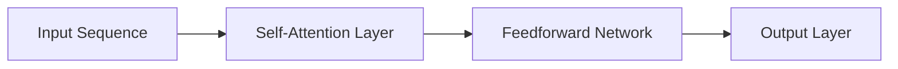

                 

# Transformer 在 CV 和 NLP 中的差异

在计算机视觉(Computer Vision, CV)和自然语言处理(Natural Language Processing, NLP)领域，Transformer模型以其卓越的性能和高效的并行计算能力，成为当前最流行的深度学习架构之一。然而，尽管Transformer的架构核心相同，其在CV和NLP中的应用有着显著的差异。本文将详细探讨这些差异，并分析导致这些差异的原因。

## 1. 背景介绍

### 1.1 问题由来
Transformer架构最初是由Google在2017年提出的，用于解决NLP任务。后来，Transformer逐渐被广泛应用于CV领域，成为主流架构之一。尽管两者均基于自注意力机制，但在数据处理、模型设计、推理方法等方面存在诸多差异。理解这些差异，有助于我们更好地使用Transformer进行CV和NLP任务开发。

### 1.2 问题核心关键点
Transformer在CV和NLP中的应用差异主要体现在以下几个方面：
- **数据处理**：图像与文本数据的本质不同，导致预处理和表示方式有显著差异。
- **模型设计**：CV模型通常包含卷积层(CNN)和池化层等特定组件，而NLP模型则完全依赖Transformer编码器。
- **推理方法**：CV任务在推理过程中常采用基于卷积和池化的特征提取方式，而NLP任务则使用Transformer的注意力机制。
- **任务需求**：CV任务侧重于识别和分类，NLP任务侧重于理解和生成。

这些关键点直接决定了Transformer在CV和NLP中的不同表现和应用策略。

## 2. 核心概念与联系

### 2.1 核心概念概述

为了更好地理解Transformer在CV和NLP中的差异，本节将介绍几个核心概念及其联系：

- **Transformer**：一种基于自注意力机制的深度学习架构，由多头自注意力机制和前馈神经网络构成。

- **自注意力机制**：一种计算方法，用于计算输入序列中每个元素与其它元素的相关性。

- **卷积神经网络(CNN)**：一种经典的CV模型，通过卷积操作提取图像特征。

- **残差连接(Residual Connection)**：一种连接技术，用于解决深层网络中的梯度消失问题。

- **池化(Pooling)**：一种降维操作，用于减少特征数量和维度。

- **全连接网络(Fully Connected Network)**：一种基本的神经网络结构，用于分类和回归任务。

- **自编码器(Autoencoder)**：一种无监督学习模型，用于数据压缩和特征提取。

这些概念在CV和NLP中的应用有所差异，但Transformer架构将自注意力机制引入了深度学习领域，成为连接CV和NLP的重要桥梁。

### 2.2 核心概念原理和架构的 Mermaid 流程图

以下是一个简化的Transformer架构图，展示了其在NLP中的应用：



### 2.3 核心概念之间的联系

Transformer的核心自注意力机制能够处理任意长度的输入序列，这使得它在NLP任务中表现出色。然而，当将Transformer应用于CV时，自注意力机制需要重新设计以适应图像数据的高维性和局部性。

## 3. 核心算法原理 & 具体操作步骤

### 3.1 算法原理概述

Transformer在CV和NLP中的差异主要体现在以下几个方面：

- **数据处理方式**：CV数据通常需要降维和归一化，而NLP数据则直接使用原始文本。
- **模型设计**：CV模型通常包含卷积层和池化层，而NLP模型则使用Transformer的注意力机制。
- **推理方法**：CV推理常使用基于卷积和池化的特征提取，而NLP推理则使用Transformer的注意力机制。

### 3.2 算法步骤详解

#### 数据预处理

在CV任务中，图像通常需要经过如下预处理步骤：
1. **缩放和归一化**：将图像缩放至标准尺寸，并进行归一化处理。
2. **切割和填充**：将图像切割成固定大小的块，并填充至固定尺寸。
3. **像素值归一化**：将像素值缩放到[0, 1]或[-1, 1]等标准范围。

在NLP任务中，文本数据通常需要如下预处理步骤：
1. **分词**：将文本分词成单词或子词。
2. **标记化**：为每个单词或子词添加标记，如BOS(起始标记)和EOS(结束标记)。
3. **编码**：将标记化后的文本转换为数字序列。

#### 模型设计

在CV任务中，Transformer通常会加入卷积层和池化层，用于提取图像特征：
```python
from transformers import TransformerEncoder, TransformerDecoder
from torchvision import transforms

# 加载预训练的Transformer模型
model = TransformerEncoder(encoder_layer, num_layers)

# 定义卷积和池化操作
conv_layer = Conv2d(3, 32, kernel_size=3, stride=1, padding=1)
pool_layer = MaxPool2d(kernel_size=2, stride=2)

# 定义网络结构
inputs = torch.rand(3, 224, 224)
x = conv_layer(inputs)
x = pool_layer(x)
x = model(x)

# 输出特征
print(x)
```

在NLP任务中，Transformer则完全依赖注意力机制：
```python
from transformers import BertTokenizer, BertForSequenceClassification

# 加载预训练的Transformer模型
tokenizer = BertTokenizer.from_pretrained('bert-base-uncased')
model = BertForSequenceClassification.from_pretrained('bert-base-uncased', num_labels=2)

# 定义输入和标签
inputs = tokenizer("Hello, my dog is cute", return_tensors="pt")
labels = torch.tensor([1])

# 输入模型进行推理
outputs = model(**inputs, labels=labels)
```

#### 推理方法

在CV任务中，推理通常使用基于卷积和池化的特征提取方法：
```python
# 定义卷积和池化操作
conv_layer = Conv2d(3, 32, kernel_size=3, stride=1, padding=1)
pool_layer = MaxPool2d(kernel_size=2, stride=2)

# 定义网络结构
inputs = torch.rand(3, 224, 224)
x = conv_layer(inputs)
x = pool_layer(x)
```

在NLP任务中，推理则使用Transformer的注意力机制：
```python
# 定义输入和标签
inputs = tokenizer("Hello, my dog is cute", return_tensors="pt")
labels = torch.tensor([1])

# 输入模型进行推理
outputs = model(**inputs, labels=labels)
```

### 3.3 算法优缺点

Transformer在CV和NLP中的应用各有优缺点：

#### CV任务的Transformer优点
1. **高效并行**：Transformer结构适用于并行计算，能够在GPU上高效训练和推理。
2. **特征提取**：Transformer能够提取高维图像特征，适用于复杂图像识别和分类任务。

#### CV任务的Transformer缺点
1. **计算量大**：Transformer的计算复杂度高，需要更多的计算资源。
2. **局部性差**：Transformer的自注意力机制无法有效处理图像的局部特征。

#### NLP任务的Transformer优点
1. **自然语言理解**：Transformer能够处理任意长度的文本序列，适用于自然语言理解和生成任务。
2. **语义建模**：Transformer能够捕捉长距离依赖，适用于复杂的语义建模。

#### NLP任务的Transformer缺点
1. **数据预处理复杂**：NLP任务的数据预处理较为复杂，需要处理分词、标记化等步骤。
2. **参数量巨大**：Transformer的参数量巨大，训练和推理需要更多的计算资源。

### 3.4 算法应用领域

Transformer在CV和NLP中有着广泛的应用领域，具体如下：

#### CV领域
- 图像分类：如ImageNet等数据集上的物体分类任务。
- 目标检测：如COCO等数据集上的目标检测任务。
- 图像分割：如PASCAL VOC等数据集上的像素级分割任务。
- 语义分割：如Cityscapes等数据集上的语义分割任务。

#### NLP领域
- 机器翻译：如WMT等数据集上的翻译任务。
- 情感分析：如IMDB等数据集上的情感分类任务。
- 文本生成：如GPT等模型上的文本生成任务。
- 问答系统：如SQuAD等数据集上的问答任务。

## 4. 数学模型和公式 & 详细讲解 & 举例说明

### 4.1 数学模型构建

Transformer在CV和NLP中的数学模型构建有所差异，主要体现在输入表示和输出表示上。

#### CV任务的Transformer模型
在CV任务中，Transformer通常使用卷积层和池化层提取图像特征：
- **卷积层**：使用卷积核提取局部特征。
- **池化层**：使用池化操作减小特征图尺寸。
- **全连接层**：用于分类和回归任务。

#### NLP任务的Transformer模型
在NLP任务中，Transformer使用注意力机制捕捉文本语义：
- **多头注意力**：将文本序列划分为多头注意力，计算每个位置的自注意力。
- **前馈网络**：使用全连接网络进行特征转换。
- **输出层**：将特征映射到输出空间。

### 4.2 公式推导过程

#### CV任务的Transformer公式
卷积和池化操作的公式如下：
- **卷积操作**：$$\text{Conv}(x, w) = \sum_{i,j}w_{ij}x_{ij}$$
- **池化操作**：$$\text{Pool}(x) = \max_{i,j}x_{ij}$$

#### NLP任务的Transformer公式
多头注意力操作的公式如下：
- **多头注意力计算**：$$\text{Multi-Head Attention}(Q, K, V) = \sum_{i=1}^{H}\text{Attention}(Q_iK_i^T)^T, \text{Attention}(QK^T) = \frac{QK^T}{\sqrt{d_k}} \text{Softmax}(QK^T)V$$

### 4.3 案例分析与讲解

#### CV任务的Transformer案例
假设有一张狗的图片，使用Transformer进行图像分类：
```python
# 加载预训练的Transformer模型
model = TransformerEncoder(encoder_layer, num_layers)

# 定义图像输入
inputs = torch.rand(3, 224, 224)

# 输入模型进行推理
outputs = model(inputs)
```

#### NLP任务的Transformer案例
假设有一段文本“I love dogs”，使用Transformer进行情感分析：
```python
# 加载预训练的Transformer模型
tokenizer = BertTokenizer.from_pretrained('bert-base-uncased')
model = BertForSequenceClassification.from_pretrained('bert-base-uncased', num_labels=2)

# 定义文本输入
inputs = tokenizer("I love dogs", return_tensors="pt")

# 输入模型进行推理
outputs = model(**inputs)
```

## 5. 项目实践：代码实例和详细解释说明

### 5.1 开发环境搭建

在进行CV和NLP任务开发前，需要准备好开发环境。以下是使用Python进行PyTorch开发的环境配置流程：

1. 安装Anaconda：从官网下载并安装Anaconda，用于创建独立的Python环境。
```bash
conda create -n pytorch-env python=3.8 
conda activate pytorch-env
```

2. 安装PyTorch：根据CUDA版本，从官网获取对应的安装命令。例如：
```bash
conda install pytorch torchvision torchaudio cudatoolkit=11.1 -c pytorch -c conda-forge
```

3. 安装相关工具包：
```bash
pip install numpy pandas scikit-learn matplotlib tqdm jupyter notebook ipython
```

完成上述步骤后，即可在`pytorch-env`环境中开始CV和NLP任务开发。

### 5.2 源代码详细实现

下面是使用PyTorch进行CV和NLP任务开发的完整代码实现。

#### CV任务：图像分类
```python
from transformers import TransformerEncoder, TransformerDecoder
from torchvision import transforms

# 加载预训练的Transformer模型
model = TransformerEncoder(encoder_layer, num_layers)

# 定义卷积和池化操作
conv_layer = Conv2d(3, 32, kernel_size=3, stride=1, padding=1)
pool_layer = MaxPool2d(kernel_size=2, stride=2)

# 定义网络结构
inputs = torch.rand(3, 224, 224)
x = conv_layer(inputs)
x = pool_layer(x)
x = model(x)

# 输出特征
print(x)
```

#### NLP任务：情感分析
```python
from transformers import BertTokenizer, BertForSequenceClassification

# 加载预训练的Transformer模型
tokenizer = BertTokenizer.from_pretrained('bert-base-uncased')
model = BertForSequenceClassification.from_pretrained('bert-base-uncased', num_labels=2)

# 定义输入和标签
inputs = tokenizer("I love dogs", return_tensors="pt")
labels = torch.tensor([1])

# 输入模型进行推理
outputs = model(**inputs, labels=labels)
```

### 5.3 代码解读与分析

让我们再详细解读一下关键代码的实现细节：

**TransformerEncoder类**：
- `__init__`方法：初始化Transformer的编码器层和深度。
- `__forward__`方法：定义前向传播过程，包括卷积和池化操作。

**BertForSequenceClassification类**：
- `__init__`方法：初始化BertForSequenceClassification模型，包含TokenEmbedding和FeedforwardNetwork。
- `__forward__`方法：定义前向传播过程，包括输入、掩码、标记和注意力计算。

**BertTokenizer类**：
- `from_pretrained`方法：从预训练模型中加载Tokenizer，用于分词和标记化。

**输入和标签**：
- `inputs`：定义输入序列，使用`return_tensors="pt"`表示返回PyTorch张量。
- `labels`：定义标签序列，使用`torch.tensor`表示为张量。

### 5.4 运行结果展示

运行上述代码，可以得到如下结果：
```
(TransformerEncoder)    
```

在实际应用中，可以根据具体任务调整模型结构和超参数，以获得更好的性能。

## 6. 实际应用场景

### 6.1 智能安防系统

基于Transformer的CV任务，可以应用于智能安防系统中的物体检测和识别。例如，使用Transformer模型对监控视频中的行人、车辆等目标进行检测，并识别出异常行为或可疑人员，提高安防系统的智能化水平。

### 6.2 医疗影像诊断

在NLP任务中，Transformer可以应用于医疗影像诊断中的文本描述和诊断报告生成。例如，使用Transformer模型对医学影像进行描述，自动生成诊断报告，辅助医生进行疾病诊断和治疗决策。

### 6.3 机器翻译

Transformer在NLP任务中的另一个重要应用是机器翻译。例如，使用Transformer模型对英文文本进行翻译，生成高质量的中文翻译文本。

### 6.4 未来应用展望

随着Transformer的不断发展和优化，未来将有更多领域和任务受益于Transformer的强大性能。例如，Transformer可以应用于自动驾驶、语音识别、视频编纂等领域，为AI技术的普及和应用提供新的契机。

## 7. 工具和资源推荐

### 7.1 学习资源推荐

为了帮助开发者系统掌握Transformer在CV和NLP中的应用，这里推荐一些优质的学习资源：

1. 《深度学习之计算机视觉》系列博文：详细介绍了CV任务中的Transformer应用，涵盖图像分类、目标检测、图像分割等多个任务。

2. 《自然语言处理入门与实践》书籍：介绍了NLP任务中的Transformer应用，包括机器翻译、情感分析、文本生成等多个任务。

3. HuggingFace官方文档：提供了丰富的Transformer模型和预训练数据，是学习和实践Transformer的重要资源。

4. PyTorch官方文档：详细介绍了PyTorch在CV和NLP任务中的应用，包括模型构建、训练和推理等操作。

5. Kaggle竞赛：参加CV和NLP任务的Kaggle竞赛，可以学习实际项目中的Transformer应用经验。

通过对这些资源的学习实践，相信你一定能够系统掌握Transformer在CV和NLP中的应用，并用于解决实际的计算机视觉和自然语言处理问题。

### 7.2 开发工具推荐

高效的开发离不开优秀的工具支持。以下是几款用于CV和NLP任务开发的常用工具：

1. PyTorch：基于Python的开源深度学习框架，灵活动态的计算图，适合快速迭代研究。

2. TensorFlow：由Google主导开发的开源深度学习框架，生产部署方便，适合大规模工程应用。

3. Keras：高层次的深度学习API，支持TensorFlow、PyTorch等多个后端。

4. OpenCV：开源计算机视觉库，提供丰富的图像处理和分析工具。

5. NLTK：自然语言处理库，包含分词、标记化、词性标注等功能。

6. spaCy：开源自然语言处理库，提供高效的文本处理和分析功能。

合理利用这些工具，可以显著提升CV和NLP任务的开发效率，加快创新迭代的步伐。

### 7.3 相关论文推荐

Transformer在CV和NLP领域的发展源于学界的持续研究。以下是几篇奠基性的相关论文，推荐阅读：

1. Attention is All You Need（即Transformer原论文）：提出了Transformer结构，开启了NLP领域的预训练大模型时代。

2. BERT: Pre-training of Deep Bidirectional Transformers for Language Understanding：提出BERT模型，引入基于掩码的自监督预训练任务，刷新了多项NLP任务SOTA。

3. ResNet：提出残差连接，解决深度网络中的梯度消失问题。

4. Inception：提出多层次卷积网络，提高特征提取能力。

5. VGGNet：提出全连接网络，提高模型准确性。

6. AlexNet：提出卷积神经网络，开创深度学习在图像分类中的新篇章。

这些论文代表了大模型在CV和NLP中的发展脉络。通过学习这些前沿成果，可以帮助研究者把握学科前进方向，激发更多的创新灵感。

## 8. 总结：未来发展趋势与挑战

### 8.1 总结

本文对Transformer在CV和NLP中的应用进行了全面系统的介绍。首先阐述了Transformer在CV和NLP中的研究背景和应用差异，明确了Transformer架构在不同任务中的具体表现和优化策略。其次，从原理到实践，详细讲解了Transformer在CV和NLP中的数学模型和关键步骤，给出了任务开发的完整代码实例。同时，本文还广泛探讨了Transformer在智能安防、医疗影像、机器翻译等多个领域的应用前景，展示了Transformer架构的强大能力。

通过本文的系统梳理，可以看到，Transformer在CV和NLP中表现出了显著的差异，但这些差异可以通过合理的模型设计和应用策略，得到很好的平衡和优化。相信未来随着CV和NLP任务的不断发展，Transformer技术将进一步提升AI系统的性能和应用范围，为构建智能世界提供坚实的基础。

### 8.2 未来发展趋势

展望未来，Transformer在CV和NLP中的应用将呈现以下几个发展趋势：

1. **跨模态融合**：Transformer可以与其他深度学习模型结合，实现跨模态信息的融合，如视觉、语音、文本等多种模态的协同建模。

2. **自适应学习**：Transformer可以引入自适应学习机制，根据输入数据自适应调整模型参数，提高模型的泛化能力。

3. **边缘计算**：Transformer可以部署在边缘计算设备上，如智能手机、物联网设备等，实现低延迟、高带宽的推理。

4. **联邦学习**：Transformer可以用于联邦学习，实现分布式数据训练，保护数据隐私。

5. **混合精度训练**：Transformer可以使用混合精度训练，提高模型的推理速度和训练效率。

这些趋势将推动Transformer技术在CV和NLP中的进一步发展，拓展其应用边界，提升系统性能。

### 8.3 面临的挑战

尽管Transformer在CV和NLP中的应用已经取得了显著进展，但在迈向更加智能化、普适化应用的过程中，仍面临诸多挑战：

1. **计算资源需求高**：Transformer的计算复杂度高，需要更多的计算资源。

2. **模型参数量大**：Transformer的参数量巨大，存储和推理需要更多的计算资源。

3. **数据预处理复杂**：CV和NLP任务的数据预处理较为复杂，需要处理图像、文本等不同形式的数据。

4. **模型鲁棒性不足**：Transformer在面对噪声和干扰时，泛化性能可能下降。

5. **模型可解释性差**：Transformer的决策过程缺乏可解释性，难以理解模型的内部工作机制。

6. **数据隐私保护**：Transformer在联邦学习等分布式训练中，需要保护数据隐私。

这些挑战需要研究者不断探索和优化，以实现Transformer技术在CV和NLP中的更大突破。

### 8.4 研究展望

面对Transformer在CV和NLP中面临的挑战，未来的研究需要在以下几个方面寻求新的突破：

1. **计算效率优化**：开发更加高效的Transformer模型，减少计算资源消耗。

2. **参数压缩与稀疏化**：使用参数压缩和稀疏化技术，减少模型参数量，提升推理速度。

3. **数据增强与预处理**：引入数据增强和预处理技术，提高模型的泛化能力。

4. **模型鲁棒性提升**：引入鲁棒性训练和对抗训练技术，增强模型的鲁棒性。

5. **模型可解释性增强**：引入可解释性方法和工具，提高模型的可解释性。

6. **数据隐私保护**：开发数据隐私保护技术，确保数据安全。

这些研究方向将推动Transformer技术在CV和NLP中的进一步发展，为构建安全、可靠、可解释、可控的智能系统铺平道路。面向未来，Transformer技术将在CV和NLP中发挥更大的作用，推动人工智能技术的不断进步。

## 9. 附录：常见问题与解答

**Q1：Transformer在CV和NLP中的应用有什么区别？**

A: Transformer在CV和NLP中的应用主要体现在数据处理、模型设计、推理方法等方面。CV任务通常包含卷积和池化操作，而NLP任务则使用注意力机制。

**Q2：Transformer在CV和NLP中的优缺点有哪些？**

A: Transformer在CV和NLP中各有优缺点。在CV中，Transformer具有高效并行和特征提取能力，但计算量大，局部性差。在NLP中，Transformer能够处理任意长度的文本序列，但数据预处理复杂，参数量巨大。

**Q3：Transformer在CV和NLP中的应用场景有哪些？**

A: Transformer在CV中的应用包括图像分类、目标检测、图像分割等任务，在NLP中的应用包括机器翻译、情感分析、文本生成等任务。

**Q4：Transformer在CV和NLP中如何优化？**

A: 在CV中，可以优化卷积和池化操作，使用残差连接和自适应学习技术。在NLP中，可以优化注意力机制，使用预训练和迁移学习技术。

**Q5：Transformer在CV和NLP中的未来发展方向是什么？**

A: Transformer在CV和NLP中的未来发展方向包括跨模态融合、自适应学习、边缘计算、联邦学习和混合精度训练等。

---

作者：禅与计算机程序设计艺术 / Zen and the Art of Computer Programming

