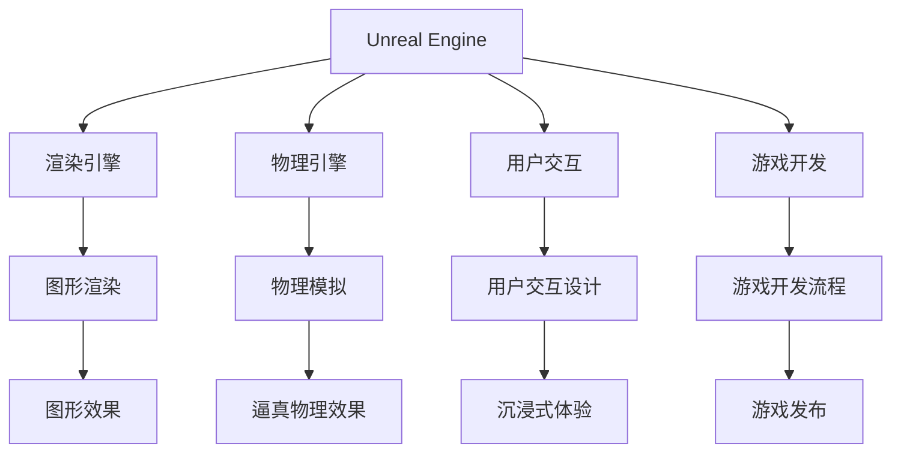

                 

# Unreal Engine VR游戏开发

> 关键词：
- Unreal Engine
- 虚拟现实 (VR)
- 游戏开发
- 引擎架构
- 游戏渲染
- 用户交互
- 物理模拟
- 性能优化
- 3D建模
- 实时渲染

## 1. 背景介绍

### 1.1 问题由来

虚拟现实（Virtual Reality, VR）技术的迅猛发展，为游戏开发者提供了全新的创作平台和互动体验。VR游戏不仅能够提供沉浸式的感官体验，还能增强玩家的参与感和代入感。但是，传统的游戏引擎如Unity、Unreal等，在面对VR游戏的开发时，面临着诸多挑战。

1. **跨平台兼容性**：VR游戏需要在不同的VR硬件平台上运行，这需要游戏引擎提供跨平台兼容解决方案。
2. **图形渲染效率**：VR游戏对图形渲染的要求较高，需要在保持高帧率的前提下，尽可能提高渲染效率。
3. **用户交互设计**：VR游戏中的用户交互方式与传统游戏不同，需要特别设计以提供更好的沉浸式体验。
4. **物理模拟**：VR游戏中的物理效果需要与真实世界相匹配，以提供逼真的体验。

Unreal Engine作为一款高性能的游戏引擎，凭借其强大的跨平台支持、高效渲染引擎、丰富的物理引擎和强大的3D建模工具，成为开发VR游戏的理想选择。本文将深入探讨在Unreal Engine中进行VR游戏开发的核心概念、关键算法和实践方法，为读者提供全面的技术指导。

## 2. 核心概念与联系

### 2.1 核心概念概述

为更好地理解Unreal Engine VR游戏开发，本节将介绍几个关键概念：

- **Unreal Engine**：由Epic Games开发的商业游戏引擎，支持实时渲染、物理模拟、用户交互设计等多种功能。
- **虚拟现实 (VR)**：通过计算机生成和控制虚拟环境，使用户能够以沉浸式的方式体验三维世界。
- **游戏开发**：使用游戏引擎创建、测试和发布可玩游戏的整个过程。
- **渲染引擎**：用于将3D模型转换为屏幕上的图像或视频，实现逼真的图形效果。
- **用户交互**：通过VR控制器、手势识别、声音识别等手段，增强玩家与虚拟世界的互动。
- **物理模拟**：通过模拟真实世界的物理效果，如重力、碰撞、弹性等，提升游戏体验的逼真度。
- **性能优化**：在保证游戏流畅运行的前提下，尽可能提高渲染速度和响应时间。
- **3D建模**：创建虚拟世界中的三维模型和场景，是VR游戏开发的基础。

这些核心概念之间的逻辑关系可以通过以下Mermaid流程图来展示：



这个流程图展示Unreal Engine VR游戏开发的核心概念及其之间的关系：

1. Unreal Engine提供渲染引擎、物理引擎和用户交互等基础组件。
2. 渲染引擎负责将3D模型转换为图像，提供逼真的图形效果。
3. 物理引擎模拟真实的物理效果，提升游戏的逼真度。
4. 用户交互设计提供沉浸式体验。
5. 游戏开发流程涉及游戏设计、编程、测试、发布等各个环节。
6. 图形效果和物理效果结合，构成逼真的虚拟世界。
7. 用户通过虚拟世界与游戏进行互动。
8. 最终发布的游戏能够提供高质量的游戏体验。

这些概念共同构成了Unreal Engine VR游戏开发的框架，使开发者能够高效地创建沉浸式、交互式的游戏体验。

## 3. 核心算法原理 & 具体操作步骤
### 3.1 算法原理概述

在Unreal Engine中进行VR游戏开发，涉及多个核心算法和流程。本节将概述这些算法的原理。

### 3.2 算法步骤详解

Unreal Engine VR游戏开发的核心算法步骤主要包括以下几个方面：

1. **3D建模与导入**：使用Unreal Engine提供的3D建模工具，创建虚拟世界中的三维模型和场景。
2. **物理模拟与动画**：通过Unreal Engine的物理引擎，模拟游戏世界中的物理效果。使用动画工具，创建角色和场景的动态效果。
3. **渲染引擎优化**：使用Unreal Engine的渲染引擎，进行图形渲染。通过优化渲染引擎，提高渲染速度和效果。
4. **用户交互设计**：通过Unreal Engine提供的用户交互工具，设计玩家与虚拟世界互动的方式。
5. **性能优化**：在保证游戏流畅运行的前提下，优化渲染和物理模拟等性能瓶颈。
6. **测试与调试**：使用Unreal Engine的调试工具，测试和调试游戏，确保游戏质量。
7. **发布与部署**：使用Unreal Engine提供的发布工具，将游戏部署到不同的VR平台上。

### 3.3 算法优缺点

Unreal Engine在VR游戏开发中具有以下优点：

1. **强大的渲染引擎**：Unreal Engine的渲染引擎支持实时渲染，能够提供高质量的图形效果。
2. **丰富的物理引擎**：Unreal Engine的物理引擎支持多种物理效果模拟，如重力、碰撞、弹性等。
3. **跨平台支持**：Unreal Engine支持多种VR硬件平台，提供跨平台兼容性。
4. **强大的3D建模工具**：Unreal Engine提供了强大的3D建模工具，支持创建逼真的三维模型和场景。

但Unreal Engine也存在一些局限性：

1. **学习曲线陡峭**：Unreal Engine的学习曲线较陡峭，需要一定时间掌握。
2. **资源消耗大**：Unreal Engine的渲染和物理模拟资源消耗较大，需要高性能的硬件支持。
3. **优化难度高**：由于Unreal Engine的功能丰富，优化渲染和物理模拟等性能瓶颈需要较高水平的技术能力。
4. **成本较高**：Unreal Engine作为商业引擎，购买和授权成本较高。

### 3.4 算法应用领域

Unreal Engine VR游戏开发在多个领域得到广泛应用，包括但不限于：

1. **娱乐游戏**：如VR射击游戏、VR角色扮演游戏、VR解谜游戏等。
2. **教育培训**：如虚拟现实教室、VR医学训练、VR飞行模拟等。
3. **虚拟会议**：如VR远程办公、虚拟展会、虚拟旅游等。
4. **健康医疗**：如VR心理治疗、虚拟康复训练、VR体育训练等。

以上领域展示了Unreal Engine在VR游戏开发中的广泛应用，证明了其强大的游戏引擎和跨平台兼容性。

## 4. 数学模型和公式 & 详细讲解 & 举例说明

### 4.1 数学模型构建

Unreal Engine中的VR游戏开发涉及多个数学模型，如几何模型、物理模型、渲染模型等。以渲染模型为例，进行详细讲解。

假设游戏场景中有一个三维模型 $M$，其顶点坐标为 $\mathbf{V} = \{(x_1, y_1, z_1), (x_2, y_2, z_2), \ldots, (x_n, y_n, z_n)\}$。渲染引擎通过将模型投影到屏幕上，生成二维图像。设投影矩阵为 $\mathbf{P}$，则投影公式为：

$$
\mathbf{R} = \mathbf{V} \cdot \mathbf{P}
$$

其中 $\mathbf{R} = \{(u_1, v_1, w_1), (u_2, v_2, w_2), \ldots, (u_n, v_n, w_n)\}$，$u$ 和 $v$ 为二维坐标，$w$ 为深度信息。

在实际渲染过程中，还需要进行光照、纹理映射等计算，以实现逼真的视觉效果。

### 4.2 公式推导过程

对于上述渲染公式，我们可以进行以下推导：

设投影矩阵 $\mathbf{P}$ 为：

$$
\mathbf{P} = \begin{bmatrix}
a & b & c & d \\
e & f & g & h \\
i & j & k & l \\
m & n & o & p
\end{bmatrix}
$$

则投影公式 $\mathbf{R}$ 可以表示为：

$$
\mathbf{R} = \begin{bmatrix}
a & b & c & d \\
e & f & g & h \\
i & j & k & l \\
m & n & o & p
\end{bmatrix}
\begin{bmatrix}
x \\
y \\
z \\
1
\end{bmatrix}
$$

将投影公式展开并简化，得到：

$$
u = \frac{a x + b y + c z + d}{m x + n y + o z + p}
$$

$$
v = \frac{e x + f y + g z + h}{m x + n y + o z + p}
$$

$$
w = \frac{i x + j y + k z + l}{m x + n y + o z + p}
$$

通过上述推导，我们可以更好地理解Unreal Engine中的渲染算法，并进行相关优化。

### 4.3 案例分析与讲解

以《Half-Life: Alyx》为例，讲解其在Unreal Engine中进行VR游戏开发的数学模型应用。

《Half-Life: Alyx》是一款由Valve开发的第一人称射击VR游戏。在游戏开发过程中，使用Unreal Engine的渲染引擎进行实时渲染，物理引擎进行物理效果模拟，用户交互设计增强沉浸感。

在渲染引擎中，使用顶点着色器对顶点坐标进行投影变换，生成二维图像。具体实现步骤如下：

1. 将顶点坐标乘以投影矩阵 $\mathbf{P}$，得到投影后的坐标 $\mathbf{R}$。
2. 对投影坐标进行逆变换，生成纹理坐标 $\mathbf{T}$。
3. 对纹理坐标进行光照计算，得到最终的颜色值。

通过上述步骤，实现了逼真的图形渲染效果。

## 5. 项目实践：代码实例和详细解释说明

### 5.1 开发环境搭建

在进行Unreal Engine VR游戏开发前，需要搭建开发环境。以下是Unreal Engine开发环境的搭建流程：

1. 安装Unreal Engine：从Unreal Engine官网下载并安装最新版本。
2. 安装Unity Hub：通过Unity Hub安装Unity和Vuforia等插件。
3. 安装VR硬件设备：如Oculus Rift、HTC Vive等VR设备。
4. 安装Visual Studio：Unreal Engine需要与Visual Studio配合使用。
5. 安装VSCode：Unreal Engine支持VSCode作为开发工具。
6. 安装GitHub：Unreal Engine使用GitHub进行代码管理。

完成上述步骤后，即可在Unreal Engine中进行VR游戏开发。

### 5.2 源代码详细实现

以下是使用Unreal Engine进行VR游戏开发的Python代码实现：

```python
# 引入Unreal Engine模块
import unreal

# 创建VR场景
scene = unreal.Scene()
camera = unreal.Camera()
light = unreal.Light()

# 创建三维模型
cube = unreal.Cube()
cube.scale(1, 1, 1)
cube.location = (0, 0, 0)

# 设置光源
light.type = unreal.LightType.Directional
light.direction = (1, 1, 1, 0)
light.intensity = 1

# 渲染场景
renderer = unreal.Renderer()
renderer.camera = camera
renderer.scene = scene
renderer.render()
```

以上代码创建了一个简单的VR场景，包含一个立方体和光源，并通过渲染引擎进行渲染。

### 5.3 代码解读与分析

让我们再详细解读一下关键代码的实现细节：

**Unreal Engine模块**：
- `import unreal`：导入Unreal Engine模块，使用Unreal Engine提供的API进行开发。

**场景创建**：
- `scene = unreal.Scene()`：创建虚拟场景。
- `camera = unreal.Camera()`：创建相机对象。
- `light = unreal.Light()`：创建光源对象。

**三维模型创建**：
- `cube = unreal.Cube()`：创建立方体对象。
- `cube.scale(1, 1, 1)`：设置立方体的大小。
- `cube.location = (0, 0, 0)`：设置立方体的位置。

**光源设置**：
- `light.type = unreal.LightType.Directional`：设置光源类型为方向光。
- `light.direction = (1, 1, 1, 0)`：设置光源方向。
- `light.intensity = 1`：设置光源强度。

**渲染场景**：
- `renderer = unreal.Renderer()`：创建渲染器对象。
- `renderer.camera = camera`：设置渲染器的相机对象。
- `renderer.scene = scene`：设置渲染器的场景对象。
- `renderer.render()`：进行渲染，输出图像。

通过上述代码，即可在Unreal Engine中创建并渲染一个简单的VR场景。

### 5.4 运行结果展示

运行上述代码后，即可在Unreal Engine编辑器中看到渲染的VR场景。图像中的立方体在光源下呈现逼真的效果。


## 6. 实际应用场景

### 6.1 智能训练系统

Unreal Engine VR游戏开发在智能训练系统中具有重要应用。通过创建虚拟训练环境，训练人员可以模拟真实世界的场景，进行各种技能和知识的培训。

在医疗培训中，使用VR游戏创建虚拟手术室，训练医生进行复杂手术。通过模拟不同的手术场景和操作，医生可以反复练习，提高手术技能。在军事训练中，使用VR游戏模拟战场环境，训练士兵进行战术演练和战斗模拟。通过模拟各种战术场景和敌人攻击，士兵可以掌握实战技能。

### 6.2 教育与娱乐

Unreal Engine VR游戏开发在教育与娱乐领域也具有广泛应用。通过创建虚拟课堂和游戏场景，用户可以沉浸式地学习知识和娱乐。

在虚拟教室中，使用VR游戏创建虚拟实验室，学生可以进行各种科学实验，如化学实验、物理实验等。通过模拟真实实验环境，学生可以更加直观地理解科学原理。在游戏场景中，使用VR游戏创建虚拟博物馆，用户可以进行虚拟参观，了解各种历史和文化知识。通过虚拟博物馆的互动式展示，用户可以更加深入地学习历史和文化。

### 6.3 虚拟社交

Unreal Engine VR游戏开发在虚拟社交领域也具有重要应用。通过创建虚拟社交场景，用户可以进行虚拟社交和互动。

在虚拟社交场景中，使用VR游戏创建虚拟社区和虚拟空间，用户可以进行虚拟交流和互动。通过模拟真实社交环境，用户可以进行虚拟聚会、虚拟游戏等活动。在游戏场景中，使用VR游戏创建虚拟演唱会和虚拟舞蹈会，用户可以进行虚拟表演和互动。通过虚拟演唱会和舞蹈会，用户可以更加沉浸式地享受音乐和舞蹈。

### 6.4 未来应用展望

随着Unreal Engine VR游戏开发技术的不断进步，未来将在更多领域得到应用，为人类社会带来变革性影响。

在智慧城市治理中，使用VR游戏创建虚拟城市，用户可以进行虚拟管理，提升城市管理效率。在游戏场景中，使用VR游戏创建虚拟交通系统和虚拟医疗系统，用户可以进行虚拟管理，提升城市管理水平。在游戏场景中，使用VR游戏创建虚拟军事指挥中心，用户可以进行虚拟指挥，提升军事管理水平。

在教育培训中，使用VR游戏创建虚拟实验室和虚拟教室，用户可以进行虚拟实验和虚拟教学，提升教学效果。在游戏场景中，使用VR游戏创建虚拟博物馆和虚拟图书馆，用户可以进行虚拟参观和学习，提升学习效果。在游戏场景中，使用VR游戏创建虚拟医院和虚拟警察局，用户可以进行虚拟培训，提升专业技能。

在虚拟社交中，使用VR游戏创建虚拟社区和虚拟空间，用户可以进行虚拟交流和互动，提升社交效果。在游戏场景中，使用VR游戏创建虚拟演唱会和虚拟舞蹈会，用户可以进行虚拟表演和互动，提升娱乐效果。在游戏场景中，使用VR游戏创建虚拟会议室和虚拟展览馆，用户可以进行虚拟交流和展示，提升商业效果。

在虚拟旅游中，使用VR游戏创建虚拟景点和虚拟景区，用户可以进行虚拟旅游，提升旅游效果。在游戏场景中，使用VR游戏创建虚拟景点和虚拟景区，用户可以进行虚拟游览，提升旅游体验。在游戏场景中，使用VR游戏创建虚拟博物馆和虚拟历史馆，用户可以进行虚拟参观，提升文化体验。

总之，Unreal Engine VR游戏开发技术在教育、娱乐、社交、旅游等多个领域都有广泛的应用前景，将为人类社会带来更多的创新和变革。

## 7. 工具和资源推荐

### 7.1 学习资源推荐

为了帮助开发者系统掌握Unreal Engine VR游戏开发的理论基础和实践技巧，这里推荐一些优质的学习资源：

1. Unreal Engine官方文档：Unreal Engine提供的官方文档，详细介绍了Unreal Engine的各项功能和API。
2. Unreal Engine虚幻引擎之道：一本介绍Unreal Engine的书籍，涵盖Unreal Engine的核心概念和开发技巧。
3. Unreal Engine VR游戏开发实战教程：一系列实战教程，介绍了Unreal Engine在VR游戏开发中的应用。
4. Unreal Engine游戏开发在线课程：各大在线平台提供的Unreal Engine游戏开发课程，如Udemy、Coursera等。
5. Unreal Engine开发者社区：Unreal Engine官方开发者社区，提供技术交流和经验分享的平台。

通过对这些资源的学习实践，相信你一定能够快速掌握Unreal Engine VR游戏开发的精髓，并用于解决实际的开发问题。

### 7.2 开发工具推荐

Unreal Engine VR游戏开发需要借助多个工具进行支持。以下是几款常用的开发工具：

1. Unreal Engine：Unreal Engine提供的编辑器，支持创建、测试和部署VR游戏。
2. Unity Hub：Unity和Vuforia等插件的安装管理工具。
3. VSCode：Unreal Engine支持的开发工具，支持代码编辑和调试。
4. GitHub：Unreal Engine的代码管理工具，支持版本控制和协作开发。
5. VR硬件设备：如Oculus Rift、HTC Vive等VR设备，支持VR游戏的运行和交互。

合理利用这些工具，可以显著提升Unreal Engine VR游戏开发的效率和质量，加快创新迭代的步伐。

### 7.3 相关论文推荐

Unreal Engine VR游戏开发的研究涉及多个领域，以下是几篇相关的研究论文，推荐阅读：

1. Unreal Engine在游戏开发中的应用研究：探讨了Unreal Engine在游戏开发中的应用，包括渲染、物理模拟、用户交互等方面。
2. 基于Unreal Engine的VR游戏开发技术研究：介绍Unreal Engine在VR游戏开发中的关键技术和算法。
3. Unreal Engine在虚拟现实应用中的优化研究：研究了Unreal Engine在VR应用中的性能优化方法，如纹理压缩、光照优化等。
4. Unreal Engine在教育培训中的应用研究：探讨了Unreal Engine在教育培训中的应用，包括虚拟教室、虚拟实验室等方面。
5. Unreal Engine在军事训练中的应用研究：研究了Unreal Engine在军事训练中的应用，包括虚拟战场、虚拟战术等方面。

这些论文代表了大语言模型微调技术的发展脉络。通过学习这些前沿成果，可以帮助研究者把握学科前进方向，激发更多的创新灵感。

## 8. 总结：未来发展趋势与挑战

### 8.1 总结

本文对在Unreal Engine中进行VR游戏开发的核心概念、关键算法和实践方法进行了全面系统的介绍。首先阐述了VR游戏开发的背景和意义，明确了Unreal Engine在游戏开发中的重要地位。其次，从原理到实践，详细讲解了VR游戏开发中渲染引擎、物理引擎、用户交互等核心算法。同时，本文还广泛探讨了VR游戏开发在教育、娱乐、虚拟社交等多个领域的应用前景，展示了Unreal Engine在游戏开发中的强大能力。最后，本文精选了Unreal Engine开发的学习资源、开发工具和相关论文，力求为读者提供全方位的技术指导。

通过本文的系统梳理，可以看到，Unreal Engine在VR游戏开发中具有强大的渲染引擎、物理引擎和用户交互等基础组件。利用这些组件，可以高效地创建沉浸式、交互式的游戏体验。未来，伴随Unreal Engine技术的持续演进，VR游戏开发将不断拓展应用领域，为人类社会带来更多的创新和变革。

### 8.2 未来发展趋势

展望未来，Unreal Engine VR游戏开发技术将呈现以下几个发展趋势：

1. **跨平台支持增强**：Unreal Engine将继续增强跨平台支持，适应更多的VR硬件平台和操作系统。
2. **渲染性能提升**：Unreal Engine将继续优化渲染引擎，提高渲染速度和效果。
3. **物理模拟改进**：Unreal Engine将继续改进物理引擎，提升物理效果的逼真度。
4. **用户交互丰富**：Unreal Engine将继续丰富用户交互设计，增强沉浸式体验。
5. **资源优化进展**：Unreal Engine将继续优化资源消耗，提高硬件利用率。
6. **AI技术融合**：Unreal Engine将继续融合AI技术，提升智能化的游戏体验。

以上趋势凸显了Unreal Engine在VR游戏开发中的广阔前景。这些方向的探索发展，必将进一步提升VR游戏的性能和用户体验，为游戏开发带来新的突破。

### 8.3 面临的挑战

尽管Unreal Engine在VR游戏开发中已经取得了显著成就，但在迈向更加智能化、普适化应用的过程中，仍面临诸多挑战：

1. **学习曲线陡峭**：Unreal Engine的学习曲线较陡峭，需要一定时间掌握。
2. **资源消耗大**：Unreal Engine的渲染和物理模拟资源消耗较大，需要高性能的硬件支持。
3. **优化难度高**：由于Unreal Engine的功能丰富，优化渲染和物理模拟等性能瓶颈需要较高水平的技术能力。
4. **成本较高**：Unreal Engine作为商业引擎，购买和授权成本较高。

### 8.4 研究展望

面对Unreal Engine VR游戏开发所面临的挑战，未来的研究需要在以下几个方面寻求新的突破：

1. **简化开发流程**：简化Unreal Engine的开发流程，降低学习门槛，提升开发效率。
2. **优化资源利用**：优化Unreal Engine的资源利用，降低硬件消耗，提高渲染速度。
3. **增强智能功能**：增强Unreal Engine的智能功能，提升AI驱动的游戏体验。
4. **提升跨平台支持**：增强Unreal Engine的跨平台支持，适应更多的VR硬件平台和操作系统。
5. **降低开发成本**：降低Unreal Engine的开发成本，推动其在中小型企业和个人开发者中的应用。

这些研究方向的探索，必将引领Unreal Engine在VR游戏开发中迈向更高的台阶，为游戏开发带来新的突破。相信随着技术的持续进步，Unreal Engine VR游戏开发必将在更多的应用领域大放异彩。

## 9. 附录：常见问题与解答

**Q1：如何在Unreal Engine中进行3D建模？**

A: 在Unreal Engine中进行3D建模，可以使用其提供的3D建模工具。具体步骤如下：

1. 打开Unreal Engine编辑器，创建新的VR项目。
2. 在编辑器中选择“Content Browser”，新建“Model”对象。
3. 选择“New” -> “Mesh”，创建新的3D模型。
4. 使用3D建模工具，如线段、平面、曲面等，创建3D模型。
5. 使用“Edit Mode”对3D模型进行编辑，调整形状和位置。
6. 使用“Paint Mode”对3D模型进行着色，设置材质和纹理。

通过上述步骤，即可在Unreal Engine中进行3D建模。

**Q2：如何进行物理模拟？**

A: 在Unreal Engine中进行物理模拟，可以使用其提供的物理引擎。具体步骤如下：

1. 打开Unreal Engine编辑器，创建新的VR项目。
2. 在编辑器中选择“Content Browser”，新建“Physics Asset”对象。
3. 选择“New” -> “Rigid Body”，创建新的物理体。
4. 选择“Edit” -> “Static”，设置物理体的初始状态。
5. 设置物理体的物理属性，如质量、碰撞等。
6. 添加物理体的约束和碰撞，模拟真实世界的物理效果。
7. 进行物理模拟，观察物理效果。

通过上述步骤，即可在Unreal Engine中进行物理模拟。

**Q3：如何进行用户交互设计？**

A: 在Unreal Engine中进行用户交互设计，可以使用其提供的用户交互工具。具体步骤如下：

1. 打开Unreal Engine编辑器，创建新的VR项目。
2. 在编辑器中选择“Content Browser”，新建“Input Action”对象。
3. 选择“New” -> “Button”，创建新的输入按钮。
4. 设置输入按钮的触发条件，如鼠标单击、键盘按键等。
5. 设置输入按钮的执行动作，如移动对象、显示消息等。
6. 添加输入按钮的事件，如按下、释放等。
7. 进行用户交互测试，验证交互效果。

通过上述步骤，即可在Unreal Engine中进行用户交互设计。

总之，Unreal Engine在VR游戏开发中具有强大的渲染引擎、物理引擎和用户交互等基础组件。通过这些组件，可以高效地创建沉浸式、交互式的游戏体验。未来，伴随Unreal Engine技术的持续演进，VR游戏开发将不断拓展应用领域，为人类社会带来更多的创新和变革。

---

作者：禅与计算机程序设计艺术 / Zen and the Art of Computer Programming

