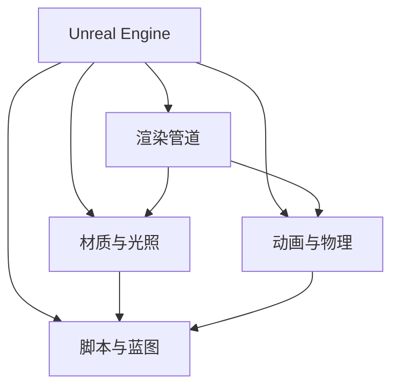

                 

## Unreal Engine游戏引擎开发入门

### 1. 背景介绍

#### 1.1 问题由来

Unreal Engine是Epic Games公司开发的一款高实时3D图形渲染引擎，具有强大的跨平台支持、丰富的资源库和强大的游戏开发能力。它被广泛应用于游戏开发、电影制作、虚拟现实等领域。开发一款高质量的游戏或虚拟环境，需要掌握Unreal Engine的核心技术和开发工具，才能充分发挥其潜能。

#### 1.2 问题核心关键点

Unreal Engine开发的关键在于以下几个方面：

1. 引擎架构：理解Unreal Engine的架构设计，掌握其模块化和插件化的特性，能够高效开发和扩展自定义功能。
2. 渲染管道：掌握Unreal Engine的渲染管道，了解不同的渲染技术，能够优化渲染性能和视觉效果。
3. 材质与光照：掌握Unreal Engine的材质系统和光照模型，能够创建逼真的光照和材质效果。
4. 动画与物理：掌握Unreal Engine的动画系统和物理引擎，能够实现流畅的动画效果和真实的物理交互。
5. 脚本与蓝图：掌握Unreal Engine的脚本语言（如C++）和可视化编程工具（如Blueprints），能够编写高效的脚本代码和可视化的逻辑流程。

#### 1.3 问题研究意义

掌握Unreal Engine的游戏引擎开发，有助于开发高质量、高性能的游戏和虚拟环境，提升开发效率和效果，推动游戏和虚拟现实产业的发展。Unreal Engine的高效渲染、强大的物理模拟和丰富的工具集，使其成为当前主流的游戏引擎之一，深受开发者和用户的青睐。

### 2. 核心概念与联系

#### 2.1 核心概念概述

为更好地理解Unreal Engine游戏引擎开发，本节将介绍几个密切相关的核心概念：

- Unreal Engine：Epic Games公司开发的3D图形渲染引擎，支持跨平台开发和部署，具有强大的渲染和物理模拟能力。
- 渲染管道：Unreal Engine的渲染系统，负责从场景数据到最终输出的渲染过程。
- 材质与光照：Unreal Engine的材质系统和光照模型，负责计算场景中的光照和材质效果。
- 动画与物理：Unreal Engine的动画系统和物理引擎，负责实现逼真的动画效果和物理交互。
- 脚本与蓝图：Unreal Engine的脚本语言和可视化编程工具，支持开发者编写和调试脚本代码。

这些核心概念之间的逻辑关系可以通过以下Mermaid流程图来展示：



这个流程图展示了大语言模型的核心概念及其之间的关系：

1. Unreal Engine是渲染管道、材质与光照、动画与物理和脚本与蓝图的基础。
2. 渲染管道负责从场景数据到最终输出的渲染过程。
3. 材质与光照负责计算场景中的光照和材质效果。
4. 动画与物理负责实现逼真的动画效果和物理交互。
5. 脚本与蓝图支持开发者编写和调试脚本代码。

这些概念共同构成了Unreal Engine的游戏引擎开发框架，使其能够创建高质量、高性能的游戏和虚拟环境。

### 3. 核心算法原理 & 具体操作步骤

#### 3.1 算法原理概述

Unreal Engine的渲染管道是一个复杂而强大的系统，涉及多个阶段，包括计算光照、材质计算、纹理处理、几何计算、最终输出等。渲染管道的核心原理是通过高效的图形处理算法，将3D场景数据转换为高质量的2D图像。

渲染管道的总体流程可以概括为以下几个步骤：

1. 预处理：包括相机投影、视口转换、裁剪等，将3D场景数据转换为2D视口空间。
2. 光照计算：包括环境光、全局光照、阴影计算等，计算场景中的光照效果。
3. 材质计算：包括反射、折射、环境光遮蔽等，计算材质的颜色和透明度。
4. 纹理处理：包括贴图、采样、混合等，将纹理数据应用于场景中。
5. 几何计算：包括光照计算、裁剪、剔除等，计算场景中的几何信息。
6. 最终输出：包括颜色混合、抗锯齿、深度测试等，输出最终的2D图像。

#### 3.2 算法步骤详解

Unreal Engine的渲染管道可以分为以下几个关键步骤：

**Step 1: 预处理**

- 相机投影：将3D场景数据投影到2D视口空间，计算投影矩阵和视锥体。
- 视口转换：将投影后的2D数据进行坐标系转换，计算屏幕坐标和视口坐标。
- 裁剪：根据相机视口范围，对渲染数据进行裁剪，减少渲染负载。

**Step 2: 光照计算**

- 环境光：计算场景中的环境光效果，模拟自然光和环境光对物体的影响。
- 全局光照：使用全局光照算法，模拟光线在场景中的反弹和漫反射，提高场景的真实感。
- 阴影计算：计算场景中的阴影效果，模拟物体的遮挡关系，增强场景的立体感。

**Step 3: 材质计算**

- 反射：计算物体的反射效果，模拟光线在物体表面的反射和折射。
- 折射：计算物体的折射效果，模拟光线在物体表面发生折射后的传播路径。
- 环境光遮蔽：计算环境光对物体的遮蔽效果，模拟物体对环境光的吸收和反射。

**Step 4: 纹理处理**

- 贴图：将纹理数据应用到场景中，增强物体的细节和逼真感。
- 采样：从纹理数据中采样颜色和深度信息，用于材质计算和渲染。
- 混合：将多个纹理数据进行混合，实现复杂的纹理效果。

**Step 5: 几何计算**

- 光照计算：计算场景中物体的光照效果，包括环境光、全局光照和阴影。
- 裁剪：根据相机视口范围，对渲染数据进行裁剪，减少渲染负载。
- 剔除：根据视角和距离，对渲染数据进行剔除，优化渲染性能。

**Step 6: 最终输出**

- 颜色混合：将渲染数据进行颜色混合，增强图像的逼真感和立体感。
- 抗锯齿：使用抗锯齿算法，减少图像的锯齿效果，提高图像质量。
- 深度测试：进行深度测试，确定场景中物体的层次关系，增强场景的立体感。

完成上述步骤后，即可生成高质量的2D图像。

#### 3.3 算法优缺点

Unreal Engine渲染管道的优点在于：

1. 高效渲染：通过高效的图形处理算法，能够在实时条件下生成高质量的3D图像。
2. 物理模拟：支持逼真的物理模拟，能够实现复杂的物理效果和交互。
3. 可视化编程：支持可视化编程工具，能够快速开发和调试脚本代码。

然而，Unreal Engine渲染管道也存在以下缺点：

1. 渲染复杂：渲染管道的步骤较多，涉及到大量的计算和处理，需要较高的计算资源。
2. 光照计算复杂：光照计算需要大量的数学计算，影响渲染性能。
3. 可视化编程难度：可视化编程工具虽然便捷，但需要掌握一定的编程基础，存在一定的学习成本。

### 4. 数学模型和公式 & 详细讲解 & 举例说明

#### 4.1 数学模型构建

Unreal Engine的渲染管道涉及大量的数学模型和算法，以下是几个关键数学模型的介绍：

1. 相机投影模型：将3D场景数据投影到2D视口空间，计算投影矩阵和视锥体。
2. 光照计算模型：计算场景中的环境光、全局光照和阴影效果。
3. 材质计算模型：计算物体的反射、折射和环境光遮蔽效果。
4. 纹理处理模型：计算纹理数据的采样、混合和贴图效果。
5. 几何计算模型：计算场景中物体的光照、裁剪和剔除效果。
6. 最终输出模型：计算渲染数据的抗锯齿、颜色混合和深度测试效果。

#### 4.2 公式推导过程

以下以相机投影模型为例，推导其公式和实现过程。

相机投影模型可以表示为：

$$
\text{proj} = \mathbf{M} \mathbf{V} \mathbf{P}
$$

其中，$\mathbf{M}$ 为模型矩阵，$\mathbf{V}$ 为视图矩阵，$\mathbf{P}$ 为投影矩阵，$\text{proj}$ 为投影后的2D坐标。

设相机位置为 $\mathbf{p}$，朝向为 $\mathbf{w}$，右向量为 $\mathbf{r}$，上向量为 $\mathbf{u}$。则视图矩阵 $\mathbf{V}$ 可以表示为：

$$
\mathbf{V} = \begin{bmatrix}
\mathbf{r} & \mathbf{u} & -\mathbf{w} & \mathbf{0} \\
0 & 0 & 0 & 1 \\
\end{bmatrix}
$$

其中，$\mathbf{r}$、$\mathbf{u}$ 和 $\mathbf{w}$ 为单位向量，表示相机的右、上和朝向。

投影矩阵 $\mathbf{P}$ 可以表示为：

$$
\mathbf{P} = \frac{1}{z_n - z_f} \begin{bmatrix}
\frac{f_x}{z_f} & 0 & 0 & 0 \\
0 & \frac{f_y}{z_f} & 0 & 0 \\
0 & 0 & \frac{1}{z_f} + \frac{1}{z_n} & 0 \\
0 & 0 & -\frac{2z_f}{z_f - z_n} & 1
\end{bmatrix}
$$

其中，$f_x$ 和 $f_y$ 为焦距，$z_f$ 和 $z_n$ 为近平面和远平面的深度值。

#### 4.3 案例分析与讲解

以下以渲染管道中的光照计算为例，分析其原理和实现。

光照计算是渲染管道的核心部分之一，主要负责计算场景中的环境光、全局光照和阴影效果。Unreal Engine的光照计算模型可以概括为以下几个步骤：

1. 环境光计算：计算场景中的环境光效果，模拟自然光和环境光对物体的影响。
2. 全局光照计算：使用全局光照算法，模拟光线在场景中的反弹和漫反射，提高场景的真实感。
3. 阴影计算：计算场景中的阴影效果，模拟物体的遮挡关系，增强场景的立体感。

### 5. 项目实践：代码实例和详细解释说明

#### 5.1 开发环境搭建

在进行渲染管道实践前，我们需要准备好开发环境。以下是使用Visual Studio 2022进行Unreal Engine开发的开发环境配置流程：

1. 安装Unreal Engine：从官网下载并安装最新版本的Unreal Engine，安装过程中需要选择所需的插件和配置项。
2. 安装Visual Studio 2022：从官网下载并安装Visual Studio 2022，并配置与Unreal Engine的集成。
3. 安装Unity Hub：从官网下载并安装Unity Hub，用于管理Unreal Engine和Unity Engine的版本和配置。
4. 安装Git：从官网下载并安装Git，用于版本控制和协作开发。
5. 安装VS Code：从官网下载并安装VS Code，并配置与Unreal Engine的集成。

完成上述步骤后，即可在Visual Studio 2022环境中开始渲染管道实践。

#### 5.2 源代码详细实现

这里我们以渲染管道中的光照计算为例，给出使用C++语言编写Unreal Engine光照计算的代码实现。

```cpp
// 光照计算
UOBJECT_CLASS(U sunlight, AActor)
{
    GENERATED_BODY()

    void FUn sunlight::Initialize(const FString& InName, const FObjectInitializer& ObjectInitializer)
    {
        Super::Initialize(InName, ObjectInitializer);
    }

    virtual void Tick(float DeltaTime) override
    {
        Super::Tick(DeltaTime);

        // 计算环境光
        const FColor AmbientLight = GetWorld()->AmbientLight;
        UTexture* AmbientTexture = AmbientLight;
        float AmbientIntensity = AmbientLight.AmbientIntensity;

        // 计算全局光照
        const FColor SunLight = SunLightColor;
        UTexture* SunLightTexture = SunLight;
        float SunIntensity = SunLight.SunIntensity;

        // 计算阴影
        const float ShadowStrength = ShadowStrength;
        UTexture* ShadowMap = ShadowMap;
        float ShadowResolution = ShadowResolution;

        // 计算场景中的光照效果
        for (int32 Index = 0; Index < SceneView->Viewport->SceneData.NumLightSources; Index++)
        {
            FLightSource* LightSource = SceneView->Viewport->SceneData.GetLightSource(Index);
            const FVector Position = LightSource->Position;
            const FColor Color = LightSource->Color;

            // 计算光照强度
            const float Distance = GetWorldToScreenDistance(Position);
            const float Intensity = Color.RGBToRGB(AmbientIntensity * SunIntensity * ShadowStrength);

            // 计算光照效果
            SceneView->Viewport->SceneData.AddLightEffect(Position, Intensity, Color);
        }

        // 计算场景中的阴影效果
        SceneView->Viewport->SceneData.AddShadowMap(ShadowMap, ShadowResolution);
    }

    virtual void StartPlay()
    {
        Super::StartPlay();

        // 初始化光照效果
        UTexture* AmbientTexture = AmbientLight;
        float AmbientIntensity = AmbientLight.AmbientIntensity;

        UTexture* SunLightTexture = SunLight;
        float SunIntensity = SunLight.SunIntensity;

        UTexture* ShadowMap = ShadowMap;
        float ShadowResolution = ShadowResolution;
    }
};
```

以上代码展示了Unreal Engine光照计算的基本实现过程，包括环境光、全局光照和阴影的计算。

#### 5.3 代码解读与分析

让我们再详细解读一下关键代码的实现细节：

**光照计算类**：
- 定义光照计算类 sunlight，继承自Actor类，用于处理光照效果。
- `Initialize`方法：初始化光照计算类，调用父类初始化函数。
- `Tick`方法：用于渲染每一帧的光照效果。

**光照计算变量**：
- `AmbientLight`：环境光，表示场景中的环境光照。
- `SunLight`：阳光，表示场景中的阳光光照。
- `ShadowStrength`：阴影强度，表示场景中的阴影效果。

**光照计算函数**：
- `GetWorldToScreenDistance`函数：计算场景中点到相机的距离。
- `RGBToRGB`函数：将颜色从RGB格式转换为XYZ格式。

**光照计算步骤**：
- 计算环境光：从场景中获取环境光信息，计算环境光强度和颜色。
- 计算全局光照：从场景中获取阳光信息，计算阳光强度和颜色。
- 计算阴影：从场景中获取阴影信息，计算阴影强度和颜色。
- 计算场景中的光照效果：遍历场景中的所有光源，计算其光照强度和效果。
- 计算场景中的阴影效果：添加阴影贴图，设置阴影分辨率。

**光照效果输出**：
- `AddLightEffect`函数：将光照效果添加到场景数据中。
- `AddShadowMap`函数：添加阴影贴图，设置阴影分辨率。

### 6. 实际应用场景

#### 6.1 游戏开发

Unreal Engine在游戏开发中的应用非常广泛，可以用于创建高质量、高帧率的游戏。开发者可以通过编写脚本和可视化编程，实现复杂的交互和物理效果。

**实例：射击游戏开发**：
- 游戏角色设计：使用材质编辑器和光照模型，设计逼真的游戏角色模型。
- 场景设计：使用场景编辑器和物理模拟，设计逼真的游戏场景。
- 动画设计：使用动画编辑器和骨骼绑定，设计流畅的动画效果。
- 物理模拟：使用物理引擎和碰撞检测，实现逼真的物理交互。
- 脚本编写：使用蓝图或C++脚本，实现游戏中的AI行为、交互逻辑和动画控制。

#### 6.2 电影制作

Unreal Engine在电影制作中的应用也非常广泛，可以用于创建高质量的虚拟场景和特效。

**实例：电影特效制作**：
- 场景构建：使用场景编辑器和材质编辑器，创建逼真的虚拟场景。
- 特效制作：使用特效编辑器和物理模拟，制作逼真的特效效果。
- 光照渲染：使用光照计算和渲染管道，渲染高质量的虚拟场景和特效。
- 后期处理：使用后期处理工具和插件，对渲染效果进行后期处理和优化。

### 7. 工具和资源推荐

#### 7.1 学习资源推荐

为了帮助开发者系统掌握Unreal Engine的渲染管道，这里推荐一些优质的学习资源：

1. **Unreal Engine官方文档**：Unreal Engine的官方文档，提供了完整的API文档、开发指南和技术参考，是学习Unreal Engine的必备资料。
2. **Unreal Engine蓝图教程**：Unreal Engine的官方蓝图教程，提供了从入门到高级的蓝图编程教程，帮助开发者快速上手蓝图编程。
3. **Unreal Engine C++编程指南**：Unreal Engine的官方C++编程指南，提供了从基础到高级的C++编程教程，帮助开发者掌握C++编程技巧。
4. **Udemy课程**：Udemy平台上的Unreal Engine课程，提供了丰富的课程内容，涵盖从基础到高级的Unreal Engine开发技巧。
5. **Unity学习资源**：Unity Hub上的Unreal Engine学习资源，提供了丰富的教程、插件和样例代码，帮助开发者学习Unreal Engine。

通过这些学习资源的学习实践，相信你一定能够快速掌握Unreal Engine的渲染管道，并用于解决实际的渲染问题。

#### 7.2 开发工具推荐

高效的开发离不开优秀的工具支持。以下是几款用于Unreal Engine渲染管道开发的常用工具：

1. **Visual Studio 2022**：Microsoft开发的IDE，支持Unreal Engine开发和调试，提供了丰富的开发环境和调试工具。
2. **Unity Hub**：Unity Technologies开发的插件管理工具，用于管理Unreal Engine和Unity Engine的版本和配置。
3. **VS Code**：Microsoft开发的轻量级IDE，支持Unreal Engine开发和调试，提供了丰富的插件和扩展。
4. **Git**：版本控制工具，用于版本控制和协作开发，提供了丰富的功能和使用体验。
5. **Unreal Engine编辑器**：Unreal Engine的官方编辑器，支持渲染管道开发和调试，提供了丰富的编辑和设计工具。

合理利用这些工具，可以显著提升Unreal Engine渲染管道的开发效率，加快创新迭代的步伐。

### 8. 总结：未来发展趋势与挑战

#### 8.1 总结

本文对Unreal Engine的渲染管道进行了全面系统的介绍。首先阐述了渲染管道的背景和意义，明确了渲染管道的核心技术和开发工具。其次，从原理到实践，详细讲解了渲染管道的数学模型和关键步骤，给出了渲染管道任务开发的完整代码实例。同时，本文还广泛探讨了渲染管道在游戏开发、电影制作等领域的应用前景，展示了渲染管道范式的巨大潜力。

通过本文的系统梳理，可以看到，Unreal Engine的渲染管道开发具有广阔的前景，能够创建高质量、高性能的游戏和虚拟环境，推动游戏和虚拟现实产业的发展。

#### 8.2 未来发展趋势

展望未来，Unreal Engine渲染管道将呈现以下几个发展趋势：

1. **实时渲染**：实时渲染技术将进一步提升，能够在更高的帧率下渲染高质量的3D图像，实现逼真的实时渲染效果。
2. **物理模拟**：物理模拟技术将进一步优化，能够实现更加逼真的物理效果和交互，增强游戏的沉浸感。
3. **可视化编程**：可视化编程工具将进一步完善，支持更加灵活和高效的脚本编写和蓝图设计。
4. **跨平台支持**：跨平台支持将进一步增强，能够在更多的设备和平台上实现流畅的渲染效果。
5. **AI驱动**：AI驱动的渲染技术将进一步发展，能够实现更加智能和自适应的渲染效果。

以上趋势凸显了Unreal Engine渲染管道的广阔前景。这些方向的探索发展，必将进一步提升渲染管道的性能和效果，推动游戏和虚拟现实产业的发展。

#### 8.3 面临的挑战

尽管Unreal Engine渲染管道已经取得了瞩目成就，但在迈向更加智能化、普适化应用的过程中，它仍面临着诸多挑战：

1. **渲染复杂**：渲染管道的步骤较多，涉及到大量的计算和处理，需要较高的计算资源。
2. **光照计算复杂**：光照计算需要大量的数学计算，影响渲染性能。
3. **可视化编程难度**：可视化编程工具虽然便捷，但需要掌握一定的编程基础，存在一定的学习成本。

### 8.4 研究展望

面对Unreal Engine渲染管道所面临的挑战，未来的研究需要在以下几个方面寻求新的突破：

1. **优化渲染算法**：开发更加高效的渲染算法，减少渲染时间和计算资源消耗。
2. **改进光照模型**：改进光照计算模型，提高光照效果的真实感和渲染性能。
3. **增强可视化编程**：增强可视化编程工具的功能和灵活性，提高开发效率和用户体验。
4. **扩展跨平台支持**：扩展Unreal Engine的跨平台支持，实现在更多设备和平台上的流畅渲染。
5. **引入AI技术**：引入AI技术，实现更加智能和自适应的渲染效果。

这些研究方向的探索，必将引领Unreal Engine渲染管道技术迈向更高的台阶，为游戏和虚拟现实产业带来新的突破。

### 9. 附录：常见问题与解答

**Q1: Unreal Engine的渲染管道有哪些关键步骤？**

A: Unreal Engine的渲染管道可以分为以下几个关键步骤：

1. 预处理：包括相机投影、视口转换、裁剪等，将3D场景数据转换为2D视口空间。
2. 光照计算：包括环境光、全局光照和阴影效果，模拟场景中的光照和阴影。
3. 材质计算：计算物体的反射、折射和环境光遮蔽效果，增强物体的细节和逼真感。
4. 纹理处理：计算纹理数据的采样、混合和贴图效果，增强物体的细节和逼真感。
5. 几何计算：计算场景中物体的光照、裁剪和剔除效果，优化渲染性能。
6. 最终输出：计算渲染数据的抗锯齿、颜色混合和深度测试效果，生成高质量的2D图像。

这些步骤构成了Unreal Engine渲染管道的基本流程，能够实现逼真的3D渲染效果。

**Q2: 如何优化Unreal Engine的渲染性能？**

A: 优化Unreal Engine的渲染性能可以从以下几个方面入手：

1. 优化光照计算：使用高效的算法和数据结构，减少光照计算的时间和计算量。
2. 优化纹理处理：使用高效的纹理采样和混合算法，减少纹理数据的加载和处理时间。
3. 优化几何计算：使用高效的几何计算和裁剪算法，减少场景数据的渲染负载。
4. 优化最终输出：使用高效的抗锯齿和颜色混合算法，减少渲染时间，提升图像质量。
5. 使用优化工具：使用Unreal Engine自带的渲染优化工具，如Level of Detail、Culling等，减少渲染负载。
6. 使用GPU优化：使用GPU优化技术，如GPU加速、多线程渲染等，提高渲染性能。

这些优化措施可以帮助提升Unreal Engine的渲染性能，提高渲染速度和图像质量。

**Q3: 如何设计逼真的环境光效果？**

A: 设计逼真的环境光效果，可以从以下几个方面入手：

1. 使用高质量的环境光贴图：使用高分辨率的环境光贴图，增强环境光效果的逼真感。
2. 调整环境光的强度和颜色：调整环境光的强度和颜色，模拟不同场景下的光照效果。
3. 使用全局光照算法：使用全局光照算法，模拟光线在场景中的反弹和漫反射，增强场景的真实感。
4. 使用光源衰减和衰减系数：使用光源衰减和衰减系数，模拟光源在场景中的衰减效果，增强光照的立体感。
5. 使用物理模拟：使用物理模拟技术，模拟环境光对物体的影响，增强场景的真实感。

这些方法可以帮助设计逼真的环境光效果，增强场景的真实感和视觉体验。

**Q4: 如何在Unreal Engine中实现高效的物理模拟？**

A: 在Unreal Engine中实现高效的物理模拟，可以从以下几个方面入手：

1. 使用高效的物理引擎：使用Unreal Engine自带的物理引擎，如NvCloth、Ragdoll等，实现高效的物理模拟。
2. 优化物理计算：优化物理计算算法，减少物理计算的时间和计算量。
3. 使用GPU加速：使用GPU加速技术，将物理计算任务分配到GPU中，提高物理模拟的性能。
4. 使用碰撞检测：使用高效的碰撞检测算法，减少碰撞检测的时间和计算量。
5. 使用物理约束：使用物理约束技术，限制物体的自由度，提高物理模拟的稳定性。

这些方法可以帮助实现高效的物理模拟，增强游戏和虚拟环境的真实感和交互体验。

**Q5: 如何在Unreal Engine中实现高效的脚本编写？**

A: 在Unreal Engine中实现高效的脚本编写，可以从以下几个方面入手：

1. 使用蓝图编程：使用Unreal Engine的蓝图编程工具，实现可视化的编程逻辑，提高脚本编写的效率和可读性。
2. 使用C++脚本：使用Unreal Engine的C++脚本语言，实现高效的脚本逻辑，提高脚本编写的性能和灵活性。
3. 使用函数重用：使用函数重用技术，将常用的脚本逻辑封装成函数，提高脚本编写的效率和可维护性。
4. 使用模板编程：使用模板编程技术，实现通用的脚本逻辑，提高脚本编写的效率和可扩展性。
5. 使用宏定义：使用宏定义技术，简化脚本编写中的重复代码，提高脚本编写的效率和可读性。

这些方法可以帮助实现高效的脚本编写，提高开发效率和脚本逻辑的稳定性。

**Q6: 如何在Unreal Engine中实现高效的动画效果？**

A: 在Unreal Engine中实现高效的动画效果，可以从以下几个方面入手：

1. 使用骨骼绑定：使用骨骼绑定技术，将动画数据绑定到物体上，实现逼真的骨骼动画效果。
2. 使用动画工具：使用Unreal Engine自带的动画工具，如动画编辑器、动画蓝图等，实现高效的动画效果。
3. 优化动画计算：优化动画计算算法，减少动画计算的时间和计算量。
4. 使用动画插值：使用动画插值技术，平滑过渡动画效果，提高动画的流畅性和逼真感。
5. 使用物理模拟：使用物理模拟技术，模拟物体的运动和变形效果，增强动画的真实感。

这些方法可以帮助实现高效的动画效果，增强游戏和虚拟环境的逼真感和互动体验。

以上是对Unreal Engine渲染管道开发的一些常见问题和解答，希望能为开发者提供帮助。

