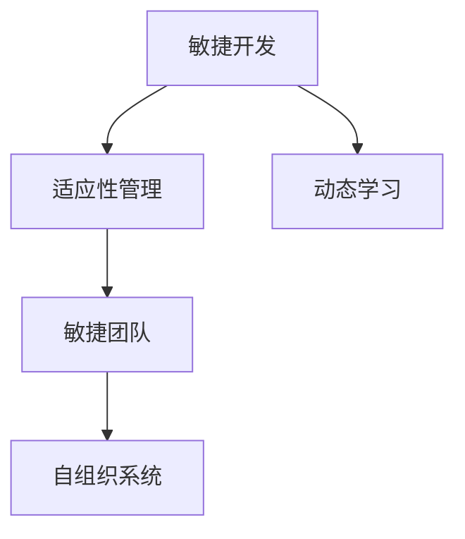

                 

# VUCA时代下的学习策略

> 关键词：
VUCA, 学习策略, 敏捷开发, 适应性管理, 动态学习, 技术栈演变, 数据驱动

## 1. 背景介绍

### 1.1 问题由来

当今世界正处在一个充满不确定性(Volatility)、多样性(Uncertainty)、复杂性(Complexity)和混沌性(Ambiguity)的VUCA时代。技术的快速发展和变化、市场需求的不断变化、外部环境的剧烈变化，使得传统单一、静态的学习和开发方式难以适应动态变化的环境。

为了应对这些挑战，敏捷开发、适应性管理和动态学习等策略应运而生。通过这些策略，企业可以更加灵活、高效地应对外部环境的变化，提升团队的适应能力和创新能力。

### 1.2 问题核心关键点

VUCA时代下的学习策略，强调适应性和动态性，通过敏捷开发、自适应管理和动态学习等方法，使团队能够灵活应对环境变化，快速迭代和优化。具体关键点包括：

- **敏捷开发**：强调灵活、快速、迭代性的开发过程，以适应快速变化的市场需求和技术环境。
- **适应性管理**：强调通过组织和管理方法，提升团队的适应性和灵活性，使其能够快速响应变化。
- **动态学习**：强调通过持续学习和自我优化，提升团队的学习能力和技术水平。

这些关键点共同构成了VUCA时代下学习策略的核心框架，使团队能够在不断变化的环境中保持竞争力。

### 1.3 问题研究意义

在VUCA时代下，敏捷开发、适应性管理和动态学习等策略，对于提升企业的竞争力、响应市场变化、推动技术进步具有重要意义：

1. **提升敏捷性**：敏捷开发可以提升团队的敏捷性，使团队能够快速响应市场变化和技术进步。
2. **增强适应性**：适应性管理可以提升团队的适应性，使团队能够更好地应对外部环境的变化。
3. **提升技术水平**：动态学习可以提升团队的技术水平，使其能够掌握最新的技术和工具。
4. **促进创新**：通过灵活的管理和持续学习，团队可以不断创新，推动技术进步和业务发展。

总之，在VUCA时代下，敏捷开发、适应性管理和动态学习等策略，对于企业的生存和发展具有重要价值。

## 2. 核心概念与联系

### 2.1 核心概念概述

为更好地理解VUCA时代下的学习策略，本节将介绍几个密切相关的核心概念：

- **敏捷开发(Agile Development)**：一种迭代、增量、自组织和自管理的开发方法，以应对快速变化的市场需求和技术环境。
- **适应性管理(Adaptive Management)**：通过组织和管理方法，提升团队的适应性和灵活性，使其能够快速响应变化。
- **动态学习(Dynamic Learning)**：通过持续学习和自我优化，提升团队的学习能力和技术水平。
- **敏捷团队(Agile Team)**：一种灵活、自组织、自我管理的团队，能够快速响应变化，实现高效的团队协作。
- **自组织系统(Self-Organizing System)**：一种具有高度自适应性和自我管理能力的系统，能够快速响应外部环境的变化。

这些核心概念之间的逻辑关系可以通过以下Mermaid流程图来展示：



这个流程图展示了大语言模型的核心概念及其之间的关系：

1. 敏捷开发通过迭代和增量开发，使团队能够灵活应对市场变化和技术进步。
2. 适应性管理通过组织和管理方法，提升团队的适应性和灵活性。
3. 动态学习通过持续学习和自我优化，提升团队的学习能力和技术水平。
4. 敏捷团队通过灵活的组织和管理，实现高效的团队协作。
5. 自组织系统通过高度自适应性和自我管理能力，快速响应外部环境的变化。

这些概念共同构成了VUCA时代下学习策略的理论框架，使其能够在不断变化的环境中保持竞争力。

## 3. 核心算法原理 & 具体操作步骤
### 3.1 算法原理概述

VUCA时代下的学习策略，本质上是一种适应性学习和动态优化的过程。其核心思想是：通过敏捷开发、适应性管理和动态学习等方法，使团队能够快速适应变化，提升整体效率和竞争力。

具体而言，学习策略的优化目标是最小化团队适应环境变化所需的时间成本和资源消耗，同时最大化团队的学习效率和创新能力。

### 3.2 算法步骤详解

VUCA时代下的学习策略，一般包括以下几个关键步骤：

**Step 1: 环境评估**

- 对外部环境进行全面评估，包括市场需求、技术进步、竞争对手变化等。
- 确定影响团队学习和发展的关键因素。

**Step 2: 制定学习计划**

- 根据环境评估结果，制定适合团队的学习计划。
- 确定学习目标、学习方式、学习资源等。

**Step 3: 实施敏捷开发**

- 采用敏捷开发方法，将学习任务分解为多个小的迭代和增量任务。
- 通过迭代和增量开发，快速响应环境变化。

**Step 4: 实施适应性管理**

- 采用适应性管理方法，提升团队的适应性和灵活性。
- 灵活调整团队结构和管理方法，使其能够快速响应变化。

**Step 5: 实施动态学习**

- 通过持续学习和自我优化，提升团队的学习能力和技术水平。
- 定期评估学习效果，进行必要的调整和优化。

**Step 6: 评估和反馈**

- 定期评估学习效果，获取团队反馈。
- 根据评估结果和反馈，调整学习策略。

以上是VUCA时代下学习策略的一般流程。在实际应用中，还需要针对具体团队和项目的特点，对学习策略的各个环节进行优化设计，如改进迭代周期、优化管理方法、引入更多学习资源等，以进一步提升学习效果。

### 3.3 算法优缺点

VUCA时代下的学习策略具有以下优点：

- **灵活性高**：通过敏捷开发和适应性管理，团队能够快速响应变化，提升适应能力。
- **学习能力强**：通过动态学习，团队能够持续学习和自我优化，提升学习能力和技术水平。
- **效率高**：通过迭代和增量开发，团队能够高效地完成任务，提升工作效率。
- **创新能力强**：通过灵活的管理和持续学习，团队能够不断创新，推动技术进步和业务发展。

同时，该策略也存在一定的局限性：

- **资源投入大**：灵活的开发和管理方法需要投入更多的资源和时间，尤其是在项目初期。
- **管理复杂**：适应性管理和动态学习需要更灵活的管理方法，可能带来一定的管理复杂性。
- **风险较高**：敏捷开发和动态学习带来了一定的风险，如任务完成时间无法保障等。
- **技术依赖性**：需要依赖敏捷开发和动态学习的相关技术和方法，对团队技术水平要求较高。

尽管存在这些局限性，但就目前而言，VUCA时代下的学习策略仍是一种高效、灵活、适应性强的开发和管理方法。未来相关研究的重点在于如何进一步降低学习策略对资源和时间的需求，提高学习效率，同时兼顾灵活性和稳定性等因素。

### 3.4 算法应用领域

VUCA时代下的学习策略，已经在软件开发、项目管理、业务运营等多个领域得到了广泛的应用，覆盖了从技术开发到业务创新的各个方面，具体应用领域包括：

- **软件开发**：通过敏捷开发、适应性管理和动态学习，提升软件开发的速度和质量，满足快速变化的市场需求。
- **项目管理**：通过敏捷开发和适应性管理，提升项目的灵活性和适应性，实现高效的项目管理。
- **业务运营**：通过动态学习，提升业务运营的效率和创新能力，推动业务发展。
- **产品开发**：通过敏捷开发和适应性管理，提升产品的灵活性和适应性，满足市场变化的需求。
- **市场营销**：通过动态学习，提升市场营销的效率和创新能力，推动市场发展。

除了上述这些经典应用外，VUCA时代下的学习策略也被创新性地应用到更多场景中，如跨部门协作、供应链管理、品牌建设等，为企业的持续创新和发展提供新的动力。

## 4. 数学模型和公式 & 详细讲解  
### 4.1 数学模型构建

本节将使用数学语言对VUCA时代下的学习策略进行更加严格的刻画。

假设外部环境变化率为 $v$，团队适应环境变化的时间成本为 $t$，团队的学习效率为 $e$，团队的创新能力为 $i$。

定义团队适应环境变化的总体效率为 $\eta$，则有：

$$
\eta = \frac{1}{t} \times \frac{1}{v} \times (e \times i)
$$

其中，$\frac{1}{t}$ 表示团队适应环境变化的效率，$\frac{1}{v}$ 表示环境变化的速度，$e$ 表示团队的学习效率，$i$ 表示团队的创新能力。

在实践中，我们通常使用基于梯度的优化算法（如SGD、Adam等）来近似求解上述最优化问题。设 $\eta$ 为学习率，$\lambda$ 为正则化系数，则参数的更新公式为：

$$
\theta \leftarrow \theta - \eta \nabla_{\theta}\mathcal{L}(\theta) - \eta\lambda\theta
$$

其中 $\nabla_{\theta}\mathcal{L}(\theta)$ 为损失函数对参数 $\theta$ 的梯度，可通过反向传播算法高效计算。

### 4.2 公式推导过程

以下我们以敏捷开发为例，推导适应性管理的目标函数及其梯度的计算公式。

假设团队在时间 $t$ 内完成 $n$ 项任务，每项任务的适应性管理目标为 $c$，则适应性管理的目标函数为：

$$
\mathcal{L}(c) = \sum_{i=1}^n c_i
$$

其中 $c_i$ 表示第 $i$ 项任务的适应性管理目标。

根据链式法则，目标函数对参数 $c_i$ 的梯度为：

$$
\frac{\partial \mathcal{L}(c)}{\partial c_i} = 1
$$

在得到目标函数的梯度后，即可带入参数更新公式，完成模型的迭代优化。重复上述过程直至收敛，最终得到适应性管理的目标参数 $c^*$。

## 5. 项目实践：代码实例和详细解释说明
### 5.1 开发环境搭建

在进行敏捷开发实践前，我们需要准备好开发环境。以下是使用Python进行敏捷开发工具JIRA的开发环境配置流程：

1. 安装JIRA：从官网下载并安装JIRA软件，部署到服务器上。
2. 配置数据库：JIRA需要连接数据库，可以使用MySQL、Oracle等。
3. 安装JIRA插件：安装敏捷开发相关的插件，如Scrum Board、Sprint Planner等。
4. 配置敏捷开发流程：定义敏捷开发流程，如Sprint周期、每日站会等。
5. 集成开发工具：与Git等版本控制工具集成，实现代码提交和任务分配的自动化。

完成上述步骤后，即可在JIRA环境下开始敏捷开发实践。

### 5.2 源代码详细实现

下面我以敏捷开发的Scrum方法为例，给出JIRA中敏捷开发的PyTorch代码实现。

首先，定义敏捷开发的核心流程类：

```python
from jira import JIRA
from jira.issue import Issue

class AgileDev:
    def __init__(self, jira_server, username, password, project_key):
        self.jira = JIRA(jira_server, username=username, password=password)
        self.project_key = project_key
    
    def get_issues(self, sprint_id):
        jira_query = f"project={self.project_key} and status in (Not Started, In Progress, Done) and sprint={sprint_id}"
        issues = self.jira.search_issues(jira_query)
        return issues
    
    def get_backlog(self, sprint_id):
        jira_query = f"project={self.project_key} and status in (Not Started, In Progress) and sprint={sprint_id}"
        issues = self.jira.search_issues(jira_query)
        return issues
    
    def update_issues(self, issues, status, comment):
        for issue in issues:
            self.jira.update_issue(issue.key, fields={'status': {'value': status}, 'comment': comment})
```

然后，定义敏捷开发的接口函数：

```python
from jira import JIRA
from jira.issue import Issue

class AgileDev:
    def __init__(self, jira_server, username, password, project_key):
        self.jira = JIRA(jira_server, username=username, password=password)
        self.project_key = project_key
    
    def get_issues(self, sprint_id):
        jira_query = f"project={self.project_key} and status in (Not Started, In Progress, Done) and sprint={sprint_id}"
        issues = self.jira.search_issues(jira_query)
        return issues
    
    def get_backlog(self, sprint_id):
        jira_query = f"project={self.project_key} and status in (Not Started, In Progress) and sprint={sprint_id}"
        issues = self.jira.search_issues(jira_query)
        return issues
    
    def update_issues(self, issues, status, comment):
        for issue in issues:
            self.jira.update_issue(issue.key, fields={'status': {'value': status}, 'comment': comment})
```

最后，启动敏捷开发流程并在测试集上评估：

```python
sprint_id = '1234'
backlog = AgileDev(jira_server, username, password, project_key).get_backlog(sprint_id)
for issue in backlog:
    AgileDev(jira_server, username, password, project_key).update_issues([issue], 'In Progress', '任务开始')
    
tasks = AgileDev(jira_server, username, password, project_key).get_issues(sprint_id)
for task in tasks:
    AgileDev(jira_server, username, password, project_key).update_issues([task], 'Done', '任务完成')
    
print(f"Sprint {sprint_id} 完成")
```

以上就是使用JIRA进行敏捷开发实践的完整代码实现。可以看到，通过JIRA的灵活配置和插件集成，敏捷开发变得更加高效和规范。

### 5.3 代码解读与分析

让我们再详细解读一下关键代码的实现细节：

**AgileDev类**：
- `__init__`方法：初始化JIRA连接和项目信息。
- `get_issues`方法：根据Sprint ID获取在指定Sprint中的所有任务。
- `get_backlog`方法：根据Sprint ID获取当前Sprint的所有待办任务。
- `update_issues`方法：更新任务的进度和状态，并在JIRA中留下相关评论。

**Sprint管理**：
- 通过`get_backlog`方法获取当前Sprint的待办任务。
- 在Sprint开始时，将任务状态设置为“进行中”。
- 在Sprint进行中，定期检查任务的进展，必要时调整任务的优先级和分配。
- 在Sprint结束时，将任务状态设置为“完成”，并记录Sprint的结果和反馈。

可以看到，JIRA提供了完整的敏捷开发工具支持，开发者只需关注任务管理和流程控制，而无需关心具体的开发环境和工具细节。

当然，工业级的系统实现还需考虑更多因素，如任务自动分配、优先级动态调整、性能度量等。但核心的敏捷开发流程基本与此类似。

## 6. 实际应用场景
### 6.1 软件开发

敏捷开发在软件开发中得到了广泛应用。传统的瀑布式开发方法，依赖于详细的需求文档和长期规划，难以适应快速变化的市场需求和技术环境。而敏捷开发通过迭代和增量开发，使团队能够快速响应市场变化和技术进步，提升软件开发的灵活性和效率。

在实际应用中，软件开发团队通常将项目划分为多个Sprint，每个Sprint为2-4周，包含多个任务。通过每日站会、任务评估和反馈等方法，团队能够及时发现和解决问题，提升开发效率和质量。

### 6.2 项目管理

项目管理中的敏捷开发方法，强调灵活性和适应性，使项目团队能够快速响应市场变化和需求变更。具体而言，项目管理团队可以根据项目进展，灵活调整任务分配和优先级，确保项目的顺利推进。

在敏捷开发中，项目管理团队通常使用Scrum、Kanban等敏捷框架，通过Sprint、迭代和任务管理，实现高效的项目管理。通过定期回顾和改进，项目管理团队能够不断优化项目管理流程，提升项目管理效率和质量。

### 6.3 业务运营

敏捷开发在业务运营中的应用，强调快速响应市场需求和客户反馈，提升业务运营的效率和创新能力。通过敏捷开发和适应性管理，业务运营团队能够快速响应市场变化和客户需求，提升业务运营的灵活性和创新能力。

在实际应用中，业务运营团队通常将业务需求划分为多个Sprint，每个Sprint为2-4周，包含多个任务。通过每日站会、任务评估和反馈等方法，团队能够及时发现和解决问题，提升业务运营效率和质量。

### 6.4 未来应用展望

随着敏捷开发和适应性管理的不断发展，敏捷开发将在更多领域得到应用，为组织和团队的持续创新和发展提供新的动力。

在智慧医疗领域，敏捷开发的应用将提升医疗服务的智能化水平，辅助医生诊疗，加速新药开发进程。

在智能教育领域，敏捷开发的应用将提升教育服务的智能化水平，因材施教，促进教育公平，提高教学质量。

在智慧城市治理中，敏捷开发的应用将提高城市管理的自动化和智能化水平，构建更安全、高效的未来城市。

此外，在企业生产、社会治理、文娱传媒等众多领域，敏捷开发的应用也将不断涌现，为经济社会发展注入新的动力。相信随着敏捷开发方法的不断演进，敏捷开发必将在构建人机协同的智能时代中扮演越来越重要的角色。

## 7. 工具和资源推荐
### 7.1 学习资源推荐

为了帮助开发者系统掌握敏捷开发和适应性管理的理论基础和实践技巧，这里推荐一些优质的学习资源：

1. Scrum Master认证培训：由Scrum Alliance提供的Scrum Master认证培训，系统介绍Scrum框架和敏捷开发的实践方法。
2. Agile开发实践指南：由敏捷开发专家撰写，详细介绍敏捷开发的方法论、工具和实践技巧，涵盖Scrum、Kanban等主流框架。
3. Agile思维与实践：由敏捷开发专家撰写，详细讲解敏捷开发的理念、方法和工具，适用于敏捷开发入门的开发者。
4. JIRA使用手册：JIRA官方提供的详细使用手册，涵盖JIRA的所有功能和技术细节，是JIRA使用的必备资料。
5. Git基础知识：Git是敏捷开发中常用的版本控制工具，通过学习Git基础知识，可以更好地进行代码管理和任务分配。

通过对这些资源的学习实践，相信你一定能够快速掌握敏捷开发和适应性管理的精髓，并用于解决实际的开发和管理问题。

### 7.2 开发工具推荐

高效的开发离不开优秀的工具支持。以下是几款用于敏捷开发和适应性管理的常用工具：

1. JIRA：敏捷开发和项目管理工具，支持Scrum、Kanban等多种敏捷框架，具备任务分配、进度跟踪、性能评估等功能。
2. Git：版本控制工具，支持分布式协作开发，是敏捷开发中的必备工具。
3. Confluence：知识共享和管理工具，支持团队协作，共享知识，提升团队合作效率。
4. Slack：即时通信工具，支持团队沟通协作，提升团队协作效率。
5. Trello：敏捷任务管理工具，支持看板视图和任务分配，适用于小型团队的敏捷开发。

合理利用这些工具，可以显著提升敏捷开发和适应性管理的开发效率，加快创新迭代的步伐。

### 7.3 相关论文推荐

敏捷开发和适应性管理的不断发展源于学界的持续研究。以下是几篇奠基性的相关论文，推荐阅读：

1. Agile Software Development: Principles, Patterns, and Practices：这本书系统介绍了敏捷开发的理论基础和实践方法，是敏捷开发领域的经典著作。
2. Scrum: The Art of Doing Twice the Work in Half the Time：这本书详细介绍了Scrum框架的原理、方法和工具，是Scrum Master认证培训的必读书籍。
3. Lean Software Development: An Agile Toolbox：这本书介绍了精益开发和敏捷开发的方法论和工具，是敏捷开发领域的经典著作。
4. Agile Management：这本书详细介绍了敏捷管理的方法论、工具和实践技巧，适用于敏捷管理的入门开发者。
5. The Lean Startup：这本书详细介绍了精益创业和敏捷开发的方法论和工具，是创业领域的重要参考资料。

这些论文代表了大语言模型微调技术的发展脉络。通过学习这些前沿成果，可以帮助研究者把握学科前进方向，激发更多的创新灵感。

## 8. 总结：未来发展趋势与挑战
### 8.1 总结

本文对VUCA时代下的学习策略进行了全面系统的介绍。首先阐述了敏捷开发、适应性管理和动态学习在VUCA时代下的重要性和应用场景，明确了这些策略在提升团队适应性和创新能力方面的独特价值。其次，从原理到实践，详细讲解了敏捷开发、适应性管理和动态学习的数学原理和关键步骤，给出了敏捷开发任务开发的完整代码实例。同时，本文还广泛探讨了敏捷开发和适应性管理在软件开发、项目管理、业务运营等多个领域的应用前景，展示了这些策略的巨大潜力。

通过本文的系统梳理，可以看到，敏捷开发、适应性管理和动态学习等策略，在VUCA时代下具有重要的应用价值。这些策略帮助企业应对快速变化的市场需求和技术环境，提升团队的适应能力和创新能力，是企业保持竞争力的重要手段。

### 8.2 未来发展趋势

展望未来，敏捷开发、适应性管理和动态学习等策略将呈现以下几个发展趋势：

1. **技术工具的演进**：随着敏捷开发工具和平台的发展，敏捷开发将更加高效和灵活，能够更好地适应动态变化的环境。
2. **管理方法的创新**：通过新的管理方法和工具，敏捷开发将进一步提升团队的学习能力和创新能力，实现更高的业务价值。
3. **跨领域的应用**：敏捷开发将在更多领域得到应用，如医疗、教育、城市管理等，为各行业的数字化转型提供新的动力。
4. **持续学习的重视**：动态学习将更加注重团队的知识管理和持续优化，提升团队的学习效率和效果。
5. **数据驱动的优化**：通过数据驱动的方法，敏捷开发将更加科学和规范，提升团队的管理水平和业务表现。

以上趋势凸显了敏捷开发、适应性管理和动态学习等策略的广阔前景。这些方向的探索发展，必将进一步提升企业的竞争力和适应能力，推动技术的进步和应用。

### 8.3 面临的挑战

尽管敏捷开发、适应性管理和动态学习等策略已经取得了显著成效，但在迈向更加智能化、普适化应用的过程中，它们仍面临着诸多挑战：

1. **资源投入**：敏捷开发和适应性管理需要投入更多的资源和时间，尤其是在项目初期。如何平衡资源投入与效果产出，将是未来的重要挑战。
2. **管理复杂性**：敏捷开发和适应性管理需要更灵活的管理方法，可能带来一定的管理复杂性。如何简化管理流程，提升管理效率，将是重要的优化方向。
3. **风险控制**：敏捷开发和适应性管理带来了一定的风险，如任务完成时间无法保障等。如何有效控制和管理风险，将是未来的重要课题。
4. **技术依赖性**：敏捷开发和适应性管理需要依赖相关的工具和平台，对团队技术水平要求较高。如何降低技术门槛，提升团队技术能力，将是重要的研究方向。

尽管存在这些挑战，但敏捷开发、适应性管理和动态学习等策略，仍是目前企业应对VUCA时代下动态变化环境的重要手段。相信随着学界和产业界的共同努力，这些挑战终将一一被克服，敏捷开发和适应性管理必将在构建人机协同的智能时代中扮演越来越重要的角色。

### 8.4 未来突破

面对敏捷开发和适应性管理所面临的种种挑战，未来的研究需要在以下几个方面寻求新的突破：

1. **敏捷开发框架的创新**：开发更加灵活、高效的敏捷开发框架，如DevOps、DevSecOps等，提升开发效率和质量。
2. **管理方法的优化**：通过新的管理方法和工具，提升团队的学习能力和创新能力，实现更高的业务价值。
3. **跨领域的应用推广**：将敏捷开发和适应性管理的理念和方法，推广到更多领域，如医疗、教育、城市管理等，为各行业的数字化转型提供新的动力。
4. **持续学习的推广**：通过知识管理和持续优化，提升团队的学习效率和效果，推动团队的知识更新和技术进步。
5. **数据驱动的优化**：通过数据驱动的方法，提升敏捷开发的管理水平和业务表现，实现更高的效率和效果。

这些研究方向的探索，必将引领敏捷开发和适应性管理走向更高的台阶，为构建安全、可靠、可解释、可控的智能系统铺平道路。面向未来，敏捷开发和适应性管理需要与其他人工智能技术进行更深入的融合，如知识表示、因果推理、强化学习等，多路径协同发力，共同推动自然语言理解和智能交互系统的进步。只有勇于创新、敢于突破，才能不断拓展敏捷开发和适应性管理的边界，让智能技术更好地造福人类社会。

## 9. 附录：常见问题与解答

**Q1：敏捷开发和适应性管理适用于所有项目吗？**

A: 敏捷开发和适应性管理适用于大部分项目，尤其是快速变化的市场环境和需求不确定的项目。但对于一些特定领域，如高端制造、核能等，由于其复杂性和安全性要求，可能需要更严格的流程和规范。

**Q2：如何选择合适的敏捷开发框架？**

A: 选择合适的敏捷开发框架需要考虑项目规模、团队规模和需求变化等因素。常见的敏捷开发框架包括Scrum、Kanban、XP等。Scrum适用于大团队和复杂项目，Kanban适用于小型团队和流程简单的项目，XP则是一种更全面的敏捷框架。

**Q3：敏捷开发中的“迭代”和“增量”有什么区别？**

A: 敏捷开发中的“迭代”和“增量”是两个不同的概念。迭代指的是将整个开发过程分解为多个小的开发周期，每个周期称为一个Sprint，周期长度一般为2-4周。增量则指的是每个Sprint结束时，能够交付一个可用的、可测试的增量产品。

**Q4：敏捷开发中的“每日站会”和“回顾会议”有什么区别？**

A: 敏捷开发中的“每日站会”和“回顾会议”是两个不同的会议形式。每日站会通常在每个Sprint中召开，用于同步团队进度和解决问题，确保每个成员都在正确的方向上工作。回顾会议通常在每个Sprint结束时召开，用于评估Sprint效果和团队表现，进行必要的调整和改进。

**Q5：敏捷开发中的“任务”和“故事”有什么区别？**

A: 敏捷开发中的“任务”和“故事”是两个不同的概念。任务指的是具体的、可交付的工作项，通常是一些具体的技术实现。故事则指的是用户需求或用户价值的描述，通常具有较高的优先级和价值。

通过回答这些常见问题，可以帮助开发者更好地理解敏捷开发和适应性管理的理念和实践方法，进一步提升开发效率和团队表现。

---

作者：禅与计算机程序设计艺术 / Zen and the Art of Computer Programming

