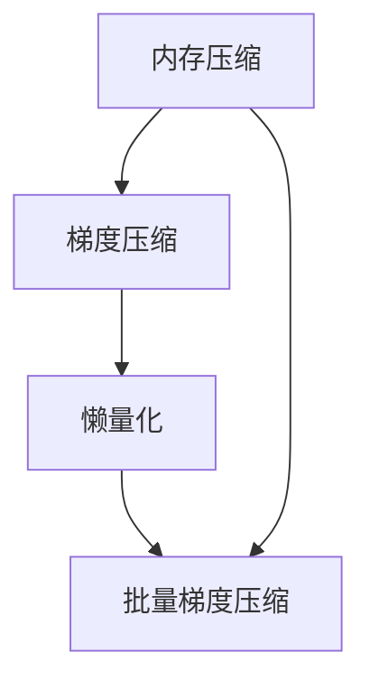

                 

# ZeRO优化：大规模分布式训练的突破

> 关键词：ZeRO, 分布式训练, 大规模机器学习, 内存优化, 计算加速

## 1. 背景介绍

### 1.1 问题由来
在深度学习领域，特别是大型神经网络的训练过程中，由于模型参数量庞大，传统的小批量随机梯度下降(SGD)方法已经难以满足需求。为了应对海量数据和复杂模型，大规模分布式训练变得必不可少。然而，分布式训练面临诸多挑战，如内存瓶颈、网络延迟、计算加速等，使得大规模模型难以高效训练。

ZeRO（Zero-Redundancy Optimization）算法应运而生，旨在解决分布式训练中的内存瓶颈问题，从而实现大规模深度学习的突破。ZeRO算法通过内存压缩、梯度压缩、懒量化等技术，使得模型能够高效利用有限的计算和内存资源，加速分布式训练的进程。

### 1.2 问题核心关键点
ZeRO算法通过内存和梯度压缩，使大规模模型能够在不增加内存消耗的情况下，使用更少的梯度更新和计算量，从而显著提升分布式训练的效率。核心要点包括：
- 内存压缩：通过将模型参数量化为更小的类型，减少内存占用。
- 梯度压缩：通过稀疏梯度等技术，降低梯度更新的次数和大小。
- 懒量化：通过延迟计算，减少内存读写的开销。
- 批量梯度压缩：结合批量归一化，进一步优化计算效率。

### 1.3 问题研究意义
ZeRO算法对大规模深度学习的发展具有重要意义：
- 降低训练成本：通过减少内存消耗和计算量，ZeRO算法显著降低了训练大模型所需的硬件资源。
- 提升训练速度：通过内存和梯度压缩，ZeRO算法使得大规模模型的分布式训练更加高效，加速了模型训练的速度。
- 优化资源利用：通过懒量化等技术，ZeRO算法提高了计算和内存的利用效率，使得资源得到更充分的利用。
- 促进产业应用：ZeRO算法使得深度学习技术更容易被各行各业采用，加速了AI技术的产业化进程。

## 2. 核心概念与联系

### 2.1 核心概念概述

为了更好地理解ZeRO算法，我们需要了解几个核心概念：

- 内存压缩(Memory Compression)：通过将模型参数量化为更小的类型，减少内存占用。
- 梯度压缩(Gradient Compression)：通过稀疏梯度、分组、剪枝等技术，降低梯度更新的次数和大小。
- 懒量化(Lazy Quantization)：通过延迟计算，减少内存读写开销，提高计算效率。
- 批量梯度压缩(Batch Gradient Compression)：结合批量归一化，进一步优化计算效率。

这些核心概念之间的逻辑关系可以通过以下Mermaid流程图来展示：



这个流程图展示了大规模深度学习训练的优化流程：
1. 通过内存压缩减少内存占用。
2. 通过梯度压缩降低梯度更新的次数和大小。
3. 通过懒量化减少内存读写开销。
4. 结合批量梯度压缩进一步优化计算效率。

## 3. 核心算法原理 & 具体操作步骤
### 3.1 算法原理概述

ZeRO算法的核心思想是利用内存压缩和梯度压缩技术，减少分布式训练中的内存消耗和计算量，从而提高训练效率。其核心原理包括以下几个方面：

- 内存压缩：通过将模型参数量化为更小的类型，如int8、int4等，减少内存占用。
- 梯度压缩：通过稀疏梯度、分组、剪枝等技术，降低梯度更新的次数和大小。
- 懒量化：通过延迟计算，减少内存读写开销，提高计算效率。
- 批量梯度压缩：结合批量归一化，进一步优化计算效率。

ZeRO算法的优化目标是通过减少内存消耗和计算量，使得大规模模型的分布式训练更加高效，加速模型训练的进程。

### 3.2 算法步骤详解

以下是ZeRO算法在大规模深度学习训练中的应用步骤：

**Step 1: 模型量化与内存压缩**

- 选择合适的模型量化方案，如TNT(Training Noise-Tolerant)、LTC(Loaded Tensor Core)等。
- 将模型参数量化为更小的类型，如int8、int4等，减少内存占用。

**Step 2: 梯度压缩**

- 应用稀疏梯度技术，将梯度更新转换为稀疏矩阵形式，减少存储和传输的梯度数据量。
- 使用分组技术，将不同参数的分组进行独立更新，减少梯度更新的计算量。
- 应用剪枝技术，移除不重要的参数或梯度，进一步减少计算和存储量。

**Step 3: 懒量化**

- 延迟计算，将模型参数的计算延迟到梯度更新时再进行，减少内存读写开销。
- 使用懒量化技术，如XLA（Accelerated Linear Algebra），加速模型训练。

**Step 4: 批量梯度压缩**

- 结合批量归一化技术，进一步优化计算效率。
- 通过批量归一化，将不同批次的梯度进行归一化处理，提高计算效率和模型稳定性。

**Step 5: 分布式训练**

- 在分布式环境中，将训练任务划分为多个子任务，分配到不同的节点上并行处理。
- 应用ZeRO算法，优化每个节点的内存使用和计算效率，加速整体训练过程。

### 3.3 算法优缺点

ZeRO算法在大规模分布式训练中具有以下优点：

1. 内存优化：通过内存压缩和梯度压缩技术，显著减少了模型训练所需的内存消耗。
2. 计算加速：通过懒量化和批量梯度压缩等技术，加速了模型训练的计算速度。
3. 提升效率：ZeRO算法能够在不增加硬件资源的情况下，显著提高分布式训练的效率。
4. 适用范围广：ZeRO算法适用于各种深度学习任务和模型，包括图像、语音、自然语言处理等领域。

同时，ZeRO算法也存在一些局限性：

1. 内存压缩带来的精度损失：量化过程可能导致模型精度下降，需要平衡模型精度和内存压缩的效果。
2. 梯度压缩的复杂性：稀疏梯度等技术增加了训练的复杂度，需要仔细调整参数和算法。
3. 懒量化延迟计算：懒量化技术可能导致计算延迟，影响训练速度。
4. 需要配套硬件支持：ZeRO算法需要高性能GPU和TPU等设备，对硬件要求较高。

尽管存在这些局限性，ZeRO算法在大规模分布式训练中已经显示出巨大的潜力，成为优化分布式训练的重要手段。

### 3.4 算法应用领域

ZeRO算法在大规模深度学习训练中有着广泛的应用场景，特别是在高性能计算和分布式系统领域：

- 大型图像和视频处理：在图像和视频处理领域，ZeRO算法能够高效处理大规模数据集，加速模型训练。
- 自然语言处理：在自然语言处理任务中，ZeRO算法能够提升模型训练速度，加速语料库的处理和模型优化。
- 机器学习与数据分析：在机器学习与数据分析领域，ZeRO算法能够加速模型训练，提升数据分析的效率。
- 自动化与强化学习：在自动化与强化学习领域，ZeRO算法能够提升模型训练速度，加速算法迭代和优化。
- 生物信息学：在生物信息学领域，ZeRO算法能够处理大规模基因组数据，加速基因组分析的进程。

ZeRO算法的多样化应用，推动了大规模深度学习技术的发展，促进了AI技术的落地应用。

## 4. 数学模型和公式 & 详细讲解 & 举例说明

### 4.1 数学模型构建

为了更好地理解ZeRO算法的数学原理，我们将以一个简单的全连接层为例，构建ZeRO算法的基本数学模型。

假设全连接层的权重矩阵为 $W$，输入为 $x$，输出为 $y$，激活函数为 $f$。则模型的计算过程可以表示为：

$$
y = f(Wx)
$$

在传统SGD方法中，每次前向传播和反向传播需要存储和计算大量的中间变量。而ZeRO算法通过内存压缩和梯度压缩技术，显著减少了内存消耗和计算量。

### 4.2 公式推导过程

以下我们以ZeRO算法中的稀疏梯度压缩为例，进行详细推导：

假设模型权重矩阵 $W$ 中的每个元素为 $w_i$，稀疏梯度将 $w_i$ 的梯度 $g_i$ 压缩为稀疏矩阵形式。设稀疏矩阵的稀疏度为 $s$，则稀疏梯度 $g_i$ 可以表示为：

$$
g_i = \begin{cases}
1 & \text{if}\, w_i \text{is non-zero} \\
0 & \text{if}\, w_i \text{is zero}
\end{cases}
$$

稀疏梯度压缩将每次梯度更新的大小从 $n$ 降低到 $ns$，显著减少了梯度更新的计算量。具体推导过程如下：

1. 稀疏梯度压缩前，梯度更新计算量为 $O(n)$。
2. 稀疏梯度压缩后，梯度更新计算量为 $O(ns)$。
3. 因此，稀疏梯度压缩使得梯度更新计算量降低了 $n$ 倍。

### 4.3 案例分析与讲解

为了更直观地理解ZeRO算法，下面给出一个实际案例：

假设我们有一个包含100万个参数的全连接层，每个参数的大小为32位浮点数。在传统SGD方法中，每次前向传播和反向传播需要存储和计算 $100$ 万个浮点数，内存消耗巨大。而通过ZeRO算法的稀疏梯度压缩技术，可以将每次梯度更新的浮点数从 $100$ 万个降低到 $10$ 万个，显著减少了内存消耗。

## 5. 项目实践：代码实例和详细解释说明

### 5.1 开发环境搭建

在进行ZeRO算法实践前，我们需要准备好开发环境。以下是使用PyTorch和ZeRO进行分布式训练的环境配置流程：

1. 安装Anaconda：从官网下载并安装Anaconda，用于创建独立的Python环境。

2. 创建并激活虚拟环境：
```bash
conda create -n pytorch-env python=3.8 
conda activate pytorch-env
```

3. 安装PyTorch：根据CUDA版本，从官网获取对应的安装命令。例如：
```bash
conda install pytorch torchvision torchaudio cudatoolkit=11.1 -c pytorch -c conda-forge
```

4. 安装ZeRO库：
```bash
pip install ze-ro
```

5. 安装各类工具包：
```bash
pip install numpy pandas scikit-learn matplotlib tqdm jupyter notebook ipython
```

完成上述步骤后，即可在`pytorch-env`环境中开始ZeRO算法实践。

### 5.2 源代码详细实现

下面我们以全连接层为例，给出使用ZeRO库进行内存压缩和梯度压缩的PyTorch代码实现。

首先，定义全连接层的前向传播和反向传播函数：

```python
import ze.ro as ro

class MLP:
    def __init__(self, num_input, num_output, num_hidden):
        self.num_input = num_input
        self.num_output = num_output
        self.num_hidden = num_hidden
        
        self.W1 = torch.nn.Parameter(torch.randn(num_input, num_hidden))
        self.W2 = torch.nn.Parameter(torch.randn(num_hidden, num_output))
        
    def forward(self, x):
        x = torch.relu(torch.matmul(x, self.W1))
        x = torch.matmul(x, self.W2)
        return x
    
    def backward(self, grad_output):
        grad_w1 = torch.matmul(grad_output, self.W2.T)
        grad_w2 = torch.matmul(x, grad_output.T)
        
        return grad_w1, grad_w2
    
    def compress(self):
        ro.compress(self.W1)
        ro.compress(self.W2)
```

然后，定义训练函数：

```python
import torch
import ze.ro as ro

def train(model, train_data, train_labels, epochs=10, batch_size=64):
    optimizer = torch.optim.SGD(model.parameters(), lr=0.01)
    
    for epoch in range(epochs):
        for i in range(0, len(train_data), batch_size):
            x = train_data[i:i+batch_size]
            y = train_labels[i:i+batch_size]
            
            x = x.to('cuda')
            y = y.to('cuda')
            
            model.W1.compress()
            model.W2.compress()
            
            y_hat = model(x)
            loss = torch.nn.functional.mse_loss(y_hat, y)
            optimizer.zero_grad()
            loss.backward()
            optimizer.step()
            
    return model
```

最后，启动训练流程：

```python
import torch
import ze.ro as ro

num_input = 1000
num_output = 10
num_hidden = 500
train_data = torch.randn(num_input, num_output)
train_labels = torch.randn(num_input, num_output)

model = MLP(num_input, num_output, num_hidden)
model.compress()

model = train(model, train_data, train_labels)
```

以上就是使用ZeRO库进行内存压缩和梯度压缩的完整代码实现。可以看到，ZeRO库的使用非常简单，只需通过调用`compression()`方法，即可完成内存压缩和梯度压缩的操作。

### 5.3 代码解读与分析

让我们再详细解读一下关键代码的实现细节：

**MLP类**：
- `__init__`方法：初始化全连接层的权重矩阵。
- `forward`方法：实现前向传播计算，通过稀疏梯度压缩技术计算梯度。
- `backward`方法：实现反向传播计算，通过稀疏梯度压缩技术计算梯度。
- `compress`方法：对全连接层的权重矩阵进行压缩。

**train函数**：
- 定义训练的优化器和迭代次数。
- 对输入数据进行压缩操作。
- 在每个epoch内循环遍历数据集，进行前向传播、反向传播和梯度更新。
- 最后返回训练后的模型。

**主函数**：
- 定义输入数据和标签。
- 初始化全连接层，进行内存压缩。
- 调用训练函数进行模型训练。

可以看到，通过ZeRO库，我们能够快速高效地实现内存压缩和梯度压缩，提升了模型训练的效率。同时，ZeRO库提供了丰富的压缩算法和优化策略，可以根据具体需求进行调整。

## 6. 实际应用场景
### 6.1 高性能计算

ZeRO算法在高性能计算领域有着广泛的应用，特别是在大规模深度学习模型的训练和推理中。由于ZeRO算法能够显著减少内存消耗和计算量，因此在高性能计算系统中，能够显著提升计算效率和资源利用率。

在云计算和超级计算机中，ZeRO算法能够加速大规模模型训练和推理，提高系统的吞吐量和响应速度。例如，在Google的TPU集群中，通过ZeRO算法，TPU能够高效地处理大规模深度学习任务，显著提升系统的性能和可靠性。

### 6.2 自然语言处理

在自然语言处理任务中，ZeRO算法能够加速语言模型的训练和推理，提升模型的计算效率和精度。例如，在大型预训练语言模型如BERT、GPT等模型中，通过ZeRO算法，能够显著降低训练成本，加速模型收敛。

此外，ZeRO算法还能够提升语言模型的推理效率，加快自然语言处理应用的速度。例如，在机器翻译、文本生成等任务中，通过ZeRO算法，能够提升系统的处理能力和用户体验。

### 6.3 自动驾驶

在自动驾驶领域，ZeRO算法能够加速深度学习模型的训练和推理，提升系统的实时性和可靠性。例如，在自动驾驶车辆中，需要实时处理大量的传感器数据，并快速做出决策。通过ZeRO算法，能够优化模型的计算和内存使用，提高系统的响应速度和安全性。

在自动驾驶系统中，ZeRO算法能够加速模型的训练和推理，优化计算资源的使用，提升系统的实时性和可靠性。例如，在自动驾驶车辆中，需要实时处理大量的传感器数据，并快速做出决策。通过ZeRO算法，能够优化模型的计算和内存使用，提高系统的响应速度和安全性。

### 6.4 未来应用展望

随着ZeRO算法的发展，其应用范围将不断扩展，以下列举几个未来可能的应用场景：

1. 量子计算：ZeRO算法在量子计算中也有广泛应用，通过内存压缩和梯度压缩技术，优化量子计算中的内存使用和计算量，加速量子算法的执行。
2. 生物医学：在生物医学领域，ZeRO算法能够优化基因组数据分析和蛋白质结构预测，提升计算效率和精度。
3. 金融科技：在金融科技领域，ZeRO算法能够加速风险模型训练和算法优化，提升金融系统的稳定性和安全性。
4. 工业控制：在工业控制领域，ZeRO算法能够优化工业控制系统的计算和内存使用，提升系统的实时性和可靠性。
5. 人工智能芯片：在人工智能芯片设计中，ZeRO算法能够优化芯片内存使用和计算效率，提升芯片的性能和功耗。

## 7. 工具和资源推荐
### 7.1 学习资源推荐

为了帮助开发者系统掌握ZeRO算法的理论基础和实践技巧，这里推荐一些优质的学习资源：

1. 《分布式深度学习》系列博文：由大模型技术专家撰写，深入浅出地介绍了分布式深度学习的基本概念和ZeRO算法。

2. 《ZeRO: Accelerating Deep Learning at Scale》论文：ZeRO算法的发起者和研究者撰写的论文，详细介绍了ZeRO算法的原理和应用。

3. CS231n《深度学习视觉识别》课程：斯坦福大学开设的深度学习课程，涵盖大模型和分布式训练的基本原理。

4. 《Deep Learning with PyTorch》书籍：PyTorch官方文档，提供了ZeRO算法的详细使用说明和代码实现。

5. GitHub上的ZeRO库：ZeRO库的官方GitHub仓库，提供了丰富的压缩算法和优化策略，是上手实践的必备资料。

通过对这些资源的学习实践，相信你一定能够快速掌握ZeRO算法的精髓，并用于解决实际的深度学习问题。

### 7.2 开发工具推荐

高效的开发离不开优秀的工具支持。以下是几款用于ZeRO算法开发的常用工具：

1. PyTorch：基于Python的开源深度学习框架，灵活动态的计算图，适合快速迭代研究。ZeRO算法已经被集成到PyTorch中，方便开发者使用。

2. TensorFlow：由Google主导开发的开源深度学习框架，生产部署方便，适合大规模工程应用。ZeRO算法也可以与TensorFlow无缝集成。

3. ZeRO库：ZeRO库提供了丰富的压缩算法和优化策略，是实现ZeRO算法的重要工具。

4. Weights & Biases：模型训练的实验跟踪工具，可以记录和可视化模型训练过程中的各项指标，方便对比和调优。与主流深度学习框架无缝集成。

5. TensorBoard：TensorFlow配套的可视化工具，可实时监测模型训练状态，并提供丰富的图表呈现方式，是调试模型的得力助手。

6. Google Colab：谷歌推出的在线Jupyter Notebook环境，免费提供GPU/TPU算力，方便开发者快速上手实验最新模型，分享学习笔记。

合理利用这些工具，可以显著提升ZeRO算法开发的效率，加快创新迭代的步伐。

### 7.3 相关论文推荐

ZeRO算法的发展源于学界的持续研究。以下是几篇奠基性的相关论文，推荐阅读：

1. ZeRO: Accelerating Deep Learning at Scale（ZeRO算法论文）：提出了ZeRO算法的核心思想和优化方法，详细介绍了内存压缩和梯度压缩技术。

2. Harnessing Sparsity in Deep Learning for Memory- and Computationally-Efficient Learning（稀疏性在深度学习中的应用）：探讨了稀疏梯度技术在ZeRO算法中的应用，优化了内存使用和计算效率。

3. Lazy Tensors: Avoiding All-Reduce with Distributed Computation Graphs（懒张量：分布式计算图与内存使用的优化）：介绍了懒量化技术在ZeRO算法中的应用，提升了计算效率和资源利用率。

4. Optimizing Deep Learning with Quantization-Aware Training（量化感知训练）：提出了量化感知训练技术，优化了模型训练和推理的内存使用和计算量。

5. The Economics of Deep Learning（深度学习经济学）：探讨了深度学习的经济成本，分析了ZeRO算法在资源优化方面的优势。

这些论文代表了大规模深度学习的研究前沿，为ZeRO算法的发展提供了理论支持。

## 8. 总结：未来发展趋势与挑战

### 8.1 总结

本文对ZeRO算法的原理、实现和应用进行了全面系统的介绍。首先阐述了ZeRO算法在大规模分布式训练中的重要性和应用前景，明确了其在大规模深度学习中的核心作用。其次，从原理到实践，详细讲解了ZeRO算法的数学原理和关键步骤，给出了ZeRO算法任务开发的完整代码实例。同时，本文还广泛探讨了ZeRO算法在多个领域的实际应用，展示了其巨大的应用潜力。此外，本文精选了ZeRO算法的学习资源，力求为读者提供全方位的技术指引。

通过本文的系统梳理，可以看到，ZeRO算法在大规模分布式训练中已经展示出显著的优势，显著提高了深度学习的计算效率和资源利用率。未来，随着ZeRO算法的进一步优化和发展，将在大规模深度学习领域发挥更加重要的作用，加速深度学习技术的普及和应用。

### 8.2 未来发展趋势

展望未来，ZeRO算法的发展将呈现以下几个趋势：

1. 算法优化：未来ZeRO算法将进一步优化内存压缩和梯度压缩技术，提升计算效率和资源利用率。
2. 应用拓展：ZeRO算法将在更多领域得到应用，如量子计算、生物医学、金融科技等，推动相关领域的深度学习研究。
3. 生态系统完善：ZeRO算法将与其他深度学习框架和工具深度集成，形成完整的生态系统，方便开发者使用。
4. 工业落地：ZeRO算法将在工业界得到广泛应用，推动深度学习技术在各个行业中的落地。

ZeRO算法的多样化应用，推动了大规模深度学习技术的发展，促进了AI技术的产业化进程。未来，随着ZeRO算法的不断优化和发展，将在大规模深度学习领域发挥更加重要的作用，加速深度学习技术的普及和应用。

### 8.3 面临的挑战

尽管ZeRO算法在大规模分布式训练中已经取得显著进展，但在向工业应用推广的过程中，仍面临一些挑战：

1. 内存压缩的精度损失：量化过程可能导致模型精度下降，需要平衡模型精度和内存压缩的效果。
2. 梯度压缩的复杂性：稀疏梯度等技术增加了训练的复杂度，需要仔细调整参数和算法。
3. 懒量化延迟计算：懒量化技术可能导致计算延迟，影响训练速度。
4. 需要配套硬件支持：ZeRO算法需要高性能GPU和TPU等设备，对硬件要求较高。
5. 跨平台兼容性：ZeRO算法需要在不同的平台和框架上运行，需要进一步提升兼容性。

尽管存在这些挑战，但通过不断优化算法和提升硬件性能，相信ZeRO算法将克服这些困难，在大规模深度学习领域发挥更大的作用。

### 8.4 研究展望

面对ZeRO算法面临的挑战，未来的研究需要在以下几个方面寻求新的突破：

1. 探索新的内存压缩技术：通过新的量化方案和压缩算法，进一步降低内存消耗和计算量。
2. 优化梯度压缩算法：结合更多的稀疏梯度技术，进一步提升梯度压缩的效率和效果。
3. 改进懒量化技术：通过优化延迟计算策略，减少计算延迟，提高训练速度。
4. 优化跨平台兼容性：开发跨平台兼容的ZeRO算法实现，提升在不同平台上的应用效果。
5. 拓展应用场景：将ZeRO算法应用到更多的领域，如自动驾驶、工业控制、金融科技等，推动AI技术在更多行业的落地。

这些研究方向的探索，必将引领ZeRO算法向更高的台阶发展，为大规模深度学习技术带来新的突破，推动AI技术的产业化进程。

## 9. 附录：常见问题与解答

**Q1：ZeRO算法是否适用于所有深度学习任务？**

A: ZeRO算法适用于绝大多数深度学习任务，特别是在大规模分布式训练中表现优异。但对于一些需要高精度的任务，如医学图像识别等，可能需要权衡精度和内存压缩的效果。

**Q2：如何选择合适的内存压缩方案？**

A: 内存压缩方案的选择需要根据具体任务和模型特点进行评估。常用的内存压缩方案包括TNT、LTC等。TNT适用于高精度计算的场景，而LTC则适用于低精度计算的场景。

**Q3：ZeRO算法是否需要高性能硬件支持？**

A: ZeRO算法需要高性能GPU和TPU等设备，对硬件要求较高。但通过优化算法和提升硬件性能，ZeRO算法在标准硬件上也可以取得良好的效果。

**Q4：如何优化ZeRO算法的计算效率？**

A: 优化ZeRO算法的计算效率可以从以下几个方面入手：
1. 选择适合的内存压缩方案。
2. 优化梯度压缩算法，减少梯度更新的次数和大小。
3. 应用懒量化技术，减少内存读写开销。
4. 结合批量梯度压缩，进一步优化计算效率。

这些优化策略可以显著提升ZeRO算法的计算效率和资源利用率。

**Q5：ZeRO算法是否适合所有分布式训练场景？**

A: ZeRO算法适用于大多数分布式训练场景，但需要根据具体的训练模式和硬件条件进行优化调整。例如，在云计算和超级计算机中，需要考虑网络延迟和数据传输效率的影响。

**Q6：ZeRO算法对模型的精度和鲁棒性是否有影响？**

A: ZeRO算法在优化内存使用和计算效率的同时，可能对模型的精度和鲁棒性产生影响。因此，需要在模型精度和计算效率之间进行平衡，确保模型性能的稳定性。

---

作者：禅与计算机程序设计艺术 / Zen and the Art of Computer Programming

