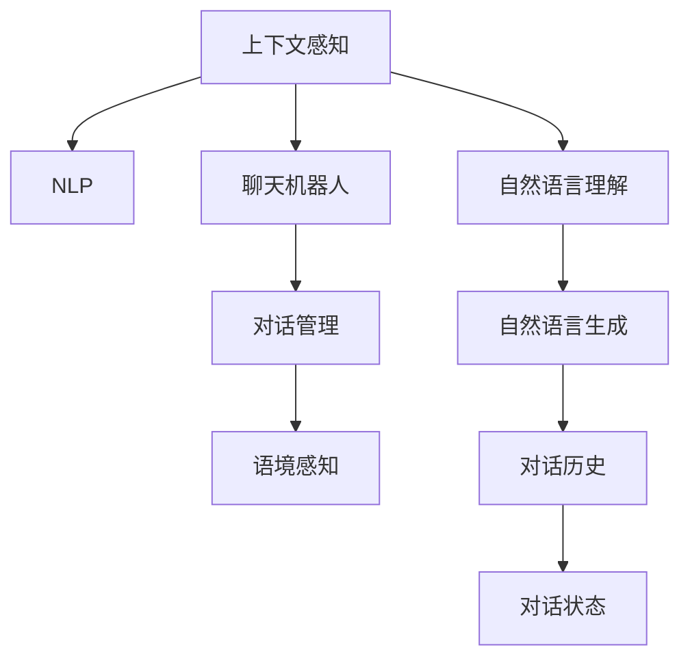

                 

# 上下文感知：保持聊天连贯性

## 1. 背景介绍

在人工智能迅速发展的今天，聊天机器人已经成为了一个热门话题。无论是在客户服务、智能助手还是个性化推荐等领域，聊天机器人都扮演着越来越重要的角色。然而，尽管聊天机器人已经取得了很大的进展，但在实际应用中，保持对话的连贯性和流畅性仍然是一个巨大的挑战。本文将深入探讨上下文感知在聊天机器人中的应用，以及如何通过上下文感知技术来提升聊天机器人的性能。

## 2. 核心概念与联系

### 2.1 核心概念概述

为了更好地理解上下文感知技术，我们需要先了解一些核心概念：

- 上下文感知(Context-Aware)：指的是在处理数据时，能够考虑到数据的前后文，理解数据之间的关系，从而做出更准确的决策。在自然语言处理领域，上下文感知指的是模型能够根据上下文信息来理解当前句子的含义，从而提供更加符合语境的回答。
- 自然语言处理(Natural Language Processing, NLP)：是一门涉及计算机科学、人工智能和语言学的交叉学科。NLP的目标是使计算机能够理解和生成人类语言，包括文本分类、信息提取、机器翻译、问答系统等。
- 聊天机器人(Chatbot)：是一种能够通过自然语言与人类进行交流的计算机程序。聊天机器人可以应用于各种场景，如客户服务、医疗咨询、教育辅导等。
- 对话管理(Dialog Management)：是指聊天机器人如何管理对话流程，决定在对话的哪个阶段、针对哪个话题给出何种回答。对话管理的好坏直接影响聊天机器人的对话体验和效果。
- 语境感知(Contextual Awareness)：是指聊天机器人能够根据对话的上下文信息，理解用户的意图和需求，从而提供更加准确和个性化的回答。

这些核心概念之间的关系可以通过以下Mermaid流程图来展示：



这个流程图展示了上下文感知技术与其他核心概念之间的联系：

1. 上下文感知作为核心技术，支持NLP和聊天机器人。
2. 聊天机器人使用NLP技术来处理自然语言，理解用户意图。
3. 对话管理是聊天机器人流程管理的关键，依赖于上下文感知。
4. 语境感知是对话管理的一部分，通过上下文感知来理解用户的上下文信息。
5. 自然语言理解是将自然语言转换为机器可理解的形式，是上下文感知的基础。
6. 自然语言生成是将机器生成的回答转换为自然语言，是上下文感知的实现方式。

## 3. 核心算法原理 & 具体操作步骤

### 3.1 算法原理概述

上下文感知技术的核心是利用上下文信息来提升模型的性能。在聊天机器人中，上下文信息包括对话历史、用户意图、对话状态等。通过对这些信息的处理，聊天机器人能够更加准确地理解用户的意图，提供更加符合语境的回答。

上下文感知的实现通常包括以下步骤：

1. 收集上下文信息：收集对话历史、用户意图、对话状态等上下文信息。
2. 处理上下文信息：将上下文信息转换为机器可理解的形式。
3. 结合上下文信息：将上下文信息与模型输出相结合，提升模型的性能。

### 3.2 算法步骤详解

#### 3.2.1 收集上下文信息

在聊天机器人中，收集上下文信息是一个非常重要的步骤。常见的上下文信息包括：

- 对话历史：即聊天记录，包括用户和机器人之前的对话内容。
- 用户意图：用户希望聊天机器人完成的任务或询问的问题。
- 对话状态：聊天机器人在对话中的当前状态，包括对话的进展情况、用户的历史行为等。

为了收集这些信息，可以使用以下技术：

- 自然语言理解(NLU)：通过NLU技术，将用户输入的文本转换为机器可理解的形式，从而提取出用户的意图和上下文信息。
- 对话历史记录：通过记录对话历史，可以更好地理解用户的行为和偏好。
- 用户行为分析：通过分析用户的在线行为和历史数据，可以更好地预测用户的意图和行为。

#### 3.2.2 处理上下文信息

收集到上下文信息后，需要将这些信息转换为机器可理解的形式，以便于模型进行处理。常见的处理方式包括：

- 文本编码：将文本转换为向量表示，常用的编码方法包括词袋模型、TF-IDF、Word2Vec等。
- 向量拼接：将不同来源的向量拼接在一起，形成更加丰富的上下文信息。
- 特征提取：提取上下文信息中的关键特征，形成更加紧凑的表示。

#### 3.2.3 结合上下文信息

将上下文信息与模型输出相结合，是提升模型性能的关键步骤。常见的结合方式包括：

- 上下文向量拼接：将上下文向量与模型输出向量拼接在一起，形成一个更加全面的表示。
- 上下文注意力机制：通过注意力机制，将上下文信息与模型输出相结合，提升模型的语境理解能力。
- 上下文增强学习：通过上下文信息来指导模型的学习过程，提升模型的泛化能力。

### 3.3 算法优缺点

#### 3.3.1 优点

- 提升对话连贯性：上下文感知技术能够更好地理解用户的意图和需求，提供更加连贯的回答。
- 提高对话质量：通过上下文感知，聊天机器人能够提供更加准确和个性化的回答，提高用户体验。
- 减少人工干预：上下文感知技术能够自动处理上下文信息，减少人工干预，提高效率。

#### 3.3.2 缺点

- 数据需求高：上下文感知技术需要大量的对话数据和用户行为数据，数据需求较高。
- 计算复杂度高：上下文感知需要处理大量的上下文信息，计算复杂度高，对计算资源要求较高。
- 上下文理解难：上下文信息的复杂性和多样性，使得上下文感知的理解和处理难度较大。

### 3.4 算法应用领域

上下文感知技术在聊天机器人中的应用非常广泛，以下是几个典型的应用场景：

- 客户服务：聊天机器人可以应用于客户服务领域，回答客户的常见问题，提供个性化的服务。
- 智能助手：聊天机器人可以应用于智能助手领域，帮助用户完成各种任务，如日程安排、信息查询等。
- 教育辅导：聊天机器人可以应用于教育辅导领域，提供个性化的学习建议和辅导服务。
- 医疗咨询：聊天机器人可以应用于医疗咨询领域，提供医疗知识查询和初步诊断服务。
- 金融咨询：聊天机器人可以应用于金融咨询领域，提供理财建议和风险评估服务。

## 4. 数学模型和公式 & 详细讲解 & 举例说明

### 4.1 数学模型构建

在聊天机器人中，上下文感知的数学模型通常包括两个部分：上下文信息处理模型和聊天模型。

#### 4.1.1 上下文信息处理模型

上下文信息处理模型的目标是将上下文信息转换为机器可理解的形式。常用的上下文信息处理模型包括：

- 词袋模型：将文本转换为词的集合，每个词对应一个向量。
- TF-IDF：将文本转换为词频-逆文档频率向量，能够去除常见词汇的影响。
- Word2Vec：将词转换为向量表示，能够捕捉词与词之间的关系。

#### 4.1.2 聊天模型

聊天模型的目标是根据上下文信息和用户输入，生成自然语言的回答。常用的聊天模型包括：

- 基于规则的模型：通过规则匹配和模板生成回答。
- 基于统计的模型：通过统计方法，根据上下文信息和用户输入，生成回答。
- 基于深度学习的模型：通过深度神经网络模型，根据上下文信息和用户输入，生成回答。

### 4.2 公式推导过程

以基于深度学习的聊天模型为例，以下是其数学模型构建的过程：

- 输入层：将用户输入的文本转换为词向量，形成输入向量 $x$。
- 上下文信息处理层：将上下文信息转换为上下文向量 $c$。
- 隐藏层：将输入向量和上下文向量拼接在一起，形成特征向量 $h$。
- 输出层：通过神经网络模型，将特征向量 $h$ 转换为自然语言的回答 $y$。

### 4.3 案例分析与讲解

#### 4.3.1 案例背景

某电商平台的客服聊天机器人，用户输入“我想购买iPhone 12”，聊天机器人需要根据上下文信息，提供个性化的服务建议。

#### 4.3.2 上下文信息

- 对话历史：“你好，我想购买iPhone 12。”
- 用户意图：购买iPhone 12
- 对话状态：用户已经询问过iPhone 12的价格

#### 4.3.3 上下文向量

根据上下文信息，可以计算出上下文向量 $c$，表示为 $c = [c_1, c_2, \ldots, c_n]$，其中 $c_i$ 表示第 $i$ 个上下文特征。

#### 4.3.4 特征向量

将用户输入的文本转换为词向量 $x$，与上下文向量 $c$ 拼接在一起，形成特征向量 $h$：

$$
h = [x_1, c_1, x_2, c_2, \ldots, x_n, c_n]
$$

#### 4.3.5 回答生成

通过神经网络模型，将特征向量 $h$ 转换为自然语言的回答 $y$：

$$
y = \text{Softmax}(hW + b)
$$

其中 $W$ 和 $b$ 是模型参数，$\text{Softmax}$ 函数将模型输出转换为概率分布，表示每个回答的概率。

#### 4.3.6 结果

最终，聊天机器人输出回答：“好的，我们正在为您查询iPhone 12的价格。请稍等一下。”

## 5. 项目实践：代码实例和详细解释说明

### 5.1 开发环境搭建

开发环境搭建需要以下步骤：

1. 安装Python：Python是聊天机器人开发的主要语言，需要安装最新版本的Python。
2. 安装TensorFlow：TensorFlow是一个常用的深度学习框架，适用于构建聊天机器人。
3. 安装OpenAI Gym：OpenAI Gym是一个环境模拟框架，可用于训练聊天机器人。
4. 安装NLTK：NLTK是一个常用的自然语言处理库，可用于处理文本数据。
5. 安装TensorBoard：TensorBoard是一个可视化工具，可用于监控训练过程和结果。

### 5.2 源代码详细实现

#### 5.2.1 上下文信息处理

以下是一个简单的上下文信息处理函数，将文本转换为词向量：

```python
import tensorflow as tf
from tensorflow.keras.preprocessing.text import Tokenizer
from tensorflow.keras.preprocessing.sequence import pad_sequences

def preprocess_text(texts):
    tokenizer = Tokenizer(num_words=10000, oov_token='<OOV>')
    tokenizer.fit_on_texts(texts)
    sequences = tokenizer.texts_to_sequences(texts)
    padded_sequences = pad_sequences(sequences, maxlen=50, padding='post')
    return padded_sequences, tokenizer.word_index
```

#### 5.2.2 聊天模型

以下是一个简单的聊天模型，使用LSTM网络处理上下文信息：

```python
import tensorflow as tf
from tensorflow.keras.models import Sequential
from tensorflow.keras.layers import LSTM, Dense

def build_chatbot_model(input_shape, output_shape):
    model = Sequential()
    model.add(LSTM(128, input_shape=input_shape))
    model.add(Dense(output_shape, activation='softmax'))
    return model
```

#### 5.2.3 训练和测试

以下是一个简单的训练函数和测试函数，使用TensorBoard可视化训练过程：

```python
import tensorflow as tf
from tensorflow.keras.callbacks import TensorBoard

def train_chatbot(model, train_data, train_labels, validation_data, validation_labels, epochs, batch_size):
    model.compile(loss='categorical_crossentropy', optimizer='adam', metrics=['accuracy'])
    tensorboard = TensorBoard(log_dir='logs', write_graph=True, write_images=True, write_grads=True)
    model.fit(train_data, train_labels, validation_data=validation_data, validation_labels=validation_labels,
              epochs=epochs, batch_size=batch_size, callbacks=[tensorboard])
    return model

def test_chatbot(model, test_data, test_labels):
    test_loss, test_acc = model.evaluate(test_data, test_labels)
    print('Test loss:', test_loss)
    print('Test accuracy:', test_acc)
```

### 5.3 代码解读与分析

#### 5.3.1 上下文信息处理

在上下文信息处理函数中，使用了NLTK库进行文本处理。首先将文本转换为词向量，然后使用pad_sequences函数对序列进行填充，使得每个序列的长度相同。

#### 5.3.2 聊天模型

在聊天模型中，使用了LSTM网络处理上下文信息。LSTM网络能够捕捉序列数据的长期依赖关系，非常适合处理上下文信息。

#### 5.3.3 训练和测试

在训练函数中，使用了TensorBoard进行可视化。TensorBoard可以实时监控训练过程，生成各种图表，帮助调试模型。

## 6. 实际应用场景

### 6.1 客户服务

在客户服务领域，上下文感知技术可以帮助聊天机器人更好地理解用户的需求，提供更加个性化的服务。例如，通过收集用户的购买历史和浏览记录，聊天机器人可以预测用户的需求，提供相关的产品推荐。

### 6.2 智能助手

在智能助手领域，上下文感知技术可以帮助聊天机器人更好地理解用户的意图，提供更加智能的回答。例如，通过分析用户的日程安排和偏好，聊天机器人可以提供个性化的日程建议。

### 6.3 教育辅导

在教育辅导领域，上下文感知技术可以帮助聊天机器人更好地理解学生的学习情况，提供更加个性化的学习建议。例如，通过分析学生的答题记录和学习行为，聊天机器人可以提供针对性的学习建议。

### 6.4 医疗咨询

在医疗咨询领域，上下文感知技术可以帮助聊天机器人更好地理解用户的症状和病史，提供更加准确的诊断建议。例如，通过分析用户的症状描述和病史记录，聊天机器人可以提供初步诊断和建议。

### 6.5 金融咨询

在金融咨询领域，上下文感知技术可以帮助聊天机器人更好地理解用户的需求，提供更加个性化的金融建议。例如，通过分析用户的收入和支出情况，聊天机器人可以提供个性化的理财建议。

## 7. 工具和资源推荐

### 7.1 学习资源推荐

为了帮助开发者系统掌握上下文感知技术，这里推荐一些优质的学习资源：

1. 《深度学习》书籍：由Ian Goodfellow、Yoshua Bengio和Aaron Courville所著，系统介绍了深度学习的基本概念和算法。
2. 《自然语言处理综论》书籍：由Daniel Jurafsky和James H. Martin所著，介绍了自然语言处理的理论基础和实践技巧。
3. 《Python深度学习》书籍：由Francois Chollet所著，介绍了使用Python和TensorFlow进行深度学习的实践技巧。
4. 《TensorFlow官方文档》：TensorFlow的官方文档，提供了详细的API文档和使用指南。
5. 《OpenAI Gym官方文档》：OpenAI Gym的官方文档，提供了使用Gym进行环境模拟的指南。

通过对这些资源的学习实践，相信你一定能够快速掌握上下文感知技术的精髓，并用于解决实际的NLP问题。

### 7.2 开发工具推荐

高效的开发离不开优秀的工具支持。以下是几款用于聊天机器人开发的常用工具：

1. Python：Python是聊天机器人开发的主要语言，易于学习和使用。
2. TensorFlow：TensorFlow是一个常用的深度学习框架，适用于构建聊天机器人。
3. OpenAI Gym：OpenAI Gym是一个环境模拟框架，可用于训练聊天机器人。
4. NLTK：NLTK是一个常用的自然语言处理库，可用于处理文本数据。
5. TensorBoard：TensorBoard是一个可视化工具，可用于监控训练过程和结果。

合理利用这些工具，可以显著提升聊天机器人开发和优化的效率。

### 7.3 相关论文推荐

上下文感知技术的研究始于20世纪60年代，近年来随着深度学习的发展，上下文感知的模型和算法不断涌现。以下是几篇奠基性的相关论文，推荐阅读：

1. Attention is All You Need：提出了Transformer网络，基于自注意力机制处理上下文信息。
2. Language Modeling with Attention：提出了一种基于注意力机制的序列建模方法，能够更好地处理上下文信息。
3. Bidirectional LSTM for Language Modeling：提出了一种双向LSTM网络，能够更好地处理上下文信息。
4. Hierarchical Attention Networks for Document Classification：提出了一种层次化的注意力网络，能够更好地处理文档级别的上下文信息。
5. Multi-Task Learning with Memory Networks：提出了一种基于记忆网络的序列建模方法，能够更好地处理上下文信息。

这些论文代表了大规模上下文感知技术的发展脉络。通过学习这些前沿成果，可以帮助研究者把握学科前进方向，激发更多的创新灵感。

## 8. 总结：未来发展趋势与挑战

### 8.1 研究成果总结

上下文感知技术在聊天机器人中的应用已经取得了很大的进展，但也面临一些挑战和问题。未来，上下文感知技术将在以下几个方面取得进一步的突破：

1. 数据需求减少：随着技术的发展，上下文感知技术将不再依赖大量的标注数据，能够在更少的样本下进行训练和优化。
2. 计算复杂度降低：随着硬件的进步，上下文感知技术的计算复杂度将逐步降低，能够更好地适应实际应用环境。
3. 上下文理解更加准确：通过引入更多的上下文信息，上下文感知的理解能力将进一步提升，能够更好地处理复杂情境。
4. 对话连贯性更强：通过上下文感知技术，聊天机器人能够提供更加连贯和自然的回答，提升用户体验。
5. 人机交互更加智能：上下文感知技术将使得聊天机器人能够更好地理解用户的意图和需求，提供更加智能和个性化的服务。

### 8.2 未来发展趋势

展望未来，上下文感知技术将呈现以下几个发展趋势：

1. 上下文感知将与自然语言理解(NLU)和自然语言生成(NLG)技术进一步结合，提升对话质量。
2. 上下文感知将与其他人工智能技术进一步结合，如知识图谱、逻辑推理等，提升对话的准确性和鲁棒性。
3. 上下文感知将逐步应用于更多领域，如金融、医疗、教育等，提升各行各业的工作效率和服务质量。
4. 上下文感知技术将进一步扩展到多模态数据处理，如文本、语音、图像等，提升人机交互的智能化水平。
5. 上下文感知技术将逐步实现可解释性，提升系统的可信度和透明度。

### 8.3 面临的挑战

尽管上下文感知技术已经取得了很大的进展，但在迈向更加智能化、普适化应用的过程中，它仍面临一些挑战：

1. 数据隐私和安全问题：上下文感知技术需要大量的用户数据，如何在保护用户隐私的前提下进行数据收集和处理，是一个重要的挑战。
2. 上下文理解难度：上下文信息的复杂性和多样性，使得上下文感知的理解和处理难度较大。
3. 上下文感知的泛化能力：上下文感知技术在特定领域的数据集上训练效果较好，但在其他领域的数据集上泛化能力较差。
4. 上下文感知的可解释性：上下文感知技术的结果往往是黑盒模型，难以解释其内部工作机制。
5. 上下文感知的鲁棒性：上下文感知的鲁棒性较差，面对噪声和干扰，上下文感知的性能往往下降。

### 8.4 研究展望

未来的研究需要在以下几个方面寻求新的突破：

1. 上下文感知的可解释性：通过引入可解释性技术，使得上下文感知的决策过程更加透明和可信。
2. 上下文感知的鲁棒性：通过引入鲁棒性技术，使得上下文感知的性能更加稳定和可靠。
3. 上下文感知的泛化能力：通过引入泛化技术，使得上下文感知的性能在更广泛的数据集上表现更好。
4. 上下文感知的隐私保护：通过引入隐私保护技术，使得上下文感知的训练和应用更加安全可靠。
5. 上下文感知的交互性：通过引入交互性技术，使得上下文感知的对话更加自然和流畅。

这些研究方向的探索，必将引领上下文感知技术迈向更高的台阶，为构建智能人机交互系统提供更强的技术保障。面向未来，上下文感知技术还需要与其他人工智能技术进行更深入的融合，多路径协同发力，共同推动自然语言理解和智能交互系统的进步。只有勇于创新、敢于突破，才能不断拓展上下文感知技术的边界，让智能技术更好地造福人类社会。

## 9. 附录：常见问题与解答

### 9.1 常见问题

1. 上下文感知技术是否适用于所有聊天机器人？
2. 上下文感知技术需要多少数据才能训练出一个好的模型？
3. 上下文感知技术是否能够处理多模态数据？
4. 上下文感知技术是否能够解决对话中的歧义问题？

### 9.2 解答

1. 上下文感知技术适用于大多数聊天机器人，尤其是需要处理复杂对话和场景的机器人。但需要注意的是，上下文感知的复杂度较高，对于简单的聊天机器人，上下文感知的优势可能不明显。

2. 上下文感知技术需要大量的标注数据，但对于少量数据也有一定的效果。通过迁移学习、半监督学习等方法，可以在较少的标注数据下进行训练和优化。

3. 上下文感知技术能够处理多模态数据，如文本、语音、图像等。通过引入多模态数据，上下文感知技术可以更好地理解用户的多样化需求。

4. 上下文感知技术在一定程度上能够解决对话中的歧义问题。通过上下文信息，上下文感知技术可以更好地理解用户的意图和需求，避免歧义。但需要注意的是，上下文信息的复杂性和多样性，使得上下文感知的理解和处理难度较大。

---

作者：禅与计算机程序设计艺术 / Zen and the Art of Computer Programming

