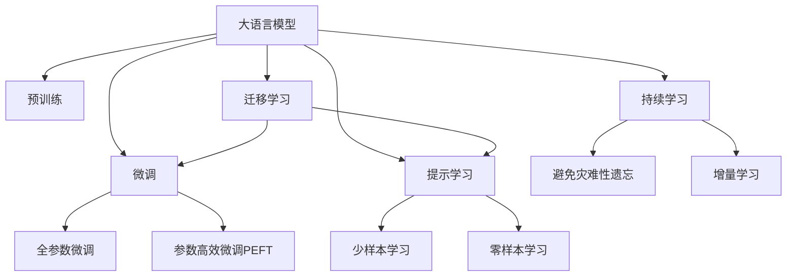

                 

# 个性化广告：大模型精准投放

## 1. 背景介绍

### 1.1 问题由来

在数字化时代，随着互联网的普及和社交媒体的快速发展，广告投放已成为许多企业吸引消费者、推广产品的重要手段。传统的广告投放方式，如电视、广播、报纸等，虽然覆盖面广，但无法实现精准的定向投放。随着大数据和人工智能技术的发展，个性化广告逐渐成为广告投放的主流。个性化广告能够根据用户的兴趣、行为等特征，实时调整广告内容和展示方式，提升广告效果，降低投放成本。

大语言模型作为近年来在自然语言处理领域取得突破性进展的模型，以其强大的语言理解和生成能力，在个性化广告领域也展现出巨大潜力。通过大语言模型，企业可以自动生成符合用户兴趣和偏好的广告内容，实现广告的精准投放。

### 1.2 问题核心关键点

当前，基于大语言模型的个性化广告主要采用以下几种方式：

1. **内容生成**：使用大语言模型生成符合用户兴趣的广告文案和创意，通过自动化的方式生成多样化的广告内容。
2. **定向投放**：利用大语言模型对用户行为和兴趣进行分析，精准匹配广告目标用户，实现个性化广告的定向推送。
3. **实时调整**：通过实时分析用户互动反馈，动态调整广告内容和展示方式，实现广告效果的持续优化。

## 2. 核心概念与联系

### 2.1 核心概念概述

为更好地理解大语言模型在个性化广告中的应用，本节将介绍几个密切相关的核心概念：

- **大语言模型(Large Language Model, LLM)**：以自回归(如GPT)或自编码(如BERT)模型为代表的大规模预训练语言模型。通过在大规模无标签文本语料上进行预训练，学习通用的语言表示，具备强大的语言理解和生成能力。

- **预训练(Pre-training)**：指在大规模无标签文本语料上，通过自监督学习任务训练通用语言模型的过程。常见的预训练任务包括言语建模、遮挡语言模型等。

- **微调(Fine-tuning)**：指在预训练模型的基础上，使用下游任务的少量标注数据，通过有监督地训练来优化模型在特定任务上的性能。通常只需要调整顶层分类器或解码器，并以较小的学习率更新全部或部分的模型参数。

- **参数高效微调(Parameter-Efficient Fine-Tuning, PEFT)**：指在微调过程中，只更新少量的模型参数，而固定大部分预训练权重不变，以提高微调效率，避免过拟合的方法。

- **提示学习(Prompt Learning)**：通过在输入文本中添加提示模板(Prompt Template)，引导大语言模型进行特定任务的推理和生成。可以在不更新模型参数的情况下，实现零样本或少样本学习。

- **少样本学习(Few-shot Learning)**：指在只有少量标注样本的情况下，模型能够快速适应新任务的学习方法。在大语言模型中，通常通过在输入中提供少量示例来实现，无需更新模型参数。

- **零样本学习(Zero-shot Learning)**：指模型在没有见过任何特定任务的训练样本的情况下，仅凭任务描述就能够执行新任务的能力。大语言模型通过预训练获得的广泛知识，使其能够理解任务指令并生成相应输出。

- **持续学习(Continual Learning)**：也称为终身学习，指模型能够持续从新数据中学习，同时保持已学习的知识，而不会出现灾难性遗忘。这对于保持大语言模型的时效性和适应性至关重要。

这些核心概念之间的逻辑关系可以通过以下Mermaid流程图来展示：



这个流程图展示了大语言模型的核心概念及其之间的关系：

1. 大语言模型通过预训练获得基础能力。
2. 微调是对预训练模型进行任务特定的优化，可以分为全参数微调和参数高效微调（PEFT）。
3. 提示学习是一种不更新模型参数的方法，可以实现少样本学习和零样本学习。
4. 迁移学习是连接预训练模型与下游任务的桥梁，可以通过微调或提示学习来实现。
5. 持续学习旨在使模型能够不断学习新知识，同时避免遗忘旧知识。

这些概念共同构成了大语言模型的学习和应用框架，使其能够在各种场景下发挥强大的语言理解和生成能力。通过理解这些核心概念，我们可以更好地把握大语言模型的工作原理和优化方向。

## 3. 核心算法原理 & 具体操作步骤
### 3.1 算法原理概述

基于大语言模型的个性化广告，本质上是一个有监督的细粒度迁移学习过程。其核心思想是：将大语言模型视作一个强大的"特征提取器"，通过在广告目标用户的兴趣描述上进行的微调，使得模型能够生成符合用户兴趣的广告内容，从而实现精准投放。

形式化地，假设大语言模型为 $M_{\theta}$，其中 $\theta$ 为预训练得到的模型参数。给定广告目标用户的兴趣描述 $X$，微调的目标是找到新的模型参数 $\hat{\theta}$，使得：

$$
\hat{\theta}=\mathop{\arg\min}_{\theta} \mathcal{L}(M_{\theta},X)
$$

其中 $\mathcal{L}$ 为针对广告内容生成的损失函数，用于衡量生成的广告内容与用户兴趣描述的匹配度。常见的损失函数包括交叉熵损失、均方误差损失等。

通过梯度下降等优化算法，微调过程不断更新模型参数 $\theta$，最小化损失函数 $\mathcal{L}$，使得生成的广告内容逼近用户兴趣描述。由于 $\theta$ 已经通过预训练获得了较好的初始化，因此即便在小规模数据集上进行操作，也能较快收敛到理想的模型参数 $\hat{\theta}$。

### 3.2 算法步骤详解

基于大语言模型的个性化广告一般包括以下几个关键步骤：

**Step 1: 准备预训练模型和数据集**
- 选择合适的预训练语言模型 $M_{\theta}$ 作为初始化参数，如 BERT、GPT 等。
- 准备广告目标用户的兴趣描述数据集 $D=\{(x_i)\}_{i=1}^N$，划分为训练集、验证集和测试集。一般要求兴趣描述与用户行为数据分布不要差异过大。

**Step 2: 添加任务适配层**
- 根据广告内容生成的任务类型，在预训练模型顶层设计合适的输出层和损失函数。
- 对于文本生成的任务，通常在顶层添加语言模型的解码器输出概率分布，并以负对数似然为损失函数。
- 对于图像生成的任务，通常使用生成对抗网络(GAN)等方法，生成符合用户兴趣的图像。

**Step 3: 设置微调超参数**
- 选择合适的优化算法及其参数，如 AdamW、SGD 等，设置学习率、批大小、迭代轮数等。
- 设置正则化技术及强度，包括权重衰减、Dropout、Early Stopping等。
- 确定冻结预训练参数的策略，如仅微调顶层，或全部参数都参与微调。

**Step 4: 执行梯度训练**
- 将训练集数据分批次输入模型，前向传播计算损失函数。
- 反向传播计算参数梯度，根据设定的优化算法和学习率更新模型参数。
- 周期性在验证集上评估模型性能，根据性能指标决定是否触发 Early Stopping。
- 重复上述步骤直到满足预设的迭代轮数或 Early Stopping 条件。

**Step 5: 测试和部署**
- 在测试集上评估微调后模型 $M_{\hat{\theta}}$ 的性能，对比微调前后的生成内容质量提升。
- 使用微调后的模型对新用户进行广告内容生成，集成到实际的广告投放系统中。
- 持续收集新的用户数据，定期重新微调模型，以适应用户兴趣的变化。

以上是基于大语言模型的个性化广告的一般流程。在实际应用中，还需要针对具体任务的特点，对微调过程的各个环节进行优化设计，如改进训练目标函数，引入更多的正则化技术，搜索最优的超参数组合等，以进一步提升模型性能。

### 3.3 算法优缺点

基于大语言模型的个性化广告方法具有以下优点：
1. 简单高效。只需准备少量用户兴趣描述，即可对预训练模型进行快速适配，生成符合用户兴趣的广告内容。
2. 内容多样化。大语言模型能够自动生成多种风格的广告文案，满足不同用户的个性化需求。
3. 用户隐私保护。用户兴趣描述和生成的广告内容都存储在模型内部，无需处理用户个人信息。
4. 实时动态调整。可以实时分析用户互动反馈，动态调整广告内容和展示方式，提高广告效果。

同时，该方法也存在一定的局限性：
1. 数据依赖性强。微调的效果很大程度上取决于用户兴趣描述的质量和数量，难以获取高质量的用户兴趣描述数据。
2. 模型资源消耗大。大语言模型通常参数量较大，推理计算资源消耗高。
3. 模型泛化能力有限。当用户兴趣描述与实际行为差异较大时，广告内容生成效果可能不佳。
4. 内容质量控制难。生成的广告内容可能出现低质、不相关的情况，需要人工干预和后处理。

尽管存在这些局限性，但就目前而言，基于大语言模型的个性化广告方法仍是大数据时代广告投放的重要手段。未来相关研究的重点在于如何进一步降低对用户兴趣描述的依赖，提高模型的泛化能力，同时兼顾内容质量控制和资源消耗问题。

### 3.4 算法应用领域

基于大语言模型的个性化广告，已经在多个行业领域得到了广泛的应用，如电商、广告、媒体、教育等，具体应用场景包括：

- **电商广告**：根据用户浏览、购买历史，生成个性化商品推荐广告。
- **新闻推荐**：分析用户阅读行为，生成个性化新闻推荐广告。
- **教育广告**：根据用户学习行为，生成个性化在线课程推荐广告。
- **社交媒体广告**：分析用户互动行为，生成个性化社交媒体广告。
- **医疗广告**：根据用户健康行为，生成个性化健康信息广告。

除了上述这些经典场景外，大语言模型生成的个性化广告技术还被创新性地应用到更多领域中，如智能家居、智能穿戴、在线旅游等，为各类应用场景带来了新的突破。随着大语言模型和个性化广告技术的不断进步，相信其应用范围将不断扩大，助力各行各业实现智能化转型。

## 4. 数学模型和公式 & 详细讲解  
### 4.1 数学模型构建

本节将使用数学语言对基于大语言模型的个性化广告过程进行更加严格的刻画。

记大语言模型为 $M_{\theta}$，其中 $\theta$ 为模型参数。假设广告目标用户的兴趣描述为 $X$，微调的目标是找到新的模型参数 $\hat{\theta}$，使得：

$$
\hat{\theta}=\mathop{\arg\min}_{\theta} \mathcal{L}(M_{\theta},X)
$$

其中 $\mathcal{L}$ 为针对广告内容生成的损失函数，用于衡量生成的广告内容与用户兴趣描述的匹配度。

### 4.2 公式推导过程

以下我们以文本生成任务为例，推导大语言模型生成广告内容的损失函数及其梯度的计算公式。

假设模型 $M_{\theta}$ 在输入 $X$ 上的输出为 $\hat{y}=M_{\theta}(X) \in [0,1]$，表示生成的广告内容与用户兴趣描述的匹配度。真实标签 $y$ 表示用户是否满意生成的广告内容，为0或1。则二分类交叉熵损失函数定义为：

$$
\ell(M_{\theta}(X),y) = -[y\log \hat{y} + (1-y)\log (1-\hat{y})]
$$

将其代入经验风险公式，得：

$$
\mathcal{L}(\theta) = -\frac{1}{N}\sum_{i=1}^N [y_i\log M_{\theta}(x_i)+(1-y_i)\log(1-M_{\theta}(x_i))]
$$

根据链式法则，损失函数对参数 $\theta_k$ 的梯度为：

$$
\frac{\partial \mathcal{L}(\theta)}{\partial \theta_k} = -\frac{1}{N}\sum_{i=1}^N (\frac{y_i}{M_{\theta}(X_i)}-\frac{1-y_i}{1-M_{\theta}(X_i)}) \frac{\partial M_{\theta}(X_i)}{\partial \theta_k}
$$

其中 $\frac{\partial M_{\theta}(X_i)}{\partial \theta_k}$ 可进一步递归展开，利用自动微分技术完成计算。

在得到损失函数的梯度后，即可带入参数更新公式，完成模型的迭代优化。重复上述过程直至收敛，最终得到适应用户兴趣描述的最优模型参数 $\hat{\theta}$。

## 5. 项目实践：代码实例和详细解释说明
### 5.1 开发环境搭建

在进行个性化广告微调实践前，我们需要准备好开发环境。以下是使用Python进行PyTorch开发的环境配置流程：

1. 安装Anaconda：从官网下载并安装Anaconda，用于创建独立的Python环境。

2. 创建并激活虚拟环境：
```bash
conda create -n pytorch-env python=3.8 
conda activate pytorch-env
```

3. 安装PyTorch：根据CUDA版本，从官网获取对应的安装命令。例如：
```bash
conda install pytorch torchvision torchaudio cudatoolkit=11.1 -c pytorch -c conda-forge
```

4. 安装Transformers库：
```bash
pip install transformers
```

5. 安装各类工具包：
```bash
pip install numpy pandas scikit-learn matplotlib tqdm jupyter notebook ipython
```

完成上述步骤后，即可在`pytorch-env`环境中开始个性化广告微调实践。

### 5.2 源代码详细实现

下面我以电商广告生成任务为例，给出使用Transformers库对BERT模型进行微调的PyTorch代码实现。

首先，定义电商广告生成任务的数据处理函数：

```python
from transformers import BertTokenizer
from torch.utils.data import Dataset
import torch

class AdDataset(Dataset):
    def __init__(self, texts, labels, tokenizer, max_len=128):
        self.texts = texts
        self.labels = labels
        self.tokenizer = tokenizer
        self.max_len = max_len
        
    def __len__(self):
        return len(self.texts)
    
    def __getitem__(self, item):
        text = self.texts[item]
        label = self.labels[item]
        
        encoding = self.tokenizer(text, return_tensors='pt', max_length=self.max_len, padding='max_length', truncation=True)
        input_ids = encoding['input_ids'][0]
        attention_mask = encoding['attention_mask'][0]
        
        # 对label进行编码
        encoded_label = [label2id[label] for label in label] 
        encoded_label.extend([label2id['O']] * (self.max_len - len(encoded_label)))
        labels = torch.tensor(encoded_label, dtype=torch.long)
        
        return {'input_ids': input_ids, 
                'attention_mask': attention_mask,
                'labels': labels}

# 标签与id的映射
label2id = {'O': 0, 'buy': 1, 'read': 2, 'follow': 3, 'ignore': 4}
id2label = {v: k for k, v in label2id.items()}

# 创建dataset
tokenizer = BertTokenizer.from_pretrained('bert-base-cased')

train_dataset = AdDataset(train_texts, train_labels, tokenizer)
dev_dataset = AdDataset(dev_texts, dev_labels, tokenizer)
test_dataset = AdDataset(test_texts, test_labels, tokenizer)
```

然后，定义模型和优化器：

```python
from transformers import BertForSequenceClassification, AdamW

model = BertForSequenceClassification.from_pretrained('bert-base-cased', num_labels=len(label2id))

optimizer = AdamW(model.parameters(), lr=2e-5)
```

接着，定义训练和评估函数：

```python
from torch.utils.data import DataLoader
from tqdm import tqdm
from sklearn.metrics import classification_report

device = torch.device('cuda') if torch.cuda.is_available() else torch.device('cpu')
model.to(device)

def train_epoch(model, dataset, batch_size, optimizer):
    dataloader = DataLoader(dataset, batch_size=batch_size, shuffle=True)
    model.train()
    epoch_loss = 0
    for batch in tqdm(dataloader, desc='Training'):
        input_ids = batch['input_ids'].to(device)
        attention_mask = batch['attention_mask'].to(device)
        labels = batch['labels'].to(device)
        model.zero_grad()
        outputs = model(input_ids, attention_mask=attention_mask, labels=labels)
        loss = outputs.loss
        epoch_loss += loss.item()
        loss.backward()
        optimizer.step()
    return epoch_loss / len(dataloader)

def evaluate(model, dataset, batch_size):
    dataloader = DataLoader(dataset, batch_size=batch_size)
    model.eval()
    preds, labels = [], []
    with torch.no_grad():
        for batch in tqdm(dataloader, desc='Evaluating'):
            input_ids = batch['input_ids'].to(device)
            attention_mask = batch['attention_mask'].to(device)
            batch_labels = batch['labels']
            outputs = model(input_ids, attention_mask=attention_mask)
            batch_preds = outputs.logits.argmax(dim=2).to('cpu').tolist()
            batch_labels = batch_labels.to('cpu').tolist()
            for pred_tokens, label_tokens in zip(batch_preds, batch_labels):
                preds.append(pred_tokens[:len(label_tokens)])
                labels.append(label_tokens)
                
    print(classification_report(labels, preds))
```

最后，启动训练流程并在测试集上评估：

```python
epochs = 5
batch_size = 16

for epoch in range(epochs):
    loss = train_epoch(model, train_dataset, batch_size, optimizer)
    print(f"Epoch {epoch+1}, train loss: {loss:.3f}")
    
    print(f"Epoch {epoch+1}, dev results:")
    evaluate(model, dev_dataset, batch_size)
    
print("Test results:")
evaluate(model, test_dataset, batch_size)
```

以上就是使用PyTorch对BERT进行电商广告生成任务微调的完整代码实现。可以看到，得益于Transformers库的强大封装，我们可以用相对简洁的代码完成BERT模型的加载和微调。

### 5.3 代码解读与分析

让我们再详细解读一下关键代码的实现细节：

**AdDataset类**：
- `__init__`方法：初始化文本、标签、分词器等关键组件。
- `__len__`方法：返回数据集的样本数量。
- `__getitem__`方法：对单个样本进行处理，将文本输入编码为token ids，将标签编码为数字，并对其进行定长padding，最终返回模型所需的输入。

**label2id和id2label字典**：
- 定义了标签与数字id之间的映射关系，用于将label预测结果解码回真实的标签。

**训练和评估函数**：
- 使用PyTorch的DataLoader对数据集进行批次化加载，供模型训练和推理使用。
- 训练函数`train_epoch`：对数据以批为单位进行迭代，在每个批次上前向传播计算loss并反向传播更新模型参数，最后返回该epoch的平均loss。
- 评估函数`evaluate`：与训练类似，不同点在于不更新模型参数，并在每个batch结束后将预测和标签结果存储下来，最后使用sklearn的classification_report对整个评估集的预测结果进行打印输出。

**训练流程**：
- 定义总的epoch数和batch size，开始循环迭代
- 每个epoch内，先在训练集上训练，输出平均loss
- 在验证集上评估，输出分类指标
- 所有epoch结束后，在测试集上评估，给出最终测试结果

可以看到，PyTorch配合Transformers库使得BERT微调的代码实现变得简洁高效。开发者可以将更多精力放在数据处理、模型改进等高层逻辑上，而不必过多关注底层的实现细节。

当然，工业级的系统实现还需考虑更多因素，如模型的保存和部署、超参数的自动搜索、更灵活的任务适配层等。但核心的微调范式基本与此类似。

## 6. 实际应用场景
### 6.1 电商广告

电商广告是个性化广告的重要应用场景之一。电商平台的商家希望能够在用户浏览、购买历史等数据的基础上，自动生成符合用户兴趣的广告内容，提高广告点击率和转化率。

在技术实现上，可以收集用户的历史浏览记录、购买历史、搜索历史等数据，并将其转化为文本描述。使用预训练大语言模型对文本描述进行微调，生成符合用户兴趣的广告内容。具体来说，可以将文本描述作为模型的输入，设置相应的标签，如"购买"、"阅读"、"关注"等，对模型进行微调。微调后的模型能够自动生成符合用户兴趣的广告文案，并根据点击率、转化率等指标进行实时优化调整，提高广告效果。

### 6.2 新闻推荐

新闻平台希望通过推荐个性化新闻内容，提高用户的阅读时长和留存率。使用大语言模型生成的个性化广告，可以拓展到新闻推荐领域。具体而言，可以收集用户的阅读历史、点赞行为、评论内容等数据，将其转化为文本描述。对模型进行微调，生成符合用户兴趣的新闻标题和摘要，作为推荐系统的输入。通过评估推荐效果，不断调整模型参数，使得推荐系统更加精准高效。

### 6.3 教育广告

在线教育平台需要精准地为用户推荐适合其学习水平和兴趣的在线课程。使用大语言模型生成的个性化广告，可以实现这一目标。收集用户的在线学习行为数据，如课程选择、学习时间、成绩等，将其转化为文本描述。对模型进行微调，生成符合用户兴趣的课程推荐广告。通过用户的反馈和互动，不断调整模型参数，提高推荐的准确性和个性化程度。

### 6.4 未来应用展望

随着大语言模型和个性化广告技术的不断发展，其应用场景将不断拓展，带来更多的创新应用：

1. **智能家居广告**：智能家居设备制造商可以通过用户的购买历史和行为数据，生成个性化广告内容，提升产品曝光率。
2. **在线旅游广告**：旅游平台可以根据用户的浏览记录和预订历史，生成个性化旅游广告，吸引用户下单。
3. **金融理财广告**：金融机构可以通过用户的金融行为数据，生成个性化理财广告，推荐合适的金融产品。
4. **智能穿戴广告**：智能穿戴设备厂商可以根据用户的健康数据和行为模式，生成个性化健康广告，提升产品市场覆盖率。

未来，个性化广告技术将与更多的领域深度融合，为各行各业提供精准、高效、个性化的广告服务，助力企业实现数字化转型。

## 7. 工具和资源推荐
### 7.1 学习资源推荐

为了帮助开发者系统掌握基于大语言模型的个性化广告技术，这里推荐一些优质的学习资源：

1. 《Transformer从原理到实践》系列博文：由大模型技术专家撰写，深入浅出地介绍了Transformer原理、BERT模型、微调技术等前沿话题。

2. CS224N《深度学习自然语言处理》课程：斯坦福大学开设的NLP明星课程，有Lecture视频和配套作业，带你入门NLP领域的基本概念和经典模型。

3. 《Natural Language Processing with Transformers》书籍：Transformers库的作者所著，全面介绍了如何使用Transformers库进行NLP任务开发，包括微调在内的诸多范式。

4. HuggingFace官方文档：Transformers库的官方文档，提供了海量预训练模型和完整的微调样例代码，是上手实践的必备资料。

5. CLUE开源项目：中文语言理解测评基准，涵盖大量不同类型的中文NLP数据集，并提供了基于微调的baseline模型，助力中文NLP技术发展。

通过对这些资源的学习实践，相信你一定能够快速掌握大语言模型微调的精髓，并用于解决实际的个性化广告问题。
###  7.2 开发工具推荐

高效的开发离不开优秀的工具支持。以下是几款用于基于大语言模型个性化广告开发的常用工具：

1. PyTorch：基于Python的开源深度学习框架，灵活动态的计算图，适合快速迭代研究。大部分预训练语言模型都有PyTorch版本的实现。

2. TensorFlow：由Google主导开发的开源深度学习框架，生产部署方便，适合大规模工程应用。同样有丰富的预训练语言模型资源。

3. Transformers库：HuggingFace开发的NLP工具库，集成了众多SOTA语言模型，支持PyTorch和TensorFlow，是进行个性化广告开发的利器。

4. Weights & Biases：模型训练的实验跟踪工具，可以记录和可视化模型训练过程中的各项指标，方便对比和调优。与主流深度学习框架无缝集成。

5. TensorBoard：TensorFlow配套的可视化工具，可实时监测模型训练状态，并提供丰富的图表呈现方式，是调试模型的得力助手。

6. Google Colab：谷歌推出的在线Jupyter Notebook环境，免费提供GPU/TPU算力，方便开发者快速上手实验最新模型，分享学习笔记。

合理利用这些工具，可以显著提升基于大语言模型个性化广告任务的开发效率，加快创新迭代的步伐。

### 7.3 相关论文推荐

大语言模型和个性化广告技术的发展源于学界的持续研究。以下是几篇奠基性的相关论文，推荐阅读：

1. Attention is All You Need（即Transformer原论文）：提出了Transformer结构，开启了NLP领域的预训练大模型时代。

2. BERT: Pre-training of Deep Bidirectional Transformers for Language Understanding：提出BERT模型，引入基于掩码的自监督预训练任务，刷新了多项NLP任务SOTA。

3. Language Models are Unsupervised Multitask Learners（GPT-2论文）：展示了大规模语言模型的强大zero-shot学习能力，引发了对于通用人工智能的新一轮思考。

4. Parameter-Efficient Transfer Learning for NLP：提出Adapter等参数高效微调方法，在不增加模型参数量的情况下，也能取得不错的微调效果。

5. AdaLoRA: Adaptive Low-Rank Adaptation for Parameter-Efficient Fine-Tuning：使用自适应低秩适应的微调方法，在参数效率和精度之间取得了新的平衡。

6. Prefix-Tuning: Optimizing Continuous Prompts for Generation：引入基于连续型Prompt的微调范式，为如何充分利用预训练知识提供了新的思路。

这些论文代表了大语言模型微调技术的发展脉络。通过学习这些前沿成果，可以帮助研究者把握学科前进方向，激发更多的创新灵感。

## 8. 总结：未来发展趋势与挑战

### 8.1 总结

本文对基于大语言模型的个性化广告方法进行了全面系统的介绍。首先阐述了个性化广告的研究背景和意义，明确了微调在广告推荐、精准投放、实时优化等方面的重要价值。其次，从原理到实践，详细讲解了个性化广告的数学模型和关键步骤，给出了个性化广告任务开发的完整代码实例。同时，本文还广泛探讨了个性化广告在电商、新闻、教育等多个行业领域的应用前景，展示了个性化广告技术的巨大潜力。此外，本文精选了微调技术的各类学习资源，力求为读者提供全方位的技术指引。

通过本文的系统梳理，可以看到，基于大语言模型的个性化广告方法正在成为广告投放的重要手段，极大地拓展了广告推荐、精准投放、实时优化等应用的边界，推动了广告行业的智能化转型。未来，伴随大语言模型和个性化广告技术的不断进步，相信其应用范围将不断扩大，助力各行各业实现数字化转型。

### 8.2 未来发展趋势

展望未来，大语言模型个性化广告技术将呈现以下几个发展趋势：

1. 模型规模持续增大。随着算力成本的下降和数据规模的扩张，预训练语言模型的参数量还将持续增长。超大规模语言模型蕴含的丰富语言知识，有望支撑更加复杂多变的广告推荐和投放。

2. 微调方法日趋多样。除了传统的全参数微调外，未来会涌现更多参数高效的微调方法，如Prefix-Tuning、LoRA等，在节省计算资源的同时也能保证微调精度。

3. 持续学习成为常态。随着数据分布的不断变化，微调模型也需要持续学习新知识以保持性能。如何在不遗忘原有知识的同时，高效吸收新样本信息，将成为重要的研究课题。

4. 标注样本需求降低。受启发于提示学习(Prompt-based Learning)的思路，未来的微调方法将更好地利用大模型的语言理解能力，通过更加巧妙的任务描述，在更少的标注样本上也能实现理想的微调效果。

5. 内容质量控制加强。生成的广告内容可能出现低质、不相关的情况，需要人工干预和后处理。如何通过技术手段提升广告内容质量，保证用户体验，将是重要的优化方向。

6. 多模态融合拓展。当前的个性化广告主要聚焦于文本信息，未来会进一步拓展到图像、视频、语音等多模态数据微调。多模态信息的融合，将显著提升广告内容的丰富性和吸引力。

以上趋势凸显了大语言模型个性化广告技术的广阔前景。这些方向的探索发展，必将进一步提升个性化广告的推荐效果和用户体验，为广告行业带来革命性影响。

### 8.3 面临的挑战

尽管大语言模型个性化广告技术已经取得了瞩目成就，但在迈向更加智能化、普适化应用的过程中，它仍面临着诸多挑战：

1. 数据依赖性强。微调的效果很大程度上取决于标注数据的质量和数量，获取高质量的广告数据成本较高。如何进一步降低微调对标注样本的依赖，将是一大难题。

2. 模型鲁棒性不足。当广告数据与实际行为差异较大时，个性化广告的效果可能不佳。如何提高个性化广告的鲁棒性，避免灾难性遗忘，还需要更多理论和实践的积累。

3. 实时效果评估难。个性化广告的实时评估涉及多维度的用户行为数据，难以在短时间内完成全面的效果评估。如何在保证实时性的前提下，提供精准的广告效果评估，将是重要的优化方向。

4. 内容推荐模型复杂。个性化广告推荐模型涉及用户画像建模、广告内容生成、多模态数据融合等多个环节，模型结构复杂。如何简化模型，提高其可解释性和可维护性，将是重要的优化方向。

5. 用户隐私保护。个性化广告需要处理大量用户行为数据，如何保护用户隐私，防止数据滥用，将是重要的伦理和安全问题。

6. 资源消耗高。大语言模型通常参数量较大，推理计算资源消耗高。如何降低模型计算资源消耗，提高广告推荐的实时性和效率，将是重要的优化方向。

尽管存在这些挑战，但就目前而言，基于大语言模型的个性化广告技术仍是大数据时代广告投放的重要手段。未来相关研究的重点在于如何进一步降低对用户行为数据的依赖，提高模型的鲁棒性和实时性，同时兼顾内容质量控制和资源消耗问题。

### 8.4 未来突破

面对大语言模型个性化广告所面临的种种挑战，未来的研究需要在以下几个方面寻求新的突破：

1. 探索无监督和半监督微调方法。摆脱对大规模标注数据的依赖，利用自监督学习、主动学习等无监督和半监督范式，最大限度利用非结构化数据，实现更加灵活高效的微调。

2. 研究参数高效和计算高效的微调范式。开发更加参数高效的微调方法，在固定大部分预训练参数的同时，只更新极少量的任务相关参数。同时优化微调模型的计算图，减少前向传播和反向传播的资源消耗，实现更加轻量级、实时性的部署。

3. 融合因果和对比学习范式。通过引入因果推断和对比学习思想，增强个性化广告模型建立稳定因果关系的能力，学习更加普适、鲁棒的语言表征，从而提升模型泛化性和抗干扰能力。

4. 引入更多先验知识。将符号化的先验知识，如知识图谱、逻辑规则等，与神经网络模型进行巧妙融合，引导个性化广告过程学习更准确、合理的广告内容。同时加强不同模态数据的整合，实现视觉、语音等多模态信息与文本信息的协同建模。

5. 结合因果分析和博弈论工具。将因果分析方法引入个性化广告模型，识别出广告推荐的关键特征，增强推荐逻辑的因果性和逻辑性。借助博弈论工具刻画用户行为模式，主动探索并规避广告推荐的脆弱点，提高系统稳定性。

6. 纳入伦理道德约束。在个性化广告推荐中引入伦理导向的评估指标，过滤和惩罚有偏见、有害的广告内容，确保推荐内容符合人类价值观和伦理道德。

这些研究方向的探索，必将引领大语言模型个性化广告技术迈向更高的台阶，为个性化广告推荐提供更加精准、高效、个性化的广告服务，助力广告行业实现数字化转型。面向未来，大语言模型个性化广告技术还需要与其他人工智能技术进行更深入的融合，如知识表示、因果推理、强化学习等，多路径协同发力，共同推动个性化广告系统的进步。只有勇于创新、敢于突破，才能不断拓展个性化广告的边界，让广告技术更好地服务于人类社会。

## 9. 附录：常见问题与解答

**Q1：大语言模型个性化广告是否适用于所有广告场景？**

A: 大语言模型个性化广告在大多数广告场景中都能取得不错的效果，特别是对于数据量较小的广告推荐任务。但对于一些需要海量数据的场景，如电视广告、户外广告等，目前仍有一定的局限性。对于这些场景，可以考虑结合其他广告技术，如传统广告投放、数据驱动分析等。

**Q2：微调过程中如何选择合适的学习率？**

A: 微调的学习率一般要比预训练时小1-2个数量级，如果使用过大的学习率，容易破坏预训练权重，导致过拟合。一般建议从1e-5开始调参，逐步减小学习率，直至收敛。也可以使用warmup策略，在开始阶段使用较小的学习率，再逐渐过渡到预设值。需要注意的是，不同的优化器(如AdamW、Adafactor等)以及不同的学习率调度策略，可能需要设置不同的学习率阈值。

**Q3：广告内容生成的质量如何控制？**

A: 广告内容生成的质量控制可以从多个维度入手：
1. 数据质量：确保用户行为数据的准确性和完整性，避免低质量数据的干扰。
2. 模型训练：优化模型的损失函数和训练策略，减少过拟合和欠拟合风险。
3. 后处理技术：引入人工干预和后处理技术，如广告内容筛选、用户反馈机制等，提升广告内容质量。
4. 多模型融合：结合不同模型的优势，实现多模型融合，提高广告内容的丰富性和多样性。

通过综合以上措施，可以最大限度地提升广告内容的质量，满足用户需求，实现精准投放。

**Q4：个性化广告推荐模型的实时效果评估如何实现？**

A: 个性化广告推荐模型的实时效果评估可以通过以下几个步骤实现：
1. 实时采集用户行为数据：如浏览记录、点击记录、购买记录等。
2. 实时处理用户行为数据：清洗、归一化、过滤异常数据等。
3. 实时计算广告推荐指标：如点击率、转化率、用户留存率等。
4. 实时调整广告推荐策略：根据广告效果实时调整推荐模型参数，优化推荐策略。
5. 实时反馈用户反馈：通过用户评分、评论等反馈数据，优化广告内容。

通过构建实时广告推荐系统，可以实现广告内容的动态调整和优化，提升广告效果和用户满意度。

**Q5：个性化广告推荐系统如何保护用户隐私？**

A: 个性化广告推荐系统保护用户隐私可以从以下几个方面入手：
1. 匿名化处理：对用户行为数据进行匿名化处理，保护用户隐私。
2. 数据加密：对用户行为数据进行加密存储和传输，防止数据泄露。
3. 用户授权：在收集用户数据前，明确告知用户数据用途，并征得用户授权。
4. 差分隐私：采用差分隐私技术，在保护用户隐私的同时，提供一定的数据使用价值。
5. 模型透明：公开广告推荐模型的算法和数据处理流程，增加透明度。

通过综合以上措施，可以在保证广告推荐效果的同时，保护用户隐私，增强用户信任。

**Q6：个性化广告推荐系统的资源消耗如何降低？**

A: 个性化广告推荐系统的资源消耗可以从以下几个方面入手：
1. 模型压缩：通过模型压缩技术，减少模型的计算量和存储空间。
2. 分布式训练：采用分布式训练技术，并行化计算任务，提高训练效率。
3. 模型剪枝：去除冗余的模型参数和计算单元，提高模型计算效率。
4. 模型量化：将模型参数量化为更小的数据类型，减少存储空间和计算量。
5. 硬件优化：使用更高效的硬件设备，如GPU、TPU等，提升计算速度和效率。

通过综合以上措施，可以大幅度降低个性化广告推荐系统的资源消耗，提高其可扩展性和可维护性。

---

作者：禅与计算机程序设计艺术 / Zen and the Art of Computer Programming

