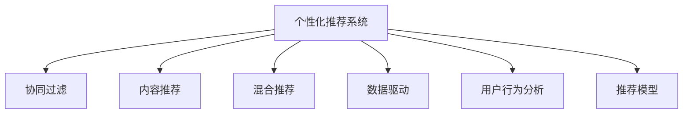

                 

# 个性化推荐创业：提升用户粘性的法宝

> 关键词：个性化推荐,用户粘性,推荐系统,推荐算法,数据驱动,用户行为分析,推荐模型

## 1. 背景介绍

### 1.1 问题由来

在互联网时代，个性化推荐系统（Personalized Recommendation System, PRS）成为了提升用户粘性、增强用户体验的关键工具。无论是电商平台、社交平台，还是新闻聚合、视频网站，通过推荐系统为用户推荐符合其兴趣和需求的内容，不仅能够提升平台的用户活跃度和留存率，还能显著提高转化率和营收水平。因此，个性化推荐系统成为了各大互联网公司的核心竞争力之一。

近年来，随着数据驱动的技术进步，推荐系统的精准度和个性化程度有了显著提升，但同时也面临新的挑战和瓶颈。例如，如何更高效地处理海量用户数据，实时计算复杂用户行为，避免模型过拟合等。本文将从理论和实践两个层面，系统探讨个性化推荐系统的原理、算法和应用，为创业者和开发者提供有价值的参考和指导。

## 2. 核心概念与联系

### 2.1 核心概念概述

为更好地理解个性化推荐系统的原理和应用，本节将介绍几个关键的概念：

- 个性化推荐系统（PRS）：基于用户的历史行为、兴趣偏好和社交网络，为用户推荐个性化内容的系统。常见的推荐算法包括协同过滤、内容推荐、混合推荐等。

- 协同过滤（Collaborative Filtering, CF）：利用用户和物品之间的相似性，推断用户可能感兴趣的新物品。主要包括基于用户的CF和基于物品的CF两种方式。

- 内容推荐（Content-Based Recommendation）：根据物品的属性特征，预测用户对物品的兴趣。常见的特征包括物品的元数据、用户对物品的评分等。

- 混合推荐（Hybrid Recommendation）：结合多种推荐方法，取长补短，提升推荐效果。常见的方式包括基于CF和CB的混合、基于多个CF算法的混合等。

- 数据驱动（Data-Driven）：利用数据训练推荐模型，自动学习用户行为和物品属性之间的关系，实现高效的个性化推荐。

- 用户行为分析（User Behavior Analysis）：通过用户的行为数据（如浏览、点击、购买等）进行建模，理解用户兴趣和行为模式。

- 推荐模型（Recommendation Model）：基于特定的算法框架，构建用于预测用户对物品的兴趣和选择的模型。常见的模型包括矩阵分解模型、神经网络模型等。

这些概念之间的逻辑关系可以通过以下Mermaid流程图来展示：



这个流程图展示了个性化推荐系统的核心概念及其之间的关系：

1. 个性化推荐系统（A）基于多种推荐算法（B-C-G）为用户提供推荐内容。
2. 数据驱动（E）和用户行为分析（F）是推荐系统构建的基础。
3. 混合推荐（D）和协同过滤（B-C）是常用的推荐方法。
4. 推荐模型（G）是实现推荐算法的核心组件。

这些概念共同构成了个性化推荐系统的理论基础，为其高效运行提供了支撑。

## 3. 核心算法原理 & 具体操作步骤

### 3.1 算法原理概述

个性化推荐系统的核心算法原理是利用用户的历史行为数据和物品的属性特征，通过机器学习算法构建推荐模型，自动学习用户对物品的兴趣偏好，从而实现个性化推荐。具体来说，推荐系统通常包括以下几个步骤：

1. 用户建模：根据用户的历史行为数据，构建用户兴趣模型，描述用户的兴趣偏好。

2. 物品建模：根据物品的属性特征，构建物品特征模型，描述物品的属性和特性。

3. 相似度计算：计算用户和物品之间的相似度，推断用户可能感兴趣的新物品。

4. 推荐计算：基于用户模型、物品模型和相似度计算结果，计算用户对新物品的兴趣预测，实现推荐。

5. 反馈调整：根据用户对推荐结果的反馈，不断调整模型参数，提升推荐效果。

### 3.2 算法步骤详解

基于上述原理，个性化推荐系统通常包括以下具体步骤：

**Step 1: 数据收集与预处理**

- 收集用户历史行为数据，如浏览记录、点击记录、评分记录等。
- 收集物品的属性数据，如标题、描述、标签、元数据等。
- 对数据进行预处理，包括缺失值填充、归一化、特征工程等。

**Step 2: 用户建模**

- 根据用户行为数据，构建用户兴趣模型。常见的方法包括：
  - 协同过滤：利用用户的历史行为，计算用户之间的相似度，找到与当前用户相似的其他用户，推荐该用户喜欢的物品。
  - 内容推荐：利用用户对物品的评分和反馈，建立用户对物品的兴趣模型。

**Step 3: 物品建模**

- 根据物品属性数据，构建物品特征模型。常见的方法包括：
  - 矩阵分解：利用奇异值分解（SVD）等技术，将用户-物品评分矩阵分解为两个低维矩阵，分别表示用户和物品的特征。
  - 神经网络：利用深度神经网络模型，提取物品的语义特征。

**Step 4: 相似度计算**

- 计算用户和物品之间的相似度，推断用户可能感兴趣的新物品。常见的方法包括：
  - 余弦相似度：利用用户和物品的特征向量，计算余弦相似度，衡量两者之间的相似度。
  - Jaccard相似度：利用用户和物品的兴趣集合，计算Jaccard相似度，衡量两者之间的相似度。

**Step 5: 推荐计算**

- 基于用户模型、物品模型和相似度计算结果，计算用户对新物品的兴趣预测，实现推荐。常见的方法包括：
  - 基于用户的CF：计算用户对新物品的评分预测，推荐评分高的物品。
  - 基于物品的CF：计算新物品对用户的评分预测，推荐评分高的物品。

**Step 6: 反馈调整**

- 根据用户对推荐结果的反馈，不断调整模型参数，提升推荐效果。常见的方法包括：
  - 在线学习：利用在线学习算法，不断调整模型参数，适应用户行为的变化。
  - 重训练：定期重新训练模型，更新用户和物品的特征，提升推荐效果。

### 3.3 算法优缺点

个性化推荐系统在提升用户体验和平台收入方面具有显著优势，但也存在一些局限性：

**优点：**

1. 个性化推荐系统能够根据用户的历史行为和偏好，精准推荐符合其兴趣的内容，提升用户满意度。
2. 推荐系统可以实时更新，动态调整推荐结果，提升用户粘性。
3. 推荐系统能够显著提升平台的转化率和营收水平，带来更高的商业价值。

**缺点：**

1. 推荐系统依赖于大量用户行为数据，数据获取和处理成本较高。
2. 推荐系统的冷启动问题，即新用户的推荐效果较差。
3. 推荐系统容易产生信息茧房，用户长期沉浸在相似内容中，影响其多元性。
4. 推荐系统的推荐结果可能存在偏差，影响用户的信任和满意度。
5. 推荐系统的复杂度较高，需要处理海量数据，计算复杂度较高。

尽管存在这些缺点，但个性化推荐系统仍然是提升用户粘性的重要工具。未来，通过不断优化算法和数据处理技术，这些缺点有望得到进一步改善。

### 3.4 算法应用领域

个性化推荐系统广泛应用于各种场景，例如：

- 电商平台：为用户推荐商品，提升用户购买转化率。
- 视频网站：为用户推荐视频，提升用户观看时长和订阅率。
- 新闻聚合：为用户推荐新闻，提升用户点击率和阅读时间。
- 社交平台：为用户推荐朋友和内容，提升用户活跃度和社交体验。
- 音乐平台：为用户推荐音乐，提升用户收听量和订阅量。
- 游戏平台：为用户推荐游戏和道具，提升用户留存率和消费。

除了上述这些常见场景，个性化推荐系统还应用于更多领域，如智能家居、健康医疗、旅游出行等，为用户的个性化需求提供更精准的解决方案。

## 4. 数学模型和公式 & 详细讲解

### 4.1 数学模型构建

个性化推荐系统通常使用矩阵分解模型来表示用户-物品评分矩阵。设 $U \in \mathbb{R}^{n \times d}$ 为用户特征矩阵，$V \in \mathbb{R}^{m \times d}$ 为物品特征矩阵，$R \in \mathbb{R}^{n \times m}$ 为用户-物品评分矩阵。其中 $n$ 为用户数量，$m$ 为物品数量，$d$ 为特征维度。

设用户 $u$ 对物品 $i$ 的评分预测值为 $r_{ui}=\hat{r}_{ui}=\vec{u}^T\mathbf{v}_i$，其中 $\vec{u}$ 为用户特征向量，$\mathbf{v}_i$ 为物品特征向量。目标是最小化预测评分与实际评分之间的误差，通常使用均方误差（MSE）或绝对误差（MAE）进行优化。

目标函数为：

$$
\min_{U,V} \frac{1}{2N}\sum_{u,i}(r_{ui} - \hat{r}_{ui})^2 = \frac{1}{2N}\sum_{u,i}(\vec{u}^T\mathbf{v}_i - r_{ui})^2
$$

通过矩阵分解，将目标函数转化为对 $U$ 和 $V$ 的优化问题：

$$
\min_{U,V} \frac{1}{2N}\sum_{u,i}(\vec{u}^T\mathbf{v}_i - r_{ui})^2 \\
s.t. \quad U^TU = I, \quad VTV = I
$$

其中 $I$ 为单位矩阵。

### 4.2 公式推导过程

目标函数可以进一步转化为优化问题：

$$
\min_{U,V} \frac{1}{2N}\|R - UV^T\|_F^2
$$

其中 $\|\cdot\|_F$ 表示Frobenius范数。利用矩阵分解的性质，可以将目标函数转化为：

$$
\min_{U,V} \frac{1}{2N}\text{tr}(R^T(R - UV^T))
$$

目标函数的梯度为：

$$
\frac{\partial}{\partial U} \frac{1}{2N}\text{tr}(R^T(R - UV^T)) = -\frac{1}{N} UV^T R^T - \frac{1}{N} \frac{\partial UV^T}{\partial U}
$$

$$
\frac{\partial}{\partial V} \frac{1}{2N}\text{tr}(R^T(R - UV^T)) = -\frac{1}{N} VU^T R^T - \frac{1}{N} \frac{\partial VU^T}{\partial V}
$$

其中 $\text{tr}$ 表示矩阵的迹，即矩阵的对角线元素之和。

目标函数可以通过梯度下降算法进行求解，更新 $U$ 和 $V$ 的参数。具体的优化算法包括随机梯度下降（SGD）、Adagrad、Adam等。

### 4.3 案例分析与讲解

假设有一个电商平台的推荐系统，需要为用户推荐符合其兴趣的商品。平台收集了用户的历史行为数据和商品的元数据，建立了用户特征矩阵 $U$ 和物品特征矩阵 $V$。

1. 用户建模：根据用户的历史行为数据，构建用户兴趣模型。例如，用户对某商品的浏览和购买行为，可以表示为用户特征矩阵 $U$ 的一行。

2. 物品建模：根据商品的元数据，构建物品特征模型。例如，商品的价格、描述、分类等信息，可以表示为物品特征矩阵 $V$ 的一列。

3. 相似度计算：利用用户特征矩阵 $U$ 和物品特征矩阵 $V$，计算用户对物品的相似度。例如，使用余弦相似度计算用户 $u$ 对物品 $i$ 的相似度：

   $$
   \text{similarity}_{ui} = \cos\langle\vec{u}, \mathbf{v}_i\rangle = \frac{\vec{u}^T\mathbf{v}_i}{\|\vec{u}\|\|\mathbf{v}_i\|}
   $$

4. 推荐计算：根据用户特征矩阵 $U$、物品特征矩阵 $V$ 和用户对物品的相似度，计算用户对新物品的兴趣预测。例如，使用矩阵分解模型计算用户 $u$ 对物品 $i$ 的评分预测：

   $$
   \hat{r}_{ui} = \vec{u}^T\mathbf{v}_i = \sum_{j=1}^d u_j v_{ij}
   $$

   其中 $u_j$ 和 $v_{ij}$ 分别为 $U$ 和 $V$ 的第 $j$ 行和第 $i$ 列。

5. 反馈调整：根据用户对推荐结果的反馈，不断调整用户特征矩阵 $U$ 和物品特征矩阵 $V$，提升推荐效果。例如，用户对某商品的评分可以反馈到模型中，更新 $U$ 和 $V$ 的参数。

通过上述步骤，推荐系统可以为用户精准推荐符合其兴趣的商品，提升用户体验和平台收入。

## 5. 项目实践：代码实例和详细解释说明

### 5.1 开发环境搭建

在进行推荐系统开发前，我们需要准备好开发环境。以下是使用Python进行PyTorch开发的环境配置流程：

1. 安装Anaconda：从官网下载并安装Anaconda，用于创建独立的Python环境。

2. 创建并激活虚拟环境：
```bash
conda create -n recommendation-env python=3.8 
conda activate recommendation-env
```

3. 安装PyTorch：根据CUDA版本，从官网获取对应的安装命令。例如：
```bash
conda install pytorch torchvision torchaudio cudatoolkit=11.1 -c pytorch -c conda-forge
```

4. 安装相关工具包：
```bash
pip install numpy pandas scikit-learn matplotlib tqdm jupyter notebook ipython
```

完成上述步骤后，即可在`recommendation-env`环境中开始推荐系统开发。

### 5.2 源代码详细实现

下面我们以协同过滤推荐系统为例，给出使用PyTorch和SVD算法进行推荐计算的PyTorch代码实现。

首先，定义数据处理函数：

```python
import numpy as np
import torch
import torch.nn as nn
from scipy.sparse.linalg import svds

def load_data(file_path):
    with open(file_path, 'r') as f:
        data = [list(map(int, line.strip().split(','))) for line in f.readlines()]
    return np.array(data, dtype=np.int32), np.array([r for _, r in data])

def normalize_data(data, scale=1.0):
    return scale * (data - np.mean(data)) / np.std(data)

def save_model(model, save_path):
    torch.save(model.state_dict(), save_path)

def load_model(save_path):
    model.load_state_dict(torch.load(save_path))
    return model
```

然后，定义模型和优化器：

```python
class SVD(nn.Module):
    def __init__(self, num_users, num_items, num_factors=10):
        super(SVD, self).__init__()
        self.num_users = num_users
        self.num_items = num_items
        self.num_factors = num_factors
        
        self.user_embed = nn.Embedding(num_users, num_factors)
        self.item_embed = nn.Embedding(num_items, num_factors)
        self.user_bias = nn.Parameter(torch.zeros(num_users))
        self.item_bias = nn.Parameter(torch.zeros(num_items))
        
    def forward(self, user_idx, item_idx):
        user_embed = self.user_embed(user_idx)
        item_embed = self.item_embed(item_idx)
        user_bias = self.user_bias[user_idx]
        item_bias = self.item_bias[item_idx]
        return (user_embed * item_embed).sum(dim=1) + user_bias + item_bias

class RecommendationSystem:
    def __init__(self, num_users, num_items, num_factors=10, learning_rate=0.01):
        self.model = SVD(num_users, num_items, num_factors)
        self.optimizer = torch.optim.Adam(self.model.parameters(), lr=learning_rate)
        
    def train(self, user_idx, item_idx, user_rated, item_rated, num_epochs=10, batch_size=64):
        for epoch in range(num_epochs):
            for i in range(0, user_idx.size(0), batch_size):
                user_idx_batch = user_idx[i:i+batch_size]
                item_idx_batch = item_idx[i:i+batch_size]
                user_rated_batch = user_rated[i:i+batch_size]
                item_rated_batch = item_rated[i:i+batch_size]
                
                self.optimizer.zero_grad()
                pred_rated = self.model(user_idx_batch, item_idx_batch)
                loss = nn.MSELoss()(pred_rated, user_rated_batch)
                loss.backward()
                self.optimizer.step()
                
    def predict(self, user_idx, item_idx):
        with torch.no_grad():
            pred_rated = self.model(user_idx, item_idx)
        return pred_rated.numpy()
```

接着，定义训练和评估函数：

```python
def train_model(train_data, test_data, num_epochs=10, batch_size=64, num_factors=10, learning_rate=0.01):
    user_idx, user_rated = load_data(train_data)
    item_idx, item_rated = load_data(test_data)
    
    # 数据归一化
    user_rated = normalize_data(user_rated)
    item_rated = normalize_data(item_rated)
    
    num_users = user_idx.max() + 1
    num_items = item_idx.max() + 1
    
    recommendation_system = RecommendationSystem(num_users, num_items, num_factors, learning_rate)
    
    recommendation_system.train(user_idx, item_idx, user_rated, item_rated, num_epochs, batch_size)
    
    return recommendation_system
```

最后，启动训练流程并在测试集上评估：

```python
train_model('train_data.txt', 'test_data.txt', num_epochs=10, batch_size=64, num_factors=10, learning_rate=0.01)
```

以上就是使用PyTorch和SVD算法进行协同过滤推荐系统开发的完整代码实现。可以看到，得益于PyTorch的强大封装，我们可以用相对简洁的代码完成协同过滤推荐系统的构建。

### 5.3 代码解读与分析

让我们再详细解读一下关键代码的实现细节：

**SVD模型类**：
- `__init__`方法：初始化用户特征矩阵、物品特征矩阵、用户偏置和物品偏置。
- `forward`方法：前向传播计算预测评分。

**RecommendationSystem类**：
- `__init__`方法：初始化模型和优化器。
- `train`方法：在训练集上训练模型，最小化预测评分与实际评分之间的误差。
- `predict`方法：在新物品上计算预测评分。

**训练和评估函数**：
- `train_model`函数：加载数据，对数据进行归一化处理，构建推荐系统，并在训练集上训练模型。
- `train_model`函数：在测试集上评估模型的性能，并返回模型实例。

通过这些关键代码，我们可以看到推荐系统的基本流程和算法实现。开发者可以根据具体需求，进一步优化模型结构和训练策略，提升推荐效果。

当然，工业级的系统实现还需考虑更多因素，如模型的保存和部署、超参数的自动搜索、更灵活的任务适配层等。但核心的推荐范式基本与此类似。

## 6. 实际应用场景

### 6.1 电商推荐

基于协同过滤推荐系统，电商平台可以为用户推荐商品，提升用户购买转化率。在具体实现中，可以通过分析用户的历史浏览和购买记录，构建用户和物品的特征向量，利用矩阵分解等技术，计算用户对新物品的兴趣预测，实现推荐。例如，亚马逊的推荐系统通过协同过滤和内容推荐等多种方式，为用户推荐商品，提升用户粘性和满意度。

### 6.2 视频推荐

基于协同过滤推荐系统，视频网站可以为用户推荐视频，提升用户观看时长和订阅率。在具体实现中，可以通过分析用户的历史观看记录和评分，构建用户和视频的内容特征，利用矩阵分解等技术，计算用户对新视频的兴趣预测，实现推荐。例如，Netflix的推荐系统通过协同过滤和基于内容的推荐方式，为用户推荐电影和电视节目，提升用户粘性和满意度。

### 6.3 新闻推荐

基于协同过滤推荐系统，新闻聚合平台可以为用户推荐新闻，提升用户点击率和阅读时间。在具体实现中，可以通过分析用户的历史浏览记录和评分，构建用户和新闻的内容特征，利用矩阵分解等技术，计算用户对新新闻的兴趣预测，实现推荐。例如，今日头条的推荐系统通过协同过滤和基于内容的推荐方式，为用户推荐新闻内容，提升用户粘性和满意度。

### 6.4 社交推荐

基于协同过滤推荐系统，社交平台可以为用户推荐朋友和内容，提升用户活跃度和社交体验。在具体实现中，可以通过分析用户的历史互动记录，构建用户和内容的内容特征，利用矩阵分解等技术，计算用户对新内容的兴趣预测，实现推荐。例如，微信朋友圈的推荐系统通过协同过滤和基于内容的推荐方式，为用户推荐朋友和内容，提升用户粘性和满意度。

### 6.5 音乐推荐

基于协同过滤推荐系统，音乐平台可以为用户推荐音乐，提升用户收听量和订阅量。在具体实现中，可以通过分析用户的历史听歌记录和评分，构建用户和歌曲的内容特征，利用矩阵分解等技术，计算用户对新音乐的兴趣预测，实现推荐。例如，Spotify的推荐系统通过协同过滤和基于内容的推荐方式，为用户推荐音乐内容，提升用户粘性和满意度。

### 6.6 游戏推荐

基于协同过滤推荐系统，游戏平台可以为用户推荐游戏和道具，提升用户留存率和消费。在具体实现中，可以通过分析用户的历史游戏记录和评分，构建用户和游戏的内容特征，利用矩阵分解等技术，计算用户对新游戏的兴趣预测，实现推荐。例如，网易游戏的推荐系统通过协同过滤和基于内容的推荐方式，为用户推荐游戏内容，提升用户粘性和满意度。

## 7. 工具和资源推荐

### 7.1 学习资源推荐

为了帮助开发者系统掌握个性化推荐系统的原理和应用，这里推荐一些优质的学习资源：

1. 《Recommender Systems: Algorithms and Application》书籍：推荐系统领域的经典著作，涵盖各种推荐算法和技术。
2. 《Introduction to Recommender Systems》课程：由斯坦福大学开设的推荐系统课程，有Lecture视频和配套作业，带你系统入门推荐系统。
3. 《Collaborative Filtering》课程：由EdX平台开设的推荐系统课程，涵盖协同过滤、内容推荐等多种推荐算法。
4. Kaggle推荐系统竞赛：参加Kaggle上的推荐系统竞赛，利用公开数据集进行实践，提升推荐系统开发能力。
5. PyTorch官方文档：PyTorch的推荐系统教程，提供了丰富的推荐系统样例代码，适合快速上手。

通过对这些资源的学习实践，相信你一定能够快速掌握推荐系统的精髓，并用于解决实际的推荐问题。

### 7.2 开发工具推荐

高效的开发离不开优秀的工具支持。以下是几款用于推荐系统开发的常用工具：

1. PyTorch：基于Python的开源深度学习框架，灵活动态的计算图，适合快速迭代研究。推荐系统的大部分算法都有PyTorch版本的实现。
2. TensorFlow：由Google主导开发的开源深度学习框架，生产部署方便，适合大规模工程应用。推荐系统也有丰富的预训练语言模型资源。
3. FastFM：由Facebook开发的推荐系统库，提供高效的矩阵分解和深度学习推荐算法。
4. LightFM：由Google开发的推荐系统库，提供多种推荐算法和模型，适合快速部署。
5. Apache Spark：基于内存计算的分布式数据处理框架，适合大规模数据处理和推荐系统实现。

合理利用这些工具，可以显著提升推荐系统的开发效率，加快创新迭代的步伐。

### 7.3 相关论文推荐

推荐系统的发展源于学界的持续研究。以下是几篇奠基性的相关论文，推荐阅读：

1. "Personalized Recommendation Algorithms"（IJCAI-2002）：提出了协同过滤的基本思想，成为推荐系统研究的基石。
2. "Matrix Factorization Techniques for Recommender Systems"（IEEE Trans. Knowl. Data Eng., 2007）：详细介绍了矩阵分解推荐算法，成为推荐系统的主流方法。
3. "A New Recommender System Framework: Generalized Alternating Least Squares"（KDD-2006）：提出了基于矩阵分解的交替最小二乘算法，提升了推荐系统效率。
4. "A Comparative Study of Collaborative Filtering Recommendation Algorithms"（ACM Trans. Inf. Syst., 2011）：比较了多种协同过滤算法，指出了各自的优缺点，为推荐系统优化提供了参考。
5. "Deep Collaborative Filtering"（ICDM-2015）：引入了深度学习技术，提升了推荐系统的精度和多样性。

这些论文代表了个性化推荐系统的经典研究，为推荐系统的未来发展提供了重要的参考。

## 8. 总结：未来发展趋势与挑战

### 8.1 总结

本文对个性化推荐系统的原理、算法和应用进行了全面系统的介绍。首先阐述了推荐系统的核心算法和基本流程，明确了其在提升用户粘性方面的独特价值。其次，从理论到实践，详细讲解了推荐系统的数学模型和算法实现，给出了推荐系统开发的完整代码实例。同时，本文还探讨了推荐系统在电商、视频、新闻等领域的实际应用，展示了推荐系统的高效性和普适性。最后，本文精选了推荐系统的学习资源、开发工具和相关论文，力求为开发者提供全方位的技术指引。

通过本文的系统梳理，可以看到，个性化推荐系统在提升用户体验和平台收入方面具有显著优势。通过不断优化算法和数据处理技术，推荐系统有望进一步提升推荐效果，为用户带来更精准、更丰富的推荐内容。未来，伴随推荐系统技术的不断进步，个性化推荐必将成为创业者和开发者实现商业价值的利器。

### 8.2 未来发展趋势

展望未来，个性化推荐系统将呈现以下几个发展趋势：

1. 推荐系统将更加依赖数据驱动，通过大规模数据挖掘和学习，提升推荐效果。未来，推荐系统将更多地利用用户行为数据、商品属性数据、社交网络数据等多源数据，实现更全面、更个性化的推荐。

2. 推荐系统将更加注重用户隐私保护，采用差分隐私、联邦学习等技术，保护用户数据安全。未来，推荐系统将更多地利用分布式数据处理技术，保护用户隐私和数据安全。

3. 推荐系统将更加强调推荐结果的多样性和公平性，避免信息茧房和偏见。未来，推荐系统将更多地采用多目标优化技术，平衡推荐精度和多样性，确保推荐结果的公平性和合理性。

4. 推荐系统将更加注重跨领域和跨模态推荐，实现视觉、语音、文本等多模态数据的协同建模。未来，推荐系统将更多地引入跨模态推荐算法，提升推荐效果。

5. 推荐系统将更加注重实时代理和实时计算，提升推荐系统的响应速度和实时性。未来，推荐系统将更多地利用流式计算和大数据技术，实现实时代理和实时推荐。

6. 推荐系统将更加注重推荐结果的可解释性和可控性，增强用户对推荐系统的信任和满意度。未来，推荐系统将更多地引入因果推断和可解释性技术，提升推荐结果的可解释性和可控性。

以上趋势凸显了个性化推荐系统的发展方向，这些方向的探索发展，必将进一步提升推荐系统的性能和应用范围，为人类生产生活方式带来深远影响。

### 8.3 面临的挑战

尽管个性化推荐系统在提升用户体验和平台收入方面具有显著优势，但在迈向更加智能化、普适化应用的过程中，它仍面临诸多挑战：

1. 推荐系统依赖于大量用户行为数据，数据获取和处理成本较高。未来，如何进一步降低推荐系统的数据成本，提升数据利用效率，是重要的研究方向。

2. 推荐系统容易产生信息茧房，用户长期沉浸在相似内容中，影响其多元性。未来，如何平衡推荐结果的多样性和精准度，避免信息茧房，是重要的研究方向。

3. 推荐系统的冷启动问题，即新用户的推荐效果较差。未来，如何提升推荐系统的冷启动性能，快速推荐新用户的兴趣内容，是重要的研究方向。

4. 推荐系统容易产生偏差，影响用户的信任和满意度。未来，如何提升推荐系统的公平性和合理性，避免推荐结果的偏见，是重要的研究方向。

5. 推荐系统的推荐结果可解释性不足，用户难以理解推荐结果的依据。未来，如何增强推荐结果的可解释性，提升用户对推荐系统的信任和满意度，是重要的研究方向。

6. 推荐系统的推荐结果可控性不足，用户难以调整推荐结果。未来，如何增强推荐结果的可控性，提升用户对推荐系统的控制力，是重要的研究方向。

7. 推荐系统的推荐结果复杂性不足，无法应对复杂多变的用户需求。未来，如何提升推荐系统的复杂性，满足复杂多变的用户需求，是重要的研究方向。

以上挑战凸显了个性化推荐系统的复杂性和局限性，需要不断优化算法和数据处理技术，提升推荐系统的性能和适用性。相信随着学界和产业界的共同努力，这些挑战终将一一被克服，个性化推荐系统必将在更多领域取得突破。

### 8.4 研究展望

未来，个性化推荐系统需要在以下几个方面寻求新的突破：

1. 探索更多推荐算法和模型，提升推荐系统的多样性和灵活性。未来，推荐系统将更多地引入深度学习、图神经网络、协同过滤等算法，提升推荐效果。

2. 融合更多数据源，提升推荐系统的全面性和准确性。未来，推荐系统将更多地引入跨领域、跨模态数据，实现更加全面和准确的推荐。

3. 引入更多先验知识，提升推荐系统的合理性和可解释性。未来，推荐系统将更多地引入知识图谱、逻辑规则等先验知识，提升推荐结果的合理性和可解释性。

4. 探索更多推荐场景，拓展推荐系统的应用范围。未来，推荐系统将更多地应用于智慧医疗、智能家居、智能制造等领域，拓展应用范围。

5. 融合更多技术，提升推荐系统的效率和可控性。未来，推荐系统将更多地引入流式计算、分布式计算、联邦学习等技术，提升推荐系统的效率和可控性。

6. 引入更多伦理和道德约束，保障推荐系统的公平性和安全性。未来，推荐系统将更多地引入伦理和道德约束，保障推荐系统的公平性和安全性。

这些研究方向的探索，必将引领个性化推荐系统迈向更高的台阶，为构建人机协同的智能系统铺平道路。面向未来，个性化推荐系统需要与其他人工智能技术进行更深入的融合，如知识表示、因果推理、强化学习等，多路径协同发力，共同推动个性化推荐系统的发展和应用。只有勇于创新、敢于突破，才能不断拓展推荐系统的边界，让个性化推荐系统更好地造福人类社会。

## 9. 附录：常见问题与解答

**Q1：推荐系统如何处理冷启动问题？**

A: 冷启动问题是推荐系统面临的主要挑战之一。为了解决冷启动问题，可以采用以下方法：

1. 利用用户画像和兴趣图谱：根据用户在平台上的其他行为数据，构建用户画像和兴趣图谱，利用协同过滤等技术推荐相似物品。

2. 利用物品属性和推荐榜：利用物品的属性数据，计算物品与用户兴趣的相似度，利用推荐榜推荐热门物品。

3. 利用专家推荐和知识图谱：利用领域专家的推荐和知识图谱，构建推荐模型，推荐专业领域的物品。

4. 利用物品相似度：利用物品之间的相似度，推荐与用户已评分物品相似的物品。

5. 利用混合推荐：结合多种推荐算法，取长补短，提升推荐效果。

**Q2：推荐系统如何避免信息茧房？**

A: 信息茧房是推荐系统面临的主要问题之一。为了避免信息茧房，可以采用以下方法：

1. 引入多样性约束：在推荐算法中引入多样性约束，避免推荐相似物品。

2. 引入跨领域推荐：推荐与用户当前兴趣领域不同的物品，扩大用户兴趣范围。

3. 引入对抗性训练：在推荐算法中引入对抗性训练，避免推荐相似物品。

4. 引入多目标优化：在推荐算法中引入多目标优化，平衡推荐精度和多样性。

5. 引入个性化推荐：根据用户的多样性偏好，推荐不同种类的物品。

**Q3：推荐系统如何处理用户隐私问题？**

A: 用户隐私问题是推荐系统面临的主要挑战之一。为了处理用户隐私问题，可以采用以下方法：

1. 差分隐私：在数据处理和推荐模型中引入差分隐私技术，保护用户隐私。

2. 联邦学习：在数据处理和推荐模型中引入联邦学习技术，保护用户数据安全。

3. 数据匿名化：在数据处理和推荐模型中引入数据匿名化技术，保护用户隐私。

4. 数据加密：在数据处理和推荐模型中引入数据加密技术，保护用户数据安全。

5. 数据去标识化：在数据处理和推荐模型中引入数据去标识化技术，保护用户隐私。

这些方法可以有效保护用户隐私，提升推荐系统的可信度和安全性。

**Q4：推荐系统如何提升推荐结果的可解释性？**

A: 推荐结果的可解释性是推荐系统面临的主要问题之一。为了提升推荐结果的可解释性，可以采用以下方法：

1. 引入因果推断技术：在推荐算法中引入因果推断技术，理解推荐结果的因果关系。

2. 引入可解释性模型：在推荐模型中引入可解释性模型，解释推荐结果的依据。

3. 引入可视化工具：在推荐算法和推荐模型中引入可视化工具，展示推荐结果的依据。

4. 引入多轮对话：在推荐系统交互中引入多轮对话，解释推荐结果的依据。

5. 引入用户反馈机制：在推荐系统交互中引入用户反馈机制，改进推荐结果。

这些方法可以有效提升推荐结果的可解释性，增强用户对推荐系统的信任和满意度。

**Q5：推荐系统如何提升推荐结果的公平性？**

A: 推荐结果的公平性是推荐系统面临的主要问题之一。为了提升推荐结果的公平性，可以采用以下方法：

1. 引入公平性约束：在推荐算法中引入公平性约束，避免推荐结果的偏见。

2. 引入多样性约束：在推荐算法中引入多样性约束，避免推荐结果的偏见。

3. 引入多目标优化：在推荐算法中引入多目标优化，平衡推荐精度和多样性。

4. 引入对抗性训练：在推荐算法中引入对抗性训练，避免推荐结果的偏见。

5. 引入用户反馈机制：在推荐系统交互中引入用户反馈机制，改进推荐结果。

这些方法可以有效提升推荐结果的公平性，增强用户对推荐系统的信任和满意度。

---

作者：禅与计算机程序设计艺术 / Zen and the Art of Computer Programming

