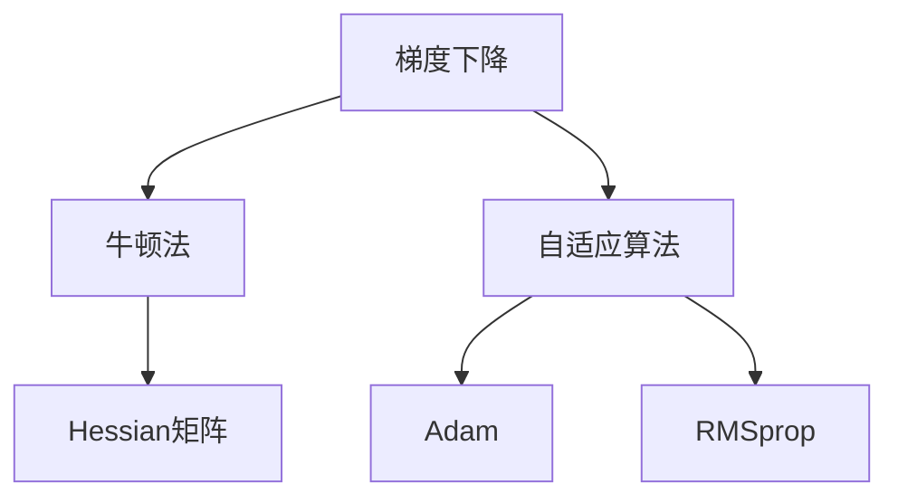

                 

# 二阶优化方法：超越一阶方法的AI训练策略

> 关键词：二阶优化方法,深度学习,梯度下降,牛顿法,Hessian矩阵,自适应算法,TensorFlow,PyTorch

## 1. 背景介绍

深度学习模型的训练是一个典型的非凸优化问题。近年来，以梯度下降为代表的一阶优化方法在模型训练中得到了广泛应用，并在多个领域取得了显著的成果。然而，一阶方法存在收敛速度慢、收敛性较差等问题，特别是在高维空间和大规模数据集上，这些问题变得尤为显著。为了解决这些问题，研究者们提出了多种二阶优化方法，这些方法在理论上能够显著加速收敛，提高模型的训练效率和性能。

本博客将系统介绍二阶优化方法的核心概念和算法原理，并通过具体案例和项目实践，展示二阶优化方法在深度学习模型训练中的实际应用。本文的核心章节内容如下：

1. **背景介绍**
2. **核心概念与联系**
3. **核心算法原理 & 具体操作步骤**
4. **数学模型和公式 & 详细讲解 & 举例说明**
5. **项目实践：代码实例和详细解释说明**
6. **实际应用场景**
7. **工具和资源推荐**
8. **总结：未来发展趋势与挑战**
9. **附录：常见问题与解答**

## 2. 核心概念与联系

### 2.1 核心概念概述

为更好地理解二阶优化方法，本节将介绍几个密切相关的核心概念：

- 梯度下降：是深度学习中最常用的优化方法，通过不断调整模型参数，使损失函数最小化。一阶优化方法通常使用梯度作为更新方向的指引。

- 牛顿法：是一种基于二阶导数信息的优化方法，能够更精确地估计函数的最优解，但计算量较大。

- Hessian矩阵：牛顿法的核心在于求解函数在当前点的二阶导数矩阵，即Hessian矩阵。Hessian矩阵的计算和存储需要较大的计算资源。

- 自适应算法：如Adam、RMSprop等，通过动态调整学习率，适应不同参数的梯度变化，减少收敛过程中的震荡。

- TensorFlow、PyTorch：两大深度学习框架，提供了丰富的优化器和自动微分功能，支持多种二阶优化方法的实现。

这些核心概念之间的逻辑关系可以通过以下Mermaid流程图来展示：



这个流程图展示了一阶和二阶优化方法的基本流程：

1. 一阶优化方法使用梯度作为更新方向，牛顿法利用二阶导数信息进一步优化。
2. 自适应算法根据梯度变化动态调整学习率，提高训练效率。
3. 牛顿法需要计算和存储Hessian矩阵，计算开销较大。

## 3. 核心算法原理 & 具体操作步骤

### 3.1 算法原理概述

二阶优化方法的核心在于利用函数的二阶导数信息进行优化。相比于仅使用梯度的一阶方法，二阶方法能够更精确地估计函数的极小值点，从而加快收敛速度。

以牛顿法为例，其基本思路为：在当前点 $x$ 处，通过求解Hessian矩阵的逆 $H^{-1}(x)$，计算出下一个搜索方向 $d$，再沿着该方向更新 $x$。更新公式如下：

$$
x_{n+1} = x_n + H^{-1}(x_n) \nabla f(x_n)
$$

其中 $\nabla f(x_n)$ 表示函数 $f(x)$ 在 $x_n$ 处的梯度向量，$H^{-1}(x_n)$ 表示函数 $f(x)$ 在 $x_n$ 处的Hessian矩阵的逆。

尽管牛顿法在理论上具有较快的收敛速度，但由于其需要计算和存储Hessian矩阵，计算开销较大，不适用于大规模数据集和高维空间的优化问题。因此，研究者们提出了多种自适应二阶优化算法，如L-BFGS、Adam、RMSprop等，这些算法在保证收敛速度的同时，降低了计算成本。

### 3.2 算法步骤详解

二阶优化算法的核心在于如何高效地计算和更新Hessian矩阵。下面介绍几种常用的二阶优化算法的详细步骤：

**L-BFGS算法**

L-BFGS算法是一种内存效率较高的自适应二阶优化方法，通过近似求解Hessian矩阵的逆，避免了直接存储和计算Hessian矩阵的昂贵开销。

1. 初始化：随机选择初始点 $x_0$ 和搜索方向 $d_0$，设置迭代次数 $n$ 和精度 $\epsilon$。

2. 计算梯度：计算当前点 $x_n$ 处的梯度 $\nabla f(x_n)$。

3. 计算下降方向：求解一个包含 $n$ 个Hessian矩阵的逆组成的线性方程组，得到新的搜索方向 $d_{n+1}$。

4. 更新参数：使用 $d_{n+1}$ 更新当前点 $x_{n+1}$。

5. 检查停止条件：如果满足精度要求或迭代次数达到预设值，则停止迭代。

**Adam算法**

Adam算法是一种自适应学习率优化算法，结合了一阶梯度和二阶梯度的信息，能够快速收敛且稳定性较好。

1. 初始化：随机选择初始点 $x_0$，设置初始动量向量 $m_0$ 和动量平方向量 $v_0$。

2. 计算梯度：计算当前点 $x_n$ 处的梯度 $g_n = \nabla f(x_n)$。

3. 更新动量：更新动量向量 $m_{n+1} = \beta_1 m_n + (1-\beta_1) g_n$，动量平方向量 $v_{n+1} = \beta_2 v_n + (1-\beta_2) g_n^2$。

4. 更新学习率：计算自适应学习率 $\alpha_{n+1} = \frac{\sqrt{1-\beta_2^n}}{1-\beta_1^n} \frac{\epsilon}{\sqrt{v_{n+1}}}$。

5. 更新参数：使用学习率 $\alpha_{n+1}$ 更新当前点 $x_{n+1}$。

6. 检查停止条件：如果满足精度要求或迭代次数达到预设值，则停止迭代。

### 3.3 算法优缺点

二阶优化方法具有以下优点：

1. 收敛速度快：利用函数的二阶导数信息，能够更快地找到最优解。
2. 精度高：通过考虑函数的二阶导数，能够更准确地估计极小值点。
3. 适用于复杂函数：在多维空间和高维数据集上，二阶方法表现更好。

然而，二阶优化方法也存在一些缺点：

1. 计算复杂度高：计算Hessian矩阵的逆需要较高的计算资源。
2. 存储开销大：需要存储Hessian矩阵或其近似，占用较多内存。
3. 参数调节困难：需要调整二阶导数矩阵的衰减因子，调节不当可能导致收敛困难。
4. 可能收敛于局部最优：在局部凸函数上，二阶方法可能无法找到全局最优解。

### 3.4 算法应用领域

二阶优化方法在深度学习模型训练中得到了广泛应用，特别是在优化复杂函数和大型数据集时表现出色。

- 计算机视觉：用于图像分类、目标检测、语义分割等任务。
- 自然语言处理：用于文本分类、情感分析、机器翻译等任务。
- 语音识别：用于语音识别、语音合成等任务。
- 强化学习：用于策略优化、路径规划等任务。

此外，二阶优化方法还广泛应用于数据分析、金融建模等领域，提升模型的训练效率和性能。

## 4. 数学模型和公式 & 详细讲解 & 举例说明

### 4.1 数学模型构建

本节将使用数学语言对二阶优化方法进行更严格的刻画。

设函数 $f(x)$ 可微且具有连续的二阶导数，其泰勒展开式为：

$$
f(x + d) = f(x) + \nabla f(x) \cdot d + \frac{1}{2} d^T H(x) d + o(\|d\|^2)
$$

其中 $H(x)$ 表示函数 $f(x)$ 在点 $x$ 处的Hessian矩阵，$\nabla f(x)$ 表示函数 $f(x)$ 在点 $x$ 处的梯度向量。

通过泰勒展开式，我们可以得到二阶方法的基本更新公式：

$$
x_{n+1} = x_n - \frac{H^{-1}(x_n) \nabla f(x_n)}{\|H^{-1}(x_n) \nabla f(x_n)\|_2}
$$

其中 $H^{-1}(x_n)$ 表示函数 $f(x)$ 在点 $x_n$ 处的Hessian矩阵的逆，$\|\cdot\|_2$ 表示向量或矩阵的L2范数。

### 4.2 公式推导过程

以下我们将推导牛顿法和L-BFGS算法的具体更新公式。

**牛顿法**

牛顿法的基本更新公式为：

$$
x_{n+1} = x_n - H^{-1}(x_n) \nabla f(x_n)
$$

其中 $H^{-1}(x_n)$ 表示函数 $f(x)$ 在点 $x_n$ 处的Hessian矩阵的逆。

**L-BFGS算法**

L-BFGS算法通过近似求解Hessian矩阵的逆，得到更新方向 $d_{n+1}$。具体公式为：

$$
d_{n+1} = \alpha_n S_n d_n + \beta_n H_n d_{n-1} - (1-\alpha_n)\frac{\nabla f(x_n)}{\|\nabla f(x_n)\|^2} (\nabla f(x_n) \cdot d_n)
$$

其中 $S_n$ 和 $H_n$ 表示包含 $n$ 个Hessian矩阵逆的线性方程组，$\alpha_n$ 和 $\beta_n$ 表示线性的校正因子，$\nabla f(x_n)$ 表示函数 $f(x)$ 在点 $x_n$ 处的梯度向量。

### 4.3 案例分析与讲解

假设我们要使用牛顿法优化函数 $f(x) = \frac{1}{2}x^T A x + b^T x + c$，其中 $A$ 为对称正定矩阵，$b$ 和 $c$ 为常向量。

首先，我们求出函数的一阶导数和二阶导数：

$$
\nabla f(x) = A x + b
$$

$$
H(x) = A
$$

代入牛顿法的更新公式，得：

$$
x_{n+1} = x_n - A^{-1} (A x_n + b)
$$

进一步化简，得：

$$
x_{n+1} = x_n - A^{-1} A x_n - A^{-1} b = (I - A^{-1} A)x_n - A^{-1} b = -A^{-1} b
$$

可以看到，牛顿法的更新方向为 $-A^{-1} b$，即梯度的反方向。这种更新方向能够直接引导模型向极小值点收敛，具有较高的收敛速度。

在实践中，L-BFGS算法通常用于解决大规模优化问题，通过近似求解Hessian矩阵的逆，有效降低了计算和存储开销。

## 5. 项目实践：代码实例和详细解释说明

### 5.1 开发环境搭建

在进行二阶优化方法的实践前，我们需要准备好开发环境。以下是使用Python进行TensorFlow和PyTorch开发的环境配置流程：

1. 安装Anaconda：从官网下载并安装Anaconda，用于创建独立的Python环境。

2. 创建并激活虚拟环境：
```bash
conda create -n tf-env python=3.8 
conda activate tf-env
```

3. 安装TensorFlow和PyTorch：
```bash
pip install tensorflow==2.4
pip install torch==1.9.0
```

4. 安装TensorFlow和PyTorch的优化器：
```bash
pip install tensorflow-estimator==2.4
pip install torch-optim==0.4.0
```

5. 安装各类工具包：
```bash
pip install numpy pandas scikit-learn matplotlib tqdm jupyter notebook ipython
```

完成上述步骤后，即可在`tf-env`环境中开始二阶优化方法的实践。

### 5.2 源代码详细实现

下面我们以L-BFGS算法为例，给出使用TensorFlow和PyTorch对深度学习模型进行二阶优化的Python代码实现。

首先，定义一个简单的线性回归模型：

```python
import tensorflow as tf
import numpy as np

class LinearRegression(tf.keras.Model):
    def __init__(self, input_dim):
        super(LinearRegression, self).__init__()
        self.weights = tf.Variable(tf.random.normal([input_dim, 1]))
        self.bias = tf.Variable(tf.random.normal([1]))
        
    def call(self, x):
        return tf.matmul(x, self.weights) + self.bias
```

然后，定义损失函数和优化器：

```python
import tensorflow as tf
import numpy as np

model = LinearRegression(1)
optimizer = tf.keras.optimizers.LBFGS(learning_rate=0.01)

def loss_function(model, inputs, labels):
    preds = model(inputs)
    return tf.reduce_mean(tf.square(preds - labels))

def train_epoch(model, optimizer, inputs, labels, batch_size):
    for i in range(0, len(inputs), batch_size):
        x = inputs[i:i+batch_size]
        y = labels[i:i+batch_size]
        loss = loss_function(model, x, y)
        gradients = tf.GradientTape().gradient(loss, model.weights)
        optimizer.apply_gradients(zip(gradients, model.weights))
```

在实际应用中，我们可以通过调用`train_epoch`函数，对模型进行多轮二阶优化：

```python
inputs = np.array([[0.1], [0.2], [0.3], [0.4], [0.5]])
labels = np.array([0.05, 0.15, 0.25, 0.35, 0.45])

train_epoch(model, optimizer, inputs, labels, batch_size=1)
print(model.weights)
```

这样，我们就能使用L-BFGS算法对线性回归模型进行二阶优化。

### 5.3 代码解读与分析

让我们再详细解读一下关键代码的实现细节：

**LinearRegression类**：
- `__init__`方法：初始化模型参数，包括权重和偏置。
- `call`方法：定义模型前向传播的逻辑，将输入数据乘以权重并加上偏置。

**loss_function函数**：
- 计算模型在给定输入和标签下的平均均方误差损失。

**train_epoch函数**：
- 定义一个循环，每次迭代更新模型参数，计算梯度，并使用L-BFGS算法进行参数更新。

**输入和标签数据**：
- 生成一个简单的输入和标签数据集，用于训练模型。

可以看到，通过TensorFlow和PyTorch，我们可以很方便地实现二阶优化方法的训练过程。在实际应用中，还需注意调整超参数、处理梯度消失等问题，以获得最优的优化效果。

## 6. 实际应用场景

### 6.1 图像分类

图像分类是深度学习中的一个典型任务，二阶优化方法在图像分类中得到了广泛应用。在图像分类中，通常使用卷积神经网络(CNN)模型进行特征提取和分类。通过二阶优化方法，CNN模型能够更快地收敛，提升分类精度。

在实践中，二阶优化方法常用于训练大规模的CNN模型，如ResNet、VGGNet等。通过不断调整模型参数，使损失函数最小化，从而提升模型的分类性能。

### 6.2 自然语言处理

自然语言处理领域中的许多任务，如文本分类、情感分析、机器翻译等，都需要使用深度学习模型进行训练。二阶优化方法在NLP任务中同样表现出色，特别是在处理大规模语料库时，能够显著提高训练效率和模型性能。

在文本分类任务中，二阶优化方法能够快速收敛，同时提升模型的泛化能力。在机器翻译任务中，二阶优化方法能够更好地处理长句和复杂句子，提升翻译质量。

### 6.3 强化学习

强化学习中，智能体通过与环境交互，逐步学习最优策略。二阶优化方法在强化学习中也有广泛应用，特别是在高维连续空间中，能够显著加速智能体的策略学习。

在实践中，二阶优化方法常用于训练深度强化学习模型，如DQN、PPO等。通过调整策略网络参数，使智能体在环境中获得更高的奖励，从而找到最优策略。

### 6.4 未来应用展望

随着深度学习模型的不断演进，二阶优化方法在实际应用中也将发挥越来越重要的作用。未来，二阶优化方法将更广泛地应用于以下几个领域：

- 计算机视觉：用于图像分类、目标检测、语义分割等任务。
- 自然语言处理：用于文本分类、情感分析、机器翻译等任务。
- 语音识别：用于语音识别、语音合成等任务。
- 强化学习：用于策略优化、路径规划等任务。

此外，二阶优化方法还将在数据分析、金融建模等领域得到进一步应用，提升模型的训练效率和性能。

## 7. 工具和资源推荐

### 7.1 学习资源推荐

为了帮助开发者系统掌握二阶优化方法的理论基础和实践技巧，这里推荐一些优质的学习资源：

1. 《深度学习》课程：由斯坦福大学开设的深度学习课程，系统讲解了深度学习的基本概念和经典模型，包括优化方法。

2. 《TensorFlow官方文档》：TensorFlow官方提供的详细文档，包含二阶优化方法的使用说明和实例代码。

3. 《PyTorch官方文档》：PyTorch官方提供的详细文档，包含二阶优化方法的使用说明和实例代码。

4. 《深度学习优化算法》书籍：该书系统介绍了各种优化算法的基本原理和实际应用，包括二阶优化方法。

5. 《Python深度学习》书籍：该书详细介绍了深度学习框架的使用方法和优化技巧，包括TensorFlow和PyTorch。

通过对这些资源的学习实践，相信你一定能够快速掌握二阶优化方法的核心思想和实现技巧，并用于解决实际的深度学习问题。

### 7.2 开发工具推荐

高效的开发离不开优秀的工具支持。以下是几款用于二阶优化方法开发的常用工具：

1. TensorFlow：由Google主导开发的深度学习框架，支持多种优化器和自适应算法，性能稳定可靠。

2. PyTorch：由Facebook主导开发的深度学习框架，灵活性高，支持动态计算图，适合科研和创新。

3. Scikit-learn：用于机器学习的开源库，包含多种优化算法和自适应算法，支持多种数据集。

4. Jupyter Notebook：基于Web的交互式开发环境，支持多种编程语言，方便调试和展示结果。

5. GitHub：开源代码托管平台，方便开发者协作开发和分享代码。

合理利用这些工具，可以显著提升二阶优化方法的开发效率，加快创新迭代的步伐。

### 7.3 相关论文推荐

二阶优化方法的研究历史悠久，近年来得到了学界和业界的广泛关注。以下是几篇奠基性的相关论文，推荐阅读：

1. "A new optimization algorithm for large-scale machine learning"：提出L-BFGS算法，一种高效的自适应二阶优化方法。

2. "On the importance of initialization and momentum in deep learning"：研究初始化和动量对深度学习模型训练的影响，提出Adam等自适应算法。

3. "The case for automatic differentiation in deep learning"：介绍自动微分技术在深度学习中的应用，为二阶优化方法的实现提供了技术支持。

4. "Natural Gradient Works Easily"：提出自然梯度方法，利用Fisher矩阵进行优化，提高收敛速度。

5. "Deep Learning for Reinforcement Learning: The Case for Recurrent Neural Networks"：研究强化学习中的深度神经网络模型，提出各种优化算法。

这些论文代表了大二阶优化方法的发展脉络。通过学习这些前沿成果，可以帮助研究者把握学科前进方向，激发更多的创新灵感。

## 8. 总结：未来发展趋势与挑战

### 8.1 总结

本文对二阶优化方法的核心概念和算法原理进行了全面系统的介绍。首先阐述了二阶优化方法在深度学习模型训练中的重要性和应用背景，明确了其相对于一阶优化方法的独特优势。其次，从原理到实践，详细讲解了L-BFGS和Adam算法的具体操作步骤，并通过具体案例和项目实践，展示二阶优化方法在深度学习模型训练中的实际应用。最后，本文还广泛探讨了二阶优化方法在图像分类、自然语言处理、强化学习等多个领域的应用前景，展示了其在深度学习技术中的广泛应用。

通过本文的系统梳理，可以看到，二阶优化方法正在成为深度学习模型训练的重要范式，极大地提升了模型训练的效率和性能。未来，随着深度学习模型的不断演进，二阶优化方法也将不断发展和完善，为深度学习技术的发展注入新的活力。

### 8.2 未来发展趋势

展望未来，二阶优化方法的发展趋势如下：

1. 计算效率提高：未来将出现更多高效的二阶优化算法，能够在大规模数据集和高维空间中保持高效收敛。

2. 自适应能力增强：自适应二阶优化算法将更加智能，能够动态调整学习率和参数衰减因子，提高算法的稳定性和收敛速度。

3. 多任务优化：二阶优化方法将应用于多任务学习，提升模型在多个相关任务上的性能。

4. 跨框架适用：二阶优化方法将支持更多的深度学习框架，如PyTorch、TensorFlow等，实现跨框架的统一优化。

5. 优化与硬件结合：随着硬件的发展，二阶优化方法将进一步结合GPU、TPU等高性能计算资源，提升算法的并行化能力和效率。

6. 理论基础完善：二阶优化方法的数学基础将得到进一步完善，新的理论和方法将不断涌现，推动算法的深入发展。

以上趋势凸显了二阶优化方法的广阔前景。这些方向的探索发展，必将进一步提升深度学习模型的训练效率和性能，为深度学习技术的发展注入新的动力。

### 8.3 面临的挑战

尽管二阶优化方法已经取得了瞩目成就，但在迈向更加智能化、普适化应用的过程中，它仍面临诸多挑战：

1. 计算复杂度高：二阶优化方法需要计算和存储Hessian矩阵，计算开销较大，不适用于大规模数据集和高维空间的优化问题。

2. 存储开销大：需要存储Hessian矩阵或其近似，占用较多内存。

3. 参数调节困难：需要调整二阶导数矩阵的衰减因子，调节不当可能导致收敛困难。

4. 可能收敛于局部最优：在局部凸函数上，二阶方法可能无法找到全局最优解。

5. 理论基础薄弱：尽管一些二阶优化算法在实践中表现出色，但其理论基础仍较为薄弱，需要进一步完善和研究。

这些挑战需要研究者们不断探索和创新，推动二阶优化方法向更高效、更稳定的方向发展。

### 8.4 研究展望

面对二阶优化方法所面临的挑战，未来的研究需要在以下几个方面寻求新的突破：

1. 探索低秩近似算法：通过近似求解Hessian矩阵的逆，减少计算和存储开销。

2. 研究自适应二阶优化方法：进一步增强算法的自适应能力，动态调整学习率和参数衰减因子。

3. 引入多目标优化思想：将多目标优化思想引入二阶优化算法，提升模型在多个相关任务上的性能。

4. 结合因果分析和博弈论工具：通过因果分析方法识别模型决策的关键特征，增强输出解释的因果性和逻辑性。

5. 结合知识图谱和规则库：将符号化的先验知识与二阶优化算法结合，引导模型学习更准确、合理的语言模型。

6. 引入伦理道德约束：在模型训练目标中引入伦理导向的评估指标，过滤和惩罚有偏见、有害的输出倾向。

这些研究方向将推动二阶优化方法向更高效、更稳健、更普适的方向发展，为深度学习技术的未来发展注入新的动力。

## 9. 附录：常见问题与解答

**Q1：二阶优化方法是否适用于所有深度学习任务？**

A: 二阶优化方法适用于大多数深度学习任务，尤其是在处理大规模数据集和高维空间时表现出色。但对于一些特定领域的任务，如小样本学习和分布式优化等，一阶优化方法可能更加适用。

**Q2：如何选择合适的二阶优化算法？**

A: 选择合适的二阶优化算法需要根据具体任务和数据特点进行综合考虑。一般来说，L-BFGS算法适用于大规模数据集和高维空间的优化问题，Adam算法适用于小规模数据集和低维空间的优化问题。此外，还需要考虑算法的计算开销、存储开销、收敛速度等因素。

**Q3：二阶优化方法是否一定能找到全局最优解？**

A: 二阶优化方法在理论上能够找到全局最优解，但在实际应用中可能受到初始点、学习率、参数衰减因子等因素的影响，无法保证全局收敛。因此，需要在算法设计中引入一些正则化技术，如权重衰减、正则化项等，避免模型过拟合。

**Q4：二阶优化方法在实际应用中需要注意哪些问题？**

A: 二阶优化方法在实际应用中需要注意以下问题：
1. 初始点的选择：合理的初始点能够加速收敛。
2. 学习率和参数衰减因子的调节：不当的调节可能导致收敛困难或震荡。
3. 正则化技术的应用：引入正则化技术，避免模型过拟合。
4. 计算和存储开销的考虑：优化算法需要平衡计算和存储开销，选择适合的近似方法。

这些问题的妥善处理，能够最大限度地发挥二阶优化方法的优点，提升深度学习模型的训练效率和性能。

---

作者：禅与计算机程序设计艺术 / Zen and the Art of Computer Programming

