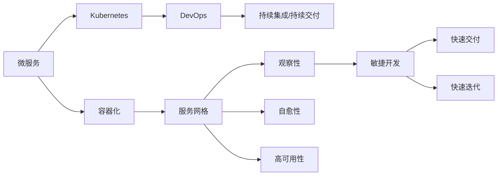

                 

# 云原生开发：从单体应用到微服务架构

> 关键词：云原生、微服务、容器化、Kubernetes、DevOps、持续集成、持续交付、服务网格

## 1. 背景介绍

### 1.1 问题由来

在当今软件开发领域，面对不断增长的业务需求和快速变化的市场环境，传统单体应用架构面临着诸多挑战。单体应用难以水平扩展，维护成本高，技术栈选择受限，无法实现快速部署和持续交付。为了应对这些挑战，云原生技术应运而生，它通过微服务、容器化、服务网格、持续集成、持续交付等核心技术，实现了应用的弹性扩展、敏捷开发和持续创新。

### 1.2 问题核心关键点

云原生技术的核心在于其背后的设计理念：可观察性、自愈性、高可用性、快速交付和快速迭代。这一理念不仅推动了技术的进步，也引领了企业架构的变革，使得开发和运维团队能够更加高效地应对不断变化的市场需求和技术挑战。

## 2. 核心概念与联系

### 2.1 核心概念概述

为更好地理解云原生技术的全貌，本节将介绍几个密切相关的核心概念：

- 微服务（Microservices）：将复杂的应用拆分成一组小的、可独立部署的服务单元，每个服务单元专注于单一职责，能够独立更新和扩展，从而实现应用的灵活性和可维护性。
- 容器化（Containerization）：将应用程序及其依赖打包成容器镜像，以标准化的方式管理和部署，保证应用在任意环境下的一致性。
- Kubernetes（K8s）：一种容器编排平台，提供了丰富的资源管理、调度、部署和监控功能，支持微服务的自动扩展和故障恢复。
- DevOps：一组工具、实践和组织结构，旨在加快软件开发和运维的交付速度，提升软件的可靠性和稳定性。
- 持续集成（Continuous Integration，CI）和持续交付（Continuous Delivery，CD）：自动化测试、构建和部署流程，保证软件质量和安全，提升开发效率。
- 服务网格（Service Mesh）：一种分布式系统的网络代理层，提供流量管理、安全、观察和性能优化等功能，增强微服务的连通性和可靠性。

这些核心概念之间的逻辑关系可以通过以下Mermaid流程图来展示：



这个流程图展示了一些关键概念之间的联系：

1. 微服务是云原生架构的基础，通过容器化技术实现了服务的独立部署和管理。
2. Kubernetes作为容器编排平台，通过DevOps和CI/CD实践，实现了微服务的自动扩展和故障恢复。
3. 服务网格为微服务提供流量管理、安全、性能优化等功能，增强了微服务的连通性和可靠性。
4. 观察性、自愈性和高可用性保证了微服务的稳定性和可观察性，敏捷开发、快速交付和快速迭代则提升了微服务的交付速度和创新能力。

## 3. 核心算法原理 & 具体操作步骤

### 3.1 算法原理概述

云原生技术的核心算法原理主要包括微服务拆分、容器化、服务网格、持续集成和持续交付等。这些技术共同构成了云原生架构的基础，使得应用能够实现灵活的扩展、高效的管理和持续的创新。

### 3.2 算法步骤详解

下面以微服务和容器化技术为例，详细讲解云原生开发的核心算法步骤。

#### 3.2.1 微服务拆分

微服务拆分的基本步骤如下：

1. **识别业务边界**：根据业务功能划分，将复杂的单体应用拆分成一组独立的服务单元，每个服务单元专注于单一的业务功能。
2. **设计服务接口**：为每个微服务设计清晰的接口规范，确保服务之间的通信和协同。
3. **构建独立部署**：为每个微服务构建独立的部署单元，便于独立更新和扩展。
4. **配置服务注册与发现**：使用服务注册和发现机制，实现服务的自动注册和发现，确保微服务的连通性。

#### 3.2.2 容器化技术

容器化技术的基本步骤如下：

1. **构建容器镜像**：将应用及其依赖打包成容器镜像，通过Docker等工具实现。
2. **管理容器实例**：使用容器编排工具如Kubernetes，管理容器实例的创建、部署和销毁。
3. **提供服务接口**：通过容器的网络协议，暴露服务接口，供其他服务访问。
4. **实现自动扩展**：根据负载情况，自动扩展容器实例数量，确保系统的可用性和性能。

### 3.3 算法优缺点

云原生技术的优点包括：

- **灵活扩展**：微服务架构和容器化技术实现了应用的弹性扩展，能够快速响应业务需求。
- **快速部署**：持续集成和持续交付流程，实现了自动化测试和构建，加速了软件的交付速度。
- **高可用性**：服务网格和Kubernetes提供了丰富的故障恢复和自愈机制，提升了系统的可靠性。
- **可观察性**：通过丰富的观察和监控工具，实现了应用性能的实时监控和优化。

但云原生技术也存在一些缺点：

- **复杂性**：微服务架构增加了系统复杂性，服务间的通信和协同难度增大。
- **资源消耗**：容器化技术虽然提高了资源利用率，但也带来了一定的计算和存储开销。
- **学习曲线**：新技术的引入和学习需要一定的时间和成本，需要团队进行适应和调整。

### 3.4 算法应用领域

云原生技术已经在金融、电商、互联网、医疗等多个领域得到了广泛应用，涵盖了从基础设施到应用架构的各个层面。例如：

- **金融领域**：通过微服务架构和容器化技术，金融机构实现了交易系统的灵活扩展和快速部署，提升了系统的稳定性和性能。
- **电商领域**：电商企业通过持续集成和持续交付流程，加速了新功能的迭代和交付，提升了用户体验和市场竞争力。
- **互联网领域**：互联网公司通过服务网格和Kubernetes平台，实现了大规模分布式系统的管理，提升了系统的可靠性和可维护性。
- **医疗领域**：医院通过微服务架构和容器化技术，实现了医疗信息系统的灵活扩展和快速部署，提升了医疗服务的效率和质量。

## 4. 数学模型和公式 & 详细讲解

### 4.1 数学模型构建

本节将使用数学语言对云原生技术的核心算法进行更加严格的刻画。

假设我们有一组微服务 $S=\{S_1, S_2, \cdots, S_n\}$，每个服务通过容器化技术打包成镜像 $M_i$，部署到Kubernetes集群中。我们定义系统负载 $L_i(t)$ 为服务 $S_i$ 在时间 $t$ 的负载量。

假设每个服务 $S_i$ 的负载 $L_i(t)$ 满足泊松分布 $P(\lambda_i)$，其中 $\lambda_i$ 为服务 $S_i$ 的负载率。系统总负载 $L(t)$ 定义为所有服务的负载之和，即 $L(t)=\sum_{i=1}^n L_i(t)$。

我们希望通过微服务拆分和容器化技术，实现系统的灵活扩展和高可用性。因此，我们需要设计合理的负载均衡策略，确保系统能够根据负载情况动态调整容器实例数量，实现负载均衡和自愈。

### 4.2 公式推导过程

对于泊松分布 $P(\lambda_i)$，其概率密度函数为：

$$
f_i(\lambda_i) = \frac{\lambda_i^{\lambda_i}e^{-\lambda_i}}{\Gamma(\lambda_i)}
$$

其中 $\Gamma(\cdot)$ 为伽马函数。

系统的总负载 $L(t)$ 满足复合泊松分布，其概率密度函数为：

$$
f_L(L(t)) = \prod_{i=1}^n f_i(L_i(t))
$$

根据大数定律，当 $t$ 趋近于无穷大时，系统总负载 $L(t)$ 服从率为 $\sum_{i=1}^n \lambda_i$ 的泊松分布。

因此，我们可以使用指数加权平均算法来估计系统负载率 $\lambda$，其更新公式为：

$$
\lambda_{t+1} = \alpha \cdot \lambda_t + (1-\alpha) \cdot L(t)
$$

其中 $\alpha$ 为加权系数，一般取值在0.1到0.2之间。

根据系统负载率 $\lambda$，我们可以计算出每个服务 $S_i$ 的负载率 $\lambda_i$：

$$
\lambda_i = \frac{\lambda}{n}
$$

根据负载率 $\lambda_i$，我们可以计算出每个服务 $S_i$ 所需容器实例数量 $N_i$，其计算公式为：

$$
N_i = \lceil \lambda_i \rceil
$$

其中 $\lceil \cdot \rceil$ 表示向上取整。

通过上述公式，我们可以动态调整容器实例数量，实现系统的负载均衡和高可用性。

### 4.3 案例分析与讲解

假设我们有一组微服务 $S=\{S_1, S_2, S_3\}$，每个服务通过容器化技术打包成镜像 $M_i$，部署到Kubernetes集群中。我们定义系统负载 $L_i(t)$ 为服务 $S_i$ 在时间 $t$ 的负载量。假设每个服务 $S_i$ 的负载 $L_i(t)$ 满足泊松分布 $P(\lambda_i)$，其中 $\lambda_i=1$。

根据公式推导，系统总负载 $L(t)$ 服从率为3的泊松分布，即 $\lambda=3$。

假设在时间 $t=0$ 时，系统总负载为2，即 $L(0)=2$。根据指数加权平均算法，我们可以估计系统负载率为 $\lambda_0=2$。

根据负载率 $\lambda_0=2$，我们可以计算出每个服务 $S_i$ 的负载率 $\lambda_i=1$。

根据负载率 $\lambda_i=1$，我们可以计算出每个服务 $S_i$ 所需容器实例数量 $N_i=1$。

因此，在时间 $t=0$ 时，每个服务 $S_i$ 的容器实例数量为1，系统总负载为2。

在时间 $t=1$ 时，假设系统总负载增加到3，即 $L(1)=3$。根据指数加权平均算法，我们可以估计系统负载率为 $\lambda_1=3$。

根据负载率 $\lambda_1=3$，我们可以计算出每个服务 $S_i$ 的负载率 $\lambda_i=1$。

根据负载率 $\lambda_i=1$，我们可以计算出每个服务 $S_i$ 所需容器实例数量 $N_i=1$。

因此，在时间 $t=1$ 时，每个服务 $S_i$ 的容器实例数量仍为1，系统总负载为3。

通过上述分析，我们可以看到，通过微服务拆分、容器化技术和负载均衡策略，我们可以实现系统的灵活扩展和高可用性。

## 5. 项目实践：代码实例和详细解释说明

### 5.1 开发环境搭建

在进行云原生开发实践前，我们需要准备好开发环境。以下是使用Kubernetes进行微服务开发的开发环境配置流程：

1. 安装Kubernetes：从官网下载并安装Kubernetes集群，包括Master和多个Node节点。
2. 配置Kubernetes：使用kubeadm工具配置集群，确保集群的高可用性和稳定性。
3. 安装Helm：从官网下载并安装Helm包管理器，方便微服务的部署和管理。
4. 安装Docker：从官网下载并安装Docker，作为容器化技术的执行环境。
5. 安装Kubectl：从官网下载并安装Kubectl客户端，用于管理Kubernetes集群。

完成上述步骤后，即可在Kubernetes集群中进行微服务开发和部署。

### 5.2 源代码详细实现

下面我们以微服务架构和Kubernetes集群为例，给出使用Kubernetes进行微服务开发的PyTorch代码实现。

首先，定义微服务的API接口：

```python
from flask import Flask, request
import os

app = Flask(__name__)

@app.route('/api/<service_name>', methods=['GET', 'POST'])
def handle_request(service_name):
    if request.method == 'GET':
        return f"Hello, {service_name}!"
    elif request.method == 'POST':
        data = request.json
        return f"Received data: {data}"
```

然后，构建微服务的容器镜像：

```bash
docker build -t <service_name> .
docker tag <service_name> gcr.io/<project_id>/service_name:1.0.0
```

接着，在Kubernetes集群中部署微服务：

```yaml
apiVersion: apps/v1
kind: Deployment
metadata:
  name: <service_name>
  labels:
    app: <service_name>
spec:
  replicas: 1
  selector:
    matchLabels:
      app: <service_name>
  template:
    metadata:
      labels:
        app: <service_name>
    spec:
      containers:
      - name: <service_name>
        image: gcr.io/<project_id>/service_name:1.0.0
        ports:
        - containerPort: 5000
        livenessProbe:
          httpGet:
            path: /
            port: 5000
          initialDelaySeconds: 10
          timeoutSeconds: 5
          periodSeconds: 30
```

最后，在Kubernetes集群中启动微服务：

```bash
kubectl apply -f <service_name>.yaml
```

通过上述步骤，我们成功地使用Kubernetes部署了一个简单的微服务，实现了其基本的功能。

### 5.3 代码解读与分析

让我们再详细解读一下关键代码的实现细节：

**API接口定义**：
- 使用Flask框架定义API接口，支持GET和POST请求。
- 在GET请求中，返回服务名称的问候语。
- 在POST请求中，接收JSON数据，并返回接收到的数据。

**容器镜像构建**：
- 使用Docker构建微服务的容器镜像。
- 将容器镜像上传到Kubernetes集群中的私有仓库，方便后续部署使用。

**Kubernetes部署配置**：
- 使用Kubernetes的Deployment资源，定义微服务的部署配置。
- 指定服务的副本数量、标签、容器镜像等关键参数。
- 添加健康检查机制，确保服务在容器异常时能够自动重启。

**启动微服务**：
- 使用kubectl命令将Deployment资源应用到Kubernetes集群中。
- 自动创建Pod实例，启动微服务。

可以看到，通过Flask、Docker和Kubernetes等技术的组合，我们可以方便地实现微服务的部署和管理。开发者可以将更多精力放在业务逻辑的实现上，而不必过多关注基础设施的管理。

当然，工业级的系统实现还需考虑更多因素，如微服务的命名空间、自动扩缩容、监控告警等。但核心的微服务范式基本与此类似。

## 6. 实际应用场景

### 6.1 智能客服系统

基于微服务架构和Kubernetes集群，智能客服系统可以轻松应对高并发和大流量，实现7x24小时不间断服务。在技术实现上，可以构建多个微服务来处理不同功能，如问答、对话、知识图谱等。每个微服务可以独立部署和扩展，从而实现高效的服务调度和故障恢复。

在具体实现中，可以使用Helm包管理器来管理和部署微服务，通过Kubernetes集群实现自动扩展和负载均衡。同时，通过Prometheus和Grafana等工具，实时监控系统的性能和可用性，确保智能客服系统的稳定运行。

### 6.2 金融舆情监测

金融领域对数据的实时性和可靠性要求极高。基于微服务架构和Kubernetes集群，金融舆情监测系统可以实时抓取和分析海量数据，提供实时的舆情报告和预警。

在具体实现中，可以将舆情监测任务拆分成多个微服务，如数据抓取、数据清洗、情感分析等。每个微服务可以独立部署和扩展，从而实现高效的数据处理和分析。同时，通过Kubernetes集群实现自动扩展和负载均衡，确保系统的稳定性和可靠性。

### 6.3 个性化推荐系统

基于微服务架构和Kubernetes集群，个性化推荐系统可以实现实时计算和快速迭代。在技术实现上，可以使用TensorFlow等深度学习框架，构建多个微服务来处理不同的推荐任务，如协同过滤、内容推荐等。每个微服务可以独立部署和扩展，从而实现高效的数据处理和推荐。

在具体实现中，可以使用Helm包管理器来管理和部署微服务，通过Kubernetes集群实现自动扩展和负载均衡。同时，通过Prometheus和Grafana等工具，实时监控系统的性能和可用性，确保个性化推荐系统的稳定运行。

### 6.4 未来应用展望

随着微服务架构和Kubernetes集群技术的不断发展，未来云原生开发将呈现出以下几个发展趋势：

1. **微服务治理**：微服务架构的复杂性需要更完善的服务治理机制，如服务发现、路由、限流、熔断等。分布式事务和跨服务调用等复杂问题也将得到更好的解决。
2. **边缘计算**：微服务架构需要更高效的资源管理和调度机制，边缘计算技术可以为微服务提供更接近用户的计算能力，提升系统的响应速度和用户体验。
3. **开源生态**：开源社区将不断贡献更多优秀的微服务框架和工具，推动云原生技术的普及和应用。同时，开源项目也将带来更多的商业化和工业应用。
4. **云原生安全**：云原生技术的普及也将带来更多的安全问题，如微服务的攻击面增加、服务间的依赖关系等。因此，云原生安全技术也将得到更多的关注和研究。
5. **多云融合**：未来云原生技术将更多地应用于多云环境，实现跨云资源的统一管理和调度，提升系统的弹性和可靠性。

## 7. 工具和资源推荐

### 7.1 学习资源推荐

为了帮助开发者系统掌握云原生技术的理论基础和实践技巧，这里推荐一些优质的学习资源：

1. 《云原生系统：模式、构建与部署》系列博文：由云原生技术专家撰写，深入浅出地介绍了云原生架构、微服务、Kubernetes、DevOps等核心技术。
2. Kubernetes官方文档：Kubernetes官方提供的详细文档，涵盖所有Kubernetes的核心概念和操作流程。
3. Docker官方文档：Docker官方提供的详细文档，涵盖所有Docker的核心功能和操作流程。
4. Helm官方文档：Helm官方提供的详细文档，涵盖所有Helm的核心功能和操作流程。
5. DevOpsHandbook：DevOpsHandbook提供了丰富的DevOps实践指南和案例，帮助开发者提升软件开发和运维的交付速度和效率。

通过对这些资源的学习实践，相信你一定能够快速掌握云原生技术的精髓，并用于解决实际的NLP问题。

### 7.2 开发工具推荐

高效的开发离不开优秀的工具支持。以下是几款用于云原生开发的常用工具：

1. Kubernetes：开源的容器编排平台，提供了丰富的资源管理、调度、部署和监控功能，支持微服务的自动扩展和故障恢复。
2. Helm：Kubernetes的包管理器，方便微服务的部署和管理。
3. Docker：开源的容器技术，实现了应用的独立部署和管理。
4. Prometheus：开源的监控系统，提供实时监控和告警功能，保证系统的稳定性和可靠性。
5. Grafana：开源的可视化工具，将监控数据直观展示，帮助开发者实时监控系统的性能和可用性。

合理利用这些工具，可以显著提升云原生开发的效率和可靠性，加快创新迭代的步伐。

### 7.3 相关论文推荐

云原生技术的发展源于学界的持续研究。以下是几篇奠基性的相关论文，推荐阅读：

1. The Twelve-Factor App：十二要素应用程序，阐述了构建云原生应用的基本原则。
2. Microservices: A Service-Oriented Architecture for Cloud Computing: Microservices: A Service-Oriented Architecture for Cloud Computing，详细介绍了微服务架构的设计和实现。
3. Containerization and the future of cloud computing: Containerization and the future of cloud computing，讨论了容器化技术在云原生开发中的应用和未来发展方向。
4. Kubernetes: Beyond Bare Metal: Kubernetes: Beyond Bare Metal，介绍了Kubernetes平台的设计和实现，展示了其在云原生开发中的重要作用。
5. DevOps Handbook：DevOpsHandbook提供了丰富的DevOps实践指南和案例，帮助开发者提升软件开发和运维的交付速度和效率。

这些论文代表了大规模云原生技术的最新进展，通过学习这些前沿成果，可以帮助研究者把握学科前进方向，激发更多的创新灵感。

## 8. 总结：未来发展趋势与挑战

### 8.1 总结

本文对云原生技术进行了全面系统的介绍。首先阐述了云原生技术的背景和意义，明确了微服务、容器化、Kubernetes、DevOps等核心技术在构建弹性、可靠、高效的应用中的重要价值。其次，从原理到实践，详细讲解了微服务拆分、容器化、服务网格、持续集成和持续交付等核心算法步骤，给出了云原生开发的全流程代码实例。同时，本文还广泛探讨了云原生技术在智能客服、金融舆情、个性化推荐等众多领域的应用前景，展示了云原生技术的广泛应用和深远影响。此外，本文精选了云原生技术的各类学习资源，力求为读者提供全方位的技术指引。

通过本文的系统梳理，可以看到，云原生技术在云原生架构的构建中扮演了至关重要的角色，极大地拓展了应用程序的扩展性和灵活性，推动了软件开发和运维的变革。未来，伴随云原生技术的不断发展，相信云原生开发必将在更广阔的领域带来颠覆性的影响。

### 8.2 未来发展趋势

展望未来，云原生技术将呈现以下几个发展趋势：

1. **微服务治理**：微服务架构的复杂性需要更完善的服务治理机制，如服务发现、路由、限流、熔断等。分布式事务和跨服务调用等复杂问题也将得到更好的解决。
2. **边缘计算**：微服务架构需要更高效的资源管理和调度机制，边缘计算技术可以为微服务提供更接近用户的计算能力，提升系统的响应速度和用户体验。
3. **开源生态**：开源社区将不断贡献更多优秀的微服务框架和工具，推动云原生技术的普及和应用。同时，开源项目也将带来更多的商业化和工业应用。
4. **云原生安全**：云原生技术的普及也将带来更多的安全问题，如微服务的攻击面增加、服务间的依赖关系等。因此，云原生安全技术也将得到更多的关注和研究。
5. **多云融合**：未来云原生技术将更多地应用于多云环境，实现跨云资源的统一管理和调度，提升系统的弹性和可靠性。

这些趋势凸显了云原生技术的广泛应用前景和发展潜力，相信未来云原生技术将在更多领域带来变革性影响。

### 8.3 面临的挑战

尽管云原生技术已经取得了瞩目成就，但在迈向更加智能化、普适化应用的过程中，它仍面临着诸多挑战：

1. **复杂性**：微服务架构增加了系统复杂性，服务间的通信和协同难度增大。
2. **资源消耗**：容器化技术虽然提高了资源利用率，但也带来了一定的计算和存储开销。
3. **学习曲线**：新技术的引入和学习需要一定的时间和成本，需要团队进行适应和调整。
4. **安全性**：微服务架构带来了更多的安全问题，如微服务的攻击面增加、服务间的依赖关系等。

### 8.4 研究展望

面对云原生技术所面临的挑战，未来的研究需要在以下几个方面寻求新的突破：

1. **简化微服务架构**：通过更好的服务和通信设计，简化微服务架构，减少服务间的依赖关系，降低系统复杂性。
2. **优化资源管理**：通过更高效的资源管理和调度机制，减少资源消耗，提升系统的性能和可靠性。
3. **提升安全防护**：通过更好的安全设计和实现，保护微服务架构的安全性，防范潜在的安全威胁。
4. **增强可观察性**：通过更好的观察和监控机制，实时监控系统的性能和状态，提高系统的稳定性和可维护性。
5. **实现自动化运维**：通过更好的自动化运维机制，减少人工干预，提升运维效率和系统可靠性。

这些研究方向的探索，必将引领云原生技术走向更高的台阶，为构建安全、可靠、可控的云原生系统铺平道路。面向未来，云原生技术还需要与其他技术进行更深入的融合，如函数即服务、事件驱动等，共同推动云计算和软件开发技术的进步。只有勇于创新、敢于突破，才能不断拓展云原生技术的边界，让云原生技术更好地造福人类社会。

## 9. 附录：常见问题与解答

**Q1：云原生开发是否只适用于大规模企业？**

A: 云原生技术最初是为大型企业设计的，但随着技术的发展和成熟，云原生技术已经逐渐普及到中小型企业。对于中小型企业，云原生技术可以提升应用的可扩展性和灵活性，减少开发和运维成本，提升系统的可靠性和性能。

**Q2：云原生开发是否需要高昂的硬件成本？**

A: 云原生技术通过容器化、服务网格等技术，实现了资源的灵活管理和调度，降低了硬件成本。同时，云原生技术还可以在云平台中进行部署和运维，进一步降低了硬件成本。因此，云原生开发并不是高昂的硬件成本的代名词，而是高效、灵活、可扩展的开发和运维方式。

**Q3：云原生开发是否适合所有应用场景？**

A: 云原生技术适合各种应用场景，但需要根据具体业务需求和系统复杂性进行合理的技术选型。对于一些数据量小、功能简单的应用，单体应用架构可能更加适合。而对于数据量庞大、功能复杂的应用，微服务架构和云原生技术可以提供更好的解决方案。

**Q4：云原生开发是否需要重构现有应用？**

A: 云原生开发并不是对现有应用的彻底重构，而是通过引入云原生技术，逐步提升应用的可扩展性和灵活性。对于现有应用，可以逐步引入云原生技术，先从服务拆分、容器化等基础技术开始，逐步扩展到持续集成、持续交付等高级技术，最终实现云原生转型。

**Q5：云原生开发是否需要特定的技术栈？**

A: 云原生技术并不是对特定技术栈的依赖，而是通过标准化和通用化的技术实现，可以在多种技术栈上实现。但不同的技术栈可能有不同的实现方式和工具支持，需要根据具体需求进行选择。例如，可以使用Spring Cloud、Django等技术栈进行云原生开发。

通过本文的系统梳理，可以看到，云原生技术在云原生架构的构建中扮演了至关重要的角色，极大地拓展了应用程序的扩展性和灵活性，推动了软件开发和运维的变革。未来，伴随云原生技术的不断发展，相信云原生开发必将在更广阔的领域带来颠覆性的影响。

