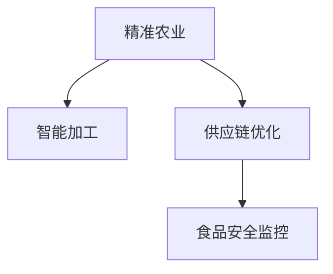

                 

# 人工智能在农业和食品行业中的应用

## 1. 背景介绍

### 1.1 问题由来
在传统的农业和食品行业中，从播种、灌溉、施肥到收获、加工、包装、销售，每个环节都依赖于人类的经验和直觉。但这种依赖人类的模式存在诸多问题：资源浪费、生产效率低下、生产成本高、品质不稳定等。与此同时，随着科学技术的进步和市场需求的增加，对农业和食品生产的标准化和智能化要求日益提高。如何利用最新的科技，如人工智能(AI)，提升农业和食品生产的效率、降低成本、提高品质，成为当前科技界和产业界关注的焦点。

### 1.2 问题核心关键点
农业和食品行业应用人工智能，可以从以下几个方面着手：

- **精准农业**：通过AI技术，结合GPS、遥感技术，实现农田管理的精准化，优化种植、灌溉、施肥等环节。
- **智能加工**：利用机器学习、计算机视觉等技术，提升食品加工的自动化和智能化水平，提高生产效率和产品质量。
- **供应链优化**：运用AI技术，实现食品供应链的智能化管理，提高物流效率，降低成本。
- **食品安全监控**：通过AI技术，实现对食品安全的实时监控和预警，提升食品安全水平。

### 1.3 问题研究意义
应用人工智能技术，可以大幅提升农业和食品行业的生产效率，降低生产成本，提高产品品质，保障食品安全。具体而言：

1. **提高生产效率**：AI技术能够精准管理农田，优化种植方案，减少资源浪费。智能加工可以提升食品生产线的自动化水平，提高生产效率。
2. **降低生产成本**：精准农业通过精准管理，减少化肥、农药的使用，降低生产成本。智能加工和物流优化，则可减少人工和运输成本。
3. **提高产品质量**：通过AI实时监控食品质量，避免不合格产品流入市场，提升消费者对产品的信任度。
4. **保障食品安全**：AI技术可以实现对食品生产过程的实时监控，及时发现并预警食品安全问题，保障公众健康。

## 2. 核心概念与联系

### 2.1 核心概念概述

农业和食品行业应用人工智能，涉及以下几个核心概念：

- **精准农业**：结合GPS、遥感、AI等技术，实现对农田的精准管理，包括精准种植、精准灌溉、精准施肥等。
- **智能加工**：利用机器学习、计算机视觉等技术，实现食品加工的自动化和智能化，提升生产效率和产品质量。
- **供应链优化**：通过AI技术，实现食品供应链的智能化管理，提高物流效率，降低成本。
- **食品安全监控**：运用AI技术，实时监控食品质量，及时发现并预警食品安全问题。

这些核心概念之间的逻辑关系可以通过以下Mermaid流程图来展示：



这个流程图展示了几大核心概念之间的内在联系：

1. 精准农业提供基础数据支持，为智能加工、供应链优化和食品安全监控提供数据基础。
2. 智能加工提高生产效率，提升产品质量。
3. 供应链优化通过智能化管理，降低物流成本。
4. 食品安全监控通过实时监控和预警，保障食品安全。

这些概念共同构成了AI在农业和食品行业的应用框架，帮助实现农业生产的现代化和智能化。

## 3. 核心算法原理 & 具体操作步骤
### 3.1 算法原理概述

农业和食品行业应用AI的核心算法原理包括机器学习、深度学习、计算机视觉、自然语言处理等。这些算法可以结合具体应用场景，实现对农田管理、食品加工、供应链优化和食品安全监控的智能化管理。

以精准农业为例，AI技术可以通过对农田环境数据的分析，结合机器学习算法，预测最佳种植方案、优化灌溉施肥策略，实现精准管理。

### 3.2 算法步骤详解

以精准农业中的精准种植为例，AI应用的主要步骤如下：

1. **数据收集**：利用传感器、GPS、遥感等技术，收集农田的土壤、气象、作物生长状态等数据。
2. **数据预处理**：清洗、转换数据格式，使其符合机器学习算法的要求。
3. **模型训练**：选择适合的机器学习算法，如回归、分类、聚类等，训练模型，预测作物生长状态。
4. **模型应用**：将训练好的模型应用于实际农田，实时监测作物生长状态，自动调整种植方案。
5. **模型评估**：定期评估模型性能，根据实际效果不断优化模型。

### 3.3 算法优缺点

AI在农业和食品行业的应用具有以下优点：

- **提高生产效率**：AI技术能够实现对农田和食品加工的精准管理，减少人工干预，提高生产效率。
- **降低生产成本**：精准农业通过优化种植方案，减少资源浪费，智能加工通过自动化生产，降低人工成本。
- **提高产品质量**：通过实时监控和分析，确保生产过程符合质量标准，提升产品质量。
- **保障食品安全**：AI技术能够实时监控食品生产过程，及时发现并预警食品安全问题，保障消费者健康。

同时，AI在农业和食品行业的应用也存在一些缺点：

- **技术门槛高**：AI技术的应用需要专业的技术支持和设备投资，对企业和农民的技术水平要求较高。
- **数据质量依赖**：AI技术的应用效果依赖于数据的质量和量，数据的缺失或错误会导致模型性能下降。
- **成本高**：初期技术投资和设备投入较大，对中小企业可能存在经济负担。
- **伦理和隐私问题**：AI技术的应用涉及大量数据采集和处理，可能带来隐私和伦理问题。

### 3.4 算法应用领域

AI在农业和食品行业的应用领域广泛，主要包括以下几个方面：

- **精准农业**：包括精准种植、精准灌溉、精准施肥等。
- **智能加工**：食品加工自动化、食品质量检测等。
- **供应链优化**：食品供应链管理、物流调度等。
- **食品安全监控**：食品质量检测、食品安全预警等。

## 4. 数学模型和公式 & 详细讲解 & 举例说明

### 4.1 数学模型构建

以精准农业中的精准种植为例，AI模型可以构建为以下几个部分：

1. **输入层**：输入农田的环境数据，如土壤湿度、气象条件、作物生长状态等。
2. **隐藏层**：通过多个神经元，进行特征提取和抽象，找出数据中的模式和规律。
3. **输出层**：输出最佳的种植方案，如施肥量、灌溉量等。

### 4.2 公式推导过程

以回归模型为例，其基本公式如下：

$$
\hat{y} = \theta_0 + \theta_1 x_1 + \theta_2 x_2 + \ldots + \theta_n x_n
$$

其中，$x_i$ 为输入变量，$y$ 为输出变量，$\theta$ 为模型参数。

### 4.3 案例分析与讲解

以利用AI预测作物生长周期为例，假设已知历史数据中作物的生长周期 $y$ 与环境变量 $x_1$ （土壤湿度）、$x_2$ （温度）、$x_3$ （光照）等有关，通过机器学习算法建立模型：

$$
\hat{y} = \theta_0 + \theta_1 x_1 + \theta_2 x_2 + \theta_3 x_3
$$

其中，$\theta_0$ 为截距，$\theta_1$、$\theta_2$、$\theta_3$ 分别为土壤湿度、温度、光照的系数。训练模型后，即可根据实时采集的环境数据，预测作物的生长周期，优化种植方案。

## 5. 项目实践：代码实例和详细解释说明

### 5.1 开发环境搭建

在进行农业和食品行业的AI项目开发前，需要进行以下环境配置：

1. **安装Python**：从官网下载并安装最新版本的Python。
2. **安装必要的库**：安装Numpy、Pandas、Scikit-learn、TensorFlow、Keras等必要的AI开发库。
3. **安装硬件设备**：确保计算机具备足够的计算资源，如CPU、GPU等。

### 5.2 源代码详细实现

以精准农业中的精准灌溉为例，给出使用TensorFlow进行模型训练的代码实现：

```python
import tensorflow as tf
import pandas as pd
from sklearn.model_selection import train_test_split
import numpy as np

# 读取数据
data = pd.read_csv('irrigation_data.csv')

# 数据预处理
X = data[['temperature', 'humidity', 'rainfall']]  # 输入变量
y = data['growth']  # 输出变量
X_train, X_test, y_train, y_test = train_test_split(X, y, test_size=0.2)

# 构建模型
model = tf.keras.Sequential([
    tf.keras.layers.Dense(16, activation='relu', input_shape=(3,)),
    tf.keras.layers.Dense(1)
])

# 编译模型
model.compile(optimizer=tf.keras.optimizers.Adam(learning_rate=0.001),
              loss='mse',
              metrics=['mae'])

# 训练模型
model.fit(X_train, y_train, epochs=100, validation_data=(X_test, y_test))

# 预测
y_pred = model.predict(X_test)
```

### 5.3 代码解读与分析

以上代码实现了一个基于TensorFlow的线性回归模型，用于预测作物的生长周期。

**数据预处理**：首先，使用Pandas读取数据，并使用sklearn的train_test_split方法将数据集划分为训练集和测试集。

**模型构建**：使用Sequential模型，定义了两个全连接层，分别包含16个神经元和1个输出节点，激活函数为ReLU。

**模型编译**：使用Adam优化器，学习率为0.001，损失函数为均方误差(MSE)，评估指标为平均绝对误差(MAE)。

**模型训练**：使用fit方法训练模型，设置100个epochs，并在测试集上进行验证。

**模型预测**：使用predict方法对测试集进行预测，输出预测结果。

### 5.4 运行结果展示

模型训练完成后，可以使用以下代码进行模型评估：

```python
import matplotlib.pyplot as plt

# 评估模型
mse = np.mean((y_pred - y_test)**2)
mae = np.mean(np.abs(y_pred - y_test))

print(f'MSE: {mse:.3f}, MAE: {mae:.3f}')

# 可视化结果
plt.scatter(y_test, y_pred)
plt.xlabel('Actual')
plt.ylabel('Predicted')
plt.show()
```

运行结果展示了模型预测的准确性和可视化结果，可以帮助开发者评估模型性能并进行优化。

## 6. 实际应用场景

### 6.1 智能农场管理

智能农场管理系统可以利用AI技术，实现对农田的智能管理，包括智能灌溉、智能施肥、智能病虫害防治等。例如，通过安装传感器收集农田数据，结合机器学习算法，实时监测土壤湿度、温度、光照等环境参数，自动调整灌溉、施肥和喷洒农药的量，避免资源浪费，提高作物产量。

### 6.2 食品质量检测

智能检测系统可以利用计算机视觉和机器学习技术，实现对食品质量的实时监控和检测。例如，在食品加工线上，通过摄像头实时采集食品图像，利用图像识别技术，检测食品的颜色、形状、大小等特征，判断是否合格。对于不合格产品，系统自动报警，避免其进入市场。

### 6.3 食品供应链优化

食品供应链管理系统可以通过AI技术，实现对物流和仓储的智能管理。例如，利用预测模型，对食品需求进行预测，优化库存管理和物流调度和配送路线，降低物流成本，提高配送效率。

### 6.4 未来应用展望

随着AI技术的不断进步，农业和食品行业的应用将更加广泛和深入。未来，AI技术将从以下几个方面带来新的突破：

1. **自动驾驶拖拉机**：结合GPS、遥感等技术，实现自动驾驶拖拉机，提高农田管理效率。
2. **无人仓库**：通过AI技术，实现无人仓库的智能化管理，提高仓储效率。
3. **个性化饮食推荐**：利用AI技术，根据消费者的健康数据和口味偏好，推荐个性化的饮食方案。
4. **食品成分分析**：利用AI技术，对食品成分进行实时分析，确保食品质量安全。

## 7. 工具和资源推荐

### 7.1 学习资源推荐

为了帮助开发者系统掌握AI在农业和食品行业的应用，这里推荐一些优质的学习资源：

1. **Coursera《农业数据科学》课程**：由约翰霍普金斯大学开设的课程，系统介绍了农业数据分析和AI技术。
2. **Udacity《食品科技》纳米学位**：通过实际项目，学习食品加工和供应链管理的AI应用。
3. **TensorFlow官方文档**：提供丰富的AI开发教程和示例，涵盖深度学习、计算机视觉等技术。
4. **IBM Watson农业解决方案**：提供详细的AI应用案例和解决方案，帮助企业实现智能化管理。

### 7.2 开发工具推荐

1. **TensorFlow**：谷歌开发的深度学习框架，支持分布式训练和优化。
2. **PyTorch**：Facebook开发的深度学习框架，支持动态图和静态图，易于调试和优化。
3. **OpenCV**：开源的计算机视觉库，提供丰富的图像处理和识别功能。
4. **MATLAB**：强大的科学计算工具，支持复杂的数学模型和算法。

### 7.3 相关论文推荐

农业和食品行业的AI应用涉及多个领域的交叉技术，以下是几篇相关论文，推荐阅读：

1. **A Survey on Intelligent Agriculture and Food Processing**：综述农业和食品加工中的AI应用。
2. **Deep Learning for Crop Monitoring and Yield Prediction**：利用深度学习模型，预测作物生长周期和产量。
3. **AI-Based Food Safety Monitoring and Inspection**：介绍AI技术在食品安全监控中的应用。
4. **A Survey on Internet of Things and Artificial Intelligence in Agriculture**：综述IoT和AI在农业中的应用。

## 8. 总结：未来发展趋势与挑战

### 8.1 总结

本文对AI在农业和食品行业的应用进行了全面系统的介绍。首先阐述了AI技术在农业和食品行业中的重要性和应用前景，明确了AI技术在精准农业、智能加工、供应链优化和食品安全监控等方面的应用。其次，从原理到实践，详细讲解了AI技术的具体实现过程，包括数据收集、模型训练、模型应用等步骤。同时，本文还探讨了AI技术在实际应用中面临的挑战和未来发展趋势。

通过本文的系统梳理，可以看到，AI技术在农业和食品行业的应用前景广阔，能够大幅提升生产效率，降低生产成本，提高产品质量，保障食品安全。但AI技术的应用也面临诸多挑战，需要企业在技术、设备、数据等方面进行全面投入，才能实现AI技术的全面落地。

### 8.2 未来发展趋势

展望未来，AI在农业和食品行业的应用将呈现以下几个发展趋势：

1. **自动化和智能化水平提升**：随着技术的进步，越来越多的农业和食品生产环节将实现自动化和智能化。例如，自动驾驶拖拉机、无人仓库等，将极大提高生产效率。
2. **数据驱动决策**：通过大数据分析，实现对农业和食品生产的精确管理和优化。例如，利用AI技术对农田环境进行实时监控，优化种植方案，提高产量和质量。
3. **跨领域融合**：AI技术将与IoT、区块链等技术进行更紧密的结合，实现农业和食品行业的全产业链智能化管理。
4. **个性化服务**：通过AI技术，实现对消费者需求和偏好的精准分析，提供个性化服务，提升用户体验。
5. **可持续发展**：利用AI技术，优化资源利用和环境管理，实现农业和食品生产的可持续发展。

### 8.3 面临的挑战

尽管AI在农业和食品行业的应用前景广阔，但在实现过程中，也面临诸多挑战：

1. **技术门槛高**：AI技术的应用需要较高的技术门槛，对企业和农民的技术水平要求较高。
2. **数据质量依赖**：AI技术的应用效果依赖于数据的质量和量，数据的缺失或错误会导致模型性能下降。
3. **成本高**：初期技术投资和设备投入较大，对中小企业可能存在经济负担。
4. **伦理和隐私问题**：AI技术的应用涉及大量数据采集和处理，可能带来隐私和伦理问题。
5. **操作复杂**：AI技术的应用需要专业人员进行维护和管理，对人员的操作水平要求较高。

### 8.4 研究展望

未来的研究可以从以下几个方面寻求新的突破：

1. **提高模型精度**：通过改进算法和优化模型结构，提高AI技术在农业和食品行业的应用精度。
2. **降低技术门槛**：通过简化操作流程和使用更易接入的技术工具，降低AI技术的应用门槛。
3. **增强数据质量**：通过引入更精准的数据采集和处理技术，提高数据质量，增强模型性能。
4. **优化资源利用**：利用AI技术，优化农业和食品生产中的资源利用，实现可持续发展。
5. **拓展应用场景**：将AI技术应用到更多的农业和食品生产环节，实现全面智能化管理。

总之，AI技术在农业和食品行业的应用前景广阔，但需在技术、数据、设备、操作等方面进行全面投入和优化，方能实现AI技术的全面落地和应用。只有勇于创新、敢于突破，才能真正实现农业和食品行业的智能化转型。

## 9. 附录：常见问题与解答

**Q1：AI技术在农业和食品行业应用的效果如何？**

A: AI技术在农业和食品行业应用的效果显著。例如，精准农业通过优化种植方案，减少资源浪费，提高作物产量。智能加工通过自动化生产，降低人工成本，提高生产效率。供应链管理系统通过智能化管理，降低物流成本，提高配送效率。食品安全监控通过实时监控和预警，保障食品安全。

**Q2：AI技术在农业和食品行业应用时，数据质量如何保障？**

A: 数据质量是AI技术应用的基础，保障数据质量的关键在于以下几点：

1. 数据采集的准确性和完整性：确保采集到的数据真实可靠，避免数据缺失和错误。
2. 数据清洗和处理：清洗、转换数据格式，去除噪音和异常值，确保数据符合模型训练要求。
3. 数据标注：对数据进行准确的标注，确保模型训练数据的质量。
4. 数据更新：定期更新数据，确保数据的时效性和真实性。

**Q3：AI技术在农业和食品行业应用时，如何处理隐私和伦理问题？**

A: 在AI技术应用过程中，隐私和伦理问题需要引起重视，主要可以通过以下几点处理：

1. 数据匿名化：对数据进行匿名化处理，保护个人隐私。
2. 数据访问控制：严格控制数据访问权限，防止数据泄露。
3. 数据使用透明：明确数据使用目的，确保数据使用的透明性和合法性。
4. 伦理审查：建立伦理审查机制，确保数据使用符合伦理标准。

**Q4：AI技术在农业和食品行业应用时，如何降低技术门槛？**

A: 降低AI技术应用门槛，可以通过以下几点：

1. 简化操作流程：使用更易接入的技术工具和框架，降低操作复杂度。
2. 提供培训和支持：为农民和企业提供培训和技术支持，提升其技术水平。
3. 开源资源共享：开源共享AI技术和数据，降低技术门槛。
4. 引入智能设备：使用智能设备，降低技术应用门槛。

**Q5：AI技术在农业和食品行业应用时，如何优化资源利用？**

A: 优化资源利用是AI技术在农业和食品行业应用的重要目标，可以通过以下几点实现：

1. 精准农业：利用AI技术，对农田进行精准管理，优化种植方案，减少资源浪费。
2. 智能加工：通过自动化和智能化生产，提高生产效率，降低人工成本。
3. 供应链优化：利用AI技术，优化物流调度和配送路线，降低物流成本。
4. 节能减排：利用AI技术，优化能源利用，减少碳排放，实现可持续发展。

---

作者：禅与计算机程序设计艺术 / Zen and the Art of Computer Programming

