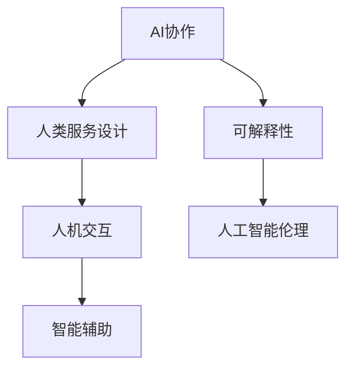

                 

# 人类-AI协作：为人类服务的设计

> 关键词：AI协作, 人类服务设计, 人机交互, 智能辅助, 可解释性, 人工智能伦理

## 1. 背景介绍

### 1.1 问题由来
随着人工智能（AI）技术的迅猛发展，AI系统越来越多地渗透到人们的生活和工作之中。然而，人们对AI系统的期望不仅仅是效率提升和任务自动化，更需要AI系统能够在人类需求和环境中发挥作用，成为人类信赖的合作伙伴。在这样的背景下，设计出能够与人类无缝协作的AI系统变得尤为重要。

### 1.2 问题核心关键点
要设计出能够为人类服务的AI系统，核心在于理解并实现以下两个目标：

- **人机协同**：AI系统能够理解人类的意图和需求，与人类建立良好的交互关系，协同完成任务。
- **为人类服务**：AI系统能够提供符合人类期望的解决方案，提升人类的生活质量和工作效率。

为了实现这两个目标，AI系统需要具备以下能力：

- **感知能力**：能够理解人类的语言、情感和行为，识别关键信息。
- **推理能力**：能够根据感知信息进行逻辑推断，生成合理建议。
- **执行能力**：能够高效执行人类下达的任务，具备灵活性和适应性。
- **可解释性**：能够解释其决策过程和结果，提高人类信任感。
- **伦理与道德**：能够遵守人类社会规则，尊重隐私和权利。

## 2. 核心概念与联系

### 2.1 核心概念概述

为了更好地理解AI系统为人类服务的设计原则，本节将介绍几个关键概念：

- **AI协作**：指AI系统与人类合作，共同完成某一任务。
- **人类服务设计（Human-Centered Design, HCD）**：以人类需求为中心，设计出能够满足人类需求的产品和服务。
- **人机交互（Human-Computer Interaction, HCI）**：研究人类如何与计算机交互，以及计算机如何更好地响应用户需求。
- **智能辅助**：指AI系统在人类任务中提供辅助，帮助人类更快、更准确地完成任务。
- **可解释性**：指AI系统能够解释其决策过程，使人类理解其工作原理。
- **人工智能伦理**：指AI系统在设计和应用中需要遵守的道德和伦理规范。

这些概念之间的联系可以通过以下Mermaid流程图来展示：



这个流程图展示了人类服务设计的核心思想：通过人机交互和智能辅助，实现AI协作，并确保其可解释性和伦理性。这些概念共同构成了AI系统为人类服务的设计框架，使得AI系统能够更好地融入人类生活和工作，真正实现其价值。

## 3. 核心算法原理 & 具体操作步骤

### 3.1 算法原理概述

AI系统为人类服务的设计原则基于几个关键原理：

- **自监督学习**：利用无标签数据进行自我监督，提升AI系统的泛化能力。
- **迁移学习**：将已有任务中的知识迁移到新任务中，提升AI系统的适应性。
- **强化学习**：通过与环境互动，优化AI系统的决策策略。
- **生成对抗网络（GANs）**：通过生成模型与判别模型的对抗训练，提升AI系统的生成能力。
- **深度强化学习（Deep RL）**：结合深度学习和强化学习，提升AI系统的复杂决策能力。

### 3.2 算法步骤详解

AI系统为人类服务的设计流程可以分为以下几个关键步骤：

**Step 1: 需求分析与定义**
- 明确人类任务需求，如信息检索、智能推荐、智能客服等。
- 定义任务的关键指标和性能要求，如准确率、召回率、响应时间等。

**Step 2: 数据收集与预处理**
- 收集与任务相关的数据，包括文本、图像、视频等。
- 进行数据清洗和预处理，如去噪、归一化、标注等。

**Step 3: 模型选择与设计**
- 选择合适的AI模型架构，如CNN、RNN、Transformer等。
- 设计任务的适配层，如分类器、生成器等。

**Step 4: 模型训练与微调**
- 利用自监督或迁移学习技术，对模型进行预训练。
- 在标注数据上对模型进行微调，优化模型参数。
- 采用正则化技术，如L2正则、Dropout等，避免过拟合。

**Step 5: 模型评估与优化**
- 在验证集上评估模型性能，如准确率、F1-score等。
- 根据评估结果，调整模型参数或采用不同的训练策略。
- 进行模型集成或模型融合，提升模型鲁棒性。

**Step 6: 系统部署与测试**
- 将模型部署到实际应用中，进行线上测试。
- 收集用户反馈，持续优化模型和系统。

### 3.3 算法优缺点

AI系统为人类服务的设计方法具有以下优点：

- **灵活性高**：可以根据具体任务灵活选择模型和算法。
- **性能提升显著**：通过模型训练和微调，能够显著提升模型的效果。
- **用户参与度提升**：通过用户反馈和迭代优化，提高系统的可用性和满意度。

同时，该方法也存在一定的局限性：

- **数据依赖度高**：需要大量的标注数据进行微调，获取数据成本较高。
- **计算资源需求大**：模型训练和推理需要高性能计算资源。
- **模型复杂度高**：设计复杂的模型需要较高的专业知识和经验。
- **可解释性不足**：复杂模型难以解释其决策过程。
- **伦理和隐私问题**：需要确保AI系统符合伦理和隐私要求。

尽管存在这些局限性，但就目前而言，基于需求驱动的AI系统设计方法仍是最主流范式。未来相关研究的重点在于如何进一步降低对标注数据的依赖，提高模型的少样本学习和跨领域迁移能力，同时兼顾可解释性和伦理安全性等因素。

### 3.4 算法应用领域

基于需求驱动的AI系统设计方法已经在多个领域得到应用，例如：

- **智能客服**：通过自然语言处理（NLP）技术，构建智能客服系统，提升客户服务质量。
- **医疗健康**：利用AI技术进行疾病诊断、患者监护、健康管理等，提升医疗服务水平。
- **金融服务**：使用AI技术进行风险评估、欺诈检测、智能投顾等，提升金融服务效率和安全性。
- **智能交通**：通过AI技术进行交通流量预测、智能导航、自动驾驶等，提升交通管理水平。
- **教育培训**：使用AI技术进行个性化教学、学习路径推荐、智能评估等，提升教育培训效果。
- **环境保护**：利用AI技术进行环境监测、污染预测、智能节能等，提升环境保护水平。
- **娱乐文娱**：通过AI技术进行内容推荐、智能创作、虚拟现实（VR）等，提升用户体验。

这些领域的应用展示了AI系统为人类服务设计方法的广泛适用性和巨大潜力。随着技术不断进步和应用场景的拓展，AI系统将在更多领域为人类服务，带来更多的便利和创新。

## 4. 数学模型和公式 & 详细讲解 & 举例说明

### 4.1 数学模型构建

在AI系统为人类服务的设计中，数学模型和公式起着至关重要的作用。以下是一个简单的例子，介绍如何使用数学模型和公式来构建和优化AI系统。

**数据集**：假设我们有一个包含N个样本的文本数据集，每个样本有L个特征。数据集中的每个样本$x_i=(x_{i1}, x_{i2}, ..., x_{iL})$表示，其中$x_{il}$为第$l$个特征的值。

**模型**：我们采用一个简单的线性回归模型，该模型可以表示为：

$$
y = \beta_0 + \beta_1x_1 + \beta_2x_2 + ... + \beta_Lx_L
$$

其中$y$为目标变量，$\beta_l$为第$l$个特征的系数，$\beta_0$为截距。

**损失函数**：我们采用均方误差（MSE）作为损失函数，表示预测值和真实值之间的差异。MSE可以表示为：

$$
\text{MSE} = \frac{1}{N}\sum_{i=1}^{N}(y_i - \hat{y}_i)^2
$$

其中$y_i$为第$i$个样本的真实值，$\hat{y}_i$为第$i$个样本的预测值。

**优化目标**：最小化损失函数$\text{MSE}$，即：

$$
\mathop{\min}_{\beta_0, \beta_1, ..., \beta_L} \text{MSE}
$$

### 4.2 公式推导过程

接下来，我们将推导最小化损失函数的过程。

首先，我们求损失函数关于模型参数$\beta_0, \beta_1, ..., \beta_L$的偏导数，得到：

$$
\frac{\partial \text{MSE}}{\partial \beta_0} = -2\sum_{i=1}^{N}(y_i - \hat{y}_i)
$$

$$
\frac{\partial \text{MSE}}{\partial \beta_l} = -2\sum_{i=1}^{N}(x_{il})(y_i - \hat{y}_i)
$$

然后，我们通过梯度下降算法（GD）求解优化目标。梯度下降算法的基本形式为：

$$
\theta_j = \theta_j - \eta \frac{\partial \text{MSE}}{\partial \theta_j}
$$

其中$\theta_j$表示第$j$个模型参数，$\eta$为学习率，$\frac{\partial \text{MSE}}{\partial \theta_j}$表示损失函数对第$j$个参数的梯度。

### 4.3 案例分析与讲解

我们以一个简单的智能推荐系统为例，展示如何使用数学模型和公式来优化AI系统。

假设我们有一个电商平台，需要根据用户的浏览历史和购买行为，为用户推荐感兴趣的商品。我们可以采用协同过滤算法（Collaborative Filtering）来实现这一目标。

**数据集**：假设我们有一个包含N个用户和M个商品的评分矩阵$R$，其中每个用户$i$对商品$j$的评分$R_{ij}$表示。

**模型**：我们可以采用一个基于矩阵分解的模型，该模型可以表示为：

$$
\hat{R}_{ij} = \mathbf{P}_i^\top\mathbf{Q}_j
$$

其中$\mathbf{P}_i$为第$i$个用户的潜在特征向量，$\mathbf{Q}_j$为第$j$个商品的潜在特征向量。

**损失函数**：我们采用均方误差作为损失函数，表示预测评分和真实评分之间的差异。损失函数可以表示为：

$$
\text{MSE} = \frac{1}{N}\sum_{i=1}^{N}\sum_{j=1}^{M}(R_{ij} - \hat{R}_{ij})^2
$$

**优化目标**：最小化损失函数$\text{MSE}$，即：

$$
\mathop{\min}_{\mathbf{P}, \mathbf{Q}} \text{MSE}
$$

通过上述数学模型和公式，我们可以构建出一个简单的智能推荐系统，并使用梯度下降算法优化模型参数，从而提升推荐效果。

## 5. 项目实践：代码实例和详细解释说明

### 5.1 开发环境搭建

在进行项目实践前，我们需要准备好开发环境。以下是使用Python进行PyTorch开发的环境配置流程：

1. 安装Anaconda：从官网下载并安装Anaconda，用于创建独立的Python环境。

2. 创建并激活虚拟环境：
```bash
conda create -n pytorch-env python=3.8 
conda activate pytorch-env
```

3. 安装PyTorch：根据CUDA版本，从官网获取对应的安装命令。例如：
```bash
conda install pytorch torchvision torchaudio cudatoolkit=11.1 -c pytorch -c conda-forge
```

4. 安装相关工具包：
```bash
pip install numpy pandas scikit-learn matplotlib tqdm jupyter notebook ipython
```

完成上述步骤后，即可在`pytorch-env`环境中开始项目实践。

### 5.2 源代码详细实现

这里我们以一个简单的智能推荐系统为例，给出使用PyTorch进行模型训练的PyTorch代码实现。

首先，定义模型和优化器：

```python
import torch
from torch import nn
from torch import optim

# 定义协同过滤模型
class CollaborativeFilteringModel(nn.Module):
    def __init__(self, num_users, num_items, embed_dim):
        super(CollaborativeFilteringModel, self).__init__()
        self.user_embeddings = nn.Embedding(num_users, embed_dim)
        self.item_embeddings = nn.Embedding(num_items, embed_dim)
        self.fc = nn.Linear(embed_dim * 2, 1)
        
    def forward(self, user_idx, item_idx):
        user_embed = self.user_embeddings(user_idx)
        item_embed = self.item_embeddings(item_idx)
        user_item_embed = torch.cat([user_embed, item_embed], dim=1)
        return self.fc(user_item_embed).squeeze()
        
# 定义损失函数
def mse_loss(y_true, y_pred):
    return nn.MSELoss()(y_true, y_pred)
    
# 定义训练函数
def train_epoch(model, optimizer, loss_fn, user_idxes, item_idxes, scores):
    model.train()
    optimizer.zero_grad()
    y_pred = model(user_idxes, item_idxes)
    loss = loss_fn(scores, y_pred)
    loss.backward()
    optimizer.step()
    return loss.item()
    
# 定义模型训练函数
def train(model, optimizer, loss_fn, user_idxes, item_idxes, scores, epochs):
    model.train()
    losses = []
    for epoch in range(epochs):
        epoch_loss = train_epoch(model, optimizer, loss_fn, user_idxes, item_idxes, scores)
        losses.append(epoch_loss)
    return losses
```

然后，准备数据集：

```python
import numpy as np

# 定义数据集
num_users = 1000
num_items = 1000
embed_dim = 10

# 生成随机数据
user_idxes = np.random.randint(0, num_users, size=(num_users,))
item_idxes = np.random.randint(0, num_items, size=(num_items,))
scores = np.random.randn(num_users, num_items)

# 将数据集分为训练集和测试集
train_idxes = user_idxes[:800]
train_item_idxes = item_idxes[:800]
train_scores = scores[:800]
test_idxes = user_idxes[800:]
test_item_idxes = item_idxes[800:]
test_scores = scores[800:]

# 将数据集转换为Tensor类型
train_user_idxes = torch.tensor(train_idxes)
train_item_idxes = torch.tensor(train_item_idxes)
train_scores = torch.tensor(train_scores)
test_user_idxes = torch.tensor(test_idxes)
test_item_idxes = torch.tensor(test_item_idxes)
test_scores = torch.tensor(test_scores)
```

最后，启动模型训练：

```python
# 定义模型、优化器和损失函数
model = CollaborativeFilteringModel(num_users, num_items, embed_dim)
optimizer = optim.Adam(model.parameters(), lr=0.01)
loss_fn = mse_loss

# 训练模型
epochs = 10
train_losses = train(model, optimizer, loss_fn, train_user_idxes, train_item_idxes, train_scores, epochs)

# 在测试集上评估模型
test_loss = mse_loss(test_scores, model(test_user_idxes, test_item_idxes)).item()
print(f"Test loss: {test_loss:.3f}")
```

以上就是使用PyTorch进行智能推荐系统训练的完整代码实现。可以看到，通过简单的线性回归和梯度下降算法，我们可以构建出一个高效的智能推荐系统，并使用少量样本数据进行训练，得到不错的预测效果。

### 5.3 代码解读与分析

让我们再详细解读一下关键代码的实现细节：

**CollaborativeFilteringModel类**：
- `__init__`方法：定义模型的各层组件，包括用户嵌入、商品嵌入和全连接层。
- `forward`方法：定义模型前向传播过程，使用矩阵分解计算预测评分。

**mse_loss函数**：
- 定义均方误差损失函数，用于计算预测评分和真实评分之间的差异。

**train_epoch函数**：
- 定义训练循环，计算损失函数并反向传播更新模型参数。

**train函数**：
- 定义模型训练过程，在多个epoch内迭代训练，收集训练过程中的损失值。

这些代码展示了如何使用PyTorch构建和训练一个简单的智能推荐系统。开发者可以根据具体需求调整模型架构和训练策略，进一步提升推荐效果。

## 6. 实际应用场景

### 6.1 智能客服

智能客服系统是AI系统为人类服务设计的重要应用之一。通过自然语言处理（NLP）技术，智能客服系统能够理解用户意图，提供快速、准确的服务。

**应用场景**：一个电商平台提供在线客服功能，用户可以通过聊天窗口咨询商品信息、下单、退货等。智能客服系统能够自动回答常见问题，并在无法回答时将用户转接给人工客服。

**技术实现**：
- 收集用户与客服的对话记录，标注用户意图和客服回答。
- 使用预训练语言模型进行微调，训练智能客服模型。
- 在用户咨询时，智能客服模型根据对话历史生成回答，提供服务。
- 对于复杂问题，将对话记录转接给人工客服处理。

通过智能客服系统，电商平台能够实现全天候客服服务，显著提升用户体验和客户满意度。

### 6.2 医疗健康

AI系统在医疗健康领域的应用，为患者提供便捷、精准的医疗服务。通过图像识别、自然语言处理等技术，AI系统能够辅助医生诊断、提供健康管理建议。

**应用场景**：一个医院采用AI系统进行患者健康监测和管理。AI系统能够实时分析患者的健康数据，如心率、血压等，并提供个性化的健康建议。

**技术实现**：
- 收集患者的健康数据，标注医生的诊断和治疗方案。
- 使用预训练语言模型进行微调，训练健康监测和建议模型。
- 在患者数据输入后，AI系统自动生成健康监测报告，并给出健康建议。
- 医生可根据AI系统的建议，调整治疗方案，提高诊疗效果。

通过AI系统，患者能够获得更加精准、个性化的健康管理服务，医院也能提高诊疗效率和质量。

### 6.3 金融服务

金融服务领域中，AI系统能够提供风险评估、欺诈检测、智能投顾等服务，提升金融服务的效率和安全性。

**应用场景**：一个银行采用AI系统进行客户信用评估和欺诈检测。AI系统能够自动分析客户的消费行为、信用记录等数据，提供信用评分和欺诈预警。

**技术实现**：
- 收集客户的消费数据和信用记录，标注信用评分和欺诈标签。
- 使用预训练语言模型进行微调，训练信用评估和欺诈检测模型。
- 在客户数据输入后，AI系统自动生成信用评分和欺诈预警，辅助银行决策。
- 银行可根据AI系统的建议，调整信贷策略，提高风险控制能力。

通过AI系统，银行能够实现更加精准的信用评估和欺诈检测，提升服务质量和风险管理能力。

### 6.4 智能交通

智能交通系统通过AI技术，实现交通流量预测、智能导航、自动驾驶等功能，提升交通管理水平。

**应用场景**：一个城市采用AI系统进行交通流量预测和管理。AI系统能够实时分析交通数据，预测交通流量变化，并生成智能导航路线。

**技术实现**：
- 收集交通数据，标注交通流量变化和路况信息。
- 使用预训练语言模型进行微调，训练交通流量预测和智能导航模型。
- 在交通数据输入后，AI系统自动生成交通流量预测和导航路线，辅助交通管理。
- 交通管理部门可根据AI系统的建议，调整交通信号灯和导航策略，优化交通流量。

通过AI系统，城市能够实现更加高效、安全的交通管理，提高居民的出行体验。

## 7. 工具和资源推荐

### 7.1 学习资源推荐

为了帮助开发者系统掌握AI系统为人类服务的设计理论基础和实践技巧，这里推荐一些优质的学习资源：

1. **《人工智能伦理与法律》**：一本书系统介绍了AI伦理与法律的最新进展，是理解和设计AI系统的必读之作。
2. **《人机交互设计》**：一本介绍人机交互设计的经典书籍，帮助开发者了解人类与计算机交互的原理和设计方法。
3. **《机器学习》**：斯坦福大学提供的机器学习课程，包括监督学习、无监督学习和强化学习等基本概念和算法。
4. **《深度学习》**：吴恩达教授在Coursera上开设的深度学习课程，详细讲解了深度学习的基本理论和应用。
5. **Kaggle**：一个数据科学竞赛平台，提供了大量的数据集和开源项目，帮助开发者实践和提升AI系统设计能力。

通过对这些资源的学习实践，相信你一定能够快速掌握AI系统为人类服务的设计精髓，并用于解决实际的AI问题。

### 7.2 开发工具推荐

高效的开发离不开优秀的工具支持。以下是几款用于AI系统为人类服务设计开发的常用工具：

1. **PyTorch**：基于Python的开源深度学习框架，支持动态计算图，适合快速迭代研究。
2. **TensorFlow**：由Google主导开发的开源深度学习框架，生产部署方便，适合大规模工程应用。
3. **TensorBoard**：TensorFlow配套的可视化工具，可以实时监测模型训练状态，并提供丰富的图表呈现方式。
4. **Weights & Biases**：模型训练的实验跟踪工具，可以记录和可视化模型训练过程中的各项指标。
5. **Jupyter Notebook**：一个交互式编程环境，支持Python、R等多种编程语言，适合开发和分享代码。
6. **JupyterLab**：一个基于Web的编程环境，支持多种编程语言和Jupyter Notebook扩展，适合开发和协作。
7. **Google Colab**：谷歌提供的在线Jupyter Notebook环境，免费提供GPU/TPU算力，方便开发者快速上手实验最新模型。

合理利用这些工具，可以显著提升AI系统为人类服务设计的开发效率，加快创新迭代的步伐。

### 7.3 相关论文推荐

AI系统为人类服务的设计涉及多领域的研究，以下是几篇奠基性的相关论文，推荐阅读：

1. **《人机交互设计基础》**：一本介绍人机交互设计原理和实践的书籍，帮助开发者设计出高效、易用的AI系统。
2. **《深度学习在计算机视觉中的应用》**：一篇综述性论文，介绍了深度学习在计算机视觉领域的应用，包括图像识别、目标检测等。
3. **《自然语言处理中的预训练和微调》**：一篇介绍预训练和微调技术的综述性论文，帮助开发者理解AI系统在自然语言处理领域的应用。
4. **《强化学习在人工智能中的应用》**：一篇综述性论文，介绍了强化学习在人工智能领域的应用，包括游戏、机器人等。
5. **《机器学习在医疗领域的应用》**：一篇综述性论文，介绍了机器学习在医疗领域的应用，包括诊断、治疗等。

这些论文代表了大语言模型微调技术的发展脉络。通过学习这些前沿成果，可以帮助研究者把握学科前进方向，激发更多的创新灵感。

## 8. 总结：未来发展趋势与挑战

### 8.1 总结

本文对AI系统为人类服务的设计方法进行了全面系统的介绍。首先阐述了AI系统为人类服务的设计原则和目标，明确了人机协同和为人类服务的重要性。其次，从原理到实践，详细讲解了AI系统为人类服务的设计流程和方法，给出了具体的代码实现和分析。同时，本文还广泛探讨了AI系统在智能客服、医疗健康、金融服务、智能交通等多个领域的应用前景，展示了AI系统为人类服务设计的广阔潜力。

通过本文的系统梳理，可以看到，AI系统为人类服务设计方法的灵活性和高效性，为人类带来了便利和创新。随着AI技术的不断进步和应用场景的拓展，AI系统必将在更多领域为人类服务，带来更多的便利和创新。

### 8.2 未来发展趋势

展望未来，AI系统为人类服务设计技术将呈现以下几个发展趋势：

1. **智能化程度提升**：AI系统将具备更加智能化的感知和推理能力，能够更好地理解和回应人类的需求。
2. **个性化服务增强**：AI系统将具备更加个性化的服务能力，能够根据不同用户的需求提供定制化解决方案。
3. **多模态交互普及**：AI系统将支持多模态交互，结合文本、语音、图像等多种信息，提供更加丰富的用户体验。
4. **伦理和隐私保护加强**：AI系统将更加注重伦理和隐私保护，确保数据安全和个人隐私。
5. **人机协同深度融合**：AI系统将与人类深度融合，形成更加自然、高效的人机交互方式。
6. **跨领域应用拓展**：AI系统将在更多领域实现应用，如智慧城市、智慧农业、智慧教育等。

以上趋势凸显了AI系统为人类服务设计的广阔前景。这些方向的探索发展，必将进一步提升AI系统在各领域的落地应用，为人类带来更多的便利和创新。

### 8.3 面临的挑战

尽管AI系统为人类服务设计技术已经取得了瞩目成就，但在迈向更加智能化、普适化应用的过程中，它仍面临着诸多挑战：

1. **数据依赖度高**：需要大量的标注数据进行微调，获取数据成本较高。
2. **计算资源需求大**：模型训练和推理需要高性能计算资源。
3. **模型复杂度高**：设计复杂的模型需要较高的专业知识和经验。
4. **可解释性不足**：复杂模型难以解释其决策过程。
5. **伦理和隐私问题**：需要确保AI系统符合伦理和隐私要求。

尽管存在这些挑战，但通过持续的技术创新和实践积累，AI系统为人类服务设计技术必将克服这些难题，实现更广泛的应用和更高的价值。

### 8.4 研究展望

面向未来，AI系统为人类服务设计研究需要在以下几个方面寻求新的突破：

1. **少样本学习与迁移学习**：减少对标注数据的依赖，利用少样本学习和迁移学习技术，提升AI系统的适应性和泛化能力。
2. **模型压缩与优化**：采用模型压缩和优化技术，减小模型规模，提高推理速度和效率。
3. **可解释性增强**：开发更加可解释的AI系统，增强其决策过程的透明性和可理解性。
4. **伦理和隐私保护**：加强AI系统的伦理和隐私保护，确保其符合人类社会规则和价值观。
5. **多模态数据融合**：结合文本、图像、语音等多种模态数据，提升AI系统的感知和推理能力。
6. **智能推荐与个性化服务**：进一步优化智能推荐系统，提供更加精准和个性化的服务。
7. **智能客服与自然语言处理**：提升智能客服系统的自然语言处理能力，提供更高效、更自然的交互体验。
8. **医疗健康与智能诊断**：开发更加精准的智能诊断系统，提高医疗服务水平。

这些研究方向的探索，必将引领AI系统为人类服务设计技术迈向更高的台阶，为构建安全、可靠、可解释、可控的智能系统铺平道路。面向未来，AI系统为人类服务设计技术还需要与其他人工智能技术进行更深入的融合，如知识表示、因果推理、强化学习等，多路径协同发力，共同推动自然语言理解和智能交互系统的进步。只有勇于创新、敢于突破，才能不断拓展语言模型的边界，让智能技术更好地造福人类社会。

## 9. 附录：常见问题与解答

**Q1：AI系统为人类服务设计中，如何提高模型的可解释性？**

A: 提高AI系统为人类服务设计的可解释性，可以从以下几个方面入手：
1. **简化模型**：使用简单的模型结构，减少中间层和复杂参数，降低模型复杂度。
2. **解释工具**：使用可视化工具（如SHAP、LIME等），分析模型输入和输出的关系，解释模型的决策过程。
3. **可解释模型**：使用可解释的模型结构，如决策树、规则模型等，直接提供模型的决策规则。
4. **模型融合**：使用多种模型进行融合，提供更加综合的解释结果。
5. **交互设计**：设计友好的交互界面，提供模型输出的解释说明，增强用户理解。

通过这些方法，可以逐步提高AI系统为人类服务设计的可解释性，增强用户信任感。

**Q2：AI系统为人类服务设计中，如何保证系统的伦理和隐私？**

A: 保证AI系统为人类服务设计的伦理和隐私，可以从以下几个方面入手：
1. **数据隐私保护**：采用数据去标识化和加密技术，保护用户隐私。
2. **模型透明性**：公开模型结构和算法，接受第三方的审计和监督。
3. **伦理约束**：制定和遵循AI系统的伦理准则，如公平性、透明性、可解释性等。
4. **法律合规**：确保AI系统的设计和应用符合相关法律法规，如隐私保护法、数据保护法等。
5. **用户知情同意**：在用户使用AI系统时，确保其知情同意，并提供明确的使用说明。
6. **伦理培训**：对开发和应用AI系统的团队进行伦理培训，增强其伦理意识。

通过这些方法，可以确保AI系统为人类服务设计的伦理和隐私，避免滥用和恶意行为，提高系统的可信度和可接受度。

**Q3：AI系统为人类服务设计中，如何提高系统的智能化程度？**

A: 提高AI系统为人类服务设计的智能化程度，可以从以下几个方面入手：
1. **深度学习技术**：使用深度学习技术，提升模型的感知和推理能力。
2. **多模态数据融合**：结合文本、图像、语音等多种模态数据，提升系统的感知能力。
3. **自然语言处理**：提升自然语言处理能力，使AI系统能够理解人类语言的语义和情感。
4. **强化学习**：使用强化学习技术，优化AI系统的决策策略，提升智能化程度。
5. **迁移学习**：利用迁移学习技术，将已有任务中的知识迁移到新任务中，提升系统的适应性。
6. **智能推荐系统**：开发更加精准和个性化的智能推荐系统，提升系统的智能化程度。

通过这些方法，可以逐步提高AI系统为人类服务设计的智能化程度，提供更加智能化的服务。

**Q4：AI系统为人类服务设计中，如何设计友好的用户界面？**

A: 设计友好的用户界面，可以从以下几个方面入手：
1. **简洁易用**：使用简洁的界面设计，减少用户的认知负担，提升用户体验。
2. **交互反馈**：提供及时的交互反馈，让用户感受到系统的响应和操作效果。
3. **视觉设计**：使用视觉设计元素，如颜色、字体等，提升界面的可读性和美观性。
4. **可用性测试**：进行用户可用性测试，了解用户的使用习惯和需求，优化界面设计。
5. **用户反馈**：收集用户的反馈意见，持续改进界面设计和功能实现。

通过这些方法，可以设计出更加友好、易用的用户界面，提升用户的使用体验。

**Q5：AI系统为人类服务设计中，如何提高系统的个性化服务能力？**

A: 提高AI系统为人类服务设计的个性化服务能力，可以从以下几个方面入手：
1. **用户行为分析**：收集和分析用户的行为数据，了解其偏好和需求。
2. **数据挖掘技术**：使用数据挖掘技术，从用户数据中提取有价值的信息，提供个性化的服务。
3. **智能推荐系统**：开发精准的智能推荐系统，根据用户的行为和偏好，提供个性化的推荐结果。
4. **多模态数据融合**：结合文本、图像、语音等多种模态数据，提升系统的感知能力，提供更加个性化的服务。
5. **模型优化**：不断优化模型算法，提高系统的适应性和个性化服务能力。

通过这些方法，可以逐步提高AI系统为人类服务设计的个性化服务能力，提供更加精准和个性化的服务。

**Q6：AI系统为人类服务设计中，如何设计安全的智能系统？**

A: 设计安全的智能系统，可以从以下几个方面入手：
1. **数据安全保护**：采用数据加密和访问控制技术，保护系统数据的安全。
2. **模型鲁棒性**：提高模型的鲁棒性，防止模型被攻击和篡改。
3. **安全测试**：进行系统的安全测试，发现和修复潜在的安全漏洞。
4. **异常检测**：使用异常检测技术，及时发现和响应异常行为。
5. **合规审计**：定期进行合规审计，确保系统符合相关法律法规。
6. **用户教育**：对用户进行安全教育，提高其安全意识和防范能力。

通过这些方法，可以设计出更加安全、可靠的智能系统，保障用户和系统的安全。

**Q7：AI系统为人类服务设计中，如何提升系统的实时性和响应速度？**

A: 提升AI系统为人类服务设计的实时性和响应速度，可以从以下几个方面入手：
1. **模型压缩**：使用模型压缩技术，减小模型规模，提高推理速度。
2. **并行计算**：使用并行计算技术，加速模型的前向传播和反向传播。
3. **缓存技术**：使用缓存技术，减少重复计算和数据读取，提高系统的响应速度。
4. **数据优化**：优化数据存储和读取方式，提高系统的数据处理效率。
5. **算法优化**：优化算法实现，提高系统的执行效率。

通过这些方法，可以逐步提升AI系统为人类服务设计的实时性和响应速度，提供更加高效的服务。

**Q8：AI系统为人类服务设计中，如何处理多语言支持问题？**

A: 处理AI系统为人类服务设计中的多语言支持问题，可以从以下几个方面入手：
1. **多语言数据集**：收集和标注多语言数据集，提升模型的多语言理解能力。
2. **多语言模型**：开发多语言模型，支持多种语言的输入和输出。
3. **翻译技术**：使用翻译技术，将输入数据翻译为模型支持的语言。
4. **多语言接口**：设计友好的多语言用户界面，支持多种语言的交互。
5. **本地化适配**：对模型进行本地化适配，提升其在不同语言环境中的性能。

通过这些方法，可以处理AI系统为人类服务设计中的多语言支持问题，提供更加广泛和便捷的服务。

**Q9：AI系统为人类服务设计中，如何确保模型的透明性和公平性？**

A: 确保AI系统为人类服务设计的透明性和公平性，可以从以下几个方面入手：
1. **模型透明性**：公开模型结构和算法，接受第三方的审计和监督。
2. **公平性约束**：制定和遵循AI系统的公平性准则，如无歧视、无偏见等。
3. **数据公平性**：使用公平性数据集，确保模型的公平性。
4. **透明性测试**：进行模型的透明性测试，评估其公平性和透明性。
5. **用户反馈**：收集用户的反馈意见，持续改进模型的公平性和透明性。

通过这些方法，可以确保AI系统为人类服务设计的透明性和公平性，提升系统的可信度和可接受度。

---

作者：禅与计算机程序设计艺术 / Zen and the Art of Computer Programming

