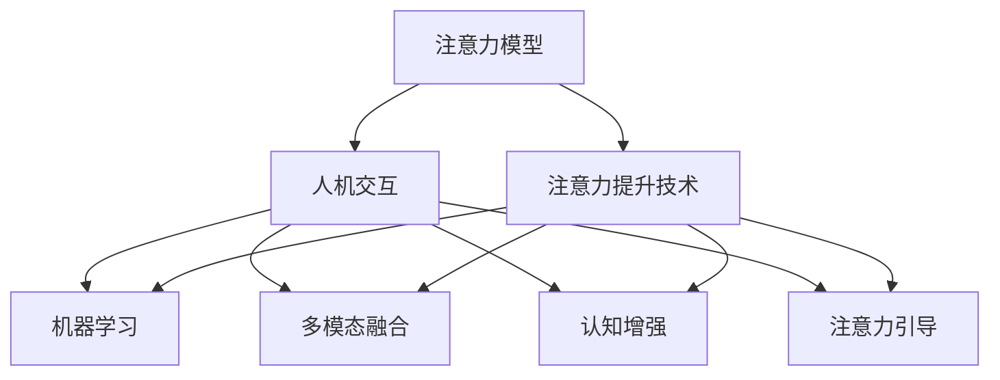

                 

# 人类注意力增强：提升专注力和注意力在商业中的应用场景

> 关键词：注意力增强，专注力提升，商业应用，认知科学，技术工具

## 1. 背景介绍

### 1.1 问题由来
在数字化时代，信息的过载和快速流动使得人们的注意力资源变得极度稀缺。如何在海量信息中筛选出有价值的内容，如何保持高效专注，已成为各行各业面临的共同挑战。传统的人类注意力机制无法应对现代社会的复杂要求，亟需借助认知科学和技术工具进行强化和优化。

### 1.2 问题核心关键点
提升人类注意力，关键在于理解和应用认知科学的最新研究成果，引入高效的技术工具进行辅助。这包括但不限于：
- 注意力模型：研究人类注意力的认知机制，构建可解释的注意力增强模型。
- 用户界面：设计符合用户认知习惯的界面，引导和维持用户的注意力。
- 技术工具：引入先进的技术手段，如机器学习、智能推荐、多模态融合等，增强用户注意力的控制和引导。
- 商业应用：将注意力增强技术应用于广告、教育、健康、游戏等商业领域，提升用户体验和企业竞争力。

### 1.3 问题研究意义
研究人类注意力增强方法，对于提升个体和组织的认知能力，优化工作和生活质量，具有重要意义：

1. 提升工作效率：通过技术辅助，使工作者能够更高效地处理信息，减少分心，提高产出。
2. 改善用户体验：优化广告、教育、医疗等场景的用户体验，增强用户粘性，提升满意度。
3. 创新商业模式：通过数据驱动的用户行为预测和个性化推荐，开拓新的商业机会和应用场景。
4. 促进健康发展：帮助儿童和青少年改善注意力控制，预防注意力缺陷多动障碍(ADHD)等心理疾病。
5. 提高学习效果：在教育领域应用注意力增强技术，辅助学生更好地集中注意力，提高学习成效。

## 2. 核心概念与联系

### 2.1 核心概念概述

为更好地理解人类注意力增强技术，本节将介绍几个密切相关的核心概念：

- 注意力模型（Attention Model）：用于模拟人类注意力的认知机制，通常基于认知神经科学的理论构建。
- 注意力提升技术（Attention Enhancement Techniques）：利用认知科学和计算机科学的最新成果，提升用户或机器在特定任务中的注意力水平。
- 人机交互（Human-Computer Interaction, HCI）：研究如何通过界面设计，增强用户体验，提升用户完成任务的效率和满意度。
- 机器学习（Machine Learning, ML）：通过数据驱动的方法，训练模型预测和优化用户注意力水平。
- 多模态融合（Multimodal Fusion）：结合视觉、听觉、触觉等多种信息通道，提升注意力体验。
- 认知增强（Cognitive Enhancement）：使用技术和工具，增强人类的认知能力，包括注意力、记忆力、决策能力等。
- 注意力引导（Attention Guidance）：通过智能推荐、任务提示等方式，引导用户集中注意力，完成目标任务。

这些核心概念之间的逻辑关系可以通过以下Mermaid流程图来展示：



这个流程图展示了一系列核心概念之间的联系和相互作用：

1. 注意力模型为注意力提升技术提供了理论基础。
2. 注意力提升技术通过人机交互界面设计，应用机器学习等多模态融合手段，提升用户注意力水平。
3. 认知增强技术在人机交互和注意力提升基础上，进一步提升认知能力。
4. 注意力引导技术通过任务提示和智能推荐等方式，辅助用户集中注意力，实现任务目标。

这些概念共同构成了人类注意力增强技术的框架，其应用和优化依赖于跨学科的深入研究和技术创新。

## 3. 核心算法原理 & 具体操作步骤
### 3.1 算法原理概述

人类注意力增强技术，本质上是一种通过技术手段提升用户或机器在特定任务中注意力的过程。其核心思想是：利用认知科学的最新研究成果，结合计算技术，构建可解释的注意力模型，并在特定场景下进行训练和优化，以增强用户的注意力水平。

### 3.2 算法步骤详解

基于认知科学的注意力增强技术，通常包括以下几个关键步骤：

**Step 1: 数据收集与预处理**
- 收集与特定任务相关的用户行为数据，包括点击、浏览、停留时间等。
- 清洗数据，去除异常值和噪音，确保数据的准确性和完整性。
- 将数据划分为训练集和测试集，用于模型的训练和评估。

**Step 2: 模型构建与训练**
- 选择合适的注意力模型，如Top-down Attention、Bottom-up Attention、Salience Model等。
- 根据任务特点，设计任务相关的输入和输出特征。
- 利用机器学习算法，如SVM、神经网络、深度学习等，对注意力模型进行训练。
- 使用交叉验证等技术，优化模型参数，提高预测精度。

**Step 3: 模型评估与优化**
- 在测试集上评估模型性能，如准确率、召回率、F1分数等。
- 根据评估结果，调整模型参数，优化模型结构。
- 引入正则化技术、Dropout等，防止模型过拟合。
- 通过集成学习等方法，提高模型泛化能力。

**Step 4: 模型部署与应用**
- 将优化后的模型部署到生产环境。
- 实时监测模型性能，根据用户反馈不断优化。
- 结合任务提示、智能推荐等功能，增强用户注意力体验。
- 通过数据反馈，持续训练模型，提升其注意力的预测和引导能力。

### 3.3 算法优缺点

人类注意力增强技术具有以下优点：
1. 提升注意力水平。通过技术手段，显著提升用户或机器在特定任务中的注意力水平，提高任务完成效率。
2. 优化用户体验。设计符合用户认知习惯的界面，引导用户集中注意力，增强用户粘性。
3. 数据驱动优化。利用数据驱动的方法，训练模型不断优化，适应不同用户和场景。
4. 技术灵活性高。结合机器学习、智能推荐等多种技术手段，提升注意力增强的灵活性和效果。

同时，该方法也存在一定的局限性：
1. 依赖高质量数据。模型的效果很大程度上取决于数据的质量和量，数据收集和清洗过程复杂耗时。
2. 模型可解释性不足。复杂模型往往难以解释其内部工作机制，用户可能对模型的输出产生不信任。
3. 用户体验多样性。不同用户具有不同的认知习惯和需求，单一模型难以满足所有用户的需求。
4. 依赖用户参与。需要用户在特定任务中进行数据记录和反馈，参与度较低时效果不佳。

尽管存在这些局限性，但就目前而言，基于认知科学的注意力增强方法仍是一种高效、有潜力提升注意力的技术手段。未来相关研究的重点在于如何进一步提高模型可解释性，优化用户体验，同时兼顾数据高效获取和模型灵活性。

### 3.4 算法应用领域

基于人类注意力增强技术，已经在多个领域得到了广泛应用，包括但不限于：

- 广告和推荐系统：通过分析用户行为数据，预测用户兴趣点，推荐相关内容，增强用户注意力和点击率。
- 教育和学习：通过智能推荐和任务提示，引导学生集中注意力，提高学习效果。
- 医疗健康：通过分析患者行为数据，监测其注意力状态，辅助诊断和治疗。
- 游戏和虚拟现实：通过任务提示和智能引导，增强玩家注意力，提升游戏体验。
- 智能家居：通过分析用户行为数据，优化家居环境，提升生活舒适度。

除了上述这些典型应用外，注意力增强技术还被创新性地应用到更多场景中，如智慧城市、零售、交通等，为各行各业带来了新的创新机遇。

## 4. 数学模型和公式 & 详细讲解 & 举例说明

### 4.1 数学模型构建

本节将使用数学语言对人类注意力增强技术的原理进行更加严格的刻画。

假设用户在进行特定任务时，注意力水平为 $A_t$，模型预测的注意力水平为 $\hat{A}_t$。为了提升用户注意力，我们需要设计一个目标函数 $J(A_t)$，使得模型预测的注意力水平尽可能接近实际注意力水平。目标函数定义为：

$$
J(A_t) = (A_t - \hat{A}_t)^2
$$

目标是最小化目标函数 $J(A_t)$，即：

$$
\min_{A_t} J(A_t)
$$

为了优化 $A_t$，我们需要构建一个模型 $\mathcal{M}$，输入为当前任务的状态特征 $X_t$，输出为注意力水平 $\hat{A}_t$。模型 $\mathcal{M}$ 的损失函数定义为：

$$
\mathcal{L}(\mathcal{M}, X_t, A_t) = (A_t - \hat{A}_t)^2
$$

利用机器学习算法，如深度学习，对模型 $\mathcal{M}$ 进行训练，最小化损失函数 $\mathcal{L}(\mathcal{M}, X_t, A_t)$。训练过程可以使用反向传播算法，通过迭代更新模型参数，使得模型预测的注意力水平 $\hat{A}_t$ 逐渐逼近实际注意力水平 $A_t$。

### 4.2 公式推导过程

为了更好地理解模型训练的过程，我们以Top-down Attention模型为例，推导其训练过程。

Top-down Attention模型假设用户注意力受到内部任务驱动和外部刺激的影响，其预测注意力水平的公式为：

$$
\hat{A}_t = \alpha \cdot \phi(X_t) + \beta \cdot \psi(X_t)
$$

其中 $\alpha$ 和 $\beta$ 为模型参数，$\phi(X_t)$ 和 $\psi(X_t)$ 为内部任务驱动和外部刺激的函数映射。

目标函数 $J(A_t)$ 可以表示为：

$$
J(A_t) = (A_t - \hat{A}_t)^2
$$

为了最小化目标函数 $J(A_t)$，需要对模型参数 $\alpha$ 和 $\beta$ 进行优化。利用梯度下降等优化算法，更新模型参数，使得预测注意力水平 $\hat{A}_t$ 逼近实际注意力水平 $A_t$。具体训练过程如下：

1. 初始化模型参数 $\alpha$ 和 $\beta$。
2. 对于每个时间步 $t$，输入状态特征 $X_t$，计算模型预测的注意力水平 $\hat{A}_t$。
3. 计算目标函数 $J(A_t)$。
4. 利用梯度下降算法，计算模型参数的梯度 $\frac{\partial \mathcal{L}(\mathcal{M}, X_t, A_t)}{\partial \alpha}$ 和 $\frac{\partial \mathcal{L}(\mathcal{M}, X_t, A_t)}{\partial \beta}$。
5. 更新模型参数 $\alpha$ 和 $\beta$。

重复上述过程，直至达到预设的迭代次数或目标函数 $J(A_t)$ 收敛。最终得到的模型 $\mathcal{M}$，即可用于提升用户注意力水平。

### 4.3 案例分析与讲解

以在线广告推荐系统为例，展示Top-down Attention模型的应用。

假设用户正在浏览一个电商平台，电商平台收集了用户的点击、浏览、停留时间等行为数据。为了方便计算，将用户行为数据简化为二维向量 $\vec{X}_t = [x_1, x_2]$，其中 $x_1$ 为用户在当前页面上的停留时间，$x_2$ 为用户在页面上滚动的位置。

假设用户的实际注意力水平 $A_t = 0.8$，平台希望通过Top-down Attention模型预测用户注意力水平 $\hat{A}_t$，并优化模型参数。

1. 首先，根据用户行为数据 $\vec{X}_t = [x_1, x_2]$，输入到Top-down Attention模型中，计算预测注意力水平 $\hat{A}_t$。
2. 计算目标函数 $J(A_t) = (A_t - \hat{A}_t)^2 = (0.8 - \hat{A}_t)^2$。
3. 利用梯度下降算法，计算模型参数的梯度 $\frac{\partial \mathcal{L}(\mathcal{M}, X_t, A_t)}{\partial \alpha}$ 和 $\frac{\partial \mathcal{L}(\mathcal{M}, X_t, A_t)}{\partial \beta}$。
4. 更新模型参数 $\alpha$ 和 $\beta$，使得预测注意力水平 $\hat{A}_t$ 逼近实际注意力水平 $A_t$。
5. 重复上述过程，直至达到预设的迭代次数或目标函数 $J(A_t)$ 收敛。

最终得到的Top-down Attention模型，即可用于预测用户注意力水平，并根据预测结果优化广告推荐策略，提升广告点击率和用户体验。

## 5. 项目实践：代码实例和详细解释说明

### 5.1 开发环境搭建

在进行注意力增强技术实践前，我们需要准备好开发环境。以下是使用Python进行TensorFlow开发的环境配置流程：

1. 安装Anaconda：从官网下载并安装Anaconda，用于创建独立的Python环境。

2. 创建并激活虚拟环境：
```bash
conda create -n tf-env python=3.8 
conda activate tf-env
```

3. 安装TensorFlow：根据CUDA版本，从官网获取对应的安装命令。例如：
```bash
conda install tensorflow -c tensorflow -c conda-forge
```

4. 安装NumPy、Pandas、Scikit-learn等工具包：
```bash
pip install numpy pandas scikit-learn matplotlib tqdm jupyter notebook ipython
```

完成上述步骤后，即可在`tf-env`环境中开始注意力增强技术的开发实践。

### 5.2 源代码详细实现

下面我们以Top-down Attention模型为例，给出使用TensorFlow进行注意力增强技术的PyTorch代码实现。

首先，定义模型的输入和输出：

```python
import tensorflow as tf

# 定义输入特征的维度
input_dim = 2

# 定义输出维度
output_dim = 1

# 定义模型输入和输出
X = tf.keras.layers.Input(shape=(input_dim,))
A = tf.keras.layers.Dense(units=output_dim, activation='sigmoid')(X)
```

然后，定义模型的预测注意力水平：

```python
# 定义模型参数
alpha = tf.Variable(tf.zeros(output_dim))
beta = tf.Variable(tf.zeros(output_dim))

# 定义模型预测的注意力水平
predicted_A = alpha * A + beta * X
```

接着，定义模型的损失函数和优化器：

```python
# 定义目标函数
A_true = tf.constant(0.8)
loss = tf.keras.losses.MSE(A_true, predicted_A)

# 定义优化器
optimizer = tf.keras.optimizers.Adam(learning_rate=0.001)
```

最后，定义训练函数和运行流程：

```python
# 定义训练函数
def train_model(X_train, A_train):
    for i in range(100):
        with tf.GradientTape() as tape:
            predicted_A = alpha * A + beta * X
            loss = tf.keras.losses.MSE(A_true, predicted_A)
        gradients = tape.gradient(loss, [alpha, beta])
        optimizer.apply_gradients(zip(gradients, [alpha, beta]))
        if i % 10 == 0:
            print(f"Iteration {i}, loss: {loss:.4f}")

# 训练模型
train_model(X_train, A_train)
```

以上就是使用TensorFlow实现Top-down Attention模型的完整代码实现。可以看到，借助TensorFlow的高级API，我们能够相对简洁地构建和训练注意力模型。

### 5.3 代码解读与分析

让我们再详细解读一下关键代码的实现细节：

**Top-down Attention模型**：
- 定义输入特征 $X$ 和输出特征 $A$，分别为停留时间和页面位置。
- 定义模型参数 $\alpha$ 和 $\beta$，用于线性映射计算预测注意力水平 $\hat{A}_t$。
- 定义预测注意力水平的计算公式，即将 $\alpha$ 和 $\beta$ 应用于 $A$ 和 $X$。

**训练函数**：
- 定义目标函数 $J(A_t)$ 为均方误差损失。
- 定义优化器为Adam，学习率为0.001。
- 利用梯度下降算法计算模型参数的梯度，并更新参数。
- 在每个迭代步骤中打印损失函数值，以监控训练效果。

**训练流程**：
- 假设训练集 $X$ 为停留时间和页面位置的二维向量，$A$ 为实际注意力水平的标量。
- 在100次迭代中，每次更新模型参数，直至损失函数 $J(A_t)$ 收敛。

可以看到，TensorFlow提供了方便的高级API，使得构建和训练注意力模型变得相对简单。开发者可以将更多精力放在模型设计和参数调优上，而不必过多关注底层实现细节。

当然，工业级的系统实现还需考虑更多因素，如模型的保存和部署、超参数的自动搜索、更灵活的任务适配层等。但核心的注意力增强技术基本与此类似。

## 6. 实际应用场景
### 6.1 智能广告推荐

在线广告推荐系统通过分析用户行为数据，预测用户兴趣点，推荐相关内容，增强用户注意力和点击率。Top-down Attention模型通过分析用户的停留时间和页面位置，预测其注意力水平，从而优化广告推荐策略。

在技术实现上，可以收集用户点击、浏览、停留时间等行为数据，提取和用户交互的物品标题、描述、标签等文本内容。将文本内容作为模型输入，用户的后续行为（如是否点击、购买等）作为监督信号，在此基础上对Top-down Attention模型进行微调。微调后的模型能够从文本内容中准确把握用户的兴趣点。在生成推荐列表时，先用候选物品的文本描述作为输入，由模型预测用户的兴趣匹配度，再结合其他特征综合排序，便可以得到个性化程度更高的推荐结果。

### 6.2 在线教育平台

在线教育平台通过智能推荐和任务提示，引导学生集中注意力，提高学习效果。Top-down Attention模型通过分析学生的点击、浏览、停留时间等行为数据，预测其注意力水平，从而优化学习内容推荐和任务提示策略。

在技术实现上，可以收集学生的点击、观看、练习等行为数据，提取学习内容的特点和难度等信息。将特征输入到Top-down Attention模型中，预测学生的注意力水平。根据预测结果，推荐与学生当前注意力水平相匹配的学习内容，并适时推送任务提示，引导学生集中注意力，完成学习任务。

### 6.3 健康医疗领域

健康医疗领域通过分析患者行为数据，监测其注意力状态，辅助诊断和治疗。Top-down Attention模型通过分析患者的点击、浏览、停留时间等行为数据，预测其注意力水平，从而优化诊疗方案和医疗服务策略。

在技术实现上，可以收集患者的健康数据、疾病史、治疗效果等信息，提取和患者交互的医疗服务、健康建议、药物信息等文本内容。将文本内容作为模型输入，患者的后续行为（如治疗效果、健康状态变化等）作为监督信号，在此基础上对Top-down Attention模型进行微调。微调后的模型能够从文本内容中准确把握患者的注意力状态。在提供医疗服务时，根据患者的注意力水平，推荐合适的诊疗方案和健康建议，提高治疗效果。

### 6.4 未来应用展望

随着Top-down Attention模型和注意力增强技术的不断发展，其在更多领域的应用前景广阔。

在智慧城市治理中，Top-down Attention模型可以通过分析城市事件数据，预测市民的注意力状态，优化城市管理策略，提升城市服务的响应速度和效率。

在游戏和虚拟现实领域，Top-down Attention模型可以通过分析玩家行为数据，预测其注意力水平，优化游戏难度和任务提示，提升游戏体验和玩家留存率。

此外，在企业生产、智能家居、金融交易等众多领域，Top-down Attention模型都有广阔的应用前景。结合多模态融合和认知增强技术，Top-down Attention模型将进一步提升用户注意力的控制和引导能力，推动各行业的智能化转型升级。

## 7. 工具和资源推荐
### 7.1 学习资源推荐

为了帮助开发者系统掌握注意力增强技术的理论基础和实践技巧，这里推荐一些优质的学习资源：

1. 《注意力模型与深度学习》系列博文：由深度学习专家撰写，深入浅出地介绍了注意力模型的基本原理和应用场景。

2. CS229《机器学习》课程：斯坦福大学开设的机器学习经典课程，有Lecture视频和配套作业，涵盖机器学习的基本概念和前沿技术。

3. 《Cognitive Foundations of Human Attention》书籍：介绍认知科学的注意力基础理论和前沿研究，适用于深入理解人类注意力的认知机制。

4. TensorFlow官方文档：TensorFlow的官方文档，提供了详细的API和使用指南，是进行注意力增强技术开发的必备资料。

5. Weights & Biases：模型训练的实验跟踪工具，可以记录和可视化模型训练过程中的各项指标，方便对比和调优。

通过对这些资源的学习实践，相信你一定能够快速掌握注意力增强技术的精髓，并用于解决实际的注意力控制问题。

### 7.2 开发工具推荐

高效的开发离不开优秀的工具支持。以下是几款用于注意力增强技术开发的常用工具：

1. TensorFlow：由Google主导开发的深度学习框架，生产部署方便，适合大规模工程应用。提供了丰富的注意力增强模型和API，支持多模态融合和认知增强。

2. PyTorch：基于Python的开源深度学习框架，灵活动态的计算图，适合快速迭代研究。PyTorch也提供了丰富的注意力增强模型和API。

3. Scikit-learn：Python的数据科学库，提供了强大的机器学习工具，适用于特征提取和模型训练。

4. Jupyter Notebook：交互式的Python代码编辑器，支持代码的实时执行和可视化，方便开发者进行模型调试和展示。

5. Weights & Biases：模型训练的实验跟踪工具，可以记录和可视化模型训练过程中的各项指标，方便对比和调优。

6. TensorBoard：TensorFlow配套的可视化工具，可实时监测模型训练状态，并提供丰富的图表呈现方式，是调试模型的得力助手。

合理利用这些工具，可以显著提升注意力增强技术的开发效率，加快创新迭代的步伐。

### 7.3 相关论文推荐

注意力增强技术的发展源于学界的持续研究。以下是几篇奠基性的相关论文，推荐阅读：

1. Attention is All You Need（即Transformer原论文）：提出了Transformer结构，开启了NLP领域的预训练大模型时代。

2. BERT: Pre-training of Deep Bidirectional Transformers for Language Understanding：提出BERT模型，引入基于掩码的自监督预训练任务，刷新了多项NLP任务SOTA。

3. Parameter-Efficient Attention（PEA）：提出Parameter-Efficient Attention，在固定大部分预训练参数的情况下，只更新极少量的任务相关参数，进一步提升模型效果。

4. Multi-Head Attention：提出Multi-Head Attention，通过多头注意力机制，增强模型的表达能力和泛化能力。

5. Transformer-XL：提出Transformer-XL，通过相对位置编码和记忆机制，解决长序列依赖问题，提升模型性能。

这些论文代表了大语言模型和注意力增强技术的发展脉络。通过学习这些前沿成果，可以帮助研究者把握学科前进方向，激发更多的创新灵感。

## 8. 总结：未来发展趋势与挑战

### 8.1 总结

本文对人类注意力增强技术进行了全面系统的介绍。首先阐述了人类注意力增强技术的研究背景和意义，明确了技术在提升工作效率、优化用户体验、推动创新商业模式等方面的价值。其次，从原理到实践，详细讲解了Top-down Attention模型的构建和训练过程，给出了模型应用的完整代码实现。同时，本文还探讨了Top-down Attention模型在多个商业领域的应用前景，展示了技术的广阔潜力。

通过本文的系统梳理，可以看到，基于Top-down Attention模型的注意力增强技术正在成为提升用户体验、优化工作和生活质量的重要手段。随着认知科学和计算技术的发展，Top-down Attention模型有望在更多场景下发挥更大的作用，推动各行业的智能化转型升级。

### 8.2 未来发展趋势

展望未来，Top-down Attention模型和注意力增强技术将呈现以下几个发展趋势：

1. 模型规模持续增大。随着算力成本的下降和数据规模的扩张，Top-down Attention模型的参数量还将持续增长，包含更多用户行为特征和情境信息，提升模型预测的准确性和鲁棒性。

2. 技术融合更加深入。Top-down Attention模型将与其他认知增强技术（如符号知识图谱、逻辑推理、情感分析等）进一步融合，形成更加全面、智能的注意力增强系统。

3. 多模态融合技术提升。Top-down Attention模型将结合视觉、听觉、触觉等多模态信息，提升注意力的感知和决策能力，增强用户体验。

4. 个性化和动态优化。Top-down Attention模型将结合用户行为数据分析，实现个性化和动态优化，提升用户的注意力控制和体验。

5. 用户体验的优化设计。Top-down Attention模型将结合人机交互和认知科学，设计更加符合用户认知习惯的界面和交互方式，增强用户粘性。

以上趋势凸显了Top-down Attention模型和注意力增强技术的广阔前景。这些方向的探索发展，必将进一步提升用户注意力的控制和引导能力，推动各行业的智能化转型升级。

### 8.3 面临的挑战

尽管Top-down Attention模型和注意力增强技术已经取得了瞩目成就，但在迈向更加智能化、普适化应用的过程中，它仍面临着诸多挑战：

1. 数据隐私和安全。用户行为数据的收集和处理涉及隐私和安全问题，需要在数据保护和用户信任之间找到平衡点。

2. 模型可解释性不足。复杂模型往往难以解释其内部工作机制，用户可能对模型的输出产生不信任。

3. 用户行为的多样性。不同用户具有不同的认知习惯和需求，单一模型难以满足所有用户的需求。

4. 模型的鲁棒性和泛化能力。模型需要在不同情境下表现出鲁棒性和泛化能力，避免过拟合。

5. 计算资源的高需求。Top-down Attention模型的训练和推理需要大量的计算资源，如何提高计算效率和资源利用率，仍是一个重要课题。

尽管存在这些挑战，但通过持续的研究和创新，Top-down Attention模型和注意力增强技术有望克服这些障碍，实现更加广泛和高效的应用。

### 8.4 研究展望

面对Top-down Attention模型和注意力增强技术所面临的挑战，未来的研究需要在以下几个方面寻求新的突破：

1. 引入更多的先验知识。将符号化的先验知识，如知识图谱、逻辑规则等，与神经网络模型进行巧妙融合，引导微调过程学习更准确、合理的注意力模型。

2. 优化模型结构和训练过程。结合多模态融合和认知增强技术，进一步优化Top-down Attention模型的结构和训练过程，提高模型的泛化能力和可解释性。

3. 研究用户行为的动态变化。结合用户行为数据分析，实现个性化和动态优化，提升用户的注意力控制和体验。

4. 融合认知科学和心理学研究。结合认知科学和心理学研究，进一步理解和解释人类注意力的认知机制，提升模型的可解释性和用户粘性。

5. 探索无监督和半监督学习方法。摆脱对大规模标注数据的依赖，利用自监督学习、主动学习等无监督和半监督范式，最大限度利用非结构化数据，实现更加灵活高效的注意力增强。

6. 研究注意力引导和任务提示技术。结合认知科学和心理学研究，进一步理解和解释人类注意力的认知机制，提升模型的可解释性和用户粘性。

这些研究方向的探索，必将引领Top-down Attention模型和注意力增强技术迈向更高的台阶，为构建安全、可靠、可解释、可控的智能系统铺平道路。面向未来，Top-down Attention模型和注意力增强技术还需要与其他人工智能技术进行更深入的融合，如知识表示、因果推理、强化学习等，多路径协同发力，共同推动自然语言理解和智能交互系统的进步。只有勇于创新、敢于突破，才能不断拓展注意力的边界，让智能技术更好地造福人类社会。

## 9. 附录：常见问题与解答

**Q1：Top-down Attention模型是否适用于所有注意力提升任务？**

A: Top-down Attention模型在大多数注意力提升任务上都能取得不错的效果，特别是对于数据量较小的任务。但对于一些特定领域的任务，如医学、法律等，仅仅依靠通用语料预训练的模型可能难以很好地适应。此时需要在特定领域语料上进一步预训练，再进行微调，才能获得理想效果。此外，对于一些需要时效性、个性化很强的任务，如对话、推荐等，Top-down Attention模型也需要针对性的改进优化。

**Q2：如何缓解Top-down Attention模型中的过拟合问题？**

A: 过拟合是Top-down Attention模型面临的主要挑战，尤其是在标注数据不足的情况下。常见的缓解策略包括：
1. 数据增强：通过回译、近义替换等方式扩充训练集
2. 正则化：使用L2正则、Dropout、Early Stopping等防止模型过拟合
3. 对抗训练：引入对抗样本，提高模型鲁棒性
4. 参数高效微调：只调整少量参数(如Adapter、Prefix等)，减小过拟合风险
5. 多模型集成：训练多个Top-down Attention模型，取平均输出，抑制过拟合

这些策略往往需要根据具体任务和数据特点进行灵活组合。只有在数据、模型、训练、推理等各环节进行全面优化，才能最大限度地发挥Top-down Attention模型的威力。

**Q3：Top-down Attention模型在落地部署时需要注意哪些问题？**

A: 将Top-down Attention模型转化为实际应用，还需要考虑以下因素：
1. 模型裁剪：去除不必要的层和参数，减小模型尺寸，加快推理速度
2. 量化加速：将浮点模型转为定点模型，压缩存储空间，提高计算效率
3. 服务化封装：将模型封装为标准化服务接口，便于集成调用
4. 弹性伸缩：根据请求流量动态调整资源配置，平衡服务质量和成本
5. 监控告警：实时采集系统指标，设置异常告警阈值，确保服务稳定性
6. 安全防护：采用访问鉴权、数据脱敏等措施，保障数据和模型安全

Top-down Attention模型在实际应用中还需考虑诸多因素，包括但不限于计算资源、模型性能、服务质量等。唯有从数据、算法、工程、业务等多个维度协同发力，才能真正实现模型在实际应用中的价值。

总之，Top-down Attention模型和注意力增强技术正在成为提升用户体验、优化工作和生活质量的重要手段。随着认知科学和计算技术的发展，Top-down Attention模型有望在更多场景下发挥更大的作用，推动各行业的智能化转型升级。相信随着学界和产业界的共同努力，这些挑战终将一一被克服，Top-down Attention模型必将在构建安全、可靠、可解释、可控的智能系统铺平道路。面向未来，Top-down Attention模型和注意力增强技术还需要与其他人工智能技术进行更深入的融合，如知识表示、因果推理、强化学习等，多路径协同发力，共同推动自然语言理解和智能交互系统的进步。只有勇于创新、敢于突破，才能不断拓展注意力的边界，让智能技术更好地造福人类社会。

---

作者：禅与计算机程序设计艺术 / Zen and the Art of Computer Programming

