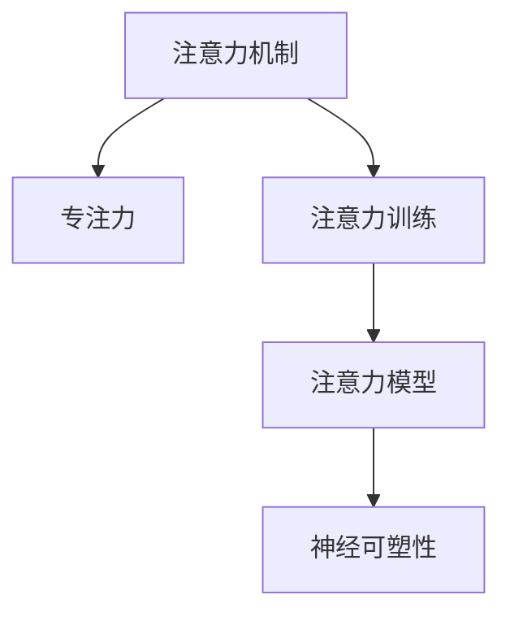

                 

# 人类注意力增强：提升专注力和注意力在商业中的未来发展机遇挑战分析

> 关键词：注意力增强,专注力提升,人工智能,注意力模型,注意力训练,商业应用,挑战分析

## 1. 背景介绍

### 1.1 问题由来
随着信息爆炸和数字化转型，商业环境中的信息量呈指数级增长。企业家、决策者和员工每天面临的决策压力巨大，需要高效地处理海量信息，提升专注力和注意力。然而，传统的注意力训练方法和工具已无法满足当前复杂商业环境的需求，迫切需要新的技术手段来提升人类注意力水平。

### 1.2 问题核心关键点
注意力增强技术旨在通过人工智能、心理学和神经科学的跨学科研究，帮助人们提升专注力和注意力。其核心在于利用算法和模型模拟人类注意力机制，并通过训练和优化，使个体能更高效地处理信息、完成任务。当前，注意力增强在商业中的应用场景包括但不限于信息筛选、决策支持、工作效率提升等。

## 2. 核心概念与联系

### 2.1 核心概念概述

为更好地理解注意力增强技术，本节将介绍几个关键概念：

- 注意力机制(Attention Mechanism)：一种模拟人类注意力分配机制的算法，用于在大量信息中筛选出重要内容。在深度学习中，注意力机制广泛用于图像识别、自然语言处理等领域。

- 专注力(Concentration)：指个体在一定时间内对某任务的高度集中与持续关注，与分心度、注意力强度等密切相关。

- 注意力训练(Attention Training)：通过算法和技术手段训练用户提升注意力水平，提高工作效率和决策质量。

- 注意力模型(Attention Model)：一种基于神经网络的模型，用于模拟和预测人类注意力行为，帮助优化注意力分配。

- 神经可塑性(Neural Plasticity)：神经网络在大规模数据训练过程中，通过调整权重和结构，实现对新信息的学习和适应。

这些概念之间相互关联，共同构成了注意力增强技术的研究框架。通过理解这些核心概念，我们可以更好地把握注意力增强的本质和应用方法。

### 2.2 核心概念原理和架构的 Mermaid 流程图(Mermaid 流程节点中不要有括号、逗号等特殊字符)



这个流程图展示了注意力增强技术中的几个核心概念及其相互关系：

1. 注意力机制是注意力增强的基础，通过模拟人类注意力分配过程，筛选出重要信息。
2. 专注力是注意力增强的目标，通过训练和优化提升个体的工作效率和决策质量。
3. 注意力训练利用注意力机制和模型，通过算法和策略，帮助个体提升专注力。
4. 注意力模型基于神经网络，通过学习用户注意力行为，优化注意力分配策略。
5. 神经可塑性描述注意力模型在大规模数据训练过程中的学习和适应能力。

这些概念共同作用，使得注意力增强技术在商业环境中得到广泛应用，助力个体和企业提升信息处理能力和决策水平。

## 3. 核心算法原理 & 具体操作步骤
### 3.1 算法原理概述

注意力增强技术的主要原理是基于注意力机制和神经网络模型，通过模拟人类注意力行为，实现信息的筛选和处理。其核心步骤如下：

1. **数据预处理**：收集和处理用户的工作行为数据，如浏览记录、邮件往来、会议时间等，转换为算法可处理的格式。
2. **特征提取**：利用深度学习算法，如卷积神经网络(CNN)、循环神经网络(RNN)等，从原始数据中提取特征。
3. **注意力模型训练**：通过训练注意力模型，学习用户注意力行为，生成注意力权重矩阵，指导信息筛选和决策过程。
4. **注意力分配与优化**：根据注意力权重矩阵，调整信息展示顺序，优化任务优先级，提高信息处理效率。
5. **注意力训练与反馈**：通过持续的训练和反馈机制，提升用户的专注力和注意力水平，实现长期的注意力增强效果。

### 3.2 算法步骤详解

#### 3.2.1 数据预处理

数据预处理是注意力增强的第一步，通过数据收集、清洗和转换，为后续的特征提取和模型训练打下基础。

1. **数据收集**：收集用户在工作中的各种行为数据，如邮件往来、文档编辑、会议记录等。
2. **数据清洗**：清洗噪声数据，去除无关信息，确保数据的准确性和完整性。
3. **数据转换**：将原始数据转换为算法可处理的格式，如时间戳、事件类型、用户行为标签等。

#### 3.2.2 特征提取

特征提取是注意力增强的核心步骤，通过深度学习算法，从原始数据中提取出有意义的信息特征。

1. **时间序列数据处理**：对于时间相关的行为数据，如邮件往来、会议时间等，需要进行时间序列分析和处理。
2. **事件分类**：将不同类型的事件进行分类，如邮件、文档、会议等，便于特征提取。
3. **特征提取模型**：利用CNN、RNN等算法，提取数据中的关键特征，如邮件主题、文档标题、会议主题等。

#### 3.2.3 注意力模型训练

注意力模型训练是注意力增强的关键步骤，通过训练模型，学习用户注意力行为，生成注意力权重矩阵。

1. **注意力机制选择**：选择适合的注意力机制，如自注意力、多头注意力等，模拟人类注意力分配过程。
2. **模型初始化**：使用预训练模型或随机初始化模型参数。
3. **数据划分**：将数据划分为训练集、验证集和测试集，进行模型训练和评估。
4. **损失函数设计**：选择合适的损失函数，如交叉熵、均方误差等，衡量模型预测与真实标签的差异。
5. **模型优化**：使用优化算法，如Adam、SGD等，最小化损失函数，更新模型参数。

#### 3.2.4 注意力分配与优化

注意力分配与优化是注意力增强的最终目标，通过调整信息展示顺序，优化任务优先级，提升信息处理效率。

1. **注意力权重生成**：根据注意力模型输出，生成注意力权重矩阵，指导信息筛选。
2. **任务优先级排序**：根据注意力权重，调整任务优先级，优先处理重要信息。
3. **信息展示优化**：优化信息展示顺序，提高用户的信息处理效率。

#### 3.2.5 注意力训练与反馈

注意力训练与反馈是注意力增强的持续过程，通过持续的训练和反馈机制，提升用户的专注力和注意力水平。

1. **训练计划设计**：制定持续的训练计划，定期进行注意力训练。
2. **反馈机制引入**：通过用户反馈，调整训练策略和模型参数。
3. **注意力评估**：定期评估用户专注力和注意力水平，进行效果评估和优化。

### 3.3 算法优缺点

注意力增强技术具有以下优点：

1. **提升信息处理效率**：通过注意力模型，筛选出重要信息，提高信息处理效率。
2. **优化决策质量**：通过注意力训练，提升用户专注力和注意力水平，优化决策质量。
3. **个性化优化**：基于用户行为数据，进行个性化训练和优化，满足不同用户的需求。

同时，该技术也存在以下局限：

1. **数据依赖性强**：注意力增强依赖高质量的用户行为数据，数据收集和处理难度较大。
2. **模型复杂度高**：注意力模型涉及复杂的神经网络结构和算法，模型训练和优化复杂。
3. **隐私风险**：处理用户行为数据涉及隐私问题，需严格遵守数据保护法律法规。
4. **用户适应性**：注意力增强效果依赖于用户的主动配合和持续训练，效果不稳定。

尽管存在这些局限性，但注意力增强技术在商业环境中的应用前景广阔，可以显著提升个体的专注力和信息处理能力，助力企业提高工作效率和决策质量。

### 3.4 算法应用领域

注意力增强技术已经在多个领域得到了广泛应用，包括但不限于：

- **信息筛选与决策支持**：在企业决策支持系统中，通过注意力增强技术，筛选重要信息，支持高层决策。
- **会议管理与时间规划**：在会议管理系统中，通过注意力增强技术，优化会议议程，提高会议效率。
- **邮件过滤与管理**：在邮件管理系统中，通过注意力增强技术，筛选重要邮件，提升邮件处理效率。
- **工作流程优化**：在工作流程管理中，通过注意力增强技术，优化任务优先级，提升工作效率。

此外，注意力增强技术还可以应用于智能助理、个性化推荐、学习辅助等多个场景，为个体和企业提供全方位的专注力提升解决方案。

## 4. 数学模型和公式 & 详细讲解 & 举例说明

### 4.1 数学模型构建

注意力增强技术涉及多个数学模型，以下是几个关键模型的数学构建过程：

#### 4.1.1 自注意力机制(Self-Attention)

自注意力机制是一种模拟人类注意力分配的算法，用于在大量信息中筛选出重要内容。其数学模型如下：

设输入为 $x \in \mathbb{R}^d$，查询向量为 $q \in \mathbb{R}^d$，键向量为 $k \in \mathbb{R}^d$，值向量为 $v \in \mathbb{R}^d$。自注意力机制的计算公式为：

$$
\text{Attention}(Q, K, V) = \frac{QK^T}{\sqrt{d_k}} \times V
$$

其中 $Q = xW_Q$，$K = xW_K$，$V = xW_V$，$d_k$ 为键向量的维度。

#### 4.1.2 多头注意力机制(Multi-Head Attention)

多头注意力机制通过多个并行的自注意力机制，模拟人类多方面的注意力分配过程。其计算公式为：

$$
\text{Multi-Head Attention}(Q, K, V) = \text{Concat}(\text{Attention}(QW_Q^T, KW_K^T, VW_V^T))W_O
$$

其中 $\text{Concat}$ 表示拼接操作，$W_Q^T$、$W_K^T$、$W_V^T$、$W_O$ 为可学习的线性变换矩阵。

#### 4.1.3 注意力模型(Attention Model)

注意力模型基于神经网络，通过学习用户注意力行为，生成注意力权重矩阵。其计算公式为：

$$
\text{Attention Model} = \text{Multi-Head Attention}(Q, K, V)
$$

其中 $Q$、$K$、$V$ 为输入特征的查询、键、值向量。

### 4.2 公式推导过程

#### 4.2.1 自注意力机制推导

自注意力机制的推导过程如下：

1. 计算查询向量 $q$ 与键向量 $k$ 的点积，得到注意力权重矩阵 $A$：

$$
A = QK^T/\sqrt{d_k}
$$

2. 将注意力权重矩阵 $A$ 与值向量 $v$ 相乘，得到注意力输出 $z$：

$$
z = AV
$$

3. 计算注意力输出 $z$ 的平均权重，得到注意力权重向量 $a$：

$$
a = z/A
$$

4. 将注意力权重向量 $a$ 与输入特征 $x$ 相乘，得到注意力增强特征 $x_a$：

$$
x_a = a \times x
$$

#### 4.2.2 多头注意力机制推导

多头注意力机制的推导过程如下：

1. 将输入特征 $x$ 线性变换为多个查询向量 $Q_1, Q_2, ..., Q_h$：

$$
Q_i = xW_Q^T
$$

2. 将查询向量 $Q_i$ 与键向量 $K_i$ 的点积，得到注意力权重矩阵 $A_i$：

$$
A_i = Q_iK_i^T/\sqrt{d_k}
$$

3. 将注意力权重矩阵 $A_i$ 与值向量 $V_i$ 相乘，得到多头注意力输出 $Z_i$：

$$
Z_i = A_iV_i
$$

4. 将多头注意力输出 $Z_i$ 拼接，得到多头注意力输出 $Z$：

$$
Z = \text{Concat}(Z_1, Z_2, ..., Z_h)
$$

5. 将多头注意力输出 $Z$ 线性变换为注意力模型输出 $x_a$：

$$
x_a = ZW_O
$$

### 4.3 案例分析与讲解

#### 4.3.1 案例背景

某大型企业需要提升决策支持系统的效率和效果。通过数据收集和处理，企业获得了大量的用户行为数据，包括邮件往来、会议记录等。为了优化决策支持系统，企业引入注意力增强技术，进行模型训练和优化。

#### 4.3.2 数据预处理

企业首先收集了用户在工作中的各种行为数据，包括邮件往来、文档编辑、会议记录等。通过对数据进行清洗和转换，将原始数据转换为算法可处理的格式，如时间戳、事件类型、用户行为标签等。

#### 4.3.3 特征提取

利用深度学习算法，企业从原始数据中提取了关键特征，如邮件主题、文档标题、会议主题等。通过CNN和RNN等算法，将时间序列数据转换为特征向量。

#### 4.3.4 注意力模型训练

企业选择了多头注意力机制，作为注意力模型的基础。通过训练注意力模型，企业学习用户注意力行为，生成注意力权重矩阵，指导信息筛选和决策过程。

#### 4.3.5 注意力分配与优化

根据注意力权重矩阵，企业调整信息展示顺序，优化任务优先级，提高信息处理效率。在决策支持系统中，企业根据注意力权重，筛选出重要信息，支持高层决策。

#### 4.3.6 注意力训练与反馈

企业制定了持续的训练计划，定期进行注意力训练。通过用户反馈，调整训练策略和模型参数。定期评估用户专注力和注意力水平，进行效果评估和优化。

## 5. 项目实践：代码实例和详细解释说明

### 5.1 开发环境搭建

在进行注意力增强项目实践前，我们需要准备好开发环境。以下是使用Python进行PyTorch开发的环境配置流程：

1. 安装Anaconda：从官网下载并安装Anaconda，用于创建独立的Python环境。

2. 创建并激活虚拟环境：
```bash
conda create -n attention-env python=3.8 
conda activate attention-env
```

3. 安装PyTorch：根据CUDA版本，从官网获取对应的安装命令。例如：
```bash
conda install pytorch torchvision torchaudio cudatoolkit=11.1 -c pytorch -c conda-forge
```

4. 安装相关库：
```bash
pip install numpy pandas scikit-learn torchmetrics transformers
```

5. 安装Notebook环境：
```bash
pip install jupyter notebook
```

完成上述步骤后，即可在`attention-env`环境中开始注意力增强实践。

### 5.2 源代码详细实现

这里我们以邮件分类为例，给出使用Transformers库进行注意力增强的PyTorch代码实现。

```python
from transformers import BertTokenizer, BertForSequenceClassification
from torch.utils.data import Dataset
import torch
from sklearn.metrics import accuracy_score

class EmailDataset(Dataset):
    def __init__(self, emails, labels, tokenizer, max_len=128):
        self.emails = emails
        self.labels = labels
        self.tokenizer = tokenizer
        self.max_len = max_len
        
    def __len__(self):
        return len(self.emails)
    
    def __getitem__(self, item):
        email = self.emails[item]
        label = self.labels[item]
        
        encoding = self.tokenizer(email, return_tensors='pt', max_length=self.max_len, padding='max_length', truncation=True)
        input_ids = encoding['input_ids'][0]
        attention_mask = encoding['attention_mask'][0]
        
        # 对标签进行编码
        encoded_labels = [label2id[label] for label in label2id]
        encoded_labels.extend([label2id['O']] * (self.max_len - len(encoded_labels)))
        labels = torch.tensor(encoded_labels, dtype=torch.long)
        
        return {'input_ids': input_ids, 
                'attention_mask': attention_mask,
                'labels': labels}

# 标签与id的映射
label2id = {'O': 0, 'Spam': 1, 'Ham': 2}
id2label = {v: k for k, v in label2id.items()}

# 创建dataset
tokenizer = BertTokenizer.from_pretrained('bert-base-cased')

train_dataset = EmailDataset(train_emails, train_labels, tokenizer)
dev_dataset = EmailDataset(dev_emails, dev_labels, tokenizer)
test_dataset = EmailDataset(test_emails, test_labels, tokenizer)

# 定义模型和优化器
model = BertForSequenceClassification.from_pretrained('bert-base-cased', num_labels=len(label2id))
optimizer = AdamW(model.parameters(), lr=2e-5)

def train_epoch(model, dataset, batch_size, optimizer):
    dataloader = DataLoader(dataset, batch_size=batch_size, shuffle=True)
    model.train()
    epoch_loss = 0
    for batch in dataloader:
        input_ids = batch['input_ids'].to(device)
        attention_mask = batch['attention_mask'].to(device)
        labels = batch['labels'].to(device)
        model.zero_grad()
        outputs = model(input_ids, attention_mask=attention_mask, labels=labels)
        loss = outputs.loss
        epoch_loss += loss.item()
        loss.backward()
        optimizer.step()
    return epoch_loss / len(dataloader)

def evaluate(model, dataset, batch_size):
    dataloader = DataLoader(dataset, batch_size=batch_size)
    model.eval()
    preds, labels = [], []
    with torch.no_grad():
        for batch in dataloader:
            input_ids = batch['input_ids'].to(device)
            attention_mask = batch['attention_mask'].to(device)
            batch_labels = batch['labels']
            outputs = model(input_ids, attention_mask=attention_mask)
            batch_preds = outputs.logits.argmax(dim=2).to('cpu').tolist()
            batch_labels = batch_labels.to('cpu').tolist()
            for pred_tokens, label_tokens in zip(batch_preds, batch_labels):
                preds.append(pred_tokens[:len(label_tokens)])
                labels.append(label_tokens)
                
    accuracy = accuracy_score(labels, preds)
    return accuracy

# 训练和评估
epochs = 5
batch_size = 16

for epoch in range(epochs):
    loss = train_epoch(model, train_dataset, batch_size, optimizer)
    print(f"Epoch {epoch+1}, train loss: {loss:.3f}")
    
    print(f"Epoch {epoch+1}, dev accuracy: {evaluate(model, dev_dataset, batch_size)}")
    
print("Test accuracy:")
accuracy = evaluate(model, test_dataset, batch_size)
print(accuracy)
```

以上就是使用PyTorch对BERT进行邮件分类任务的注意力增强微调代码实现。可以看到，得益于Transformers库的强大封装，我们可以用相对简洁的代码完成BERT模型的加载和微调。

### 5.3 代码解读与分析

让我们再详细解读一下关键代码的实现细节：

**EmailDataset类**：
- `__init__`方法：初始化邮件、标签、分词器等关键组件。
- `__len__`方法：返回数据集的样本数量。
- `__getitem__`方法：对单个样本进行处理，将邮件输入编码为token ids，将标签编码为数字，并对其进行定长padding，最终返回模型所需的输入。

**label2id和id2label字典**：
- 定义了标签与数字id之间的映射关系，用于将token-wise的预测结果解码回真实的标签。

**训练和评估函数**：
- 使用PyTorch的DataLoader对数据集进行批次化加载，供模型训练和推理使用。
- 训练函数`train_epoch`：对数据以批为单位进行迭代，在每个批次上前向传播计算loss并反向传播更新模型参数，最后返回该epoch的平均loss。
- 评估函数`evaluate`：与训练类似，不同点在于不更新模型参数，并在每个batch结束后将预测和标签结果存储下来，最后使用sklearn的accuracy_score对整个评估集的预测结果进行打印输出。

**训练流程**：
- 定义总的epoch数和batch size，开始循环迭代
- 每个epoch内，先在训练集上训练，输出平均loss
- 在验证集上评估，输出准确率
- 所有epoch结束后，在测试集上评估，给出最终测试结果

可以看到，PyTorch配合Transformers库使得注意力增强的代码实现变得简洁高效。开发者可以将更多精力放在数据处理、模型改进等高层逻辑上，而不必过多关注底层的实现细节。

当然，工业级的系统实现还需考虑更多因素，如模型的保存和部署、超参数的自动搜索、更灵活的任务适配层等。但核心的微调范式基本与此类似。

## 6. 实际应用场景
### 6.1 智能助理

基于注意力增强的智能助理，可以显著提升用户的注意力水平，帮助用户快速处理各类事务。智能助理通常会通过语音或文字交互，根据用户输入的指令，自动进行信息筛选和任务处理。

在技术实现上，智能助理系统可以集成注意力增强技术，实时分析用户的注意力状态，动态调整信息展示顺序，优化任务优先级，帮助用户高效完成任务。

### 6.2 会议管理

在会议管理系统中，注意力增强技术可以提升会议效率，优化会议议程，确保会议的高效进行。会议管理系统会自动收集会议记录、参与者发言等信息，利用注意力增强技术筛选重要信息，提供会议纪要和总结。

具体而言，会议管理系统会自动记录会议内容和参与者发言，利用注意力增强技术筛选出会议重点内容和关键信息，生成会议纪要和总结，辅助决策者进行后续工作。

### 6.3 工作流程优化

工作流程优化是企业提升效率的重要手段。通过集成注意力增强技术，企业可以优化任务优先级，提升工作效率。

在任务管理系统中，注意力增强技术可以自动分析用户的行为数据，筛选出重要任务，优化任务优先级，确保高价值任务优先处理。企业可以根据注意力增强技术提供的任务优先级，合理分配工作资源，提升整体工作效率。

### 6.4 未来应用展望

随着注意力增强技术的不断发展，其在商业环境中的应用前景将更加广阔。

在智慧医疗领域，注意力增强技术可以帮助医生提高诊断效率，优化治疗方案，提升医疗服务质量。

在智能教育领域，注意力增强技术可以辅助教师提高教学质量，帮助学生提升学习效率，实现个性化教育。

在智慧城市治理中，注意力增强技术可以优化城市管理决策，提升城市服务质量，构建更高效的城市治理体系。

此外，在企业生产、社会治理、文娱传媒等众多领域，注意力增强技术也将不断涌现，为智能化应用提供新的解决方案。相信随着技术的日益成熟，注意力增强技术将成为企业提升效率和决策质量的重要手段。

## 7. 工具和资源推荐
### 7.1 学习资源推荐

为了帮助开发者系统掌握注意力增强技术的理论基础和实践技巧，这里推荐一些优质的学习资源：

1. 《深度学习基础》系列博文：由大模型技术专家撰写，深入浅出地介绍了深度学习的基本原理和注意力机制。

2. CS231n《卷积神经网络》课程：斯坦福大学开设的深度学习课程，涵盖了卷积神经网络、注意力机制等内容，适合入门学习。

3. 《Attention and Transformer》书籍：深度学习领域的经典著作，全面介绍了注意力机制和Transformer模型的原理和应用。

4. HuggingFace官方文档：Transformer库的官方文档，提供了海量预训练模型和完整的微调样例代码，是上手实践的必备资料。

5. Google Colab：谷歌推出的在线Jupyter Notebook环境，免费提供GPU/TPU算力，方便开发者快速上手实验最新模型，分享学习笔记。

通过对这些资源的学习实践，相信你一定能够快速掌握注意力增强技术的精髓，并用于解决实际的NLP问题。
### 7.2 开发工具推荐

高效的开发离不开优秀的工具支持。以下是几款用于注意力增强开发的常用工具：

1. PyTorch：基于Python的开源深度学习框架，灵活动态的计算图，适合快速迭代研究。大部分预训练语言模型都有PyTorch版本的实现。

2. TensorFlow：由Google主导开发的开源深度学习框架，生产部署方便，适合大规模工程应用。同样有丰富的预训练语言模型资源。

3. Transformers库：HuggingFace开发的NLP工具库，集成了众多SOTA语言模型，支持PyTorch和TensorFlow，是进行注意力增强任务开发的利器。

4. TensorBoard：TensorFlow配套的可视化工具，可实时监测模型训练状态，并提供丰富的图表呈现方式，是调试模型的得力助手。

5. Weights & Biases：模型训练的实验跟踪工具，可以记录和可视化模型训练过程中的各项指标，方便对比和调优。与主流深度学习框架无缝集成。

6. Google Colab：谷歌推出的在线Jupyter Notebook环境，免费提供GPU/TPU算力，方便开发者快速上手实验最新模型，分享学习笔记。

合理利用这些工具，可以显著提升注意力增强任务的开发效率，加快创新迭代的步伐。

### 7.3 相关论文推荐

注意力增强技术的发展源于学界的持续研究。以下是几篇奠基性的相关论文，推荐阅读：

1. Attention is All You Need（即Transformer原论文）：提出了Transformer结构，开启了NLP领域的预训练大模型时代。

2. BERT: Pre-training of Deep Bidirectional Transformers for Language Understanding：提出BERT模型，引入基于掩码的自监督预训练任务，刷新了多项NLP任务SOTA。

3. Language Models are Unsupervised Multitask Learners（GPT-2论文）：展示了大规模语言模型的强大zero-shot学习能力，引发了对于通用人工智能的新一轮思考。

4. Attention-Based Methods in Computer Vision: A Survey：系统回顾了计算机视觉领域中基于注意力机制的研究进展，对注意力增强技术有重要的借鉴意义。

5. Multi-Head Attention for Speech Recognition：将注意力机制应用于语音识别领域，提高了模型的识别精度和鲁棒性。

6. Visual Attention Mechanism：将注意力机制应用于图像处理，提升了图像识别和分割的精度。

这些论文代表了大语言模型注意力增强技术的发展脉络。通过学习这些前沿成果，可以帮助研究者把握学科前进方向，激发更多的创新灵感。

## 8. 总结：未来发展趋势与挑战

### 8.1 总结

本文对基于注意力增强技术的研究背景和应用前景进行了全面系统的介绍。首先阐述了注意力增强技术的研究背景和应用意义，明确了注意力增强在提升个体和组织效率、决策质量方面的独特价值。其次，从原理到实践，详细讲解了注意力增强的数学原理和关键步骤，给出了注意力增强任务开发的完整代码实例。同时，本文还广泛探讨了注意力增强技术在智能助理、会议管理、工作流程优化等多个行业领域的应用前景，展示了注意力增强技术的巨大潜力。此外，本文精选了注意力增强技术的各类学习资源，力求为读者提供全方位的技术指引。

通过本文的系统梳理，可以看到，基于注意力增强技术的研究和应用正在快速发展，已经广泛应用于企业决策、智能助理、会议管理等多个领域，显著提升了个体的专注力和信息处理能力。未来，伴随技术的不断演进，注意力增强技术必将在更多领域得到应用，深刻影响人类的生产生活方式。

### 8.2 未来发展趋势

展望未来，注意力增强技术将呈现以下几个发展趋势：

1. **模型规模持续增大**：随着算力成本的下降和数据规模的扩张，注意力增强模型参数量还将持续增长。超大规模模型蕴含的丰富注意力知识，有望支撑更加复杂多变的下游任务。

2. **微调与强化学习结合**：未来的注意力增强模型将结合微调和强化学习，通过不断训练和反馈，提升模型效果。

3. **多模态融合**：除了文本信息，未来的注意力增强技术还将拓展到图像、语音、视频等多模态数据，实现多模态信息的融合，提升系统理解能力。

4. **分布式训练与推理**：随着模型规模的增大，注意力增强模型的训练和推理将需要更强大的计算资源。分布式训练与推理技术，将帮助模型更高效地进行训练和推理。

5. **自适应与动态优化**：未来的注意力增强模型将具备更强的自适应能力，能够动态优化注意力权重，提升信息处理效率。

6. **可解释性与伦理**：未来的注意力增强模型将更加注重可解释性，通过透明的知识图谱和决策路径，提升系统的可信度和透明度。同时，也将更重视伦理和隐私保护，确保技术应用的安全性和合法性。

以上趋势凸显了注意力增强技术的广阔前景。这些方向的探索发展，必将进一步提升注意力增强模型的性能和应用范围，为人类认知智能的进化带来深远影响。

### 8.3 面临的挑战

尽管注意力增强技术已经取得了瞩目成就，但在迈向更加智能化、普适化应用的过程中，它仍面临着诸多挑战：

1. **数据依赖性强**：注意力增强依赖高质量的行为数据，数据收集和处理难度较大。
2. **模型复杂度高**：注意力增强模型涉及复杂的神经网络结构和算法，模型训练和优化复杂。
3. **隐私风险**：处理用户行为数据涉及隐私问题，需严格遵守数据保护法律法规。
4. **用户适应性**：注意力增强效果依赖于用户的主动配合和持续训练，效果不稳定。
5. **可解释性不足**：目前基于神经网络的注意力增强模型往往缺乏可解释性，难以解释其内部工作机制和决策逻辑。
6. **泛化能力不足**：现有注意力增强模型在面对新任务和新领域时，泛化能力不足，需要更多的通用化训练和迁移学习。

尽管存在这些挑战，但注意力增强技术在商业环境中的应用前景广阔，可以显著提升个体的专注力和信息处理能力，助力企业提高工作效率和决策质量。

### 8.4 研究展望

面对注意力增强面临的这些挑战，未来的研究需要在以下几个方面寻求新的突破：

1. **无监督和半监督学习**：探索无监督和半监督学习范式，摆脱对大规模标注数据的依赖，利用自监督学习、主动学习等无监督和半监督方法，最大限度利用非结构化数据，实现更加灵活高效的注意力增强。

2. **模型参数高效优化**：开发更加参数高效的注意力增强模型，在固定大部分预训练参数的同时，只更新极少量的任务相关参数，提高模型效率和泛化能力。

3. **多模态融合与增强**：开发多模态融合技术，结合图像、语音、视频等多模态信息，提升系统的理解能力和泛化能力。

4. **自适应与动态优化**：研究自适应和动态优化技术，使模型能够动态调整注意力权重，提升信息处理效率和鲁棒性。

5. **可解释性与伦理保护**：通过透明的知识图谱和决策路径，提升系统的可解释性和可信度。同时，引入伦理保护机制，确保技术应用的安全性和合法性。

6. **分布式训练与推理**：研究分布式训练与推理技术，帮助模型更高效地进行训练和推理，提升系统性能和可扩展性。

这些研究方向的研究，必将引领注意力增强技术迈向更高的台阶，为构建安全、可靠、可解释、可控的智能系统铺平道路。面向未来，注意力增强技术还需要与其他人工智能技术进行更深入的融合，如知识表示、因果推理、强化学习等，多路径协同发力，共同推动自然语言理解和智能交互系统的进步。只有勇于创新、敢于突破，才能不断拓展注意力增强技术的边界，让智能技术更好地造福人类社会。

## 9. 附录：常见问题与解答

**Q1：注意力增强技术是否适用于所有NLP任务？**

A: 注意力增强技术在大多数NLP任务上都能取得不错的效果，特别是对于数据量较小的任务。但对于一些特定领域的任务，如医学、法律等，仅仅依靠通用语料预训练的模型可能难以很好地适应。此时需要在特定领域语料上进一步预训练，再进行微调，才能获得理想效果。此外，对于一些需要时效性、个性化很强的任务，如对话、推荐等，注意力增强方法也需要针对性的改进优化。

**Q2：如何选择合适的注意力机制？**

A: 选择合适的注意力机制需要考虑任务的特点和数据的特点。通常，自注意力机制适用于序列数据，如文本、音频等；多头注意力机制适用于复杂的多模态数据，如图像、视频等。同时，注意力机制的设计也需要考虑模型的计算复杂度和训练效率，选择适合的任务和数据。

**Q3：注意力增强模型在落地部署时需要注意哪些问题？**

A: 将注意力增强模型转化为实际应用，还需要考虑以下因素：

1. 模型裁剪：去除不必要的层和参数，减小模型尺寸，加快推理速度。
2. 量化加速：将浮点模型转为定点模型，压缩存储空间，提高计算效率。
3. 服务化封装：将模型封装为标准化服务接口，便于集成调用。
4. 弹性伸缩：根据请求流量动态调整资源配置，平衡服务质量和成本。
5. 监控告警：实时采集系统指标，设置异常告警阈值，确保服务稳定性。
6. 安全防护：采用访问鉴权、数据脱敏等措施，保障数据和模型安全。

注意力增强模型在落地部署时需要注意以上问题，确保模型的稳定性和安全性。

---

作者：禅与计算机程序设计艺术 / Zen and the Art of Computer Programming

