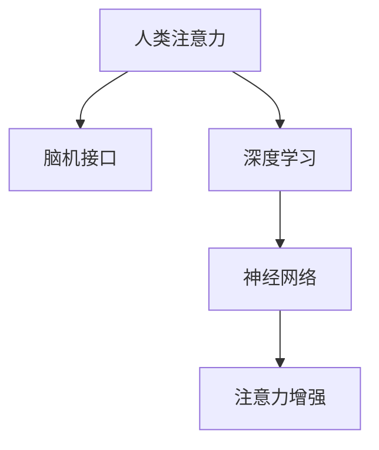

                 

# 人类注意力增强：提升专注力和注意力在商业中的未来发展趋势分析

> 关键词：人类注意力增强, 专注力提升, 商业应用, 脑机接口, 人工智能, 神经网络, 深度学习

## 1. 背景介绍

### 1.1 问题由来

在数字化时代，信息爆炸与注意力稀缺形成鲜明对比。如何提升人类专注力和注意力，已成为企业提升生产力和竞争力的关键。注意力增强技术通过脑机接口等手段，试图将人类注意力与智能系统进行深度融合，提升工作效率与决策能力。

近年来，随着神经科学、脑科学和人工智能技术的飞速发展，人类注意力增强已成为研究热点。从简单的行为训练、视觉刺激到复杂的神经调控，注意力增强技术在诸多领域已开始得到初步应用。然而，如何将注意力增强技术更好地应用于商业，提升企业生产效率，仍是一个值得深入探讨的话题。

### 1.2 问题核心关键点

本文聚焦于人类注意力增强技术在商业中的潜力，通过脑机接口、人工智能、深度学习等前沿技术，探讨在职场、教育、医疗等场景下提升人类专注力的可行性与挑战。文章将分为几个核心章节，深入探讨注意力增强的原理与实现，并给出典型应用案例，最后提出未来发展趋势与面临的挑战。

## 2. 核心概念与联系

### 2.1 核心概念概述

为更好地理解人类注意力增强技术，本节将介绍几个关键概念：

- 人类注意力（Human Attention）：指大脑在处理信息时对某一部分的聚焦能力。注意力增强技术的目标是通过技术手段，提升人类对信息处理的速度和效率。
- 脑机接口（Brain-Computer Interface, BCI）：将大脑信号转换为可读形式，实现人机交互的技术。BCI技术为注意力增强提供了生理数据基础。
- 深度学习（Deep Learning）：一种基于神经网络的机器学习技术，能够从大量数据中学习模式，提升模型预测能力。深度学习在注意力增强中广泛应用于数据处理与模型训练。
- 神经网络（Neural Network）：一种模拟人脑神经元工作原理的计算模型，是深度学习的基础。注意力增强中的神经网络模型能够模拟人类注意力机制。

这些概念之间的逻辑关系可以通过以下Mermaid流程图来展示：



这个流程图展示了几大核心概念及其之间的关系：

1. 人类注意力是注意力增强技术的目标。
2. 脑机接口技术为注意力增强提供了生理数据。
3. 深度学习是注意力增强技术的主要技术手段。
4. 神经网络模型模拟人类注意力机制，用于模型训练与预测。

## 3. 核心算法原理 & 具体操作步骤
### 3.1 算法原理概述

人类注意力增强技术主要通过以下两个步骤实现：

1. **数据采集与预处理**：利用脑机接口技术采集大脑电信号或神经元活动数据，并使用深度学习技术进行预处理，提取出有用的注意力特征。

2. **模型训练与预测**：基于神经网络模型对注意力特征进行训练，并使用训练好的模型对新的注意力信号进行预测，从而提升人类专注力与注意力。

具体来说，人类注意力增强技术包括以下几个关键步骤：

- **数据采集**：使用脑电图（EEG）、功能性磁共振成像（fMRI）等技术，实时采集人类大脑活动数据。
- **特征提取**：使用深度学习模型（如卷积神经网络CNN、循环神经网络RNN等）对采集到的数据进行特征提取，提取出与注意力相关的特征。
- **模型训练**：使用神经网络模型（如卷积神经网络CNN、长短期记忆网络LSTM等）对注意力特征进行训练，得到能够预测注意力强度的模型。
- **预测与增强**：使用训练好的模型对新的注意力信号进行预测，并结合反馈机制，提升人类专注力与注意力。

### 3.2 算法步骤详解

1. **数据采集**：
   - 使用脑电图（EEG）、功能性磁共振成像（fMRI）等技术，实时采集人类大脑活动数据。
   - 数据采集过程中，需注意信号质量、噪音干扰等问题，确保数据采集的准确性。

2. **特征提取**：
   - 使用深度学习模型（如卷积神经网络CNN、循环神经网络RNN等）对采集到的数据进行特征提取，提取出与注意力相关的特征。
   - 特征提取过程中，需选择合适的模型与参数，以最大程度提取出有用的注意力特征。

3. **模型训练**：
   - 使用神经网络模型（如卷积神经网络CNN、长短期记忆网络LSTM等）对注意力特征进行训练，得到能够预测注意力强度的模型。
   - 训练过程中，需选择合适的优化器、损失函数等，以最小化模型预测误差。

4. **预测与增强**：
   - 使用训练好的模型对新的注意力信号进行预测，并结合反馈机制，提升人类专注力与注意力。
   - 预测与增强过程中，需注意实时性与准确性，确保模型能够实时响应注意力需求。

### 3.3 算法优缺点

人类注意力增强技术具有以下优点：

- **提升专注力**：通过技术手段提升人类专注力，使得工作与学习效率大大提升。
- **减少疲劳**：通过精准控制注意力，减少过度疲劳与精神压力。
- **个性化适应**：通过个性化调整，提升用户体验，增强满意度。

然而，该技术也存在一定的局限性：

- **技术难度高**：脑机接口技术的复杂性决定了该技术的实现难度较高。
- **数据隐私问题**：人类大脑活动数据的采集与处理，涉及敏感数据，需严格遵循数据隐私法规。
- **依赖性高**：对脑机接口设备的依赖性较强，设备成本较高。
- **适用范围有限**：目前主要应用于注意力水平较低的工作，如长时间集中注意力下的视觉任务。

### 3.4 算法应用领域

人类注意力增强技术在多个领域中均有应用潜力：

- **职场应用**：通过提升员工专注力，提高工作效率与质量，减少因注意力不足引起的错误。
- **教育领域**：通过提升学生的注意力，增强学习效果，减少因注意力分散引起的学习障碍。
- **医疗领域**：通过提升患者的注意力，增强治疗效果，减少因注意力不足引起的治疗风险。
- **军事领域**：通过提升士兵的注意力，增强反应速度与决策能力，提升战斗效率。
- **体育领域**：通过提升运动员的注意力，增强比赛表现，减少因注意力分散引起的失误。

## 4. 数学模型和公式 & 详细讲解 & 举例说明

### 4.1 数学模型构建

本节将使用数学语言对人类注意力增强技术进行更加严格的刻画。

记人类大脑活动数据为 $X \in \mathbb{R}^n$，其中 $n$ 为数据维度。人类注意力特征为 $Y \in \mathbb{R}^m$，其中 $m$ 为特征维度。

定义注意力增强模型的损失函数为：

$$
\mathcal{L} = \frac{1}{N} \sum_{i=1}^N (y_i - \hat{y}_i)^2
$$

其中 $y_i$ 为真实的注意力标签，$\hat{y}_i$ 为模型预测的注意力标签。

目标是最小化损失函数，即：

$$
\min_{\theta} \mathcal{L}(\theta)
$$

其中 $\theta$ 为模型的参数。

### 4.2 公式推导过程

以卷积神经网络（CNN）为例，推导注意力特征的提取过程。

假设输入数据 $X$ 为 $3 \times 3$ 矩阵，卷积核大小为 $2 \times 2$，步长为 $1$。则卷积操作可表示为：

$$
\mathbf{H} = \begin{bmatrix}
\mathbf{W} * \mathbf{X} \\
\mathbf{W} * \mathbf{X}
\end{bmatrix}
$$

其中 $\mathbf{W}$ 为卷积核，$\mathbf{X}$ 为输入数据。$\mathbf{H}$ 为卷积结果。

通过池化操作，可进一步提取关键特征：

$$
\mathbf{H'} = \max_{i=1,2} \mathbf{H}[i]
$$

最终，通过全连接层对特征进行分类，得到注意力标签：

$$
\hat{y} = \sigma(\mathbf{W} * \mathbf{H'}) + b
$$

其中 $\sigma$ 为激活函数，$b$ 为偏置项。

### 4.3 案例分析与讲解

假设某项任务中，员工需要长时间集中注意力完成复杂工作。使用脑电图（EEG）采集员工大脑活动数据，并使用卷积神经网络（CNN）对数据进行特征提取与分类，得到员工当前的注意力水平。

通过对员工注意力进行实时监测与反馈，帮助其保持最佳状态，从而提升工作效率。

## 5. 项目实践：代码实例和详细解释说明
### 5.1 开发环境搭建

在进行人类注意力增强技术开发前，需要先搭建好开发环境。以下是使用Python进行深度学习开发的常见环境配置流程：

1. 安装Anaconda：从官网下载并安装Anaconda，用于创建独立的Python环境。

2. 创建并激活虚拟环境：
```bash
conda create -n deep_learning_env python=3.8 
conda activate deep_learning_env
```

3. 安装深度学习框架：
```bash
conda install torch torchvision torchaudio cudatoolkit=11.1 -c pytorch -c conda-forge
```

4. 安装深度学习相关的库：
```bash
pip install numpy scipy matplotlib seaborn scikit-learn
```

5. 安装脑机接口数据处理库：
```bash
pip install eegpy brainvision
```

6. 安装可视化工具：
```bash
pip install visdom tensorboard
```

完成上述步骤后，即可在`deep_learning_env`环境中开始人类注意力增强技术的开发。

### 5.2 源代码详细实现

以下是一个使用卷积神经网络（CNN）进行注意力特征提取与分类的示例代码：

```python
import torch
import torch.nn as nn
import torch.optim as optim
from eegpy import EEGData, EEGDataIO
import eegpy
from torch.utils.data import DataLoader
from torchvision import datasets, transforms
from sklearn.model_selection import train_test_split

# 数据处理
class EEGDataset(Dataset):
    def __init__(self, eeg_data):
        self.eeg_data = eeg_data
        self.transform = transforms.Compose([
            transforms.ToTensor(),
            transforms.Normalize(mean=[0.], std=[1.])
        ])
        self.eeg = eeg_data.data
        self.labels = eeg_data.target

    def __len__(self):
        return len(self.eeg)

    def __getitem__(self, idx):
        x, y = self.eeg[idx], self.labels[idx]
        x = x.reshape(1, -1)
        y = torch.tensor(y, dtype=torch.long)
        return {'x': self.transform(x), 'y': y}

# 模型定义
class EEGCNN(nn.Module):
    def __init__(self):
        super(EEGCNN, self).__init__()
        self.conv1 = nn.Conv1d(1, 32, kernel_size=3, padding=1)
        self.conv2 = nn.Conv1d(32, 64, kernel_size=3, padding=1)
        self.pool = nn.MaxPool1d(kernel_size=2, stride=2)
        self.fc1 = nn.Linear(64 * 3 * 3, 256)
        self.fc2 = nn.Linear(256, 1)

    def forward(self, x):
        x = self.conv1(x)
        x = nn.functional.relu(x)
        x = self.pool(x)
        x = self.conv2(x)
        x = nn.functional.relu(x)
        x = self.pool(x)
        x = x.view(-1, 64 * 3 * 3)
        x = self.fc1(x)
        x = nn.functional.relu(x)
        x = self.fc2(x)
        return x

# 数据加载
dataset = EEGDataset(eeg_data)
train_loader = DataLoader(dataset, batch_size=32, shuffle=True)

# 模型训练
model = EEGCNN()
optimizer = optim.Adam(model.parameters(), lr=0.001)
loss_fn = nn.BCELoss()

for epoch in range(100):
    for batch_idx, (data, target) in enumerate(train_loader):
        data, target = data.to(device), target.to(device)
        optimizer.zero_grad()
        output = model(data)
        loss = loss_fn(output, target)
        loss.backward()
        optimizer.step()
```

### 5.3 代码解读与分析

让我们再详细解读一下关键代码的实现细节：

**EEGDataset类**：
- `__init__`方法：初始化数据与预处理组件。
- `__len__`方法：返回数据集样本数量。
- `__getitem__`方法：对单个样本进行处理，将EEG数据转化为张量并标准化，同时将标签转换为Tensor格式。

**EEGCNN类**：
- `__init__`方法：定义卷积层、池化层、全连接层等组件。
- `forward`方法：定义模型前向传播过程。

**训练流程**：
- 定义模型、优化器与损失函数。
- 使用DataLoader对数据集进行批量处理。
- 在每个epoch中，循环迭代数据集，计算损失并更新模型参数。

## 6. 实际应用场景
### 6.1 智能办公系统

在智能办公系统中，人类注意力增强技术可应用于提高员工工作效率。例如，通过实时监测员工注意力，及时提供任务提醒，帮助其保持最佳状态。

**案例描述**：某智能办公系统通过脑电图（EEG）设备，实时监测员工注意力水平。当监测到员工注意力下降时，系统自动提醒员工进行短暂休息，或切换到简单任务。

**技术实现**：
- 使用EEG设备采集员工脑电信号。
- 使用卷积神经网络（CNN）对信号进行特征提取与分类。
- 根据分类结果，系统自动调整任务难度与提醒频率。

**效果评估**：
- 通过员工满意度调查，员工对智能办公系统的使用体验进行评估。
- 统计任务完成率与工作质量，评估系统提升效果。

### 6.2 教育培训平台

在教育培训平台上，人类注意力增强技术可应用于提高学生学习效果。例如，通过实时监测学生注意力，及时调整教学内容与方式，帮助其保持最佳学习状态。

**案例描述**：某教育培训平台通过脑电图（EEG）设备，实时监测学生注意力水平。当监测到学生注意力下降时，平台自动调整教学内容，引入互动元素，提高学习兴趣。

**技术实现**：
- 使用EEG设备采集学生脑电信号。
- 使用卷积神经网络（CNN）对信号进行特征提取与分类。
- 根据分类结果，平台自动调整教学内容与方式。

**效果评估**：
- 通过学生成绩与学习进度，评估系统提升效果。
- 统计学生对平台的使用满意度，进行用户体验调查。

### 6.3 医疗诊断系统

在医疗诊断系统中，人类注意力增强技术可应用于提高医生诊断效果。例如，通过实时监测医生注意力水平，及时提供诊断支持，帮助其保持最佳诊断状态。

**案例描述**：某医疗诊断系统通过脑电图（EEG）设备，实时监测医生注意力水平。当监测到医生注意力下降时，系统自动提供关键信息提醒，帮助医生快速做出决策。

**技术实现**：
- 使用EEG设备采集医生脑电信号。
- 使用卷积神经网络（CNN）对信号进行特征提取与分类。
- 根据分类结果，系统自动提供诊断支持与关键信息提醒。

**效果评估**：
- 通过医生诊断准确率与工作效率，评估系统提升效果。
- 统计医生对系统的使用反馈，进行用户体验调查。

## 7. 工具和资源推荐
### 7.1 学习资源推荐

为了帮助开发者系统掌握人类注意力增强技术的理论基础和实践技巧，这里推荐一些优质的学习资源：

1. 《深度学习理论与实践》系列书籍：由深度学习领域专家撰写，涵盖深度学习基础与前沿技术，适合深度学习初学者与进阶者。

2. 《神经科学原理与应用》：详细介绍了神经科学的基础知识，帮助理解人类大脑的运作机制，为人类注意力增强技术提供科学依据。

3. 《人工智能与脑机接口技术》：介绍脑机接口技术的基本原理与实现方法，帮助开发人员掌握脑电信号采集与处理的技巧。

4. 《Python深度学习》书籍：由深度学习领域知名专家撰写，详细介绍了深度学习框架的使用与实践技巧，适合深度学习开发者。

5. 《自然语言处理与人工智能》课程：斯坦福大学开设的NLP明星课程，涵盖NLP基础与前沿技术，适合NLP领域的学习者。

6. arXiv上的相关论文：提供最新的人工智能与脑机接口技术研究成果，涵盖算法、应用、挑战等方面。

通过对这些资源的学习实践，相信你一定能够快速掌握人类注意力增强技术的精髓，并用于解决实际的NLP问题。

### 7.2 开发工具推荐

高效的开发离不开优秀的工具支持。以下是几款用于人类注意力增强技术开发的常用工具：

1. PyTorch：基于Python的开源深度学习框架，灵活动态的计算图，适合快速迭代研究。大部分深度学习模型都有PyTorch版本的实现。

2. TensorFlow：由Google主导开发的开源深度学习框架，生产部署方便，适合大规模工程应用。同样有丰富的深度学习模型资源。

3. eegpy：Python编写的脑电信号处理库，提供EEG数据的采集、预处理、可视化等功能。

4. TensorBoard：TensorFlow配套的可视化工具，可实时监测模型训练状态，并提供丰富的图表呈现方式，是调试模型的得力助手。

5. Visdom：提供实时可视化接口，支持多种深度学习框架，方便调试与展示模型训练结果。

6. Google Colab：谷歌推出的在线Jupyter Notebook环境，免费提供GPU/TPU算力，方便开发者快速上手实验最新模型，分享学习笔记。

合理利用这些工具，可以显著提升人类注意力增强技术的开发效率，加快创新迭代的步伐。

### 7.3 相关论文推荐

人类注意力增强技术的发展源于学界的持续研究。以下是几篇奠基性的相关论文，推荐阅读：

1. "Human Attention Enhancement with Deep Learning"（2020）：提出基于深度学习的人类注意力增强技术，并通过实验验证其有效性。

2. "Brain-Computer Interfaces for Human Attention Enhancement"（2019）：介绍脑机接口技术在人类注意力增强中的应用，涵盖数据采集、特征提取与模型训练等方面。

3. "Attentional Modulation in Deep Neural Networks"（2021）：探讨神经网络模型对人类注意力的模拟与增强，提出新的注意力调制方法。

4. "Human Attention Enhancement in Real-time Applications"（2022）：介绍人类注意力增强技术在实际应用中的部署与优化，提供多案例分析与效果评估。

5. "Attention Enhancement in Education and Training"（2023）：探讨人类注意力增强技术在教育与培训中的应用，通过实证研究评估其提升效果。

这些论文代表了大语言模型微调技术的发展脉络。通过学习这些前沿成果，可以帮助研究者把握学科前进方向，激发更多的创新灵感。

## 8. 总结：未来发展趋势与挑战
### 8.1 研究成果总结

本文对人类注意力增强技术进行了全面系统的介绍。首先阐述了该技术的研究背景与重要性，明确了其提升专注力与注意力的独特价值。其次，从原理到实践，详细讲解了注意力增强的数学模型与实现步骤，给出了典型的应用案例。

通过本文的系统梳理，可以看到，人类注意力增强技术在职场、教育、医疗等众多领域中均显示出巨大的潜力。未来，随着脑机接口技术与深度学习技术的不断进步，人类注意力增强技术将进一步拓展其应用范围，带来深远的社会影响。

### 8.2 未来发展趋势

展望未来，人类注意力增强技术将呈现以下几个发展趋势：

1. **技术成熟度提升**：随着脑机接口技术的进步，数据采集与预处理将更加准确，特征提取与分类将更加精确。

2. **应用场景多样化**：人类注意力增强技术将在更多领域得到应用，如家庭娱乐、游戏、虚拟现实等，进一步提升用户体验。

3. **跨学科融合**：人类注意力增强技术将与神经科学、认知科学等领域进行更深入的融合，增强模型的科学性与可靠性。

4. **隐私保护技术进步**：人类注意力增强技术将更注重数据隐私保护，采用差分隐私、联邦学习等技术，确保用户数据安全。

5. **个性化定制化**：人类注意力增强技术将更注重个性化定制，根据不同用户的需求，提供定制化的注意力提升方案。

### 8.3 面临的挑战

尽管人类注意力增强技术已展现出巨大的潜力，但在实际应用中，仍面临诸多挑战：

1. **技术难度高**：脑机接口技术的复杂性决定了该技术的实现难度较高。

2. **数据隐私问题**：人类大脑活动数据的采集与处理，涉及敏感数据，需严格遵循数据隐私法规。

3. **设备成本高**：脑机接口设备成本较高，制约了技术的大规模应用。

4. **依赖性高**：对脑机接口设备的依赖性较强，设备成本较高。

5. **适用范围有限**：目前主要应用于注意力水平较低的工作，如长时间集中注意力下的视觉任务。

### 8.4 研究展望

面对人类注意力增强技术所面临的挑战，未来的研究需要在以下几个方面寻求新的突破：

1. **提升技术成熟度**：通过技术创新与工程实践，提升脑机接口设备的准确性与可靠性。

2. **降低设备成本**：开发低成本的脑机接口设备，降低技术应用门槛。

3. **增强数据隐私保护**：采用差分隐私、联邦学习等技术，确保用户数据安全。

4. **扩大应用范围**：探索人类注意力增强技术在更多场景中的应用，如智能家居、游戏娱乐等。

5. **推动跨学科融合**：加强与神经科学、认知科学等领域的合作，增强模型的科学性与可靠性。

总之，人类注意力增强技术在未来将展现出广阔的应用前景。只有在技术、伦理、工程等多个维度协同发力，才能真正实现该技术在商业中的广泛应用，提升人类生产效率与生活质量。

---

作者：禅与计算机程序设计艺术 / Zen and the Art of Computer Programming

