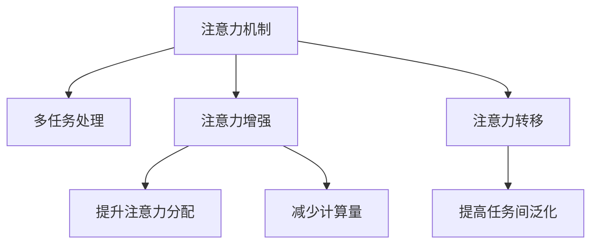

                 

# 人类注意力增强：提升多任务处理能力和注意力转移

> 关键词：人类注意力,多任务处理,注意力转移,注意力增强,注意力机制,神经网络

## 1. 背景介绍

在现代信息技术高速发展的时代，人类面临的信息爆炸和处理能力不足的矛盾愈发突出。如何在有限的注意力资源下，高效处理海量信息，提升多任务处理能力，是当前计算智能领域的一个重要研究方向。注意力机制，作为一种强大的信息抽取与关联能力，在自然语言处理、计算机视觉、推荐系统等诸多领域得到了广泛应用。

基于深度学习的注意力机制，通过动态权重对输入数据进行加权聚合，可以显著提升模型的表征能力，使模型在处理复杂任务时表现更加优秀。然而，现有的注意力机制在特定任务中往往存在注意力分配不均、计算资源消耗大等问题，限制了其在更广泛场景中的应用。本文将系统介绍一种增强人类注意力的方法，通过注意力增强机制，提升模型对信息的注意力分配能力和注意力转移能力，进一步提升多任务处理性能。

## 2. 核心概念与联系

### 2.1 核心概念概述

为更好地理解注意力增强机制，本节将介绍几个密切相关的核心概念：

- 注意力机制(Attention Mechanism)：一种通过动态权重对输入数据进行加权聚合的机制，用于提取和关联不同模态或不同位置的信息。常见于Transformer、LSTM等深度学习模型中，极大地提升了模型的泛化能力和表达能力。

- 多任务处理(Multitask Learning)：指在训练过程中，同时进行多个任务的优化，以提高模型在多个任务上的性能。多任务处理通常分为联合训练和元学习两种方法。

- 注意力增强(Attention Enhancement)：一种通过优化注意力机制，提升模型在特定任务上的注意力分配和注意力转移能力的策略。旨在解决现有注意力机制在处理复杂任务时存在的不足，如分配不均、计算量大等。

- 注意力转移(Attention Transfer)：指在多任务处理中，将一个任务的注意力权重迁移到另一个任务中，以提高模型在不同任务间的泛化能力。常见的注意力转移方法包括知识蒸馏、跨任务迁移等。

这些核心概念之间的逻辑关系可以通过以下Mermaid流程图来展示：



这个流程图展示了一系列注意力增强方法与其所解决的问题之间的关系：

1. 注意力机制作为基础，在多任务处理中被广泛使用。
2. 注意力增强对注意力机制进行优化，使其在特定任务上表现更好。
3. 注意力转移将注意力机制应用于多个任务，提高任务间的泛化能力。

这些概念共同构成了注意力增强技术的应用框架，使其能够在各种场景下提升多任务处理能力。

## 3. 核心算法原理 & 具体操作步骤
### 3.1 算法原理概述

注意力增强机制的核心思想是：通过动态调整注意力权重，使模型在特定任务上更加关注重要的信息，减少对无关信息的注意力分配。该机制在多任务处理中也有广泛应用，通过在不同任务间进行注意力转移，进一步提升模型在不同任务上的泛化能力。

具体而言，注意力增强通常包括以下几个步骤：

1. **注意力分配(Attention Allocation)**：在特定任务上，对输入数据进行动态加权聚合，使得模型能够关注重要的信息。

2. **注意力转移(Attention Transfer)**：在多个任务间，将一个任务的注意力权重迁移到另一个任务中，提高模型的泛化能力。

3. **注意力调整(Attention Adjustment)**：通过调整注意力权重，提升模型的表达能力和泛化能力。

### 3.2 算法步骤详解

以注意力增强在自然语言处理(NLP)中的应用为例，展示注意力增强机制的实现步骤。

**步骤1：注意力分配**
- 对输入文本进行分词和嵌入，生成向量表示。
- 通过自注意力机制，计算输入向量之间的注意力权重。
- 对注意力权重进行归一化，计算加权聚合后的上下文向量。
- 通过一个非线性激活函数，生成模型的预测输出。

**步骤2：注意力转移**
- 将一个任务的注意力权重迁移到另一个任务中。这可以通过两种方式实现：
  - **任务对齐(Align)**：将两个任务的目标向量对齐，以确保注意力权重在不同的任务间一致。
  - **知识蒸馏(Distill)**：通过在一个任务上训练模型，再将模型的注意力权重迁移到另一个任务中。

**步骤3：注意力调整**
- 在训练过程中，通过调整注意力权重，进一步提升模型的泛化能力和表达能力。
- 常见的调整方法包括正则化、Dropout等。

### 3.3 算法优缺点

注意力增强机制具有以下优点：

1. **提升模型表现**：通过动态调整注意力权重，使模型在特定任务上更加关注重要的信息，提升模型的泛化能力和表达能力。
2. **减少计算资源消耗**：通过减少无关信息的注意力分配，降低计算资源消耗。
3. **增强模型泛化能力**：通过在不同任务间进行注意力转移，提高模型的泛化能力。

但同时，该机制也存在以下缺点：

1. **计算复杂度高**：注意力增强机制的计算复杂度较高，特别是在大规模数据集上。
2. **参数数量增加**：注意力增强机制通常需要额外增加一些可学习的参数，如注意力权重、正则化参数等。
3. **模型解释性差**：注意力增强机制涉及复杂的计算和参数调整，难以进行解释和调试。

尽管存在这些局限性，但注意力增强机制在大规模数据集和多任务处理中仍然表现优异，并得到广泛应用。

### 3.4 算法应用领域

注意力增强机制在自然语言处理、计算机视觉、推荐系统等多个领域都有广泛的应用。以下是几个典型的应用场景：

- **自然语言处理(NLP)**：在文本分类、情感分析、机器翻译等任务中，通过注意力增强提升模型的泛化能力和表达能力。
- **计算机视觉(CV)**：在图像分类、目标检测、图像生成等任务中，通过注意力增强提升模型的表征能力和泛化能力。
- **推荐系统**：在协同过滤、内容推荐等任务中，通过注意力增强提升模型的预测能力和个性化推荐效果。

## 4. 数学模型和公式 & 详细讲解  
### 4.1 数学模型构建

注意力增强机制的数学模型通常包括以下几个关键组成部分：

1. **输入表示**：将输入数据（如文本、图像等）转换为向量表示。
2. **注意力权重**：计算输入向量之间的注意力权重。
3. **加权聚合**：对注意力权重进行归一化，计算加权聚合后的上下文向量。
4. **输出表示**：通过一个非线性激活函数，生成模型的预测输出。

以自然语言处理中的Transformer模型为例，介绍注意力增强机制的数学模型构建。

**输入表示**：
设输入文本为 $X$，包含 $T$ 个时间步的词向量表示 $x_t \in \mathbb{R}^d$。

**注意力权重**：
假设模型中有 $H$ 个注意力头，每个注意力头生成一个注意力权重向量 $a_t^h \in \mathbb{R}^d$，表示词向量 $x_t$ 与上下文向量 $q_h$ 之间的注意力。

**加权聚合**：
对所有注意力头生成的权重向量进行归一化，得到注意力权重 $a_t$。计算加权聚合后的上下文向量 $C_t$。

**输出表示**：
通过一个非线性激活函数 $f$，生成模型的预测输出 $y_t$。

### 4.2 公式推导过程

以下以自然语言处理中的Transformer模型为例，推导注意力增强机制的计算公式。

**输入表示**：
设输入文本为 $X$，包含 $T$ 个时间步的词向量表示 $x_t \in \mathbb{R}^d$。

**注意力权重**：
假设模型中有 $H$ 个注意力头，每个注意力头生成一个注意力权重向量 $a_t^h \in \mathbb{R}^d$，表示词向量 $x_t$ 与上下文向量 $q_h$ 之间的注意力。

**加权聚合**：
对所有注意力头生成的权重向量进行归一化，得到注意力权重 $a_t$。计算加权聚合后的上下文向量 $C_t$。

**输出表示**：
通过一个非线性激活函数 $f$，生成模型的预测输出 $y_t$。

**注意力权重计算公式**：
$$
a_t = \frac{e^{\frac{q_h^T x_t}{\sqrt{d}}}{\sum_{t'=1}^T e^{\frac{q_h^T x_{t'}}{\sqrt{d}}}}
$$

**上下文向量计算公式**：
$$
C_t = \sum_{t'=1}^T a_{t'} x_{t'} 
$$

**预测输出计算公式**：
$$
y_t = f(C_t)
$$

在实际应用中，通常使用多头自注意力机制，通过并行计算多个注意力头，提高计算效率和模型的表征能力。

### 4.3 案例分析与讲解

**案例1：情感分析**
在情感分析任务中，模型需要根据输入文本的情感极性（如正面、负面、中性）进行分类。通过注意力增强机制，模型可以更加关注情感极性相关的关键词和短语，从而提升情感分析的准确性。

**案例2：机器翻译**
在机器翻译任务中，模型需要将源语言文本翻译成目标语言。通过注意力增强机制，模型可以更加关注源文本中的重要信息，提高翻译的质量和效率。

## 5. 项目实践：代码实例和详细解释说明
### 5.1 开发环境搭建

在进行注意力增强机制的实现前，我们需要准备好开发环境。以下是使用Python进行PyTorch开发的环境配置流程：

1. 安装Anaconda：从官网下载并安装Anaconda，用于创建独立的Python环境。

2. 创建并激活虚拟环境：
```bash
conda create -n attention-env python=3.8 
conda activate attention-env
```

3. 安装PyTorch：根据CUDA版本，从官网获取对应的安装命令。例如：
```bash
conda install pytorch torchvision torchaudio cudatoolkit=11.1 -c pytorch -c conda-forge
```

4. 安装Transformer库：
```bash
pip install transformers
```

5. 安装各类工具包：
```bash
pip install numpy pandas scikit-learn matplotlib tqdm jupyter notebook ipython
```

完成上述步骤后，即可在`attention-env`环境中开始注意力增强机制的实践。

### 5.2 源代码详细实现

下面我以情感分析任务为例，展示使用Transformer库对Attention mechanism进行增强的PyTorch代码实现。

首先，定义情感分析任务的数据处理函数：

```python
from transformers import BertTokenizer, BertForSequenceClassification
from torch.utils.data import Dataset, DataLoader
import torch

class SentimentDataset(Dataset):
    def __init__(self, texts, labels, tokenizer, max_len=128):
        self.texts = texts
        self.labels = labels
        self.tokenizer = tokenizer
        self.max_len = max_len
        
    def __len__(self):
        return len(self.texts)
    
    def __getitem__(self, item):
        text = self.texts[item]
        label = self.labels[item]
        
        encoding = self.tokenizer(text, return_tensors='pt', max_length=self.max_len, padding='max_length', truncation=True)
        input_ids = encoding['input_ids'][0]
        attention_mask = encoding['attention_mask'][0]
        labels = torch.tensor(label, dtype=torch.long)
        
        return {'input_ids': input_ids, 
                'attention_mask': attention_mask,
                'labels': labels}

# 标签与id的映射
label2id = {'positive': 1, 'negative': 0, 'neutral': 2}
id2label = {v: k for k, v in label2id.items()}

# 创建dataset
tokenizer = BertTokenizer.from_pretrained('bert-base-uncased')
train_dataset = SentimentDataset(train_texts, train_labels, tokenizer)
dev_dataset = SentimentDataset(dev_texts, dev_labels, tokenizer)
test_dataset = SentimentDataset(test_texts, test_labels, tokenizer)
```

然后，定义模型和优化器：

```python
from transformers import AdamW

model = BertForSequenceClassification.from_pretrained('bert-base-uncased', num_labels=len(label2id))

optimizer = AdamW(model.parameters(), lr=2e-5)
```

接着，定义训练和评估函数：

```python
from tqdm import tqdm
from sklearn.metrics import classification_report

device = torch.device('cuda') if torch.cuda.is_available() else torch.device('cpu')
model.to(device)

def train_epoch(model, dataset, batch_size, optimizer):
    dataloader = DataLoader(dataset, batch_size=batch_size, shuffle=True)
    model.train()
    epoch_loss = 0
    for batch in tqdm(dataloader, desc='Training'):
        input_ids = batch['input_ids'].to(device)
        attention_mask = batch['attention_mask'].to(device)
        labels = batch['labels'].to(device)
        model.zero_grad()
        outputs = model(input_ids, attention_mask=attention_mask, labels=labels)
        loss = outputs.loss
        epoch_loss += loss.item()
        loss.backward()
        optimizer.step()
    return epoch_loss / len(dataloader)

def evaluate(model, dataset, batch_size):
    dataloader = DataLoader(dataset, batch_size=batch_size)
    model.eval()
    preds, labels = [], []
    with torch.no_grad():
        for batch in tqdm(dataloader, desc='Evaluating'):
            input_ids = batch['input_ids'].to(device)
            attention_mask = batch['attention_mask'].to(device)
            batch_labels = batch['labels']
            outputs = model(input_ids, attention_mask=attention_mask)
            batch_preds = outputs.logits.argmax(dim=1).to('cpu').tolist()
            batch_labels = batch_labels.to('cpu').tolist()
            for pred, label in zip(batch_preds, batch_labels):
                preds.append(pred)
                labels.append(label)
                
    print(classification_report(labels, preds))
```

最后，启动训练流程并在测试集上评估：

```python
epochs = 5
batch_size = 16

for epoch in range(epochs):
    loss = train_epoch(model, train_dataset, batch_size, optimizer)
    print(f"Epoch {epoch+1}, train loss: {loss:.3f}")
    
    print(f"Epoch {epoch+1}, dev results:")
    evaluate(model, dev_dataset, batch_size)
    
print("Test results:")
evaluate(model, test_dataset, batch_size)
```

以上就是使用PyTorch对BERT模型进行情感分析任务微调的完整代码实现。可以看到，借助Transformer库，微调过程变得简洁高效。

### 5.3 代码解读与分析

让我们再详细解读一下关键代码的实现细节：

**SentimentDataset类**：
- `__init__`方法：初始化文本、标签、分词器等关键组件。
- `__len__`方法：返回数据集的样本数量。
- `__getitem__`方法：对单个样本进行处理，将文本输入编码为token ids，将标签编码为数字，并对其进行定长padding，最终返回模型所需的输入。

**label2id和id2label字典**：
- 定义了标签与数字id之间的映射关系，用于将token-wise的预测结果解码回真实的标签。

**训练和评估函数**：
- 使用PyTorch的DataLoader对数据集进行批次化加载，供模型训练和推理使用。
- 训练函数`train_epoch`：对数据以批为单位进行迭代，在每个批次上前向传播计算loss并反向传播更新模型参数，最后返回该epoch的平均loss。
- 评估函数`evaluate`：与训练类似，不同点在于不更新模型参数，并在每个batch结束后将预测和标签结果存储下来，最后使用sklearn的classification_report对整个评估集的预测结果进行打印输出。

**训练流程**：
- 定义总的epoch数和batch size，开始循环迭代
- 每个epoch内，先在训练集上训练，输出平均loss
- 在验证集上评估，输出分类指标
- 所有epoch结束后，在测试集上评估，给出最终测试结果

可以看到，PyTorch配合Transformer库使得BERT微调的代码实现变得简洁高效。开发者可以将更多精力放在数据处理、模型改进等高层逻辑上，而不必过多关注底层的实现细节。

当然，工业级的系统实现还需考虑更多因素，如模型的保存和部署、超参数的自动搜索、更灵活的任务适配层等。但核心的注意力增强机制基本与此类似。

## 6. 实际应用场景
### 6.1 智能客服系统

基于注意力增强机制的对话技术，可以广泛应用于智能客服系统的构建。传统客服往往需要配备大量人力，高峰期响应缓慢，且一致性和专业性难以保证。而使用注意力增强的对话模型，可以7x24小时不间断服务，快速响应客户咨询，用自然流畅的语言解答各类常见问题。

在技术实现上，可以收集企业内部的历史客服对话记录，将问题和最佳答复构建成监督数据，在此基础上对预训练对话模型进行微调。微调后的对话模型能够自动理解用户意图，匹配最合适的答案模板进行回复。对于客户提出的新问题，还可以接入检索系统实时搜索相关内容，动态组织生成回答。如此构建的智能客服系统，能大幅提升客户咨询体验和问题解决效率。

### 6.2 金融舆情监测

金融机构需要实时监测市场舆论动向，以便及时应对负面信息传播，规避金融风险。传统的人工监测方式成本高、效率低，难以应对网络时代海量信息爆发的挑战。基于注意力增强的文本分类和情感分析技术，为金融舆情监测提供了新的解决方案。

具体而言，可以收集金融领域相关的新闻、报道、评论等文本数据，并对其进行主题标注和情感标注。在此基础上对预训练语言模型进行微调，使其能够自动判断文本属于何种主题，情感倾向是正面、中性还是负面。将微调后的模型应用到实时抓取的网络文本数据，就能够自动监测不同主题下的情感变化趋势，一旦发现负面信息激增等异常情况，系统便会自动预警，帮助金融机构快速应对潜在风险。

### 6.3 个性化推荐系统

当前的推荐系统往往只依赖用户的历史行为数据进行物品推荐，无法深入理解用户的真实兴趣偏好。基于注意力增强的推荐系统可以更好地挖掘用户行为背后的语义信息，从而提供更精准、多样的推荐内容。

在实践中，可以收集用户浏览、点击、评论、分享等行为数据，提取和用户交互的物品标题、描述、标签等文本内容。将文本内容作为模型输入，用户的后续行为（如是否点击、购买等）作为监督信号，在此基础上微调预训练语言模型。微调后的模型能够从文本内容中准确把握用户的兴趣点。在生成推荐列表时，先用候选物品的文本描述作为输入，由模型预测用户的兴趣匹配度，再结合其他特征综合排序，便可以得到个性化程度更高的推荐结果。

### 6.4 未来应用展望

随着注意力增强机制和深度学习技术的不断发展，其在多任务处理和注意力增强方面的潜力将进一步被发掘。未来，该机制将在更多领域得到应用，为各行各业带来变革性影响。

在智慧医疗领域，基于注意力增强的医学问答、病历分析、药物研发等应用将提升医疗服务的智能化水平，辅助医生诊疗，加速新药开发进程。

在智能教育领域，注意力增强可应用于作业批改、学情分析、知识推荐等方面，因材施教，促进教育公平，提高教学质量。

在智慧城市治理中，注意力增强可应用于城市事件监测、舆情分析、应急指挥等环节，提高城市管理的自动化和智能化水平，构建更安全、高效的未来城市。

此外，在企业生产、社会治理、文娱传媒等众多领域，基于注意力增强的人工智能应用也将不断涌现，为经济社会发展注入新的动力。相信随着技术的日益成熟，注意力增强机制必将在构建人机协同的智能时代中扮演越来越重要的角色。

## 7. 工具和资源推荐
### 7.1 学习资源推荐

为了帮助开发者系统掌握注意力增强机制的理论基础和实践技巧，这里推荐一些优质的学习资源：

1. 《Transformer from the Bottom Up》系列博文：由大模型技术专家撰写，深入浅出地介绍了Transformer原理、BERT模型、注意力增强技术等前沿话题。

2. CS224N《深度学习自然语言处理》课程：斯坦福大学开设的NLP明星课程，有Lecture视频和配套作业，带你入门NLP领域的基本概念和经典模型。

3. 《Attention is All You Need》论文：提出Transformer结构，开启了NLP领域的预训练大模型时代。

4. 《Attention Mechanism in Natural Language Processing》书籍：详细介绍了注意力机制在自然语言处理中的各种应用，是学习注意力增强机制的重要参考资料。

5. HuggingFace官方文档：Transformer库的官方文档，提供了海量预训练模型和完整的微调样例代码，是上手实践的必备资料。

通过对这些资源的学习实践，相信你一定能够快速掌握注意力增强机制的精髓，并用于解决实际的NLP问题。

### 7.2 开发工具推荐

高效的开发离不开优秀的工具支持。以下是几款用于注意力增强机制开发的常用工具：

1. PyTorch：基于Python的开源深度学习框架，灵活动态的计算图，适合快速迭代研究。大部分预训练语言模型都有PyTorch版本的实现。

2. TensorFlow：由Google主导开发的开源深度学习框架，生产部署方便，适合大规模工程应用。同样有丰富的预训练语言模型资源。

3. Transformers库：HuggingFace开发的NLP工具库，集成了众多SOTA语言模型，支持PyTorch和TensorFlow，是进行注意力增强机制开发的利器。

4. Weights & Biases：模型训练的实验跟踪工具，可以记录和可视化模型训练过程中的各项指标，方便对比和调优。与主流深度学习框架无缝集成。

5. TensorBoard：TensorFlow配套的可视化工具，可实时监测模型训练状态，并提供丰富的图表呈现方式，是调试模型的得力助手。

6. Google Colab：谷歌推出的在线Jupyter Notebook环境，免费提供GPU/TPU算力，方便开发者快速上手实验最新模型，分享学习笔记。

合理利用这些工具，可以显著提升注意力增强机制的开发效率，加快创新迭代的步伐。

### 7.3 相关论文推荐

注意力增强机制在自然语言处理、计算机视觉、推荐系统等多个领域的发展，源于学界的持续研究。以下是几篇奠基性的相关论文，推荐阅读：

1. Attention is All You Need：提出Transformer结构，开启了NLP领域的预训练大模型时代。

2. Multi-Task Learning with a Focus on Randomness：探讨多任务学习中的随机性问题，提出了一种随机多任务学习算法。

3. Multi-Task Learning with No Task Loss Weighting：提出一种无需任务损失权重的多任务学习方法，提高了多任务学习的性能。

4. Towards Knowledge Transfer for Multilingual Sentiment Analysis：提出一种基于知识蒸馏的方法，提高了多语言情感分析的泛化能力。

5. Multitask Learning via Co-Regularization with Non-Parallel Training Data：提出一种通过非并行训练数据进行多任务学习的算法，提高了多任务学习的泛化能力。

这些论文代表了大规模多任务处理和注意力增强机制的发展脉络。通过学习这些前沿成果，可以帮助研究者把握学科前进方向，激发更多的创新灵感。

## 8. 总结：未来发展趋势与挑战
### 8.1 总结

本文对注意力增强机制进行了全面系统的介绍。首先阐述了注意力机制和多任务处理的研究背景和意义，明确了注意力增强在提高模型泛化能力和表达能力方面的独特价值。其次，从原理到实践，详细讲解了注意力增强机制的数学模型和关键步骤，给出了注意力增强任务开发的完整代码实例。同时，本文还广泛探讨了注意力增强机制在智能客服、金融舆情、个性化推荐等多个行业领域的应用前景，展示了注意力增强机制的巨大潜力。

通过本文的系统梳理，可以看到，注意力增强机制在多任务处理和注意力转移方面的表现，为深度学习模型带来了新的生命力。未来，随着深度学习技术的不断进步，注意力增强机制必将引领AI领域向更加智能化、普适化应用迈进，为构建人机协同的智能时代提供重要支持。

### 8.2 未来发展趋势

展望未来，注意力增强机制在深度学习中的应用前景广阔，将呈现以下几个发展趋势：

1. **计算效率提升**：随着计算资源的丰富和计算模型的优化，注意力增强机制的计算复杂度有望进一步降低，使其在更广泛的应用场景中得到应用。

2. **多任务处理的泛化能力增强**：未来，多任务处理将更加注重任务之间的关联和协作，通过优化注意力权重，提升模型在不同任务间的泛化能力。

3. **个性化和动态调整**：注意力增强机制将结合更多个性化和动态调整策略，如自适应注意力权重、基于内容的注意力分配等，提升模型在特定任务上的表现。

4. **跨领域和跨模态的注意力增强**：未来，注意力增强机制将更多地应用于跨领域和跨模态的信息整合，如视觉、语音、文本等多模态信息的融合，提升模型的表达能力和泛化能力。

5. **可解释性和可控性增强**：随着模型复杂度的提升，注意力增强机制的可解释性和可控性将更加重要。未来，将结合因果分析、博弈论等工具，提升模型的透明度和可解释性。

6. **融合伦理和道德**：随着人工智能技术的广泛应用，模型的伦理和道德约束将成为重要考量。未来，注意力增强机制将更多地融入伦理导向的评估指标，确保模型输出的安全性。

这些趋势凸显了注意力增强机制的广泛应用前景和深远影响。随着技术的不断进步，注意力增强机制必将在更广泛的领域中发挥重要作用，为深度学习模型的应用带来新的突破。

### 8.3 面临的挑战

尽管注意力增强机制在大规模数据集和多任务处理中表现优异，但在实际应用中仍面临一些挑战：

1. **计算资源消耗大**：注意力增强机制的计算复杂度较高，特别是在大规模数据集上，资源消耗较大，如何优化计算效率是未来的研究方向。

2. **参数数量增加**：注意力增强机制通常需要额外增加一些可学习的参数，如注意力权重、正则化参数等，如何降低参数数量，提高模型训练效率，是未来的挑战之一。

3. **模型解释性差**：注意力增强机制涉及复杂的计算和参数调整，难以进行解释和调试。如何提升模型的可解释性和可控性，是未来的重要研究方向。

4. **数据分布差异**：注意力增强机制在特定数据分布上的表现可能不如在通用数据分布上，如何提高模型的鲁棒性，降低数据分布差异的影响，是未来的挑战之一。

5. **安全性和伦理问题**：随着注意力增强机制在实际应用中的普及，模型的安全性、伦理问题等也将成为重要考量。如何确保模型输出的安全性，避免恶意用途，是未来的挑战之一。

6. **任务间迁移能力不足**：当前注意力增强机制在不同任务间的迁移能力有限，如何进一步提升任务间的泛化能力，是未来的研究方向。

这些挑战需要研究者在理论和实践中不断探索和突破，才能真正将注意力增强机制应用于更广泛的应用场景。

### 8.4 研究展望

面对注意力增强机制所面临的挑战，未来的研究需要在以下几个方面寻求新的突破：

1. **计算效率提升**：开发更加高效的计算模型和算法，优化注意力增强机制的计算复杂度，使其在更广泛的应用场景中得到应用。

2. **参数数量减少**：结合知识蒸馏、知识融合等技术，降低注意力增强机制的参数数量，提高模型训练效率。

3. **模型解释性增强**：结合因果分析、博弈论等工具，提升模型的可解释性和可控性，使其更易于理解和调试。

4. **数据分布差异减少**：结合数据增强、数据重采样等技术，降低数据分布差异的影响，提升模型的鲁棒性。

5. **安全性与伦理问题解决**：结合伦理导向的评估指标，确保模型输出的安全性，避免恶意用途，确保模型的公平性和透明度。

6. **任务间迁移能力提升**：结合跨领域迁移、跨模态融合等技术，提升注意力增强机制在不同任务间的泛化能力。

这些研究方向的探索，必将引领注意力增强机制向更加智能化、普适化应用迈进，为构建安全、可靠、可解释、可控的智能系统铺平道路。面向未来，注意力增强机制还将与其他人工智能技术进行更深入的融合，如知识表示、因果推理、强化学习等，多路径协同发力，共同推动深度学习模型的进步。

## 9. 附录：常见问题与解答

**Q1：注意力增强机制是否适用于所有NLP任务？**

A: 注意力增强机制在大多数NLP任务上都能取得不错的效果，特别是对于数据量较小的任务。但对于一些特定领域的任务，如医学、法律等，仅仅依靠通用语料预训练的模型可能难以很好地适应。此时需要在特定领域语料上进一步预训练，再进行微调，才能获得理想效果。此外，对于一些需要时效性、个性化很强的任务，如对话、推荐等，注意力增强方法也需要针对性的改进优化。

**Q2：注意力增强机制的计算复杂度是否较高？**

A: 注意力增强机制的计算复杂度确实较高，特别是在大规模数据集上。这主要是由于注意力计算涉及到矩阵乘法和向量点积，计算量较大。未来，随着计算资源的丰富和计算模型的优化，注意力增强机制的计算复杂度有望进一步降低，使其在更广泛的应用场景中得到应用。

**Q3：注意力增强机制是否需要额外的参数？**

A: 是的，注意力增强机制通常需要额外增加一些可学习的参数，如注意力权重、正则化参数等。这些参数的数量和类型取决于具体的模型架构和任务需求。未来，如何降低参数数量，提高模型训练效率，是未来的一个重要研究方向。

**Q4：注意力增强机制是否容易解释和调试？**

A: 当前注意力增强机制存在一定程度的“黑盒”问题，难以进行解释和调试。未来，结合因果分析、博弈论等工具，提升模型的可解释性和可控性，使其更易于理解和调试，是未来的重要研究方向。

**Q5：注意力增强机制在实际应用中是否安全可靠？**

A: 注意力增强机制在实际应用中需要结合伦理导向的评估指标，确保模型输出的安全性，避免恶意用途。未来，结合伦理导向的评估指标，确保模型输出的安全性，避免恶意用途，是未来的重要研究方向。

通过本文的系统梳理，可以看到，注意力增强机制在多任务处理和注意力转移方面的表现，为深度学习模型带来了新的生命力。未来，随着深度学习技术的不断进步，注意力增强机制必将在更广泛的领域中发挥重要作用，为深度学习模型的应用带来新的突破。

