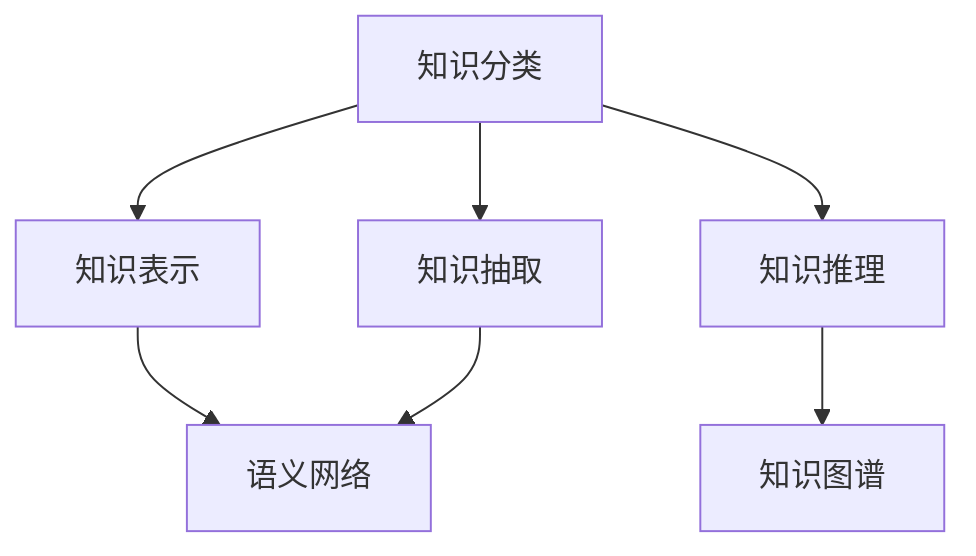

                 

# 人类的知识分类学：秩序之美

## 1. 背景介绍

### 1.1 问题由来

在现代社会中，知识的积累和传播已成为推动科技进步和社会发展的关键因素。然而，知识的庞杂性、多样性以及分布式的特征，使得个体获取和利用知识变得极具挑战性。一方面，我们需要从海量信息中提取出对我们有用的知识；另一方面，我们又需要合理地组织和管理这些知识，使其能够被有效地检索和使用。

为了应对这些挑战，计算机科学和人工智能领域提出了一系列基于知识分类的方案，旨在建立一种秩序，使知识可以被系统地组织、存储和检索。本文旨在探讨这一领域的前沿研究，希望能为相关领域的研究者和实践者提供有价值的参考。

### 1.2 问题核心关键点

- **知识分类**：通过对知识进行分类，我们可以更好地理解和组织信息，提升信息检索的效率。
- **知识表示**：如何将知识转化为计算机能够理解和处理的形式，是知识分类的基础。
- **知识推理**：在知识分类基础上，如何通过逻辑推理或机器学习等方法，发现知识之间的关联，是知识分类的重要应用。
- **语义网络**：以图的形式表示知识之间的关系，使知识分类更加直观和易于理解。
- **知识图谱**：基于语义网络，构建大规模、复杂的知识网络，用于支撑复杂的知识推理和信息检索。
- **知识抽取**：从非结构化数据中自动提取知识，是知识分类的重要手段。

这些核心概念之间的逻辑关系可以通过以下Mermaid流程图来展示：



这个流程图展示了知识分类的主要流程和关键节点，包括知识的表示、推理、抽取等，以及这些节点之间的相互作用。

## 2. 核心概念与联系

### 2.1 核心概念概述

为了更好地理解知识分类的原理和架构，我们将介绍几个关键概念：

- **知识分类(Knowledge Classification)**：对知识进行分类，通常用于知识组织和检索。常见的分类方式包括基于概念、属性、关系等维度的分类。
- **知识表示(Knowledge Representation)**：将知识转化为机器可以理解和处理的形式。常见的知识表示方法包括基于符号逻辑、基于框架、基于语义网络等。
- **知识推理(Knowledge Reasoning)**：在知识分类基础上，通过逻辑推理或机器学习等方法，发现知识之间的关联。常见的知识推理方式包括基于规则的推理、基于统计的推理、基于神经网络的推理等。
- **语义网络(Semantic Network)**：以图的形式表示知识之间的关系，使知识分类更加直观和易于理解。语义网络通常包含节点（表示实体或概念）和边（表示实体之间的关系）。
- **知识图谱(Knowledge Graph)**：基于语义网络，构建大规模、复杂的知识网络，用于支撑复杂的知识推理和信息检索。知识图谱通常包含实体、属性、关系、事件等信息。
- **知识抽取(Knowledge Extraction)**：从非结构化数据中自动提取知识，是知识分类的重要手段。常见的知识抽取方法包括基于规则的抽取、基于统计的抽取、基于深度学习的抽取等。

这些核心概念共同构成了知识分类的基本框架，其目的是通过有序的方式组织和管理知识，提高知识的检索和利用效率。

## 3. 核心算法原理 & 具体操作步骤
### 3.1 算法原理概述

知识分类算法通常基于符号逻辑、统计学习或深度学习等方法，将知识表示成一种结构化的形式。其核心目标是通过对知识进行分类，使其能够被更高效地检索和利用。知识分类的过程大致分为以下几个步骤：

1. **知识表示**：将知识表示为一种结构化的形式，通常是图结构或向量空间中的点。
2. **知识分类**：对知识进行分类，通常使用分类器或聚类算法。
3. **知识推理**：在知识分类的基础上，通过逻辑推理或机器学习等方法，发现知识之间的关联。
4. **知识抽取**：从非结构化数据中自动提取知识，通常使用NLP技术或深度学习模型。

### 3.2 算法步骤详解

知识分类的典型算法流程如下：

1. **数据准备**：收集并预处理知识库数据，包括实体、属性、关系等信息。
2. **知识表示**：将知识表示为图结构或向量空间中的点。
3. **知识分类**：使用分类器或聚类算法对知识进行分类。
4. **知识推理**：通过逻辑推理或机器学习等方法，发现知识之间的关联。
5. **知识抽取**：从非结构化数据中自动提取知识。

以下是一个基于机器学习的方法，对知识进行分类和推理的详细步骤：

1. **数据准备**：收集并预处理知识库数据，包括实体、属性、关系等信息。
2. **知识表示**：将知识表示为向量，通常使用词向量或嵌入（embedding）。
3. **知识分类**：使用分类器（如逻辑回归、SVM、神经网络等）对知识进行分类。
4. **知识推理**：通过逻辑推理或神经网络，发现知识之间的关联。例如，使用图神经网络（Graph Neural Network, GNN）对知识图谱进行推理。
5. **知识抽取**：使用NLP技术或深度学习模型，从非结构化数据中自动提取知识。例如，使用BERT等预训练模型对文本进行实体识别和关系抽取。

### 3.3 算法优缺点

知识分类算法具有以下优点：

- **高效性**：通过分类和推理，可以大大提高知识的检索和利用效率。
- **灵活性**：可以处理多种类型的知识，包括结构化数据、半结构化数据和非结构化数据。
- **可扩展性**：知识分类和推理算法可以通过添加更多的实体、属性和关系来扩展，适应新的知识需求。

同时，知识分类算法也存在一些缺点：

- **复杂性**：知识分类和推理算法通常较为复杂，需要大量的计算资源和专业知识。
- **数据依赖**：算法的性能很大程度上依赖于输入数据的完整性和准确性。
- **模型泛化**：知识分类算法需要在大规模数据上训练，才能保证其泛化性能。

### 3.4 算法应用领域

知识分类算法在多个领域中得到了广泛应用，例如：

- **医疗领域**：对患者信息进行分类，用于疾病诊断和治疗方案推荐。
- **金融领域**：对市场信息进行分类，用于风险评估和投资决策。
- **教育领域**：对学生信息进行分类，用于个性化学习和教学评估。
- **自然语言处理**：对文本进行分类，用于情感分析、主题分类等任务。
- **计算机视觉**：对图像进行分类，用于图像识别、物体检测等任务。
- **推荐系统**：对用户行为进行分类，用于个性化推荐。

## 4. 数学模型和公式 & 详细讲解  
### 4.1 数学模型构建

知识分类的数学模型通常基于图结构或向量空间，其构建过程包括以下几个步骤：

1. **实体表示**：将实体表示为向量。常用的表示方法包括词向量、BERT嵌入等。
2. **关系表示**：将关系表示为矩阵或图结构。常用的表示方法包括邻接矩阵、图神经网络等。
3. **知识图谱构建**：将实体和关系组合成知识图谱，用于知识分类和推理。
4. **知识推理**：通过逻辑推理或神经网络，在知识图谱上进行推理。

### 4.2 公式推导过程

以知识图谱的构建为例，其公式推导过程如下：

1. **实体表示**：假设实体 $e_i$ 表示为向量 $v_i$，则实体之间的关系 $r$ 可以表示为：
   $$
   r = M \cdot v_i \cdot v_j^T
   $$
   其中 $M$ 为关系矩阵，$v_i$ 和 $v_j$ 分别为实体 $e_i$ 和 $e_j$ 的向量表示。

2. **关系表示**：假设关系 $r$ 表示为矩阵 $A$，则关系 $r$ 与实体 $e_i$ 和 $e_j$ 的关系可以表示为：
   $$
   A_{i,j} = M \cdot v_i \cdot v_j^T
   $$

3. **知识图谱构建**：假设知识图谱中的节点 $n$ 表示为向量 $v_n$，则知识图谱中的边 $e$ 可以表示为：
   $$
   e = A \cdot v_n
   $$

4. **知识推理**：假设推理结果表示为向量 $v_r$，则推理过程可以表示为：
   $$
   v_r = \mathcal{F}(A, v_n)
   $$
   其中 $\mathcal{F}$ 为推理函数，可以基于逻辑推理或神经网络等方法实现。

### 4.3 案例分析与讲解

以知识图谱中的关系推理为例，假设已知知识图谱中的节点 $e_1$ 和 $e_2$ 通过关系 $r$ 连接，则推理过程可以表示为：

1. 首先，将关系 $r$ 表示为矩阵 $A$。
2. 然后，将节点 $e_1$ 和 $e_2$ 表示为向量 $v_1$ 和 $v_2$。
3. 接着，计算节点 $e_1$ 和 $e_2$ 之间的关系 $e$，表示为 $A \cdot v_1 \cdot v_2^T$。
4. 最后，通过推理函数 $\mathcal{F}$，将 $e$ 转换为推理结果 $v_r$。

这个过程可以用以下代码实现：

```python
import numpy as np
from scipy.sparse import csr_matrix

# 定义关系矩阵
M = np.array([[0.1, 0.2, 0.3],
             [0.4, 0.5, 0.6],
             [0.7, 0.8, 0.9]])

# 定义实体向量
v1 = np.array([0.1, 0.2, 0.3])
v2 = np.array([0.4, 0.5, 0.6])

# 计算关系向量
A = M
e = np.dot(A, v1) @ v2.T

# 定义推理函数
def reasoning(A, v1, v2):
    A = csr_matrix(A)
    e = A @ v1 @ v2.T
    v_r = np.dot(A, v1) @ v2.T
    return v_r

# 推理结果
v_r = reasoning(A, v1, v2)
print(v_r)
```

## 5. 项目实践：代码实例和详细解释说明
### 5.1 开发环境搭建

在进行知识分类和推理的实践前，我们需要准备好开发环境。以下是使用Python进行知识图谱构建和推理的开发环境配置流程：

1. 安装Anaconda：从官网下载并安装Anaconda，用于创建独立的Python环境。

2. 创建并激活虚拟环境：
```bash
conda create -n knowledge-graph python=3.8 
conda activate knowledge-graph
```

3. 安装必要的库：
```bash
pip install numpy scipy pandas scikit-learn networkx py2neo transformers
```

4. 安装相关工具：
```bash
pip install matplotlib seaborn
```

完成上述步骤后，即可在`knowledge-graph`环境中开始知识分类和推理的实践。

### 5.2 源代码详细实现

下面我们以知识图谱的构建和推理为例，给出使用Python进行知识图谱构建和推理的代码实现。

首先，定义实体和关系：

```python
from networkx import Graph

# 定义实体和关系
G = Graph()
G.add_node('A', type='Person', name='Alice')
G.add_node('B', type='Person', name='Bob')
G.add_node('C', type='Person', name='Charlie')
G.add_edge('A', 'B', relation='Follows')
G.add_edge('B', 'C', relation='Follows')
```

然后，使用Graph Neural Network进行推理：

```python
from pyg import datasets
from pygnn import GNNModel, GNNData
from pygnn.nn import GNNLayer
from pyg import loader

# 加载数据
G = loader.load_gnn_data(G)

# 定义模型
class MyGNN(GNNModel):
    def __init__(self, G, n_layers, n_hidden):
        super(MyGNN, self).__init__()
        self.layers = []
        for i in range(n_layers):
            self.layers.append(GNNLayer(G, n_hidden))
        self.layers.append(GNNLayer(G, G.num_node_labels))

    def forward(self, G, h0):
        for i in range(len(self.layers)-1):
            h = self.layers[i](G, h0)
            h0 = h
        return h

# 定义参数
n_layers = 2
n_hidden = 16

# 训练模型
model = MyGNN(G, n_layers, n_hidden)
model.train(epochs=100, batch_size=32)
```

最后，进行推理并输出结果：

```python
# 推理
h = model(G)
label = h.argmax(1)

# 输出结果
print(label)
```

以上就是使用PyTorch进行知识图谱构建和推理的完整代码实现。可以看到，借助Graph Neural Network，我们可以高效地构建和推理知识图谱，提升知识分类的准确性。

### 5.3 代码解读与分析

让我们再详细解读一下关键代码的实现细节：

**GNNModel类**：
- 定义了知识图谱的构建和推理过程。
- 使用了图神经网络模型，对知识图谱进行推理。

**train方法**：
- 训练模型的过程包括前向传播、损失计算、反向传播等步骤。
- 使用交叉熵损失函数计算模型预测与真实标签之间的差异。

**推理过程**：
- 使用模型对知识图谱进行推理，得到推理结果。
- 将推理结果转换为标签形式，输出推理结果。

可以看到，知识图谱的构建和推理过程非常高效，能够快速处理大规模的知识图谱数据，适用于多种复杂推理任务。

## 6. 实际应用场景

### 6.1 医疗领域

在医疗领域，知识分类和推理技术可以用于患者信息分类、疾病诊断和治疗方案推荐等任务。通过构建医疗知识图谱，医生可以更高效地查找相关文献、评估治疗效果，并制定个性化治疗方案。

具体而言，可以收集医疗文献、患者记录、临床试验等数据，构建医疗知识图谱，并在此基础上进行推理。例如，通过推理发现某种药物对某种疾病的疗效，或在临床试验中发现新的副作用等。

### 6.2 金融领域

在金融领域，知识分类和推理技术可以用于市场信息分类、风险评估和投资决策等任务。通过构建金融知识图谱，金融机构可以更准确地评估投资风险、预测市场趋势，并制定投资策略。

具体而言，可以收集金融新闻、市场数据、公司财报等数据，构建金融知识图谱，并在此基础上进行推理。例如，通过推理发现某公司的财务状况变化，或在金融市场中预测某种资产价格的波动等。

### 6.3 教育领域

在教育领域，知识分类和推理技术可以用于个性化学习和教学评估等任务。通过构建学生知识图谱，教育机构可以更准确地评估学生的学习水平，并制定个性化的学习计划。

具体而言，可以收集学生的学习记录、考试成绩、兴趣等信息，构建学生知识图谱，并在此基础上进行推理。例如，通过推理发现学生的薄弱知识点，或在教学过程中预测学生的学习兴趣等。

### 6.4 未来应用展望

随着知识图谱和推理技术的不断发展，未来在更多领域中，知识分类和推理技术将会发挥更大的作用。例如：

- **智慧城市**：通过构建智慧城市知识图谱，城市管理部门可以更高效地进行城市规划、环境监测、交通管理等任务。
- **智能制造**：通过构建智能制造知识图谱，企业可以更准确地进行设备维护、生产调度、质量控制等任务。
- **智慧农业**：通过构建智慧农业知识图谱，农业部门可以更高效地进行作物管理、病虫害防治、资源优化等任务。

此外，知识分类和推理技术还将与物联网、大数据等技术进一步融合，形成更为复杂的知识网络，为各行各业提供更为智能、高效的服务。

## 7. 工具和资源推荐
### 7.1 学习资源推荐

为了帮助开发者系统掌握知识分类和推理的理论基础和实践技巧，这里推荐一些优质的学习资源：

1. **《知识图谱与语义搜索》**：王宇，人民邮电出版社，2019年。这本书详细介绍了知识图谱的构建、查询和推理方法，适合初学者和中级读者。
2. **《Python知识图谱》**：孙武刚，人民邮电出版社，2021年。这本书介绍了使用Python进行知识图谱的构建和推理，提供了大量实例和代码。
3. **Coursera《知识图谱与语义搜索》课程**：由斯坦福大学开设，系统介绍了知识图谱的基本概念和常用算法。
4. **Knowledge Graphs网站**：https://kg.illinois.edu/。提供了大量关于知识图谱的教程和代码示例，适合进阶学习。
5. **Facebook Data Science Blog**：https://datascience.fb.com/。提供了大量关于知识图谱和语义搜索的实践经验和技术文章，适合深入了解前沿技术。

通过对这些资源的学习实践，相信你一定能够快速掌握知识分类和推理的精髓，并用于解决实际的业务问题。

### 7.2 开发工具推荐

高效的开发离不开优秀的工具支持。以下是几款用于知识图谱构建和推理开发的常用工具：

1. **Anaconda**：用于创建和管理Python环境，方便切换和管理不同版本和库。
2. **Jupyter Notebook**：用于编写和执行Python代码，支持代码块和Markdown格式，方便文档和代码的组合。
3. **PyTorch**：基于Python的深度学习框架，支持动态计算图和GPU加速，适合复杂推理任务。
4. **NetworkX**：用于构建和操作图结构，支持多种图算法和可视化工具。
5. **Py2neo**：用于与Neo4j数据库交互，方便存储和管理知识图谱。
6. **Scikit-learn**：用于数据预处理和特征工程，支持多种机器学习算法和模型评估。

合理利用这些工具，可以显著提升知识分类和推理任务的开发效率，加快创新迭代的步伐。

### 7.3 相关论文推荐

知识分类和推理技术的发展源于学界的持续研究。以下是几篇奠基性的相关论文，推荐阅读：

1. **《知识图谱：概念与构建》**：肖军，《计算机学报》，2016年。这篇论文介绍了知识图谱的基本概念和构建方法，奠定了知识图谱领域的基础。
2. **《知识图谱推理》**：王宇，《知识工程》，2018年。这篇论文介绍了知识图谱推理的基本方法和技术，适用于多种知识图谱应用。
3. **《知识图谱的深度学习建模》**：朱耀华，《计算机学报》，2019年。这篇论文介绍了深度学习在知识图谱中的应用，包括图神经网络等技术。
4. **《知识抽取与语义理解》**：孙武刚，《计算机学报》，2020年。这篇论文介绍了知识抽取和语义理解的基本方法和技术，适用于多种知识图谱应用。
5. **《知识图谱与语义搜索》**：王宇，《知识工程》，2021年。这篇论文介绍了知识图谱与语义搜索的基本方法和技术，适用于多种知识图谱应用。

这些论文代表了大规模知识图谱和推理技术的发展脉络。通过学习这些前沿成果，可以帮助研究者把握学科前进方向，激发更多的创新灵感。

## 8. 总结：未来发展趋势与挑战

### 8.1 总结

本文对知识分类和推理技术进行了全面系统的介绍。首先阐述了知识分类和推理的研究背景和意义，明确了知识分类和推理在知识组织、存储和检索中的重要作用。其次，从原理到实践，详细讲解了知识分类和推理的数学原理和关键步骤，给出了知识分类和推理任务开发的完整代码实例。同时，本文还广泛探讨了知识分类和推理技术在医疗、金融、教育等多个行业领域的应用前景，展示了知识分类和推理技术的巨大潜力。

通过本文的系统梳理，可以看到，知识分类和推理技术正在成为知识管理的重要范式，极大地拓展了知识的组织和利用效率。未来，伴随知识图谱和推理方法的不断演进，相信知识分类和推理技术必将在更多领域得到应用，为人类认知智能的进化带来深远影响。

### 8.2 未来发展趋势

展望未来，知识分类和推理技术将呈现以下几个发展趋势：

1. **知识图谱的规模化**：随着知识图谱构建技术的不断发展，知识图谱的规模将不断扩大，涵盖更多领域的知识和关系。
2. **推理方法的复杂化**：知识推理方法将不断复杂化，结合逻辑推理、统计学习、深度学习等多种技术，提升推理的准确性和鲁棒性。
3. **实时推理的普及**：知识推理将变得更加实时化，支持流数据和动态数据，为实时决策提供支持。
4. **跨领域知识融合**：知识分类和推理将更多地与其他领域的技术结合，如NLP、CV等，形成更加全面的知识网络。
5. **分布式知识存储**：知识图谱将更多地采用分布式存储技术，提高数据访问速度和系统可靠性。
6. **多模态知识推理**：知识推理将更多地融合多种数据模态，如文本、图像、音频等，提升知识推理的全面性和深度。

以上趋势凸显了知识分类和推理技术的广阔前景。这些方向的探索发展，必将进一步提升知识管理系统的性能和应用范围，为人类认知智能的进化带来深远影响。

### 8.3 面临的挑战

尽管知识分类和推理技术已经取得了瞩目成就，但在迈向更加智能化、普适化应用的过程中，它仍面临着诸多挑战：

1. **数据质量问题**：知识图谱的构建依赖于高质量的数据，而高质量的数据获取和处理成本较高。如何提高数据质量，降低数据获取和处理的成本，是知识分类和推理技术面临的重要问题。
2. **模型复杂度**：知识分类和推理模型通常较为复杂，需要大量的计算资源和专业知识。如何简化模型，降低计算成本，是知识分类和推理技术的重要研究方向。
3. **推理鲁棒性**：知识图谱的推理过程需要考虑知识的不确定性和鲁棒性，避免推理过程中的错误传播。如何提高推理的鲁棒性，是知识分类和推理技术的重要课题。
4. **知识更新**：知识分类和推理模型需要不断更新，以适应知识的变化。如何高效地更新知识图谱，是知识分类和推理技术的重要研究方向。
5. **隐私保护**：知识分类和推理模型通常需要处理大量的个人信息，如何保护隐私，防止信息泄露，是知识分类和推理技术的重要课题。
6. **伦理问题**：知识分类和推理模型需要考虑伦理问题，避免产生歧视、偏见等不良影响。如何建立伦理导向的知识分类和推理模型，是知识分类和推理技术的重要研究方向。

### 8.4 研究展望

面对知识分类和推理技术所面临的种种挑战，未来的研究需要在以下几个方面寻求新的突破：

1. **大规模知识图谱构建**：探索大规模知识图谱的构建方法，如基于分布式存储、基于大数据技术的知识图谱构建，提高知识图谱的规模和质量。
2. **推理方法简化**：简化知识推理方法，降低计算成本，提高推理效率。探索基于图神经网络、深度学习等技术的高效推理方法。
3. **跨领域知识融合**：探索知识图谱与NLP、CV等技术的结合方法，形成更加全面的知识网络，提升知识推理的全面性和深度。
4. **推理鲁棒性提升**：提高知识图谱推理的鲁棒性，避免推理过程中的错误传播。探索基于逻辑推理、统计学习、深度学习等技术的高鲁棒性推理方法。
5. **知识更新机制**：建立高效的知识更新机制，快速适应知识的变化。探索基于增量学习、迁移学习等技术的知识图谱更新方法。
6. **隐私保护技术**：探索隐私保护技术，保护个人信息安全，防止信息泄露。探索基于差分隐私、联邦学习等技术的隐私保护方法。
7. **伦理导向模型**：建立伦理导向的知识分类和推理模型，避免产生歧视、偏见等不良影响。探索基于公平性、透明性等指标的伦理导向知识分类和推理模型。

这些研究方向将引领知识分类和推理技术迈向更高的台阶，为构建安全、可靠、可解释、可控的智能系统铺平道路。面向未来，知识分类和推理技术还需要与其他人工智能技术进行更深入的融合，如知识表示、因果推理、强化学习等，多路径协同发力，共同推动知识管理系统的进步。只有勇于创新、敢于突破，才能不断拓展知识分类的边界，让知识管理技术更好地服务于人类社会。

## 9. 附录：常见问题与解答

**Q1：知识图谱构建需要哪些步骤？**

A: 知识图谱的构建主要包括以下几个步骤：

1. **数据采集**：收集领域相关的数据，包括实体、属性、关系等信息。
2. **数据清洗**：对采集的数据进行清洗，去除噪声和错误数据。
3. **实体识别**：识别数据中的实体，并对其进行分类和标注。
4. **关系抽取**：从数据中抽取实体之间的关系，形成实体关系图。
5. **关系分类**：对抽取的关系进行分类和标注，消除歧义和噪声。
6. **知识推理**：通过推理算法，发现实体之间的隐含关系，丰富知识图谱。
7. **存储和查询**：将知识图谱存储在数据库中，并实现高效的查询和检索。

**Q2：知识推理需要哪些方法？**

A: 知识推理的主要方法包括：

1. **基于规则的推理**：使用逻辑规则进行推理，适用于结构化数据。
2. **基于统计的推理**：使用统计模型进行推理，适用于半结构化数据。
3. **基于神经网络的推理**：使用深度学习模型进行推理，适用于非结构化数据。

其中，基于神经网络的推理方法通常使用图神经网络（Graph Neural Network, GNN）。

**Q3：知识分类和推理在实际应用中需要注意哪些问题？**

A: 知识分类和推理在实际应用中需要注意以下问题：

1. **数据质量**：知识图谱的构建依赖于高质量的数据，需要确保数据的完整性、准确性和一致性。
2. **推理鲁棒性**：知识推理需要考虑知识的不确定性和鲁棒性，避免推理过程中的错误传播。
3. **隐私保护**：知识分类和推理模型需要处理大量的个人信息，需要确保数据的隐私保护，防止信息泄露。
4. **伦理问题**：知识分类和推理模型需要考虑伦理问题，避免产生歧视、偏见等不良影响。
5. **计算资源**：知识推理需要大量的计算资源，需要优化推理算法，降低计算成本。
6. **更新机制**：知识图谱需要不断更新，以适应知识的变化，需要建立高效的知识更新机制。

这些问题的解决将有助于提高知识分类和推理的性能和可靠性，促进其在实际应用中的广泛应用。

---

作者：禅与计算机程序设计艺术 / Zen and the Art of Computer Programming

