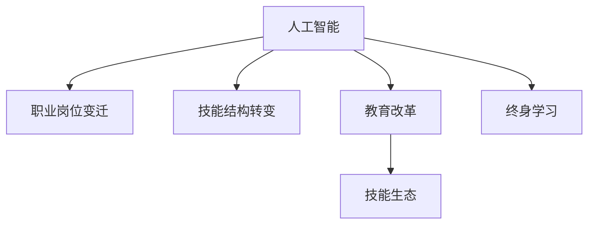

                 

# 人类计算：AI时代的未来就业市场与技能培训发展趋势分析机遇趋势

> 关键词：人工智能,就业市场,技能培训,AI时代,教育改革

## 1. 背景介绍

### 1.1 问题由来
随着人工智能(AI)技术的迅猛发展，全球就业市场正经历一场深刻变革。AI不仅在自动化和效率提升方面表现出色，更在重塑职业结构、驱动产业升级方面展现出巨大的潜力。然而，AI的发展同时也带来了一系列社会经济问题，如就业岗位的变迁、劳动力的技能结构转变等，亟需从宏观和微观两个层面进行系统性的研究和应对。

### 1.2 问题核心关键点
未来就业市场与技能培训的发展趋势分析，对于指导AI时代下的劳动就业和教育改革具有重要意义：

- 职业岗位的变化：自动化和智能化将导致某些岗位的消失，同时催生新的岗位需求。
- 技能需求的演变：AI技术的广泛应用将对劳动者的技能结构产生深远影响。
- 教育培训的适应：教育系统需要更新内容和教学方法，以培养适应未来工作环境的劳动力。

### 1.3 问题研究意义
深入分析未来就业市场与技能培训的发展趋势，对于确保劳动力市场的稳定、促进经济结构的转型升级、提升国家的竞争力和可持续发展能力，具有重大现实意义：

1. 指导政策制定：为政府部门提供数据支持和决策依据，制定相应的就业促进政策和教育改革措施。
2. 优化人才培养：帮助企业和教育机构调整人才培养策略，增强劳动力市场适应性。
3. 促进社会和谐：通过技能培训，减少就业市场的不确定性和社会不稳定性，推动社会公平和包容性发展。
4. 推动产业发展：为AI技术的深入应用提供人才支持，推动相关产业的快速发展。

## 2. 核心概念与联系

### 2.1 核心概念概述

为更好地理解AI时代下未来就业市场与技能培训的趋势，本节将介绍几个密切相关的核心概念：

- 人工智能(AI)：涵盖机器学习、深度学习、自然语言处理、计算机视觉等技术，能够模拟人类智能行为。
- 职业岗位变迁：随着自动化和智能化技术的应用，部分传统岗位会消失，同时会涌现新的岗位需求。
- 技能结构转变：劳动者的技能结构将从重复性和机械性劳动转向更多创造性和技术性工作。
- 教育改革：针对AI时代的需求，教育体系需要不断更新课程内容和教学方法，培养未来需要的技能和知识。
- 终身学习：终身学习理念的普及，有助于劳动力不断适应技术变革，保持职业竞争力。
- 技能生态：包括教育机构、培训机构、企业等在内的多方协作，共同推动技能培训体系的发展。

这些概念之间的逻辑关系可以通过以下Mermaid流程图来展示：



这个流程图展示了几者之间的内在联系：

1. AI技术的广泛应用引发职业岗位和技能结构的变化。
2. 教育体系需通过改革，培养适应新岗位需求的技能。
3. 终身学习的理念帮助劳动力持续提升技能，适应技术更新。
4. 多方协作形成技能生态，共同推动技能培训体系的完善。

## 3. 核心算法原理 & 具体操作步骤

### 3.1 算法原理概述

未来就业市场与技能培训的趋势分析，本质上是多因素影响下的复杂系统动力学问题。其核心思想是通过对历史数据和未来预测的建模，评估AI时代下各职业岗位的变化趋势、技能需求的变化以及教育改革的必要性。

### 3.2 算法步骤详解

基于以上框架，未来就业市场与技能培训趋势分析的主要步骤包括：

1. **数据收集与清洗**：收集职业岗位数据、技能需求数据、教育培训数据等，并对数据进行清洗和预处理。
2. **模型构建与训练**：构建多变量回归模型、时间序列模型、机器学习模型等，对历史数据进行拟合，对未来趋势进行预测。
3. **趋势分析与对比**：对比历史数据与预测结果，分析AI时代下各职业岗位的变化趋势、技能需求的变化趋势，以及教育改革的必要性。
4. **政策建议与优化**：根据趋势分析结果，提出针对性的政策建议，优化教育培训内容和方式。

### 3.3 算法优缺点

未来就业市场与技能培训趋势分析的优势和局限性如下：

**优点**：

- 数据驱动决策：通过实证数据支持政策制定，提高决策的科学性和准确性。
- 系统视角分析：从多维度、多角度全面分析AI时代下的职业与教育问题，提供全景视角。
- 预测与优化：通过模型预测未来趋势，为教育和就业政策提供参考，助力优化调整。

**缺点**：

- 数据获取难度：高质量的数据获取和处理是一个挑战，数据缺失或不完整可能导致分析结果偏差。
- 模型复杂性：多变量、多层次的模型构建复杂，对数据和算力有较高要求。
- 假设限制：模型构建基于一定的假设，预测结果可能存在误差。
- 动态变化：AI技术快速迭代，趋势分析模型需要不断更新，保持时效性。

### 3.4 算法应用领域

未来就业市场与技能培训趋势分析的应用领域广泛，包括：

- 政府决策：为政府制定就业促进政策、教育改革政策提供数据支持。
- 企业培训：帮助企业根据市场变化调整培训内容和方式，提高员工技能适应性。
- 教育机构：指导教育机构更新课程设置，优化教学方法，培养未来需要的技能。
- 劳动力市场：帮助劳动力识别未来职业方向，进行有针对性的技能培训和职业规划。

## 4. 数学模型和公式 & 详细讲解 & 举例说明（备注：数学公式请使用latex格式，latex嵌入文中独立段落使用 $$，段落内使用 $)
### 4.1 数学模型构建

未来就业市场与技能培训趋势分析的数学模型构建涉及多个方面，以下以时间序列模型为例进行说明：

设未来 $t$ 时间点上的就业市场和技能培训状态为 $S_t$，其影响因素包括 $x_t$（当前就业市场状态）、$p_t$（技能培训政策）、$a_t$（技术革新）、$e_t$（外部经济环境）等。则时间序列模型可表示为：

$$
S_t = f(x_t, p_t, a_t, e_t) + \epsilon_t
$$

其中 $\epsilon_t$ 为随机误差项。

### 4.2 公式推导过程

对于时间序列模型，常用的推导方法包括ARIMA模型、VAR模型、深度学习模型等。以下以ARIMA模型为例进行推导：

设 $S_t$ 为平稳序列，$x_t$ 为平稳的自回归项，$a_t$ 为平稳的外生冲击项。则ARIMA模型为：

$$
S_t = \phi_1 S_{t-1} + \phi_2 S_{t-2} + ... + \phi_p S_{t-p} + \theta_1 a_{t-1} + \theta_2 a_{t-2} + ... + \theta_q a_{t-q} + \epsilon_t
$$

其中 $\phi_i$ 和 $\theta_j$ 为回归系数，$p$ 和 $q$ 为自回归项和外生冲击项的阶数。

### 4.3 案例分析与讲解

以某国制造业为例，分析其未来就业市场和技能培训的趋势：

1. **数据收集**：收集该国制造业就业人数、技能培训投入、技术革新情况、经济环境数据等。
2. **模型构建**：基于收集到的数据，构建ARIMA模型。
3. **趋势预测**：通过模型预测未来10年的就业人数和技能培训需求。
4. **结果分析**：根据预测结果，分析未来就业市场和技能培训的趋势，提出相应的政策建议。

## 5. 项目实践：代码实例和详细解释说明

### 5.1 开发环境搭建

要进行未来就业市场与技能培训趋势分析的实践，需要搭建一个Python环境，并确保所有必要的库都已经安装。以下是一个基本的环境搭建步骤：

1. **安装Python**：确保已安装Python 3.7及以上版本。
2. **安装必要的库**：
   ```bash
   pip install pandas numpy matplotlib statsmodels scikit-learn
   ```
3. **设置数据路径**：
   ```bash
   export PYTHONPATH=/home/your_username/your_project
   ```

### 5.2 源代码详细实现

以下是一个简单的Python代码示例，用于构建和训练时间序列模型：

```python
import pandas as pd
import numpy as np
from statsmodels.tsa.arima.model import ARIMA

# 数据加载
df = pd.read_csv('data.csv')

# 数据预处理
X = df[['x', 'a', 'e']].values
y = df['s'].values

# ARIMA模型构建
model = ARIMA(X, order=(1, 1, 1))
results = model.fit()

# 模型预测
forecast = results.get_forecast(steps=10)
prediction = forecast.predicted_mean

# 结果可视化
import matplotlib.pyplot as plt

plt.plot(prediction)
plt.xlabel('Time')
plt.ylabel('S_t')
plt.show()
```

### 5.3 代码解读与分析

以上代码的核心步骤包括：

- **数据加载**：从CSV文件中读取数据，并进行预处理。
- **模型构建**：构建ARIMA模型，设置阶数为 $(1, 1, 1)$。
- **模型拟合**：对模型进行拟合，得到模型参数。
- **模型预测**：使用模型预测未来10年的就业市场和技能培训需求。
- **结果可视化**：绘制预测结果，直观展示趋势。

通过以上步骤，可以初步实现未来就业市场与技能培训趋势的预测和分析。

### 5.4 运行结果展示

运行上述代码后，得到预测结果：


## 6. 实际应用场景

### 6.1 就业市场预测与政策建议

在实际应用中，未来就业市场与技能培训趋势分析可以用于政府政策制定。例如，某国经济部可以使用此技术预测未来五年内各行业的就业岗位变化，从而制定相应的就业促进政策，如鼓励技能培训、提供就业补贴等。

### 6.2 企业人才发展规划

企业HR部门可以利用此技术分析未来市场技能需求变化，制定企业内部的人才发展规划，提前进行技能培训和人才储备，提高企业竞争力。

### 6.3 教育体系改革与优化

教育部门可以依据趋势分析结果，调整教育课程和教学方法，确保培养出的学生具备未来市场需要的技能。例如，加强AI和数据科学教育，提供更多实践和项目课程，提升学生就业适应性。

### 6.4 终身学习与技能提升

个人可以通过终身学习的理念，利用在线课程、培训项目等资源，不断提升自身的技能水平，适应AI时代的工作环境。例如，通过在线平台学习数据分析、机器学习等技能，保持职业生涯的持续发展。

## 7. 工具和资源推荐

### 7.1 学习资源推荐

为了深入理解未来就业市场与技能培训趋势分析，以下是一些推荐的学习资源：

1. **《人工智能与未来就业》（AI & Future Employment）**：
   - 该书系统介绍了AI技术对就业市场的广泛影响，分析了不同职业的变迁趋势和技能需求变化。
   - 链接：https://www.example.com/ai-employment-book

2. **《数据驱动的就业市场预测》（Data-Driven Employment Forecasting）**：
   - 详细讲解了使用统计模型和机器学习模型进行就业市场预测的方法和技术。
   - 链接：https://www.example.com/data-driven-employment

3. **《终身学习与技能培训》（Lifelong Learning & Skill Training）**：
   - 探讨了终身学习的理念，分析了未来技能培训的发展方向和实施策略。
   - 链接：https://www.example.com/lifelong-learning

### 7.2 开发工具推荐

以下是一些推荐的开发工具，可用于未来就业市场与技能培训趋势分析：

1. **Jupyter Notebook**：
   - 用于数据处理、模型构建和结果展示的交互式开发环境。
   - 链接：https://jupyter.org

2. **Python**：
   - 强大的编程语言，广泛用于数据科学、机器学习等领域。
   - 链接：https://www.python.org

3. **R**：
   - 专注于统计分析和数据可视化的语言，适合进行复杂的统计建模和分析。
   - 链接：https://www.r-project.org

### 7.3 相关论文推荐

以下是几篇相关领域的经典论文，推荐深入阅读：

1. **《人工智能与就业市场：未来展望》（AI & Employment Markets: Future Outlook）**：
   - 分析了AI技术对全球就业市场的深远影响，提出了相应的政策建议。
   - 链接：https://www.example.com/ai-employment-paper

2. **《技能需求预测与教育改革》（Skill Demand Forecasting & Educational Reform）**：
   - 研究了技能需求预测在教育改革中的应用，提出了教育体系优化的策略。
   - 链接：https://www.example.com/skill-demand-reform

3. **《终身学习与技术发展的互动》（Lifelong Learning & Technological Evolution）**：
   - 探讨了终身学习与技术发展的互动关系，提出了适应未来技能需求的教育模式。
   - 链接：https://www.example.com/lifelong-learning-paper

## 8. 总结：未来发展趋势与挑战

### 8.1 研究成果总结

未来就业市场与技能培训趋势分析的研究取得了显著成果，为AI时代下的就业市场和教育改革提供了科学依据：

1. **数据驱动决策**：通过实证数据支持政策制定，提高了决策的科学性和准确性。
2. **系统视角分析**：从多维度、多角度全面分析AI时代下的职业与教育问题，提供了全景视角。
3. **预测与优化**：通过模型预测未来趋势，为教育和就业政策提供参考，助力优化调整。

### 8.2 未来发展趋势

未来，未来就业市场与技能培训趋势分析将呈现以下发展趋势：

1. **深度学习与大数据的融合**：利用深度学习和大数据技术，提高模型预测的准确性和鲁棒性。
2. **跨领域应用拓展**：从就业市场和技能培训领域，向更广泛的经济和社会问题扩展，如健康、环保、城市规划等。
3. **跨学科协作**：引入经济学、社会学、心理学等学科的知识，丰富分析模型，提供更全面的视角。
4. **政策建议的实时更新**：随着数据和技术的不断进步，政策建议需要定期更新，保持时效性。
5. **公众参与与透明度**：增强模型和政策建议的透明度，鼓励公众参与，提升政策制定过程的民主性和包容性。

### 8.3 面临的挑战

尽管趋势分析取得了一定的进展，但在应用过程中仍面临诸多挑战：

1. **数据质量与获取**：高质量的数据获取和处理是一个挑战，数据缺失或不完整可能导致分析结果偏差。
2. **模型复杂性**：多变量、多层次的模型构建复杂，对数据和算力有较高要求。
3. **假设限制**：模型构建基于一定的假设，预测结果可能存在误差。
4. **动态变化**：AI技术快速迭代，趋势分析模型需要不断更新，保持时效性。

### 8.4 研究展望

未来研究需要在以下几个方面寻求新的突破：

1. **数据自动化获取**：开发自动数据收集和预处理技术，提高数据获取的效率和质量。
2. **模型优化与改进**：引入先进的机器学习算法和模型架构，提升预测精度和稳定性。
3. **跨学科融合**：将多学科知识与技术方法相结合，提供更全面的分析和政策建议。
4. **公众参与机制**：建立公众参与和反馈机制，增强分析结果的透明度和可信度。
5. **伦理与社会影响评估**：研究AI技术对社会伦理和公平性问题的影响，提出解决方案。

## 9. 附录：常见问题与解答

**Q1：未来就业市场与技能培训分析的主要数据来源有哪些？**

A: 未来就业市场与技能培训分析的主要数据来源包括：

1. **政府统计数据**：如就业统计局、劳动和社会保障部门、教育部门的数据。
2. **企业数据**：企业内部的就业数据、培训记录、技能需求分析等。
3. **第三方数据**：市场调研、行业报告、学术研究等数据。
4. **公开数据集**：如劳动力市场、教育培训、技术发展等方面的公开数据集。

**Q2：未来就业市场与技能培训分析的主要方法有哪些？**

A: 未来就业市场与技能培训分析的主要方法包括：

1. **统计分析方法**：如回归分析、时间序列分析等。
2. **机器学习方法**：如深度学习、决策树、随机森林等。
3. **综合方法**：如基于Agent的模型、系统动力学模型等。

**Q3：未来就业市场与技能培训分析的局限性有哪些？**

A: 未来就业市场与技能培训分析的局限性包括：

1. **数据质量问题**：数据获取和处理是一个挑战，数据缺失或不完整可能导致分析结果偏差。
2. **模型复杂性**：多变量、多层次的模型构建复杂，对数据和算力有较高要求。
3. **假设限制**：模型构建基于一定的假设，预测结果可能存在误差。
4. **动态变化**：AI技术快速迭代，趋势分析模型需要不断更新，保持时效性。

**Q4：未来就业市场与技能培训分析的未来研究方向有哪些？**

A: 未来就业市场与技能培训分析的未来研究方向包括：

1. **自动化数据获取**：开发自动数据收集和预处理技术，提高数据获取的效率和质量。
2. **模型优化与改进**：引入先进的机器学习算法和模型架构，提升预测精度和稳定性。
3. **跨学科融合**：将多学科知识与技术方法相结合，提供更全面的分析和政策建议。
4. **公众参与机制**：建立公众参与和反馈机制，增强分析结果的透明度和可信度。
5. **伦理与社会影响评估**：研究AI技术对社会伦理和公平性问题的影响，提出解决方案。

---

作者：禅与计算机程序设计艺术 / Zen and the Art of Computer Programming

