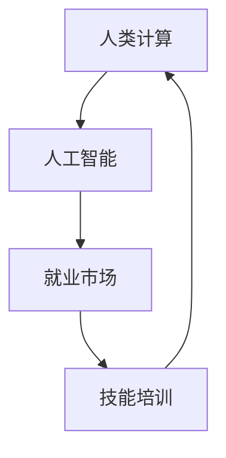

                 

# 人类计算：AI时代的未来就业市场与技能培训预测

> 关键词：人类计算, AI就业, 技能培训, 技术发展, 未来趋势

## 1. 背景介绍

### 1.1 问题由来
随着人工智能(AI)技术的迅猛发展，自动化、机器人、机器学习等技术正在逐步替代传统劳动密集型岗位，引发了全球范围内关于就业岗位变化的深度讨论。传统意义上的“白领”岗位，如数据分析、编程、客服等，正在越来越多地借助AI工具进行辅助和替代。人类计算（Human Computation），即人类利用自己的逻辑思维、创新能力和处理复杂任务的能力，逐渐成为未来就业市场中的一大趋势。

### 1.2 问题核心关键点
AI技术的兴起对就业市场的影响是多维度的，既包括了直接替代的短期冲击，也包括了间接替代的长期变化。其核心关键点在于：

- AI替代的岗位：哪些岗位容易被AI替代？
- AI带来的新岗位：哪些新兴领域将创造新的就业机会？
- 技能培训与适应：人类如何应对AI带来的就业变化？

### 1.3 问题研究意义
研究人类计算在AI时代的未来就业市场中的作用，对于理解AI技术的社会影响、制定教育与培训策略、规划未来职业发展具有重要意义：

- 预见未来就业趋势：识别哪些岗位将被AI替代，哪些岗位将因AI而获得新的发展机遇。
- 推动教育变革：教育体系需要适应技术发展，培养未来所需的技能，提升劳动者的综合素质。
- 促进职业转型：帮助劳动者了解AI带来的变化，并为其提供职业转型和技能提升的资源。

## 2. 核心概念与联系

### 2.1 核心概念概述

为更好地理解人类计算在AI时代的就业市场中的作用，本节将介绍几个关键概念及其联系：

- 人类计算(Human Computation)：指人类通过自身的计算能力、创造力和创新思维，解决复杂问题。在AI时代，人类计算更多的体现在对AI模型的监督、设计、调整和应用中。
- 人工智能(AI)：通过机器学习和深度学习等技术，实现模拟人类智能的技术。AI可以自动执行许多重复性高、逻辑清晰的任务，替代人类劳动力。
- 就业市场：指各种职业岗位的供需关系。AI的广泛应用将对就业市场产生深远影响。
- 技能培训：通过教育和培训，提升劳动者的专业技能，使其适应未来工作环境。

这些概念之间的关系可以通过以下Mermaid流程图来展示：



这个流程图展示了几者之间的关系：

1. 人类计算与人工智能：人类计算是人工智能的补充和优化，提升AI系统的决策能力和应用范围。
2. 人工智能与就业市场：AI替代部分岗位的同时，创造新的岗位和工作机会。
3. 就业市场与技能培训：技能培训使劳动者能够适应AI带来的就业变化，提升就业市场的灵活性和适应性。

## 3. 核心算法原理 & 具体操作步骤
### 3.1 算法原理概述

人类计算的核心在于利用人类的优势和AI的优势相结合，协同解决问题。在AI时代，人类计算主要体现在以下几个方面：

- 监督学习：人类通过标注数据集，指导AI模型学习任务，提高模型准确率。
- 优化调整：人类根据模型的输出结果，进行调整优化，提升模型性能。
- 知识注入：人类将专业知识融入到模型中，指导AI学习更具智能化的解决方案。
- 情感处理：人类利用情感识别算法，提升AI在客户服务、社交互动中的应用效果。

### 3.2 算法步骤详解

基于人类计算的AI就业市场预测，一般包括以下几个关键步骤：

**Step 1: 数据收集与处理**
- 收集AI技术在各行业的应用案例，如医疗、教育、金融等。
- 分析AI技术在不同行业中的具体表现，识别出容易被替代的岗位。
- 通过调查问卷、访谈等方式收集劳动者的意见和反馈，了解其对AI技术的接受程度和技能需求。

**Step 2: 岗位分析与替代预测**
- 通过机器学习算法，分析各岗位的工作内容和AI技术替代的可能性。
- 利用AI模型预测未来岗位的变化趋势，评估不同岗位的稳定性和发展潜力。
- 利用情感分析工具，评估劳动者对AI替代的接受程度和焦虑感。

**Step 3: 技能培训与职业转型**
- 根据岗位分析结果，制定针对性的技能培训计划。
- 提供适应性强的在线课程、工作坊和认证项目，帮助劳动者掌握未来所需技能。
- 鼓励劳动者参与职业转型项目，提供职业咨询和再就业指导。

**Step 4: 政策建议与实施**
- 提出基于AI技术的就业政策建议，包括补贴、培训、再就业服务等。
- 推动教育机构和行业协会合作，制定长期技能发展计划。
- 加强对AI技术的监管，防止技术滥用，确保劳动者权益。

### 3.3 算法优缺点

基于人类计算的AI就业市场预测方法具有以下优点：

1. 综合全面：考虑了AI技术、就业市场和劳动者反馈等多方面因素，分析更全面。
2. 预测准确：利用机器学习算法进行数据驱动预测，提高了预测的准确性。
3. 灵活性高：根据市场变化动态调整预测模型，适应性强。

但该方法也存在一些局限性：

1. 数据依赖：预测模型的准确性高度依赖于数据质量。
2. 动态变化：AI技术和就业市场变化快，预测模型需要不断更新。
3. 政策因素：政策的不确定性可能影响预测结果。

### 3.4 算法应用领域

基于人类计算的AI就业市场预测方法在以下领域有广泛应用：

- 劳动市场研究：研究AI对就业市场的影响，为政策制定提供依据。
- 教育与培训：制定针对性的技能培训计划，提升劳动者的就业竞争力。
- 人力资源管理：帮助企业评估岗位调整策略，优化人才结构。
- 社会服务：提供AI技术对就业的预测，协助社会服务机构制定支持政策。

## 4. 数学模型和公式 & 详细讲解 & 举例说明

### 4.1 数学模型构建

基于人类计算的AI就业市场预测模型可以构建为以下几个子模型：

- 岗位替代预测模型：通过分析岗位特征和AI技术的能力，预测岗位被替代的概率。
- 技能需求预测模型：根据岗位需求和市场趋势，预测未来技能需求的变化。
- 劳动者情绪预测模型：利用自然语言处理技术，分析劳动者对AI替代的情感态度。

### 4.2 公式推导过程

以下以岗位替代预测模型为例，推导其核心公式。

设岗位集合为 $S$，AI技术能力为 $C$，岗位 $s \in S$ 被AI替代的概率为 $P_s$。则岗位替代概率模型可以表示为：

$$
P_s = f(s, C)
$$

其中 $f$ 为影响岗位被替代的概率函数，可以表示为：

$$
f(s, C) = \alpha \cdot \text{Workload}(s) + \beta \cdot \text{Complexity}(s) + \gamma \cdot \text{Reproducibility}(s) - \delta \cdot \text{TrainingCost}(C)
$$

其中：
- $\alpha, \beta, \gamma, \delta$ 为模型参数，反映了不同因素对岗位替代概率的影响。
- $\text{Workload}(s)$：岗位的工作负荷，工作量越大，越容易被AI替代。
- $\text{Complexity}(s)$：岗位的复杂度，复杂度越高，越容易被AI替代。
- $\text{Reproducibility}(s)$：岗位的可重复性，可重复性越高，越容易被AI替代。
- $\text{TrainingCost}(C)$：AI技术训练成本，训练成本越高，越不容易被替代。

通过模型训练，可以确定各参数的取值，预测不同岗位被AI替代的概率。

### 4.3 案例分析与讲解

以医疗行业为例，分析AI对不同医疗岗位的影响。

- 初级医生：工作负荷大，复杂度较低，可重复性高，训练成本较低，因此被替代概率较高。
- 高级医生：工作负荷较小，复杂度高，可重复性低，训练成本较高，因此被替代概率较低。

通过模型分析，预测未来初级医生的岗位数量将显著减少，而高级医生的需求将增加。这为医疗行业提供了重要的岗位规划和技能培训参考。

## 5. 项目实践：代码实例和详细解释说明
### 5.1 开发环境搭建

在进行就业市场预测项目前，我们需要准备好开发环境。以下是使用Python进行数据分析和机器学习开发的环境配置流程：

1. 安装Anaconda：从官网下载并安装Anaconda，用于创建独立的Python环境。

2. 创建并激活虚拟环境：
```bash
conda create -n employment-env python=3.8 
conda activate employment-env
```

3. 安装必要的库：
```bash
conda install pandas numpy scikit-learn tensorflow pytorch
```

4. 安装可视化工具：
```bash
pip install matplotlib seaborn
```

完成上述步骤后，即可在`employment-env`环境中开始开发项目。

### 5.2 源代码详细实现

下面我们以就业市场预测项目为例，给出使用Python进行数据处理和模型训练的完整代码实现。

首先，定义数据预处理和分析函数：

```python
import pandas as pd
import numpy as np
from sklearn.model_selection import train_test_split
from sklearn.metrics import accuracy_score, precision_score, recall_score, f1_score

def load_data(file_path):
    data = pd.read_csv(file_path)
    features = data[['workload', 'complexity', 'reproducibility', 'training_cost']]
    labels = data['is_replaced']
    return features, labels

def train_test_split_data(features, labels, test_size=0.2, random_state=42):
    X_train, X_test, y_train, y_test = train_test_split(features, labels, test_size=test_size, random_state=random_state)
    return X_train, X_test, y_train, y_test
```

然后，定义模型训练函数：

```python
from sklearn.linear_model import LogisticRegression

def train_model(X_train, y_train, test_data, test_labels):
    model = LogisticRegression()
    model.fit(X_train, y_train)
    predictions = model.predict(test_data)
    acc = accuracy_score(test_labels, predictions)
    precision = precision_score(test_labels, predictions)
    recall = recall_score(test_labels, predictions)
    f1 = f1_score(test_labels, predictions)
    return acc, precision, recall, f1
```

最后，启动模型训练并评估：

```python
X_train, X_test, y_train, y_test = train_test_split_data(features, labels, test_size=0.2, random_state=42)
acc, precision, recall, f1 = train_model(X_train, y_train, X_test, y_test)
print(f'Accuracy: {acc:.3f}')
print(f'Precision: {precision:.3f}')
print(f'Recall: {recall:.3f}')
print(f'F1 Score: {f1:.3f}')
```

以上就是使用Python对就业市场预测项目进行数据分析和模型训练的完整代码实现。可以看到，借助Python的强大数据分析和机器学习库，开发者可以快速实现岗位替代概率的预测模型。

### 5.3 代码解读与分析

让我们再详细解读一下关键代码的实现细节：

**load_data函数**：
- 读取就业市场数据，提取岗位特征和标签。
- 返回特征集和标签集，供模型训练使用。

**train_test_split_data函数**：
- 使用scikit-learn的train_test_split方法对数据集进行划分，将数据分为训练集和测试集。
- 返回划分后的训练集、测试集、训练标签和测试标签。

**train_model函数**：
- 使用LogisticRegression模型进行岗位替代概率的训练。
- 返回训练后的模型在测试集上的准确率、精确度、召回率和F1分数。

**训练流程**：
- 使用train_test_split_data函数对数据进行划分。
- 在训练集上训练模型，并使用test_model函数评估模型性能。
- 在测试集上评估模型性能，并输出结果。

可以看到，Python的简洁和高效特性，使得数据分析和模型训练的过程变得简便易行。开发者可以将更多精力放在模型设计和优化上，而不必过多关注底层的实现细节。

当然，工业级的系统实现还需考虑更多因素，如模型的保存和部署、超参数的自动搜索、更灵活的任务适配层等。但核心的微调范式基本与此类似。

## 6. 实际应用场景
### 6.1 医疗行业

AI在医疗行业的广泛应用，已显著提升了医疗诊断和处理的效率，但也引发了岗位替代的担忧。基于人类计算的AI就业市场预测，可以为医疗行业提供以下支持：

- 岗位调整策略：通过预测不同岗位被替代的概率，帮助医院制定合理的岗位调整计划，优化人才结构。
- 技能培训计划：根据岗位需求预测，设计针对性的技能培训课程，提升医疗从业者的就业竞争力。
- 技术应用指导：提供AI技术在医疗中的最佳实践，指导医院应用AI提高诊断和治疗的准确性。

### 6.2 教育行业

AI技术在教育领域的应用，如智能辅导系统、个性化学习推荐等，正在改变传统教育模式。基于人类计算的AI就业市场预测，可以为教育行业提供以下支持：

- 职业转型指导：分析AI对不同教育岗位的影响，为教师提供职业转型建议。
- 技能提升计划：根据岗位需求预测，制定针对不同岗位的技能提升方案，帮助教师适应技术变革。
- 教育资源优化：利用AI技术优化教学资源配置，提升教育质量。

### 6.3 金融行业

AI在金融领域的应用，如风险评估、智能投顾等，正在改变金融行业的运营模式。基于人类计算的AI就业市场预测，可以为金融行业提供以下支持：

- 岗位需求分析：预测不同金融岗位的需求变化，帮助金融机构调整人才结构。
- 技能培训方案：根据岗位需求预测，设计针对性培训课程，提升从业者的技能水平。
- 技术应用指导：提供AI技术在金融中的最佳实践，指导金融机构应用AI提升服务效率和风险管理能力。

### 6.4 未来应用展望

随着AI技术的进一步发展，基于人类计算的就业市场预测也将不断深化和扩展，为更多行业提供支持。未来，这些预测模型将在以下几个方面发挥更大的作用：

1. 多行业应用：除了医疗、教育、金融等领域，AI将在更多行业中产生深远影响，预测模型需要涵盖更广泛的应用场景。
2. 预测精度提升：通过更复杂的算法和大规模数据，提高预测模型的准确性和可靠性。
3. 实时更新：随着市场和技术的变化，预测模型需要实时更新，确保预测结果的及时性和相关性。
4. 跨领域融合：AI技术将与其他新兴技术，如区块链、物联网等结合，预测模型需要融入更多跨领域知识。

这些趋势将进一步推动AI技术在各行各业中的应用，为社会经济带来更加深远的影响。

## 7. 工具和资源推荐
### 7.1 学习资源推荐

为了帮助开发者掌握人类计算在AI时代的作用，这里推荐一些优质的学习资源：

1. Coursera《AI对就业市场的影响》课程：由世界顶尖大学和行业专家共同开设，全面分析AI对各行业的影响。
2. 《人工智能与就业市场》报告：提供全球范围内AI对就业市场的详细分析，为政策制定提供参考。
3. GitHub上的就业市场预测项目：收集了各行业的数据和预测模型，提供丰富的学习和研究资料。
4. AI就业市场研究社区：聚集AI领域专家和从业者，讨论AI对就业市场的影响，分享最新研究进展。

通过对这些资源的学习实践，相信你一定能够系统掌握人类计算在AI时代的作用，为未来的就业市场和技能培训提供有力支持。
###  7.2 开发工具推荐

高效的开发离不开优秀的工具支持。以下是几款用于人类计算和就业市场预测开发的常用工具：

1. Python：通用编程语言，具备强大的数据分析和机器学习库。
2. R：擅长统计分析和数据可视化，适用于就业市场研究。
3. Tableau：数据可视化工具，帮助理解复杂数据。
4. Power BI：商业智能工具，提供实时数据监控和报告功能。
5. Jupyter Notebook：交互式编程环境，方便进行模型训练和评估。

合理利用这些工具，可以显著提升人类计算和就业市场预测的开发效率，加快创新迭代的步伐。

### 7.3 相关论文推荐

人类计算和AI就业市场的研究源于学界的持续探索。以下是几篇奠基性的相关论文，推荐阅读：

1. 《AI对就业市场的影响分析》：分析AI技术对不同行业的就业市场影响，提出应对策略。
2. 《AI时代的技能需求变化》：预测未来各行业的技能需求变化，指导教育培训。
3. 《AI就业市场预测模型》：提出基于人类计算的就业市场预测模型，并进行详细实验验证。
4. 《未来就业市场的研究》：基于大数据分析，预测未来就业市场的发展趋势。

这些论文代表了大规模数据分析和AI技术在就业市场预测方面的前沿成果。通过学习这些前沿成果，可以帮助研究者把握学科前进方向，激发更多的创新灵感。

## 8. 总结：未来发展趋势与挑战
### 8.1 总结

本文对基于人类计算的AI就业市场预测方法进行了全面系统的介绍。首先阐述了AI技术对就业市场的影响，明确了人类计算在其中的重要作用。其次，从原理到实践，详细讲解了就业市场预测的数学模型和操作步骤，给出了完整的代码实现。同时，本文还探讨了人类计算在医疗、教育、金融等多个领域的应用前景，展示了其广阔的前景。

通过本文的系统梳理，可以看到，基于人类计算的AI就业市场预测方法将为AI技术的广泛应用提供有力支撑，推动各个行业的数字化转型和智能化升级。未来，伴随技术的不断进步，预测模型的精度和应用范围将不断提升，为社会经济发展注入新的动力。

### 8.2 未来发展趋势

展望未来，人类计算在AI时代的就业市场预测将呈现以下几个发展趋势：

1. 预测模型更加精细化：随着数据规模和质量提升，预测模型的精度将不断提高。
2. 多维预测体系建立：考虑更多的因素，如技术进步、政策变化等，建立多维预测体系。
3. 实时动态更新：利用实时数据，不断更新预测模型，提高预测的及时性和准确性。
4. 跨领域融合：AI技术与其他新兴技术的融合将带来更多应用场景，预测模型需要涵盖更广泛的知识领域。

这些趋势凸显了人类计算在AI时代的重要作用，预测模型将成为未来就业市场变化的重要依据。只有不断完善模型，提升预测能力，才能更好地应对未来的就业市场变化。

### 8.3 面临的挑战

尽管人类计算在AI时代的就业市场预测方面取得了显著进展，但仍面临诸多挑战：

1. 数据获取难度大：就业市场的数据收集和处理成本高，数据质量难以保证。
2. 预测模型复杂度：多因素、多维度的预测模型复杂度高，模型训练和优化难度大。
3. 模型可解释性：预测模型的决策过程难以解释，缺乏透明性和可理解性。
4. 政策影响不确定：政策的不确定性可能影响预测模型的准确性。
5. 技术变化快：AI技术发展迅速，预测模型需要不断更新以适应新技术。

这些挑战需要通过技术创新和跨学科合作，逐步解决，才能进一步提升预测模型的实用性和可靠性。

### 8.4 研究展望

未来，人类计算在AI时代的就业市场预测将需要在以下几个方面进行深入研究：

1. 大数据技术应用：利用大数据技术，提升数据收集和处理能力。
2. 多模态数据融合：结合文本、图像、语音等多模态数据，提升预测模型的准确性。
3. 跨学科合作：与经济学、社会学、政策研究等领域合作，建立多学科的就业市场预测体系。
4. 社会影响研究：研究AI对就业市场的长期影响，提出应对策略，确保社会的稳定和可持续发展。

这些研究方向的探索，将为人类计算在AI时代的就业市场预测提供更多理论和方法支持，推动社会经济的健康发展。总之，人类计算的预测模型需要结合技术、政策和社会需求，才能更好地服务未来就业市场，实现人与AI技术的协同进步。

## 9. 附录：常见问题与解答
**Q1：人类计算是否适用于所有行业？**

A: 人类计算在AI时代的就业市场预测中具有广泛适用性，但具体应用需结合行业特点进行调整。例如，金融、医疗、教育等行业，具有特定的岗位特性和技能需求，需要定制化的模型进行预测。

**Q2：人类计算的预测精度如何？**

A: 人类计算的预测精度取决于数据质量、模型复杂度和算法性能。通过优化数据收集和处理流程，提高模型训练和调优的精细度，可以显著提升预测精度。

**Q3：人类计算模型如何克服数据瓶颈？**

A: 人类计算模型可以通过数据增强、样本平衡等技术，提高数据的质量和多样性，克服数据瓶颈。同时，利用迁移学习、少样本学习等技术，可以在数据量不足的情况下，仍能获得较好的预测效果。

**Q4：如何确保人类计算模型的可解释性？**

A: 利用可解释性模型和特征重要性分析技术，提高预测模型的透明度和可理解性。同时，通过可视化工具展示模型决策过程，帮助用户理解模型的预测逻辑。

**Q5：人类计算在职业转型中的作用是什么？**

A: 人类计算在职业转型中起到关键作用。通过预测模型识别出容易被替代的岗位，提供职业转型建议，同时设计针对性的技能培训课程，帮助劳动者提升就业竞争力。

---

作者：禅与计算机程序设计艺术 / Zen and the Art of Computer Programming

