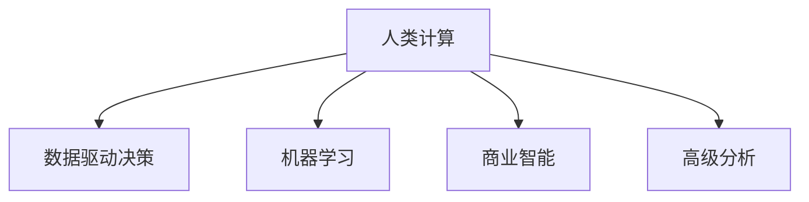

                 

# 人类计算：商业领域的应用

## 1. 背景介绍

### 1.1 问题由来

随着计算技术的飞速发展，尤其是人工智能和大数据技术的应用，人类计算的概念在商业领域的应用变得越来越重要。人类计算指的是利用人类智慧和技能，结合现代计算工具和算法，解决复杂商业问题的新方法。这种模式强调在保持人类创造力和直觉的同时，利用计算技术提高效率和精度。

### 1.2 问题核心关键点

人类计算的核心关键点在于如何将人类的智慧和经验与计算技术有效结合。这包括：
- 数据收集和处理：需要设计高效的数据收集机制，并利用计算工具进行数据清洗、整合和分析。
- 问题建模和算法设计：需要根据业务问题设计适合的计算模型和算法，以支持决策和预测。
- 结果解读和反馈：需要人类专家对计算结果进行解读，并基于结果提供反馈，进一步优化计算过程。

### 1.3 问题研究意义

在商业领域，人类计算可以帮助企业实现以下几个目标：
1. **优化决策过程**：通过结合人类的直觉和计算能力，可以更快速、准确地进行商业决策。
2. **提升创新能力**：人类计算结合了人类创造力和计算技术的优势，有助于企业开发新产品、新服务。
3. **降低运营成本**：通过自动化部分计算过程，可以减少人力成本，提高运营效率。
4. **增强竞争优势**：利用先进的计算技术，可以在快速变化的市场环境中保持领先地位。
5. **促进可持续发展**：通过优化资源利用和减少浪费，支持企业可持续发展。

## 2. 核心概念与联系

### 2.1 核心概念概述

为了更好地理解人类计算在商业领域的应用，本节将介绍几个关键概念：

- **人类计算**：结合人类智慧和计算技术，解决复杂商业问题的过程。人类计算强调将人类直觉和经验与现代计算工具和算法结合，以获得更高效、更精准的解决方案。
- **数据驱动决策**：通过分析海量数据，发现规律和趋势，指导商业决策的过程。
- **机器学习**：利用算法和模型，让机器通过数据分析进行学习和预测。
- **商业智能(BI)**：利用数据分析和可视化技术，帮助企业管理者和员工做出更好的商业决策。
- **高级分析**：利用统计分析和预测模型，进行复杂的商业分析和预测。

这些概念通过以下Mermaid流程图进行展示：



### 2.2 核心概念原理和架构

核心概念的原理和架构可以通过以下方式进行解释：

1. **数据收集和处理**：数据收集是整个计算过程的起点。企业需要设计有效的数据收集机制，确保数据的准确性和完整性。数据处理包括数据清洗、去重、转换和标准化等步骤，以提高数据质量，为后续分析奠定基础。

2. **问题建模和算法设计**：在明确业务目标和需求后，需要构建相应的计算模型和算法。这一过程包括确定模型类型、设计算法流程、选择特征等。常用的模型包括回归模型、分类模型、聚类模型、关联规则等。

3. **计算过程和结果解读**：将处理后的数据输入到模型中进行计算，得到分析结果。这些结果需要人类专家进行解读和分析，结合业务经验进行评估和决策。

4. **反馈和优化**：根据结果进行反馈，不断优化计算过程和模型，以提高准确性和效率。

## 3. 核心算法原理 & 具体操作步骤

### 3.1 算法原理概述

人类计算中的核心算法包括数据预处理、机器学习算法和结果解读三个主要部分。这些算法通过结合人类的智慧和计算技术的优势，实现高效、准确的商业决策。

1. **数据预处理**：包括数据清洗、归一化、特征工程等步骤，确保数据的质量和一致性。
2. **机器学习算法**：如回归分析、分类算法、聚类算法、关联规则等，用于从数据中提取模式和规律，支持预测和决策。
3. **结果解读**：结合业务经验和计算结果，进行综合评估和决策。

### 3.2 算法步骤详解

#### 3.2.1 数据预处理步骤

1. **数据收集**：从多个渠道收集数据，确保数据的多样性和完整性。
2. **数据清洗**：去除重复数据、处理缺失值、检测和修正错误数据。
3. **数据归一化**：将不同尺度的数据转换为统一范围，提高模型的预测能力。
4. **特征工程**：选择和构造特征，提取有用信息，减少计算复杂度。

#### 3.2.2 机器学习算法步骤

1. **数据分割**：将数据集分为训练集和测试集，确保模型的泛化能力。
2. **模型选择**：根据问题类型和数据特点，选择合适的机器学习算法，如线性回归、逻辑回归、支持向量机等。
3. **模型训练**：在训练集上训练模型，调整模型参数，提高预测准确性。
4. **模型评估**：在测试集上评估模型性能，选择最优模型。

#### 3.2.3 结果解读步骤

1. **结果解释**：将计算结果与业务背景结合，进行综合解读和评估。
2. **决策建议**：根据计算结果提出决策建议，支持业务决策。
3. **反馈优化**：根据决策效果和反馈，不断优化计算过程和模型。

### 3.3 算法优缺点

#### 3.3.1 优点

1. **结合人类智慧**：人类计算结合了人类的直觉和经验，能够更好地理解业务问题，做出更准确的决策。
2. **提高效率**：计算技术能够处理大量数据，提高决策速度和效率。
3. **增强可解释性**：人类专家对计算结果进行解读，提高决策的透明性和可解释性。
4. **支持创新**：计算技术支持数据分析和预测，帮助企业发现新的商机。

#### 3.3.2 缺点

1. **数据质量依赖**：数据收集和处理的准确性直接影响计算结果的准确性。
2. **算法选择难度**：选择合适的算法和模型需要专业知识和经验，存在一定难度。
3. **结果依赖人类解读**：人类专家的解读可能存在主观性，影响结果的客观性。
4. **成本较高**：计算技术和人类专家的结合需要较高的成本投入。

### 3.4 算法应用领域

#### 3.4.1 商业智能

商业智能（Business Intelligence, BI）利用数据和计算技术，帮助企业管理层和员工做出更好的决策。通过数据挖掘、数据可视化等技术，BI能够提供深入的业务洞察和预测，支持战略规划和运营优化。

#### 3.4.2 高级分析

高级分析（Advanced Analytics）利用统计分析和预测模型，进行复杂的商业分析和预测。常用的方法包括时间序列分析、回归分析、聚类分析等，用于支持市场预测、客户细分、销售预测等。

#### 3.4.3 客户关系管理

客户关系管理（Customer Relationship Management, CRM）利用计算技术和大数据，优化客户关系，提升客户满意度和忠诚度。通过分析客户行为数据和历史交易数据，CRM能够提供个性化的客户服务和推荐，支持精准营销和客户维护。

#### 3.4.4 供应链优化

供应链优化（Supply Chain Optimization）利用计算技术和数据模型，优化供应链管理和运营效率。通过分析供应链数据，优化库存管理、物流规划和生产调度，提升供应链的响应速度和成本效益。

#### 3.4.5 财务分析

财务分析（Financial Analysis）利用计算技术和大数据，进行财务数据的分析和预测。通过分析历史财务数据和市场环境，财务分析能够提供财务预测、风险评估和投资决策支持，帮助企业优化资本结构和投资策略。

## 4. 数学模型和公式 & 详细讲解 & 举例说明

### 4.1 数学模型构建

人类计算中常用的数学模型包括线性回归、逻辑回归、决策树、随机森林等。以线性回归模型为例，其数学模型构建如下：

$$
y = \beta_0 + \beta_1x_1 + \beta_2x_2 + ... + \beta_nx_n + \epsilon
$$

其中 $y$ 为因变量，$\beta_0$ 为截距，$\beta_1, \beta_2, ..., \beta_n$ 为自变量的系数，$x_1, x_2, ..., x_n$ 为自变量，$\epsilon$ 为误差项。

### 4.2 公式推导过程

线性回归模型的推导过程如下：

1. **假设模型**：假设因变量 $y$ 与自变量 $x_1, x_2, ..., x_n$ 之间存在线性关系，即：
$$
y = \beta_0 + \beta_1x_1 + \beta_2x_2 + ... + \beta_nx_n + \epsilon
$$

2. **最小二乘估计**：为了最小化误差项 $\epsilon$，采用最小二乘法求解参数 $\beta_0, \beta_1, \beta_2, ..., \beta_n$。
$$
\min_{\beta_0, \beta_1, \beta_2, ..., \beta_n} \sum_{i=1}^n (y_i - \hat{y}_i)^2
$$
其中 $\hat{y}_i$ 为预测值。

3. **求解公式**：通过求解上述最小二乘问题，得到参数估计值 $\hat{\beta_0}, \hat{\beta_1}, \hat{\beta_2}, ..., \hat{\beta_n}$。
$$
\hat{\beta} = (X^TX)^{-1}X^Ty
$$

4. **模型评估**：使用测试集评估模型的预测能力，常用的指标包括均方误差（MSE）、决定系数（R²）等。

### 4.3 案例分析与讲解

假设某电商企业希望通过计算预测下个季度的销售量。通过收集历史销售数据、市场数据和季节性因素数据，构建线性回归模型：

1. **数据收集**：收集历史销售数据、市场指数、节假日等数据。
2. **数据清洗和归一化**：去除异常值，归一化数据。
3. **特征工程**：选择历史销售量、市场指数、节假日等特征。
4. **模型训练**：使用历史数据训练线性回归模型，得到参数估计值。
5. **模型评估**：在测试集上评估模型性能，调整参数，提高预测准确性。
6. **结果解读**：结合业务背景，对预测结果进行解读，支持决策。

## 5. 项目实践：代码实例和详细解释说明

### 5.1 开发环境搭建

为了进行人类计算项目的开发，需要搭建一个适合Python环境。以下是一个示例环境搭建步骤：

1. **安装Python**：从官网下载并安装Python 3.x版本。
2. **安装Pandas**：Pandas是Python中常用的数据处理库，用于数据清洗和分析。
```bash
pip install pandas
```
3. **安装NumPy**：NumPy是Python中常用的数学库，用于数学计算和数据处理。
```bash
pip install numpy
```
4. **安装Scikit-learn**：Scikit-learn是Python中常用的机器学习库，用于构建和评估机器学习模型。
```bash
pip install scikit-learn
```
5. **安装Matplotlib**：Matplotlib是Python中常用的数据可视化库，用于绘制图表和可视化结果。
```bash
pip install matplotlib
```

### 5.2 源代码详细实现

下面以线性回归模型为例，展示Python代码的实现过程：

```python
import pandas as pd
import numpy as np
from sklearn.linear_model import LinearRegression
import matplotlib.pyplot as plt

# 加载数据
data = pd.read_csv('sales_data.csv')

# 数据清洗和归一化
data = data.dropna()
data = (data - data.mean()) / data.std()

# 特征选择
X = data[['market_index', 'holiday']].values
y = data['sales'].values

# 构建模型
model = LinearRegression()
model.fit(X, y)

# 预测和评估
y_pred = model.predict(X)
mse = np.mean((y_pred - y) ** 2)
r_squared = model.score(X, y)

# 可视化结果
plt.scatter(y, y_pred)
plt.xlabel('Actual Sales')
plt.ylabel('Predicted Sales')
plt.show()
```

### 5.3 代码解读与分析

上述代码中，首先加载历史销售数据，并进行数据清洗和归一化。然后，选择市场指数和节假日作为特征，构建线性回归模型。在模型训练后，进行预测并计算误差和决定系数。最后，使用Matplotlib绘制预测结果的散点图。

### 5.4 运行结果展示

运行上述代码后，将得到预测结果的散点图。通过散点图，可以直观地看到预测结果与实际销售量的关系，并进行进一步的分析和优化。

## 6. 实际应用场景

### 6.1 金融投资

金融投资中，利用人类计算进行市场预测和风险评估非常常见。通过分析历史交易数据、市场指标和宏观经济数据，构建复杂的预测模型，帮助投资者做出更好的决策。

### 6.2 医疗健康

医疗健康领域，利用计算技术进行疾病预测、治疗方案优化和患者管理。通过分析患者数据、治疗效果和医疗记录，构建预测模型，提供个性化的医疗服务。

### 6.3 供应链管理

供应链管理中，利用计算技术进行库存优化、物流规划和生产调度。通过分析供应链数据，优化库存管理、物流规划和生产调度，提升供应链的响应速度和成本效益。

### 6.4 电子商务

电子商务领域，利用计算技术进行客户行为分析、推荐系统和广告优化。通过分析用户行为数据、购买历史和搜索记录，构建推荐模型，提供个性化的购物体验和推荐服务。

### 6.5 人力资源

人力资源管理中，利用计算技术进行员工绩效评估、招聘优化和培训规划。通过分析员工绩效数据、招聘记录和培训反馈，构建预测模型，优化人力资源管理。

## 7. 工具和资源推荐

### 7.1 学习资源推荐

为了帮助开发者系统掌握人类计算的理论基础和实践技巧，这里推荐一些优质的学习资源：

1. **《Python数据科学手册》**：详细介绍Python在数据科学中的应用，包括数据清洗、处理和分析。
2. **《机器学习实战》**：讲解常用的机器学习算法和模型，结合实际案例进行详细讲解。
3. **Coursera《数据科学基础》课程**：斯坦福大学开设的数据科学课程，涵盖数据清洗、处理、分析和建模。
4. **Kaggle竞赛**：通过参与Kaggle数据科学竞赛，积累实战经验，提高技能水平。

### 7.2 开发工具推荐

为了提高人类计算项目的开发效率，需要一些高效的工具支持：

1. **Jupyter Notebook**：基于Python的交互式笔记本，支持数据处理、分析和可视化。
2. **PyCharm**：Python开发工具，提供丰富的插件和功能，支持数据处理和模型构建。
3. **Scratch**：可视化编程工具，适合初学者和复杂数据处理任务。
4. **Tableau**：数据可视化工具，支持复杂数据的多维度分析和展示。

### 7.3 相关论文推荐

人类计算在商业领域的应用，已经成为了研究热点。以下是几篇奠基性的相关论文，推荐阅读：

1. **《数据驱动的决策制定：一个案例研究》**：讨论了数据驱动决策在商业领域的应用，提供了实际案例和成功经验。
2. **《机器学习在商业智能中的应用》**：详细介绍了机器学习在商业智能中的作用和应用，提供了算法和模型选择方法。
3. **《高级分析在商业中的应用》**：探讨了高级分析在商业中的价值和挑战，提供了实际应用案例和分析方法。
4. **《人类计算在供应链管理中的应用》**：讨论了人类计算在供应链管理中的作用，提供了优化供应链的计算方法。
5. **《计算技术在金融中的应用》**：讨论了计算技术在金融投资、风险管理和客户管理中的应用，提供了实际案例和模型构建方法。

## 8. 总结：未来发展趋势与挑战

### 8.1 总结

本文对人类计算在商业领域的应用进行了全面系统的介绍。首先阐述了人类计算的背景和意义，明确了人类计算在优化决策、提升创新、降低成本等方面的重要价值。其次，从原理到实践，详细讲解了人类计算的数学模型和具体操作步骤，给出了具体的代码实现。同时，本文还广泛探讨了人类计算在金融、医疗、供应链、电子商务等领域的应用前景，展示了人类计算的广阔前景。

通过本文的系统梳理，可以看到，人类计算结合了人类的智慧和计算技术，能够有效解决复杂商业问题，提升企业的决策能力和竞争力。未来，随着计算技术的不断进步，人类计算的应用将更加广泛，为企业的智能化转型提供强大的技术支持。

### 8.2 未来发展趋势

展望未来，人类计算的发展趋势将包括以下几个方面：

1. **计算技术的智能化**：随着人工智能和大数据技术的发展，计算技术将变得更加智能和高效，能够处理更加复杂的数据和问题。
2. **跨领域应用**：人类计算将更多地应用于跨领域的商业问题，如医疗、金融、供应链等，提供更加综合的解决方案。
3. **深度学习的应用**：深度学习技术将进一步融入人类计算中，支持更加复杂的数据分析和预测。
4. **实时计算**：人类计算将实现实时数据处理和分析，支持即时决策和响应。
5. **人机协同**：人类计算将更加强调人机协同，结合人类直觉和计算技术，提供更高效、更精准的解决方案。

### 8.3 面临的挑战

尽管人类计算已经取得了显著进展，但在实际应用中仍面临以下挑战：

1. **数据质量问题**：数据收集和处理的准确性直接影响计算结果的准确性，如何确保数据的可靠性和一致性，是一个重要的挑战。
2. **算法选择难度**：选择合适的算法和模型需要专业知识和经验，存在一定难度。
3. **结果依赖人类解读**：人类专家的解读可能存在主观性，影响结果的客观性。
4. **成本较高**：计算技术和人类专家的结合需要较高的成本投入。

### 8.4 研究展望

未来，人类计算的研究方向将包括以下几个方面：

1. **自动化数据处理**：开发更加自动化的数据处理工具，减少人工干预，提高处理效率。
2. **机器学习算法的优化**：进一步优化机器学习算法，提升模型的预测能力和泛化性能。
3. **跨领域计算模型**：构建跨领域的计算模型，支持不同领域的数据分析和预测。
4. **人机协同方法**：研究人机协同方法，提升人机交互的效率和效果。
5. **计算技术的融合**：将计算技术与大数据、物联网、区块链等技术融合，提升人类计算的智能化和可靠性。

## 9. 附录：常见问题与解答

### 9.1 常见问题解答

**Q1: 如何选择合适的数据特征？**

A: 选择数据特征时，需要考虑特征的相关性和重要性。可以通过特征选择算法（如方差分析、相关系数等）选择最具代表性的特征，去除冗余和无关特征，提高模型的预测能力。

**Q2: 如何处理缺失数据？**

A: 处理缺失数据时，可以通过删除缺失样本、插值法（如均值插值、中位数插值等）、模型预测等方式进行处理。

**Q3: 如何选择和训练机器学习模型？**

A: 选择机器学习模型时，需要根据问题类型和数据特点，选择合适的模型类型，如回归模型、分类模型、聚类模型等。训练模型时，需要使用适当的训练数据、选择适当的超参数、采用适当的优化算法，并进行模型评估和调优。

**Q4: 如何解释计算结果？**

A: 解释计算结果时，需要结合业务背景和计算结果，进行综合分析和解读。可以通过可视化图表、分析报告等方式，将计算结果呈现给业务人员和决策者。

**Q5: 如何优化计算过程？**

A: 优化计算过程时，可以从数据预处理、算法选择、模型调优、结果解释等多个方面进行优化。可以通过数据增强、特征选择、超参数调优等方式，提高计算结果的准确性和效率。

---

作者：禅与计算机程序设计艺术 / Zen and the Art of Computer Programming

