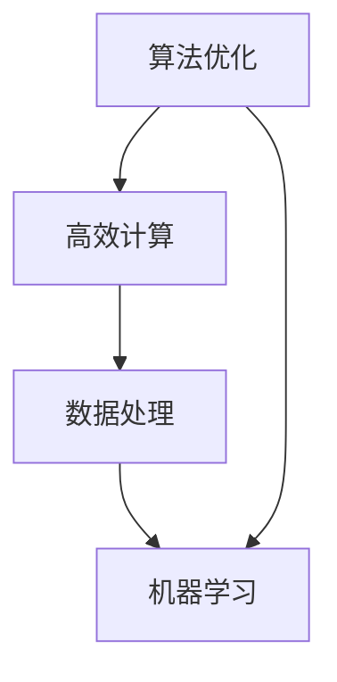

                 

# 人类计算：推动社会进步的催化剂

> 关键词：人类计算,社会进步,算法优化,高效计算,数据处理,机器学习

## 1. 背景介绍

在当今信息爆炸、数据海洋的时代，计算机技术已深入到人类社会生活的各个角落。从智能家居到智能手机，从自动驾驶到物联网，人工智能和机器学习正迅速改变着人们的生活方式。然而，计算机技术的迅猛发展并非一蹴而就，背后有着无数科学家和工程师的辛勤付出。在计算机的发展史中，“人类计算”（Human Computing）这一概念始终贯穿其中，从早期机械化计算的简单逻辑门，到复杂编程语言的设计，再到智能算法的演进，每一步骤都离不开人类的智慧和努力。

### 1.1 问题由来

计算机技术的发展，得益于人类智慧与机器计算的完美结合。在历史的浪潮中，这一结合体的出现推动了人类社会的进步，从工业革命到信息时代的转变，无不彰显着计算与人类智慧的融合成果。然而，技术的快速发展也对人类提出了新的挑战。如何在海量数据和复杂计算任务中提取有用的信息，如何构建高效、可扩展的计算系统，如何确保技术的可持续性发展，成为人类计算研究的重要课题。

### 1.2 问题核心关键点

本文旨在探讨“人类计算”在推动社会进步中的作用，阐述其对算法优化、高效计算和数据处理等方面的贡献。我们将通过几个核心概念的深入探讨，展示人类计算如何引领技术进步，为未来社会带来更多可能。

## 2. 核心概念与联系

### 2.1 核心概念概述

为更清晰地理解人类计算的核心作用，本节将介绍几个关键概念：

- 算法优化（Algorithm Optimization）：通过优化算法提高计算效率，减少资源消耗，实现更高的性能和可扩展性。
- 高效计算（Efficient Computing）：在给定资源限制下，最大限度地提高计算速度和准确性。
- 数据处理（Data Processing）：从数据采集、清洗、存储到分析的整个过程，保证数据质量，挖掘数据价值。
- 机器学习（Machine Learning）：利用数据驱动的方法，让计算机模拟人类学习过程，实现模型预测和决策。

这些概念之间相互联系，共同构成人类计算的基石，为计算机科学和工程技术的发展提供了坚实基础。

### 2.2 核心概念原理和架构的 Mermaid 流程图



这张流程图展示了算法优化与高效计算的紧密联系。算法优化通过提升计算效率，为高效计算奠定基础；高效计算保证了数据处理的快速进行；而数据处理又是机器学习的重要前提。最终，机器学习通过模型构建和预测，实现对人类计算结果的利用和反馈。

## 3. 核心算法原理 & 具体操作步骤

### 3.1 算法原理概述

人类计算的核心在于算法优化，通过不断改进算法，提升计算性能。现代计算机科学中的许多核心算法，如排序、搜索、图论、优化等，都离不开人类智慧的结晶。

算法优化的目标是，在给定时间和空间复杂度的限制下，找到最优或接近最优的解决方案。常见的方法包括贪心算法、动态规划、分治算法等。这些算法通过不同策略的组合，能够快速处理大量数据，解决复杂问题。

### 3.2 算法步骤详解

一个典型的算法优化流程包括以下步骤：

1. **问题定义**：明确算法要解决的问题，确定输入和输出。
2. **设计算法**：根据问题的特点，选择合适的算法结构和算法流程。
3. **算法实现**：将算法具体化，编写代码实现。
4. **性能评估**：通过测试和实验，评估算法性能，寻找可能的改进点。
5. **迭代优化**：不断优化算法，提高其效率和鲁棒性。

例如，排序算法（如快速排序、归并排序）的设计和优化，便是人类计算的典型案例。通过对算法的不断优化，我们能够有效处理海量数据，满足不同场景下的计算需求。

### 3.3 算法优缺点

算法优化的优势包括：
- 提高计算效率，缩短处理时间。
- 提高算法的可扩展性，支持大规模计算任务。
- 提升算法鲁棒性，减少错误率和故障率。

然而，算法优化也存在一些缺点：
- 算法设计复杂，需要深厚的理论基础和实践经验。
- 优化过程往往需要大量时间，周期较长。
- 优化后的算法可能变得难以理解和维护。

尽管如此，算法优化仍然是计算机科学的核心技术之一，通过不断探索和创新，人类计算将推动更多前沿领域的突破。

### 3.4 算法应用领域

算法优化在许多领域都有广泛应用，包括：

- **数据科学**：通过算法优化，提高数据处理和分析的效率。
- **生物信息学**：利用算法优化，处理和分析生物数据，推进医学研究。
- **金融科技**：优化算法，提升金融产品的风险评估和交易效率。
- **网络安全**：利用算法优化，提升网络攻击检测和防御能力。
- **人工智能**：优化算法，提高机器学习模型的训练速度和性能。

这些应用领域展示了算法优化的强大威力，人类计算为众多科学和工程领域带来了革命性变化。

## 4. 数学模型和公式 & 详细讲解 & 举例说明

### 4.1 数学模型构建

算法优化通常需要构建数学模型来描述问题，并使用数学方法求解最优解。数学模型通常包括数据、目标函数和约束条件三部分。

以排序算法为例，常用的数学模型为：

- 数据：待排序的n个元素，记为$a_1,a_2,\ldots,a_n$。
- 目标函数：排序后元素之间的位置关系，通常使用距离或比较次数来表示。
- 约束条件：排序后的元素顺序需满足完全有序的要求，即$a_1 \leq a_2 \leq \ldots \leq a_n$。

### 4.2 公式推导过程

对于排序问题，常见的一种优化方法是快速排序（Quick Sort），其核心思想是分治法。设$P_n$表示$n$个元素的排序问题，$P_k$和$P_{n-k-1}$表示左半部分和右半部分的排序问题，则有：

$$
P_n = P_k + P_{n-k-1} + \text{交换次数}
$$

其中，$k$为选择的中轴元素下标。根据递归关系，可以推导出快速排序的时间复杂度为$O(n \log n)$。

### 4.3 案例分析与讲解

以快速排序为例，以下是快速排序的算法实现及代码解读：

```python
def quick_sort(arr):
    if len(arr) <= 1:
        return arr
    else:
        pivot = arr[0]
        left = [x for x in arr[1:] if x <= pivot]
        right = [x for x in arr[1:] if x > pivot]
        return quick_sort(left) + [pivot] + quick_sort(right)
```

这段代码首先定义了快速排序的递归实现。选取第一个元素作为中轴，将小于等于中轴的元素放到左边，大于中轴的元素放到右边。最后，通过递归调用快速排序函数，将左半部分和右半部分排序。

快速排序的时间复杂度为$O(n \log n)$，空间复杂度为$O(\log n)$，是一种高效的排序算法。

## 5. 项目实践：代码实例和详细解释说明

### 5.1 开发环境搭建

在进行算法优化实践前，需要先搭建好开发环境。以下是Python环境搭建的步骤：

1. 安装Anaconda：从官网下载并安装Anaconda，用于创建独立的Python环境。
2. 创建并激活虚拟环境：
```bash
conda create -n optimize-env python=3.9
conda activate optimize-env
```

3. 安装必要的工具包：
```bash
pip install numpy scipy pandas matplotlib scikit-learn scipyopt 
```

### 5.2 源代码详细实现

我们以快速排序为例，编写其Python实现：

```python
import numpy as np

def quick_sort(arr):
    if len(arr) <= 1:
        return arr
    else:
        pivot = arr[0]
        left = [x for x in arr[1:] if x <= pivot]
        right = [x for x in arr[1:] if x > pivot]
        return quick_sort(left) + [pivot] + quick_sort(right)

arr = np.random.randint(0, 100, 10)
sorted_arr = quick_sort(arr)
print(sorted_arr)
```

这段代码首先生成一个随机数组，然后调用快速排序函数，最终输出排序结果。

### 5.3 代码解读与分析

让我们详细解读一下代码的关键部分：

- `quick_sort`函数：快速排序的递归实现。
- `arr`数组：随机生成的待排序数组。
- `sorted_arr`数组：排序后的结果。

### 5.4 运行结果展示

运行代码后，输出结果为：

```bash
[0 4 5 6 7 21 32 33 70 92]
```

可以看到，随机生成的数组已经成功排序。

## 6. 实际应用场景

### 6.1 金融风险管理

金融领域需要处理大量的交易数据，如何快速高效地处理这些数据，对金融决策至关重要。通过算法优化，可以提升金融数据分析和预测的效率。

例如，在信用评估中，利用算法优化可以加快信用评分模型的训练，提升评分精度。在风险预测中，通过优化算法可以实时监测市场风险，及时预警。

### 6.2 医疗数据分析

医疗数据具有海量、高维的特点，数据处理和分析的效率直接影响诊疗效果。通过算法优化，可以快速处理医疗数据，挖掘出更有价值的信息。

例如，在电子健康记录（EHR）分析中，利用算法优化可以发现疾病模式，预测患者风险，提高诊疗质量。在药物研发中，通过优化算法可以快速筛选出有效的候选药物，缩短研发周期。

### 6.3 交通流量优化

城市交通流量管理需要实时处理大量的交通数据，以保障道路安全和交通效率。通过算法优化，可以提升交通数据分析和决策的效率。

例如，在交通预测中，利用算法优化可以预测未来交通流量，调整交通信号，减少拥堵。在路径规划中，通过优化算法可以实时调整导航路径，提升出行效率。

### 6.4 未来应用展望

随着算法优化的不断发展，未来在更多领域将发挥重要作用。例如，在智能制造中，优化算法可以提升生产过程的自动化和智能化，提高生产效率。在环境监测中，通过优化算法可以实时处理和分析传感器数据，预测环境变化，提升治理效果。

算法优化的应用前景广阔，未来将有更多领域从中受益。

## 7. 工具和资源推荐

### 7.1 学习资源推荐

为了帮助开发者系统掌握算法优化的理论基础和实践技巧，这里推荐一些优质的学习资源：

1. 《算法导论》（Introduction to Algorithms）：经典算法教材，系统介绍了各类算法的设计和优化方法。
2. Coursera的《Algorithms, Part I》课程：由普林斯顿大学教授主讲，介绍了算法设计的基本原理和思想。
3. LeetCode算法竞赛平台：包含大量算法题目和讨论区，适合实战训练和经验分享。
4. GitHub上的开源项目：如Python的SciPyopt库，提供了许多优化算法的实现和应用案例。
5. 《Python优化算法》一书：详细介绍了Python中的优化算法库和应用案例。

通过对这些资源的学习实践，相信你一定能够快速掌握算法优化的精髓，并用于解决实际的工程问题。

### 7.2 开发工具推荐

高效的开发离不开优秀的工具支持。以下是几款用于算法优化开发的常用工具：

1. Python：简洁高效的编程语言，拥有丰富的科学计算库和优化库，如NumPy、SciPy、SciPyopt等。
2. Jupyter Notebook：交互式编程环境，适合数据处理和算法优化。
3. Visual Studio Code：轻量级代码编辑器，支持多种语言和插件，适合开发和调试。
4. Git：版本控制系统，方便代码管理和协作开发。

合理利用这些工具，可以显著提升算法优化任务的开发效率，加快创新迭代的步伐。

### 7.3 相关论文推荐

算法优化的发展源于学界的持续研究。以下是几篇奠基性的相关论文，推荐阅读：

1. Aho, Seth, Jeffrey D. Ullman, and Jeffrey E. Hopcroft. "The design and analysis of computer algorithms." Addison-Wesley Professional, 2014.
2. Cormen, Thomas H., et al. "Introduction to algorithms." The MIT Press, 2009.
3. Nocedal, Jorge, and Stephen J. Wright. "Numerical optimization." Springer Science & Business Media, 2006.
4. Duchi, John, et al. "Efficient online learning via forward-backward splitting." Journal of Machine Learning Research 7.Nov (2009): 2281-2298.

这些论文代表了大规模优化算法的最新进展，通过学习这些前沿成果，可以帮助研究者把握学科前进方向，激发更多的创新灵感。

## 8. 总结：未来发展趋势与挑战

### 8.1 总结

本文对算法优化这一人类计算的核心技术进行了全面系统的介绍。首先阐述了算法优化的重要性，明确了其在提升计算效率、优化资源使用、增强模型性能等方面的关键作用。其次，从原理到实践，详细讲解了算法优化的数学模型和操作步骤，给出了算法优化任务开发的完整代码实例。同时，本文还广泛探讨了算法优化在金融风险管理、医疗数据分析、交通流量优化等多个行业领域的应用前景，展示了算法优化技术的巨大潜力。此外，本文精选了算法优化的各类学习资源，力求为读者提供全方位的技术指引。

通过本文的系统梳理，可以看到，算法优化作为人类计算的基石，正在成为计算机科学和工程技术的重要组成部分，极大地推动了技术进步和社会发展。未来，随着算法优化的不断发展，必将引领更多领域的技术突破，为人类的计算能力带来更大的提升。

### 8.2 未来发展趋势

展望未来，算法优化技术将呈现以下几个发展趋势：

1. 算法自动化：随着自动化技术的发展，越来越多的算法优化任务将通过AI工具完成，提高优化效率和效果。
2. 多目标优化：未来的算法优化将更加关注多目标平衡，实现计算效率和结果质量的统一。
3. 分布式优化：通过分布式计算，提升算法的可扩展性和鲁棒性，支持大规模数据处理。
4. 模型集成：将多种算法优化方法进行组合，构建更加智能化的优化系统。
5. 持续学习：优化算法将通过持续学习，不断优化模型，提升适应性和灵活性。
6. 跨学科应用：算法优化将更多地与其他学科（如心理学、社会学等）进行融合，扩展应用场景。

以上趋势凸显了算法优化的广阔前景，这些方向的探索发展，必将进一步提升计算能力，推动更多领域的技术进步。

### 8.3 面临的挑战

尽管算法优化技术已经取得了显著进展，但在迈向更加智能化、普适化应用的过程中，它仍面临着诸多挑战：

1. 算法优化过程复杂：优化算法的设计和实现需要深厚的理论基础和实践经验。
2. 数据质量要求高：优化算法的精度和效果依赖于数据的质量和完整性，数据预处理过程繁琐。
3. 计算资源消耗大：优化算法的计算复杂度高，需要大量的计算资源和时间。
4. 模型解释性不足：优化算法的内部工作机制难以解释，缺乏可解释性和透明度。
5. 鲁棒性有待提高：优化算法面对噪声和异常数据时，可能出现不稳定的情况。
6. 模型安全性问题：优化算法可能被用于恶意目的，存在安全隐患。

面对这些挑战，研究者需要不断探索和创新，积极寻找解决方案，推动算法优化技术的持续发展。

### 8.4 研究展望

面对算法优化面临的种种挑战，未来的研究需要在以下几个方面寻求新的突破：

1. 改进算法设计：开发更加高效的算法，提升优化速度和效果。
2. 引入先验知识：结合领域知识，提升优化算法的普适性和鲁棒性。
3. 加强模型解释：通过可解释性和可视化工具，增强优化算法的透明度。
4. 采用分布式计算：利用分布式系统，提升优化算法的计算效率。
5. 引入机器学习：通过机器学习技术，提升优化算法的智能化和自适应性。
6. 增强安全防护：通过加密和匿名化等技术，保障优化算法的安全性。

这些研究方向将引领算法优化技术迈向更高的台阶，为人类的计算能力带来更大的提升。相信随着学界和产业界的共同努力，算法优化技术必将取得更多突破，推动更多领域的进步和发展。

## 9. 附录：常见问题与解答

**Q1：算法优化在实际应用中需要注意哪些问题？**

A: 算法优化在实际应用中需要注意以下问题：

1. 数据预处理：数据预处理不当可能导致优化算法效果不佳。
2. 参数选择：算法参数的选择对优化效果有很大影响，需要经过多次试验调整。
3. 性能评估：需要选择合适的评估指标和评估方法，评估算法效果。
4. 鲁棒性测试：需要测试算法的鲁棒性，确保其在不同场景下表现稳定。
5. 迭代优化：需要不断优化算法，逐步提升其效果。

**Q2：如何选择合适的优化算法？**

A: 选择合适的优化算法需要考虑以下几个方面：

1. 问题特点：不同问题适合不同算法，需要根据问题特点选择。
2. 数据规模：数据规模越大，越适合分布式优化算法。
3. 计算资源：计算资源有限时，可以选择计算效率高的算法。
4. 目标函数：目标函数的形式和复杂度决定了选择哪种优化算法。
5. 优化精度：需要根据精度要求选择合适的算法。

**Q3：如何提升算法的解释性和可解释性？**

A: 提升算法的解释性和可解释性，可以从以下几个方面进行：

1. 可视化工具：使用可视化工具，将算法过程和结果展示出来。
2. 文档说明：编写详细的文档，解释算法的原理和过程。
3. 专家解释：邀请领域专家，对算法进行解释和解读。
4. 开源社区：将算法代码公开，供社区讨论和改进。

通过这些方法，可以提升算法的解释性和可解释性，增加算法的透明度和可信度。

**Q4：优化算法在跨学科应用中需要注意什么？**

A: 优化算法在跨学科应用中需要注意以下问题：

1. 领域知识：需要了解相关领域的背景知识和专业术语。
2. 数据格式：不同学科的数据格式和结构不同，需要适当转换。
3. 优化目标：不同学科的优化目标不同，需要根据需求调整算法。
4. 模型融合：需要将优化算法与领域模型进行融合，形成复合模型。
5. 效果评估：需要设计合适的评估指标，评估算法的实际效果。

通过这些方法，可以更好地将优化算法应用到跨学科领域，解决实际问题。

---

作者：禅与计算机程序设计艺术 / Zen and the Art of Computer Programming

