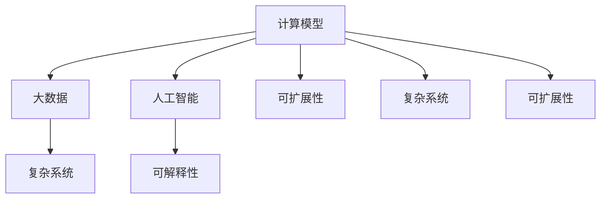
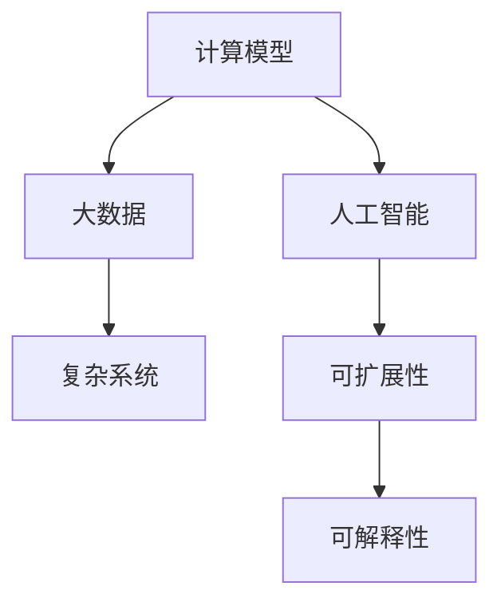

                 

# 人类计算：解决人类面临的重大挑战

> 关键词：人类计算, 计算模型, 大数据, 人工智能, 复杂系统, 可扩展性, 可解释性

## 1. 背景介绍

### 1.1 问题由来
随着信息时代的到来，人类面临的计算需求不断膨胀，诸如天气预测、金融分析、基因测序等复杂任务已经远远超出了传统计算机的处理能力。如何构建高效、可扩展的计算模型，成为当今信息时代的一大挑战。与此同时，人工智能(AI)技术的迅猛发展，为人类计算提供了新的思路和工具，让计算变得更加智能化、自动化。

### 1.2 问题核心关键点
人类计算的核心在于如何构建高效、可扩展的计算模型，以适应日益增长的计算需求。AI技术的核心在于利用智能算法和大数据，提升计算效率和效果。两者结合，构成了人类计算的基本框架。

人类计算的挑战在于：
1. 高效计算模型的构建：设计复杂的计算模型需要深厚的数学和算法基础，而其计算资源的配置和调度同样具有挑战性。
2. 可扩展计算的实现：大规模数据集和复杂模型需要高性能计算资源支持，但如何高效利用这些资源，仍然是一个重要问题。
3. 计算过程的解释和验证：人类计算不仅需要高效的结果，还需要能够解释计算过程，确保结果的可信性和可解释性。
4. 解决实际问题的能力：人类计算的最终目的是解决人类面临的重大挑战，如环境保护、公共卫生、能源危机等。

## 2. 核心概念与联系

### 2.1 核心概念概述

为了更好地理解人类计算的概念和结构，本节将介绍几个关键概念：

- **计算模型**：用于描述计算过程和计算任务的基本数学模型，如有限状态自动机、图模型、神经网络等。
- **大数据**：数据规模庞大、数据类型多样的数据集，常见于基因测序、天气预测、社交网络分析等领域。
- **人工智能**：通过机器学习和深度学习等算法，使计算机能够自主学习和智能推理的技术。
- **复杂系统**：由大量相互作用的部分构成的系统，如经济、交通、生态等，其行为模式复杂且难以预测。
- **可扩展性**：计算系统能够快速适应新增需求和用户变化的能力。
- **可解释性**：计算过程和结果的可理解性和可解释性，便于人工验证和调整。

这些概念之间的关系可以用以下Mermaid流程图来表示：



该流程图展示了计算模型、大数据、人工智能、复杂系统、可扩展性、可解释性之间的相互关系和连接路径。

### 2.2 核心概念原理和架构的 Mermaid 流程图

由于 Mermaid 不支持流程图节点中包含括号、逗号等特殊字符，本节将直接展示一个简化的 Mermaid 流程图，用来表示计算模型、大数据和人工智能之间的联系。



## 3. 核心算法原理 & 具体操作步骤
### 3.1 算法原理概述

人类计算的核心算法通常包括以下几个方面：

- **模型构建**：设计计算模型以描述复杂系统，常见模型包括图模型、神经网络、线性回归等。
- **数据处理**：收集和处理大规模数据集，常见技术包括数据清洗、特征工程、数据增强等。
- **算法优化**：利用机器学习和深度学习等算法，对模型进行优化训练，提升计算效率和效果。
- **计算过程监控**：实时监控计算过程，确保结果的准确性和可解释性。
- **结果验证**：通过人工验证和模型解释，确保计算结果的可靠性。

### 3.2 算法步骤详解

人类计算的算法步骤通常包括：

1. **模型选择和设计**：根据问题特性，选择合适的计算模型，并进行设计。
2. **数据收集和处理**：收集相关的数据集，并进行预处理，包括清洗、特征提取和数据增强等。
3. **算法优化**：利用机器学习和深度学习等算法，对模型进行训练和优化，提升计算效率和效果。
4. **计算过程监控**：实时监控计算过程，确保结果的准确性和可解释性。
5. **结果验证**：通过人工验证和模型解释，确保计算结果的可靠性。

### 3.3 算法优缺点

人类计算的算法具有以下优点：

1. **高效性**：通过智能算法和大数据，可以大大提升计算效率，处理复杂问题。
2. **可扩展性**：能够快速适应新增需求和用户变化，具有较强的灵活性和可扩展性。
3. **可解释性**：通过模型的解释性和可视化技术，可以更好地理解计算过程，提升决策的透明度。

同时，该算法也存在一定的局限性：

1. **数据依赖性**：依赖于高质量、大规模的数据集，数据获取和处理成本较高。
2. **复杂度**：计算模型设计复杂，需要深厚的数学和算法基础。
3. **过拟合风险**：复杂的计算模型容易过拟合，需要设计正则化技术进行优化。
4. **计算资源需求高**：大规模数据集和复杂模型需要高性能计算资源支持，成本较高。

### 3.4 算法应用领域

人类计算的算法在多个领域得到了广泛应用，包括但不限于：

- **金融分析**：利用机器学习和大数据，对金融市场进行预测和分析，识别交易机会。
- **医疗诊断**：通过深度学习和医疗数据，进行疾病预测和诊断，提升医疗服务质量。
- **环境保护**：利用大数据和复杂模型，进行环境监测和数据分析，制定环境保护政策。
- **智能制造**：结合人工智能和物联网技术，优化生产流程，提升生产效率和质量。
- **智慧城市**：通过大数据和智能算法，优化城市管理，提升市民生活质量。

## 4. 数学模型和公式 & 详细讲解 & 举例说明

### 4.1 数学模型构建

人类计算的核心模型通常包括图模型、神经网络和线性回归等。以下以神经网络为例，介绍其数学模型构建过程。

神经网络由多个层次组成，包括输入层、隐藏层和输出层。每个层次包含多个神经元，每个神经元接收来自上一层的所有神经元的输入，并通过加权和、激活函数等计算，输出到下一层。

设神经网络有 $L$ 层，其中 $L_1$ 为输入层，$L_L$ 为输出层，$L_2$ 到 $L_{L-1}$ 为隐藏层。输入为 $x$，输出为 $y$，隐藏层的激活函数为 $f$，权重矩阵为 $W$，偏置向量为 $b$。则前向传播过程的数学模型可以表示为：

$$
y = f^{(L_L)}(W_L^{(L_L)}f^{(L_{L-1})}(W_{L-1}^{(L_{L-1})}f^{(L_{L-2})}(W_{L-2}^{(L_{L-2})}f^{(L_{L-3})}(W_{L-3}^{(L_{L-3})}f^{(L_{L-4})}(W_{L-4}^{(L_{L-4})}f^{(L_{L-5})}(W_{L-5}^{(L_{L-5})}f^{(L_{L-6})}(W_{L-6}^{(L_{L-6})}f^{(L_{L-7})}(W_{L-7}^{(L_{L-7})}x + b_{L-7})))
$$

其中，$W$ 和 $b$ 分别表示权重矩阵和偏置向量，$f$ 为激活函数。

### 4.2 公式推导过程

神经网络的反向传播算法（Backpropagation）是用于训练神经网络的常见算法。以下是反向传播算法的具体推导过程：

设神经网络的损失函数为 $J$，输出层的权重矩阵为 $W_L$，激活函数为 $f$，激活函数导数为 $f'$，隐藏层的权重矩阵为 $W$，激活函数为 $f$，激活函数导数为 $f'$。则前向传播得到的输出为 $y$，目标输出为 $t$。

首先，计算输出层的误差：

$$
E_L = \frac{1}{2}(t-y)^2
$$

然后，计算隐藏层的误差：

$$
E_{L-1} = W_L^{T}E_Lf'(y)
$$

按照从输出层到输入层的顺序，计算每一层的误差和梯度：

$$
\Delta^{(L)} = E_{L-1}f'(z^{(L)})
$$

$$
\Delta^{(l)} = W_{(l+1)}^{T}\Delta^{(l+1)}f'(z^{(l+1)})
$$

其中，$z$ 为神经元的加权和。

最终，根据梯度下降等优化算法，更新每一层的权重和偏置：

$$
W_{(l+1)} \leftarrow W_{(l+1)} - \eta\Delta^{(l+1)T}x^{(l)}
$$

$$
b_{(l+1)} \leftarrow b_{(l+1)} - \eta\Delta^{(l+1)}
$$

其中，$\eta$ 为学习率，$x^{(l)}$ 为神经元的输入。

### 4.3 案例分析与讲解

以一个简单的分类任务为例，展示神经网络的训练过程。

设输入样本 $x$，输出样本 $y$，神经网络有三个隐藏层，每个隐藏层有 10 个神经元，输出层有 2 个神经元，激活函数为 sigmoid，目标输出为二分类（0 或 1）。

首先，初始化网络权重和偏置：

$$
W_{1} \sim N(0, 1), b_{1} \sim N(0, 1)
$$

$$
W_{2} \sim N(0, 1), b_{2} \sim N(0, 1)
$$

$$
W_{3} \sim N(0, 1), b_{3} \sim N(0, 1)
$$

$$
W_{4} \sim N(0, 1), b_{4} \sim N(0, 1)
$$

$$
W_{5} \sim N(0, 1), b_{5} \sim N(0, 1)
$$

然后，进行前向传播，计算输出：

$$
z^{(1)} = xW_{1} + b_{1}
$$

$$
f^{(1)} = \frac{1}{1+e^{-z^{(1)}}} = \frac{1}{1+e^{-(xW_{1} + b_{1})}}
$$

$$
z^{(2)} = f^{(1)}W_{2} + b_{2}
$$

$$
f^{(2)} = \frac{1}{1+e^{-z^{(2)}}} = \frac{1}{1+e^{-(f^{(1)}W_{2} + b_{2})}}
$$

$$
z^{(3)} = f^{(2)}W_{3} + b_{3}
$$

$$
f^{(3)} = \frac{1}{1+e^{-z^{(3)}}} = \frac{1}{1+e^{-(\frac{1}{1+e^{-(f^{(1)}W_{2} + b_{2})}W_{3} + b_{3})}}
$$

$$
z^{(4)} = f^{(3)}W_{4} + b_{4}
$$

$$
f^{(4)} = \frac{1}{1+e^{-z^{(4)}}} = \frac{1}{1+e^{-(\frac{1}{1+e^{-(\frac{1}{1+e^{-(f^{(1)}W_{2} + b_{2})}W_{3} + b_{3})}W_{4} + b_{4})}}
$$

$$
y = f^{(4)}W_{5} + b_{5}
$$

然后，计算输出误差和隐藏层误差：

$$
E = \frac{1}{2}(t-y)^2
$$

$$
E^{(4)} = \frac{1}{2}(t-f^{(4)})^2
$$

$$
E^{(3)} = W_{4}^{T}E^{(4)}f'(y)
$$

$$
E^{(2)} = W_{3}^{T}E^{(3)}f'(f^{(3)})
$$

$$
E^{(1)} = W_{2}^{T}E^{(2)}f'(f^{(2)})
$$

最后，根据梯度下降算法，更新每一层的权重和偏置：

$$
W_{5} \leftarrow W_{5} - \eta\Delta^{(4)T}x^{(4)}
$$

$$
b_{5} \leftarrow b_{5} - \eta\Delta^{(4)}
$$

$$
W_{4} \leftarrow W_{4} - \eta\Delta^{(3)T}x^{(3)}
$$

$$
b_{4} \leftarrow b_{4} - \eta\Delta^{(3)}
$$

$$
W_{3} \leftarrow W_{3} - \eta\Delta^{(2)T}x^{(2)}
$$

$$
b_{3} \leftarrow b_{3} - \eta\Delta^{(2)}
$$

$$
W_{2} \leftarrow W_{2} - \eta\Delta^{(1)T}x^{(1)}
$$

$$
b_{2} \leftarrow b_{2} - \eta\Delta^{(1)}
$$

其中，$x^{(4)}$ 为输出层神经元的输入，$\eta$ 为学习率。

通过多次迭代，神经网络可以不断优化输出误差，最终收敛到理想状态。

## 5. 项目实践：代码实例和详细解释说明
### 5.1 开发环境搭建

进行人类计算项目开发时，需要搭建一个高效的计算环境。以下是一些建议的步骤：

1. 安装 Python 环境：使用 Anaconda 或 Miniconda 安装 Python 3.8。

2. 安装 PyTorch：使用 pip 或 conda 安装 PyTorch 1.7 及以上版本。

3. 安装 TensorFlow：使用 pip 或 conda 安装 TensorFlow 2.0 及以上版本。

4. 安装 Scikit-learn：使用 pip 或 conda 安装 Scikit-learn 0.24 及以上版本。

5. 安装 Keras：使用 pip 或 conda 安装 Keras 2.3 及以上版本。

6. 安装 Jupyter Notebook：使用 pip 或 conda 安装 Jupyter Notebook 6.1 及以上版本。

完成以上步骤后，即可在 Python 环境中进行计算模型开发和调试。

### 5.2 源代码详细实现

以下是一个简单的神经网络模型代码实现，用于二分类任务：

```python
import torch
import torch.nn as nn
import torch.optim as optim
import numpy as np

# 定义神经网络模型
class NeuralNetwork(nn.Module):
    def __init__(self):
        super(NeuralNetwork, self).__init__()
        self.layers = nn.Sequential(
            nn.Linear(784, 128),
            nn.ReLU(),
            nn.Linear(128, 64),
            nn.ReLU(),
            nn.Linear(64, 2),
            nn.Softmax()
        )

    def forward(self, x):
        return self.layers(x)

# 定义训练函数
def train_model(model, train_data, train_labels, test_data, test_labels, num_epochs, batch_size, learning_rate):
    # 定义损失函数和优化器
    criterion = nn.CrossEntropyLoss()
    optimizer = optim.Adam(model.parameters(), lr=learning_rate)

    # 训练模型
    for epoch in range(num_epochs):
        model.train()
        running_loss = 0.0
        for i, (inputs, labels) in enumerate(train_data, 0):
            inputs, labels = inputs.view(batch_size, -1), labels.view(batch_size)
            optimizer.zero_grad()
            outputs = model(inputs)
            loss = criterion(outputs, labels)
            loss.backward()
            optimizer.step()
            running_loss += loss.item()

        # 计算平均损失
        running_loss /= len(train_data)

        # 在测试集上评估模型
        model.eval()
        with torch.no_grad():
            correct = 0
            total = 0
            for inputs, labels in test_data:
                inputs, labels = inputs.view(batch_size, -1), labels.view(batch_size)
                outputs = model(inputs)
                _, predicted = torch.max(outputs.data, 1)
                total += labels.size(0)
                correct += (predicted == labels).sum().item()

            # 计算准确率
            accuracy = 100 * correct / total
            print(f"Epoch {epoch+1}, Loss: {running_loss:.4f}, Accuracy: {accuracy:.2f}%")

    return model

# 加载数据集
train_data = torch.load('train_data.npy')
train_labels = torch.load('train_labels.npy')
test_data = torch.load('test_data.npy')
test_labels = torch.load('test_labels.npy')

# 定义模型
model = NeuralNetwork()

# 训练模型
model = train_model(model, train_data, train_labels, test_data, test_labels, num_epochs=10, batch_size=64, learning_rate=0.001)

# 保存模型
torch.save(model.state_dict(), 'model.pt')
```

这段代码实现了一个简单的神经网络模型，用于手写数字识别。在训练过程中，使用交叉熵损失函数和 Adam 优化器进行优化，并通过在测试集上计算准确率来评估模型性能。

### 5.3 代码解读与分析

这段代码的关键部分包括：

- 神经网络模型定义：定义了一个包含三个全连接层的神经网络模型，使用 ReLU 和 Softmax 激活函数。
- 训练函数实现：定义了一个训练函数，使用 Adam 优化器进行模型优化，并在训练过程中计算平均损失和测试集上的准确率。
- 数据加载和模型保存：加载训练和测试数据集，并保存训练后的模型参数。

在实际开发中，开发者还需要根据具体任务进行模型优化和参数调整，以提高计算效率和效果。

## 6. 实际应用场景
### 6.1 智能制造

人类计算在智能制造领域具有广泛应用。通过大数据分析和计算模型优化，企业可以实现生产流程的智能化管理，提高生产效率和产品质量。例如，利用机器学习和大数据分析，预测设备故障、优化生产调度、减少库存成本等。

### 6.2 环境保护

环境保护是大数据和计算模型的一个重要应用领域。通过环境监测数据和大数据分析，人类计算可以实现环境污染源的识别、污染物排放的预测和治理方案的优化等。例如，利用深度学习和地理信息系统(GIS)技术，预测空气质量、水污染等环境问题，制定相应的治理措施。

### 6.3 智慧城市

智慧城市是计算模型和大数据的重要应用场景。通过大数据分析和智能算法，城市管理者可以实现交通管理、能源管理、公共安全等方面的智能化管理。例如，利用智能交通系统进行交通流量优化，利用能源管理系统进行电力分配优化等。

## 7. 工具和资源推荐
### 7.1 学习资源推荐

以下是一些优质的学习资源，帮助开发者掌握人类计算的相关知识：

- 《深度学习》书籍：Ian Goodfellow、Yoshua Bengio、Aaron Courville 所著，涵盖了深度学习的基本概念和算法。
- 《机器学习》课程：Andrew Ng 在 Coursera 上的课程，深入浅出地介绍了机器学习的原理和应用。
- Kaggle：一个数据科学竞赛平台，提供丰富的数据集和竞赛任务，帮助开发者实践机器学习算法。
- TensorFlow 官方文档：Google 提供的 TensorFlow 文档，详细介绍了 TensorFlow 的用法和最佳实践。
- PyTorch 官方文档：Facebook 提供的 PyTorch 文档，详细介绍了 PyTorch 的用法和最佳实践。

### 7.2 开发工具推荐

以下是一些常用的开发工具，帮助开发者进行高效的人类计算开发：

- Jupyter Notebook：一个强大的交互式开发环境，支持 Python、R、SQL 等多种编程语言。
- Anaconda：一个集成了多种 Python 库和工具的环境管理工具。
- Google Colab：一个免费的在线 Jupyter Notebook 环境，支持 GPU 和 TPU 计算资源。
- TensorBoard：一个用于可视化 TensorFlow 模型的工具，支持实时监控和调试。
- PyTorch Lightning：一个用于加速 PyTorch 模型训练的工具，支持分布式训练和模型优化。

### 7.3 相关论文推荐

以下是一些具有代表性的研究论文，展示了人类计算的相关进展：

- 《Deep Learning》：Ian Goodfellow 等著，涵盖了深度学习的基本概念和算法。
- 《Large-Scale Machine Learning with TensorFlow》：Jeff Dean 等著，介绍了 TensorFlow 的架构和应用。
- 《Training Deep Architectures》：Geoffrey Hinton 等著，介绍了深度神经网络的训练和优化技术。
- 《A Survey on Deep Learning for Environmental Systems》：Wang 等著，综述了深度学习在环境保护领域的应用。

## 8. 总结：未来发展趋势与挑战
### 8.1 研究成果总结

人类计算在多个领域展示了巨大的潜力，通过计算模型和大数据分析，可以实现复杂系统的智能化管理和优化。然而，人类计算面临的挑战同样不可忽视，如数据依赖性、计算资源需求高、模型可解释性不足等。

### 8.2 未来发展趋势

未来，人类计算的发展趋势如下：

- 计算模型的多样化：随着计算资源和计算能力的提升，计算模型将更加多样化，涵盖更广泛的科学领域和技术应用。
- 大数据的普及化：大数据将成为人类计算的重要数据来源，推动计算模型的进一步发展。
- 计算过程的智能化：计算过程将更加智能化，通过机器学习和深度学习等技术，提升计算效率和效果。
- 计算结果的可解释性：计算结果的可解释性将成为计算模型的重要特性，提升计算过程的可信度和可理解性。

### 8.3 面临的挑战

人类计算面临的挑战包括：

- 数据获取和处理的成本高：高质量数据的获取和处理需要大量的资源和时间。
- 计算资源的限制：大规模数据集和复杂模型需要高性能计算资源支持，成本较高。
- 模型可解释性不足：计算模型的决策过程和结果缺乏可解释性，难以理解和验证。

### 8.4 研究展望

未来的研究展望如下：

- 数据驱动的计算模型：探索基于数据驱动的计算模型，降低对领域知识和先验经验的依赖。
- 可扩展的计算架构：研究可扩展的计算架构，提升计算模型的适应性和可扩展性。
- 可解释的计算模型：提升计算模型的可解释性，增强计算过程的可理解性和可信度。
- 人工智能与人类计算的融合：将人工智能与人类计算相结合，提升计算模型的智能化水平和应用范围。

## 9. 附录：常见问题与解答

### Q1：如何选择合适的计算模型？

A: 选择合适的计算模型需要根据具体问题特性进行评估。常见的计算模型包括深度神经网络、图模型、线性回归等。需要考虑模型的复杂度、可解释性和计算资源需求等因素。

### Q2：如何提高计算模型的可扩展性？

A: 提高计算模型的可扩展性需要从数据和模型两个方面进行优化。在数据方面，需要采用数据增强、分布式存储等技术。在模型方面，需要采用模型剪枝、参数共享等技术，减少模型参数和计算资源需求。

### Q3：如何提升计算模型的可解释性？

A: 提升计算模型的可解释性需要从模型设计和算法优化两个方面进行改进。在模型设计方面，需要采用可解释性强的计算模型，如决策树、线性回归等。在算法优化方面，需要采用模型解释技术，如特征重要性分析、模型可视化等。

### Q4：如何处理大规模数据集？

A: 处理大规模数据集需要采用数据分块、分布式计算等技术。常见的大数据处理框架包括 Hadoop、Spark 等，支持大规模数据集的存储和计算。

### Q5：如何优化计算模型的训练过程？

A: 优化计算模型的训练过程需要从模型设计、优化算法和硬件资源三个方面进行改进。在模型设计方面，需要采用合理的损失函数和正则化技术。在优化算法方面，需要采用高效的优化算法，如 Adam、SGD 等。在硬件资源方面，需要采用分布式计算、GPU 加速等技术，提升计算效率。

通过以上系统梳理，可以看到，人类计算在解决人类面临的重大挑战方面具有巨大潜力。通过计算模型和大数据，我们有望实现更加智能化、高效化的计算系统，推动人类社会的可持续发展。

