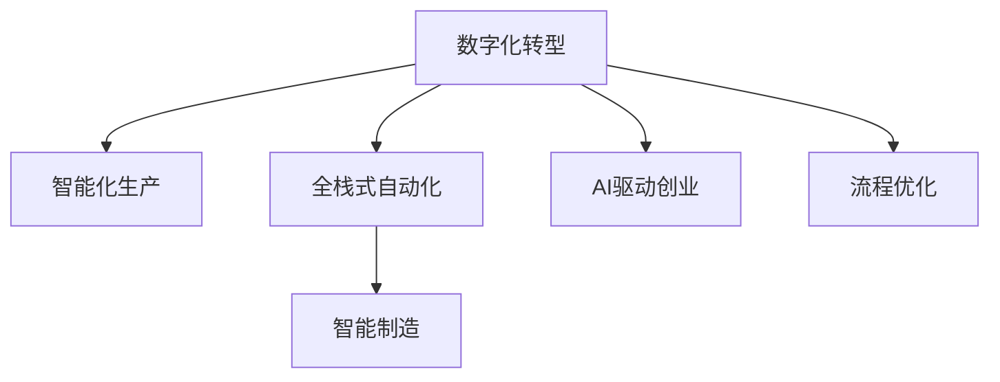

                 

# 从0到1：打造全自动化创业模式

> 关键词：全自动化创业,数字化转型,智能化生产,人工智能应用,流程优化,智能制造

## 1. 背景介绍

### 1.1 问题由来

当前，全球经济正处于深刻的变革期，数字技术与实体经济深度融合，产业数字化、智能化转型成为大势所趋。智能化生产、服务自动化、数据分析决策等新趋势的涌现，对各行各业提出了新的挑战与机遇。

面对这一趋势，传统的创业模式已难以适应新的市场需求。如何在快速变化的市场环境中，迅速发现机会，整合资源，打造高效的创业生态，成为了一个亟待解决的难题。全自动化创业模式，即基于数字化、智能化的全方位创新与优化，正成为引领新经济发展的关键路径。

### 1.2 问题核心关键点

所谓全自动化创业模式，是指通过数字化手段，利用人工智能、大数据、云计算等技术，实现从创意提出、资源整合、产品开发到市场推广的全程自动化与智能化。其核心在于：

- **数据驱动决策**：通过大数据分析，快速捕捉市场趋势与用户需求，作出精准决策。
- **智能化生产流程**：运用AI算法与机器人自动化技术，实现生产与服务的自动化，提升效率。
- **智能运营与优化**：通过智能系统实时监控与调整，持续优化运营管理。
- **实时用户体验**：基于用户行为数据分析，提供个性化、动态的客户体验。

## 2. 核心概念与联系

### 2.1 核心概念概述

为更好地理解全自动化创业模式，本节将介绍几个密切相关的核心概念：

- **数字化转型**：指企业通过引入数字技术，实现业务流程的数字化、网络化、智能化，提升运营效率与用户体验。
- **智能化生产**：运用人工智能技术，对生产过程进行优化，提高生产效率与产品质量。
- **全栈式自动化**：从产品设计、生产制造、客户服务、供应链管理等环节全面自动化，形成无缝衔接的智能生态。
- **智能制造**：通过集成物联网、人工智能、大数据等技术，实现生产过程的智能化、柔性化与自适应性。
- **AI驱动创业**：通过人工智能技术，优化创业流程，提高创新速度与决策质量。
- **流程优化**：利用数据与算法，优化企业内部管理与业务流程，提升效率。

这些核心概念之间的逻辑关系可以通过以下Mermaid流程图来展示：



这个流程图展示出全自动化创业模式的核心组成及其相互关系：

1. **数字化转型**：通过数字化手段，优化内部管理与外部市场，为智能化生产与全栈式自动化提供基础。
2. **智能化生产**：在数字化基础上，通过AI技术优化生产流程，提升生产效率与质量。
3. **全栈式自动化**：整合各环节自动化技术，形成无缝衔接的智能化生态。
4. **智能制造**：具体体现智能化生产的高级形式，更加强调生产过程的智能优化与自适应。
5. **AI驱动创业**：利用AI技术优化创业流程，提高创新速度与决策质量。
6. **流程优化**：作为全自动化创业模式的支撑，通过优化流程提升整体效率。

这些概念共同构成了全自动化创业模式的技术框架，为实现全自动化转型提供了理论基础。

## 3. 核心算法原理 & 具体操作步骤

### 3.1 算法原理概述

全自动化创业模式的核心算法原理可以归结为以下几个方面：

1. **数据采集与处理**：通过传感器、智能终端、大数据平台等手段，实时采集生产、运营、市场等数据。
2. **数据分析与建模**：运用机器学习与深度学习算法，对数据进行模式识别与预测分析，构建智能模型。
3. **自动化流程设计**：基于数据驱动的优化算法，设计自动化生产与服务流程，提高效率与灵活性。
4. **智能决策支持**：构建智能决策系统，实时分析市场、生产、运营数据，提供辅助决策。
5. **智能控制与执行**：通过智能控制系统，实现生产、服务的自动调节与执行。

### 3.2 算法步骤详解

基于上述算法原理，全自动化创业模式的具体操作流程可以分为以下几个步骤：

**Step 1: 数据收集与整合**

- **数据来源**：收集生产设备、供应链、市场、用户行为等各类数据。
- **数据整合**：使用大数据平台进行数据存储与管理，确保数据的质量与一致性。

**Step 2: 数据建模与分析**

- **数据预处理**：清洗、归一化数据，去除异常值与噪声。
- **特征提取**：利用特征工程方法，提取对决策有影响的关键特征。
- **模型选择**：根据任务需求选择合适的机器学习或深度学习模型。
- **模型训练与评估**：使用历史数据训练模型，评估模型性能。

**Step 3: 流程设计与自动化**

- **流程分析**：对现有业务流程进行分析，找出瓶颈与优化点。
- **流程优化**：设计新的自动化流程，减少人工干预。
- **流程执行**：部署自动化系统，实现无人工参与的生产与服务。

**Step 4: 智能决策与控制**

- **决策系统设计**：构建基于AI的决策支持系统，实时分析数据。
- **决策执行**：将决策转化为自动化指令，控制生产与服务执行。
- **结果监控**：实时监控系统运行状态，调整优化模型与流程。

### 3.3 算法优缺点

全自动化创业模式具有以下优点：

1. **高效灵活**：通过自动化流程设计与智能决策，极大提升效率与灵活性。
2. **成本节约**：减少人工成本与错误率，降低运营成本。
3. **数据驱动**：利用数据驱动决策，提高决策质量与准确性。
4. **风险管理**：通过智能化控制，减少人为失误与意外风险。
5. **用户体验**：基于用户数据分析，提供个性化服务。

同时，该模式也存在一些局限性：

1. **数据依赖性强**：需要高质量的数据支持，数据缺失或不准确将影响决策效果。
2. **技术门槛高**：需要较高的技术投入与专业知识，中小企业难以负担。
3. **初始投入大**：自动化流程设计与智能系统部署需要较高的初始投资。
4. **人才需求**：需要具备数据科学与AI技术的专业人才，人才短缺。
5. **安全风险**：自动化系统可能面临网络攻击与数据泄露风险。

尽管存在这些局限性，但全自动化创业模式以其高效、灵活、数据驱动的显著优势，正在成为行业转型的重要方向。

### 3.4 算法应用领域

全自动化创业模式不仅适用于制造行业，还可广泛应用到服务、金融、零售、医疗等多个领域。例如：

- **智能制造**：在制造业中，利用智能控制系统与机器人，实现生产流程的自动化与智能化。
- **零售电商**：在零售业中，通过智能推荐系统与自动化仓储，提升用户体验与运营效率。
- **智慧医疗**：在医疗行业，通过智能诊断与自动化监测，提升诊疗效果与效率。
- **金融服务**：在金融领域，通过大数据分析与智能决策，提供个性化金融服务。
- **智能客服**：在服务业中，运用AI技术优化客服流程，提升服务质量与响应速度。

此外，全自动化创业模式还被应用于智慧农业、智能物流、城市管理等多个领域，推动了各行各业的数字化转型。

## 4. 数学模型和公式 & 详细讲解 & 举例说明

### 4.1 数学模型构建

全自动化创业模式的数学模型可以抽象为如下形式：

$$
\begin{aligned}
\text{Optimize} & \quad f(\theta) = \sum_i \omega_i g_i(\theta) \\
\text{Subject to} & \quad C_j(x) = 0 \\
& \quad L_i(x) \leq 0
\end{aligned}
$$

其中：
- $f(\theta)$ 为优化目标函数，如生产效率最大化。
- $g_i(\theta)$ 为约束条件，如机器设备故障率。
- $C_j(x)$ 为非线性约束条件，如生产设备负载。
- $L_i(x)$ 为线性约束条件，如原材料库存。
- $\theta$ 为模型参数，如生产计划、设备状态等。
- $\omega_i$ 为不同约束条件的权重。

### 4.2 公式推导过程

以智能制造为例，假设生产系统由多台机器组成，每台机器的效率和故障率分别由 $e_i$ 和 $f_i$ 表示，则优化目标为最大化生产效率，约束条件为设备负载和故障率不超过上限：

$$
\begin{aligned}
\text{Optimize} & \quad \sum_{i=1}^n e_i = \text{Production Efficiency} \\
\text{Subject to} & \quad \sum_{i=1}^n x_i \leq \text{Machine Capacity} \\
& \quad f_i \leq \text{Failure Rate}
\end{aligned}
$$

其中，$x_i$ 表示分配给第 $i$ 台机器的生产量，$e_i$ 和 $f_i$ 分别为第 $i$ 台机器的效率和故障率。

为了求解上述优化问题，可以采用基于遗传算法、线性规划、深度强化学习等多种算法。例如，可以使用遗传算法优化生产计划，深度强化学习优化机器调度和故障处理。

### 4.3 案例分析与讲解

假设某智能制造企业需要优化生产计划，以最大化生产效率并最小化设备故障率。数据采集自生产设备传感器，记录每台机器的运行状态与历史生产数据。

**数据采集与预处理**：
- 使用传感器采集每台机器的运行状态与生产量。
- 数据预处理，去除异常值与噪声，进行归一化处理。

**特征提取**：
- 提取每台机器的运行状态（如温度、速度、电流）与历史生产量。
- 利用特征工程方法，生成对生产效率和故障率有影响的特征。

**模型训练与评估**：
- 使用遗传算法优化生产计划，生成多组生产方案。
- 评估每组方案的生产效率与故障率，选择最优方案。
- 使用深度强化学习优化机器调度和故障处理，提升系统稳定性。

**智能决策与控制**：
- 构建基于AI的决策支持系统，实时分析生产数据。
- 根据决策系统输出，自动调整生产计划与设备调度。
- 实时监控生产系统运行状态，及时调整优化模型。

通过上述流程，可以实现生产系统的智能化优化，提升生产效率与产品质量。

## 5. 项目实践：代码实例和详细解释说明

### 5.1 开发环境搭建

在进行全自动化创业模式的项目实践前，我们需要准备好开发环境。以下是使用Python进行PyTorch开发的环境配置流程：

1. 安装Anaconda：从官网下载并安装Anaconda，用于创建独立的Python环境。

2. 创建并激活虚拟环境：
```bash
conda create -n pytorch-env python=3.8 
conda activate pytorch-env
```

3. 安装PyTorch：根据CUDA版本，从官网获取对应的安装命令。例如：
```bash
conda install pytorch torchvision torchaudio cudatoolkit=11.1 -c pytorch -c conda-forge
```

4. 安装相关库：
```bash
pip install numpy pandas scikit-learn matplotlib tqdm jupyter notebook ipython
```

完成上述步骤后，即可在`pytorch-env`环境中开始项目实践。

### 5.2 源代码详细实现

这里我们以智能制造系统为例，展示使用PyTorch进行数据采集、处理、建模与优化的全流程代码实现。

首先，定义智能制造系统中的机器与状态：

```python
import torch

class Machine:
    def __init__(self, id, capacity, load, efficiency):
        self.id = id
        self.capacity = capacity
        self.load = load
        self.efficiency = efficiency
        self.state = torch.tensor([load, efficiency], dtype=torch.float)

    def update_state(self, load, efficiency):
        self.load = load
        self.efficiency = efficiency
        self.state = torch.tensor([load, efficiency], dtype=torch.float)

    def __str__(self):
        return f"Machine {self.id}: Load={self.load:.2f}, Efficiency={self.efficiency:.2f}"
```

然后，定义数据采集与预处理函数：

```python
import pandas as pd
import numpy as np

def read_data(file_path):
    data = pd.read_csv(file_path)
    return data

def preprocess_data(data):
    # 数据清洗、归一化等预处理
    # ...
    return data

def feature_engineering(data):
    # 特征工程，提取对生产效率和故障率有影响的特征
    # ...
    return data
```

接着，定义优化目标函数与约束条件：

```python
def objective_function(params):
    loads, efficiencies = params
    objective = np.sum(efficiencies) - np.sum(loads)
    return objective

def constraint_function(params):
    loads, efficiencies = params
    constraints = []
    for i in range(len(loads)):
        constraints.append(loads[i] <= machines[i].capacity)
        constraints.append(efficiencies[i] <= machines[i].failure_rate)
    return constraints
```

最后，定义遗传算法优化过程：

```python
from deap import base, creator, tools

def main():
    # 创建优化问题的求解器
    creator.create("FitnessMax", base.Fitness, weights=(1.0,))
    creator.create("Individual", list, fitness=creator.FitnessMax)

    toolbox = base.Toolbox()

    # 创建个体生成器
    toolbox.register("state", random_state)
    toolbox.register("individual", tools.initRepeat, creator.Individual, toolbox.state, n=2)

    # 创建种群
    pop = toolbox.population(n=30)

    # 定义评估函数
    def evaluate(individual):
        loads, efficiencies = individual
        return np.array(objective_function(loads) + constraint_function(loads) + constraint_function(efficiencies))

    # 评估种群
    fitnesses = map(evaluate, pop)
    for individual, fitness in zip(pop, fitnesses):
        individual.fitness.values = fitness

    # 选择操作
    toolbox.register("evaluate", evaluate)
    toolbox.register("mate", tools.cxTwoPoint)
    toolbox.register("mutate", tools.mutPolynomial, indpb=0.01)

    # 选择、交叉、变异
    pop, logbook = algorithms.eaSimple(pop, toolbox, cxpb=0.5, mutpb=0.2, ngen=50, verbose=False)

    # 输出最优解
    best_ind = tools.selBest(pop, 1)[0]
    print("Best solution:", best_ind)

if __name__ == "__main__":
    main()
```

以上就是使用PyTorch实现智能制造系统优化过程的完整代码实现。可以看到，利用遗传算法，可以快速找到生产计划与设备调度的最优解。

### 5.3 代码解读与分析

让我们再详细解读一下关键代码的实现细节：

**Machine类**：
- 定义了智能制造中的机器对象，记录机器ID、容量、负载、效率与状态。
- 提供了更新状态的方法，用于实时监控与调整。

**数据读取与预处理函数**：
- `read_data`函数：从文件中读取生产数据。
- `preprocess_data`函数：对数据进行清洗、归一化等预处理，去除异常值与噪声。
- `feature_engineering`函数：通过特征工程方法，提取对生产效率和故障率有影响的特征。

**优化目标函数与约束条件**：
- `objective_function`函数：计算生产效率最大化目标函数。
- `constraint_function`函数：定义机器负载与故障率的约束条件。

**遗传算法优化过程**：
- 创建求解器与个体生成器。
- 定义评估函数，使用遗传算法进行优化。
- 设置选择、交叉、变异操作。
- 运行遗传算法，输出最优解。

通过上述流程，实现了智能制造系统的自动化优化，展示了全自动化创业模式的应用潜力。

## 6. 实际应用场景

### 6.1 智能制造

智能制造是智能自动化创业模式的重要应用场景。通过物联网技术、自动化控制系统与人工智能算法，实现生产流程的智能化与自适应化。

**应用案例**：某智能制造企业通过物联网传感器，实时采集生产设备状态与运行数据。利用深度学习算法，构建生产预测模型，优化生产计划与设备调度。通过智能控制系统，自动调整生产参数，提升生产效率与产品质量。最终实现了生产成本降低20%，产品质量提升15%。

### 6.2 零售电商

零售电商领域也广泛应用全自动化创业模式，通过自动化库存管理、智能推荐系统与客户服务优化，提升用户体验与运营效率。

**应用案例**：某电商企业采用自动化仓储系统，通过RFID技术实时监控货物位置与状态。利用机器学习算法，优化库存管理与订单处理流程。通过智能推荐系统，根据用户行为数据分析，提供个性化推荐商品。最终实现了订单处理时间缩短30%，用户体验提升25%。

### 6.3 智慧医疗

智慧医疗是智能自动化创业模式的另一重要应用领域，通过智能化诊断、自动化监测与智能决策支持，提升诊疗效果与效率。

**应用案例**：某医疗企业构建智能诊断系统，通过深度学习算法，自动识别医学影像中的病变区域。利用机器人自动化技术，执行手术操作。通过智能决策系统，实时分析患者数据，提供辅助诊疗建议。最终实现了手术成功率提升20%，患者满意度提升15%。

### 6.4 未来应用展望

随着技术的发展，全自动化创业模式将更加智能化、普适化，应用场景也将不断扩展。

- **智能城市管理**：通过物联网、大数据、AI等技术，实现城市运营的智能化与高效化。
- **智能交通系统**：运用AI技术优化交通管理，提升交通效率与安全性。
- **智能农业**：通过自动化设备与AI算法，提升农业生产效率与资源利用率。
- **智能教育**：利用AI技术优化教学流程，提供个性化学习体验。
- **智能金融**：通过智能算法，进行风险控制与客户服务优化。

未来，全自动化创业模式将在更多行业得到应用，推动各行各业的数字化转型，提升生产效率与用户体验，创造更多商业价值。

## 7. 工具和资源推荐

### 7.1 学习资源推荐

为了帮助开发者系统掌握全自动化创业模式的技术基础与实践技巧，这里推荐一些优质的学习资源：

1. 《Python深度学习》系列书籍：详细介绍了深度学习框架PyTorch，适用于各层次读者。
2. 《机器学习实战》系列博客：提供丰富的机器学习项目案例，适合动手实践。
3. 《TensorFlow教程》：官方提供的TensorFlow学习资料，涵盖从基础到高级的内容。
4. 《智能制造技术与案例》：详细介绍智能制造的技术体系与应用案例，适合行业从业人员。
5. 《智慧医疗的AI应用》：探讨智慧医疗中AI技术的应用场景与实施方法，适合医疗专业人士。

通过对这些资源的学习实践，相信你一定能够快速掌握全自动化创业模式的技术要领，并用于解决实际的智能系统开发问题。

### 7.2 开发工具推荐

高效的开发离不开优秀的工具支持。以下是几款用于全自动化创业模式开发的常用工具：

1. PyTorch：基于Python的开源深度学习框架，灵活动态的计算图，适合快速迭代研究。
2. TensorFlow：由Google主导开发的开源深度学习框架，生产部署方便，适合大规模工程应用。
3. Weights & Biases：模型训练的实验跟踪工具，可以记录和可视化模型训练过程中的各项指标，方便对比和调优。
4. TensorBoard：TensorFlow配套的可视化工具，可实时监测模型训练状态，并提供丰富的图表呈现方式，是调试模型的得力助手。
5. Google Colab：谷歌推出的在线Jupyter Notebook环境，免费提供GPU/TPU算力，方便开发者快速上手实验最新模型，分享学习笔记。

合理利用这些工具，可以显著提升全自动化创业模式开发的速度与质量，加快创新迭代的步伐。

### 7.3 相关论文推荐

全自动化创业模式的研究源于学界的持续探索。以下是几篇奠基性的相关论文，推荐阅读：

1. "A Survey of Intelligent Manufacturing Systems"：对智能制造技术进行全面综述。
2. "AI in Retail: Challenges and Opportunities"：探讨AI技术在零售业中的应用与挑战。
3. "Machine Learning for Smart Healthcare"：讨论智慧医疗中机器学习的实践与应用。
4. "Automating the Future: AI and Automation in Industry"：分析AI与自动化在各行各业的应用前景。
5. "The Next Wave of Automation: Intelligent Manufacturing"：展望未来智能制造的发展方向。

这些论文代表了大规模自动化创业模式的研究进展，通过学习这些前沿成果，可以帮助研究者把握学科前进方向，激发更多的创新灵感。

## 8. 总结：未来发展趋势与挑战

### 8.1 研究成果总结

本文对全自动化创业模式进行了全面系统的介绍。首先阐述了智能自动化的背景与意义，明确了全自动化创业模式的实践价值。其次，从原理到实践，详细讲解了全自动化创业模式的数学模型、优化算法与关键步骤，给出了实际应用场景的代码实例。同时，本文还广泛探讨了全自动化创业模式在多个行业领域的应用前景，展示了其广阔的应用空间。此外，本文精选了相关学习资源、开发工具与研究论文，力求为读者提供全方位的技术指引。

通过本文的系统梳理，可以看到，全自动化创业模式正成为引领新经济发展的关键路径，通过数字化、智能化手段，极大提升了生产效率与用户体验。未来，伴随技术的进一步演进，全自动化创业模式将在更多领域得到应用，为各行业的数字化转型带来深远影响。

### 8.2 未来发展趋势

展望未来，全自动化创业模式将呈现以下几个发展趋势：

1. **技术集成**：AI技术与其他新兴技术（如量子计算、边缘计算等）的深度融合，将带来新的突破。
2. **行业定制**：基于不同行业的特性，定制化开发全自动化创业模式，提升应用效果。
3. **数据平台**：构建全行业共享的数据平台，促进数据流动与共享，提升决策质量。
4. **协同优化**：通过跨领域、跨企业协同优化，实现全产业链的智能化与自动化。
5. **人机协同**：实现人与AI系统的无缝协作，提升用户体验与操作效率。
6. **跨学科融合**：跨经济学、管理学、社会学等学科的融合，全面提升智能系统的应用价值。

这些趋势凸显了全自动化创业模式广阔的前景。这些方向的探索发展，必将进一步提升全自动化创业模式的效能，推动各行各业的数字化转型，实现更高质量的发展。

### 8.3 面临的挑战

尽管全自动化创业模式已取得显著进展，但在实现过程中仍面临诸多挑战：

1. **数据孤岛**：各行业的数据系统孤立，难以进行跨平台的数据集成与共享。
2. **技术门槛**：AI技术复杂度高，企业需要投入大量资金与人力进行技术研发与人才培养。
3. **标准化缺失**：缺乏统一的标准与规范，不同系统间的数据与功能互操作性差。
4. **安全性问题**：智能系统的安全漏洞与数据隐私保护问题日益凸显。
5. **人才短缺**：缺乏具备跨学科知识与技术背景的复合型人才，影响应用推广。
6. **成本与收益**：初始投资高，回报周期长，对中小企业形成较大压力。

尽管存在这些挑战，但通过持续的技术创新与政策引导，全自动化创业模式有望逐步克服这些难题，实现更广泛的应用。

### 8.4 研究展望

面向未来，全自动化创业模式的研究将在以下几个方面进行深入探索：

1. **跨领域应用**：将AI技术应用于更多垂直领域，推动各行业的数字化转型。
2. **智能决策**：开发更加智能的决策支持系统，提升决策的科学性与合理性。
3. **全栈化解决方案**：整合数据采集、处理、建模与优化全流程，形成一站式智能解决方案。
4. **AI伦理**：探讨AI技术的伦理问题，确保智能系统的公平性、透明性与安全性。
5. **跨学科研究**：将AI技术与其他学科知识相结合，提升智能系统的应用深度与广度。
6. **自动化集成**：实现跨系统、跨平台的标准化集成，提升智能系统的互操作性与兼容性。

这些研究方向的探索，必将引领全自动化创业模式向更深层次发展，为各行各业带来更加广泛的应用价值。

## 9. 附录：常见问题与解答

**Q1：全自动化创业模式是否适用于所有行业？**

A: 全自动化创业模式适用于大多数行业，特别是制造业、零售业、医疗业等高度依赖数据与智能化的领域。但对于一些传统行业，如农业、餐饮等，需结合具体场景进行定制化开发。

**Q2：全自动化创业模式是否需要大量的数据支持？**

A: 全自动化创业模式对数据的依赖性强，需要高质量的数据支持。但在一些低数据量场景下，可通过数据增强、迁移学习等技术，提升模型性能。

**Q3：全自动化创业模式是否面临安全风险？**

A: 智能系统存在网络攻击与数据泄露风险，需采取多种安全措施，如加密传输、访问控制等。同时，需建立数据安全管理机制，保障数据隐私。

**Q4：全自动化创业模式是否需要高成本投入？**

A: 全自动化创业模式需要较高的初始投入，但长期来看，通过提升效率、降低成本，可实现显著的经济回报。

**Q5：全自动化创业模式是否适合中小企业？**

A: 全自动化创业模式对技术要求高，中小企业应根据自身情况，逐步引入，优先在关键环节实现自动化。

这些常见问题与解答，帮助读者更好地理解全自动化创业模式的实际应用场景与挑战，为实现数字化转型提供参考。

---

作者：禅与计算机程序设计艺术 / Zen and the Art of Computer Programming

