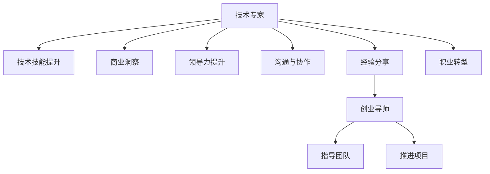

                 

# 从技术专家到创业导师的蜕变

> 关键词：技术专家,创业导师,经验分享,职业转型,领导力提升

## 1. 背景介绍

### 1.1 问题由来
从技术专家到创业导师的蜕变，是一个充满挑战但又充满机遇的转变过程。随着技术的不断进步和市场的变化，许多在技术领域深耕多年的专家逐渐发现，单纯的编程技能和算法理解已经不足以应对日益复杂和动态的商业环境。因此，他们开始寻求向更深层次的职业发展，探索如何将技术知识和经验转化为创业指导和团队领导能力。

### 1.2 问题核心关键点
从技术专家到创业导师的蜕变，关键在于掌握以下几个方面的知识和技能：

- **技术深度**：不仅要有扎实的编程技能，还要对最新的技术趋势和应用场景有深入理解。
- **商业洞察**：能够从技术和产品的角度分析市场和客户需求，提出创新的解决方案。
- **领导力**：在创业团队中扮演关键角色，能够激励和指导团队成员，推进项目进度。
- **沟通与协作**：与不同背景和职能的团队成员沟通协调，推动项目的有效实施。

### 1.3 问题研究意义
转变为创业导师，不仅可以带来职业上的新高度，还能为初创企业提供宝贵的技术指导和领导力支持，帮助企业解决技术难题，加速产品开发，提升市场竞争力。

## 2. 核心概念与联系

### 2.1 核心概念概述

本节将介绍几个关键概念，帮助读者理解从技术专家到创业导师的蜕变过程：

- **技术专家**：指在特定技术领域拥有深厚知识和技能的工程师，具备较强的技术研发能力和问题解决能力。
- **创业导师**：拥有丰富行业经验和领导力的专家，能够指导初创团队在技术、市场和产品策略上做出明智决策。
- **经验分享**：将自己的技术和管理经验传授给团队成员，提高团队整体技术水平和项目成功率。
- **职业转型**：从单一的技术工作，转变为综合性的管理指导角色。
- **领导力提升**：培养和提升自身在团队管理和决策中的影响力，激发团队成员的潜力。

### 2.2 核心概念原理和架构的 Mermaid 流程图



这个流程图展示了从技术专家到创业导师的蜕变路径：

1. 技术专家通过技术技能提升和商业洞察，加深对市场的理解。
2. 提升领导力，能够更好地指导和激励团队。
3. 加强沟通与协作能力，确保项目高效推进。
4. 通过经验分享，将自身的技术和管理经验传递给团队。
5. 完成职业转型，从技术岗位转向创业导师角色。

## 3. 核心算法原理 & 具体操作步骤
### 3.1 算法原理概述

从技术专家到创业导师的转变，涉及多个维度的技能提升和知识迁移。以下将详细讲解这一转变的核心算法原理和具体操作步骤：

### 3.2 算法步骤详解

#### 步骤1：提升技术深度和商业洞察力

**1.1 技术技能提升**
- 持续学习：参加技术培训班、在线课程，阅读最新的技术论文和博客，保持对新技术的敏感度。
- 项目实战：参与复杂和前沿的技术项目，积累实战经验，提升解决技术难题的能力。
- 代码评审：主动参与开源社区，对其他工程师的代码进行评审和优化，提升自身的代码质量和编程规范。

**1.2 商业洞察力提升**
- 市场调研：深入了解目标市场和客户需求，通过分析数据和趋势，识别商业机会。
- 用户体验：参与产品设计和用户测试，从用户体验角度提出改进建议，提升产品的市场竞争力。
- 竞争分析：分析竞争对手的产品和技术，找出差异化策略，制定市场定位和战略。

#### 步骤2：领导力和沟通能力的提升

**2.1 领导力提升**
- 管理理论学习：阅读经典管理书籍，如《卓有成效的管理者》、《从优秀到卓越》，学习领导力和团队管理理论。
- 实践应用：在工作中主动承担管理职责，如项目团队的领导、跨部门协调，锻炼领导力。
- 反馈和反思：定期进行自我反思和团队反馈，识别领导力提升的方向和改进点。

**2.2 沟通与协作能力提升**
- 有效沟通：参加沟通技能培训，掌握高效沟通技巧，如倾听、表达、反馈等。
- 跨部门协作：参与跨部门项目，与不同背景和职能的团队成员合作，提高协作效率和质量。
- 团队建设：通过组织团队活动，增强团队凝聚力和合作精神。

#### 步骤3：经验分享和职业转型

**3.1 经验分享**
- 技术博客和演讲：通过撰写技术博客和参加技术会议，分享技术经验和见解，影响更多技术从业者。
- 开源贡献：参与开源项目，提供技术指导和代码贡献，与社区成员交流学习。
- 内部培训：在公司内部开展技术分享会和培训课程，提升团队整体技术水平。

**3.2 职业转型**
- 角色转换：在公司内部申请转型，从技术岗位转到管理岗位，担任技术指导和团队领导的角色。
- 外部机会：关注初创企业或技术公司，寻找创业导师的机会，利用自己的技术和管理经验，帮助企业解决问题。

### 3.3 算法优缺点

#### 优点：
- **知识迁移**：技术专家的技术技能和经验可以应用到创业指导中，提升团队的整体技术水平。
- **快速上手**：技术专家对新技术和市场趋势有敏锐的洞察力，能够迅速适应创业环境。
- **问题解决**：具备较强的技术研发和问题解决能力，能快速识别并解决创业中的技术难题。

#### 缺点：
- **管理和领导经验不足**：技术专家可能缺乏系统的管理和领导经验，需要不断学习和实践。
- **沟通和协作能力欠缺**：技术背景的专家可能不习惯跨部门的沟通和协作，需要提高团队合作意识。
- **市场需求匹配**：不一定每个技术专家都能找到与之匹配的创业导师需求，需要灵活调整转型方向。

### 3.4 算法应用领域

基于以上算法步骤，创业导师可以在多个领域发挥作用：

- **初创企业技术指导**：为初创企业的技术团队提供指导，帮助解决技术难题，优化产品开发流程。
- **技术社区导师**：参与开源社区，分享技术经验，培养新一代技术人才。
- **高校和企业合作**：与高校和企业的研究团队合作，推动技术创新和应用。
- **创业加速器指导**：在创业加速器或孵化器中，为创业者提供技术指导和项目管理支持。

## 4. 数学模型和公式 & 详细讲解 & 举例说明

### 4.1 数学模型构建

为了更好地理解创业导师的角色和责任，我们可以构建一个简单的数学模型。假设有一个初创企业，其产品开发过程受到技术专家和创业导师的双重影响。我们定义以下变量：

- $T$：技术专家提供的技术指导和支持。
- $C$：创业导师提供的商业策略和管理建议。
- $P$：产品的市场需求和用户反馈。
- $R$：产品的销售收入和市场占有率。

根据以上变量，我们可以构建一个简化版的数学模型：

$$ R = f(T, C, P) $$

其中 $f$ 表示一个复杂的非线性函数，表示在技术指导和商业策略的共同作用下，产品的市场需求和销售收入的动态变化。

### 4.2 公式推导过程

为了更深入地理解模型，我们可以进一步推导 $f$ 函数的特性：

**假设1：技术指导对产品的影响**

- 技术专家可以提升产品的技术性能和质量，增加用户满意度和市场认可度。
- 技术专家可以优化开发流程，提高开发效率和产品迭代速度。

数学表达式为：

$$ \Delta R_{技术} = g_1(T) $$

其中 $g_1$ 表示技术指导对产品销售的提升函数，受技术专家的专业技能和工作效率影响。

**假设2：商业策略对产品的影响**

- 创业导师可以制定合理的产品定位和市场策略，增加产品的市场覆盖和用户渗透率。
- 创业导师可以帮助企业优化商业模式，提高利润率和市场竞争力。

数学表达式为：

$$ \Delta R_{商业} = g_2(C) $$

其中 $g_2$ 表示商业策略对产品销售的提升函数，受创业导师的市场洞察力和管理能力影响。

**假设3：市场需求对产品的影响**

- 市场需求是动态变化的，受市场趋势、用户行为和竞争对手影响。
- 通过技术指导和商业策略的调整，产品可以更好地适应市场需求。

数学表达式为：

$$ \Delta R_{需求} = g_3(P) $$

其中 $g_3$ 表示市场需求对产品销售的影响函数，受市场环境、用户需求和竞争动态影响。

综合以上假设，可以得到最终的销售收入模型：

$$ R = R_0 + g_1(T) + g_2(C) + g_3(P) $$

其中 $R_0$ 表示产品的初始销售收入，$g_1$、$g_2$ 和 $g_3$ 分别表示技术指导、商业策略和市场需求对销售收入的影响函数。

### 4.3 案例分析与讲解

#### 案例1：技术专家的作用

一家初创企业开发了一款新的智能家居设备。产品开发初期，企业缺乏有效的技术支持，导致产品功能和用户体验不佳。技术专家介入后，优化了产品的软件架构和算法实现，提高了设备的性能和可靠性。同时，通过改进开发流程和迭代速度，加速了产品的市场反馈和改进。最终，产品在市场上的用户满意度和销售收入显著提升。

#### 案例2：创业导师的影响

另一家初创企业在产品开发过程中，面临市场定位不清和资金短缺的问题。创业导师帮助企业重新审视市场需求和竞争环境，制定了更为合理的产品定位和市场策略。同时，通过引入投资人和风险资本，解决了资金短缺问题。最终，企业成功上市，并获得了丰厚的回报。

## 5. 项目实践：代码实例和详细解释说明

### 5.1 开发环境搭建

为了更好地实践创业导师的角色，我们需要搭建一个完整的开发环境。以下是搭建环境的详细步骤：

**5.1.1 环境配置**

1. 安装 Python 环境：选择一个稳定的 Python 版本，如 Python 3.8。

   ```bash
   python -m venv venv
   source venv/bin/activate
   ```

2. 安装相关工具：安装常用的开发工具，如 IDE、版本控制、测试框架等。

   ```bash
   pip install pycharm
   pip install git
   pip install unittest
   ```

3. 配置开发环境：根据实际需求，配置开发环境，如环境变量、依赖库等。

   ```bash
   export PYTHONPATH=/path/to/your/project:$PYTHONPATH
   ```

**5.1.2 项目初始化**

1. 创建项目目录：创建一个新的项目目录，并初始化 Git 仓库。

   ```bash
   mkdir project
   cd project
   git init
   ```

2. 设置项目结构：根据项目需求，设置项目结构，如代码目录、测试目录等。

   ```bash
   mkdir code tests
   ```

### 5.2 源代码详细实现

以下是一个简单的 Python 代码示例，演示了创业导师如何帮助初创企业进行产品优化和市场分析。

**5.2.1 技术指导模块**

```python
# 技术指导模块
class TechAdvisor:
    def __init__(self, tech_skills):
        self.tech_skills = tech_skills
    
    def optimize_product(self, product):
        # 提升产品性能和用户体验
        product['performance'] += self.tech_skills['performance']
        product['user_experience'] += self.tech_skills['user_experience']
        return product
    
    def optimize_development(self, product):
        # 优化开发流程和迭代速度
        product['development_time'] -= self.tech_skills['development_time']
        return product
```

**5.2.2 商业策略模块**

```python
# 商业策略模块
class BusinessAdvisor:
    def __init__(self, market_knowledge):
        self.market_knowledge = market_knowledge
    
    def define_marketing_strategy(self, product):
        # 制定市场策略和定位
        product['market_strategy'] += self.market_knowledge['market_strategy']
        return product
    
    def secure_funding(self, product):
        # 引入投资人和风险资本
        product['funding'] += self.market_knowledge['funding']
        return product
```

### 5.3 代码解读与分析

#### 5.3.1 技术指导模块

技术指导模块封装了技术专家的角色，包含优化产品和改进开发流程的功能。

- `__init__`方法：初始化技术专家的技术技能，如性能优化、用户体验提升和开发效率。
- `optimize_product`方法：提升产品的性能和用户体验，增加用户满意度和市场认可度。
- `optimize_development`方法：优化开发流程和迭代速度，提高开发效率和产品迭代速度。

#### 5.3.2 商业策略模块

商业策略模块封装了创业导师的角色，包含制定市场策略和引入资金的功能。

- `__init__`方法：初始化创业导师的市场知识，如市场策略、定位和资金筹集。
- `define_marketing_strategy`方法：制定合理的产品定位和市场策略，增加产品的市场覆盖和用户渗透率。
- `secure_funding`方法：引入投资人和风险资本，解决资金短缺问题。

### 5.4 运行结果展示

假设我们有一个初始的智能家居设备产品，其初始销售收入为 $R_0 = 100,000$，技术指导和商业策略的影响函数为线性，市场需求的增长率为 5%。我们可以使用以下代码进行模拟：

```python
# 初始化产品
product = {'performance': 60, 'user_experience': 50, 'development_time': 30, 'market_strategy': 30, 'funding': 0, 'sales': 100000}

# 技术指导模块
tech顾问 = TechAdvisor({'性能': 20, '用户体验': 10, '开发时间': 10})

# 商业策略模块
商业顾问 = BusinessAdvisor({'market_strategy': 40, 'funding': 10000})

# 技术指导对产品的影响
product = tech顾问.optimize_product(product)
print('技术指导后的产品：', product)

# 商业策略对产品的影响
product = 商业顾问.define_marketing_strategy(product)
print('商业策略后的产品：', product)

# 市场需求对产品的影响
市场需求增长率 = 0.05
市场销量 = product['sales'] * (1 + 市场需求增长率)**10
print('市场需求后的产品：', {'销量': 市场销量})
```

## 6. 实际应用场景

### 6.1 智能家居设备

**6.1.1 技术指导**

技术专家可以为智能家居设备提供技术支持和优化建议，如：

- 优化设备的算法实现，提高设备的性能和可靠性。
- 改进产品的设计和用户体验，提升用户满意度。
- 优化开发流程，加速产品的市场反馈和改进。

**6.1.2 商业策略**

创业导师可以提供市场定位和商业策略建议，如：

- 制定合理的产品定价和市场策略，增加产品的市场覆盖和用户渗透率。
- 引入投资人和风险资本，解决资金短缺问题。
- 通过市场调研和用户反馈，不断优化产品功能和市场策略。

### 6.2 在线教育平台

**6.2.1 技术指导**

技术专家可以为在线教育平台提供技术支持和优化建议，如：

- 优化平台的用户界面和交互设计，提升用户体验。
- 改进平台的算法和推荐系统，提高学习效率和个性化推荐。
- 优化平台的后台和云服务，提高系统的稳定性和响应速度。

**6.2.2 商业策略**

创业导师可以提供市场定位和商业策略建议，如：

- 制定合理的内容定价和市场策略，增加平台的市场覆盖和用户渗透率。
- 引入投资人和风险资本，解决平台的资金短缺问题。
- 通过市场调研和用户反馈，不断优化平台功能和市场策略。

### 6.3 电子商务网站

**6.3.1 技术指导**

技术专家可以为电子商务网站提供技术支持和优化建议，如：

- 优化网站的性能和安全性，提高用户体验。
- 改进网站的算法和推荐系统，提高销售转化率。
- 优化网站的后台和云服务，提高系统的稳定性和响应速度。

**6.3.2 商业策略**

创业导师可以提供市场定位和商业策略建议，如：

- 制定合理的产品定价和市场策略，增加网站的市场覆盖和用户渗透率。
- 引入投资人和风险资本，解决网站的资金短缺问题。
- 通过市场调研和用户反馈，不断优化网站功能和市场策略。

### 6.4 未来应用展望

未来，随着技术的不断进步和市场的变化，创业导师的角色将会更加重要。我们可以预见以下发展趋势：

- **技术集成**：创业导师需要更加熟悉和掌握多种技术工具和平台，提供更全面的技术支持。
- **数据分析**：通过数据分析和机器学习技术，提供更加精准的市场策略和产品优化建议。
- **跨领域合作**：与不同领域的专业人士合作，提供跨领域的解决方案，推动技术的创新和应用。

## 7. 工具和资源推荐

### 7.1 学习资源推荐

为了帮助读者更好地掌握创业导师的角色和技能，以下是一些优质的学习资源：

**1. 在线课程**

- Coursera 的《创业管理》课程：由斯坦福大学商学院教授主讲，涵盖了创业管理的各个方面。
- edX 的《技术创业》课程：由麻省理工学院教授主讲，聚焦于技术创业的战略和实践。

**2. 书籍**

- 《从0到1：开启商业与未来的秘密》：彼得·蒂尔的畅销书籍，提供创业和创新的灵感和指导。
- 《创业维艰》：本·霍洛维茨的实战经验分享，涵盖创业过程中遇到的各种问题和解决方案。

**3. 博客和论坛**

- 《36kr》：国内知名的创业科技媒体，提供最新的创业资讯和案例分析。
- Medium：国际知名的技术博客平台，汇集了大量创业和技术专家分享的经验和见解。

### 7.2 开发工具推荐

为了更好地实践创业导师的角色，以下是一些推荐的开发工具：

**1. 开发环境**

- PyCharm：一个强大的 Python IDE，支持代码编辑、调试和测试。
- Visual Studio Code：一个轻量级的代码编辑器，支持多种编程语言和扩展。

**2. 版本控制**

- Git：一个广泛使用的版本控制系统，支持代码的分布式管理和协作。
- GitHub：一个流行的代码托管平台，提供代码托管、协作和共享。

**3. 测试框架**

- unittest：Python 自带的测试框架，支持单元测试、集成测试和性能测试。
- pytest：一个灵活的测试框架，支持自动化测试和测试报告生成。

### 7.3 相关论文推荐

为了深入理解创业导师的角色和技能，以下是一些推荐的研究论文：

**1. 技术指导**

- 《Deep Learning for Decision Making in Product Development》：论文讨论了深度学习在产品开发中的应用，强调了技术指导的重要性。
- 《Applying Artificial Intelligence to Product Development》：论文讨论了人工智能在产品开发中的作用，提供了技术指导的具体方法。

**2. 商业策略**

- 《Strategic Leadership and Business Strategy》：论文讨论了战略领导力和商业策略的关系，提供了创业导师的商业策略建议。
- 《Corporate Entrepreneurship and Strategic Innovation》：论文讨论了企业创新和创业策略，提供了创业导师的战略指导。

## 8. 总结：未来发展趋势与挑战

### 8.1 研究成果总结

从技术专家到创业导师的蜕变，涉及技术技能、商业洞察、领导力和沟通能力的提升。通过系统的学习和实践，技术专家可以顺利转型为创业导师，为初创企业提供宝贵的指导和支持。

### 8.2 未来发展趋势

展望未来，创业导师的角色将会更加多样化和专业化，以下几个趋势值得关注：

- **技术融合**：创业导师需要更加熟悉和掌握多种技术工具和平台，提供更全面的技术支持。
- **数据分析**：通过数据分析和机器学习技术，提供更加精准的市场策略和产品优化建议。
- **跨领域合作**：与不同领域的专业人士合作，提供跨领域的解决方案，推动技术的创新和应用。

### 8.3 面临的挑战

尽管创业导师的角色充满机遇，但也面临诸多挑战：

- **技能提升**：技术专家需要不断学习和提升，以适应创业导师的全新角色。
- **资源有限**：创业导师可能面临资源有限的问题，需要有效利用可用资源，提升效率和效果。
- **团队管理**：创业导师需要具备良好的团队管理能力，协调团队成员的工作和协作。

### 8.4 研究展望

未来，创业导师需要在技术、市场和管理等多个方面不断学习和创新，以适应快速变化的市场环境。以下几点是未来研究的重点方向：

- **技术深度**：提升技术专家的技术深度和广度，使其具备更加全面的技术视野。
- **商业洞察**：加强创业导师的商业洞察力，提升市场分析和决策能力。
- **领导力**：培养创业导师的领导力，提升团队管理和激励能力。
- **沟通协作**：加强创业导师的沟通与协作能力，提高团队合作效率。

总之，从技术专家到创业导师的蜕变，需要不断学习和实践，掌握多方面的技能和知识。只有通过系统的学习、实践和总结，才能在创业导师的角色中取得成功，为初创企业提供宝贵的指导和支持。

## 9. 附录：常见问题与解答

**Q1：如何成为一名优秀的创业导师？**

A: 成为一名优秀的创业导师，需要掌握以下关键能力：

- **技术深度**：持续学习和提升技术技能，保持对最新技术的敏感度。
- **商业洞察**：深入了解市场和客户需求，提供创新的解决方案。
- **领导力**：提升团队管理和激励能力，推动项目成功。
- **沟通协作**：加强跨部门和跨领域的沟通和协作，提高团队合作效率。

**Q2：技术专家和创业导师的主要区别是什么？**

A: 技术专家和创业导师的主要区别在于：

- **角色定位**：技术专家专注于技术研发和问题解决，而创业导师提供战略指导和团队管理。
- **技能要求**：技术专家需要较强的技术技能和问题解决能力，而创业导师需要具备商业洞察力和领导力。
- **工作内容**：技术专家主要关注产品和技术开发，而创业导师关注市场策略和团队管理。

**Q3：如何平衡技术工作和创业指导工作？**

A: 平衡技术工作和创业指导工作，可以从以下几个方面入手：

- **时间管理**：合理规划时间，安排好技术工作与创业指导的优先级。
- **团队协作**：组建一支技术团队和创业团队，合理分工和协作，提高整体效率。
- **持续学习**：不断学习和提升自己的技能和知识，适应新的工作需求。

**Q4：如何评估创业导师的效果？**

A: 评估创业导师的效果，可以从以下几个方面考虑：

- **项目进展**：通过项目进展和成果，评估创业导师对项目的贡献。
- **团队反馈**：通过团队成员的反馈和满意度，评估创业导师的管理和领导效果。
- **市场表现**：通过市场表现和用户反馈，评估创业导师的市场策略和决策效果。

通过这些常见问题的解答，可以帮助读者更好地理解创业导师的角色和挑战，掌握相关的技能和策略，从而在创业导师的道路上取得成功。

---

作者：禅与计算机程序设计艺术 / Zen and the Art of Computer Programming

