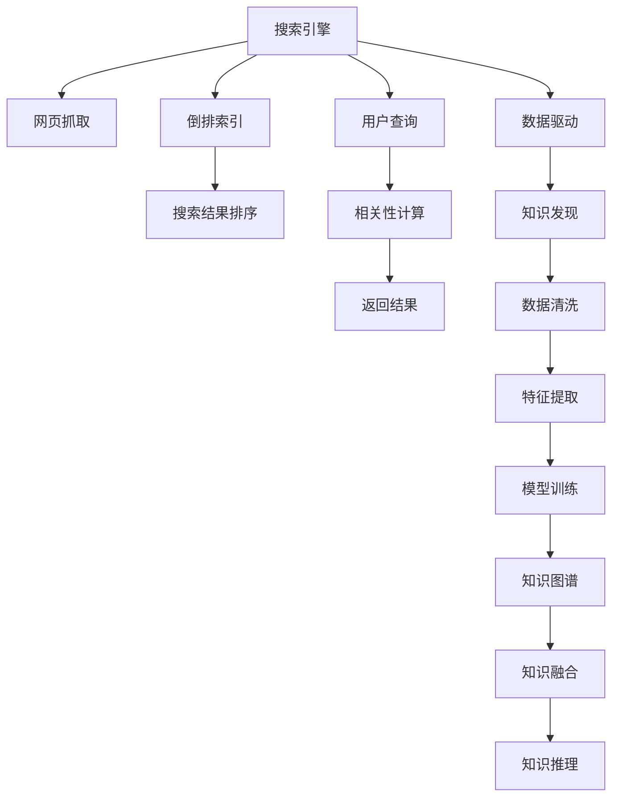

                 

# 从搜索引擎到知识发现引擎：技术的飞跃

## 1. 背景介绍

在互联网发展的早期，搜索引擎成为了用户获取信息的主要途径。它们以网页的匹配度为依据，尽可能提供用户最相关的搜索结果。然而，随着信息量的爆炸式增长，仅依赖网页匹配已无法满足用户的查询需求。因此，搜索引擎的职能被重新定义，从简单的网页索引转向了复杂的知识发现。

本文章将从搜索引擎的原理、演变和挑战出发，探讨其向知识发现引擎的飞跃过程，并分析这一技术变革背后的核心算法和应用实践。

## 2. 核心概念与联系

### 2.1 核心概念概述

为了更好地理解从搜索引擎到知识发现引擎的技术演变，本节将介绍几个关键概念：

- **搜索引擎（Search Engine）**：利用爬虫技术收集网页内容，并根据关键词匹配度进行排序的自动化信息检索工具。
- **知识发现（Knowledge Discovery）**：通过数据挖掘和机器学习技术，从大量数据中提取有用信息、知识或模式的过程。
- **自然语言处理（NLP）**：专注于计算机理解和生成人类语言的科学和技术。
- **深度学习（Deep Learning）**：通过模拟人脑的神经网络进行学习，解决复杂问题的高级机器学习算法。
- **预训练语言模型（Pre-trained Language Models）**：使用大规模语料进行训练，学习语言通用表示的模型，如BERT、GPT-3等。
- **知识图谱（Knowledge Graph）**：以节点和边为核心的结构化数据存储方式，用于表示实体和关系。

这些概念共同构成了从搜索引擎到知识发现引擎的技术框架，使得信息检索和知识抽取更加精准、全面。

### 2.2 核心概念原理和架构的 Mermaid 流程图



## 3. 核心算法原理 & 具体操作步骤

### 3.1 算法原理概述

基于深度学习的知识发现引擎，其核心算法原理可以归结为以下几个步骤：

1. **数据收集与预处理**：从互联网和各类数据库中获取结构化和非结构化数据，并进行清洗和特征提取。
2. **模型训练**：使用预训练语言模型（如BERT、GPT-3）在大规模语料上进行训练，学习语言的通用表示。
3. **知识抽取**：从训练好的模型中抽取实体和关系，构建知识图谱。
4. **知识融合与推理**：将知识图谱中的实体和关系与自然语言信息融合，进行知识推理和查询。

### 3.2 算法步骤详解

**Step 1: 数据收集与预处理**

- **数据源**：互联网网页、社交媒体、百科全书、科学文献等。
- **数据收集**：使用爬虫技术获取数据，并进行清洗、去重和标注。
- **特征提取**：使用NLP技术提取文本的关键词、实体、关系等特征。

**Step 2: 模型训练**

- **模型选择**：选择预训练语言模型如BERT、GPT-3等，进行微调或微预训练。
- **训练数据**：准备标注数据集，用于模型微调。
- **微调过程**：根据任务类型，选择合适的任务适配层，使用AdamW等优化算法进行训练，并设置合适的学习率、批大小等参数。

**Step 3: 知识抽取**

- **实体识别**：使用命名实体识别（NER）模型识别文本中的实体。
- **关系抽取**：使用关系抽取模型识别文本中的关系。
- **实体关系存储**：将抽取的实体和关系存储到知识图谱中。

**Step 4: 知识融合与推理**

- **知识图谱构建**：将抽取的实体和关系构建为知识图谱。
- **知识推理**：使用图神经网络（GNN）进行知识推理，获取实体之间的潜在关系。
- **查询处理**：根据用户查询，在知识图谱中进行推理，返回结果。

### 3.3 算法优缺点

基于深度学习的知识发现引擎具备以下优点：

- **自动性高**：使用预训练模型和自动化算法，能够快速处理大量数据。
- **精度高**：深度学习模型在特征提取和知识推理方面表现优异，能够提取深层次的语义信息。
- **泛化能力强**：预训练模型在多种数据集上的表现都很优秀，具有良好的泛化能力。

同时，它也存在一些缺点：

- **计算资源消耗大**：深度学习模型参数量庞大，训练和推理都需要高性能硬件支持。
- **数据依赖性高**：模型效果依赖于高质量的数据标注和预训练数据。
- **黑盒性质**：深度学习模型通常难以解释其内部决策逻辑，缺乏透明度。

### 3.4 算法应用领域

基于深度学习的知识发现引擎已经在多个领域得到了广泛应用，包括但不限于：

- **金融分析**：从新闻、公告等文本中抽取财务数据，辅助投资决策。
- **医疗诊断**：从电子病历中提取疾病信息和患者关系，辅助诊断和治疗。
- **智能客服**：利用用户历史记录和语义理解，提供个性化的客服支持。
- **供应链管理**：从订单、库存等数据中提取实体和关系，优化供应链流程。
- **安全监测**：从社交媒体、网络日志中抽取潜在威胁，提供实时安全预警。

## 4. 数学模型和公式 & 详细讲解 & 举例说明

### 4.1 数学模型构建

本节将使用数学语言对知识发现引擎的构建过程进行描述。

假设原始文本数据为 $\{x_i\}_{i=1}^N$，其中每个文本 $x_i$ 包含 $n$ 个词，构成向量 $\mathbf{x}_i = [x_{i1}, x_{i2}, \ldots, x_{in}]$。设 $y_i = (y_{i1}, y_{i2}, \ldots, y_{im})$ 为 $x_i$ 的实体向量，其中 $y_{ij}$ 表示 $x_i$ 中是否包含第 $j$ 个实体。知识图谱中的实体关系为 $\mathcal{R}$，假设 $x_i$ 与 $x_j$ 之间的边关系为 $r_{ij} \in \mathcal{R}$，构建知识图谱的过程可以表示为：

$$
\mathcal{G} = \{(x_i, r_{ij}, x_j)\}_{i,j}
$$

### 4.2 公式推导过程

在知识图谱构建过程中，需要使用知识抽取模型来识别实体和关系。以命名实体识别（NER）为例，使用BERT作为预训练模型，设 $M_{\theta}$ 为微调后的BERT模型，则 $M_{\theta}$ 在文本 $x_i$ 上的输出为 $\hat{y}_i = M_{\theta}(x_i)$，其中 $\hat{y}_i$ 为 $x_i$ 中每个词的标签向量，表示是否为实体。

使用交叉熵损失函数，对每个词进行分类，损失函数为：

$$
\mathcal{L}_{i} = -\sum_{k=1}^n [y_{ik}\log(\hat{y}_{ik}) + (1-y_{ik})\log(1-\hat{y}_{ik})]
$$

将所有文本的损失函数求和，得到整体损失函数：

$$
\mathcal{L} = \frac{1}{N} \sum_{i=1}^N \mathcal{L}_i
$$

通过反向传播算法，更新模型参数 $\theta$，最小化损失函数 $\mathcal{L}$，得到最优的实体识别模型。

### 4.3 案例分析与讲解

以医疗领域的知识发现为例，使用BERT模型进行命名实体识别和关系抽取。假设医疗数据集包含电子病历的文本数据，目标是从文本中抽取疾病名称、症状、药品等信息。使用BERT模型进行微调，得到实体识别模型，对每个电子病历进行标注，如表所示：

| 病历ID | 疾病名称 | 症状 | 药品 | 医生 | 检查结果 |
| ------ | -------- | ---- | ---- | ---- | -------- |
| 1      | 高血压  | 头晕  | 阿司匹林 | 张医生 | 正常    |
| 2      | 糖尿病  | 口渴  | 二甲双胍 | 李医生 | 异常    |

将标注后的数据输入BERT模型，使用微调后的模型进行实体识别，得到每个词的实体向量 $\hat{y}_i$，计算每个词为实体的概率 $P(y_{ij})$。将概率大于阈值的词作为实体，构建知识图谱，存储到关系型数据库中。

## 5. 项目实践：代码实例和详细解释说明

### 5.1 开发环境搭建

在进行知识发现引擎的开发前，需要准备开发环境。以下是使用Python和PyTorch搭建开发环境的步骤：

1. 安装Anaconda：从官网下载并安装Anaconda，用于创建独立的Python环境。
2. 创建并激活虚拟环境：
```bash
conda create -n knowledge-discovery python=3.8 
conda activate knowledge-discovery
```
3. 安装PyTorch：根据CUDA版本，从官网获取对应的安装命令。例如：
```bash
conda install pytorch torchvision torchaudio cudatoolkit=11.1 -c pytorch -c conda-forge
```
4. 安装Transformers库：
```bash
pip install transformers
```
5. 安装各类工具包：
```bash
pip install numpy pandas scikit-learn matplotlib tqdm jupyter notebook ipython
```

完成上述步骤后，即可在`knowledge-discovery`环境中开始开发。

### 5.2 源代码详细实现

以下是使用BERT模型进行命名实体识别和关系抽取的PyTorch代码实现：

```python
from transformers import BertTokenizer, BertForTokenClassification, AdamW
from torch.utils.data import Dataset, DataLoader
import torch

class MedicalDataset(Dataset):
    def __init__(self, texts, tags):
        self.texts = texts
        self.tags = tags
        self.tokenizer = BertTokenizer.from_pretrained('bert-base-cased')
        self.max_len = 128
        
    def __len__(self):
        return len(self.texts)
    
    def __getitem__(self, item):
        text = self.texts[item]
        tags = self.tags[item]
        
        encoding = self.tokenizer(text, return_tensors='pt', max_length=self.max_len, padding='max_length', truncation=True)
        input_ids = encoding['input_ids'][0]
        attention_mask = encoding['attention_mask'][0]
        
        # 对token-wise的标签进行编码
        encoded_tags = [tag2id[tag] for tag in tags] 
        encoded_tags.extend([tag2id['O']] * (self.max_len - len(encoded_tags)))
        labels = torch.tensor(encoded_tags, dtype=torch.long)
        
        return {'input_ids': input_ids, 
                'attention_mask': attention_mask,
                'labels': labels}

# 标签与id的映射
tag2id = {'O': 0, 'B-DISEASE': 1, 'I-DISEASE': 2, 'B-SYMPTOM': 3, 'I-SYMPTOM': 4, 'B-MEDICATION': 5, 'I-MEDICATION': 6, 'B-DOCTOR': 7, 'I-DOCTOR': 8, 'B-RESULT': 9, 'I-RESULT': 10}
id2tag = {v: k for k, v in tag2id.items()}

# 创建dataset
tokenizer = BertTokenizer.from_pretrained('bert-base-cased')

train_dataset = MedicalDataset(train_texts, train_tags)
dev_dataset = MedicalDataset(dev_texts, dev_tags)
test_dataset = MedicalDataset(test_texts, test_tags)

# 定义模型和优化器
model = BertForTokenClassification.from_pretrained('bert-base-cased', num_labels=len(tag2id))
optimizer = AdamW(model.parameters(), lr=2e-5)

# 定义训练和评估函数
device = torch.device('cuda') if torch.cuda.is_available() else torch.device('cpu')
model.to(device)

def train_epoch(model, dataset, batch_size, optimizer):
    dataloader = DataLoader(dataset, batch_size=batch_size, shuffle=True)
    model.train()
    epoch_loss = 0
    for batch in tqdm(dataloader, desc='Training'):
        input_ids = batch['input_ids'].to(device)
        attention_mask = batch['attention_mask'].to(device)
        labels = batch['labels'].to(device)
        model.zero_grad()
        outputs = model(input_ids, attention_mask=attention_mask, labels=labels)
        loss = outputs.loss
        epoch_loss += loss.item()
        loss.backward()
        optimizer.step()
    return epoch_loss / len(dataloader)

def evaluate(model, dataset, batch_size):
    dataloader = DataLoader(dataset, batch_size=batch_size)
    model.eval()
    preds, labels = [], []
    with torch.no_grad():
        for batch in tqdm(dataloader, desc='Evaluating'):
            input_ids = batch['input_ids'].to(device)
            attention_mask = batch['attention_mask'].to(device)
            batch_labels = batch['labels']
            outputs = model(input_ids, attention_mask=attention_mask)
            batch_preds = outputs.logits.argmax(dim=2).to('cpu').tolist()
            batch_labels = batch_labels.to('cpu').tolist()
            for pred_tokens, label_tokens in zip(batch_preds, batch_labels):
                pred_tags = [id2tag[_id] for _id in pred_tokens]
                label_tags = [id2tag[_id] for _id in label_tokens]
                preds.append(pred_tags[:len(label_tokens)])
                labels.append(label_tags)
                
    print(classification_report(labels, preds))

# 训练流程
epochs = 5
batch_size = 16

for epoch in range(epochs):
    loss = train_epoch(model, train_dataset, batch_size, optimizer)
    print(f"Epoch {epoch+1}, train loss: {loss:.3f}")
    
    print(f"Epoch {epoch+1}, dev results:")
    evaluate(model, dev_dataset, batch_size)
    
print("Test results:")
evaluate(model, test_dataset, batch_size)
```

### 5.3 代码解读与分析

让我们再详细解读一下关键代码的实现细节：

**MedicalDataset类**：
- `__init__`方法：初始化文本、标签、分词器等关键组件。
- `__len__`方法：返回数据集的样本数量。
- `__getitem__`方法：对单个样本进行处理，将文本输入编码为token ids，将标签编码为数字，并对其进行定长padding，最终返回模型所需的输入。

**tag2id和id2tag字典**：
- 定义了标签与数字id之间的映射关系，用于将token-wise的预测结果解码回真实的标签。

**训练和评估函数**：
- 使用PyTorch的DataLoader对数据集进行批次化加载，供模型训练和推理使用。
- 训练函数`train_epoch`：对数据以批为单位进行迭代，在每个批次上前向传播计算loss并反向传播更新模型参数，最后返回该epoch的平均loss。
- 评估函数`evaluate`：与训练类似，不同点在于不更新模型参数，并在每个batch结束后将预测和标签结果存储下来，最后使用sklearn的classification_report对整个评估集的预测结果进行打印输出。

**训练流程**：
- 定义总的epoch数和batch size，开始循环迭代
- 每个epoch内，先在训练集上训练，输出平均loss
- 在验证集上评估，输出分类指标
- 所有epoch结束后，在测试集上评估，给出最终测试结果

可以看到，PyTorch配合Transformers库使得BERT微调的代码实现变得简洁高效。开发者可以将更多精力放在数据处理、模型改进等高层逻辑上，而不必过多关注底层的实现细节。

## 6. 实际应用场景

### 6.1 医疗知识发现

基于知识发现引擎的医学知识抽取和整合，可以显著提升医疗信息的自动化处理能力，辅助医生诊疗和医学研究。

具体而言，可以收集医院和科研机构提供的电子病历、临床研究数据、医学文献等文本数据，进行实体识别和关系抽取，构建医学知识图谱。医生可以通过查询图谱中的疾病、药品等信息，快速找到相关病例和研究成果，提升诊疗水平。此外，知识图谱还可以辅助医学研究的论文写作和数据验证，促进医学知识的传播和利用。

### 6.2 金融风险监测

金融领域需要对大量的新闻、公告、社交媒体等文本数据进行实时分析，以识别潜在的金融风险。知识发现引擎可以帮助金融机构构建动态的知识图谱，实时监测和预测金融风险。

通过爬虫技术获取金融数据，进行实体识别和关系抽取，构建知识图谱。在图谱中加入公司、股票、交易等实体和关系，实时监测公司财务数据、新闻舆情等变化，进行风险预警和决策支持。例如，当某公司发布负面新闻时，知识图谱可以实时更新相关实体关系，系统自动提醒风险管理部门采取措施，避免风险扩散。

### 6.3 智能客服

在电商、在线服务等领域，智能客服已经成为提升客户体验的重要手段。知识发现引擎可以构建基于NLP技术的智能客服系统，通过自动理解和生成自然语言，提供个性化的服务支持。

智能客服系统通过分析用户历史记录、浏览行为等数据，抽取实体和关系，构建知识图谱。当用户提出问题时，系统自动进行语义理解，在图谱中搜索相关知识，提供准确的答案和建议。例如，用户询问“请问如何退货？”，系统可以通过图谱抽取相关流程和政策，自动生成答案，提升客户满意度。

### 6.4 未来应用展望

随着知识发现引擎技术的不断发展，其在更多领域的应用前景愈发广阔。

- **智能制造**：在制造业中，知识发现引擎可以辅助生产计划、质量控制、设备维护等环节，提高生产效率和质量。
- **智能农业**：在农业领域，知识发现引擎可以帮助农民分析气象数据、土壤信息等，提供科学种植建议，提升农作物的产量和质量。
- **智能交通**：在交通领域，知识发现引擎可以辅助路线规划、事故预测、交通管理等，提升交通系统的运行效率和安全性。
- **智慧城市**：在城市治理中，知识发现引擎可以辅助公共安全、环保监测、应急管理等，提升城市管理的智能化水平。

未来，知识发现引擎将与大数据、人工智能等技术深度融合，为各行各业提供智能化的知识服务，推动社会经济的持续发展。

## 7. 工具和资源推荐

### 7.1 学习资源推荐

为了帮助开发者系统掌握知识发现引擎的理论基础和实践技巧，这里推荐一些优质的学习资源：

1. 《深度学习》书籍：由Ian Goodfellow等人所著，全面介绍了深度学习的理论、算法和应用。
2. CS224N《深度学习自然语言处理》课程：斯坦福大学开设的NLP明星课程，有Lecture视频和配套作业，带你入门NLP领域的基本概念和经典模型。
3. 《NLP实战》书籍：由自然语言处理领域的专家撰写，涵盖NLP技术在医疗、金融等领域的应用实践。
4. Weights & Biases：模型训练的实验跟踪工具，可以记录和可视化模型训练过程中的各项指标，方便对比和调优。
5. TensorBoard：TensorFlow配套的可视化工具，可实时监测模型训练状态，并提供丰富的图表呈现方式。

通过对这些资源的学习实践，相信你一定能够快速掌握知识发现引擎的精髓，并用于解决实际的NLP问题。

### 7.2 开发工具推荐

高效的开发离不开优秀的工具支持。以下是几款用于知识发现引擎开发的常用工具：

1. PyTorch：基于Python的开源深度学习框架，灵活动态的计算图，适合快速迭代研究。大部分预训练语言模型都有PyTorch版本的实现。
2. TensorFlow：由Google主导开发的开源深度学习框架，生产部署方便，适合大规模工程应用。同样有丰富的预训练语言模型资源。
3. Transformers库：HuggingFace开发的NLP工具库，集成了众多SOTA语言模型，支持PyTorch和TensorFlow，是进行知识发现任务开发的利器。
4. Weights & Biases：模型训练的实验跟踪工具，可以记录和可视化模型训练过程中的各项指标，方便对比和调优。
5. TensorBoard：TensorFlow配套的可视化工具，可实时监测模型训练状态，并提供丰富的图表呈现方式。

合理利用这些工具，可以显著提升知识发现引擎的开发效率，加快创新迭代的步伐。

### 7.3 相关论文推荐

知识发现引擎的发展源于学界的持续研究。以下是几篇奠基性的相关论文，推荐阅读：

1. Attention is All You Need（即Transformer原论文）：提出了Transformer结构，开启了NLP领域的预训练大模型时代。
2. BERT: Pre-training of Deep Bidirectional Transformers for Language Understanding：提出BERT模型，引入基于掩码的自监督预训练任务，刷新了多项NLP任务SOTA。
3. Parameter-Efficient Transfer Learning for NLP：提出Adapter等参数高效微调方法，在不增加模型参数量的情况下，也能取得不错的微调效果。
4. Knowledge Graph Embedding and Reasoning：通过将实体和关系表示为向量，实现知识图谱的推理和查询。
5. Graph Neural Networks：提出图神经网络，用于处理知识图谱中的实体和关系，进行知识推理。

这些论文代表了大语言模型微调技术的发展脉络。通过学习这些前沿成果，可以帮助研究者把握学科前进方向，激发更多的创新灵感。

## 8. 总结：未来发展趋势与挑战

### 8.1 总结

本文对从搜索引擎到知识发现引擎的技术飞跃进行了全面系统的介绍。首先阐述了搜索引擎的原理、演变和挑战，明确了其向知识发现引擎的转变过程。其次，从原理到实践，详细讲解了知识发现引擎的数学模型和核心算法，给出了微调任务开发的完整代码实例。同时，本文还广泛探讨了知识发现引擎在医疗、金融、智能客服等多个领域的应用前景，展示了知识发现引擎的巨大潜力。此外，本文精选了知识发现引擎的学习资源和开发工具，力求为开发者提供全方位的技术指引。

通过本文的系统梳理，可以看到，从搜索引擎到知识发现引擎的技术飞跃，深刻改变了信息检索和知识抽取的方式，推动了人工智能技术在多领域的深入应用。这一技术变革，不仅提升了信息处理的效率和精度，还极大地丰富了人工智能的应用场景，为构建智能化的知识服务体系提供了新的动力。

### 8.2 未来发展趋势

展望未来，知识发现引擎将呈现以下几个发展趋势：

1. **跨领域融合**：知识发现引擎将与大数据、人工智能等技术深度融合，形成多模态、跨领域的信息抽取和推理系统。例如，结合图像、语音等多模态数据，提升知识抽取的全面性和准确性。
2. **实时化处理**：知识发现引擎将向实时化、动态化方向发展，实时处理和分析海量数据，提供即时的知识服务。例如，在金融、智能制造等领域，需要实时监测和预测风险，知识发现引擎需具备快速响应和处理能力。
3. **可解释性增强**：知识发现引擎将加强可解释性研究，通过可视化、因果分析等手段，提升系统的透明度和可信度。例如，在医疗、金融等领域，知识发现引擎的输出结果需具有较高的可解释性，便于人工审核和监管。
4. **用户交互优化**：知识发现引擎将通过人机交互优化技术，提升用户体验和系统响应速度。例如，在智能客服系统中，知识图谱将结合用户历史记录和实时输入，动态生成自然语言回答，提升用户满意度。
5. **伦理和隐私保护**：知识发现引擎将重视伦理和隐私保护，确保知识抽取和推理过程符合法律法规和伦理标准。例如，在医疗和金融等领域，需严格保护数据隐私和用户信息，确保知识抽取过程的透明性和公正性。

### 8.3 面临的挑战

尽管知识发现引擎技术已经取得了瞩目成就，但在迈向更加智能化、普适化应用的过程中，它仍面临诸多挑战：

1. **数据质量和规模**：高质量、大规模的数据是知识发现引擎的基础，但数据的获取、清洗和标注往往需要大量的人力和资源。如何高效、低成本地获取高质量数据，仍是技术发展的一大难题。
2. **模型复杂度**：知识发现引擎的模型参数量庞大，训练和推理都需要高性能硬件支持，导致系统复杂度和成本高。如何降低模型复杂度，提升推理效率，是需要解决的重要问题。
3. **跨领域泛化能力**：不同领域的数据结构和语义模式差异较大，知识发现引擎在跨领域泛化方面仍存在一定挑战。如何提升模型的通用性和可移植性，需要更多跨学科的研究和实践。
4. **知识图谱构建**：知识图谱的构建和维护是知识发现引擎的核心环节，但图谱的复杂度和实时性要求高，构建和维护过程繁琐且成本高。如何自动化、高效化地构建知识图谱，提升图谱的实时性和可用性，是需要突破的关键技术。
5. **伦理和法律合规**：知识发现引擎在数据使用和知识抽取过程中，需严格遵守法律法规和伦理标准，确保数据隐私和用户权益。如何在模型训练和推理过程中，避免偏见和歧视，确保系统的公平性和透明性，仍是需要深入研究的重要课题。

### 8.4 研究展望

面对知识发现引擎面临的种种挑战，未来的研究需要在以下几个方面寻求新的突破：

1. **自动化数据处理**：探索自动化数据清洗、标注和预处理技术，提高数据处理效率和质量。例如，利用自然语言处理技术自动标注文本数据，提升标注效率和准确性。
2. **参数高效模型**：开发更加参数高效的模型，减少模型复杂度，提升推理效率。例如，利用知识蒸馏技术，将大规模知识图谱压缩为小型模型，提升实时处理能力。
3. **跨领域知识融合**：探索跨领域知识融合技术，提升模型在不同领域之间的泛化能力。例如，结合知识图谱和多模态数据，提升模型的多领域适应性。
4. **可解释性增强**：开发可解释性增强技术，提升模型的透明性和可信度。例如，利用因果分析方法和可视化技术，解释模型的内部推理过程，提升系统的可解释性。
5. **伦理和法律合规**：加强伦理和法律合规研究，确保知识发现引擎的应用符合法律法规和伦理标准。例如，开发隐私保护技术，确保数据使用的透明性和公平性，避免算法偏见和歧视。

这些研究方向的探索，必将引领知识发现引擎技术迈向更高的台阶，为构建安全、可靠、可解释、可控的智能系统铺平道路。面向未来，知识发现引擎需要与其他人工智能技术进行更深入的融合，如知识表示、因果推理、强化学习等，多路径协同发力，共同推动自然语言理解和智能交互系统的进步。只有勇于创新、敢于突破，才能不断拓展语言模型的边界，让智能技术更好地造福人类社会。

## 9. 附录：常见问题与解答

**Q1：知识发现引擎与搜索引擎有什么区别？**

A: 知识发现引擎与搜索引擎的主要区别在于信息检索的方式和深度。搜索引擎主要依赖关键词匹配，进行简单的文本检索。而知识发现引擎通过构建知识图谱，进行复杂的知识抽取和推理，能够提取深层次的语义信息，提供更加全面和准确的信息服务。

**Q2：知识发现引擎在医疗领域的应用前景是什么？**

A: 知识发现引擎在医疗领域的应用前景非常广阔，包括但不限于：
1. **医学知识抽取**：从电子病历、医学文献等文本数据中抽取疾病、药品、症状等信息，构建医学知识图谱，辅助医疗研究和临床决策。
2. **医疗知识融合**：将医疗知识图谱与NLP技术结合，提供智能化的医学文献阅读、研究数据验证等服务，提升科研效率和质量。
3. **智能诊疗**：通过医疗知识图谱和实时数据分析，辅助医生进行疾病诊断、治疗方案推荐等，提升诊疗水平。
4. **医疗知识推理**：利用图神经网络等技术，在知识图谱中进行推理和预测，提供个性化的医疗建议和治疗方案。

**Q3：知识发现引擎在金融领域的应用前景是什么？**

A: 知识发现引擎在金融领域的应用前景也非常广阔，包括但不限于：
1. **金融市场分析**：从新闻、公告、社交媒体等文本数据中抽取财务数据、舆情信息等，构建金融知识图谱，辅助市场分析和投资决策。
2. **金融风险监测**：实时监测金融市场动态，识别潜在的风险信号，提供及时的风险预警和决策支持。
3. **金融知识推理**：利用图神经网络等技术，在金融知识图谱中进行推理和预测，提供个性化的投资建议和理财方案。
4. **智能客服**：通过金融知识图谱和NLP技术，提供智能化的客户服务，解答用户咨询，提升客户满意度。

**Q4：知识发现引擎在智能客服中的应用前景是什么？**

A: 知识发现引擎在智能客服中的应用前景非常广泛，包括但不限于：
1. **实体识别**：从用户历史记录、浏览行为等数据中抽取实体和关系，构建知识图谱，提供个性化的服务支持。
2. **知识推理**：利用图神经网络等技术，在知识图谱中进行推理和预测，自动生成自然语言回答，提升服务效率和质量。
3. **用户画像**：结合用户历史记录和实时输入，动态生成用户画像，提供个性化的推荐和建议。
4. **智能对话**：利用NLP技术和知识图谱，进行自然语言处理和对话管理，提供智能化的客服支持，提升用户体验。

**Q5：知识发现引擎在智慧城市中的应用前景是什么？**

A: 知识发现引擎在智慧城市中的应用前景也非常广阔，包括但不限于：
1. **城市事件监测**：从新闻、社交媒体等文本数据中抽取城市事件信息，构建知识图谱，辅助城市管理。
2. **应急响应**：实时监测和预测城市事件，提供及时的应急预警和响应建议，提升城市安全水平。
3. **交通管理**：从交通数据中抽取实体和关系，构建交通知识图谱，提供智能化的交通管理和服务支持。
4. **环境保护**：从环境数据中抽取实体和关系，构建环境保护知识图谱，辅助环境监测和保护决策。

**Q6：知识发现引擎的未来发展趋势是什么？**

A: 知识发现引擎的未来发展趋势包括以下几个方面：
1. **跨领域融合**：知识发现引擎将与大数据、人工智能等技术深度融合，形成多模态、跨领域的信息抽取和推理系统。例如，结合图像、语音等多模态数据，提升知识抽取的全面性和准确性。
2. **实时化处理**：知识发现引擎将向实时化、动态化方向发展，实时处理和分析海量数据，提供即时的知识服务。例如，在金融、智能制造等领域，需要实时监测和预测风险，知识发现引擎需具备快速响应和处理能力。
3. **可解释性增强**：知识发现引擎将加强可解释性研究，通过可视化、因果分析等手段，提升系统的透明度和可信度。例如，在医疗、金融等领域，知识发现引擎的输出结果需具有较高的可解释性，便于人工审核和监管。
4. **用户交互优化**：知识发现引擎将通过人机交互优化技术，提升用户体验和系统响应速度。例如，在智能客服系统中，知识图谱将结合用户历史记录和实时输入，动态生成自然语言回答，提升用户满意度。
5. **伦理和法律合规**：知识发现引擎在数据使用和知识抽取过程中，需严格遵守法律法规和伦理标准，确保数据隐私和用户权益。如何在模型训练和推理过程中，避免偏见和歧视，确保系统的公平性和透明性，仍是需要深入研究的重要课题。

**Q7：知识发现引擎在数据处理和标注方面面临哪些挑战？**

A: 知识发现引擎在数据处理和标注方面面临以下挑战：
1. **数据质量**：高质量、大规模的数据是知识发现引擎的基础，但数据的获取、清洗和标注往往需要大量的人力和资源。如何高效、低成本地获取高质量数据，仍是技术发展的一大难题。
2. **标注成本**：数据标注是知识发现引擎的关键环节，但标注过程繁琐且成本高，特别是在小规模数据集上。如何降低标注成本，提升标注效率，是需要解决的重要问题。
3. **数据多样性**：不同领域的数据结构和语义模式差异较大，如何构建通用的数据处理和标注框架，提升模型在不同领域之间的泛化能力，仍是需要深入研究的重要课题。

通过本文的系统梳理，可以看到，从搜索引擎到知识发现引擎的技术飞跃，深刻改变了信息检索和知识抽取的方式，推动了人工智能技术在多领域的深入应用。这一技术变革，不仅提升了信息处理的效率和精度，还极大地丰富了人工智能的应用场景，为构建智能化的知识服务体系提供了新的动力。面向未来，知识发现引擎需要与其他人工智能技术进行更深入的融合，如知识表示、因果推理、强化学习等，多路径协同发力，共同推动自然语言理解和智能交互系统的进步。只有勇于创新、敢于突破，才能不断拓展语言模型的边界，让智能技术更好地造福人类社会。

