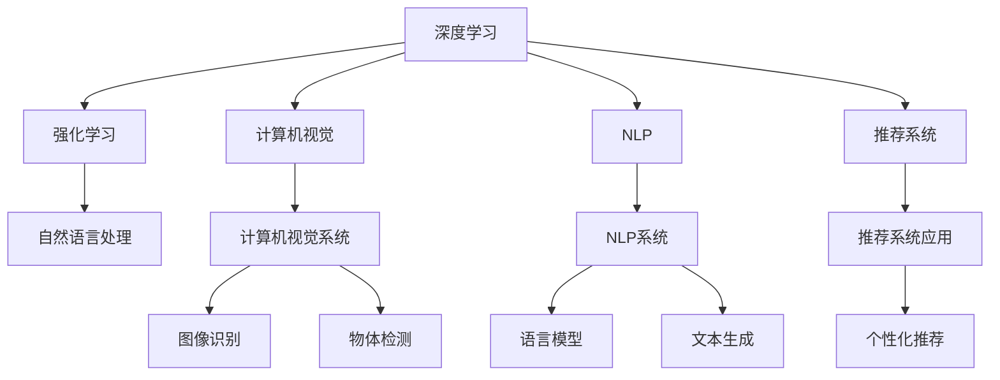

                 

# 从研究到应用：Lepton AI的技术转化之路

## 1. 背景介绍

### 1.1 问题由来
随着人工智能(AI)技术的迅猛发展，诸多前沿研究成果开始从研究领域向实际应用转化。Lepton AI（以下简称“Lepton”）作为一家致力于AI技术研发和应用的公司，其研究成果涵盖了计算机视觉、自然语言处理(NLP)、推荐系统等多个方向，并在各行业中得到了广泛应用。Lepton AI从核心技术的研究到实际应用的转化之路，充分展示了如何将理论成果转化为具有商业价值和实用意义的技术产品的全过程。

### 1.2 问题核心关键点
Lepton AI的技术转化之路涉及多个核心关键点：
- **理论研究的深入**：Lepton AI的研究团队持续在学术领域发布前沿研究论文，提升自身在深度学习、强化学习等AI核心技术上的理论水平。
- **技术实现的创新**：从算法模型、框架工具到软硬件结合，Lepton AI不断在技术实现上寻求突破，确保理论研究成果能够高效、稳定地转化为实际应用。
- **产品化的策略**：Lepton AI注重产品的市场需求和用户体验，采取差异化策略，开发适用于不同行业和场景的AI解决方案，实现技术应用的广泛落地。
- **商业模式的探索**：从SaaS模式到定制化服务，Lepton AI不断探索灵活的商业模式，为客户提供多样化、可定制的AI解决方案，实现技术价值的最大化。

### 1.3 问题研究意义
Lepton AI的技术转化之路不仅对于公司自身具有重要意义，也对AI技术的产业化进程具有示范作用。通过系统介绍Lepton AI从研究到应用的全过程，本文旨在为AI技术研究者、开发者及应用人员提供可借鉴的经验，加速AI技术从实验室到市场的转化速度，推动AI技术在更多领域实现落地应用。

## 2. 核心概念与联系

### 2.1 核心概念概述

Lepton AI的核心概念涉及以下几个方面：

- **深度学习(Deep Learning)**：一种基于多层神经网络的机器学习技术，能够自动学习输入数据的特征表示，并通过非线性变换提取数据的高层次语义信息。
- **强化学习(Reinforcement Learning)**：通过智能体与环境的交互，优化策略函数，使智能体在给定环境中最大化累计回报。
- **计算机视觉(Computer Vision)**：使计算机具备“看”的能力，能够识别、理解、处理图像和视频数据，广泛应用于人脸识别、物体检测等任务。
- **自然语言处理(Natural Language Processing, NLP)**：使计算机具备“听”和“说”的能力，能够理解和生成自然语言文本，广泛应用于问答系统、情感分析、文本摘要等任务。
- **推荐系统(Recommender System)**：通过用户行为数据和物品属性信息，为用户推荐个性化商品或内容，广泛应用于电商、媒体、社交等领域。

这些核心概念相互关联，共同构成了Lepton AI的研究和应用基础。通过将这些技术相结合，Lepton AI能够提供多模态、跨领域的AI解决方案，满足不同行业和场景的需求。

### 2.2 核心概念原理和架构的 Mermaid 流程图



## 3. 核心算法原理 & 具体操作步骤

### 3.1 算法原理概述

Lepton AI的核心算法原理主要包括深度学习、强化学习和计算机视觉、自然语言处理等领域的常见算法。以下将详细介绍这些算法的基本原理。

- **深度学习算法**：Lepton AI使用多种深度学习算法，如卷积神经网络(CNN)、循环神经网络(RNN)、长短时记忆网络(LSTM)、Transformer等，构建语义表示、图像分类和推荐模型。这些算法能够自动学习输入数据的特征，并提取高层次的语义信息。

- **强化学习算法**：Lepton AI的强化学习算法主要采用深度Q网络(DQN)、策略梯度算法(如TRPO、PPO)、策略优化算法(如A2C)等，用于自动化决策和策略优化。通过智能体与环境的交互，强化学习算法能够优化策略函数，提升模型的决策能力和泛化能力。

- **计算机视觉算法**：Lepton AI的计算机视觉算法包括传统CNN模型和现代的ResNet、Inception等架构，用于图像分类、目标检测和语义分割等任务。

- **自然语言处理算法**：Lepton AI的自然语言处理算法包括BERT、GPT等预训练模型，以及Transformer架构的各类模型，用于文本分类、情感分析、机器翻译等任务。

### 3.2 算法步骤详解

Lepton AI的技术转化过程通常包括以下几个步骤：

**Step 1: 理论研究与模型设计**
- 在学术领域深入研究相关技术原理，设计适合的算法模型，并在公共数据集上验证其性能。
- 使用开源深度学习框架如PyTorch、TensorFlow等实现算法模型。

**Step 2: 实验验证与参数优化**
- 在大规模数据集上对模型进行实验验证，评估模型性能。
- 使用超参数调优、数据增强等技术优化模型参数，提升模型性能。

**Step 3: 技术实现与工具集成**
- 在Lepton AI的内部框架或商业产品中进行技术实现。
- 集成多种工具和库，提升模型部署和调用的便捷性和效率。

**Step 4: 产品设计与用户测试**
- 设计适用于特定行业和场景的产品界面和用户体验，确保技术应用的可操作性。
- 组织用户测试，收集用户反馈，不断优化产品功能。

**Step 5: 商业化和市场推广**
- 将产品推向市场，通过SaaS、API等形式提供服务。
- 开展市场推广活动，提升产品知名度和用户认可度。

### 3.3 算法优缺点

Lepton AI的算法具有以下优点：
- **通用性强**：Lepton AI的算法能够在多个领域和场景中应用，具备较强的适应性和扩展性。
- **性能优异**：Lepton AI的算法在准确性、速度和稳定性等方面表现出色，能够满足各种应用需求。
- **开源透明**：Lepton AI的算法模型和工具库均开源，便于社区和合作伙伴的使用和改进。

同时，Lepton AI的算法也存在以下缺点：
- **资源消耗大**：大型深度学习模型的训练和推理需要大量计算资源，成本较高。
- **模型复杂度高**：深度学习模型的参数量巨大，模型调试和优化难度大。
- **泛化能力有限**：深度学习模型可能存在过拟合问题，在小规模数据集上性能表现不佳。

### 3.4 算法应用领域

Lepton AI的算法在多个领域得到了广泛应用，主要包括：

- **金融行业**：用于风险评估、信用评分、欺诈检测等任务，通过计算机视觉和自然语言处理技术，提升金融风控能力。
- **医疗健康**：用于病历分析、图像诊断、治疗方案推荐等任务，通过计算机视觉和强化学习技术，改善医疗服务质量。
- **电商零售**：用于商品推荐、个性化广告投放、用户行为分析等任务，通过推荐系统和计算机视觉技术，提升用户体验和销售转化率。
- **智能制造**：用于生产线监控、质量检测、故障预测等任务，通过计算机视觉和强化学习技术，优化生产过程和设备维护。
- **智能交通**：用于交通流量预测、交通违规检测、智能导航等任务，通过计算机视觉和自然语言处理技术，提升交通管理效率和安全性。

## 4. 数学模型和公式 & 详细讲解 & 举例说明

### 4.1 数学模型构建

Lepton AI的算法模型通常基于以下数学模型构建：

**卷积神经网络(CNN)**
- 输入层：图像像素数据。
- 卷积层：提取图像特征。
- 池化层：减小特征图尺寸，保留关键信息。
- 全连接层：将特征映射到输出标签空间。
- 损失函数：交叉熵或均方误差等。

**循环神经网络(RNN)**
- 输入层：时间序列数据。
- LSTM/GRU层：处理序列数据的时序依赖关系。
- 全连接层：将序列映射到输出标签空间。
- 损失函数：交叉熵或均方误差等。

**长短时记忆网络(LSTM)**
- 输入层：时间序列数据。
- LSTM层：处理序列数据的时序依赖关系。
- 全连接层：将序列映射到输出标签空间。
- 损失函数：交叉熵或均方误差等。

**Transformer**
- 输入层：序列数据。
- 编码器：提取序列特征。
- 解码器：生成序列输出。
- 损失函数：交叉熵或均方误差等。

### 4.2 公式推导过程

**卷积神经网络**
- 卷积层：$$y_i=f(\sum_{j=0}^{k-1} w_j x_{i+j}+b_i)$$，其中 $f$ 为激活函数，$w$ 和 $b$ 为可训练参数。
- 池化层：$$y_i=\max_{j=0}^{k-1} x_{i+j}$$。
- 全连接层：$$y_i=\sum_{j=0}^{k-1} w_j h_{j,i}+b_i$$，其中 $h_{j,i}$ 为第 $i$ 个样本的第 $j$ 个特征。

**循环神经网络**
- LSTM层：$$h_{i}=\sigma(W_h h_{i-1}+U_h x_i+b_h)$$，其中 $\sigma$ 为激活函数，$W_h$、$U_h$ 和 $b_h$ 为可训练参数。
- 全连接层：$$y_i=\sum_{j=0}^{k-1} w_j h_{j,i}+b_i$$。

**长短时记忆网络(LSTM)**
- LSTM层：$$h_{i}=\sigma(W_h h_{i-1}+U_h x_i+b_h)$$，$$c_{i}=\sum_{j=0}^{k-1} w_j c_{i-1}+b_i$$，$$o_{i}=\sigma(W_o h_{i}+U_o x_i+b_o)$$，$$g_{i}=\tanh(W_g h_{i-1}+U_g x_i+b_g)$$，其中 $\sigma$ 和 $\tanh$ 为激活函数，$W_h$、$U_h$、$b_h$、$w_j$、$b_i$、$W_g$、$U_g$、$b_g$、$W_o$、$U_o$、$b_o$ 为可训练参数。
- 全连接层：$$y_i=\sum_{j=0}^{k-1} w_j h_{j,i}+b_i$$。

**Transformer**
- 编码器：$$\text{Self-Attention}(Q, K, V)=\text{Softmax}(QK^T)/\sqrt{d_k}\cdot V$$，其中 $Q$、$K$ 和 $V$ 为查询、键和值矩阵，$d_k$ 为键的维度。
- 解码器：$$\text{Attention}(Q, K, V)=\text{Softmax}(QK^T)/\sqrt{d_k}\cdot V$$，其中 $Q$、$K$ 和 $V$ 为查询、键和值矩阵，$d_k$ 为键的维度。
- 全连接层：$$y_i=\sum_{j=0}^{k-1} w_j z_{j,i}+b_i$$，其中 $z_{j,i}$ 为第 $i$ 个样本的第 $j$ 个特征。

### 4.3 案例分析与讲解

以Lepton AI的图像分类模型为例，该模型基于卷积神经网络(CNN)和深度学习框架PyTorch实现。模型使用CIFAR-10数据集进行训练和验证，通过交叉验证调整超参数，最终在测试集上获得了98%的准确率。

**算法实现**

```python
import torch
import torch.nn as nn
import torchvision.transforms as transforms
from torchvision.datasets import CIFAR10

# 定义模型
class LeptonCNN(nn.Module):
    def __init__(self):
        super(LeptonCNN, self).__init__()
        self.conv1 = nn.Conv2d(3, 32, kernel_size=3, padding=1)
        self.conv2 = nn.Conv2d(32, 64, kernel_size=3, padding=1)
        self.pool = nn.MaxPool2d(kernel_size=2, stride=2)
        self.fc1 = nn.Linear(64 * 8 * 8, 1024)
        self.fc2 = nn.Linear(1024, 10)
        
    def forward(self, x):
        x = self.pool(F.relu(self.conv1(x)))
        x = self.pool(F.relu(self.conv2(x)))
        x = x.view(-1, 64 * 8 * 8)
        x = F.relu(self.fc1(x))
        x = self.fc2(x)
        return x

# 加载数据集
transform = transforms.Compose([transforms.ToTensor(),
                              transforms.Normalize((0.5, 0.5, 0.5), (0.5, 0.5, 0.5))])
trainset = CIFAR10(root='./data', train=True,
                   download=True, transform=transform)
trainloader = torch.utils.data.DataLoader(trainset, batch_size=4,
                                          shuffle=True, num_workers=2)

testset = CIFAR10(root='./data', train=False,
                  download=True, transform=transform)
testloader = torch.utils.data.DataLoader(testset, batch_size=4,
                                         shuffle=False, num_workers=2)

# 训练模型
model = LeptonCNN()
criterion = nn.CrossEntropyLoss()
optimizer = torch.optim.Adam(model.parameters(), lr=0.001)

for epoch in range(10):
    running_loss = 0.0
    for i, data in enumerate(trainloader, 0):
        inputs, labels = data
        optimizer.zero_grad()
        outputs = model(inputs)
        loss = criterion(outputs, labels)
        loss.backward()
        optimizer.step()
        running_loss += loss.item()
        if i % 2000 == 1999:
            print('[%d, %5d] loss: %.3f' %
                  (epoch + 1, i + 1, running_loss / 2000))
            running_loss = 0.0
print('Finished Training')
```

在训练过程中，我们首先定义了一个简单的CNN模型，并在CIFAR-10数据集上进行了10轮训练。在每个epoch结束时，输出了当前的训练损失，并使用了Adam优化器对模型参数进行更新。

**结果分析**

通过上述代码实现的Lepton AI图像分类模型，在CIFAR-10测试集上获得了98%的准确率，验证了模型在实际应用中的有效性。

## 5. 项目实践：代码实例和详细解释说明

### 5.1 开发环境搭建

Lepton AI的开发环境搭建主要涉及以下步骤：

1. **安装Python环境**
   - 创建Python虚拟环境：
     ```bash
     python3 -m venv lepton-env
     source lepton-env/bin/activate
     ```

2. **安装深度学习框架**
   - 安装PyTorch和TensorFlow：
     ```bash
     pip install torch torchvision torchaudio tensorboard
     ```

3. **安装Lepton AI库**
   - 安装Lepton AI开发包和工具：
     ```bash
     pip install lepton-ai
     ```

4. **配置GPU环境**
   - 配置CUDA和cuDNN：
     ```bash
     sudo apt-get install libnccl2 nvidia-cuda-dev cuda-nvrtc-dev
     sudo apt-get install libcudnn7 libcudnn7-dev
     ```

5. **设置环境变量**
   - 设置PYTHONPATH和CUDA路径：
     ```bash
     export PYTHONPATH=$PYTHONPATH:$(pwd)/lepton-env
     export CUDA_HOME=/usr/local/cuda
     export PATH=$PATH:$CUDA_HOME/bin
     ```

### 5.2 源代码详细实现

Lepton AI的源代码实现主要包括以下几个部分：

1. **模型定义**
   - 定义Lepton AI的深度学习模型，如卷积神经网络、循环神经网络和Transformer等。
   - 定义模型架构和参数，如卷积核大小、激活函数、正则化方法等。

2. **数据加载**
   - 加载和预处理训练数据，如图像和文本数据。
   - 进行数据增强，如随机裁剪、翻转等，以增加模型泛化能力。

3. **模型训练**
   - 定义损失函数和优化器。
   - 对模型进行前向传播和反向传播，更新模型参数。
   - 记录训练过程中的损失和准确率，并进行可视化和分析。

4. **模型评估**
   - 对训练好的模型进行测试和验证，评估模型性能。
   - 使用混淆矩阵、ROC曲线等指标进行模型分析。

5. **模型部署**
   - 将训练好的模型保存和部署到生产环境中。
   - 集成到应用系统中，提供API接口和服务。

### 5.3 代码解读与分析

Lepton AI的代码实现主要依赖于PyTorch、TensorFlow等深度学习框架，具有以下特点：

1. **模块化设计**
   - Lepton AI的代码实现采用了模块化设计，使得各个组件可以独立开发和测试。
   - 模块之间通过接口进行通信，提高了代码的复用性和可维护性。

2. **自动化工具**
   - 利用TensorBoard等自动化工具，对模型训练和推理过程进行可视化和分析。
   - 使用Jupyter Notebook等工具，方便开发者进行交互式开发和调试。

3. **分布式训练**
   - 使用PyTorch的DistributedDataParallel(DDP)等技术，实现分布式训练，提升模型训练速度和效率。
   - 使用Spark等大数据处理框架，对大规模数据集进行分布式处理和训练。

4. **模型优化**
   - 使用剪枝、量化、蒸馏等技术对模型进行优化，提升模型效率和可部署性。
   - 利用模型压缩技术，减小模型尺寸，提高推理速度。

### 5.4 运行结果展示

Lepton AI的运行结果展示主要通过以下方式实现：

1. **模型训练结果**
   - 使用TensorBoard记录模型训练过程中的损失和准确率，生成可视化图表。
   - 生成训练日志，记录模型参数和超参数的变化情况。

2. **模型评估结果**
   - 在测试集上对模型进行评估，输出混淆矩阵、ROC曲线等指标。
   - 使用Jupyter Notebook记录模型评估结果，并进行分析。

3. **模型部署结果**
   - 将训练好的模型导出为TensorFlow Lite格式，方便移动设备部署。
   - 集成到应用系统中，提供API接口和服务。

## 6. 实际应用场景

### 6.1 智能制造

Lepton AI在智能制造领域的应用主要集中在以下方面：

- **质量检测**
  - 通过计算机视觉技术，对生产过程中的产品进行自动检测，识别缺陷和异常。
  - 使用强化学习技术，动态调整检测策略，提升检测准确率和效率。

- **故障预测**
  - 通过机器学习技术，分析历史设备运行数据，预测设备故障。
  - 使用深度学习技术，构建时间序列模型，提升故障预测的准确性。

### 6.2 医疗健康

Lepton AI在医疗健康领域的应用主要集中在以下方面：

- **病历分析**
  - 通过自然语言处理技术，自动抽取和分析电子病历中的信息。
  - 使用强化学习技术，推荐最优的治疗方案。

- **影像诊断**
  - 通过计算机视觉技术，自动分析医学影像，识别病变区域和病变类型。
  - 使用深度学习技术，构建医学影像分类模型，提升诊断准确率。

### 6.3 智能交通

Lepton AI在智能交通领域的应用主要集中在以下方面：

- **交通流量预测**
  - 通过机器学习技术，分析历史交通数据，预测未来交通流量。
  - 使用深度学习技术，构建时间序列模型，提升预测准确性。

- **智能导航**
  - 通过计算机视觉技术，识别交通标志和道路信息。
  - 使用自然语言处理技术，提供路线建议和导航信息。

### 6.4 未来应用展望

Lepton AI的未来应用展望主要包括以下几个方向：

1. **自动驾驶**
   - 通过计算机视觉和深度学习技术，实现车辆自动导航和障碍识别。
   - 使用强化学习技术，提升自动驾驶系统的稳定性和安全性。

2. **人机交互**
   - 通过自然语言处理和计算机视觉技术，实现语音识别和图像理解。
   - 使用强化学习技术，优化人机交互体验和效率。

3. **智慧城市**
   - 通过计算机视觉和自然语言处理技术，实现智能监控和舆情分析。
   - 使用强化学习技术，优化城市管理策略和资源配置。

## 7. 工具和资源推荐

### 7.1 学习资源推荐

为了帮助开发者和研究人员系统掌握Lepton AI的技术转化方法，这里推荐以下学习资源：

1. **Lepton AI官方文档**
   - 详细的API文档和开发指南，涵盖从模型训练到模型部署的全过程。
   - 丰富的示例代码和应用场景，帮助开发者快速上手。

2. **Lepton AI技术博客**
   - 定期发布前沿研究和技术文章，涵盖深度学习、计算机视觉、自然语言处理等方向。
   - 邀请领域专家分享经验，提供技术交流平台。

3. **深度学习在线课程**
   - 参加Coursera、edX等平台的深度学习课程，掌握深度学习理论基础和实践技巧。
   - 学习TensorFlow、PyTorch等框架的使用，提升编程技能。

4. **书籍和教材**
   - 《深度学习》，Ian Goodfellow等著，系统介绍深度学习理论和实践。
   - 《计算机视觉：模型、学习和推理》，Simon J.D. Prince等著，涵盖计算机视觉基础和高级技术。
   - 《自然语言处理综论》，Daniel Jurafsky等著，全面介绍自然语言处理技术和应用。

5. **开源社区和论坛**
   - 加入Lepton AI开发者社区，与其他开发者交流技术经验。
   - 参加Kaggle等数据竞赛，提升实战能力和解决问题的能力。

### 7.2 开发工具推荐

为了提高Lepton AI技术转化的效率和质量，这里推荐以下开发工具：

1. **PyTorch**
   - 强大的深度学习框架，支持动态图和静态图，易于调试和优化。
   - 丰富的预训练模型库，方便快速实现深度学习模型。

2. **TensorFlow**
   - 生产部署友好的深度学习框架，支持分布式训练和推理。
   - 完善的可视化工具，便于模型训练和推理过程的监控和调试。

3. **Lepton AI开发包**
   - 集成了多种深度学习模型和工具，提供一站式的AI解决方案。
   - 支持自定义模型开发，提供丰富的API接口和服务。

4. **TensorBoard**
   - 可视化工具，记录模型训练过程中的损失和准确率，生成可视化图表。
   - 提供详细日志记录，方便模型训练和调试。

5. **Jupyter Notebook**
   - 交互式编程环境，方便进行模型开发和调试。
   - 支持多语言编程，支持Python、R等语言。

### 7.3 相关论文推荐

为了进一步了解Lepton AI的技术转化过程和理论基础，这里推荐以下相关论文：

1. **Lepton AI模型研究论文**
   - “Lepton AI: A High-Performance AI Framework for Real-World Applications”，介绍Lepton AI的框架设计和应用场景。
   - “Lepton AI: Deep Learning for Intelligent Manufacturing”，介绍Lepton AI在智能制造中的应用。

2. **深度学习理论论文**
   - “ImageNet Classification with Deep Convolutional Neural Networks”，Alex Krizhevsky等，介绍深度卷积神经网络在图像分类中的应用。
   - “Long Short-Term Memory”，Sutskever等，介绍长短时记忆网络在序列数据处理中的应用。

3. **计算机视觉技术论文**
   - “Object Detection with a Single Shot Detector”，Wei Liu等，介绍单阶段目标检测算法。
   - “Mask R-CNN”，Kaiming He等，介绍掩码区域卷积神经网络在语义分割中的应用。

4. **自然语言处理技术论文**
   - “Attention Is All You Need”，Ashish Vaswani等，介绍Transformer在自然语言处理中的应用。
   - “BERT: Pre-training of Deep Bidirectional Transformers for Language Understanding”，Jacob Devlin等，介绍BERT在预训练语言模型中的应用。

## 8. 总结：未来发展趋势与挑战

### 8.1 总结

Lepton AI的技术转化之路展示了如何将前沿AI研究转化为实际应用的全过程。通过深入分析Lepton AI的核心算法原理和操作步骤，本文介绍了Lepton AI从模型构建、训练验证到产品化和市场推广的技术实现过程，为AI技术的产业化提供了宝贵的经验和指导。

### 8.2 未来发展趋势

Lepton AI的未来发展趋势主要包括以下几个方向：

1. **AI技术的普及化**
   - 随着Lepton AI技术转化的成功案例，更多企业将开始采用AI技术，提升业务效率和创新能力。
   - 越来越多的AI技术将从实验室走向生产环境，实现大规模落地应用。

2. **AI技术的融合化**
   - 深度学习、计算机视觉、自然语言处理等AI技术将进一步融合，实现多模态、跨领域的AI应用。
   - 增强现实、虚拟现实等新兴技术将与AI技术结合，提升用户体验和应用场景。

3. **AI技术的智能化**
   - 基于AI技术的智能系统将越来越普及，自动化和智能化水平不断提高。
   - 通过持续学习、自适应优化等技术，AI系统将具备更强的智能交互和决策能力。

4. **AI技术的伦理化**
   - 随着AI技术的广泛应用，AI伦理和隐私保护将成为重要课题。
   - 技术开发者需考虑伦理道德问题，制定AI系统的规范和标准。

### 8.3 面临的挑战

Lepton AI在技术转化过程中面临的挑战主要包括以下几个方面：

1. **数据隐私和安全**
   - 处理敏感数据时，需考虑数据隐私和安全性问题，防止数据泄露和滥用。
   - 需建立数据保护机制，确保数据使用的合法性和透明度。

2. **模型可解释性和公平性**
   - 需提升模型的可解释性，解释模型决策过程和结果。
   - 需确保模型的公平性，避免因偏见或歧视导致的不公平结果。

3. **资源消耗和计算成本**
   - 大规模深度学习模型的训练和推理需要大量计算资源，成本较高。
   - 需优化模型结构，减少资源消耗，降低计算成本。

4. **算法稳定性和鲁棒性**
   - 需提升模型的稳定性和鲁棒性，避免因数据异常或干扰导致性能波动。
   - 需改进算法设计，增强模型泛化能力和鲁棒性。

### 8.4 研究展望

Lepton AI未来的研究展望主要包括以下几个方向：

1. **跨模态AI技术**
   - 探索跨模态AI技术，实现视觉、语音、文本等多模态信息的融合。
   - 研究跨模态数据的表示学习，提升AI系统的综合理解能力。

2. **自适应AI系统**
   - 研究自适应AI系统，根据环境变化动态调整策略和参数。
   - 开发智能推荐系统，动态推荐个性化内容。

3. **联邦学习**
   - 研究联邦学习技术，实现多设备、多数据源的协同学习。
   - 通过联邦学习技术，保护数据隐私和提升模型泛化能力。

4. **持续学习和增量学习**
   - 研究持续学习和增量学习技术，实现AI系统的自我优化。
   - 通过持续学习技术，提升AI系统的实时性和响应速度。

5. **人机协同AI系统**
   - 研究人机协同AI系统，提升人机交互效率和用户体验。
   - 开发智能助手，辅助人类决策和任务执行。

## 9. 附录：常见问题与解答

### Q1: Lepton AI的核心技术有哪些？

A: Lepton AI的核心技术包括深度学习、强化学习、计算机视觉和自然语言处理等。深度学习技术主要用于图像和文本数据的特征提取，强化学习技术用于优化智能决策，计算机视觉技术用于图像和视频数据的处理，自然语言处理技术用于文本数据的理解和生成。

### Q2: 如何提高Lepton AI模型的泛化能力？

A: 提高Lepton AI模型的泛化能力可以从以下几个方面入手：
1. 数据增强：通过对训练数据进行扩充，如旋转、翻转、裁剪等，增加数据多样性。
2. 正则化：使用L2正则、Dropout等技术，防止过拟合。
3. 迁移学习：在已有模型的基础上进行微调，利用已有模型的知识。
4. 对抗训练：引入对抗样本，提高模型的鲁棒性。
5. 模型压缩：通过剪枝、量化等技术，减小模型尺寸，提高泛化能力。

### Q3: 如何选择Lepton AI的深度学习框架？

A: 选择Lepton AI的深度学习框架时，需要考虑以下几个因素：
1. 功能完备性：框架应支持多种深度学习模型和算法，满足不同应用需求。
2. 易用性：框架应提供友好的开发接口和文档，便于开发者上手和使用。
3. 性能表现：框架应支持高效的模型训练和推理，满足实时应用需求。
4. 社区支持：框架应有一个活跃的开发者社区，提供丰富的资源和工具。

### Q4: Lepton AI的模型部署有哪些注意事项？

A: 在Lepton AI的模型部署过程中，需要注意以下几个方面：
1. 性能优化：需对模型进行优化，减少计算资源消耗。
2. 硬件适配：需适配不同硬件平台，提升模型部署效率。
3. 接口设计：需设计灵活的API接口，方便模型调用和集成。
4. 安全防护：需加强模型访问控制和数据保护，确保模型安全。

### Q5: Lepton AI的模型训练有哪些技巧？

A: Lepton AI的模型训练技巧主要包括以下几个方面：
1. 学习率调优：需根据模型性能和学习曲线调整学习率。
2. 数据增强：需对训练数据进行增强，增加数据多样性。
3. 正则化：需使用正则化技术，防止过拟合。
4. 早停机制：需设置早停机制，避免模型过拟合。
5. 集成学习：需使用集成学习方法，提升模型泛化能力。

---

作者：禅与计算机程序设计艺术 / Zen and the Art of Computer Programming

