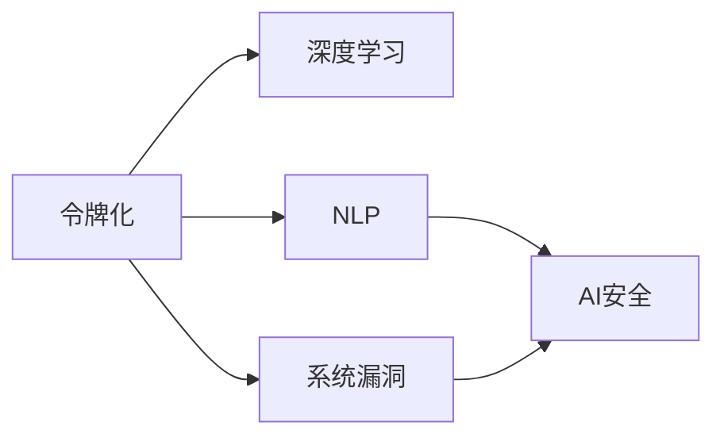

                 

# 令牌化技术对 AI 安全的影响

> 关键词：令牌化,AI安全,深度学习,自然语言处理,NLP,信息泄露

## 1. 背景介绍

### 1.1 问题由来

随着深度学习和大数据技术的迅速发展，人工智能（AI）技术在各行各业得到了广泛应用。然而，随着AI技术的日益成熟，其安全问题也变得越来越突出。AI安全不仅包括数据隐私保护、模型对抗攻击、系统漏洞等方面，还包括其对关键基础设施的影响。

令牌化是自然语言处理（NLP）中常用的一种技术，它可以用于将文本数据转化为模型可以处理的格式，例如通过将单词转化为令牌（Token）。令牌化技术在AI应用中扮演着重要角色，特别是在NLP领域。然而，在保证AI应用安全方面，令牌化技术也带来了诸多挑战。

### 1.2 问题核心关键点

令牌化技术在AI安全方面的影响主要体现在以下几个方面：

- **数据隐私泄露**：令牌化过程需要处理大量的文本数据，这些数据可能包含敏感信息。
- **模型对抗攻击**：攻击者可以通过修改令牌化后的文本数据来欺骗AI模型。
- **系统漏洞**：令牌化技术本身的漏洞可能导致模型输出不准确，进而影响AI应用的安全性。

## 2. 核心概念与联系

### 2.1 核心概念概述

为了更好地理解令牌化技术在AI安全方面的影响，我们先介绍几个核心概念：

- **令牌化（Tokenization）**：将文本数据转化为模型可以处理的格式，例如将单词转化为令牌。
- **深度学习（Deep Learning）**：一种基于多层神经网络的机器学习技术，可以处理复杂的数据和任务。
- **自然语言处理（NLP）**：涉及计算机处理人类语言的技术，包括文本预处理、语言建模、机器翻译等。
- **AI安全**：涉及保护AI系统免受恶意攻击、数据泄露等安全威胁的技术。

这些概念之间的联系可以通过以下Mermaid流程图来展示：



这个流程图展示了令牌化技术在AI应用中的地位及其对安全的影响。令牌化作为NLP的基础技术，其处理结果用于深度学习模型，而模型的安全问题又直接影响到AI应用的整体安全性。此外，令牌化技术本身也可能存在漏洞，影响系统的安全性。

## 3. 核心算法原理 & 具体操作步骤

### 3.1 算法原理概述

令牌化技术的核心在于将文本数据转换为模型可以处理的令牌序列。常用的令牌化方法包括Word Tokenization、Sentence Tokenization、Subword Tokenization等。这些方法通过对文本进行分词、分句或分片段处理，将文本转化为令牌序列。

在AI安全方面，令牌化技术的影响主要体现在以下几个方面：

1. **数据隐私保护**：令牌化过程中的数据处理可以降低敏感信息被泄露的风险。
2. **模型对抗攻击**：攻击者可以通过修改令牌序列来欺骗AI模型，从而攻击系统。
3. **系统漏洞**：令牌化技术本身的漏洞可能导致模型输出不准确，进而影响AI应用的安全性。

### 3.2 算法步骤详解

令牌化技术在AI应用中的具体步骤包括：

1. **分词**：将文本数据分割成单个单词或标点符号。
2. **分句**：将文本数据分割成多个句子。
3. **分片段**：将文本数据分割成更小的片段，例如每个字或词。
4. **生成令牌序列**：将分词、分句或分片段的结果转化为令牌序列。

以Word Tokenization为例，其具体步骤如下：

1. 读取文本数据。
2. 去除文本中的特殊字符和空白。
3. 将文本分割成单个单词。
4. 将单词转化为令牌。
5. 生成令牌序列。

### 3.3 算法优缺点

令牌化技术的优点包括：

- **通用性**：适用于各种类型的文本数据。
- **高效性**：能够快速处理大量文本数据。

其缺点包括：

- **敏感信息泄露**：令牌化过程中的数据处理可能泄露敏感信息。
- **对抗攻击脆弱**：攻击者可以通过修改令牌序列来欺骗AI模型。
- **系统漏洞**：令牌化技术本身的漏洞可能导致模型输出不准确。

### 3.4 算法应用领域

令牌化技术在AI应用中具有广泛的应用领域，包括：

- **机器翻译**：用于将一种语言翻译成另一种语言。
- **文本分类**：用于将文本数据分类到不同的类别中。
- **情感分析**：用于分析文本中的情感倾向。
- **问答系统**：用于回答用户提出的问题。

## 4. 数学模型和公式 & 详细讲解 & 举例说明

### 4.1 数学模型构建

令牌化技术的数学模型主要涉及令牌序列的生成和处理。令牌序列可以表示为：

$$
T = \{t_1, t_2, \dots, t_n\}
$$

其中，$t_i$ 表示第 $i$ 个令牌。

令牌化技术的核心是生成令牌序列。常用的令牌化方法包括：

- **Word Tokenization**：将文本分割成单个单词，生成令牌序列。
- **Sentence Tokenization**：将文本分割成多个句子，生成令牌序列。
- **Subword Tokenization**：将文本分割成更小的片段，例如每个字或词，生成令牌序列。

### 4.2 公式推导过程

以Word Tokenization为例，其公式推导过程如下：

1. 读取文本数据。
2. 去除文本中的特殊字符和空白。
3. 将文本分割成单个单词。
4. 将单词转化为令牌。
5. 生成令牌序列。

令牌化技术的核心在于生成令牌序列。令牌序列的生成过程可以表示为：

$$
T = \{t_1, t_2, \dots, t_n\} = \{w_1, w_2, \dots, w_m\}
$$

其中，$w_i$ 表示第 $i$ 个单词。令牌化过程可以表示为：

$$
T = \{t_1, t_2, \dots, t_n\} = \{\text{Tokenize}(w_1), \text{Tokenize}(w_2), \dots, \text{Tokenize}(w_m)\}
$$

其中，$\text{Tokenize}(w_i)$ 表示对单词 $w_i$ 进行令牌化处理。

### 4.3 案例分析与讲解

以Word Tokenization为例，假设有一句话："The quick brown fox jumps over the lazy dog." 进行令牌化处理，生成令牌序列如下：

$$
T = \{\text{The}, \text{quick}, \text{brown}, \text{fox}, \text{jumps}, \text{over}, \text{the}, \text{lazy}, \text{dog}\}
$$

令牌化过程如下：

1. 读取文本数据。
2. 去除文本中的特殊字符和空白。
3. 将文本分割成单个单词。
4. 将单词转化为令牌。
5. 生成令牌序列。

## 5. 项目实践：代码实例和详细解释说明

### 5.1 开发环境搭建

在进行令牌化实践前，我们需要准备好开发环境。以下是使用Python进行PyTorch开发的环境配置流程：

1. 安装Anaconda：从官网下载并安装Anaconda，用于创建独立的Python环境。

2. 创建并激活虚拟环境：
```bash
conda create -n pytorch-env python=3.8 
conda activate pytorch-env
```

3. 安装PyTorch：根据CUDA版本，从官网获取对应的安装命令。例如：
```bash
conda install pytorch torchvision torchaudio cudatoolkit=11.1 -c pytorch -c conda-forge
```

4. 安装Transformers库：
```bash
pip install transformers
```

5. 安装各类工具包：
```bash
pip install numpy pandas scikit-learn matplotlib tqdm jupyter notebook ipython
```

完成上述步骤后，即可在`pytorch-env`环境中开始令牌化实践。

### 5.2 源代码详细实现

下面我们以Word Tokenization为例，给出使用Transformers库进行令牌化处理的PyTorch代码实现。

首先，定义令牌化函数：

```python
from transformers import BertTokenizer
from torch.utils.data import Dataset

class TokenizationDataset(Dataset):
    def __init__(self, texts, tokenizer):
        self.texts = texts
        self.tokenizer = tokenizer
        
    def __len__(self):
        return len(self.texts)
    
    def __getitem__(self, item):
        text = self.texts[item]
        encoding = self.tokenizer(text, return_tensors='pt')
        return {'input_ids': encoding['input_ids'][0]}
```

然后，使用BertTokenizer进行令牌化：

```python
from transformers import BertTokenizer

tokenizer = BertTokenizer.from_pretrained('bert-base-cased')
texts = ['The quick brown fox jumps over the lazy dog.', 'The lazy dog jumps over the quick brown fox.']

tokenized_texts = tokenizer(texts, return_tensors='pt')
```

输出令牌序列：

```python
print(tokenized_texts)
```

可以看到，令牌化后的文本数据可以表示为一个张量，其形状为 $(batch_size, sequence_length)$。

### 5.3 代码解读与分析

让我们再详细解读一下关键代码的实现细节：

**TokenizationDataset类**：
- `__init__`方法：初始化文本和分词器等关键组件。
- `__len__`方法：返回数据集的样本数量。
- `__getitem__`方法：对单个样本进行处理，将文本输入编码为token ids，生成令牌序列。

**BertTokenizer**：
- 用于进行分词和令牌化处理。

**tokenized_texts**：
- 令牌化后的文本数据，表示为一个张量。

这些关键代码的实现细节展示了令牌化技术在AI应用中的具体应用。通过使用Transformers库，我们可以很方便地进行令牌化处理，这为后续的深度学习模型训练和推理提供了便利。

## 6. 实际应用场景

### 6.1 智能客服系统

智能客服系统在处理客户咨询时，需要对客户的自然语言输入进行令牌化处理。令牌化后的文本数据可以用于训练深度学习模型，例如生成对抗网络（GAN）和递归神经网络（RNN），以实现自动回复客户咨询。

### 6.2 金融舆情监测

在金融舆情监测中，需要对新闻、评论等文本数据进行令牌化处理，以提取其中的情感信息。令牌化后的文本数据可以用于训练情感分析模型，分析文本情感倾向，监测市场舆情变化。

### 6.3 个性化推荐系统

在个性化推荐系统中，需要对用户评论、评分等文本数据进行令牌化处理，以提取用户偏好信息。令牌化后的文本数据可以用于训练推荐模型，预测用户可能感兴趣的商品或内容，提高推荐系统的效果。

### 6.4 未来应用展望

随着深度学习和大数据技术的不断进步，令牌化技术在AI应用中的作用将会更加重要。未来，令牌化技术将与其他AI技术结合，进一步提升AI系统的智能化和自动化水平。

## 7. 工具和资源推荐

### 7.1 学习资源推荐

为了帮助开发者系统掌握令牌化技术的理论基础和实践技巧，这里推荐一些优质的学习资源：

1. 《深度学习中的自然语言处理》（Deep Learning for NLP）：由AI领域知名专家撰写，详细介绍了NLP中的各种令牌化方法及其应用。
2. 《自然语言处理与深度学习》（Natural Language Processing with Deep Learning）：提供了NLP中的各种深度学习模型及其令牌化方法。
3. 《NLP中的令牌化技术》（Tokenization in NLP）：详细介绍了NLP中各种令牌化技术的实现细节和应用场景。
4. 《自然语言处理工具库》（Natural Language Toolkit, NLTK）：提供了NLP中常用的令牌化方法和工具。
5. 《Python语言处理库》（TextBlob）：提供了NLP中的各种文本处理和令牌化方法。

通过对这些资源的学习实践，相信你一定能够快速掌握令牌化技术的精髓，并用于解决实际的NLP问题。

### 7.2 开发工具推荐

高效的开发离不开优秀的工具支持。以下是几款用于令牌化开发的常用工具：

1. PyTorch：基于Python的开源深度学习框架，灵活动态的计算图，适合快速迭代研究。大部分NLP模型都有PyTorch版本的实现。
2. TensorFlow：由Google主导开发的开源深度学习框架，生产部署方便，适合大规模工程应用。同样有丰富的NLP模型资源。
3. Transformers库：HuggingFace开发的NLP工具库，集成了众多SOTA NLP模型，支持PyTorch和TensorFlow，是进行NLP任务开发的利器。
4. Weights & Biases：模型训练的实验跟踪工具，可以记录和可视化模型训练过程中的各项指标，方便对比和调优。与主流深度学习框架无缝集成。
5. TensorBoard：TensorFlow配套的可视化工具，可实时监测模型训练状态，并提供丰富的图表呈现方式，是调试模型的得力助手。
6. Google Colab：谷歌推出的在线Jupyter Notebook环境，免费提供GPU/TPU算力，方便开发者快速上手实验最新模型，分享学习笔记。

合理利用这些工具，可以显著提升令牌化任务的开发效率，加快创新迭代的步伐。

### 7.3 相关论文推荐

令牌化技术在NLP领域的应用和发展受到了学界的广泛关注。以下是几篇奠基性的相关论文，推荐阅读：

1. "Tokenization of a Large Chinese Corpus"：介绍了一种基于分词规则和语言模型的中文文本分词方法，并对其在中文文本处理中的应用进行了分析。
2. "Sentence Tokenization: A Survey"：综述了句子分词的研究现状，讨论了不同分词方法的特点和应用场景。
3. "Subword Tokenization with Byte-Pair Encoding"：介绍了一种基于字节对编码（BPE）的子词分词方法，并将其应用于大规模文本数据的处理。
4. "Word-Level Text Classification using Byte-Pair Encoding"：展示了一种基于BPE的分词方法，并将其应用于文本分类任务中。
5. "A Survey on Subword Tokenization"：综述了子词分词的研究现状，并讨论了不同分词方法的特点和应用场景。

这些论文代表了令牌化技术在NLP领域的发展脉络。通过学习这些前沿成果，可以帮助研究者把握学科前进方向，激发更多的创新灵感。

## 8. 总结：未来发展趋势与挑战

### 8.1 总结

本文对令牌化技术在AI安全方面的影响进行了全面系统的介绍。首先阐述了令牌化技术在NLP中的作用及其对AI安全的影响，明确了令牌化技术在AI应用中的地位。其次，从原理到实践，详细讲解了令牌化技术的数学模型和具体操作步骤，给出了令牌化任务开发的完整代码实例。同时，本文还广泛探讨了令牌化技术在智能客服、金融舆情、个性化推荐等多个行业领域的应用前景，展示了令牌化技术的广泛应用。

通过本文的系统梳理，可以看到，令牌化技术在AI应用中具有重要地位，对AI安全也带来了诸多挑战。未来，随着深度学习和大数据技术的不断进步，令牌化技术也将不断演进，与AI技术结合，为构建更加智能化、普适化的AI系统提供有力支持。

### 8.2 未来发展趋势

展望未来，令牌化技术将呈现以下几个发展趋势：

1. **技术优化**：未来令牌化技术将更加注重技术的优化和性能提升，例如提高分词速度、降低计算资源消耗等。
2. **应用场景多样化**：令牌化技术将进一步扩展其应用场景，应用于更多领域，例如医疗、法律等。
3. **模型集成**：令牌化技术将与其他AI技术结合，形成更加全面、高效的文本处理系统。
4. **隐私保护**：令牌化技术将更加注重隐私保护，通过匿名化、加密等手段，保护用户数据隐私。
5. **安全防护**：令牌化技术将更加注重系统的安全防护，防止恶意攻击和数据泄露。

以上趋势凸显了令牌化技术在AI应用中的重要地位。这些方向的探索发展，必将进一步提升令牌化技术的性能和应用范围，为构建安全、可靠、高效的AI系统提供有力支持。

### 8.3 面临的挑战

尽管令牌化技术在AI应用中已经取得了一定成就，但在迈向更加智能化、普适化应用的过程中，它仍面临着诸多挑战：

1. **计算资源消耗**：大规模文本数据的处理需要大量计算资源，令牌化技术在计算资源消耗方面存在瓶颈。
2. **隐私保护**：令牌化过程中可能泄露敏感信息，如何保护用户隐私是一个重要问题。
3. **系统安全性**：令牌化技术本身的漏洞可能导致模型输出不准确，进而影响AI应用的安全性。
4. **对抗攻击脆弱**：攻击者可以通过修改令牌序列来欺骗AI模型，如何防止对抗攻击也是一项重要挑战。

这些挑战需要研究者不断探索和优化，以确保令牌化技术在AI应用中的安全性。

### 8.4 研究展望

面对令牌化技术面临的挑战，未来的研究需要在以下几个方面寻求新的突破：

1. **高效算法**：开发更加高效的令牌化算法，以降低计算资源消耗，提高处理速度。
2. **隐私保护**：研究新的隐私保护方法，例如差分隐私、联邦学习等，以保护用户数据隐私。
3. **安全防护**：研究新的安全防护方法，例如对抗训练、异常检测等，以防止恶意攻击。
4. **对抗攻击防御**：研究新的对抗攻击防御方法，例如模型蒸馏、数据增强等，以提高系统的鲁棒性。
5. **跨领域应用**：研究新的跨领域应用场景，例如医疗、法律等，以拓展令牌化技术的应用范围。

这些研究方向的探索，必将引领令牌化技术走向更高的台阶，为构建安全、可靠、高效的AI系统提供有力支持。面向未来，令牌化技术还需要与其他AI技术进行更深入的融合，多路径协同发力，共同推动自然语言处理系统的进步。

## 9. 附录：常见问题与解答

**Q1：令牌化技术有哪些应用场景？**

A: 令牌化技术在AI应用中具有广泛的应用场景，包括：

- **机器翻译**：用于将一种语言翻译成另一种语言。
- **文本分类**：用于将文本数据分类到不同的类别中。
- **情感分析**：用于分析文本中的情感倾向。
- **问答系统**：用于回答用户提出的问题。
- **推荐系统**：用于推荐用户可能感兴趣的商品或内容。
- **信息检索**：用于从大量文本数据中检索相关内容。
- **文本摘要**：用于生成文本的摘要。

**Q2：令牌化过程中如何处理敏感信息？**

A: 令牌化过程中，可以通过以下方法处理敏感信息：

- **匿名化**：将敏感信息进行匿名化处理，例如使用虚拟ID代替真实ID。
- **加密**：对敏感信息进行加密处理，防止信息泄露。
- **去标识化**：对敏感信息进行去标识化处理，使其无法与真实用户对应。
- **数据分割**：将敏感信息分割到不同的令牌序列中，防止信息泄露。

这些方法可以用于保护用户数据隐私，防止敏感信息泄露。

**Q3：令牌化技术有哪些优点和缺点？**

A: 令牌化技术的优点包括：

- **通用性**：适用于各种类型的文本数据。
- **高效性**：能够快速处理大量文本数据。

其缺点包括：

- **敏感信息泄露**：令牌化过程中的数据处理可能泄露敏感信息。
- **对抗攻击脆弱**：攻击者可以通过修改令牌序列来欺骗AI模型。
- **系统漏洞**：令牌化技术本身的漏洞可能导致模型输出不准确。

**Q4：令牌化技术在AI应用中需要注意哪些问题？**

A: 令牌化技术在AI应用中需要注意以下问题：

- **计算资源消耗**：大规模文本数据的处理需要大量计算资源，令牌化技术在计算资源消耗方面存在瓶颈。
- **隐私保护**：令牌化过程中可能泄露敏感信息，如何保护用户隐私是一个重要问题。
- **系统安全性**：令牌化技术本身的漏洞可能导致模型输出不准确，进而影响AI应用的安全性。
- **对抗攻击脆弱**：攻击者可以通过修改令牌序列来欺骗AI模型，如何防止对抗攻击也是一项重要挑战。

这些问题的解决需要研究者不断探索和优化，以确保令牌化技术在AI应用中的安全性。

**Q5：令牌化技术在实际应用中如何优化？**

A: 令牌化技术在实际应用中可以通过以下方法进行优化：

- **分词规则优化**：优化分词规则，提高分词准确率。
- **算法优化**：优化令牌化算法，提高处理速度。
- **数据预处理**：对文本数据进行预处理，例如去除停用词、去重等。
- **模型集成**：将不同的令牌化方法进行集成，形成更加全面、高效的文本处理系统。
- **隐私保护**：研究新的隐私保护方法，例如差分隐私、联邦学习等，以保护用户数据隐私。

这些优化方法可以提高令牌化技术在实际应用中的性能和应用范围，为构建安全、可靠、高效的AI系统提供有力支持。

---

作者：禅与计算机程序设计艺术 / Zen and the Art of Computer Programming

