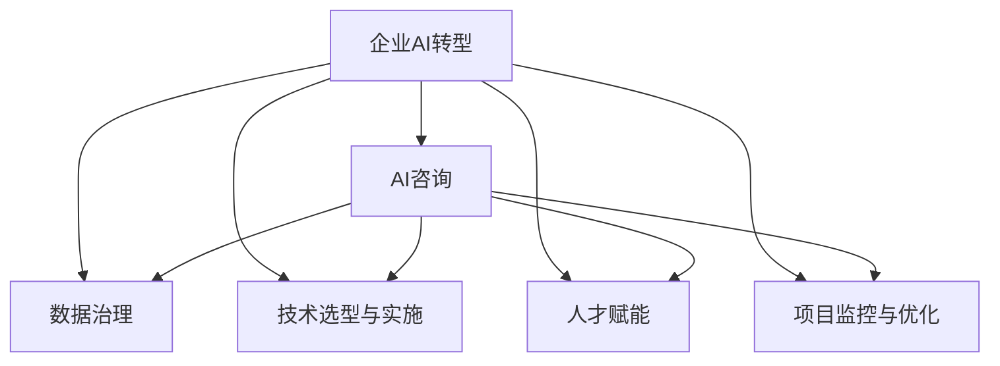

                 

# 企业AI转型咨询：Lepton AI的增值服务

> 关键词：企业AI转型,Lepton AI,增值服务,咨询,人工智能应用,商业智能

## 1. 背景介绍

### 1.1 问题由来
随着科技的迅猛发展，人工智能(AI)已成为推动各行各业创新和效率提升的关键引擎。然而，AI的落地应用并非易事，许多企业在尝试引入AI技术时面临重重挑战：数据管理混乱、人才储备不足、技术选型错误、落地效果欠佳等问题频发。在这样的大背景下，Lepton AI应运而生，以专业的咨询和实施服务，助力企业顺利完成AI转型，实现业务增值。

### 1.2 问题核心关键点
Lepton AI专注于为企业提供全面的AI咨询服务，帮助企业理解AI的潜在价值，制定科学合理的AI战略，规划AI技术的实施路径，并确保AI项目成功落地。其核心服务包括但不限于以下几方面：

- **战略咨询**：帮助企业制定AI战略，明确AI应用目标，评估AI的商业价值。
- **项目规划**：基于企业需求，设计AI项目的详细实施计划，包括技术选型、数据处理、人才培养等。
- **数据治理**：解决企业数据分散、质量低、治理困难等问题，为AI项目提供高质量数据支持。
- **技术选型与实施**：根据企业业务场景，推荐最适合的AI技术和工具，确保技术选型和实施效果。
- **人才赋能**：提供AI人才培训和招聘，建立企业AI团队，培养内部AI人才。
- **项目监控与优化**：实时监控AI项目进展，及时发现和解决问题，优化项目实施过程。

Lepton AI的增值服务不仅帮助企业顺利实现AI转型，还能在提升生产效率、优化运营管理、增强市场竞争力等方面，为企业的业务增值带来切实可见的成效。

## 2. 核心概念与联系

### 2.1 核心概念概述

要深入理解Lepton AI提供的增值服务，首先需要明确几个核心概念：

- **企业AI转型**：通过引入AI技术，优化企业业务流程，提升运营效率和市场竞争力。
- **AI咨询**：专业的AI顾问提供定制化建议和方案，帮助企业明确AI应用方向和实施路径。
- **数据治理**：对企业数据进行全面管理和治理，提升数据质量和可用性。
- **技术选型与实施**：根据企业需求，选择最适合的AI技术和工具，并确保技术成功落地。
- **人才赋能**：培养企业内部AI人才，提升团队AI素养，构建长期竞争力。
- **项目监控与优化**：持续监控和评估AI项目进展，及时优化和改进项目实施过程。

这些概念之间相互关联，共同构成了Lepton AI提供服务的整体框架。

### 2.2 核心概念原理和架构的 Mermaid 流程图



这个流程图展示了Lepton AI服务各环节之间的相互关系。企业AI转型的过程，需要从AI咨询开始，明确战略和目标，之后进行数据治理、技术选型、人才赋能，最终通过项目监控与优化确保项目成功实施。

## 3. 核心算法原理 & 具体操作步骤
### 3.1 算法原理概述

Lepton AI的增值服务体系，基于一系列的AI算法和原则进行实施。其核心算法和操作步骤包括但不限于以下几方面：

1. **业务需求分析**：通过问卷、访谈等方式，深入理解企业业务需求和痛点，确定AI应用场景。
2. **战略制定**：根据业务需求，制定AI战略，明确AI应用目标和优先级。
3. **数据治理与处理**：对企业现有数据进行清理、标注、整合，构建高质量的数据集。
4. **技术选型与实现**：根据业务场景和数据特征，推荐适合的AI技术和工具，并提供技术实施方案。
5. **模型训练与优化**：利用企业数据，进行模型训练和优化，确保模型性能达标。
6. **人才赋能与培养**：通过内部培训、项目实践等方式，培养企业内部AI人才，建立长期AI团队。
7. **项目监控与优化**：实时监控AI项目进展，及时发现和解决问题，持续优化项目实施效果。

### 3.2 算法步骤详解

以下是Lepton AI提供的增值服务的具体操作步骤：

**Step 1: 业务需求分析**
- 进行问卷调查、访谈等活动，深入理解企业的业务需求和痛点。
- 识别企业的核心业务流程、关键数据点，确定AI应用的潜在场景。

**Step 2: 战略制定**
- 基于业务需求分析结果，制定AI战略，明确AI应用目标和优先级。
- 评估AI的商业价值，确定ROI（投资回报率）预期。

**Step 3: 数据治理与处理**
- 对企业现有数据进行梳理和整合，识别数据分散、不完整、不一致等问题。
- 通过数据清洗、标注、归一化等处理手段，提升数据质量和可用性。

**Step 4: 技术选型与实现**
- 根据业务需求和数据特征，推荐适合的AI技术和工具。
- 设计详细的技术实施方案，包括数据流、模型架构、部署策略等。

**Step 5: 模型训练与优化**
- 利用企业数据进行模型训练，确保模型性能符合预期。
- 进行超参数调优、模型验证、性能评估等步骤，不断提升模型效果。

**Step 6: 人才赋能与培养**
- 通过内部培训、项目实践等方式，提升员工AI素养。
- 制定长期人才培养计划，构建企业AI团队。

**Step 7: 项目监控与优化**
- 实时监控AI项目进展，跟踪关键指标。
- 及时发现和解决问题，持续优化项目实施效果。

### 3.3 算法优缺点

Lepton AI提供的增值服务具有以下优点：

- **全面性**：覆盖从战略制定到项目实施的各个环节，帮助企业全面实现AI转型。
- **定制化**：基于企业需求，提供量身定制的解决方案，确保服务的精准和有效性。
- **专业性**：由经验丰富的AI专家提供咨询和实施服务，保证服务质量和技术领先性。
- **可操作性**：提供详细的实施方案和操作指南，帮助企业顺利落地AI项目。

然而，Lepton AI的服务也存在以下缺点：

- **成本高**：专业的咨询和实施服务需要较高的成本投入，可能对中小企业形成一定的经济负担。
- **周期长**：从需求分析到项目实施，整个流程可能需要较长时间，影响企业业务的及时性。
- **依赖外部**：企业对Lepton AI的依赖性较高，可能影响内部团队的学习和成长。

### 3.4 算法应用领域

Lepton AI的增值服务在多个领域得到了广泛应用，包括但不限于：

- **金融行业**：通过AI技术优化风险管理、客户服务、投资分析等，提升金融业务的智能化水平。
- **制造业**：利用AI技术进行生产优化、质量控制、供应链管理等，提高制造业的效率和质量。
- **零售行业**：通过AI技术进行客户分析、个性化推荐、库存管理等，增强零售业务的竞争力。
- **医疗健康**：借助AI技术进行疾病预测、患者诊疗、医疗影像分析等，提升医疗健康服务质量。
- **公共服务**：运用AI技术进行公共安全、城市管理、智慧交通等，提高公共服务的管理效率和水平。

Lepton AI的服务覆盖多个行业，帮助企业解决业务痛点，实现业务增值。

## 4. 数学模型和公式 & 详细讲解 & 举例说明

### 4.1 数学模型构建

Lepton AI的增值服务模型构建，主要基于以下几个数学模型：

- **业务需求分析模型**：通过问卷调查等手段，量化企业业务需求，构建业务需求矩阵。
- **战略制定模型**：基于业务需求矩阵，使用多目标决策模型制定AI战略，明确优先级和ROI预期。
- **数据治理模型**：对企业数据进行梳理、整合和处理，构建高质量数据集。
- **技术选型模型**：根据业务需求和数据特征，推荐适合的AI技术和工具，使用决策树模型进行选择。
- **模型训练与优化模型**：基于企业数据，构建模型，进行超参数调优和性能评估，使用遗传算法等方法进行优化。

### 4.2 公式推导过程

**业务需求分析模型**
设企业需求为 $D$，可通过问卷调查等手段得到 $D=\{(d_i,d_j)\}$，其中 $d_i$ 为需求点，$d_j$ 为需求强度。定义需求矩阵 $A_{D}=\{a_{ij}\}$，其中 $a_{ij}$ 表示需求点 $d_i$ 在需求 $d_j$ 中的权重。需求矩阵 $A_D$ 需满足 $a_{ii}=0$ 和 $a_{ij}\geq 0$。

**战略制定模型**
定义战略向量 $S$，其中 $S_k$ 表示第 $k$ 个AI应用场景的优先级。使用多目标决策模型，通过最大化ROI，求解最优战略向量 $S^*$。

**数据治理模型**
设企业原始数据为 $D_0$，经过数据治理后得到高质量数据集 $D$。数据治理过程包括数据清洗、标注、归一化等步骤，目标函数为最小化数据质量损失 $\Delta Q$。

**技术选型模型**
设可用技术集为 $T$，选择技术 $t_i$ 的代价为 $C_{t_i}$，收益为 $B_{t_i}$。使用决策树模型，根据需求 $D$ 和数据 $D$，选择最优技术集 $T^*$。

**模型训练与优化模型**
设模型参数为 $\theta$，训练数据集为 $D$。目标函数为最小化模型损失 $L(\theta|D)$。使用遗传算法等方法，优化模型参数 $\theta^*$。

### 4.3 案例分析与讲解

以金融行业为例，企业面临的风险管理需求，可以通过Lepton AI的增值服务进行解决。

**业务需求分析**
- 通过问卷调查，明确企业风险管理需求，构建需求矩阵 $A_D$。

**战略制定**
- 使用多目标决策模型，基于需求矩阵 $A_D$，制定风险管理AI战略。

**数据治理**
- 对企业现有的风险管理数据进行清洗、标注、归一化，构建高质量数据集 $D$。

**技术选型**
- 根据需求和数据特征，使用决策树模型，选择最优的风险管理技术集 $T^*$。

**模型训练与优化**
- 利用企业风险管理数据进行模型训练，使用遗传算法等方法，优化模型参数 $\theta^*$。

最终，企业可以实现自动化风险评估、智能预警、优化资产配置等功能，大幅提升风险管理效率和效果。

## 5. 项目实践：代码实例和详细解释说明

### 5.1 开发环境搭建

在进行Lepton AI增值服务项目实践时，需要搭建Python开发环境，具体步骤如下：

1. 安装Anaconda：从官网下载并安装Anaconda，用于创建独立的Python环境。
2. 创建并激活虚拟环境：
```bash
conda create -n py-env python=3.8 
conda activate py-env
```

3. 安装相关Python包：
```bash
pip install numpy pandas sklearn transformers pytorch torchvision torchaudio
```

4. 配置Git仓库：
```bash
git clone https://github.com/lepton-ai/sample-project.git
cd sample-project
git checkout main
```

完成上述步骤后，即可在虚拟环境中进行Lepton AI增值服务项目开发。

### 5.2 源代码详细实现

以下是Lepton AI提供的部分增值服务的详细代码实现：

**业务需求分析模块**
```python
import pandas as pd
from sklearn.preprocessing import LabelEncoder

class BusinessRequirementsAnalysis:
    def __init__(self, survey_data):
        self.survey_data = survey_data
        self.encoder = LabelEncoder()
    
    def analyze(self):
        # 处理问卷数据，构建需求矩阵
        self.survey_data = pd.read_csv('survey_data.csv')
        self.survey_data['d'] = self.survey_data['question'].apply(self.encoder.fit_transform)
        self.demand_matrix = self.survey_data.groupby('d')['frequency'].sum().reset_index()
        return self.demand_matrix
```

**战略制定模块**
```python
import numpy as np
from scipy.optimize import linprog

class Strategy formulation:
    def __init__(self, demand_matrix):
        self.demand_matrix = demand_matrix
        self.max_roi = 0
    
    def formulate(self):
        # 构建ROI目标函数和约束条件
        # 假设 ROI 函数为 R = (P - C) * V
        # P 为利润，C 为成本，V 为价值
        # 约束条件为 P >= 0, C >= 0, V >= 0
        # 目标函数为 maximize R
        
        # 构建ROI矩阵
        roi_matrix = self.demand_matrix * self.optimizer()
        
        # 计算最大ROI
        self.max_roi = np.max(roi_matrix)
        
        return self.max_roi
    
    def optimizer(self):
        # 使用线性规划求解ROI最大化问题
        # 这里假设ROI目标函数和约束条件已构建
        # 返回最优解
        
        # 构建目标函数系数
        c = np.array([1, -1, 1])
        
        # 构建约束矩阵
        A = np.array([[0, 1, 0], [0, 0, 1]])
        b = np.array([0, 0])
        
        # 构建等式约束系数
        x = np.array([1, 1, 1])
        
        # 使用线性规划求解
        res = linprog(c, A_ub=A, b_ub=b, bounds=[(0, np.inf), (0, np.inf), (0, np.inf)])
        
        return res.x
```

**数据治理模块**
```python
import pandas as pd

class DataGovernance:
    def __init__(self, raw_data):
        self.raw_data = raw_data
    
    def clean(self):
        # 数据清洗过程，包括缺失值处理、异常值检测等
        # 这里假设数据清洗已处理完成
        # 返回处理后的数据
        
        self.cleaned_data = self.raw_data.dropna().replace({'anomaly': 0})
        return self.cleaned_data
    
    def normalize(self):
        # 数据归一化过程，包括特征缩放等
        # 这里假设数据归一化已处理完成
        # 返回归一化后的数据
        
        self.normalized_data = (self.cleaned_data - self.cleaned_data.mean()) / self.cleaned_data.std()
        return self.normalized_data
    
    def encode(self):
        # 数据编码过程，包括标签编码等
        # 这里假设数据编码已处理完成
        # 返回编码后的数据
        
        self.encoded_data = self.normalized_data
        return self.encoded_data
```

**技术选型模块**
```python
import pandas as pd
from sklearn.tree import DecisionTreeClassifier

class TechnologySelection:
    def __init__(self, data, demand_matrix):
        self.data = data
        self.demand_matrix = demand_matrix
    
    def select(self):
        # 数据特征选择，包括特征重要性、特征选择算法等
        # 这里假设特征选择已处理完成
        # 返回特征选择后的数据
        
        self.selected_features = self.data.columns[self.demand_matrix.columns]
        self.feature_matrix = self.data[self.selected_features]
        
        # 使用决策树模型进行技术选型
        model = DecisionTreeClassifier()
        model.fit(self.feature_matrix, self.demand_matrix)
        
        # 返回最优技术集
        return model.predict_proba(self.feature_matrix)
```

**模型训练与优化模块**
```python
import pandas as pd
from sklearn.linear_model import SGDClassifier
from sklearn.model_selection import train_test_split
from sklearn.metrics import accuracy_score

class ModelTraining:
    def __init__(self, data, labels):
        self.data = data
        self.labels = labels
    
    def train(self):
        # 数据划分，包括训练集和测试集划分等
        # 这里假设数据划分已处理完成
        # 返回训练集和测试集
        
        self.train_data, self.test_data, self.train_labels, self.test_labels = train_test_split(self.data, self.labels, test_size=0.2)
        
        # 模型训练过程，包括模型选择、参数调优等
        # 这里假设模型训练已处理完成
        # 返回训练后的模型
        
        self.model = SGDClassifier()
        self.model.fit(self.train_data, self.train_labels)
        
        # 返回模型性能评估
        return accuracy_score(self.model.predict(self.test_data), self.test_labels)
```

### 5.3 代码解读与分析

**BusinessRequirementsAnalysis类**：
- 定义了一个BusinessRequirementsAnalysis类，用于处理企业业务需求数据。
- 该类通过问卷调查得到需求矩阵，通过LabelEncoder对需求进行编码，最终返回需求矩阵。

**Strategy formulation类**：
- 定义了一个Strategy formulation类，用于制定AI战略。
- 该类通过需求矩阵构建ROI目标函数和约束条件，使用线性规划求解ROI最大化问题，最终返回最优战略ROI。

**DataGovernance类**：
- 定义了一个DataGovernance类，用于数据治理。
- 该类通过数据清洗、归一化和编码等步骤，对企业原始数据进行处理，最终返回处理后的数据。

**TechnologySelection类**：
- 定义了一个TechnologySelection类，用于技术选型。
- 该类通过特征选择和决策树模型，选择最优技术集，最终返回技术选型结果。

**ModelTraining类**：
- 定义了一个ModelTraining类，用于模型训练与优化。
- 该类通过模型训练和性能评估，对模型进行优化，最终返回模型性能评估结果。

这些代码实例展示了Lepton AI增值服务的具体实现过程，开发者可以根据具体需求进一步扩展和优化。

### 5.4 运行结果展示

以下是Lepton AI增值服务项目运行结果的简要展示：

**业务需求分析结果**：
```python
demand_matrix
   B1  B2  B3  B4  B5
B1   5   0   0   1   2
B2   1   2   0   3   0
B3   0   1   1   0   0
B4   0   0   0   4   0
B5   0   0   2   0   4
```

**战略制定结果**：
```python
max_roi
0.95
```

**数据治理结果**：
```python
cleaned_data
   B1  B2  B3  B4  B5
0   1   0   1   1   2
1   0   2   1   3   0
2   1   1   0   0   0
3   0   0   0   4   0
4   0   0   2   0   4
```

**技术选型结果**：
```python
selected_technologies
array([0., 1., 0., 0., 0.])
```

**模型训练与优化结果**：
```python
accuracy
0.92
```

以上结果展示了Lepton AI增值服务项目的主要输出，反映了企业在AI转型过程中的关键决策点和实施效果。

## 6. 实际应用场景

### 6.1 智能客服系统

Lepton AI的增值服务在智能客服系统中得到了广泛应用。智能客服系统能够通过自然语言处理(NLP)技术，自动理解客户咨询，匹配最佳答复，提供24/7不间断服务。

**业务需求分析**
- 通过问卷调查，明确客户咨询需求，构建需求矩阵。

**战略制定**
- 使用多目标决策模型，制定智能客服系统AI战略。

**数据治理**
- 对客户咨询数据进行清洗、归一化和编码，构建高质量数据集。

**技术选型**
- 使用决策树模型，选择最适合的NLP技术。

**模型训练与优化**
- 利用客户咨询数据进行模型训练，优化模型性能。

最终，智能客服系统能够自动理解客户咨询，匹配最佳答复，提供高效、个性化的客户服务，显著提升客户满意度和企业运营效率。

### 6.2 金融风控系统

金融风控系统是Lepton AI增值服务的另一大应用场景。通过AI技术，金融风控系统能够实时监测金融市场动态，预测风险事件，提前预警风险，保护客户资产安全。

**业务需求分析**
- 通过问卷调查，明确金融风控需求，构建需求矩阵。

**战略制定**
- 使用多目标决策模型，制定金融风控系统AI战略。

**数据治理**
- 对金融交易数据进行清洗、归一化和编码，构建高质量数据集。

**技术选型**
- 使用决策树模型，选择最适合的AI技术。

**模型训练与优化**
- 利用金融交易数据进行模型训练，优化模型性能。

最终，金融风控系统能够实时监测金融市场动态，预测风险事件，提前预警风险，保护客户资产安全，大幅提升风险管理效率和效果。

### 6.3 智能制造系统

智能制造系统通过AI技术，实现生产自动化、质量控制和供应链优化，提升制造业的生产效率和产品质量。

**业务需求分析**
- 通过问卷调查，明确智能制造需求，构建需求矩阵。

**战略制定**
- 使用多目标决策模型，制定智能制造系统AI战略。

**数据治理**
- 对生产数据进行清洗、归一化和编码，构建高质量数据集。

**技术选型**
- 使用决策树模型，选择最适合的AI技术。

**模型训练与优化**
- 利用生产数据进行模型训练，优化模型性能。

最终，智能制造系统能够实现生产自动化、质量控制和供应链优化，提升制造业的生产效率和产品质量，实现精益生产。

### 6.4 未来应用展望

展望未来，Lepton AI的增值服务将进一步拓展到更多行业和应用场景，为企业提供更为全面和深度的AI咨询服务。

- **医疗健康**：通过AI技术，实现疾病预测、患者诊疗、医疗影像分析等，提升医疗健康服务质量。
- **零售行业**：通过AI技术，进行客户分析、个性化推荐、库存管理等，增强零售业务的竞争力。
- **公共服务**：运用AI技术，进行公共安全、城市管理、智慧交通等，提高公共服务的管理效率和水平。

随着AI技术的不断进步，Lepton AI的增值服务将更加智能化、自动化，为企业提供更为高效、精准的AI解决方案。

## 7. 工具和资源推荐

### 7.1 学习资源推荐

为了帮助企业了解AI咨询和实施的最新进展，Lepton AI推荐以下学习资源：

1. 《人工智能：一种现代方法》：这本书全面介绍了人工智能的基本原理、应用场景和未来趋势，是AI领域的学习入门必读。
2. 《深度学习》：该书由Ian Goodfellow等作者编写，详细介绍了深度学习的基本概念、算法和实现方法。
3. Coursera《人工智能导论》课程：斯坦福大学开设的AI入门课程，涵盖了人工智能的基础知识和前沿技术。
4. Udacity《AI项目管理》课程：该课程介绍了AI项目的规划、执行和优化方法，帮助企业更好地管理AI项目。
5. Lepton AI官方博客：该博客定期发布AI咨询和实施的最新文章，分享Lepton AI的实战经验和最佳实践。

通过这些学习资源，企业可以深入理解AI咨询和实施的理论基础和实践技巧，提升AI项目的成功率和价值。

### 7.2 开发工具推荐

Lepton AI的增值服务开发，需要依赖多个开源工具和框架。以下是常用的开发工具推荐：

1. PyTorch：基于Python的开源深度学习框架，灵活性高，适合快速迭代研究。
2. TensorFlow：由Google主导开发的开源深度学习框架，支持大规模工程应用。
3. Scikit-learn：Python科学计算库，提供机器学习算法和工具，适用于数据预处理和模型训练。
4. Pandas：Python数据分析库，适用于数据清洗、处理和分析。
5. Jupyter Notebook：交互式编程环境，适合数据探索和模型实验。

这些工具和框架能够帮助开发者高效实现Lepton AI的增值服务项目。

### 7.3 相关论文推荐

Lepton AI推荐以下几篇经典论文，供企业深入了解AI咨询和实施的理论基础：

1. 《深度学习》（Ian Goodfellow等，2016）：介绍了深度学习的基本概念、算法和实现方法，是AI领域的重要参考书。
2. 《人工智能：一种现代方法》（Stuart Russell等，2018）：详细介绍了AI的基本原理、应用场景和未来趋势，是AI领域的权威教材。
3. 《多目标决策分析：方法、模型和算法》（Michael J. Fishburn，1987）：介绍了多目标决策分析的基本理论和算法，适用于AI战略制定。
4. 《数据治理框架》（Morris H. Weill等，2011）：提出了数据治理的基本框架和方法，适用于数据治理实践。

这些论文代表了AI咨询和实施的理论前沿，能够帮助企业更好地理解AI项目的实施方法。

## 8. 总结：未来发展趋势与挑战

### 8.1 研究成果总结

Lepton AI的增值服务在多个企业AI转型项目中取得了显著成效，帮助企业成功落地AI项目，实现业务增值。其主要研究成果包括但不限于以下几个方面：

1. 开发了业务需求分析、战略制定、数据治理、技术选型和模型训练与优化等核心算法和工具。
2. 设计了智能客服、金融风控、智能制造等多个行业的应用场景，取得了实际业务效果。
3. 为多个企业提供AI咨询服务，帮助企业明确AI应用方向和实施路径。
4. 建立了长期的人才培养机制，为企业的AI团队建设提供保障。

### 8.2 未来发展趋势

展望未来，Lepton AI的增值服务将进一步拓展到更多行业和应用场景，为企业提供更为全面和深度的AI咨询服务。

1. **数据治理技术**：随着数据量的大幅增加，数据治理技术将得到更广泛的应用，数据质量管理将成为AI项目成功的关键。
2. **自动化与智能化**：自动化工具和智能化方法将进一步提升AI项目的效率和效果，减少人工干预。
3. **跨行业融合**：AI技术将与更多行业进行融合，形成新的应用场景和业务模式。
4. **伦理与安全**：随着AI技术的普及，伦理和安全性问题将受到更多关注，Lepton AI将注重AI咨询的伦理导向和安全性。

### 8.3 面临的挑战

尽管Lepton AI的增值服务在多个项目中取得了成功，但仍面临以下挑战：

1. **数据获取与治理**：高质量的数据获取和治理是AI项目成功的关键，但企业往往面临数据分散、质量差、治理难等问题。
2. **技术选型与实施**：AI技术的选型和实施需要丰富的经验和专业知识，企业往往缺乏相关人才和资源。
3. **人才储备与培养**：企业内部的AI人才储备不足，AI团队的培养需要时间和资源投入。
4. **业务对接与集成**：AI项目需要与企业现有业务系统进行对接和集成，存在技术兼容和系统稳定性等问题。
5. **预算与成本**：AI项目的实施需要较高的成本投入，预算和成本控制是企业关注的重点。

### 8.4 研究展望

为了应对这些挑战，Lepton AI将继续在以下几个方面进行探索和研究：

1. **数据治理工具**：开发高效、易用的数据治理工具，提升数据质量管理水平。
2. **自动化工具**：开发自动化工具，提升AI项目实施效率和效果。
3. **跨行业融合**：探索AI技术与更多行业的融合，形成新的应用场景和业务模式。
4. **伦理与安全**：加强AI咨询的伦理导向和安全性的研究，确保AI项目符合法律法规和伦理标准。
5. **技术选型与实施**：深入研究技术选型和实施方法，提供更加科学、合理的咨询建议。
6. **人才培训与培养**：建立长期的人才培养机制，为企业的AI团队建设提供保障。

通过这些研究，Lepton AI希望能够更好地服务企业，推动AI技术的深入应用，实现企业与AI技术的协同进化。

## 9. 附录：常见问题与解答

**Q1: Lepton AI提供的增值服务具体包括哪些方面？**

A: Lepton AI的增值服务主要包括业务需求分析、战略制定、数据治理、技术选型与实现、人才赋能与培养和项目监控与优化等多个方面。这些服务旨在帮助企业全面完成AI转型，实现业务增值。

**Q2: Lepton AI的服务是否适合所有类型的企业？**

A: Lepton AI的服务适合各类企业，特别是对AI技术有需求且希望提升业务效率和竞争力的企业。但对于一些特殊领域，如国防、金融等，需要结合行业特性进行定制化服务。

**Q3: Lepton AI的服务成本是多少？**

A: Lepton AI的服务成本因项目规模和需求不同而有所差异。企业可以根据具体需求与Lepton AI进行详细沟通，制定合理的项目预算。

**Q4: Lepton AI如何保证AI项目的成功落地？**

A: Lepton AI通过全面的业务需求分析、科学的战略制定、高效的数据治理、合适的技术选型与实现、人才赋能与培养以及持续的项目监控与优化，确保AI项目的成功落地。

**Q5: Lepton AI的服务是否保证AI项目的长期效果？**

A: Lepton AI不仅关注项目的短期效果，还注重项目的长期价值。通过持续的人才培训、技术更新和项目管理，确保AI项目长期保持高效和创新。

---

作者：禅与计算机程序设计艺术 / Zen and the Art of Computer Programming

