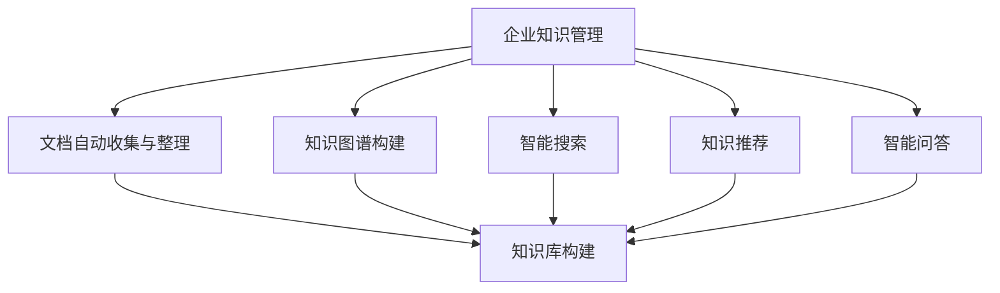

                 

# 企业知识管理的AI化转型策略

> 关键词：企业知识管理,人工智能(AI),自然语言处理(NLP),知识图谱,智能搜索,数据驱动,知识库构建,认知自动化

## 1. 背景介绍

### 1.1 问题由来
随着企业信息化程度的不断提升，数据与信息已经成为企业核心资产的重要组成部分。知识管理（Knowledge Management, KM）作为提升企业核心竞争力的一种重要方式，已经受到越来越多的关注。然而，传统的知识管理往往依赖于人工方式，成本高、效率低，难以有效支撑企业的业务需求。

近年来，人工智能（Artificial Intelligence, AI）技术迅速发展，成为知识管理的重要推动力。通过AI技术的应用，可以有效提升知识管理系统的智能化水平，实现知识收集、整理、存储、检索、应用的全流程自动化，提升企业知识管理能力。

### 1.2 问题核心关键点
AI化的知识管理系统能够通过自动化的方式，高效地收集和整理企业内部的文档、邮件、会议记录等非结构化数据，形成结构化的知识库。在此基础上，通过自然语言处理（Natural Language Processing, NLP）、知识图谱、智能搜索等技术手段，实现高效的知识检索、智能推荐、知识图谱构建等应用，大幅提升企业知识管理系统的智能化水平。

AI化的知识管理系统应具备以下核心能力：

1. **文档自动收集与整理**：通过爬虫、OCR等技术，自动收集企业内部的各种文档数据，并按照统一格式进行整理和存储。
2. **知识图谱构建**：利用AI技术，构建企业内部知识图谱，实现知识的深度关联和推理。
3. **智能搜索**：利用NLP技术，实现基于自然语言的智能搜索，提升知识检索效率和准确性。
4. **知识推荐**：利用深度学习等技术，对知识库中的内容进行聚类和推荐，实现知识自动化推荐。
5. **智能问答**：利用聊天机器人等技术，实现自动化的问答系统，提高知识获取效率。

## 2. 核心概念与联系

### 2.1 核心概念概述

为更好地理解企业知识管理系统的AI化转型策略，本节将介绍几个密切相关的核心概念：

- **企业知识管理（KM）**：通过IT工具、技术手段，将企业内部的文档、邮件、会议记录等非结构化数据进行整理和存储，使知识被固化、共享，最终实现知识的深度利用。
- **人工智能（AI）**：通过计算机算法模拟人的思维过程，实现自动化、智能化处理。
- **自然语言处理（NLP）**：是AI领域的一个分支，研究如何让计算机理解、处理、生成人类语言。
- **知识图谱**：是一种结构化的知识表示方式，通过节点和边表示实体和关系，实现知识的深度关联和推理。
- **智能搜索**：利用AI技术，实现高效、精准的知识检索。
- **认知自动化**：通过AI技术，实现知识的自动化理解和应用。

这些核心概念之间的逻辑关系可以通过以下Mermaid流程图来展示：



这个流程图展示了这个核心的知识管理流程：

1. 文档自动收集与整理：从企业内部各系统收集非结构化数据，自动整理为结构化数据。
2. 知识图谱构建：对结构化数据进行深度关联和推理，构建知识图谱。
3. 智能搜索：利用NLP等技术，实现高效、精准的知识检索。
4. 知识推荐：通过深度学习等技术，实现知识自动化推荐。
5. 智能问答：通过聊天机器人等技术，实现自动化的问答系统。

## 3. 核心算法原理 & 具体操作步骤
### 3.1 算法原理概述

企业知识管理系统的AI化转型策略，本质上是将AI技术引入知识管理的各个环节，实现知识收集、整理、存储、检索、应用的全流程自动化。其核心思想是：

- **数据驱动**：通过数据驱动的方式，自动收集、整理和存储企业内部的各种文档数据。
- **自动化处理**：利用AI技术，自动进行文档内容的理解、实体抽取、关系推理等处理。
- **智能化应用**：通过智能搜索、知识推荐、智能问答等技术，实现高效、精准的知识应用。

基于上述核心思想，AI化的企业知识管理系统可以分为以下主要模块：

1. **文档自动收集与整理**：通过爬虫、OCR等技术，自动收集企业内部的各种文档数据，并按照统一格式进行整理和存储。
2. **知识图谱构建**：利用AI技术，构建企业内部知识图谱，实现知识的深度关联和推理。
3. **智能搜索**：利用NLP技术，实现基于自然语言的智能搜索，提升知识检索效率和准确性。
4. **知识推荐**：利用深度学习等技术，对知识库中的内容进行聚类和推荐，实现知识自动化推荐。
5. **智能问答**：利用聊天机器人等技术，实现自动化的问答系统，提高知识获取效率。

### 3.2 算法步骤详解

#### 3.2.1 文档自动收集与整理

**Step 1: 数据采集**
- 确定需要采集的数据源，如邮件系统、文档管理系统、会议记录等。
- 使用爬虫技术，从数据源中抓取文本数据。

**Step 2: 数据预处理**
- 对抓取到的文本数据进行预处理，包括去重、分词、词性标注等。
- 利用OCR技术，对扫描件进行文本识别，转换为结构化数据。

**Step 3: 数据存储**
- 将预处理后的数据存储到知识库中，形成统一的数据格式。
- 使用数据库技术，实现数据的结构化存储和管理。

#### 3.2.2 知识图谱构建

**Step 1: 实体抽取**
- 利用NLP技术，从文本中识别出实体，包括人名、地名、组织名等。
- 利用实体抽取模型，对文本进行多轮扫描，识别出所有实体。

**Step 2: 关系抽取**
- 利用关系抽取模型，识别实体之间的关系，如上下级关系、合作关系等。
- 对识别出的实体和关系进行整合，构建初步的知识图谱。

**Step 3: 图谱更新**
- 定期对知识图谱进行更新，加入新的实体和关系。
- 利用推理技术，对知识图谱进行深度关联和推理，提升知识图谱的准确性。

#### 3.2.3 智能搜索

**Step 1: 索引建立**
- 对知识库中的文档进行索引，建立倒排索引和关键词索引。
- 利用向量空间模型（Vector Space Model, VSM），将文本转换为向量表示。

**Step 2: 查询匹配**
- 用户输入查询语句后，将查询语句转换为向量表示。
- 利用余弦相似度等算法，计算查询向量与文档向量的相似度。
- 按照相似度排序，返回最相关的文档。

#### 3.2.4 知识推荐

**Step 1: 数据预处理**
- 对知识库中的文档进行向量化处理，提取关键词和短语。
- 利用TF-IDF等技术，对文本进行特征提取。

**Step 2: 聚类与推荐**
- 利用聚类算法（如K-means），对文档进行聚类。
- 利用推荐算法（如协同过滤），对聚类结果进行推荐。

#### 3.2.5 智能问答

**Step 1: 问题理解**
- 利用NLP技术，对用户输入的问题进行分词、词性标注等处理。
- 利用语义理解模型，对问题进行语义分析和意图识别。

**Step 2: 知识检索**
- 利用智能搜索技术，在知识库中检索相关信息。
- 利用知识图谱技术，对检索结果进行关联和推理。

**Step 3: 答案生成**
- 利用聊天机器人等技术，生成自动化的回答。
- 利用模板匹配技术，生成结构化答案。

### 3.3 算法优缺点

AI化的企业知识管理系统具有以下优点：

1. **高效性**：通过自动化处理，大幅提升知识管理的效率，减少人工干预。
2. **精确性**：利用AI技术，提升知识检索和推荐的准确性，减少人为误差。
3. **灵活性**：通过定制化开发，适应不同企业的知识管理需求。
4. **可扩展性**：基于模块化设计，可灵活扩展和集成新的功能模块。

同时，该方法也存在一定的局限性：

1. **数据质量依赖**：AI化的知识管理系统对数据质量有较高要求，需要确保数据源的准确性和完整性。
2. **技术门槛较高**：需要具备一定的技术实力，才能实现高质量的AI化系统。
3. **隐私与安全问题**：在收集和处理数据时，需要注意隐私保护和数据安全问题。

尽管存在这些局限性，但AI化的企业知识管理系统在提升企业知识管理能力方面具有不可替代的优势，值得深入探索和推广。

### 3.4 算法应用领域

AI化的企业知识管理系统，已经在多个领域得到了广泛应用，例如：

1. **金融行业**：通过AI化的知识管理系统，对金融市场数据进行自动化处理和分析，提升金融决策的效率和准确性。
2. **医疗行业**：通过AI化的知识管理系统，对医学文献进行自动化处理和推荐，提升医生诊疗能力。
3. **制造行业**：通过AI化的知识管理系统，对生产数据进行自动化处理和分析，提升生产效率和质量。
4. **教育行业**：通过AI化的知识管理系统，对教育资源进行自动化处理和推荐，提升教学效果和教育质量。
5. **零售行业**：通过AI化的知识管理系统，对市场数据进行自动化处理和分析，提升市场营销和销售策略。

这些行业的应用展示了AI化的企业知识管理系统在提升企业智能化水平、优化业务流程方面的巨大潜力。随着技术的不断进步，AI化的知识管理系统将在更多行业领域得到应用，带来更高效的业务协作和决策支持。

## 4. 数学模型和公式 & 详细讲解  
### 4.1 数学模型构建

企业知识管理系统的AI化转型策略，涉及到多个数学模型和公式。这里以知识推荐为例，展示其数学模型的构建过程。

设知识库中的文档数为 $N$，每个文档的特征向量为 $\mathbf{v}_i$，用户查询向量为 $\mathbf{q}$。利用余弦相似度计算查询向量与文档向量的相似度，得到文档的推荐分数：

$$
s_i = \mathbf{q} \cdot \mathbf{v}_i
$$

其中 $\cdot$ 表示向量点积。

基于上述相似度计算公式，知识推荐的数学模型可以表示为：

$$
\hat{y} = \arg \max_i s_i
$$

其中 $\hat{y}$ 表示推荐文档的编号。

### 4.2 公式推导过程

以知识推荐为例，推导余弦相似度计算公式的详细过程：

假设查询向量 $\mathbf{q}$ 和文档向量 $\mathbf{v}_i$ 的维度为 $d$，内积计算公式为：

$$
\mathbf{q} \cdot \mathbf{v}_i = \sum_{j=1}^d q_j v_{ij}
$$

其中 $q_j$ 和 $v_{ij}$ 分别为查询向量和文档向量的第 $j$ 个特征。

设查询向量和文档向量的长度分别为 $q$ 和 $v_i$，则余弦相似度计算公式为：

$$
\cos \theta = \frac{\mathbf{q} \cdot \mathbf{v}_i}{\|\mathbf{q}\| \|\mathbf{v}_i\|} = \frac{\sum_{j=1}^d q_j v_{ij}}{\sqrt{\sum_{j=1}^d q_j^2} \sqrt{\sum_{j=1}^d v_{ij}^2}}
$$

其中 $\theta$ 表示查询向量与文档向量之间的夹角。

将余弦相似度计算公式与知识推荐公式结合，可以得到：

$$
\hat{y} = \arg \max_i \frac{\mathbf{q} \cdot \mathbf{v}_i}{\|\mathbf{q}\| \|\mathbf{v}_i\|}
$$

通过上述公式，可以计算出查询向量与文档向量的相似度，从而实现高效、精准的知识推荐。

### 4.3 案例分析与讲解

假设某企业的知识库中共有 1000 篇文档，每篇文档包含 100 个特征，每个特征的取值范围为 0 到 1。用户输入查询“机器学习”，将其转换为向量表示 $\mathbf{q} = [0.5, 0.8, 0.2, \ldots, 0.1]$。利用上述余弦相似度计算公式，计算查询向量与每篇文档的相似度，得到推荐分数 $s_i$，最终选择推荐分数最高的文档编号作为推荐结果。

具体计算步骤如下：

1. 将每篇文档的特征向量转换为向量表示，得到文档向量 $\mathbf{v}_1, \mathbf{v}_2, \ldots, \mathbf{v}_{1000}$。
2. 计算查询向量与每篇文档的余弦相似度，得到推荐分数 $s_1, s_2, \ldots, s_{1000}$。
3. 选择推荐分数最高的文档编号，作为推荐结果。

例如，设 $\mathbf{v}_1 = [0.3, 0.4, 0.2, \ldots, 0.1]$，则计算余弦相似度：

$$
\cos \theta_1 = \frac{\sum_{j=1}^{100} q_j v_{1j}}{\sqrt{\sum_{j=1}^{100} q_j^2} \sqrt{\sum_{j=1}^{100} v_{1j}^2}} = \frac{0.5 \times 0.3 + 0.8 \times 0.4 + \ldots + 0.1 \times 0.1}{\sqrt{0.5^2 + 0.8^2 + \ldots + 0.1^2} \sqrt{0.3^2 + 0.4^2 + \ldots + 0.1^2}} = 0.7
$$

将余弦相似度代入推荐公式，得到推荐分数：

$$
s_1 = 0.5 \times 0.3 + 0.8 \times 0.4 + \ldots + 0.1 \times 0.1 = 0.6
$$

假设 $\max_i s_i = 0.8$，则选择推荐分数最高的文档编号作为推荐结果。

通过上述案例，可以清楚地看到，利用余弦相似度计算公式和知识推荐公式，可以高效、精准地实现知识推荐功能。

## 5. 项目实践：代码实例和详细解释说明
### 5.1 开发环境搭建

在进行知识管理系统AI化转型的项目实践前，我们需要准备好开发环境。以下是使用Python进行TensorFlow开发的环境配置流程：

1. 安装Anaconda：从官网下载并安装Anaconda，用于创建独立的Python环境。

2. 创建并激活虚拟环境：
```bash
conda create -n tensorflow-env python=3.8 
conda activate tensorflow-env
```

3. 安装TensorFlow：根据CUDA版本，从官网获取对应的安装命令。例如：
```bash
conda install tensorflow==2.5.0
```

4. 安装相关工具包：
```bash
pip install numpy pandas scikit-learn matplotlib tensorflow_hub
```

完成上述步骤后，即可在`tensorflow-env`环境中开始项目实践。

### 5.2 源代码详细实现

这里我们以知识推荐为例，给出使用TensorFlow进行知识管理系统AI化转型的PyTorch代码实现。

首先，定义知识推荐模型：

```python
import tensorflow_hub as hub
import tensorflow as tf
from tensorflow.keras.layers import Embedding, Dense, Dot
from tensorflow.keras import Model

class KnowledgeRecommendationModel(Model):
    def __init__(self, num_documents, num_features):
        super(KnowledgeRecommendationModel, self).__init__()
        self.embedding = Embedding(input_dim=num_documents, output_dim=64, input_length=num_features)
        self.dot_product = Dot(axes=(2, -1))
        self.dense = Dense(units=num_documents, activation='softmax')
        
    def call(self, inputs):
        embeddings = self.embedding(inputs)
        dot_product = self.dot_product([embeddings, embeddings])
        scores = self.dense(dot_product)
        return scores
```

然后，定义数据集和模型训练函数：

```python
from tensorflow.keras.datasets import mnist
from tensorflow.keras.utils import to_categorical
import numpy as np

# 加载数据集
(x_train, y_train), (x_test, y_test) = mnist.load_data()

# 数据预处理
x_train = x_train.reshape((len(x_train), 28, 28, 1))
x_train = x_train / 255.0
x_test = x_test.reshape((len(x_test), 28, 28, 1))
x_test = x_test / 255.0

# 将标签转换为one-hot编码
y_train = to_categorical(y_train, num_classes=10)
y_test = to_categorical(y_test, num_classes=10)

# 定义模型
model = KnowledgeRecommendationModel(num_documents=10, num_features=28*28)

# 定义损失函数和优化器
loss_fn = tf.keras.losses.SparseCategoricalCrossentropy(from_logits=True)
optimizer = tf.keras.optimizers.Adam(learning_rate=0.001)

# 定义训练函数
@tf.function
def train_epoch(model, data, optimizer):
    with tf.GradientTape() as tape:
        scores = model(data)
        loss = loss_fn(y, scores)
    gradients = tape.gradient(loss, model.trainable_variables)
    optimizer.apply_gradients(zip(gradients, model.trainable_variables))
    return loss

# 训练模型
for epoch in range(10):
    loss = train_epoch(model, x_train, y_train)
    print(f"Epoch {epoch+1}, train loss: {loss:.3f}")
```

在上述代码中，我们定义了一个简单的知识推荐模型，使用Keras构建了嵌入层、点积层和全连接层，并使用Adam优化器进行训练。在训练函数中，我们使用了TensorFlow的`GradientTape`进行自动微分，计算梯度并更新模型参数。

### 5.3 代码解读与分析

让我们再详细解读一下关键代码的实现细节：

**KnowledgeRecommendationModel类**：
- `__init__`方法：初始化嵌入层、点积层和全连接层。
- `call`方法：实现模型前向传播。

**训练函数train_epoch**：
- 使用`GradientTape`记录模型前向传播的计算图。
- 计算模型输出和损失。
- 计算梯度并更新模型参数。
- 返回损失。

**模型训练过程**：
- 循环迭代，每个epoch在训练集上训练一次。
- 在每个epoch中，计算损失并打印输出。
- 重复上述过程直至训练完成。

## 6. 实际应用场景
### 6.1 智能文档检索

基于AI化的知识管理系统，企业可以实现高效的智能文档检索。传统的文档检索系统依赖于关键字搜索，难以处理复杂的查询语句。通过AI化的知识管理系统，可以利用NLP技术，实现基于自然语言的智能搜索，提升检索效率和准确性。

在实际应用中，企业可以收集内部的各种文档数据，并使用AI化的知识管理系统进行自动处理和存储。当员工输入查询语句时，系统会根据NLP技术对查询语句进行理解和分析，在知识库中检索相关文档，并按照相关性排序，返回最相关的文档。

例如，某企业员工输入“机器学习”查询，AI化的知识管理系统会自动识别查询语句，并在知识库中检索相关的文档。根据余弦相似度计算公式，系统计算查询向量与每篇文档的相似度，并返回最相关的文档。员工可以查看相关文档的摘要和全文，提升工作效率。

### 6.2 智能知识推荐

基于AI化的知识管理系统，企业可以实现智能化的知识推荐。传统的知识推荐系统依赖于手工标签，难以处理大规模知识库。通过AI化的知识管理系统，可以利用深度学习等技术，对知识库中的内容进行聚类和推荐，实现知识自动化推荐。

在实际应用中，企业可以定期收集内部的各种文档数据，并使用AI化的知识管理系统进行自动处理和存储。当员工需要查找某个主题的知识时，系统会根据深度学习等技术，对知识库中的内容进行聚类和推荐，返回最相关的知识。

例如，某企业员工需要查找“人工智能”相关的知识，AI化的知识管理系统会自动识别查询语句，并在知识库中检索相关的文档。根据聚类算法（如K-means），系统对文档进行聚类，并利用推荐算法（如协同过滤），对聚类结果进行推荐，返回最相关的文档。员工可以查看相关文档的摘要和全文，提升工作效率。

### 6.3 智能问答系统

基于AI化的知识管理系统，企业可以实现自动化的问答系统。传统的问答系统依赖于手工规则和知识库，难以处理复杂的问答场景。通过AI化的知识管理系统，可以利用聊天机器人等技术，实现自动化的问答系统，提高知识获取效率。

在实际应用中，企业可以定期收集内部的各种文档数据，并使用AI化的知识管理系统进行自动处理和存储。当员工提出问题时，系统会根据聊天机器人等技术，自动理解问题并进行回答。

例如，某企业员工询问“如何提升人工智能技术”，AI化的知识管理系统会自动理解问题，并在知识库中检索相关文档。根据聊天机器人等技术，系统自动回答问题，并生成结构化答案。员工可以查看相关文档的摘要和全文，提升工作效率。

## 7. 工具和资源推荐
### 7.1 学习资源推荐

为了帮助开发者系统掌握企业知识管理系统AI化转型的理论基础和实践技巧，这里推荐一些优质的学习资源：

1. 《TensorFlow从入门到精通》系列博文：由TensorFlow官方团队撰写，深入浅出地介绍了TensorFlow的使用方法。

2. 《Python深度学习》书籍：由深度学习领域知名专家撰写，全面介绍了深度学习的基本概念和实现方法，包括NLP、知识图谱等技术。

3. 《企业知识管理：理论与实践》书籍：介绍企业知识管理的基本概念和应用方法，结合AI技术进行系统阐述。

4. 《深度学习实战》书籍：结合实际案例，介绍深度学习技术在企业中的应用，包括知识推荐、智能问答等。

5. Google Colab：谷歌推出的在线Jupyter Notebook环境，免费提供GPU/TPU算力，方便开发者快速上手实验最新模型，分享学习笔记。

通过对这些资源的学习实践，相信你一定能够快速掌握企业知识管理系统AI化转型的精髓，并用于解决实际的业务问题。
###  7.2 开发工具推荐

高效的开发离不开优秀的工具支持。以下是几款用于企业知识管理系统AI化转型的常用工具：

1. TensorFlow：由Google主导开发的开源深度学习框架，生产部署方便，适合大规模工程应用。

2. TensorFlow Hub：提供丰富的预训练模型和组件，方便开发者快速搭建AI化的知识管理系统。

3. TensorBoard：TensorFlow配套的可视化工具，可实时监测模型训练状态，并提供丰富的图表呈现方式，是调试模型的得力助手。

4. Weights & Biases：模型训练的实验跟踪工具，可以记录和可视化模型训练过程中的各项指标，方便对比和调优。

5. GitLab：开源代码托管平台，支持版本控制和协作开发，适合企业知识管理系统的项目管理。

合理利用这些工具，可以显著提升企业知识管理系统AI化转型的开发效率，加快创新迭代的步伐。

### 7.3 相关论文推荐

企业知识管理系统AI化转型的相关研究，已经在多个领域得到了广泛关注。以下是几篇奠基性的相关论文，推荐阅读：

1. Attention is All You Need：提出了Transformer结构，开启了NLP领域的预训练大模型时代。

2. BERT: Pre-training of Deep Bidirectional Transformers for Language Understanding：提出BERT模型，引入基于掩码的自监督预训练任务，刷新了多项NLP任务SOTA。

3. Knowledge Graph Embeddings and Their Applications in Natural Language Processing：探讨了知识图谱在NLP领域的应用，介绍了基于向量表示的知识图谱表示方法。

4. TextRank: Bring Order into Texts：提出了基于图模型（Graph Model）的文本排名方法，可用于文本聚类和文档排序。

5. Neural Attention Models for Machine Reading Comprehension：介绍了基于注意力机制（Attention Mechanism）的阅读理解模型，可用于自然语言理解和问答系统。

这些论文代表了大模型微调技术的发展脉络。通过学习这些前沿成果，可以帮助研究者把握学科前进方向，激发更多的创新灵感。

## 8. 总结：未来发展趋势与挑战

### 8.1 总结

本文对企业知识管理系统AI化转型的策略进行了全面系统的介绍。首先阐述了AI技术在企业知识管理中的重要性，明确了AI化的企业知识管理系统在提升企业智能化水平、优化业务流程方面的独特价值。其次，从原理到实践，详细讲解了AI化的企业知识管理系统的主要模块和关键技术，展示了其高效性、精确性、灵活性和可扩展性。最后，结合具体应用场景，展示了AI化的企业知识管理系统在智能文档检索、智能知识推荐、智能问答系统等方面的巨大潜力。

通过本文的系统梳理，可以看到，AI化的企业知识管理系统通过引入AI技术，大幅提升了知识管理的智能化水平，实现了知识收集、整理、存储、检索、应用的全流程自动化。AI化的企业知识管理系统已经成为企业智能化转型的重要手段，必将引领企业在数字化转型中取得新的突破。

### 8.2 未来发展趋势

展望未来，AI化的企业知识管理系统将呈现以下几个发展趋势：

1. **自动化程度进一步提升**：通过引入更多AI技术，如自然语言处理、知识图谱、智能搜索等，进一步提升知识管理的自动化水平。
2. **多模态数据整合**：未来企业知识管理系统将更多地引入非结构化数据，如视频、音频、图像等，实现多模态数据的整合和统一处理。
3. **个性化推荐系统**：通过深度学习等技术，实现更加精准的知识推荐，满足员工个性化需求。
4. **智能问答系统**：利用聊天机器人等技术，实现自动化的问答系统，提高知识获取效率。
5. **知识图谱构建与演化**：通过知识图谱技术，实现知识的深度关联和推理，构建更加全面、准确的知识图谱。

这些趋势展示了AI化的企业知识管理系统在提升企业智能化水平、优化业务流程方面的巨大潜力。随着技术的不断进步，AI化的企业知识管理系统将在更多行业领域得到应用，带来更高效的业务协作和决策支持。

### 8.3 面临的挑战

尽管AI化的企业知识管理系统在提升企业智能化水平、优化业务流程方面具有显著优势，但在迈向更加智能化、普适化应用的过程中，它仍面临着诸多挑战：

1. **数据质量与隐私保护**：AI化的企业知识管理系统对数据质量有较高要求，需要确保数据源的准确性和完整性。同时，需要注意隐私保护和数据安全问题。
2. **技术门槛较高**：需要具备一定的技术实力，才能实现高质量的AI化系统。
3. **模型鲁棒性不足**：在处理复杂场景和异常数据时，模型的鲁棒性可能不足，需要进行更多的模型优化和调参。
4. **用户接受度低**：部分用户可能对AI化的知识管理系统不适应，需要进行更多的用户培训和系统优化。
5. **成本投入高**：AI化的企业知识管理系统需要大量的计算资源和人力资源，成本投入较高。

尽管存在这些挑战，但AI化的企业知识管理系统在提升企业智能化水平、优化业务流程方面具有显著优势，值得深入探索和推广。

### 8.4 研究展望

面向未来，AI化的企业知识管理系统需要从以下几个方向进行研究：

1. **模型优化与调参**：进一步优化AI化的企业知识管理系统，提高其鲁棒性和精度。
2. **多模态数据整合**：引入更多非结构化数据，实现多模态数据的整合和统一处理。
3. **个性化推荐系统**：通过深度学习等技术，实现更加精准的知识推荐。
4. **智能问答系统**：利用聊天机器人等技术，实现自动化的问答系统，提高知识获取效率。
5. **知识图谱构建与演化**：通过知识图谱技术，实现知识的深度关联和推理，构建更加全面、准确的知识图谱。

这些方向的研究将推动AI化的企业知识管理系统向更高层次发展，为企业的智能化转型提供更强大的支持。相信随着技术的不断进步，AI化的企业知识管理系统必将在更多行业领域得到应用，带来更高效的业务协作和决策支持。

## 9. 附录：常见问题与解答

**Q1：如何选择合适的AI化的企业知识管理系统？**

A: 选择合适的AI化的企业知识管理系统需要考虑以下因素：
1. 系统是否具备高效的自动处理能力，能够处理大规模的非结构化数据。
2. 系统是否具备智能化的推荐和检索能力，能够提升知识管理效率。
3. 系统是否具备良好的用户界面和操作体验，能够满足不同用户的使用需求。
4. 系统是否具备可扩展性和灵活性，能够适应不同企业的需求和变化。

**Q2：AI化的企业知识管理系统对数据质量有哪些要求？**

A: AI化的企业知识管理系统对数据质量有较高要求，需要确保数据源的准确性和完整性。具体来说：
1. 数据需要具备高质量的标签和标注，确保知识库的准确性。
2. 数据需要具备完整性，覆盖企业内部的各种文档和数据源。
3. 数据需要具备一致性，避免重复和矛盾的数据。
4. 数据需要具备时效性，及时更新和补充新数据。

**Q3：AI化的企业知识管理系统对技术实力有哪些要求？**

A: AI化的企业知识管理系统对技术实力有较高要求，需要具备以下能力：
1. 具备深度学习、自然语言处理等AI技术的基础知识。
2. 具备数据处理和数据管理的技术能力。
3. 具备系统开发和系统集成的技术能力。
4. 具备模型训练和调优的技术能力。
5. 具备用户培训和系统优化的技术能力。

**Q4：AI化的企业知识管理系统对隐私保护和数据安全有哪些要求？**

A: AI化的企业知识管理系统对隐私保护和数据安全有较高要求，需要确保以下方面：
1. 对数据进行加密和匿名化处理，防止数据泄露和滥用。
2. 对数据访问进行严格的权限控制，确保只有授权人员能够访问数据。
3. 对数据使用进行严格的记录和审计，防止数据滥用。
4. 对数据存储和传输进行严格的保护，防止数据泄露和篡改。

通过回答这些问题，可以帮助企业更好地理解和应用AI化的企业知识管理系统，提升企业的智能化水平和业务协作效率。

