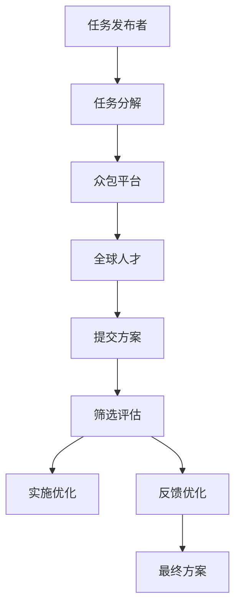

                 

# 众包：汇聚微光，点亮科技未来

## 1. 背景介绍

### 1.1 问题由来

在当今数字化时代，科技的迅猛发展极大地改变了人类的生活方式和社会结构。数据、算法、计算能力，这三大支柱构成了现代科技的基础。但在这个过程中，我们面临着前所未有的挑战。如何更高效地生成和利用数据，如何更智能地进行算法优化，如何更高效地进行计算，成为了科技从业者必须直面的问题。

在过去的几十年里，传统的集中式创新模式已经逐渐暴露出其局限性。大型企业垄断了数据、计算资源，而小型企业和小众个体则难以获得足够的资源和机会。为了破解这一难题，一种新型的分布式创新模式——众包（Crowdsourcing）应运而生。

众包模式通过充分利用互联网和社交媒体平台，将大大小小的创新任务分配给全球各地的人才，通过集思广益的方式，汇聚微光，点亮科技未来。本文将系统介绍众包的原理、优势、具体应用，以及其在未来科技发展中的潜在价值。

## 2. 核心概念与联系

### 2.1 核心概念概述

众包是一种利用互联网平台，将特定任务分配给大众（而非内部员工），以获取创新解决方案的过程。众包模式的核心在于将传统集中式创新转化为分散式、分布式、多样化的协作模式。

在这一过程中，任务发布者（Task Sponsor）制定任务要求，并将任务分解成多个子任务，公开征集大众的智慧与创造力。通过互联网平台，任务发布者可以迅速召集全球范围内的人才，形成多样化的解决方案集，从中筛选出最优方案并实施。

### 2.2 核心概念原理和架构的 Mermaid 流程图



**图 1. 众包流程示意图**

上述流程图展示了众包的基本流程。首先，任务发布者将任务要求发布到众包平台，然后平台将任务分解成多个子任务。通过互联网，全球范围内的众多人才可以提交自己的解决方案。任务发布者会对方案进行筛选和评估，最后实施最优方案，并对反馈进行优化。

## 3. 核心算法原理 & 具体操作步骤

### 3.1 算法原理概述

众包算法是基于市场机制和激励机制设计的，主要目标是最大化参与者的贡献和平台的用户满意度。其核心思想在于通过合理分配收益、设计激励机制、利用反馈和迭代优化等方式，激励大众的积极参与。

### 3.2 算法步骤详解

**步骤 1: 任务分解与发布**
- 任务发布者将大任务分解为多个子任务，制定明确的任务要求和评估标准。
- 在众包平台上发布任务，设置奖励机制，包括固定奖励和动态奖励。

**步骤 2: 召集参与者**
- 利用众包平台，全球范围内的参与者可以自由注册并参与任务。
- 平台通过广告、推荐、竞赛等形式吸引更多人参与。

**步骤 3: 提交方案与评估**
- 参与者提交自己的解决方案，可以是文本、代码、设计等多种形式。
- 任务发布者对提交的方案进行初步筛选，确保方案符合任务要求。

**步骤 4: 反馈与优化**
- 任务发布者邀请其他专家和利益相关者对提交的方案进行评估和反馈。
- 根据反馈结果，对最优方案进行优化和改进。

**步骤 5: 实施与后续**
- 实施最优方案，并持续收集反馈，进行迭代优化。
- 发布平台对最终方案进行展示和分享，进一步吸引更多参与者。

### 3.3 算法优缺点

**优点**
- **创新多样性**：众包模式能够汇聚全球范围内的智慧和创造力，形成多样化的解决方案集，有利于突破传统思维模式。
- **成本效益**：相比于传统的集中式创新，众包模式能够以较小的成本获取更多的创新思路和解决方案。
- **灵活性和效率**：众包模式能够迅速召集大量人才，在短时间内形成初步方案，加快创新进程。

**缺点**
- **质量控制**：参与者的专业水平和经验各异，可能导致提交的方案质量参差不齐。
- **激励机制设计复杂**：需要合理设计收益分配和激励机制，以确保大众的积极参与。
- **数据隐私和安全**：众包模式涉及大量用户数据，如何保障用户隐私和安全是一个重要问题。

### 3.4 算法应用领域

众包模式在多个领域中得到了广泛应用，包括但不限于：

1. **软件开发**：通过众包平台征集开源代码、优化软件功能，提高软件开发效率和质量。
2. **设计创新**：利用众包模式征集创意设计、用户体验方案，提升产品设计水平。
3. **科学研究**：征集科研数据、实验方案，推进科学研究进展。
4. **市场营销**：利用众包平台进行市场调研、广告创意设计，提升品牌影响力。
5. **公共政策**：征集社会问题解决方案，优化公共服务。

## 4. 数学模型和公式 & 详细讲解 & 举例说明

### 4.1 数学模型构建

在众包算法中，通常涉及以下几个关键变量：

- $N$：参与者的数量。
- $C$：提交方案的数量。
- $R_i$：第$i$个参与者提交的方案获得的奖励。
- $Q_i$：第$i$个参与者的质量评分。
- $P_i$：第$i$个参与者的可信任度评分。

众包算法的目标是最大化总收益（Total Revenue），同时最大化平均满意度（Average Satisfaction）。设总收益为$T$，平均满意度为$S$，则目标函数为：

$$
\max \quad T = \sum_{i=1}^{N} R_i
$$

$$
\max \quad S = \frac{\sum_{i=1}^{N} Q_i}{N}
$$

### 4.2 公式推导过程

为了最大化总收益和平均满意度，我们需要合理设计参与者的奖励机制和评估标准。假设任务发布者分配总收益$T$，根据每个参与者的质量评分$Q_i$和可信任度评分$P_i$，计算每个参与者获得的奖励$R_i$。

$$
R_i = \frac{Q_i \cdot P_i}{\sum_{j=1}^{N} Q_j \cdot P_j}
$$

其中，$Q_i$表示第$i$个参与者提交的方案的质量评分，$P_i$表示第$i$个参与者的可信任度评分，$\sum_{j=1}^{N} Q_j \cdot P_j$表示所有参与者的平均质量评分和平均可信任度评分。

### 4.3 案例分析与讲解

以开源项目众包为例，分析其众包算法的设计和实施过程。

**案例背景**
- 任务发布者：某开源软件开发者
- 任务要求：修复软件中的已知漏洞，改进软件性能

**步骤 1: 任务分解与发布**
- 任务发布者将修复漏洞和改进性能的任务分解为多个子任务，分别发布到众包平台。
- 设置固定奖励和动态奖励，固定奖励为修复漏洞的基础报酬，动态奖励为性能改进的额外奖励。

**步骤 2: 召集参与者**
- 平台通过广告和推荐吸引全球各地的程序员注册并参与任务。
- 平台设计合理的激励机制，吸引更多人才参与。

**步骤 3: 提交方案与评估**
- 参与者提交修复方案和性能改进方案，任务发布者对方案进行初步筛选。
- 邀请其他专家和利益相关者对方案进行评估和反馈。

**步骤 4: 反馈与优化**
- 根据反馈结果，优化和改进最优方案。
- 持续收集反馈，进行迭代优化。

**步骤 5: 实施与后续**
- 实施最优方案，并在开源社区分享和展示。
- 收集更多反馈，持续改进软件性能。

通过这一案例，我们可以看到众包模式能够迅速召集全球人才，形成多样化的解决方案集，通过合理的激励机制和评估标准，最终实现最优方案的实施和优化。

## 5. 项目实践：代码实例和详细解释说明

### 5.1 开发环境搭建

**环境准备**
- 安装 Python 3.7+
- 安装众包平台开发所需的库，如 Django、Flask、SQLAlchemy 等

**开发环境**
```bash
pip install django flask sqlalchemy
```

### 5.2 源代码详细实现

以下是一个简单的众包平台开发示例，演示了任务发布、参与者注册、方案提交、评估反馈等基本功能：

```python
# 定义任务模型
class Task(models.Model):
    title = models.CharField(max_length=255)
    description = models.TextField()
    reward = models.DecimalField(max_digits=10, decimal_places=2)
    submit_date = models.DateTimeField(auto_now_add=True)
    closed = models.BooleanField(default=False)

# 定义参与者模型
class Participant(models.Model):
    username = models.CharField(max_length=255)
    quality_score = models.DecimalField(max_digits=10, decimal_places=2)
    trust_score = models.DecimalField(max_digits=10, decimal_places=2)

# 定义方案模型
class Submission(models.Model):
    participant = models.ForeignKey(Participant, on_delete=models.CASCADE)
    task = models.ForeignKey(Task, on_delete=models.CASCADE)
    solution = models.TextField()
    score = models.DecimalField(max_digits=10, decimal_places=2)
    submit_date = models.DateTimeField(auto_now_add=True)
    closed = models.BooleanField(default=False)

# 任务发布
def publish_task(request):
    if request.method == 'POST':
        task_title = request.POST['task_title']
        task_description = request.POST['task_description']
        task_reward = request.POST['task_reward']
        task = Task.objects.create(title=task_title, description=task_description, reward=task_reward)
        return redirect('home')
    else:
        return render(request, 'task_publish.html')

# 参与者注册
def register_participant(request):
    if request.method == 'POST':
        username = request.POST['username']
        quality_score = request.POST['quality_score']
        trust_score = request.POST['trust_score']
        participant = Participant.objects.create(username=username, quality_score=quality_score, trust_score=trust_score)
        return redirect('home')
    else:
        return render(request, 'participant_register.html')

# 方案提交
def submit_solution(request, task_id):
    if request.method == 'POST':
        solution = request.POST['solution']
        task = Task.objects.get(id=task_id)
        participant = Participant.objects.get(username=request.session['username'])
        submission = Submission.objects.create(participant=participant, task=task, solution=solution, score=score)
        return redirect('home')
    else:
        return render(request, 'solution_submit.html')

# 方案评估
def evaluate_solution(request, task_id, submission_id):
    if request.method == 'POST':
        score = request.POST['score']
        submission = Submission.objects.get(id=submission_id)
        task = Task.objects.get(id=task_id)
        submission.score = score
        submission.save()
        return redirect('home')
    else:
        return render(request, 'solution_evaluate.html')
```

### 5.3 代码解读与分析

**代码解读**

**Task 模型**
- 定义任务的基本信息，包括标题、描述、奖励、提交时间和是否关闭。

**Participant 模型**
- 定义参与者的基本信息，包括用户名、质量评分和可信任度评分。

**Submission 模型**
- 定义方案的基本信息，包括参与者、任务、方案内容、评分、提交时间和是否关闭。

**函数实现**

**publish_task() 函数**
- 接收任务发布请求，创建新的任务记录，并返回任务发布页面。

**register_participant() 函数**
- 接收参与者注册请求，创建新的参与者记录，并返回注册页面。

**submit_solution() 函数**
- 接收方案提交请求，创建新的方案记录，并返回提交页面。

**evaluate_solution() 函数**
- 接收方案评估请求，更新方案评分，并返回评估页面。

**代码分析**

该代码示例实现了众包平台的基本功能，包括任务发布、参与者注册、方案提交和方案评估。其中，使用 Django 框架进行开发，SQLAlchemy 进行数据建模，Flask 进行页面渲染和交互。通过这些基本的函数实现，开发者可以实现众包平台的基本功能，并在其基础上进行扩展和优化。

## 6. 实际应用场景

### 6.1 智能家居系统

智能家居系统通过众包模式，可以快速征集全球范围内的设计方案和开发思路，推动智能家居技术的创新和应用。例如，某智能家居公司可以设计一个众包平台，征集全球用户对家居设备的改进建议和设计方案，通过众包平台快速获取创意方案，并将其应用于产品的改进和优化。

**应用场景**
- 征集智能音箱的设计方案
- 征集智能灯泡的改进建议
- 征集智能家居系统的用户体验优化方案

### 6.2 金融科技

金融科技领域需要大量的数据和算法创新，众包模式可以有效地汇聚全球智慧，推动金融科技的快速发展。例如，某金融科技公司可以设计一个众包平台，征集全球用户对金融产品的改进建议和算法优化方案，通过众包平台快速获取创新思路，并将其应用于产品的改进和优化。

**应用场景**
- 征集金融产品的改进建议
- 征集算法优化方案
- 征集金融数据的创新应用方案

### 6.3 环境保护

环境保护领域需要大量的创新思路和技术解决方案，众包模式可以有效地汇聚全球智慧，推动环境保护技术的创新和应用。例如，某环境保护组织可以设计一个众包平台，征集全球用户对环境保护方案的创新建议和技术改进方案，通过众包平台快速获取创意方案，并将其应用于环境保护项目的优化和改进。

**应用场景**
- 征集环境保护方案的改进建议
- 征集环境保护技术的创新思路
- 征集环境保护数据的分析方案

## 7. 工具和资源推荐

### 7.1 学习资源推荐

**在线课程**
- Coursera《Crowdsourcing in Development》课程
- edX《Crowdsourcing for Impact》课程

**书籍推荐**
- 《Crowdsourcing: A Protocol for Human Data and Labor》 by Chipdesk公司
- 《The Zero to One of Crowdsourcing》 by Andrew Regnier

### 7.2 开发工具推荐

**开发平台**
- CrowdFlower：目前最流行的众包平台之一
- HackerRank：面向程序员的众包平台
- Kaggle：面向数据科学家的众包平台

**开发工具**
- Django：Python Web开发框架
- Flask：Python Web开发框架
- SQLAlchemy：Python ORM框架
- Git：版本控制工具
- Jupyter Notebook：交互式编程环境

### 7.3 相关论文推荐

**相关论文**
- Crowdsourcing: A Powerful Model for Gathering Expert Knowledge in Virtual Environments by K. Franko
- Does Crowdsourcing Work? Empirical Evaluation of a Software Engineering Crowdsourcing System by G. Keller, et al.
- The Zero to One of Crowdsourcing by Andrew Regnier

## 8. 总结：未来发展趋势与挑战

### 8.1 研究成果总结

本文对众包模式进行了系统介绍，从原理到应用，全面探讨了众包的优势和潜力。通过众包模式，可以有效地汇聚全球智慧，推动科技创新和应用，提升生产力，降低成本。

### 8.2 未来发展趋势

未来，众包模式将呈现以下几个发展趋势：

1. **多领域应用**：众包模式将不仅仅局限于软件开发和技术创新，还将广泛应用于设计、科学、市场营销等多个领域。
2. **智能化和自动化**：利用人工智能和机器学习技术，进一步提高众包平台的智能化和自动化水平，提升用户体验和效率。
3. **全球化协作**：通过互联网技术，进一步打破地域限制，实现全球范围内的人才协作和资源共享。
4. **数据隐私和安全**：建立更加完善的数据隐私和安全机制，保障用户数据的安全和隐私。
5. **社区和平台治理**：建立更加完善的社区和平台治理机制，提升平台的用户信任度和活跃度。

### 8.3 面临的挑战

尽管众包模式在多个领域中已经得到了广泛应用，但仍然面临以下挑战：

1. **质量控制**：参与者的专业水平和经验各异，可能导致提交的方案质量参差不齐。
2. **激励机制设计复杂**：需要合理设计收益分配和激励机制，以确保大众的积极参与。
3. **数据隐私和安全**：众包模式涉及大量用户数据，如何保障用户隐私和安全是一个重要问题。
4. **平台治理**：建立完善的平台治理机制，提升平台的用户信任度和活跃度。
5. **技术门槛**：众包平台的设计和实施需要一定的技术门槛，对于一些小型企业和个体，可能难以实现。

### 8.4 研究展望

未来，需要在以下几个方面进一步研究和发展：

1. **质量控制机制**：建立更加完善的质量控制机制，提高提交方案的质量和准确性。
2. **激励机制设计**：设计更加合理和透明的激励机制，确保大众的积极参与。
3. **平台治理机制**：建立完善的平台治理机制，提升平台的用户信任度和活跃度。
4. **技术普及**：降低众包平台的技术门槛，让更多小型企业和个体能够参与到众包创新中来。
5. **智能化和自动化**：利用人工智能和机器学习技术，进一步提高众包平台的智能化和自动化水平，提升用户体验和效率。

## 9. 附录：常见问题与解答

**Q1: 众包模式是否适用于所有类型的任务？**

A: 众包模式适用于多样化的任务，包括但不限于软件开发、设计创新、科学研究、市场营销等。但对于一些需要高度保密的任务，可能需要采用其他方式，如集中式创新。

**Q2: 如何确保提交方案的质量？**

A: 可以通过建立完善的质量控制机制，如专家评审、用户投票、反馈迭代等，确保提交方案的质量和准确性。

**Q3: 如何设计合理的激励机制？**

A: 激励机制需要考虑参与者的专业水平、任务难度、参与时间等因素，通过合理的收益分配和奖励设计，激励大众的积极参与。

**Q4: 如何保障用户数据隐私和安全？**

A: 可以通过数据加密、匿名化、权限控制等措施，保障用户数据的安全和隐私。

**Q5: 如何降低众包平台的技术门槛？**

A: 可以通过简化用户注册流程、提供技术支持和文档、采用开源技术等方式，降低众包平台的技术门槛。

通过本文的系统介绍，我们可以看到众包模式在多个领域中具有广阔的应用前景，未来将会有更多的企业和组织应用众包技术，推动科技创新的持续发展。希望本文能为读者提供有价值的参考，共同推动众包模式的发展和应用。

---

作者：禅与计算机程序设计艺术 / Zen and the Art of Computer Programming

