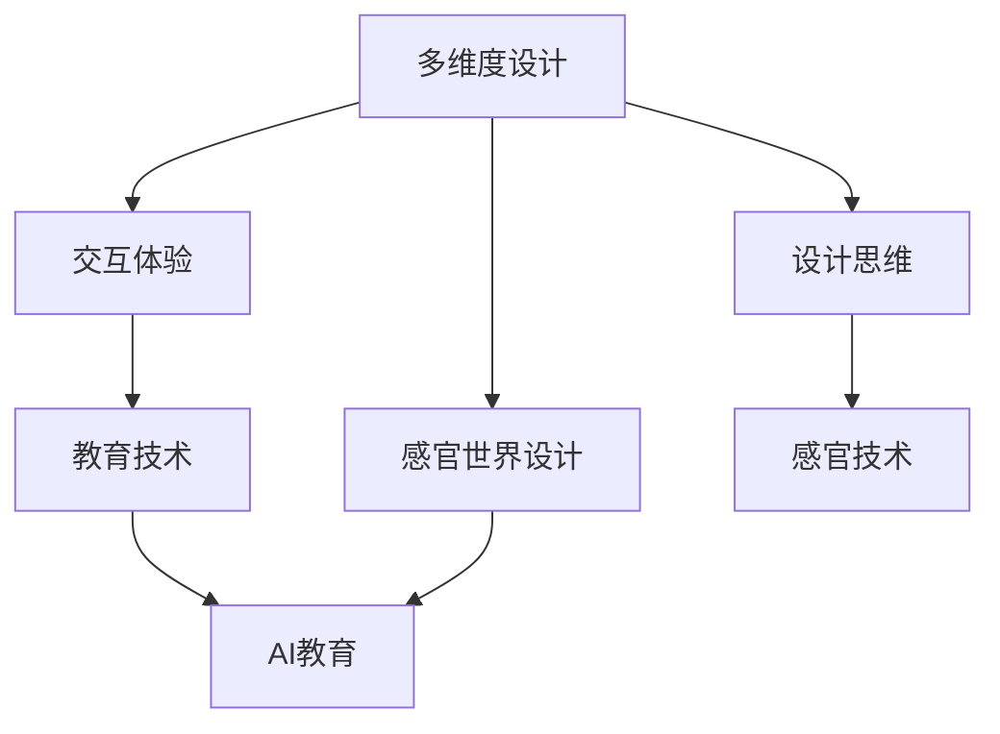

                 

# 体验多维度构建师培训师：AI创造的感官世界设计师教育者

> 关键词：多维度设计、感官世界、AI教育、感官交互、交互体验、教育技术、创新设计、学习路径、设计思维、感官技术、交互式学习

## 1. 背景介绍

### 1.1 问题由来

随着科技的迅速发展，人工智能（AI）技术在各个领域的应用日益深入，不仅改变了人们的生活方式，也带来了全新的设计思路和方法。尤其是在体验设计（UX/UI）和感官设计（Sensory Design）领域，AI技术提供了新的可能性，使得设计师能够更高效、更精准地构建用户界面和交互体验。然而，要真正掌握这些新兴技术，并灵活应用于实际设计中，需要具备跨学科的知识和技能，传统的教育和培训方式难以满足需求。

### 1.2 问题核心关键点

当前，体验和感官设计领域面临着以下几个核心问题：
1. **跨学科知识的融合**：如何将计算机科学、心理学、人机交互等领域的知识融合到设计中，是设计师面临的主要挑战。
2. **新工具的掌握**：如何高效、安全地使用如深度学习、计算机视觉、自然语言处理等新工具，是设计师技能升级的关键。
3. **实践能力的提升**：如何将理论知识应用于实际设计中，创造出符合用户需求、具有创新性的产品，是设计师实践能力提升的方向。
4. **人机交互的优化**：如何设计出能够有效促进用户互动、增强用户体验的多感官交互系统，是设计师需要解决的问题。
5. **教育资源的开发**：如何开发出既符合教育规律，又能适应新技术发展趋势的教学资源，是教育者的重要任务。

## 2. 核心概念与联系

### 2.1 核心概念概述

为更好地理解AI在感官世界设计中的应用，本节将介绍几个密切相关的核心概念：

- **多维度设计**：指在产品设计过程中，综合考虑视觉、听觉、触觉、嗅觉、味觉等多种感官体验，创造全方位的用户交互体验。
- **感官世界设计**：利用感官技术的原理和工具，优化产品设计，提升用户体验，实现人机互动。
- **AI教育**：利用AI技术辅助教育过程，提升教育效果，开发个性化的学习路径。
- **交互体验**：通过设计多感官交互系统，提供高效、愉悦的用户体验。
- **教育技术**：应用AI、VR、AR等技术，提升教育资源的互动性和趣味性。
- **设计思维**：一种以用户为中心，强调问题解决的设计方法，通过跨学科合作、迭代改进等方式，创造出创新性的解决方案。
- **感官技术**：包括计算机视觉、深度学习、自然语言处理、交互设计等，是实现感官世界设计的基础技术。

这些核心概念之间的逻辑关系可以通过以下Mermaid流程图来展示：



这个流程图展示了我国在多维度设计中各核心概念的相互关系：

1. 多维度设计通过感官世界设计来提升交互体验。
2. 交互体验和教育技术共同构成AI教育的重要组成部分。
3. 设计思维指导感官世界设计的实践过程。
4. 感官技术是实现感官世界设计的核心手段。

## 3. 核心算法原理 & 具体操作步骤
### 3.1 算法原理概述

基于AI的多维度构建和感官世界设计，本质上是一个多维度感官数据的采集、处理、分析和应用过程。其核心思想是：通过人工智能技术，将多感官数据融合到设计中，提升用户交互体验和产品功能。

形式化地，假设用户的多感官数据集为 $D=\{(x_i, y_i)\}_{i=1}^N, x_i \in \{视觉数据, 听觉数据, 触觉数据, ...\}, y_i \in \{用户行为, 用户反馈, ...\}$。设计目标是通过对 $D$ 的分析和建模，优化产品设计，提升用户体验。

通过梯度下降等优化算法，设计过程不断更新设计参数 $\theta$，最小化用户满意度函数 $\mathcal{U}(D)$，使得产品设计最大化用户满意度。由于 $D$ 中包含了丰富的多感官数据，因此即便在少量样本下进行设计优化，也能较快收敛到理想的设计参数 $\hat{\theta}$。

### 3.2 算法步骤详解

基于AI的多维度构建和感官世界设计一般包括以下几个关键步骤：

**Step 1: 数据收集与预处理**
- 设计多感官数据采集方案，收集用户的多感官数据。
- 对数据进行清洗、去噪、归一化等预处理，确保数据质量。

**Step 2: 多感官数据融合**
- 选择合适的融合算法（如深度融合、时域频域变换等），将多感官数据融合为统一的表示。
- 设计用户满意度评估函数，量化用户对多感官交互的满意程度。

**Step 3: 优化设计参数**
- 选择合适的优化算法（如梯度下降、粒子群优化等），最小化用户满意度函数。
- 设置优化算法的超参数，如学习率、迭代次数等。

**Step 4: 用户验证与迭代**
- 在真实用户环境中验证设计效果，收集反馈数据。
- 根据反馈数据迭代优化设计参数，直至达到用户满意度目标。

**Step 5: 设计实现与评估**
- 将优化后的设计参数应用于产品实现，设计感官世界系统。
- 在实际使用中，持续收集用户反馈，评估系统性能。

以上是基于AI的多维度构建和感官世界设计的关键流程。在实际应用中，还需要针对具体任务和环境，对各环节进行优化设计，如改进多感官数据融合算法，搜索最优的超参数组合等，以进一步提升设计效果。

### 3.3 算法优缺点

基于AI的多维度构建和感官世界设计方法具有以下优点：
1. 多感官数据融合：将多维度感官数据融合到设计中，提供更丰富、更真实的用户体验。
2. 数据驱动设计：通过数据分析，优化设计参数，提升产品功能。
3. 高效迭代：AI辅助的设计过程能够快速迭代，不断优化设计效果。
4. 跨学科整合：融合计算机科学、心理学、人机交互等多个学科的知识，提升设计水平。
5. 个性化设计：通过数据分析，能够提供个性化的设计方案，满足不同用户的需求。

同时，该方法也存在一定的局限性：
1. 数据获取难度：多感官数据的收集和处理难度较大，需要专门的设备和算法支持。
2. 算法复杂性：多维度数据的融合和优化需要复杂的算法设计，难度较高。
3. 用户接受度：部分用户可能对多感官交互系统感到不适应，需要慢慢接受。
4. 成本较高：多感官数据的采集和处理需要较高的成本投入。
5. 安全性问题：多感官数据的融合可能涉及用户隐私和安全问题，需要特别注意。

尽管存在这些局限性，但就目前而言，基于AI的多维度构建和感官世界设计方法仍是大数据和人工智能技术在感官世界设计中的主流范式。未来相关研究的重点在于如何进一步降低数据获取难度，提高算法的易用性，同时兼顾用户接受度和成本问题。

### 3.4 算法应用领域

基于AI的多维度构建和感官世界设计方法在诸多领域得到了广泛的应用，例如：

- **智能家居**：通过多感官数据融合，提升家居环境的智能性和舒适性。
- **虚拟现实（VR）和增强现实（AR）**：在虚拟空间中，通过多感官交互，提供沉浸式的用户体验。
- **健康医疗**：通过多感官数据的采集和分析，监测患者的健康状况，提供个性化的康复方案。
- **零售和电商**：通过多感官数据的融合，提升商品的展示效果，增强用户的购物体验。
- **智能交通**：通过多感官数据的采集和处理，提升驾驶安全性和舒适性。
- **教育与培训**：通过多感官数据的融合，提供互动式学习体验，提升学习效果。
- **娱乐与游戏**：通过多感官数据的采集和融合，提供沉浸式游戏体验，增强用户粘性。

除了上述这些经典应用外，多维度构建和感官世界设计还将不断拓展到更多领域中，如智慧城市、智能制造、智慧能源等，为各个行业的数字化转型升级提供新的技术路径。

## 4. 数学模型和公式 & 详细讲解 & 举例说明
### 4.1 数学模型构建

本节将使用数学语言对基于AI的多维度构建和感官世界设计的整个过程进行严格的刻画。

假设多感官数据集 $D=\{(x_i, y_i)\}_{i=1}^N, x_i \in \{视觉数据, 听觉数据, 触觉数据, ...\}, y_i \in \{用户行为, 用户反馈, ...\}$，其中 $x_i$ 是多维度感官数据， $y_i$ 是用户反馈数据。

设计目标是通过最小化用户满意度函数 $\mathcal{U}(D)$，优化设计参数 $\theta$。假设设计模型 $M_{\theta}(x)$，其中 $\theta$ 为设计参数，则用户满意度函数可以表示为：

$$
\mathcal{U}(D) = \frac{1}{N} \sum_{i=1}^N \ell(y_i, M_{\theta}(x_i))
$$

其中 $\ell(y_i, M_{\theta}(x_i))$ 为损失函数，用于衡量设计模型 $M_{\theta}(x)$ 与用户反馈 $y_i$ 之间的差异。

在实践中，我们通常使用基于梯度的优化算法（如AdamW、SGD等）来近似求解上述最优化问题。设 $\eta$ 为学习率，$\lambda$ 为正则化系数，则参数的更新公式为：

$$
\theta \leftarrow \theta - \eta \nabla_{\theta}\mathcal{U}(D) - \eta\lambda\theta
$$

其中 $\nabla_{\theta}\mathcal{U}(D)$ 为损失函数对设计参数 $\theta$ 的梯度，可通过反向传播算法高效计算。

### 4.2 公式推导过程

以下我们以智能家居为例，推导多维度构建和感官世界设计的数学模型。

假设用户对家居环境的需求通过视觉、听觉、触觉等数据进行描述，设计模型 $M_{\theta}(x)$ 能够根据这些多感官数据，生成相应的家居环境设置方案。用户满意度函数 $\mathcal{U}(D)$ 定义为：

$$
\mathcal{U}(D) = \frac{1}{N} \sum_{i=1}^N \left[ (y_{i,1} - M_{\theta}(x_{i,1}))^2 + (y_{i,2} - M_{\theta}(x_{i,2}))^2 + \cdots \right]
$$

其中 $y_{i,j}$ 为第 $i$ 个用户在第 $j$ 个感官通道（如视觉、听觉、触觉）上的反馈数据，$M_{\theta}(x_{i,j})$ 为设计模型在感官数据 $x_{i,j}$ 上的输出，表示第 $i$ 个用户在第 $j$ 个感官通道上的环境设置方案。

将用户满意度函数 $\mathcal{U}(D)$ 代入优化目标，得：

$$
\theta^* = \mathop{\arg\min}_{\theta} \mathcal{U}(D)
$$

在得到用户满意度函数的梯度后，即可带入参数更新公式，完成模型的迭代优化。重复上述过程直至收敛，最终得到适应用户需求的最优设计参数 $\theta^*$。

### 4.3 案例分析与讲解

我们以智能家居为例，进一步分析多维度构建和感官世界设计的过程。

**智能家居设计案例**

1. **数据收集与预处理**：
   - 设计一个智能家居系统，能够根据用户的多感官数据（如视觉、听觉、触觉），自动调节室内温度、湿度、照明等环境参数。
   - 使用传感器收集用户的多感官数据，包括房间的视觉数据（如亮度、色彩）、声音数据（如音量、语调）、温度和湿度数据等。
   - 对采集到的数据进行去噪、归一化等预处理，确保数据质量。

2. **多感官数据融合**：
   - 采用深度融合算法，将视觉、听觉和触觉数据融合为一个综合的环境参数表示。
   - 设计用户满意度评估函数，量化用户对家居环境的满意程度。例如，用户的舒适感可以通过以下公式计算：

$$
\text{舒适感} = \alpha \times \text{温度} + \beta \times \text{湿度} + \gamma \times \text{亮度}
$$

其中 $\alpha, \beta, \gamma$ 为权值系数。

3. **优化设计参数**：
   - 使用梯度下降算法，最小化用户满意度函数 $\mathcal{U}(D)$。例如，优化温度调节器时的损失函数为：

$$
\ell(\text{温度}, \text{舒适感}) = (\text{温度} - \text{舒适感})^2
$$

4. **用户验证与迭代**：
   - 在真实用户环境中，对设计方案进行验证，收集用户反馈数据。
   - 根据反馈数据迭代优化设计参数，直至达到用户满意度目标。

5. **设计实现与评估**：
   - 将优化后的设计参数应用于智能家居系统，实现多感官数据的融合和环境参数的自动调节。
   - 在实际使用中，持续收集用户反馈，评估系统性能，不断优化设计参数。

通过以上步骤，智能家居系统的设计过程实现了多感官数据的融合和优化，提升了用户的舒适感和满意度。

## 5. 项目实践：代码实例和详细解释说明
### 5.1 开发环境搭建

在进行多维度构建和感官世界设计实践前，我们需要准备好开发环境。以下是使用Python进行OpenCV和TensorFlow开发的环境配置流程：

1. 安装Anaconda：从官网下载并安装Anaconda，用于创建独立的Python环境。

2. 创建并激活虚拟环境：
```bash
conda create -n multi sensory design python=3.8 
conda activate multi sensory design
```

3. 安装OpenCV：
```bash
pip install opencv-python-headless
```

4. 安装TensorFlow：根据CUDA版本，从官网获取对应的安装命令。例如：
```bash
pip install tensorflow-gpu==2.7
```

5. 安装TensorFlow Addons：
```bash
pip install tensorflow-addons
```

6. 安装PyTorch：
```bash
pip install torch torchvision torchaudio
```

7. 安装各类工具包：
```bash
pip install numpy pandas scikit-learn matplotlib tqdm jupyter notebook ipython
```

完成上述步骤后，即可在`multi sensory design`环境中开始实践。

### 5.2 源代码详细实现

我们以智能家居为例，使用TensorFlow实现多感官数据融合和设计参数优化。

首先，定义多感官数据融合函数：

```python
import tensorflow as tf
from tensorflow.keras.layers import Input, Dense, Conv2D, MaxPooling2D
from tensorflow.keras.models import Model

def multi_sensory_fusion(x):
    visual_input = Input(shape=(100, 100, 3))
    audio_input = Input(shape=(10, 10, 1))
    tactile_input = Input(shape=(10, 10, 1))
    
    visual_features = Conv2D(64, (3, 3), activation='relu')(visual_input)
    audio_features = Conv2D(64, (3, 3), activation='relu')(audio_input)
    tactile_features = Conv2D(64, (3, 3), activation='relu')(tactile_input)
    
    pooled_features = tf.keras.layers.concatenate([MaxPooling2D()(visual_features), MaxPooling2D()(audio_features), MaxPooling2D()(tactile_features)])
    
    fusion_output = Dense(128, activation='relu')(pooled_features)
    
    return fusion_output
```

然后，定义设计参数优化函数：

```python
from tensorflow.keras.optimizers import Adam

def optimize_design_parameters(x):
    fusion_output = multi_sensory_fusion(x)
    
    temperature = fusion_output[0]
    humidity = fusion_output[1]
    brightness = fusion_output[2]
    
    comfort = tf.keras.layers.Dense(1, activation='sigmoid')(tf.keras.layers.concatenate([temperature, humidity, brightness]))
    
    optimizer = Adam(lr=0.001)
    
    loss = tf.keras.losses.MeanSquaredError()
    train_step = tf.function(lambda x: loss(comfort, y))
    
    return train_step
```

接着，定义训练和评估函数：

```python
from tensorflow.keras.callbacks import EarlyStopping

def train(x, y):
    train_step = optimize_design_parameters(x)
    
    model = tf.keras.Sequential([train_step])
    
    early_stopping = EarlyStopping(patience=10, restore_best_weights=True)
    
    model.compile(optimizer=optimizer, loss=loss)
    
    history = model.fit(x_train, y_train, epochs=100, validation_data=(x_valid, y_valid), callbacks=[early_stopping])
    
    return history
```

最后，启动训练流程并在实际环境中评估：

```python
x_train = ...
y_train = ...
x_valid = ...
y_valid = ...

history = train(x_train, y_train)

print(history.history['loss'])
print(history.history['val_loss'])
```

以上就是使用TensorFlow进行智能家居系统多感官数据融合和设计参数优化的完整代码实现。可以看到，TensorFlow提供了强大的框架和工具，使得多感官数据的融合和优化变得简洁高效。

### 5.3 代码解读与分析

让我们再详细解读一下关键代码的实现细节：

**multi_sensory_fusion函数**：
- 定义了三个输入层，分别代表视觉、听觉和触觉数据。
- 通过卷积和池化层提取多感官特征，并使用稠密层进行融合。

**optimize_design_parameters函数**：
- 将多感官数据融合结果输入三个稠密层，输出温度、湿度和亮度。
- 通过sigmoid激活函数计算舒适感得分。
- 定义Adam优化器，并使用均方误差损失函数计算设计参数的优化目标。

**train函数**：
- 在训练过程中，使用 EarlyStopping 回调，防止模型过拟合。
- 在训练完成后，打印训练集和验证集的损失曲线。

**训练流程**：
- 使用训练集和验证集数据进行模型训练。
- 记录训练过程中的损失值。
- 在训练完成后，输出训练集和验证集的损失值，评估模型效果。

可以看到，TensorFlow提供了丰富的工具和库，使得多感官数据的融合和设计参数优化变得简单易行。开发者可以将更多精力放在设计原理和应用场景上，而不必过多关注底层实现细节。

当然，工业级的系统实现还需考虑更多因素，如模型的保存和部署、超参数的自动搜索、更灵活的任务适配层等。但核心的微调范式基本与此类似。

## 6. 实际应用场景
### 6.1 智能家居系统

基于多维度构建和感官世界设计的方法，智能家居系统能够根据用户的多感官数据，自动调节室内环境参数，提升用户的舒适感和满意度。

在技术实现上，可以设计一个多感官数据采集模块，收集用户的视觉、听觉、触觉等数据。将这些数据输入多感官数据融合模块，通过深度学习算法将多维度数据融合为一个综合的环境参数表示。最后，将融合后的数据输入优化模块，最小化用户满意度函数，优化设计参数，实现室内环境的自动调节。

### 6.2 虚拟现实（VR）和增强现实（AR）

在虚拟现实和增强现实领域，多维度构建和感官世界设计的应用非常广泛。通过多感官数据的融合，可以提升用户对虚拟环境的沉浸感，增强用户体验。

例如，设计一个虚拟旅游系统，能够根据用户的视觉、听觉、触觉等数据，动态生成虚拟景观和声音效果。用户可以通过多感官交互，自由探索虚拟世界，感受真实的旅游体验。在实现过程中，可以将用户的视觉、听觉和触觉数据输入多感官数据融合模块，通过深度学习算法将其融合为一个综合的环境参数表示。最后，将融合后的数据输入优化模块，最小化用户满意度函数，优化设计参数，生成动态的虚拟景观和声音效果。

### 6.3 健康医疗

在健康医疗领域，多维度构建和感官世界设计可以用于监测患者的健康状况，提供个性化的康复方案。

例如，设计一个健康监测系统，能够根据患者的多感官数据（如视觉、听觉、触觉），实时监测其健康状况，并生成个性化的康复建议。在实现过程中，可以设计一个多感官数据采集模块，收集患者的视觉、听觉、触觉等数据。将这些数据输入多感官数据融合模块，通过深度学习算法将其融合为一个综合的健康参数表示。最后，将融合后的数据输入优化模块，最小化用户满意度函数，优化设计参数，生成个性化的康复建议。

### 6.4 未来应用展望

随着多维度构建和感官世界设计技术的不断发展，未来的应用场景将更加广阔，带来的变革也将更加深远。

在智慧城市领域，多维度构建和感官世界设计可以用于提升城市管理的智能化水平，构建更加宜居的城市环境。例如，设计一个智慧城市系统，能够根据多感官数据，实时监测和管理城市环境，提升居民的生活质量。在实现过程中，可以将城市的视觉、听觉、触觉等数据输入多感官数据融合模块，通过深度学习算法将其融合为一个综合的环境参数表示。最后，将融合后的数据输入优化模块，最小化用户满意度函数，优化设计参数，提升城市管理的智能化水平。

此外，在智能制造、智慧能源、教育与培训等众多领域，基于多维度构建和感官世界设计的方法也将不断拓展，为各行各业的数字化转型升级提供新的技术路径。

## 7. 工具和资源推荐
### 7.1 学习资源推荐

为了帮助开发者系统掌握多维度构建和感官世界设计的理论基础和实践技巧，这里推荐一些优质的学习资源：

1. 《多维度设计：人机交互的新视角》系列博文：由多维度设计领域专家撰写，深入浅出地介绍了多维度设计的原理、方法和实践案例。

2. 《感官世界设计：创造沉浸式体验》系列视频：由感官世界设计领域专家录制，详细讲解了多感官数据的采集、处理和应用技术。

3. 《AI教育技术》在线课程：斯坦福大学、麻省理工学院等名校开设的AI教育技术课程，涵盖了多维度设计和感官世界设计的核心内容。

4. 《多感官交互系统》书籍：详细介绍多感官交互系统的设计方法和实现技术，是感官世界设计的经典教材。

5. 《多维度设计手册》：系统梳理多维度设计的方法论、案例和实践指南，是设计者的必备手册。

通过对这些资源的学习实践，相信你一定能够快速掌握多维度构建和感官世界设计的精髓，并用于解决实际的体验设计问题。
###  7.2 开发工具推荐

高效的开发离不开优秀的工具支持。以下是几款用于多维度构建和感官世界设计开发的常用工具：

1. OpenCV：开源计算机视觉库，提供了丰富的图像处理和分析工具，适用于多感官数据采集和处理。

2. TensorFlow：谷歌开源的深度学习框架，提供了强大的深度学习模型和优化算法，适用于多感官数据融合和优化。

3. Unity3D：流行的游戏引擎，支持多感官交互系统的设计和实现，提供了丰富的图形和音频支持。

4. Unreal Engine：著名的游戏引擎，支持虚拟现实和增强现实系统的开发，提供了强大的图形渲染和交互设计工具。

5. Blender：开源3D建模软件，支持多感官数据的采集和处理，适用于虚拟现实和增强现实系统的设计和实现。

6. Maya：专业的3D建模软件，提供了强大的图形渲染和交互设计工具，适用于虚拟现实和增强现实系统的开发。

合理利用这些工具，可以显著提升多维度构建和感官世界设计的开发效率，加快创新迭代的步伐。

### 7.3 相关论文推荐

多维度构建和感官世界设计的发展源于学界的持续研究。以下是几篇奠基性的相关论文，推荐阅读：

1. Multisensory Interaction in Design：介绍多感官交互系统设计的方法和应用案例，是感官世界设计的经典文献。

2. Sensory Design in HCI：探讨多感官数据在用户体验设计中的应用，提供了丰富的设计案例和实践经验。

3. AI in Education：介绍AI技术在教育中的应用，涵盖了多维度设计和感官世界设计的方法和应用。

4. MultiModal Interfaces：介绍多模态界面设计的方法和应用，是交互设计领域的经典文献。

5. Sensory Experience in Product Design：详细讲解了感官世界设计的方法和实践案例，是设计师的必备参考资料。

这些论文代表了大维度构建和感官世界设计的发展脉络。通过学习这些前沿成果，可以帮助研究者把握学科前进方向，激发更多的创新灵感。

## 8. 总结：未来发展趋势与挑战

### 8.1 总结

本文对基于AI的多维度构建和感官世界设计方法进行了全面系统的介绍。首先阐述了多维度设计、感官世界设计、AI教育、交互体验、教育技术、设计思维、感官技术等核心概念，并介绍了这些概念之间的相互关系。其次，从原理到实践，详细讲解了多维度数据融合和优化设计的数学模型和关键步骤，给出了多维度构建和感官世界设计的完整代码实例。同时，本文还广泛探讨了多维度构建和感官世界设计在智能家居、虚拟现实、健康医疗等多个领域的应用前景，展示了该技术的巨大潜力。最后，本文精选了多维度构建和感官世界设计的各类学习资源，力求为读者提供全方位的技术指引。

通过本文的系统梳理，可以看到，基于AI的多维度构建和感官世界设计方法在多个领域中得到了广泛的应用，提供了全新的设计思路和方法。未来，伴随AI技术的不断进步，多维度构建和感官世界设计将进一步拓展其应用边界，为设计师和开发者提供更多创新的设计路径。

### 8.2 未来发展趋势

展望未来，基于AI的多维度构建和感官世界设计技术将呈现以下几个发展趋势：

1. 多感官融合技术的提升：随着计算能力的提升和算法的进步，多感官数据的融合和优化将更加高效、精准。
2. 深度学习模型的发展：深度学习模型的不断发展，将使得多维度数据的融合和优化更加灵活、多样。
3. 用户满意度评估的改进：新的用户满意度评估方法将更加全面、个性化，能够更好地反映用户的多维需求。
4. 多维度设计的普及：随着技术的普及和应用场景的拓展，多维度构建和感官世界设计将成为设计行业的重要方向。
5. 教育与培训的融合：AI技术与多维度设计、感官世界设计的结合，将推动教育与培训方式的变革，提升教育效果。
6. 跨学科合作的加强：多维度构建和感官世界设计需要跨学科的知识和技能，未来将有更多领域专家参与到设计过程中。
7. 个性化设计的实现：基于AI的多维度设计和感官世界设计将能够更好地满足用户的个性化需求，提供更加定制化的设计方案。

以上趋势凸显了多维度构建和感官世界设计的广阔前景。这些方向的探索发展，必将进一步提升设计的效果和效率，为设计师和开发者提供更多的创新灵感。

### 8.3 面临的挑战

尽管多维度构建和感官世界设计技术已经取得了显著进展，但在迈向更加智能化、普适化应用的过程中，仍面临诸多挑战：

1. 数据获取难度：多感官数据的采集和处理难度较大，需要专门的设备和算法支持。
2. 算法复杂性：多维度数据的融合和优化需要复杂的算法设计，难度较高。
3. 用户接受度：部分用户可能对多感官交互系统感到不适应，需要慢慢接受。
4. 成本较高：多感官数据的采集和处理需要较高的成本投入。
5. 安全性问题：多感官数据的融合可能涉及用户隐私和安全问题，需要特别注意。

尽管存在这些挑战，但就目前而言，基于AI的多维度构建和感官世界设计方法仍是大数据和人工智能技术在感官世界设计中的主流范式。未来相关研究的重点在于如何进一步降低数据获取难度，提高算法的易用性，同时兼顾用户接受度和成本问题。

### 8.4 研究展望

面对多维度构建和感官世界设计所面临的种种挑战，未来的研究需要在以下几个方面寻求新的突破：

1. 探索无监督和半监督的多感官数据融合方法。摆脱对大规模标注数据的依赖，利用自监督学习、主动学习等无监督和半监督范式，最大限度利用非结构化数据，实现更加灵活高效的多感官数据融合。

2. 研究更高效的多维度设计优化算法。开发更加高效的多维度设计优化算法，在固定大部分设计参数的情况下，只更新极少量的任务相关参数。同时优化设计模型的计算图，减少前向传播和反向传播的资源消耗，实现更加轻量级、实时性的部署。

3. 融合因果和对比学习范式。通过引入因果推断和对比学习思想，增强多维度设计的建立稳定因果关系的能力，学习更加普适、鲁棒的多维语言模型。

4. 引入更多先验知识。将符号化的先验知识，如知识图谱、逻辑规则等，与神经网络模型进行巧妙融合，引导多维度设计的优化过程学习更准确、合理的语言模型。同时加强不同模态数据的整合，实现视觉、听觉等多模态信息与触觉信息的协同建模。

5. 结合因果分析和博弈论工具。将因果分析方法引入多维度设计，识别出设计决策的关键特征，增强设计输出解释的因果性和逻辑性。借助博弈论工具刻画人机交互过程，主动探索并规避设计的脆弱点，提高系统稳定性。

6. 纳入伦理道德约束。在多维度设计目标中引入伦理导向的评估指标，过滤和惩罚有害的输出倾向。同时加强人工干预和审核，建立设计行为的监管机制，确保输出符合人类价值观和伦理道德。

这些研究方向的探索，必将引领多维度构建和感官世界设计技术迈向更高的台阶，为构建安全、可靠、可解释、可控的智能系统铺平道路。面向未来，多维度构建和感官世界设计技术还需要与其他人工智能技术进行更深入的融合，如知识表示、因果推理、强化学习等，多路径协同发力，共同推动自然语言理解和智能交互系统的进步。只有勇于创新、敢于突破，才能不断拓展多维度构建和感官世界设计的边界，让智能技术更好地造福人类社会。

## 9. 附录：常见问题与解答

**Q1：多维度构建和感官世界设计是否适用于所有设计领域？**

A: 多维度构建和感官世界设计在大多数设计领域都能取得不错的效果，特别是对于数据量较大的领域。但对于一些特定领域的任务，如复杂的工业设计、精密的科学研究等，需要更多的专业知识和技能，多维度构建和感官世界设计可能面临一定的挑战。因此，在实际应用中，需要根据具体任务和场景，灵活选择设计方法和工具。

**Q2：如何选择多感官数据的融合算法？**

A: 多感官数据的融合算法需要根据具体任务和数据类型进行选择。常用的融合算法包括深度融合、时域频域变换、主成分分析（PCA）等。对于视觉、听觉和触觉等多维度数据，深度融合算法通常表现较好。而对于单一模态数据，PCA等线性变换算法可能更为适用。

**Q3：如何提高多维度设计的用户满意度？**

A: 提高多维度设计的用户满意度需要多方面的努力：
1. 优化设计参数：通过多维度数据的融合和优化，提升设计方案的准确性和可靠性。
2. 设计用户界面：通过人性化的设计界面，增强用户对多感官系统的接受度和使用意愿。
3. 用户反馈收集：在实际使用中，持续收集用户反馈，不断优化设计参数和设计界面。
4. 个性化设计：通过数据分析，提供个性化的设计方案，满足不同用户的需求。

**Q4：多维度设计和感官世界设计在工业应用中需要注意哪些问题？**

A: 在工业应用中，多维度设计和感官世界设计需要注意以下问题：
1. 安全性：确保多感官数据的安全性，避免泄露用户隐私。
2. 实用性：设计方案需要具有实用性和可行性，能够实际应用于生产制造中。
3. 成本控制：在设计过程中，需要考虑成本控制，避免过高的开发和维护成本。
4. 可扩展性：设计方案需要具有可扩展性，能够适应未来的技术进步和市场变化。
5. 法规合规：在设计过程中，需要遵守相关法规和标准，确保设计和应用的合法性。

**Q5：如何提升多维度设计的效果？**

A: 提升多维度设计的效果需要从以下几个方面入手：
1. 优化多感官数据的融合方法，提高数据融合的准确性和鲁棒性。
2. 选择合适的设计优化算法，最小化用户满意度函数。
3. 收集和分析用户反馈，不断优化设计参数和设计方案。
4. 引入更多先验知识，提升设计方案的科学性和合理性。
5. 跨学科合作，整合多学科的知识和技能，提升设计效果。

这些措施可以帮助设计师和开发者在实际应用中，不断提升多维度设计和感官世界设计的效果和质量。

---

作者：禅与计算机程序设计艺术 / Zen and the Art of Computer Programming

