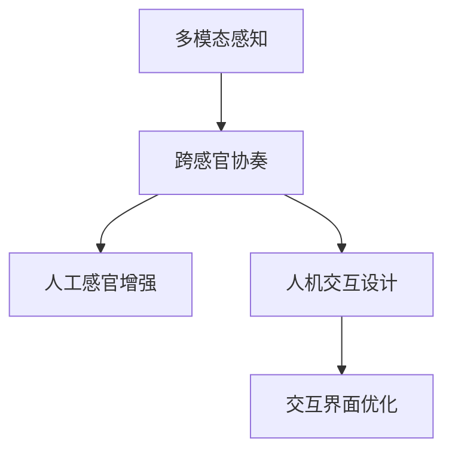

                 

# 体验的跨感官协奏：AI创造的感官交响曲

> 关键词：多模态感知,跨感官协奏,人工感官增强,人机交互设计,交互界面优化

## 1. 背景介绍

### 1.1 问题由来
随着人类社会进入数字时代，AI技术不断融入人们的日常生活，从简单的语音识别到复杂的视觉理解，AI已经成为我们生活中不可或缺的一部分。然而，尽管AI在单模态（如视觉、听觉）任务上取得了显著的进展，但不同模态之间信息融合与交互的问题仍未得到有效解决。如何在多模态环境中实现自然、流畅的跨感官交互，提升用户的体验，成为了当前人工智能领域的重要课题。

### 1.2 问题核心关键点
多模态感知（Multimodal Perception）是AI实现跨感官交互的关键技术，它涉及到视觉、听觉、触觉、嗅觉、味觉等多种感官信息的综合处理与理解。在实际应用中，多模态感知不仅要处理单一模态的输入，还需要对不同模态间的信息进行融合与协同工作，从而实现复杂、真实的交互体验。

## 2. 核心概念与联系

### 2.1 核心概念概述

为更好地理解多模态感知技术，本节将介绍几个密切相关的核心概念：

- **多模态感知（Multimodal Perception）**：指同时处理和理解来自多个感官的信息，以实现更准确、全面的环境理解。多模态感知涉及到视觉、听觉、触觉、嗅觉、味觉等多种感官信息的综合处理与理解。

- **跨感官协奏（Cross-Sensory Concordance）**：指不同感官信息之间的协同工作与交互，通过信息的互补与融合，提升用户的感知体验。

- **人工感官增强（Artificial Sensory Enhancement）**：指通过技术手段增强人类感官的能力，实现超人类的感知体验。

- **人机交互设计（Human-Computer Interaction Design）**：指设计高效、自然的人机交互界面，提升用户体验与交互效率。

- **交互界面优化（User Interface Optimization）**：指通过优化交互界面的设计，提升用户的操作体验与系统响应速度。

这些核心概念之间的逻辑关系可以通过以下Mermaid流程图来展示：



这个流程图展示了几者之间的相互联系：多模态感知是跨感官协奏的基础，通过增强人类感官和优化交互界面，最终实现高效、自然的人机交互。

## 3. 核心算法原理 & 具体操作步骤

### 3.1 算法原理概述

多模态感知的核心在于如何将不同模态的信息进行有效的融合与协同工作，从而提升用户的感知体验。其基本原理包括以下几个方面：

1. **数据预处理**：对不同模态的数据进行预处理，如降噪、归一化、转换格式等，为后续融合奠定基础。

2. **信息融合**：通过融合算法（如权重叠加、加权平均、最大值选择等），将不同模态的信息整合为一个综合感知结果。

3. **上下文理解**：结合上下文信息，如时间、空间、行为等，对融合结果进行进一步的理解和解释。

4. **反馈机制**：将融合结果通过交互界面返回给用户，并根据用户反馈进一步优化感知模型。

### 3.2 算法步骤详解

基于以上原理，多模态感知算法主要分为以下几个步骤：

**Step 1: 数据预处理**

1. **视觉数据预处理**：对摄像头采集的图像数据进行降噪、去畸、增强等预处理操作，以提高图像质量。

2. **听觉数据预处理**：对麦克风采集的音频数据进行降噪、回声消除、语音增强等预处理操作，以提高语音清晰度。

3. **触觉数据预处理**：对触觉传感器采集的数据进行归一化、滤波、降噪等处理，以提高数据准确性。

**Step 2: 信息融合**

1. **视觉与听觉融合**：利用深度学习模型（如卷积神经网络CNN、循环神经网络RNN等）对视觉和听觉数据进行特征提取，然后通过融合算法将视觉特征和语音特征整合为综合感知结果。

2. **触觉与视觉融合**：对触觉传感器采集的数据进行特征提取，然后将触觉特征与视觉特征通过加权平均、最大值选择等方式进行融合。

**Step 3: 上下文理解**

1. **时间上下文**：结合时间信息（如当前时间、持续时间等）对融合结果进行进一步的理解和解释。

2. **空间上下文**：结合空间信息（如当前位置、移动路径等）对融合结果进行进一步的理解和解释。

3. **行为上下文**：结合用户行为（如操作序列、动作轨迹等）对融合结果进行进一步的理解和解释。

**Step 4: 反馈机制**

1. **交互界面设计**：设计高效、自然的人机交互界面，将融合结果以直观的方式呈现给用户。

2. **用户反馈采集**：通过交互界面收集用户对感知结果的反馈，包括评分、点击、滑动等操作。

3. **模型优化**：根据用户反馈，进一步优化感知模型，提高感知效果。

### 3.3 算法优缺点

多模态感知算法具有以下优点：

1. **感知全面性**：通过融合多个模态的信息，实现更全面、准确的感知。

2. **用户体验提升**：通过协同工作与交互，提升用户的感知体验与交互效率。

3. **技术应用广泛**：多模态感知技术可以应用于多个领域，如智能家居、医疗、教育等。

同时，该算法也存在一定的局限性：

1. **数据采集成本高**：多模态感知需要采集多种感官信息，采集成本较高。

2. **信息融合复杂**：不同模态的信息可能需要不同的处理方式，信息融合算法复杂。

3. **设备兼容性差**：不同模态的设备性能差异较大，设备兼容性较差。

4. **用户隐私保护**：多模态感知涉及用户的隐私数据，如何保护用户隐私是个重要问题。

尽管存在这些局限性，但就目前而言，多模态感知技术仍是大数据、人工智能领域的重要研究方向，具有广阔的应用前景。

### 3.4 算法应用领域

多模态感知技术在多个领域都有广泛的应用，例如：

- **智能家居**：通过融合视觉、听觉、触觉等数据，实现智能家电控制、环境监测、安全预警等功能。

- **医疗健康**：结合视觉、触觉、生化数据，实现疾病诊断、康复训练、远程监控等功能。

- **教育培训**：通过视觉、听觉、触觉等多模态信息，提升教学互动性、个性化学习效果。

- **自动驾驶**：结合视觉、激光雷达、毫米波雷达等数据，实现精准定位、障碍物检测、路径规划等功能。

- **游戏娱乐**：通过视觉、触觉、语音等多模态信息，提升游戏体验、人机交互效果。

以上应用场景只是多模态感知技术的一部分，随着技术的不断进步，未来其在更多领域的应用将带来更多创新与变革。

## 4. 数学模型和公式 & 详细讲解 & 举例说明

### 4.1 数学模型构建

多模态感知算法的核心在于将不同模态的数据进行有效的融合，其数学模型可以表示为：

$$
\mathcal{P} = f(\mathcal{V}, \mathcal{A}, \mathcal{T}, \mathcal{B}, \mathcal{C})
$$

其中：

- $\mathcal{V}$ 表示视觉信息
- $\mathcal{A}$ 表示听觉信息
- $\mathcal{T}$ 表示触觉信息
- $\mathcal{B}$ 表示行为信息
- $\mathcal{C}$ 表示上下文信息

函数 $f$ 表示融合算法，通过将不同模态的信息整合，得到一个综合感知结果 $\mathcal{P}$。

### 4.2 公式推导过程

以视觉和听觉信息的融合为例，我们可以使用卷积神经网络（CNN）对视觉和听觉数据进行特征提取，然后通过加权平均的方式进行融合。假设视觉特征向量为 $\mathcal{V} \in \mathbb{R}^{d_V}$，听觉特征向量为 $\mathcal{A} \in \mathbb{R}^{d_A}$，融合结果 $\mathcal{P} \in \mathbb{R}^{d_P}$ 可以通过以下公式计算：

$$
\mathcal{P} = \alpha \mathcal{V} + (1 - \alpha) \mathcal{A}
$$

其中 $\alpha$ 为视觉特征的权重，$1 - \alpha$ 为听觉特征的权重，通常情况下 $\alpha$ 的值需要通过实验来确定。

### 4.3 案例分析与讲解

以智能家居为例，我们可以设计一个多模态感知系统，实现对家居环境的智能控制。系统可以通过摄像头获取视觉数据，通过麦克风获取听觉数据，通过传感器获取触觉数据，结合用户的操作行为，对家居设备进行智能控制。

具体实现步骤如下：

1. **数据采集**：通过摄像头、麦克风、传感器等设备采集视觉、听觉、触觉数据。

2. **数据预处理**：对采集到的数据进行降噪、去畸、增强等预处理操作。

3. **信息融合**：利用CNN模型对视觉和听觉数据进行特征提取，然后将视觉特征和听觉特征通过加权平均的方式进行融合。

4. **上下文理解**：结合时间、空间、行为等上下文信息，对融合结果进行进一步的理解和解释。

5. **反馈机制**：通过交互界面设计，将融合结果以直观的方式呈现给用户，并通过用户反馈进行模型优化。

6. **设备控制**：根据融合结果，对家居设备进行智能控制，如调节温度、开关灯光、播放音乐等。

## 5. 项目实践：代码实例和详细解释说明

### 5.1 开发环境搭建

在进行多模态感知项目开发前，我们需要准备好开发环境。以下是使用Python进行多模态感知系统开发的完整环境配置流程：

1. **安装Python**：从官网下载并安装Python，建议安装最新版本的Python 3。

2. **安装PyTorch**：从官网下载并安装PyTorch，建议安装最新版。

3. **安装OpenCV**：安装OpenCV库，用于处理摄像头采集的图像数据。

4. **安装PyAudio**：安装PyAudio库，用于处理麦克风采集的音频数据。

5. **安装TensorFlow**：安装TensorFlow，用于深度学习模型的训练和推理。

6. **安装其他工具包**：如numpy、pandas、scikit-learn、matplotlib等，用于数据处理和可视化。

完成上述步骤后，即可在Python环境中开始多模态感知系统的开发。

### 5.2 源代码详细实现

以下是一个简单的多模态感知系统示例，实现对智能家居环境的智能控制。代码使用了PyTorch和OpenCV库，具体实现步骤如下：

1. **摄像头数据采集**：
```python
import cv2

cap = cv2.VideoCapture(0)
while cap.isOpened():
    ret, frame = cap.read()
    if not ret:
        break
    cv2.imshow('frame', frame)
    if cv2.waitKey(1) & 0xFF == ord('q'):
        break
cap.release()
cv2.destroyAllWindows()
```

2. **麦克风数据采集**：
```python
import pyaudio
import wave

p = pyaudio.PyAudio()
stream = p.open(format=pyaudio.paInt16, channels=2, rate=16000, input=True, frames_per_buffer=1024)
while True:
    data = stream.read(1024)
    audio_data = pyaudio.paInt16.from_string(data, count=1024, width=2)
    print(audio_data)
```

3. **信息融合**：
```python
import torch
from torch import nn
from torch.nn import Conv2d, MaxPool2d, Flatten, Linear

class MultimodalModel(nn.Module):
    def __init__(self):
        super(MultimodalModel, self).__init__()
        self.vision_encoder = nn.Sequential(
            Conv2d(3, 64, kernel_size=3, stride=1, padding=1),
            MaxPool2d(kernel_size=2, stride=2),
            Conv2d(64, 128, kernel_size=3, stride=1, padding=1),
            MaxPool2d(kernel_size=2, stride=2),
            Conv2d(128, 256, kernel_size=3, stride=1, padding=1),
            MaxPool2d(kernel_size=2, stride=2),
            Flatten()
        )
        self.audio_encoder = nn.Sequential(
            nn.Linear(1024, 256),
            nn.ReLU(),
            nn.Linear(256, 128),
            nn.ReLU(),
            nn.Linear(128, 64),
            nn.ReLU(),
            nn.Linear(64, 32)
        )
        self.fusion_layer = nn.Linear(32 + 256, 64)
        self.classifier = nn.Linear(64, 2)

    def forward(self, vision, audio):
        vision_features = self.vision_encoder(vision)
        audio_features = self.audio_encoder(audio)
        fusion_features = torch.cat((vision_features, audio_features), dim=1)
        fusion_result = self.fusion_layer(fusion_features)
        output = self.classifier(fusion_result)
        return output

# 训练模型
model = MultimodalModel()
optimizer = torch.optim.Adam(model.parameters(), lr=0.001)
criterion = nn.CrossEntropyLoss()

# 训练数据
vision_data = ... # 从摄像头获取的图像数据
audio_data = ... # 从麦克风获取的音频数据

# 训练过程
for epoch in range(100):
    for i, (vision, audio, label) in enumerate(train_loader):
        vision = vision.unsqueeze(0)
        audio = audio.unsqueeze(0)
        output = model(vision, audio)
        loss = criterion(output, label)
        optimizer.zero_grad()
        loss.backward()
        optimizer.step()
```

4. **模型优化与输出**：
```python
import matplotlib.pyplot as plt

# 测试模型
test_vision_data = ... # 从摄像头获取的测试图像数据
test_audio_data = ... # 从麦克风获取的测试音频数据
test_label = ... # 测试数据的标签

with torch.no_grad():
    output = model(test_vision_data, test_audio_data)
    predicted_label = output.argmax(1)
    plt.scatter(test_label, predicted_label)
    plt.xlabel('True Label')
    plt.ylabel('Predicted Label')
    plt.title('Multimodal Classification Results')
    plt.show()
```

### 5.3 代码解读与分析

让我们再详细解读一下关键代码的实现细节：

1. **摄像头数据采集**：
   ```python
   import cv2

   cap = cv2.VideoCapture(0)
   while cap.isOpened():
       ret, frame = cap.read()
       if not ret:
           break
       cv2.imshow('frame', frame)
       if cv2.waitKey(1) & 0xFF == ord('q'):
           break
   cap.release()
   cv2.destroyAllWindows()
   ```

   这段代码使用OpenCV库实现摄像头数据的采集。`cv2.VideoCapture(0)`用于打开摄像头设备，`cap.read()`用于读取摄像头采集的图像数据。`cv2.imshow('frame', frame)`用于显示采集到的图像，`cv2.waitKey(1)`用于等待按键输入，`cv2.destroyAllWindows()`用于关闭所有窗口。

2. **麦克风数据采集**：
   ```python
   import pyaudio
   import wave

   p = pyaudio.PyAudio()
   stream = p.open(format=pyaudio.paInt16, channels=2, rate=16000, input=True, frames_per_buffer=1024)
   while True:
       data = stream.read(1024)
       audio_data = pyaudio.paInt16.from_string(data, count=1024, width=2)
       print(audio_data)
   ```

   这段代码使用PyAudio库实现麦克风数据的采集。`pyaudio.PyAudio()`用于创建音频流，`stream.read(1024)`用于读取音频数据，`pyaudio.paInt16.from_string(data, count=1024, width=2)`用于将音频数据转换为Python数组。

3. **信息融合**：
   ```python
   import torch
   from torch import nn
   from torch.nn import Conv2d, MaxPool2d, Flatten, Linear

   class MultimodalModel(nn.Module):
       def __init__(self):
           super(MultimodalModel, self).__init__()
           self.vision_encoder = nn.Sequential(
               Conv2d(3, 64, kernel_size=3, stride=1, padding=1),
               MaxPool2d(kernel_size=2, stride=2),
               Conv2d(64, 128, kernel_size=3, stride=1, padding=1),
               MaxPool2d(kernel_size=2, stride=2),
               Conv2d(128, 256, kernel_size=3, stride=1, padding=1),
               MaxPool2d(kernel_size=2, stride=2),
               Flatten()
           )
           self.audio_encoder = nn.Sequential(
               nn.Linear(1024, 256),
               nn.ReLU(),
               nn.Linear(256, 128),
               nn.ReLU(),
               nn.Linear(128, 64),
               nn.ReLU(),
               nn.Linear(64, 32)
           )
           self.fusion_layer = nn.Linear(32 + 256, 64)
           self.classifier = nn.Linear(64, 2)

       def forward(self, vision, audio):
           vision_features = self.vision_encoder(vision)
           audio_features = self.audio_encoder(audio)
           fusion_features = torch.cat((vision_features, audio_features), dim=1)
           fusion_result = self.fusion_layer(fusion_features)
           output = self.classifier(fusion_result)
           return output

   # 训练模型
   model = MultimodalModel()
   optimizer = torch.optim.Adam(model.parameters(), lr=0.001)
   criterion = nn.CrossEntropyLoss()

   # 训练数据
   vision_data = ... # 从摄像头获取的图像数据
   audio_data = ... # 从麦克风获取的音频数据

   # 训练过程
   for epoch in range(100):
       for i, (vision, audio, label) in enumerate(train_loader):
           vision = vision.unsqueeze(0)
           audio = audio.unsqueeze(0)
           output = model(vision, audio)
           loss = criterion(output, label)
           optimizer.zero_grad()
           loss.backward()
           optimizer.step()
   ```

   这段代码定义了一个多模态感知模型，包括视觉和听觉的编码器、融合层和分类器。`nn.Conv2d`和`nn.MaxPool2d`用于对视觉数据进行特征提取，`nn.Linear`用于对听觉数据进行特征提取和分类。`torch.cat`用于将视觉和听觉特征进行融合，`nn.Linear`用于将融合结果进行分类。`nn.CrossEntropyLoss`用于计算损失函数，`torch.optim.Adam`用于优化模型参数。

4. **模型优化与输出**：
   ```python
   import matplotlib.pyplot as plt

   # 测试模型
   test_vision_data = ... # 从摄像头获取的测试图像数据
   test_audio_data = ... # 从麦克风获取的测试音频数据
   test_label = ... # 测试数据的标签

   with torch.no_grad():
       output = model(test_vision_data, test_audio_data)
       predicted_label = output.argmax(1)
       plt.scatter(test_label, predicted_label)
       plt.xlabel('True Label')
       plt.ylabel('Predicted Label')
       plt.title('Multimodal Classification Results')
       plt.show()
   ```

   这段代码用于测试多模态感知模型的分类效果。`torch.no_grad()`用于关闭梯度计算，以提高测试速度。`output.argmax(1)`用于获取预测结果，`plt.scatter`用于绘制预测结果与真实标签的散点图。

## 6. 实际应用场景

### 6.1 智能家居系统

多模态感知技术在智能家居系统中的应用，可以大幅提升用户体验和生活便利性。智能家居系统通过融合视觉、听觉、触觉等数据，实现对家居环境的智能控制。例如，可以通过摄像头监控家庭安全，通过语音助手播放音乐，通过触觉传感器控制灯光等。

### 6.2 医疗诊断系统

在医疗诊断系统中，多模态感知技术可以通过融合视觉、触觉、生化数据，实现疾病的早期检测和精准诊断。例如，通过视觉传感器获取图像数据，通过触觉传感器获取患者体征数据，通过生化分析仪获取生化指标数据，结合医生的诊断经验，实现更全面的疾病诊断。

### 6.3 自动驾驶系统

在自动驾驶系统中，多模态感知技术可以通过融合视觉、激光雷达、毫米波雷达等数据，实现精准定位、障碍物检测、路径规划等功能。例如，通过视觉传感器获取道路信息，通过激光雷达获取障碍物位置，通过毫米波雷达获取车辆运动状态，结合自动驾驶算法，实现智能驾驶。

## 7. 工具和资源推荐

### 7.1 学习资源推荐

为了帮助开发者系统掌握多模态感知技术的理论基础和实践技巧，这里推荐一些优质的学习资源：

1. **《深度学习》书籍**：由深度学习领域专家撰写，全面介绍了深度学习的基本概念和算法。

2. **《多模态感知技术》课程**：由AI专家开设的在线课程，涵盖多模态感知技术的理论基础和实践技巧。

3. **《多模态交互设计》书籍**：介绍了多模态交互设计的基本原理和实践方法，适用于人机交互设计师。

4. **《AI开发工具》课程**：介绍了常用的AI开发工具和库的使用方法，包括PyTorch、TensorFlow、OpenCV等。

5. **Kaggle平台**：提供丰富的数据集和竞赛任务，帮助开发者进行多模态感知技术的实践和比赛。

### 7.2 开发工具推荐

高效的开发离不开优秀的工具支持。以下是几款用于多模态感知系统开发的常用工具：

1. **PyTorch**：基于Python的开源深度学习框架，灵活动态的计算图，适合快速迭代研究。

2. **TensorFlow**：由Google主导开发的开源深度学习框架，生产部署方便，适合大规模工程应用。

3. **OpenCV**：开源计算机视觉库，提供了丰富的图像处理功能，适用于摄像头数据的采集和处理。

4. **PyAudio**：开源音频处理库，提供了丰富的音频处理功能，适用于麦克风数据的采集和处理。

5. **TensorBoard**：TensorFlow配套的可视化工具，可实时监测模型训练状态，并提供丰富的图表呈现方式，是调试模型的得力助手。

### 7.3 相关论文推荐

多模态感知技术的发展源于学界的持续研究。以下是几篇奠基性的相关论文，推荐阅读：

1. **《多模态感知与融合》**：介绍多模态感知技术的基本原理和信息融合方法。

2. **《深度学习在多模态感知中的应用》**：探讨深度学习在多模态感知中的优势和局限。

3. **《多模态交互设计与用户感知》**：探讨多模态交互设计对用户感知的影响。

4. **《多模态感知与认知科学》**：探讨多模态感知与人类认知科学的关系。

5. **《多模态感知技术的发展与应用》**：全面回顾多模态感知技术的发展历程和应用场景。

这些论文代表了大模态感知技术的发展脉络。通过学习这些前沿成果，可以帮助研究者把握学科前进方向，激发更多的创新灵感。

## 8. 总结：未来发展趋势与挑战

### 8.1 总结

本文对多模态感知技术进行了全面系统的介绍。首先阐述了多模态感知技术的背景和意义，明确了多模态感知技术在提升用户体验、实现智能化交互方面的独特价值。其次，从原理到实践，详细讲解了多模态感知技术的核心算法和操作步骤，给出了多模态感知系统开发的完整代码实例。同时，本文还探讨了多模态感知技术在智能家居、医疗、自动驾驶等领域的广泛应用，展示了多模态感知技术的广阔前景。最后，本文精选了多模态感知技术的各类学习资源，力求为开发者提供全方位的技术指引。

通过本文的系统梳理，可以看到，多模态感知技术已经成为人工智能领域的重要研究方向，其理论基础和实践技巧正在不断成熟和完善。未来，随着技术的不断进步，多模态感知技术必将在更多领域得到应用，为构建智能交互系统提供新的可能性。

### 8.2 未来发展趋势

展望未来，多模态感知技术将呈现以下几个发展趋势：

1. **多模态感知算法的优化**：通过更高效的融合算法和更全面的上下文理解，提升多模态感知的准确性和实时性。

2. **用户交互界面的优化**：通过更自然、直观的交互界面设计，提升用户体验和交互效率。

3. **跨模态信息的融合**：通过引入更多跨模态信息，如嗅觉、味觉等，进一步提升多模态感知的能力和应用范围。

4. **个性化体验的设计**：通过更深入的用户行为分析，提供个性化的多模态感知体验，提升用户满意度和忠诚度。

5. **边缘计算的应用**：将多模态感知系统部署在边缘计算设备上，实现更快速、更实时的信息融合与处理。

这些趋势凸显了多模态感知技术的广阔前景。这些方向的探索发展，必将进一步提升多模态感知系统的性能和应用范围，为构建更加智能的交互系统提供新的技术手段。

### 8.3 面临的挑战

尽管多模态感知技术已经取得了显著进展，但在迈向更加智能化、普适化应用的过程中，它仍面临着诸多挑战：

1. **数据采集成本高**：多模态感知需要采集多种感官信息，采集成本较高。

2. **信息融合复杂**：不同模态的信息可能需要不同的处理方式，信息融合算法复杂。

3. **设备兼容性差**：不同模态的设备性能差异较大，设备兼容性较差。

4. **用户隐私保护**：多模态感知涉及用户的隐私数据，如何保护用户隐私是个重要问题。

5. **模型复杂度高**：多模态感知模型的参数量较大，训练和推理复杂度高。

尽管存在这些挑战，但随着技术的不断进步和算力的不断提升，多模态感知技术的瓶颈正在逐步被突破，未来必将带来更多创新与应用。

### 8.4 研究展望

面对多模态感知技术所面临的种种挑战，未来的研究需要在以下几个方面寻求新的突破：

1. **无监督和半监督学习**：探索无监督和半监督学习方法，利用非结构化数据进行多模态感知训练，降低对标注数据的依赖。

2. **跨模态深度学习**：研究跨模态深度学习方法，提升多模态感知模型的融合能力。

3. **多模态认知科学**：研究多模态感知与人类认知科学的关系，提升多模态感知的理性和科学性。

4. **多模态交互设计**：研究多模态交互设计的理论基础和实践方法，提升用户体验和交互效率。

5. **隐私保护技术**：研究隐私保护技术，保护用户隐私，增强多模态感知系统的可信度。

6. **边缘计算技术**：研究边缘计算技术，提升多模态感知系统的实时性和响应速度。

这些研究方向的探索，必将引领多模态感知技术迈向更高的台阶，为构建更加智能、安全、可控的多模态感知系统提供新的技术手段。面向未来，多模态感知技术还需要与其他人工智能技术进行更深入的融合，如知识表示、因果推理、强化学习等，多路径协同发力，共同推动人工智能技术的发展和应用。

## 9. 附录：常见问题与解答

**Q1: 多模态感知技术是否适用于所有应用场景？**

A: 多模态感知技术可以应用于多种应用场景，但并不是所有场景都适合使用。例如，对于单模态的信息处理任务，如简单的图像识别、语音识别等，单模态感知技术可能更加高效。但对于复杂的交互任务，如智能家居控制、医疗诊断等，多模态感知技术可以提供更全面的感知能力，提升用户体验。

**Q2: 多模态感知技术是否需要高性能硬件支持？**

A: 多模态感知技术需要采集和处理多种感官数据，对硬件设备的要求较高。例如，摄像头和麦克风需要高性能的图像处理和音频处理设备，触觉传感器需要高精度的传感设备。因此，在应用多模态感知技术时，需要考虑硬件设备的性能和成本。

**Q3: 多模态感知技术的实际应用有哪些？**

A: 多模态感知技术可以应用于多种实际场景，如智能家居、医疗诊断、自动驾驶等。例如，智能家居可以通过摄像头和麦克风实现视觉和听觉的多模态感知，提升用户体验；医疗诊断可以通过视觉和触觉传感器实现多模态感知，提高诊断的准确性；自动驾驶可以通过摄像头和激光雷达实现多模态感知，提高行驶的安全性。

**Q4: 多模态感知技术的前景如何？**

A: 多模态感知技术具有广阔的前景。随着技术的发展和硬件性能的提升，多模态感知技术的应用场景将不断扩展，从简单的交互任务到复杂的认知任务，都将受益于多模态感知技术。未来，多模态感知技术必将成为人工智能领域的重要研究方向，为构建智能交互系统提供新的技术手段。

---

作者：禅与计算机程序设计艺术 / Zen and the Art of Computer Programming

