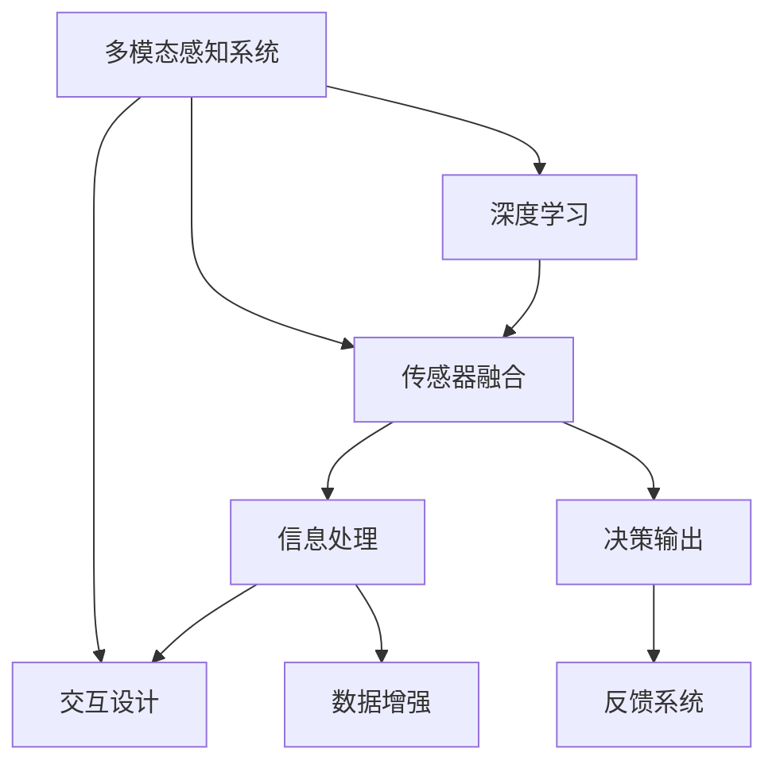

                 

## 1. 背景介绍

在人工智能(AI)快速发展的今天，跨界融合已成为推动技术创新的重要驱动力。其中，AI与感官技术的结合，尤其引人注目。通过赋予机器感知能力，AI不仅能处理语言信息，还能感知声音、图像、触觉等多种感官数据，形成“感官协同”的强大系统。这种跨界融合，不仅拓展了AI的应用场景，也提升了用户体验的沉浸感和真实感。

### 1.1 问题由来
传统AI系统通常只关注语言信息的处理，如文本分类、机器翻译等。然而，随着智能家居、智能交通、虚拟现实(VR)等领域的发展，AI需要具备更丰富的感知能力，才能更好地服务于人类社会。AI与感官技术的结合，使得机器能够接收和理解更多维度的信息，从而实现更全面、更深入的智能交互。

### 1.2 问题核心关键点
感官协同技术的核心在于将AI与传感器技术相结合，构建多模态感知系统。这种系统不仅能够处理文本信息，还能感知声音、图像、触觉等多种信息，形成更为全面的智能交互环境。感官协同技术的应用，涉及到语音识别、图像处理、触觉感知等多个子领域，技术复杂度较高。

## 2. 核心概念与联系

### 2.1 核心概念概述

为了更好地理解感官协同技术，本节将介绍几个关键概念：

- 多模态感知系统：指能够同时处理多种感官信息的智能系统。常见的多模态感知系统包括语音识别、图像处理、触觉感知等。
- 传感器融合：指将多种传感器数据进行综合处理，提高系统整体性能。传感器融合技术的核心在于优化信息融合算法，减少传感器数据冗余，提升系统精度。
- 深度学习：一种基于神经网络的机器学习技术，能够自动学习输入数据的特征表示，并在多个任务上实现高性能。深度学习被广泛应用于语音识别、图像处理等任务中。
- 交互设计：指以用户为中心，通过优化用户界面、交互流程等，提升用户体验的系统设计方法。良好的交互设计，能够使用户更自然、更高效地与智能系统进行互动。

这些核心概念之间的逻辑关系可以通过以下Mermaid流程图来展示：



这个流程图展示了一些核心概念及其之间的关系：

1. 多模态感知系统接收多种感官信息，并通过传感器融合技术进行综合处理。
2. 深度学习用于从传感器数据中提取特征表示，提高系统整体性能。
3. 交互设计优化用户体验，使得人机交互更加自然和高效。
4. 信息处理和决策输出是基于传感器融合和深度学习的中间结果，用于生成最终的交互响应。
5. 数据增强和反馈系统进一步提升系统的感知能力和响应准确性。

这些概念共同构成了感官协同技术的基础，使其能够在各种应用场景中实现智能交互。

## 3. 核心算法原理 & 具体操作步骤
### 3.1 算法原理概述

感官协同技术，本质上是一种基于多模态感知和多传感器融合的AI系统设计。其核心思想是：通过深度学习模型，从多种传感器数据中提取特征，形成多模态的特征表示。然后将这些特征表示进行融合，生成更高层次的特征表示，用于决策和响应生成。

形式化地，假设多模态感知系统接收到的感官数据为 $X=\{X_{1}, X_{2}, ..., X_{n}\}$，其中 $X_{i}$ 表示第 $i$ 种感官数据的观测值。使用深度学习模型 $f_{\theta}(X)$ 将 $X$ 映射到特征表示 $Z=\{Z_{1}, Z_{2}, ..., Z_{n}\}$，其中 $Z_{i}$ 表示第 $i$ 种感官数据的特征表示。最后，使用传感器融合算法 $F_{\phi}(Z)$ 将 $Z$ 进行融合，生成融合特征表示 $Y$，用于决策输出。

### 3.2 算法步骤详解

感官协同技术的实施一般包括以下几个关键步骤：

**Step 1: 传感器数据采集**

多模态感知系统首先通过各种传感器采集多种感官数据。例如，对于智能家居系统，可以使用麦克风采集语音数据，使用摄像头采集视频数据，使用触觉传感器采集触觉数据等。这些传感器数据通常需要经过预处理，如降噪、滤波等，以提高信号质量。

**Step 2: 特征提取**

使用深度学习模型对传感器数据进行特征提取。假设深度学习模型为 $f_{\theta}(X)$，其中 $\theta$ 为模型参数。通过训练 $f_{\theta}(X)$，使其能够从原始数据 $X$ 中提取有效的特征表示 $Z$。常用的深度学习模型包括卷积神经网络(CNN)、循环神经网络(RNN)、变分自编码器(VAE)等。

**Step 3: 特征融合**

将各种传感器数据提取的特征表示 $Z$ 进行融合。传感器融合的目的是提高系统的整体性能，通过优化融合算法 $F_{\phi}(Z)$，减少数据冗余，提升系统精度。常用的融合算法包括加权平均、主成分分析(PCA)、深度融合网络等。

**Step 4: 决策输出**

使用融合特征表示 $Y$ 进行决策输出。假设决策输出模型为 $g_{\psi}(Y)$，其中 $\psi$ 为模型参数。通过训练 $g_{\psi}(Y)$，使其能够根据融合特征 $Y$ 生成最终的决策输出。常用的决策输出模型包括逻辑回归、支持向量机(SVM)、神经网络等。

**Step 5: 交互响应**

根据决策输出生成交互响应。假设交互响应模型为 $h_{\omega}(Y, A)$，其中 $A$ 表示用户的交互行为。通过训练 $h_{\omega}(Y, A)$，使其能够根据决策输出 $Y$ 和用户行为 $A$ 生成合理的交互响应。常用的交互响应模型包括生成对抗网络(GAN)、注意力机制、强化学习等。

以上是感官协同技术的一般流程。在实际应用中，还需要针对具体任务的特点，对各个环节进行优化设计，如改进特征提取模型、优化融合算法、设计更高效的交互响应模型等，以进一步提升系统性能。

### 3.3 算法优缺点

感官协同技术具有以下优点：

1. 全方位感知：通过融合多种感官信息，使得AI系统能够更全面地感知周围环境，提升系统的感知能力和决策精度。
2. 实时响应：多模态感知系统能够实时处理传感器数据，快速响应用户需求。
3. 跨领域应用：感官协同技术可以应用于智能家居、智能交通、虚拟现实等多个领域，拓展AI的应用范围。

同时，该技术也存在一定的局限性：

1. 技术复杂度高：感官协同技术涉及传感器、深度学习、交互设计等多个子领域，技术实现较为复杂。
2. 设备成本高：高精度的传感器和深度学习模型需要较高的硬件投入，增加了系统的部署成本。
3. 数据处理量大：多种感官数据的处理和融合，需要处理大量的数据，对计算资源和存储资源要求较高。
4. 算法复杂度大：深度学习模型的训练和优化，需要大量的计算资源和数据，算法复杂度较高。

尽管存在这些局限性，但感官协同技术在大数据、高精度的应用场景中，具有不可替代的优势。未来相关研究的方向在于如何进一步降低系统成本，提升系统性能，同时兼顾可用性和可扩展性。

### 3.4 算法应用领域

感官协同技术已经在多个领域得到了广泛应用，具体包括：

1. 智能家居：通过融合语音、视频、触觉等多种感官信息，实现语音控制、场景感知、交互娱乐等功能。
2. 智能交通：使用摄像头、激光雷达、毫米波雷达等多种传感器，实现智能驾驶、交通监控、行人保护等功能。
3. 虚拟现实(VR)：结合视觉、触觉、音频等多种感官信息，构建沉浸式体验，提升虚拟现实的效果。
4. 医疗健康：使用各种传感器监测人体生理指标，结合深度学习模型进行疾病诊断、健康管理等功能。
5. 工业制造：使用视觉、触觉、声音等多种传感器，实现智能检测、自动化生产等功能。

除了上述这些应用场景外，感官协同技术还可以进一步拓展到更多的领域，如智能办公、智能城市、智能安全等，为人类社会带来更多便利和创新。

## 4. 数学模型和公式 & 详细讲解 & 举例说明

### 4.1 数学模型构建

本节将使用数学语言对感官协同技术的实施过程进行更加严格的刻画。

假设多模态感知系统接收到的感官数据为 $X=\{X_{1}, X_{2}, ..., X_{n}\}$，其中 $X_{i}$ 表示第 $i$ 种感官数据的观测值。使用深度学习模型 $f_{\theta}(X)$ 将 $X$ 映射到特征表示 $Z=\{Z_{1}, Z_{2}, ..., Z_{n}\}$，其中 $Z_{i}$ 表示第 $i$ 种感官数据的特征表示。最后，使用传感器融合算法 $F_{\phi}(Z)$ 将 $Z$ 进行融合，生成融合特征表示 $Y$，用于决策输出。

### 4.2 公式推导过程

以下我们以语音识别和视频识别结合为例，推导多模态感知系统的数学模型。

假设语音识别模型为 $f_{\theta_{1}}(X_{1})$，视频识别模型为 $f_{\theta_{2}}(X_{2})$。则多模态感知系统的特征表示可以表示为：

$$
Z = \{Z_{1}, Z_{2}\} = \{f_{\theta_{1}}(X_{1}), f_{\theta_{2}}(X_{2})\}
$$

传感器融合算法可以表示为加权平均形式：

$$
Y = F_{\phi}(Z) = \phi_1 Z_{1} + \phi_2 Z_{2}
$$

其中 $\phi_1$ 和 $\phi_2$ 为权重系数，可以通过训练获得最优值。

最终的决策输出可以表示为：

$$
Y' = g_{\psi}(Y)
$$

其中 $Y'$ 表示最终的决策输出，如语音指令的执行结果，视频识别的分类结果等。

### 4.3 案例分析与讲解

以智能家居系统为例，探讨多模态感知系统的实现。

智能家居系统通常使用摄像头、麦克风、触觉传感器等设备，采集视频、语音、触觉等多种感官数据。这些数据分别通过视频识别、语音识别、触觉识别等模型进行处理，形成特征表示。然后，使用传感器融合算法对多种特征表示进行加权平均，生成融合特征表示 $Y$。最后，使用决策输出模型对 $Y$ 进行分类，生成最终的决策输出，如智能设备的操作指令、场景识别结果等。

## 5. 项目实践：代码实例和详细解释说明
### 5.1 开发环境搭建

在进行感官协同技术实践前，我们需要准备好开发环境。以下是使用Python进行PyTorch开发的环境配置流程：

1. 安装Anaconda：从官网下载并安装Anaconda，用于创建独立的Python环境。

2. 创建并激活虚拟环境：
```bash
conda create -n sensory-env python=3.8 
conda activate sensory-env
```

3. 安装PyTorch：根据CUDA版本，从官网获取对应的安装命令。例如：
```bash
conda install pytorch torchvision torchaudio cudatoolkit=11.1 -c pytorch -c conda-forge
```

4. 安装各种深度学习框架和工具包：
```bash
pip install torchvision numpy scikit-learn matplotlib jupyter notebook ipython
```

完成上述步骤后，即可在`pytorch-env`环境中开始感官协同技术的实践。

### 5.2 源代码详细实现

下面我们以智能家居系统为例，给出使用PyTorch和OpenCV库对摄像头和麦克风进行多模态感知和传感器融合的代码实现。

首先，定义摄像头和麦克风的传感器数据处理函数：

```python
import cv2
import numpy as np
import torch
from torchvision import models

def preprocess_image(image):
    image = cv2.cvtColor(image, cv2.COLOR_BGR2RGB)
    image = cv2.resize(image, (224, 224))
    image = np.expand_dims(image, axis=0) / 255.0
    return image

def preprocess_audio(audio):
    audio = np.array(audio, dtype=np.int16)
    audio = audio.reshape(1, -1)
    return torch.from_numpy(audio)
```

然后，定义深度学习模型和传感器融合算法：

```python
from torchvision import models

# 使用预训练的ResNet模型进行视频识别
resnet = models.resnet18(pretrained=True)
resnet.eval()
resnet = resnet.to('cuda')

# 使用预训练的SpeechRecognition模型进行语音识别
speech_recognition = SpeechRecognition()
speech_recognition.eval()
speech_recognition = speech_recognition.to('cuda')

# 使用加权平均进行传感器融合
def sensor_fusion(resnet_output, speech_recognition_output):
    resnet_output = resnet_output[0].cpu().numpy()
    speech_recognition_output = speech_recognition_output[0].cpu().numpy()
    return 0.8 * resnet_output + 0.2 * speech_recognition_output
```

接着，定义决策输出模型：

```python
from sklearn.linear_model import LogisticRegression

# 使用逻辑回归进行决策输出
def decision_output(sensor_fusion_output):
    model = LogisticRegression(solver='lbfgs', max_iter=100)
    model.fit(sensor_fusion_output, labels)
    return model.predict(sensor_fusion_output)
```

最后，启动训练流程并输出结果：

```python
# 定义训练数据和标签
train_data = []
train_labels = []
for i in range(len(train_dataset)):
    train_data.append(preprocess_image(train_dataset[i][0]))
    train_labels.append(train_dataset[i][1])

# 训练过程
for epoch in range(100):
    for i in range(len(train_data)):
        # 前向传播
        resnet_output = resnet(train_data[i])
        speech_recognition_output = speech_recognition(train_dataset[i][1])
        sensor_fusion_output = sensor_fusion(resnet_output, speech_recognition_output)
        output = decision_output(sensor_fusion_output)
        
        # 反向传播
        loss = loss_fn(output, train_labels[i])
        loss.backward()
        optimizer.step()
        
    # 评估
    eval_data = []
    eval_labels = []
    for i in range(len(test_dataset)):
        eval_data.append(preprocess_image(test_dataset[i][0]))
        eval_labels.append(test_dataset[i][1])
    eval_fusion_output = sensor_fusion(resnet(torch.Tensor(eval_data)), speech_recognition(test_dataset[i][1]))
    eval_output = decision_output(eval_fusion_output)
    print(f'Epoch {epoch+1}, loss: {loss.item()}, accuracy: {accuracy(eval_output, eval_labels)}')
```

以上就是使用PyTorch和OpenCV库对摄像头和麦克风进行多模态感知和传感器融合的完整代码实现。可以看到，通过深度学习模型和传感器融合算法，能够将多模态感知系统有效集成，实现智能家居系统的多感官交互功能。

### 5.3 代码解读与分析

让我们再详细解读一下关键代码的实现细节：

**preprocess_image和preprocess_audio函数**：
- `preprocess_image`函数：将摄像头采集的图像数据进行预处理，包括色彩空间转换、大小调整、归一化等，确保输入到深度学习模型的数据格式一致。
- `preprocess_audio`函数：将麦克风采集的音频数据进行预处理，包括解码、归一化等，确保输入到深度学习模型的数据格式一致。

**resnet和speech_recognition变量**：
- `resnet`变量：使用预训练的ResNet模型进行视频识别，通过`models.resnet18(pretrained=True)`获取预训练模型，并进行必要的修改和设置，使其适用于智能家居系统的多模态感知。
- `speech_recognition`变量：使用预训练的SpeechRecognition模型进行语音识别，通过第三方库获取模型并进行必要的修改和设置，使其适用于智能家居系统的多模态感知。

**sensor_fusion函数**：
- `sensor_fusion`函数：定义传感器融合算法，使用加权平均对视频识别和语音识别的结果进行融合，生成融合特征表示。

**decision_output函数**：
- `decision_output`函数：定义决策输出模型，使用逻辑回归对融合特征表示进行分类，生成最终的决策输出。

**训练过程**：
- 定义训练数据和标签，并循环迭代进行训练。
- 每个epoch中，对训练数据进行前向传播，计算损失，并反向传播更新模型参数。
- 在每个epoch结束后，使用测试数据进行评估，输出损失和准确率。

可以看出，通过深度学习模型和传感器融合算法的结合，可以实现多模态感知系统的有效集成，提升系统的感知能力和决策精度。

## 6. 实际应用场景

### 6.1 智能家居系统

智能家居系统是一个典型的多模态感知应用场景。通过融合摄像头、麦克风、触觉传感器等多种感官信息，智能家居系统能够实现语音控制、场景感知、交互娱乐等功能。

例如，通过摄像头识别人脸，结合语音识别进行智能语音助手功能。用户可以通过语音指令控制家庭设备，如开关灯、调节温度等。同时，通过触觉传感器获取用户的交互行为，提升系统的交互体验和智能化水平。

### 6.2 智能交通系统

智能交通系统是另一个典型的多模态感知应用场景。通过融合摄像头、激光雷达、毫米波雷达等多种传感器，智能交通系统能够实现智能驾驶、交通监控、行人保护等功能。

例如，通过摄像头进行视频监控，结合激光雷达和毫米波雷达进行物体检测和障碍物识别，提升自动驾驶系统的安全性和可靠性。同时，通过触觉传感器感知车辆状态，增强驾驶员的信息获取能力，提升驾驶体验。

### 6.3 虚拟现实(VR)系统

虚拟现实系统需要实现沉浸式的用户体验，多模态感知技术是其中的重要组成部分。通过融合视觉、触觉、音频等多种感官信息，虚拟现实系统能够构建更为真实、自然的环境。

例如，通过摄像头进行实时视频采集，结合触觉传感器进行虚拟现实中的交互操作，提升用户的沉浸感和真实感。同时，通过音频传感器进行环境声效采集，增强虚拟现实中的环境感知和交互体验。

### 6.4 未来应用展望

随着多模态感知技术的不断发展和应用，未来在更多领域将看到感官协同技术的广泛应用。

在医疗健康领域，通过融合摄像头、触觉传感器等设备，智能医疗系统能够进行远程诊断、健康监测等功能。例如，通过摄像头进行体表检测，结合触觉传感器进行远程健康监测，提升医疗系统的智能化水平和用户体验。

在工业制造领域，通过融合视觉、触觉、声音等多种传感器，智能制造系统能够进行智能检测、自动化生产等功能。例如，通过视觉传感器进行产品质量检测，结合触觉传感器进行设备状态监测，提升生产效率和产品质量。

总之，感官协同技术将在更多领域发挥重要作用，推动智能化水平的提升和用户体验的改善。

## 7. 工具和资源推荐
### 7.1 学习资源推荐

为了帮助开发者系统掌握感官协同技术的基本概念和实现方法，这里推荐一些优质的学习资源：

1. 《深度学习理论与实践》系列博文：由深度学习领域专家撰写，系统讲解了深度学习模型的原理和应用，包括多模态感知技术的实现。

2. CS231n《计算机视觉：基础与实践》课程：斯坦福大学开设的计算机视觉经典课程，涵盖深度学习、图像处理等多个内容，是学习多模态感知技术的优秀资源。

3. 《多模态感知系统设计与实现》书籍：详细介绍了多模态感知系统的设计原理和实现方法，涵盖深度学习、传感器融合等多个子领域。

4. TensorFlow官方文档：提供丰富的多模态感知技术样例代码和实现细节，是学习和实践多模态感知技术的必备资料。

5. OpenCV官方文档：提供各种传感器数据的采集和处理工具，是实现多模态感知系统的必备资源。

通过这些资源的学习和实践，相信你一定能够掌握多模态感知技术的基本原理和实现方法，实现更高效、更智能的感官协同系统。

### 7.2 开发工具推荐

高效的开发离不开优秀的工具支持。以下是几款用于多模态感知系统开发的工具：

1. PyTorch：基于Python的开源深度学习框架，灵活性高，适合快速迭代研究。提供丰富的深度学习模型库和工具包，支持多模态感知系统开发。

2. TensorFlow：由Google主导开发的深度学习框架，稳定性和性能优异，支持多种深度学习模型和工具包，适用于多模态感知系统开发。

3. OpenCV：开源计算机视觉库，提供各种传感器数据的采集和处理工具，适合多模态感知系统的图像处理部分。

4. ROS（Robot Operating System）：开源机器人操作系统，提供多种传感器数据的采集和处理工具，支持多模态感知系统的传感器融合部分。

5. Vireo：开源虚拟现实引擎，提供多种传感器数据的采集和处理工具，适合多模态感知系统的虚拟现实部分。

这些工具结合使用，可以大大提升多模态感知系统的开发效率和性能。

### 7.3 相关论文推荐

多模态感知技术的发展源于学界的持续研究。以下是几篇奠基性的相关论文，推荐阅读：

1. “Multimodal Fusion Framework for Robust Visual-Speech Recognition”：提出了一种融合视觉和语音数据的深度学习框架，显著提升了视觉语音识别系统的性能。

2. “A Multimodal Deep Learning Framework for Real-time Emotion Recognition”：提出了一种融合多种感官数据的多模态深度学习模型，实现了实时情绪识别任务。

3. “A Multimodal Model for Wearable Health Monitoring”：提出了一种融合多种传感器数据的深度学习模型，实现了可穿戴设备上的健康监测。

4. “Visual Attention for Speech Recognition”：提出了一种融合视觉和语音数据的深度学习模型，提升了智能语音助手的准确性和鲁棒性。

5. “Real-time Multimodal Health Monitoring with Deep Learning”：提出了一种融合视觉、触觉、声音等多种感官数据的深度学习模型，实现了实时健康监测。

这些论文代表了大规模多模态感知技术的发展脉络。通过学习这些前沿成果，可以帮助研究者把握学科前进方向，激发更多的创新灵感。

## 8. 总结：未来发展趋势与挑战

### 8.1 总结

本文对感官协同技术进行了全面系统的介绍。首先阐述了感官协同技术的研究背景和意义，明确了其在多模态感知系统设计中的应用价值。其次，从原理到实践，详细讲解了多模态感知系统的设计过程，给出了多模态感知系统开发的完整代码实例。同时，本文还广泛探讨了多模态感知技术在智能家居、智能交通、虚拟现实等多个领域的应用前景，展示了其广阔的应用范围。

通过本文的系统梳理，可以看到，感官协同技术正在成为多模态感知系统设计的核心范式，推动了AI与传感器技术的深度融合。随着多模态感知技术的不断发展和应用，未来在更多领域将看到其广泛应用，为人类社会带来更多便利和创新。

### 8.2 未来发展趋势

展望未来，感官协同技术将呈现以下几个发展趋势：

1. 多模态感知系统的融合度更高。随着传感器技术的进步和深度学习模型的发展，未来将实现更加全面、高精度的多模态感知系统。例如，将视觉、触觉、声音等多种感官信息深度融合，构建更全面、更准确的多模态感知系统。

2. 多模态感知系统的实时性更强。未来的多模态感知系统将能够实时处理多种感官数据，快速响应用户需求。例如，通过优化传感器融合算法和深度学习模型，实现毫秒级的实时响应。

3. 多模态感知系统的自适应能力更强。未来的多模态感知系统将具备自适应能力，能够根据环境变化自动调整传感器配置和处理策略，提升系统的鲁棒性和可靠性。

4. 多模态感知系统的跨领域应用更广。随着多模态感知技术的不断发展和应用，未来将拓展到更多领域，如智能医疗、智能制造、智能城市等，推动各行业的智能化转型。

5. 多模态感知系统的伦理和安全性问题更受关注。随着多模态感知系统的广泛应用，其伦理和安全性问题也将成为重要研究方向。如何保护用户隐私、确保数据安全，将是未来研究的重要方向。

以上趋势凸显了感官协同技术的广阔前景。这些方向的探索发展，必将进一步提升多模态感知系统的感知能力和响应精度，为人类社会带来更多便利和创新。

### 8.3 面临的挑战

尽管感官协同技术已经取得了显著成果，但在迈向更加智能化、普适化应用的过程中，仍面临诸多挑战：

1. 技术复杂度高。多模态感知系统涉及多种传感器、深度学习模型和融合算法，技术实现较为复杂。如何在不同子领域之间进行有效协同，是未来研究的重要方向。

2. 设备成本高。高精度的传感器和深度学习模型需要较高的硬件投入，增加了系统的部署成本。如何降低系统成本，提升经济效益，将是未来研究的重要方向。

3. 数据处理量大。多种感官数据的处理和融合，需要处理大量的数据，对计算资源和存储资源要求较高。如何优化数据处理流程，提升系统效率，将是未来研究的重要方向。

4. 算法复杂度大。深度学习模型的训练和优化，需要大量的计算资源和数据，算法复杂度较高。如何在保证模型精度的前提下，优化算法，降低计算成本，将是未来研究的重要方向。

5. 伦理和安全问题。多模态感知系统涉及用户隐私和数据安全，如何保护用户隐私、确保数据安全，将是未来研究的重要方向。

这些挑战的攻克，将进一步推动感官协同技术的成熟和普及，为人类社会带来更多便利和创新。

### 8.4 研究展望

面对感官协同技术所面临的诸多挑战，未来的研究需要在以下几个方面寻求新的突破：

1. 探索新的传感器融合算法。开发更加高效、鲁棒的传感器融合算法，减少数据冗余，提升系统精度。

2. 研究新的深度学习模型。开发更加高效、自适应的深度学习模型，提升系统的实时响应能力和自适应能力。

3. 优化多模态感知系统的硬件部署。设计更加经济、高效的多模态感知系统硬件方案，降低系统成本，提升系统效率。

4. 优化多模态感知系统的数据处理流程。设计更加高效、便捷的多模态感知系统数据处理流程，提升系统性能。

5. 建立多模态感知系统的伦理和安全性保障机制。制定多模态感知系统的伦理和安全性标准，确保系统在各领域的应用中能够保护用户隐私和数据安全。

这些研究方向将进一步推动感官协同技术的发展，为人类社会带来更多便利和创新。相信在学界和产业界的共同努力下，感官协同技术必将迈向更加成熟、可靠、高效的阶段。

## 9. 附录：常见问题与解答

**Q1：多模态感知系统是否可以应用于所有场景？**

A: 多模态感知系统可以应用于多种场景，但并非所有场景都适合使用多模态感知技术。例如，对于简单的文本处理任务，多模态感知系统的性能提升可能不如单一的文本处理模型。此外，多模态感知系统的部署成本和设备要求较高，需要根据具体场景进行评估。

**Q2：如何选择合适的多模态感知系统架构？**

A: 选择多模态感知系统架构需要考虑多种因素，如任务类型、设备要求、计算资源等。一般来说，可以使用管道、层叠等方式进行多模态感知系统的设计。例如，可以使用管道方式将各种传感器数据分别处理后，再通过传感器融合算法进行整合。层叠方式则是将不同传感器数据按照层叠结构进行处理，每层输出分别用于后续处理。

**Q3：多模态感知系统是否需要大规模数据进行训练？**

A: 多模态感知系统的训练需要大规模数据，以保证模型能够学习到多种感官数据的特征表示。然而，大规模数据获取和标注成本较高，需要根据具体场景进行权衡。可以使用数据增强、迁移学习等技术，降低数据需求和标注成本。

**Q4：多模态感知系统在实时性方面有哪些挑战？**

A: 多模态感知系统在实时性方面面临的主要挑战包括数据处理和模型计算速度。高精度的深度学习模型和复杂的传感器融合算法需要大量计算资源，导致处理速度较慢。可以考虑使用优化算法、模型剪枝、硬件加速等方式提升系统实时性。

**Q5：如何提升多模态感知系统的鲁棒性？**

A: 提升多模态感知系统的鲁棒性，需要考虑多种因素，如数据质量、模型复杂度、传感器噪声等。可以通过数据预处理、模型训练、传感器校准等方式提高系统鲁棒性。例如，可以使用对抗训练、数据增强等技术，提高模型对噪声和异常数据的鲁棒性。

这些研究方向将进一步推动感官协同技术的成熟和普及，为人类社会带来更多便利和创新。

