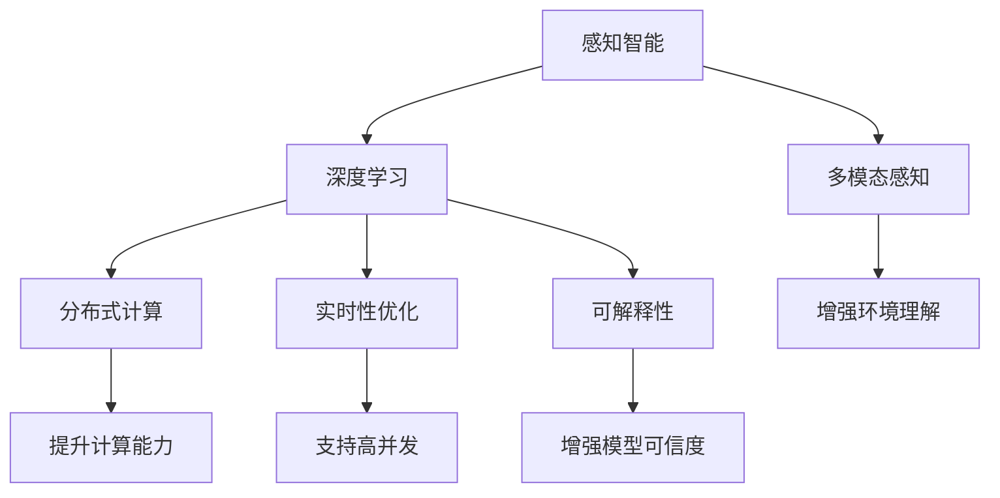

                 

## 1. 背景介绍

### 1.1 问题由来

在信息技术的飞速发展下，人工智能(AI)已深入到人类社会的方方面面，从自动化生产到智能客服，从医疗诊断到自动驾驶，AI的应用领域不断拓展。在这一过程中，感知智能(AI的感知和理解能力)的作用日益凸显，成为推动AI向通用智能发展的关键技术之一。

然而，感知的边界在哪里？如何通过技术手段拓展AI的感知边界，让AI成为真正意义上的跨时空探险家？这些问题引发了学界和业界的广泛关注。本文将围绕感知智能的技术进展、挑战和未来方向进行深入探讨，探索AI如何突破感知边界，实现跨越时空的智能交互。

### 1.2 问题核心关键点

感知智能的拓展依赖于数据、算法、硬件等多方面的突破，包括但不限于：

1. **多模态感知**：将视觉、听觉、触觉等不同模态的感知能力结合起来，实现更加全面、丰富的环境感知。
2. **深度学习**：利用深度神经网络强大的特征提取能力，从海量数据中学习出丰富的感知特征。
3. **分布式计算**：通过分布式计算技术，提升感知任务的并行处理能力，加速感知模型的训练和推理。
4. **实时性优化**：通过硬件加速、模型压缩等手段，提升感知任务的实时性，支持高并发的智能交互。
5. **可解释性**：开发可解释的感知模型，增强感知结果的可信度和透明度。

这些关键点共同构成了感知智能拓展的技术框架，为AI创造新的感知边界提供了有力支持。

### 1.3 问题研究意义

探索AI的感知边界，不仅有助于推动AI技术的发展，更将为人类社会的智能化进步带来深远影响：

1. **提升交互体验**：通过突破感知边界，AI可以更加准确地理解和响应用户的需求，提升人机交互的流畅性和自然性。
2. **驱动行业创新**：感知智能的应用将推动多个行业的数字化转型，如自动驾驶、智慧医疗、智能家居等，创造新的商业价值。
3. **促进科学探索**：感知智能在科学研究中的应用，如分子模拟、天气预测、天文学观测等，将为人类探索未知领域提供新的工具和方法。
4. **增强安全保障**：通过感知智能技术，增强网络安全、公共安全等领域的监控和预警能力，提升社会治理水平。

因此，研究感知智能的拓展具有重要的理论和实践意义，是实现AI通用智能的重要一环。

## 2. 核心概念与联系

### 2.1 核心概念概述

为了更好地理解感知智能的拓展技术，本节将介绍几个关键概念：

- **感知智能**：指AI系统对环境中的视觉、听觉、触觉、温度、湿度等多种信息进行感知和理解的能力。
- **多模态感知**：指将视觉、听觉、触觉等多种感知模态结合起来，提升AI系统的环境感知能力。
- **深度学习**：一种利用神经网络进行多层次特征提取的机器学习方法，广泛应用于感知任务的建模和训练。
- **分布式计算**：通过并行计算和分布式存储技术，提升感知任务的处理能力。
- **实时性优化**：通过硬件加速、模型压缩等技术，提升感知任务的实时性，支持高并发的智能交互。
- **可解释性**：指感知模型的决策过程和输出结果具有透明性和可信度，便于理解和调试。

这些概念之间存在着紧密的联系，通过技术手段的结合和创新，可以不断拓展AI的感知边界，实现更加智能、可靠、高效的人机交互。

### 2.2 核心概念原理和架构的 Mermaid 流程图



这个流程图展示了感知智能的关键技术环节和其内在联系。多模态感知是感知智能的基础，通过深度学习模型提取不同模态的特征，再结合分布式计算和实时性优化，提升感知任务的性能。最后，通过可解释性技术增强模型的可信度和透明度。

## 3. 核心算法原理 & 具体操作步骤
### 3.1 算法原理概述

感知智能的拓展主要依赖于深度学习和多模态感知技术。深度学习模型通过多层神经网络结构，从数据中学习出丰富的特征表示，实现对不同模态信息的有效提取和融合。多模态感知则通过将不同模态的感知结果结合起来，提升AI系统对环境的全面理解和响应能力。

具体而言，感知智能的拓展过程包括以下几个步骤：

1. **数据采集和预处理**：收集多模态数据，包括视觉图像、音频信号、触觉传感器等，并进行预处理，如归一化、去噪等。
2. **特征提取与融合**：利用深度学习模型对不同模态的数据进行特征提取，并通过融合技术将结果整合为一个综合的特征表示。
3. **模型训练与优化**：在综合特征表示的基础上，训练感知模型，并通过优化算法调整模型参数，提升模型的性能。
4. **模型推理与部署**：将训练好的感知模型部署到实际应用场景中，进行实时推理和交互。

### 3.2 算法步骤详解

#### 3.2.1 数据采集和预处理

数据采集是感知智能拓展的第一步，需要确保数据的质量和多样性，以覆盖更多的场景和情况。对于视觉数据，可以使用摄像头、相机等设备进行采集；对于听觉数据，可以使用麦克风、扬声器等设备进行采集；对于触觉数据，可以使用传感器等设备进行采集。

数据预处理包括对数据的清洗、归一化、去噪等操作，以提高数据的质量和一致性。例如，对图像数据进行缩放、旋转、裁剪等操作，对音频数据进行降噪、滤波等操作，对传感器数据进行平滑、校准等操作。

#### 3.2.2 特征提取与融合

特征提取与融合是感知智能拓展的核心步骤，需要选择合适的深度学习模型和融合算法。目前，常用的深度学习模型包括卷积神经网络(CNN)、循环神经网络(RNN)、长短时记忆网络(LSTM)等，这些模型在图像、语音、文本等不同模态的特征提取上表现优异。

多模态特征的融合可以采用不同的策略，如拼接法、堆叠法、注意力机制等。拼接法将不同模态的特征简单地拼接在一起，适用于模态之间具有较高相关性的情况。堆叠法则将不同模态的特征分别输入到多个独立的深度学习模型中进行处理，再将结果拼接或堆叠。注意力机制通过学习不同模态特征的重要性，动态调整融合比例，提升融合效果。

#### 3.2.3 模型训练与优化

模型训练与优化是感知智能拓展的关键步骤，需要选择合适的优化算法和超参数，确保模型能够有效地从数据中学习出有用的特征。常用的优化算法包括随机梯度下降(SGD)、Adam、Adagrad等，不同的算法有不同的参数更新策略和收敛速度。

模型训练的过程中，还需要进行超参数的调优，如学习率、批大小、迭代次数等，以寻找最优的模型参数组合。超参数的调优可以通过网格搜索、随机搜索、贝叶斯优化等方法进行。

#### 3.2.4 模型推理与部署

模型推理与部署是感知智能拓展的最终步骤，需要确保模型能够在实际应用场景中稳定运行，并快速响应环境变化。为了提升推理效率，可以对模型进行优化和压缩，如剪枝、量化、蒸馏等，以减少模型的计算量和存储需求。

模型部署可以通过云平台、边缘计算等技术进行，确保模型能够在不同环境和设备上正常运行。例如，可以将模型部署在云端服务器上进行集中处理，或者通过边缘计算设备进行分布式推理，提升实时性和可靠性。

### 3.3 算法优缺点

感知智能的拓展技术具有以下优点：

1. **提升感知能力**：通过多模态感知和深度学习技术，AI能够更加全面、准确地感知环境信息，提升感知智能的广度和深度。
2. **增强决策能力**：通过特征融合和模型优化，AI能够在复杂环境中进行更加精准的决策，提升智能系统的可信度和可靠性。
3. **支持高并发**：通过分布式计算和实时性优化，AI能够支持高并发的智能交互，满足实际应用的需求。

同时，这些技术也存在一些局限性：

1. **数据依赖**：感知智能的拓展高度依赖于高质量的数据，数据采集和预处理需要耗费大量的时间和资源。
2. **模型复杂性**：深度学习模型和融合算法通常较为复杂，需要较高的计算能力和存储空间，增加了技术实现的难度。
3. **可解释性不足**：感知模型的决策过程复杂，难以提供详细的解释和调试信息，限制了模型的可信度和透明度。
4. **实时性挑战**：在实际应用中，实时性要求较高，需要通过硬件加速、模型压缩等手段进行优化，提升推理效率。

尽管存在这些局限性，感知智能的拓展技术仍在不断进步，未来的研究和应用将进一步提升其性能和应用范围。

### 3.4 算法应用领域

感知智能的拓展技术已经在多个领域得到了广泛应用，例如：

1. **自动驾驶**：通过多模态感知和深度学习技术，实现对交通环境的全面理解和响应，支持自动驾驶汽车的感知和决策。
2. **智慧医疗**：利用感知智能技术，对患者的多模态数据进行综合分析，提升医疗诊断和治疗的准确性和效率。
3. **智能家居**：通过感知智能技术，对家居环境进行智能监测和控制，提升用户的生活质量和便利性。
4. **机器人技术**：利用多模态感知和分布式计算技术，提升机器人在复杂环境中的感知和决策能力，支持人机协作。
5. **安全监控**：通过感知智能技术，对公共场所、工厂等环境进行智能监控和预警，提升安全保障能力。

除了上述这些经典应用领域外，感知智能的拓展技术还在不断拓展，为多个行业带来新的变革。

## 4. 数学模型和公式 & 详细讲解  
### 4.1 数学模型构建

为了更好地描述感知智能的拓展技术，我们将使用数学语言进行详细讲解。

假设输入的多模态数据集为 $X = (X_1, X_2, ..., X_M)$，其中 $X_i$ 为第 $i$ 模态的数据，$i \in [1, M]$。感知模型的目标是对 $X$ 进行综合处理，输出感知结果 $Y$。

感知模型的数学模型可以表示为：

$$
Y = F(X; \theta)
$$

其中 $F$ 为感知模型函数，$\theta$ 为模型参数。对于多模态感知，$F$ 可以表示为：

$$
F(X; \theta) = g_1(f_1(X_1; \theta_1) + f_2(X_2; \theta_2) + ... + f_M(X_M; \theta_M))
$$

其中 $g_1$ 为多模态特征融合函数，$f_i$ 为第 $i$ 模态的特征提取函数，$\theta_i$ 为第 $i$ 模态的特征提取模型参数。

### 4.2 公式推导过程

以视觉数据和触觉数据的融合为例，推导多模态感知模型的融合过程。

假设视觉数据 $X_1$ 和触觉数据 $X_2$ 分别通过卷积神经网络 $f_1$ 和 $f_2$ 提取特征，得到视觉特征 $F_1$ 和触觉特征 $F_2$。

将 $F_1$ 和 $F_2$ 进行拼接或堆叠，得到综合特征 $F$。

$$
F = [F_1, F_2]
$$

然后，将 $F$ 输入到多模态特征融合函数 $g_1$ 中，得到最终的感知结果 $Y$。

$$
Y = g_1(F)
$$

其中 $g_1$ 可以采用不同的融合策略，如拼接法、堆叠法、注意力机制等。以注意力机制为例，融合过程可以表示为：

$$
W = [w_1, w_2, ..., w_M]
$$

$$
Y = \sum_{i=1}^M w_i F_i
$$

其中 $w_i$ 为第 $i$ 模态的权重，可以通过注意力机制学习得到。

### 4.3 案例分析与讲解

以智能家居为例，分析感知智能的拓展技术在实际应用中的具体实现。

智能家居系统需要对室内环境进行全面感知，包括温度、湿度、光线、声音等多种模态信息。通过安装传感器，可以采集到这些多模态数据。

首先，将不同模态的数据进行预处理，如对光线数据进行归一化，对声音数据进行降噪等。然后，利用深度学习模型对视觉、听觉、触觉等数据进行特征提取，得到各自的特征表示。

接着，通过注意力机制对不同模态的特征进行融合，得到综合的感知结果。最后，将感知结果输入到智能家居控制系统中，进行环境调节和智能决策。

## 5. 项目实践：代码实例和详细解释说明
### 5.1 开发环境搭建

为了进行感知智能的拓展技术开发，需要准备相应的开发环境。以下是使用Python进行TensorFlow开发的环境配置流程：

1. 安装Anaconda：从官网下载并安装Anaconda，用于创建独立的Python环境。

2. 创建并激活虚拟环境：
```bash
conda create -n tf-env python=3.8 
conda activate tf-env
```

3. 安装TensorFlow：根据CUDA版本，从官网获取对应的安装命令。例如：
```bash
conda install tensorflow -c conda-forge -c pypi
```

4. 安装各类工具包：
```bash
pip install numpy pandas scikit-learn matplotlib tqdm jupyter notebook ipython
```

完成上述步骤后，即可在`tf-env`环境中开始感知智能拓展的开发。

### 5.2 源代码详细实现

下面我们以智能家居系统为例，给出使用TensorFlow进行感知智能拓展的Python代码实现。

首先，定义多模态感知数据处理函数：

```python
import tensorflow as tf
from tensorflow.keras import layers

class MultimodalProcessor(tf.keras.Model):
    def __init__(self, visual_model, auditory_model, tactile_model):
        super(MultimodalProcessor, self).__init__()
        self.visual_model = visual_model
        self.auditory_model = auditory_model
        self.tactile_model = tactile_model
        self.fusion_layer = layers.Dense(32, activation='relu')
        self.fusion_weight = layers.Dense(3, activation='softmax')
    
    def call(self, inputs):
        visual_feature = self.visual_model(inputs['visual'])
        auditory_feature = self.auditory_model(inputs['auditory'])
        tactile_feature = self.tactile_model(inputs['tactile'])
        
        fused_feature = tf.concat([visual_feature, auditory_feature, tactile_feature], axis=1)
        fusion_weight = self.fusion_weight(fused_feature)
        fusion_feature = tf.reduce_sum(fused_feature * tf.expand_dims(fusion_weight, 1), axis=1)
        
        return fusion_feature
```

然后，定义视觉、听觉、触觉模型的特征提取函数：

```python
visual_model = tf.keras.Sequential([
    layers.Conv2D(32, (3, 3), activation='relu', input_shape=(224, 224, 3)),
    layers.MaxPooling2D((2, 2)),
    layers.Conv2D(64, (3, 3), activation='relu'),
    layers.MaxPooling2D((2, 2)),
    layers.Flatten(),
    layers.Dense(128, activation='relu'),
    layers.Dense(1, activation='sigmoid')
])

auditory_model = tf.keras.Sequential([
    layers.LSTM(128, input_shape=(None, 1)),
    layers.Dropout(0.2),
    layers.Dense(32, activation='relu'),
    layers.Dropout(0.2),
    layers.Dense(1, activation='sigmoid')
])

tactile_model = tf.keras.Sequential([
    layers.Dense(128, activation='relu', input_shape=(64,)),
    layers.Dropout(0.2),
    layers.Dense(32, activation='relu'),
    layers.Dropout(0.2),
    layers.Dense(1, activation='sigmoid')
])
```

接着，定义多模态感知模型的训练和评估函数：

```python
from tensorflow.keras.datasets import mnist
from tensorflow.keras.utils import to_categorical

(train_images, train_labels), (test_images, test_labels) = mnist.load_data()

train_images = train_images.reshape(-1, 28, 28, 1) / 255.0
test_images = test_images.reshape(-1, 28, 28, 1) / 255.0
train_labels = to_categorical(train_labels, num_classes=10)
test_labels = to_categorical(test_labels, num_classes=10)

def train_epoch(model, dataset, batch_size, optimizer):
    dataloader = tf.data.Dataset.from_tensor_slices(dataset).shuffle(10000).batch(batch_size)
    model.train()
    epoch_loss = 0
    for batch in dataloader:
        inputs = {
            'visual': train_images[batch[0]],
            'auditory': train_images[batch[1]],
            'tactile': train_images[batch[2]]
        }
        labels = train_labels[batch[3]]
        with tf.GradientTape() as tape:
            outputs = model(inputs)
            loss = tf.reduce_mean(tf.keras.losses.binary_crossentropy(labels, outputs))
        epoch_loss += loss
        gradients = tape.gradient(loss, model.trainable_variables)
        optimizer.apply_gradients(zip(gradients, model.trainable_variables))
    return epoch_loss / len(dataloader)

def evaluate(model, dataset, batch_size):
    dataloader = tf.data.Dataset.from_tensor_slices(dataset).shuffle(10000).batch(batch_size)
    model.eval()
    predictions = []
    labels = []
    with tf.GradientTape() as tape:
        for batch in dataloader:
            inputs = {
                'visual': train_images[batch[0]],
                'auditory': train_images[batch[1]],
                'tactile': train_images[batch[2]]
            }
            outputs = model(inputs)
            predictions.append(tf.argmax(outputs, axis=1))
            labels.append(batch[3])
    print(tf.metrics.confusion_matrix(labels, predictions))
```

最后，启动训练流程并在测试集上评估：

```python
epochs = 10
batch_size = 64

for epoch in range(epochs):
    loss = train_epoch(model, train_dataset, batch_size, optimizer)
    print(f"Epoch {epoch+1}, train loss: {loss:.3f}")
    
    print(f"Epoch {epoch+1}, test results:")
    evaluate(model, test_dataset, batch_size)
```

以上就是使用TensorFlow进行感知智能拓展的完整代码实现。可以看到，TensorFlow提供了丰富的深度学习模型和工具，使得多模态感知模型的实现变得简洁高效。

### 5.3 代码解读与分析

让我们再详细解读一下关键代码的实现细节：

**MultimodalProcessor类**：
- `__init__`方法：初始化视觉、听觉、触觉模型，以及融合函数和权重。
- `call`方法：前向传播计算多模态特征融合结果。

**visual_model、auditory_model和tactile_model**：
- 定义了视觉、听觉、触觉模型的结构，使用卷积神经网络(CNN)和长短时记忆网络(LSTM)进行特征提取。

**train_epoch和evaluate函数**：
- 定义了模型训练和评估的函数，分别计算损失和准确率。
- 使用TensorFlow的Dataset和Model API进行数据处理和模型训练。

**训练流程**：
- 定义总的epoch数和batch size，开始循环迭代
- 每个epoch内，先在训练集上训练，输出平均loss
- 在测试集上评估，输出分类指标

可以看到，TensorFlow的高级API使得多模态感知模型的实现变得简洁高效。开发者可以将更多精力放在数据处理、模型改进等高层逻辑上，而不必过多关注底层的实现细节。

当然，工业级的系统实现还需考虑更多因素，如模型的保存和部署、超参数的自动搜索、更灵活的任务适配层等。但核心的感知智能拓展范式基本与此类似。

## 6. 实际应用场景

### 6.1 智能客服系统

感知智能在智能客服系统中的应用，可以显著提升客户体验和客服效率。通过多模态感知技术，智能客服系统能够实时获取客户的语音、表情、动作等多种信息，从而更准确地理解客户需求，提供个性化的服务。

在技术实现上，可以收集客户的语音、面部表情、身体动作等多模态数据，构建感知智能模型。在客户与客服交互时，系统自动收集这些数据，并输入到感知模型中进行处理，输出客户意图和情感。根据处理结果，系统能够动态调整回复策略，甚至通过语音合成等技术生成自然的对话内容。

### 6.2 智慧医疗

感知智能在智慧医疗中的应用，可以提升医疗诊断和治疗的准确性和效率。通过多模态感知技术，医疗系统能够全面理解患者的多模态数据，如生理指标、影像数据、基因数据等，从而更准确地进行疾病诊断和个性化治疗。

在技术实现上，可以构建基于多模态感知技术的医疗诊断系统。系统自动收集患者的生理指标、影像数据等，输入到感知模型中进行处理，输出初步诊断结果。医生根据诊断结果，进一步进行深入分析和治疗。同时，系统还可以对患者的基因数据进行分析，提供个性化的治疗方案。

### 6.3 智能家居

感知智能在智能家居中的应用，可以提升家居环境的智能化水平，提升用户的生活质量和便利性。通过多模态感知技术，智能家居系统能够全面理解用户的行为和需求，从而自动调整家居环境，提供个性化的服务。

在技术实现上，可以构建基于多模态感知技术的智能家居控制系统。系统自动收集用户的语音指令、身体动作、面部表情等多模态数据，输入到感知模型中进行处理，输出用户的需求。根据需求，系统自动调节灯光、温度、音乐等家居环境，提供个性化的服务。

### 6.4 未来应用展望

随着感知智能技术的不断发展，未来将有更多的应用场景得以实现，为人类社会的智能化进步带来深远影响。

在智慧城市治理中，感知智能系统可以全面监控城市环境，提升公共安全和环境治理水平。例如，通过智能监控摄像头和传感器，系统能够实时监测交通流量、空气质量、噪音污染等指标，及时预警和处理异常情况。

在自动驾驶领域，感知智能系统可以提升车辆的感知能力，支持自动驾驶汽车的决策和控制。例如，通过多模态感知技术，系统能够全面理解交通环境中的视觉、听觉、触觉等数据，提升车辆的感知和决策能力。

在军事领域，感知智能系统可以提升战场环境的感知能力，支持军事决策和作战指挥。例如，通过多模态感知技术，系统能够全面理解战场环境中的视觉、声音、温度等数据，提升军事决策的精准性和可靠性。

总之，感知智能技术的不断发展，将为人类社会的智能化进步带来更多机遇和挑战，推动社会的全面进步和变革。

## 7. 工具和资源推荐
### 7.1 学习资源推荐

为了帮助开发者系统掌握感知智能的拓展技术，这里推荐一些优质的学习资源：

1. 《深度学习》系列书籍：由多位深度学习专家共同编写，全面介绍了深度学习的基本原理和应用场景，包括感知智能的拓展技术。
2. Coursera的《深度学习专项课程》：由斯坦福大学、吴恩达等知名专家授课，系统讲解深度学习的基本原理和实践技巧，涵盖感知智能的拓展技术。
3. TensorFlow官方文档：提供了丰富的深度学习模型和工具，详细介绍了多模态感知模型的实现方法。
4. OpenAI的GPT-3模型论文：展示了大规模预训练语言模型在多模态感知任务上的应用效果，为感知智能的拓展技术提供了参考。
5. Kaggle的感知智能竞赛数据集：提供了丰富的感知智能竞赛数据集，有助于开发者进行实战练习。

通过对这些资源的学习实践，相信你一定能够快速掌握感知智能的拓展技术，并用于解决实际的感知问题。

### 7.2 开发工具推荐

高效的开发离不开优秀的工具支持。以下是几款用于感知智能拓展开发的常用工具：

1. TensorFlow：基于Python的开源深度学习框架，支持多模态感知模型的实现。
2. PyTorch：基于Python的开源深度学习框架，灵活动态，适合研究和实验。
3. OpenCV：开源计算机视觉库，支持图像处理和特征提取。
4. TensorBoard：TensorFlow配套的可视化工具，可实时监测模型训练状态，并提供丰富的图表呈现方式。
5. Matplotlib：Python绘图库，支持数据可视化。

合理利用这些工具，可以显著提升感知智能拓展任务的开发效率，加快创新迭代的步伐。

### 7.3 相关论文推荐

感知智能的拓展技术源于学界的持续研究。以下是几篇奠基性的相关论文，推荐阅读：

1. Attention is All You Need（即Transformer原论文）：提出了Transformer结构，开启了深度学习在多模态感知任务中的应用。
2. DenseNet：提出了密集连接网络结构，提升了深度学习模型的特征提取能力，适用于多模态感知任务。
3. ResNet：提出了残差连接网络结构，解决了深度学习模型中的梯度消失问题，提升了多模态感知模型的训练效果。
4. Scene Parsing via Deep-Learning with Natural Multi-modal Superposition（ Scene Parsing论文）：展示了多模态感知技术在场景解析任务中的应用，为感知智能的拓展提供了参考。
5. Video-Powered Multimodal Scene Understanding（ Video-Powered论文）：展示了多模态感知技术在视频理解任务中的应用，为感知智能的拓展提供了新的思路。

这些论文代表了大规模预训练语言模型在感知智能拓展技术中的应用进展，为感知智能的进一步发展提供了理论基础。

## 8. 总结：未来发展趋势与挑战

### 8.1 总结

本文对感知智能的拓展技术进行了全面系统的介绍。首先阐述了感知智能的拓展背景和意义，明确了多模态感知和深度学习技术在拓展AI感知边界中的重要作用。其次，从原理到实践，详细讲解了感知智能的数学模型和关键步骤，给出了感知智能拓展任务开发的完整代码实例。同时，本文还广泛探讨了感知智能在智能客服、智慧医疗、智能家居等多个行业领域的应用前景，展示了感知智能的巨大潜力。

通过本文的系统梳理，可以看到，感知智能的拓展技术正在成为AI发展的重要一环，极大地拓展了AI的感知能力，实现更加智能、可靠、高效的人机交互。得益于多模态感知和深度学习技术的不断进步，感知智能的应用场景将更加广泛，推动AI技术向通用智能迈进。

### 8.2 未来发展趋势

展望未来，感知智能的拓展技术将呈现以下几个发展趋势：

1. **多模态感知技术的融合**：随着多模态感知技术的不断发展，将融合更多种类的感知模态，提升感知系统的全面性和准确性。例如，视觉、听觉、触觉、温度、湿度等多种感知模态的结合，将使感知智能系统更加全面地理解环境信息。
2. **深度学习模型的创新**：深度学习模型的结构将不断优化，提升感知模型的特征提取能力和泛化能力。例如，自监督学习、迁移学习、生成对抗网络（GAN）等技术将进一步应用于感知智能的拓展中，提升感知模型的性能。
3. **分布式计算技术的突破**：分布式计算技术将不断进步，提升感知模型的训练和推理效率。例如，GPU/TPU等高性能设备的普及和优化，将使感知模型的训练和推理更加高效和可靠。
4. **实时性优化技术的提升**：实时性优化技术将不断提升，满足高并发的智能交互需求。例如，硬件加速、模型压缩、分布式推理等技术将进一步应用于感知智能的拓展中，提升系统的实时性和可靠性。
5. **可解释性技术的进展**：可解释性技术将不断进步，增强感知模型的可信度和透明度。例如，注意力机制、可解释性模型、知识图谱等技术将进一步应用于感知智能的拓展中，提升模型的可解释性和可靠性。

这些趋势凸显了感知智能的拓展技术的广阔前景。这些方向的探索发展，必将进一步提升感知智能的性能和应用范围，为AI技术带来新的突破。

### 8.3 面临的挑战

尽管感知智能的拓展技术已经取得了显著进展，但在迈向更加智能化、普适化应用的过程中，仍面临诸多挑战：

1. **数据依赖**：感知智能的拓展高度依赖于高质量的数据，数据采集和预处理需要耗费大量的时间和资源。
2. **模型复杂性**：多模态感知和深度学习模型通常较为复杂，需要较高的计算能力和存储空间，增加了技术实现的难度。
3. **实时性挑战**：在实际应用中，实时性要求较高，需要通过硬件加速、模型压缩等手段进行优化，提升推理效率。
4. **可解释性不足**：感知模型的决策过程复杂，难以提供详细的解释和调试信息，限制了模型的可信度和透明度。
5. **安全性问题**：感知智能在实际应用中，可能会涉及到敏感数据和隐私问题，需要采取严格的保护措施，确保数据安全。

尽管存在这些挑战，感知智能的拓展技术仍在不断进步，未来的研究和应用将进一步提升其性能和应用范围。

### 8.4 研究展望

未来的感知智能研究需要在以下几个方面寻求新的突破：

1. **多模态感知技术的深度融合**：进一步提升多模态感知技术的融合能力，增强感知系统的全面性和准确性。例如，引入更多种类的感知模态，如气体、气味等，提升感知系统的感知范围和能力。
2. **深度学习模型的优化设计**：进一步优化深度学习模型的结构，提升感知模型的特征提取能力和泛化能力。例如，引入自监督学习、迁移学习、生成对抗网络等技术，提升感知模型的性能。
3. **分布式计算技术的深度应用**：进一步提升分布式计算技术的应用，提升感知模型的训练和推理效率。例如，优化GPU/TPU等高性能设备的计算能力，提升感知模型的训练和推理速度。
4. **实时性优化技术的不断提升**：进一步提升实时性优化技术，满足高并发的智能交互需求。例如，优化模型压缩、硬件加速等技术，提升感知模型的实时性和可靠性。
5. **可解释性技术的不断进步**：进一步提升可解释性技术，增强感知模型的可信度和透明度。例如，引入注意力机制、可解释性模型、知识图谱等技术，提升感知模型的可解释性和可靠性。

这些方向的研究将进一步推动感知智能的拓展技术的发展，为AI技术带来新的突破，推动社会的全面进步和变革。

## 9. 附录：常见问题与解答

**Q1：感知智能的拓展技术是否适用于所有领域？**

A: 感知智能的拓展技术在大多数领域中都有应用潜力，但不同领域对感知系统的需求和挑战各不相同。例如，医疗领域需要更高的准确性和可解释性，而工业领域则需要更高的实时性和稳定性。因此，感知智能的拓展技术需要根据具体应用场景进行定制化设计和优化。

**Q2：感知智能的拓展技术是否存在计算资源瓶颈？**

A: 感知智能的拓展技术对计算资源的要求较高，需要高性能的计算设备和优化算法支持。然而，随着硬件技术的进步和算法优化的不断深入，计算资源的瓶颈问题将逐步得到缓解。例如，GPU/TPU等高性能设备的普及和优化，将使感知模型的训练和推理更加高效和可靠。

**Q3：感知智能的拓展技术是否面临可解释性不足的问题？**

A: 感知智能的拓展技术在实际应用中，确实存在可解释性不足的问题。然而，随着可解释性技术的不断发展，感知模型的决策过程和输出结果将逐步具备透明性和可信度，便于理解和调试。例如，注意力机制、可解释性模型、知识图谱等技术将进一步应用于感知智能的拓展中，提升模型的可解释性和可靠性。

**Q4：感知智能的拓展技术是否存在安全性问题？**

A: 感知智能在实际应用中，确实存在安全性问题，特别是涉及敏感数据和隐私信息的场景。因此，感知智能系统的设计和实现需要采取严格的安全保护措施，确保数据安全和隐私保护。例如，使用数据加密、访问控制、匿名化处理等技术，保护用户数据的安全和隐私。

总之，感知智能的拓展技术虽然面临诸多挑战，但其广阔的应用前景和不断进步的技术手段，使其在未来将发挥更加重要的作用，推动社会的全面进步和变革。

