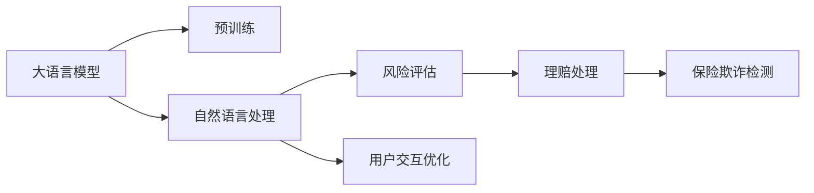

                 

# 保险和 LLM：准确的风险评估和理赔处理

> 关键词：大语言模型,保险,风险评估,理赔处理,保险欺诈检测,自然语言处理

## 1. 背景介绍

### 1.1 问题由来

保险业作为国民经济的重要组成部分，其健康发展对社会稳定和国家安全具有重要意义。然而，随着经济社会的快速发展，保险业面临着诸多挑战。首先是风险评估的准确性问题。传统风险评估依赖于人工审核和历史经验，存在主观偏差和数据不完备的局限性。其次，理赔处理流程复杂、耗时长，部分恶意理赔行为更是严重扰乱了市场秩序。这些问题的存在，不仅影响保险公司的经营效率和客户体验，也对整个社会的诚信体系建设造成了负面影响。

为此，保险公司亟需借助先进的技术手段，提升风险评估和理赔处理的效率和精准度。近年来，随着人工智能和大语言模型（Large Language Models, LLMs）的发展，基于自然语言处理（Natural Language Processing, NLP）的自动化保险分析和理赔处理技术逐渐成为行业热点。本文聚焦于利用大语言模型，尤其是预训练语言模型（Pre-trained Language Models, PLMs），构建保险风险评估和理赔处理系统，以期为保险业的数字化转型提供有力支持。

### 1.2 问题核心关键点

利用大语言模型进行保险风险评估和理赔处理的核心关键点包括：

1. **数据驱动的模型训练**：通过分析历史保险数据，提取有价值的信息，训练大语言模型进行风险预测和理赔审核。
2. **实时动态的风险评估**：利用大语言模型处理实时交易数据，进行动态的风险评估和预测，及时调整保险政策。
3. **智能理赔处理**：通过大语言模型理解和解析客户的理赔申请，自动判断申请是否合法，加速理赔流程。
4. **自动化欺诈检测**：利用大语言模型识别和防范保险欺诈行为，提升理赔系统的安全性。
5. **用户交互优化**：通过大语言模型提供智能化的用户交互体验，提高客户满意度。

这些关键点不仅体现了大语言模型在保险行业的应用潜力，也揭示了利用大语言模型进行风险评估和理赔处理的基本框架和方法。

## 2. 核心概念与联系

### 2.1 核心概念概述

本节将介绍几个与大语言模型在保险行业应用密切相关的核心概念：

- **大语言模型(Large Language Model, LLM)**：一种基于深度学习架构的强大语言处理工具，能够理解和生成自然语言文本，广泛应用于自然语言理解、生成、翻译等任务。

- **预训练语言模型(Pre-trained Language Model, PLM)**：通过在大规模无标签数据上预训练得到的大模型，具有强大的语言理解和生成能力，能够迁移到各种NLP任务中。

- **自然语言处理(Natural Language Processing, NLP)**：涉及语言理解、生成、分析和应用的一系列技术，旨在使计算机能够理解和处理人类语言。

- **风险评估**：通过分析保险数据和客户信息，预测风险发生概率，为保险产品定价和赔付提供依据。

- **理赔处理**：根据客户的理赔申请，自动判断申请的合法性，快速进行赔付处理，提升客户满意度和理赔效率。

- **保险欺诈检测**：利用机器学习和大语言模型，识别和防范保险欺诈行为，维护市场公平和秩序。

这些概念之间的逻辑关系可以通过以下Mermaid流程图来展示：



这个流程图展示了大语言模型在保险行业的应用脉络：

1. 大语言模型通过预训练获得强大的语言理解能力。
2. 利用自然语言处理技术，进行风险评估、理赔处理、欺诈检测等任务。
3. 通过用户交互优化，提升用户体验，促进业务发展。

## 3. 核心算法原理 & 具体操作步骤
### 3.1 算法原理概述

基于大语言模型的保险风险评估和理赔处理，本质上是通过深度学习模型对保险数据进行理解和处理，从而实现风险评估和理赔处理的自动化。其核心思想是：

1. **数据驱动的模型训练**：利用历史保险数据，训练大语言模型，学习风险评估和理赔处理的规则。
2. **实时动态的风险评估**：在实际交易数据中，通过大语言模型进行动态的风险评估，实时调整保险政策。
3. **智能理赔处理**：利用大语言模型解析和理解客户的理赔申请，自动判断申请是否合法，加速理赔流程。
4. **自动化欺诈检测**：通过大语言模型识别欺诈行为，防范潜在的保险欺诈风险。

这些步骤涉及从数据预处理、模型训练到实时处理等多个环节，需要细致的设计和实施。

### 3.2 算法步骤详解

基于大语言模型的保险风险评估和理赔处理，可以分为以下详细步骤：

#### 3.2.1 数据准备与预处理

1. **数据收集**：从保险公司的数据库中，收集历史理赔记录、客户信息、保险产品信息等数据，构建训练和验证数据集。
2. **数据清洗**：去除数据中的噪音和异常值，确保数据的质量和完整性。
3. **数据标注**：根据保险业务的需求，对数据进行标注，如风险等级、理赔结果、欺诈标记等。

#### 3.2.2 模型训练与微调

1. **选择预训练模型**：选择适合保险业务的预训练模型，如BERT、GPT等，作为初始化参数。
2. **微调模型**：在标注好的数据集上，对预训练模型进行微调，学习保险业务的具体规则和特征。
3. **验证与调参**：在验证集上评估模型的性能，根据评估结果调整模型参数，如学习率、批大小等。

#### 3.2.3 实时风险评估与理赔处理

1. **实时数据处理**：将新交易数据输入模型，进行动态的风险评估。
2. **风险预测**：利用模型对新交易的风险等级进行预测，自动调整保险政策。
3. **理赔判断**：对客户的理赔申请进行理解和分析，自动判断申请的合法性和赔付金额。
4. **欺诈检测**：利用模型识别欺诈行为，保护保险公司的利益。

### 3.3 算法优缺点

利用大语言模型进行保险风险评估和理赔处理，具有以下优点：

1. **数据驱动**：利用历史数据进行训练，可以显著提高模型的准确性和泛化能力。
2. **自动化**：通过模型自动化处理，大大提高了理赔处理的效率和精确度。
3. **实时动态**：能够实时处理新数据，动态调整保险政策，适应不断变化的市场环境。
4. **多任务处理**：同一模型可以处理风险评估、理赔处理、欺诈检测等多个任务，降低系统复杂度。

然而，也存在一些局限性：

1. **数据依赖**：模型效果高度依赖于数据质量，低质量的数据可能导致模型过拟合或欠拟合。
2. **计算资源要求高**：大模型训练和推理需要高性能计算资源，可能对中小型保险公司构成挑战。
3. **模型可解释性不足**：大语言模型通常被视为"黑盒"，缺乏足够的可解释性，难以理解其内部决策过程。
4. **潜在偏见**：预训练模型可能带有训练数据中的偏见，影响模型的公平性和鲁棒性。

### 3.4 算法应用领域

大语言模型在保险行业的多个领域都有广泛的应用，具体包括：

1. **风险评估**：利用大语言模型对保险产品进行风险评估，制定合理的保险政策。
2. **理赔处理**：通过大语言模型快速处理理赔申请，提升客户满意度。
3. **欺诈检测**：利用大语言模型识别和防范保险欺诈行为，保护保险公司利益。
4. **智能客服**：利用大语言模型构建智能客服系统，提供24小时不间断的咨询服务。
5. **健康保险**：利用大语言模型对健康数据进行分析，预测健康风险，优化保险产品设计。

这些应用领域不仅展示了大语言模型在保险行业的强大潜力，也为其提供了广阔的发展空间。

## 4. 数学模型和公式 & 详细讲解  
### 4.1 数学模型构建

假设保险公司的数据集为 $D=\{(x_i, y_i)\}_{i=1}^N$，其中 $x_i$ 表示历史理赔记录、客户信息等特征，$y_i$ 表示对应的风险等级、理赔结果、欺诈标记等标签。大语言模型 $M_{\theta}$ 的输出为 $p(y|x)$，表示在给定特征 $x$ 的条件下，生成标签 $y$ 的概率。风险评估和理赔处理的目标是最大化对数似然函数：

$$
L(\theta) = \sum_{i=1}^N \log p(y_i|x_i)
$$

微调的目标是优化损失函数 $L(\theta)$，使得模型在历史数据上表现良好，并在新数据上能够准确预测。

### 4.2 公式推导过程

在微调过程中，利用反向传播算法计算损失函数对模型参数 $\theta$ 的梯度，并根据梯度下降等优化算法更新模型参数：

$$
\theta \leftarrow \theta - \eta \nabla_{\theta}L(\theta)
$$

其中 $\eta$ 为学习率，$\nabla_{\theta}L(\theta)$ 为损失函数对模型参数的梯度。在实际应用中，通常采用AdamW、SGD等优化算法，并设置合适的学习率和批大小。

### 4.3 案例分析与讲解

以风险评估为例，假设有一个包含10,000个历史理赔记录的数据集，每个记录包含客户的年龄、性别、职业、理赔金额等特征。模型的输出为0-10的风险等级，其中0表示低风险，10表示高风险。训练数据集的标签为真实的风险等级，验证数据集的标签为模型预测的风险等级。在模型训练过程中，首先对数据进行预处理和标注，然后选择BERT作为预训练模型，并在标注好的数据集上进行微调。模型微调结束后，在验证集上评估模型的表现，并进行必要的调参。最后，利用模型对新交易数据进行实时风险评估。

## 5. 项目实践：代码实例和详细解释说明
### 5.1 开发环境搭建

在进行保险风险评估和理赔处理的项目实践前，我们需要准备好开发环境。以下是使用Python进行PyTorch开发的环境配置流程：

1. 安装Anaconda：从官网下载并安装Anaconda，用于创建独立的Python环境。

2. 创建并激活虚拟环境：
```bash
conda create -n insurance-env python=3.8 
conda activate insurance-env
```

3. 安装PyTorch：根据CUDA版本，从官网获取对应的安装命令。例如：
```bash
conda install pytorch torchvision torchaudio cudatoolkit=11.1 -c pytorch -c conda-forge
```

4. 安装Transformers库：
```bash
pip install transformers
```

5. 安装各类工具包：
```bash
pip install numpy pandas scikit-learn matplotlib tqdm jupyter notebook ipython
```

完成上述步骤后，即可在`insurance-env`环境中开始项目实践。

### 5.2 源代码详细实现

下面我们以风险评估任务为例，给出使用Transformers库对BERT模型进行保险风险评估的PyTorch代码实现。

首先，定义风险评估任务的数据处理函数：

```python
from transformers import BertTokenizer
from torch.utils.data import Dataset
import torch

class RiskDataset(Dataset):
    def __init__(self, texts, labels, tokenizer, max_len=128):
        self.texts = texts
        self.labels = labels
        self.tokenizer = tokenizer
        self.max_len = max_len
        
    def __len__(self):
        return len(self.texts)
    
    def __getitem__(self, item):
        text = self.texts[item]
        label = self.labels[item]
        
        encoding = self.tokenizer(text, return_tensors='pt', max_length=self.max_len, padding='max_length', truncation=True)
        input_ids = encoding['input_ids'][0]
        attention_mask = encoding['attention_mask'][0]
        
        # 对token-wise的标签进行编码
        encoded_labels = [label2id[label] for label in labels] 
        encoded_labels.extend([label2id['0']] * (self.max_len - len(encoded_labels)))
        labels = torch.tensor(encoded_labels, dtype=torch.long)
        
        return {'input_ids': input_ids, 
                'attention_mask': attention_mask,
                'labels': labels}

# 标签与id的映射
label2id = {'0': 0, '1': 1, '2': 2, '3': 3, '4': 4, '5': 5, '6': 6, '7': 7, '8': 8, '9': 9, '10': 10}
id2label = {v: k for k, v in label2id.items()}

# 创建dataset
tokenizer = BertTokenizer.from_pretrained('bert-base-cased')

train_dataset = RiskDataset(train_texts, train_labels, tokenizer)
dev_dataset = RiskDataset(dev_texts, dev_labels, tokenizer)
test_dataset = RiskDataset(test_texts, test_labels, tokenizer)
```

然后，定义模型和优化器：

```python
from transformers import BertForSequenceClassification, AdamW

model = BertForSequenceClassification.from_pretrained('bert-base-cased', num_labels=len(label2id))

optimizer = AdamW(model.parameters(), lr=2e-5)
```

接着，定义训练和评估函数：

```python
from torch.utils.data import DataLoader
from tqdm import tqdm
from sklearn.metrics import classification_report

device = torch.device('cuda') if torch.cuda.is_available() else torch.device('cpu')
model.to(device)

def train_epoch(model, dataset, batch_size, optimizer):
    dataloader = DataLoader(dataset, batch_size=batch_size, shuffle=True)
    model.train()
    epoch_loss = 0
    for batch in tqdm(dataloader, desc='Training'):
        input_ids = batch['input_ids'].to(device)
        attention_mask = batch['attention_mask'].to(device)
        labels = batch['labels'].to(device)
        model.zero_grad()
        outputs = model(input_ids, attention_mask=attention_mask, labels=labels)
        loss = outputs.loss
        epoch_loss += loss.item()
        loss.backward()
        optimizer.step()
    return epoch_loss / len(dataloader)

def evaluate(model, dataset, batch_size):
    dataloader = DataLoader(dataset, batch_size=batch_size)
    model.eval()
    preds, labels = [], []
    with torch.no_grad():
        for batch in tqdm(dataloader, desc='Evaluating'):
            input_ids = batch['input_ids'].to(device)
            attention_mask = batch['attention_mask'].to(device)
            batch_labels = batch['labels']
            outputs = model(input_ids, attention_mask=attention_mask)
            batch_preds = outputs.logits.argmax(dim=2).to('cpu').tolist()
            batch_labels = batch_labels.to('cpu').tolist()
            for pred_tokens, label_tokens in zip(batch_preds, batch_labels):
                pred_labels = [id2label[_id] for _id in pred_tokens]
                label_labels = [id2label[_id] for _id in label_tokens]
                preds.append(pred_labels[:len(label_labels)])
                labels.append(label_labels)
                
    print(classification_report(labels, preds))
```

最后，启动训练流程并在测试集上评估：

```python
epochs = 5
batch_size = 16

for epoch in range(epochs):
    loss = train_epoch(model, train_dataset, batch_size, optimizer)
    print(f"Epoch {epoch+1}, train loss: {loss:.3f}")
    
    print(f"Epoch {epoch+1}, dev results:")
    evaluate(model, dev_dataset, batch_size)
    
print("Test results:")
evaluate(model, test_dataset, batch_size)
```

以上就是使用PyTorch对BERT进行保险风险评估的完整代码实现。可以看到，得益于Transformers库的强大封装，我们能够用相对简洁的代码完成BERT模型的加载和微调。

### 5.3 代码解读与分析

让我们再详细解读一下关键代码的实现细节：

**RiskDataset类**：
- `__init__`方法：初始化文本、标签、分词器等关键组件。
- `__len__`方法：返回数据集的样本数量。
- `__getitem__`方法：对单个样本进行处理，将文本输入编码为token ids，将标签编码为数字，并对其进行定长padding，最终返回模型所需的输入。

**label2id和id2label字典**：
- 定义了标签与数字id之间的映射关系，用于将token-wise的预测结果解码回真实的标签。

**训练和评估函数**：
- 使用PyTorch的DataLoader对数据集进行批次化加载，供模型训练和推理使用。
- 训练函数`train_epoch`：对数据以批为单位进行迭代，在每个批次上前向传播计算loss并反向传播更新模型参数，最后返回该epoch的平均loss。
- 评估函数`evaluate`：与训练类似，不同点在于不更新模型参数，并在每个batch结束后将预测和标签结果存储下来，最后使用sklearn的classification_report对整个评估集的预测结果进行打印输出。

**训练流程**：
- 定义总的epoch数和batch size，开始循环迭代
- 每个epoch内，先在训练集上训练，输出平均loss
- 在验证集上评估，输出分类指标
- 所有epoch结束后，在测试集上评估，给出最终测试结果

可以看到，PyTorch配合Transformers库使得BERT微调的代码实现变得简洁高效。开发者可以将更多精力放在数据处理、模型改进等高层逻辑上，而不必过多关注底层的实现细节。

当然，工业级的系统实现还需考虑更多因素，如模型的保存和部署、超参数的自动搜索、更灵活的任务适配层等。但核心的微调范式基本与此类似。

## 6. 实际应用场景
### 6.1 智能客服系统

基于大语言模型的智能客服系统，可以广泛应用于保险公司的客户服务。传统客服往往需要配备大量人力，高峰期响应缓慢，且一致性和专业性难以保证。而使用微调后的智能客服模型，可以7x24小时不间断服务，快速响应客户咨询，用自然流畅的语言解答各类常见问题。

在技术实现上，可以收集保险公司内部的历史客服对话记录，将问题和最佳答复构建成监督数据，在此基础上对预训练客服模型进行微调。微调后的客服模型能够自动理解用户意图，匹配最合适的答复，并根据用户反馈不断优化回复策略，提升客户满意度。

### 6.2 理赔处理系统

利用大语言模型的智能理赔处理系统，可以大大提升理赔处理的速度和准确性。传统理赔处理流程繁琐、耗时长，部分恶意理赔行为更是严重扰乱了市场秩序。通过微调后的理赔处理模型，保险公司能够实时处理理赔申请，自动判断申请的合法性，快速进行赔付处理，减少因人工审核带来的延迟和误差。

具体而言，保险公司可以收集历史理赔数据，将理赔申请和结果作为监督数据，训练大语言模型。微调后的模型能够自动理解理赔申请的内容，判断申请是否合法，并在必要时联系客户进行进一步审核。此外，模型还可以动态学习市场变化，及时调整理赔政策和规则，提升系统的稳定性和鲁棒性。

### 6.3 风险评估系统

基于大语言模型的风险评估系统，能够实时动态地对保险产品进行风险评估，提升风险管理的精准度。保险公司可以利用微调后的风险评估模型，对新交易数据进行实时风险评估，预测风险等级，并根据评估结果调整保险政策。

具体实现中，保险公司可以收集历史交易数据，标注风险等级，训练大语言模型。微调后的模型能够自动分析新交易数据，预测风险等级，帮助保险公司优化保险产品定价，降低风险敞口，提升盈利能力。

### 6.4 欺诈检测系统

利用大语言模型的欺诈检测系统，能够有效防范保险欺诈行为，维护市场秩序。传统欺诈检测依赖于人工审核和规则库，效率低、误报率高。通过微调后的欺诈检测模型，保险公司能够自动识别和防范欺诈行为，提升系统的准确性和效率。

具体实现中，保险公司可以收集历史欺诈案例，标注欺诈标记，训练大语言模型。微调后的模型能够自动分析客户的理赔申请，识别潜在的欺诈行为，及时报警和处理，降低公司的损失。

## 7. 工具和资源推荐
### 7.1 学习资源推荐

为了帮助开发者系统掌握大语言模型在保险风险评估和理赔处理中的应用，这里推荐一些优质的学习资源：

1. 《Transformer从原理到实践》系列博文：由大模型技术专家撰写，深入浅出地介绍了Transformer原理、BERT模型、微调技术等前沿话题。

2. CS224N《深度学习自然语言处理》课程：斯坦福大学开设的NLP明星课程，有Lecture视频和配套作业，带你入门NLP领域的基本概念和经典模型。

3. 《Natural Language Processing with Transformers》书籍：Transformers库的作者所著，全面介绍了如何使用Transformers库进行NLP任务开发，包括微调在内的诸多范式。

4. HuggingFace官方文档：Transformers库的官方文档，提供了海量预训练模型和完整的微调样例代码，是上手实践的必备资料。

5. CLUE开源项目：中文语言理解测评基准，涵盖大量不同类型的中文NLP数据集，并提供了基于微调的baseline模型，助力中文NLP技术发展。

通过对这些资源的学习实践，相信你一定能够快速掌握大语言模型在保险行业的应用精髓，并用于解决实际的NLP问题。
###  7.2 开发工具推荐

高效的开发离不开优秀的工具支持。以下是几款用于大语言模型在保险行业应用开发的常用工具：

1. PyTorch：基于Python的开源深度学习框架，灵活动态的计算图，适合快速迭代研究。大部分预训练语言模型都有PyTorch版本的实现。

2. TensorFlow：由Google主导开发的开源深度学习框架，生产部署方便，适合大规模工程应用。同样有丰富的预训练语言模型资源。

3. Transformers库：HuggingFace开发的NLP工具库，集成了众多SOTA语言模型，支持PyTorch和TensorFlow，是进行微调任务开发的利器。

4. Weights & Biases：模型训练的实验跟踪工具，可以记录和可视化模型训练过程中的各项指标，方便对比和调优。与主流深度学习框架无缝集成。

5. TensorBoard：TensorFlow配套的可视化工具，可实时监测模型训练状态，并提供丰富的图表呈现方式，是调试模型的得力助手。

6. Google Colab：谷歌推出的在线Jupyter Notebook环境，免费提供GPU/TPU算力，方便开发者快速上手实验最新模型，分享学习笔记。

合理利用这些工具，可以显著提升大语言模型在保险行业应用开发的效率，加快创新迭代的步伐。

### 7.3 相关论文推荐

大语言模型和微调技术的发展源于学界的持续研究。以下是几篇奠基性的相关论文，推荐阅读：

1. Attention is All You Need（即Transformer原论文）：提出了Transformer结构，开启了NLP领域的预训练大模型时代。

2. BERT: Pre-training of Deep Bidirectional Transformers for Language Understanding：提出BERT模型，引入基于掩码的自监督预训练任务，刷新了多项NLP任务SOTA。

3. Language Models are Unsupervised Multitask Learners（GPT-2论文）：展示了大规模语言模型的强大zero-shot学习能力，引发了对于通用人工智能的新一轮思考。

4. Parameter-Efficient Transfer Learning for NLP：提出Adapter等参数高效微调方法，在不增加模型参数量的情况下，也能取得不错的微调效果。

5. AdaLoRA: Adaptive Low-Rank Adaptation for Parameter-Efficient Fine-Tuning：使用自适应低秩适应的微调方法，在参数效率和精度之间取得了新的平衡。

6. Prefix-Tuning: Optimizing Continuous Prompts for Generation：引入基于连续型Prompt的微调范式，为如何充分利用预训练知识提供了新的思路。

这些论文代表了大语言模型微调技术的发展脉络。通过学习这些前沿成果，可以帮助研究者把握学科前进方向，激发更多的创新灵感。

## 8. 总结：未来发展趋势与挑战

### 8.1 总结

本文对利用大语言模型进行保险风险评估和理赔处理的方法进行了全面系统的介绍。首先阐述了保险业在风险评估和理赔处理中面临的问题和挑战，明确了大语言模型在这一领域的潜力和优势。其次，从原理到实践，详细讲解了大语言模型在保险风险评估和理赔处理中的具体应用方法，包括数据准备、模型训练、实时处理等步骤。最后，本文还探讨了大语言模型在保险行业的应用前景，以及当前面临的挑战和未来发展方向。

通过本文的系统梳理，可以看到，大语言模型在保险风险评估和理赔处理中的巨大潜力。利用大语言模型，保险公司能够实现自动化、实时化的风险评估和理赔处理，显著提升业务的效率和精准度。然而，当前大语言模型在保险行业的应用仍面临数据质量、计算资源、模型可解释性等挑战，需要进一步的改进和优化。

### 8.2 未来发展趋势

展望未来，大语言模型在保险行业的应用将呈现以下几个发展趋势：

1. **数据质量提升**：随着数据收集和标注技术的进步，保险公司的数据质量将得到显著提升，为模型的训练和优化提供更可靠的基础。
2. **计算资源优化**：随着计算技术的发展，大模型的训练和推理将变得更加高效，能够支撑更复杂的风险评估和理赔处理任务。
3. **模型可解释性增强**：通过引入因果分析、对比学习等方法，大语言模型将具备更强的可解释性，方便保险公司的业务理解和决策。
4. **多模态融合**：结合图像、视频、音频等多模态数据，构建更全面的风险评估和理赔处理模型，提升系统的智能水平。
5. **模型隐私保护**：随着隐私保护法规的日益严格，大语言模型需要具备更强的隐私保护能力，确保用户数据的安全。
6. **自动化和智能化**：利用大语言模型的自动化和智能化特点，构建更高效的智能客服、风险评估、理赔处理系统，提升保险公司的服务水平。

这些趋势展示了大语言模型在保险行业应用的广阔前景，也为其发展提供了明确的路径。

### 8.3 面临的挑战

尽管大语言模型在保险风险评估和理赔处理中展现了巨大的潜力，但在实际应用中也面临诸多挑战：

1. **数据质量依赖**：模型性能高度依赖于数据质量，低质量的数据可能导致模型过拟合或欠拟合，影响评估和处理的准确性。
2. **计算资源消耗高**：大模型训练和推理需要高性能计算资源，可能对中小型保险公司构成挑战，影响其应用推广。
3. **模型可解释性不足**：大语言模型通常被视为"黑盒"，缺乏足够的可解释性，难以理解其内部决策过程，影响保险公司的业务理解和决策。
4. **模型偏见和公平性**：预训练模型可能带有训练数据中的偏见，影响模型的公平性和鲁棒性，需要引入伦理导向的评估指标进行优化。
5. **隐私保护和安全**：在处理客户数据时，需要确保数据隐私和安全，防止数据泄露和滥用。

### 8.4 研究展望

面对大语言模型在保险行业应用所面临的挑战，未来的研究需要在以下几个方面寻求新的突破：

1. **数据增强与标注**：利用数据增强技术和半监督学习，提高数据质量，减少对标注数据的依赖。
2. **计算资源优化**：开发更高效的数据处理和模型优化算法，降低计算资源消耗，提升系统的实时性和可扩展性。
3. **模型可解释性增强**：引入因果分析、对比学习等方法，增强模型的可解释性，方便保险公司的业务理解和决策。
4. **隐私保护与安全**：开发隐私保护技术，确保数据隐私和安全，防止数据泄露和滥用。
5. **多模态融合**：结合图像、视频、音频等多模态数据，构建更全面的风险评估和理赔处理模型，提升系统的智能水平。
6. **自动化与智能化**：利用大语言模型的自动化和智能化特点，构建更高效的智能客服、风险评估、理赔处理系统，提升保险公司的服务水平。

这些研究方向将推动大语言模型在保险行业的进一步应用，促进保险业的数字化转型升级，为社会经济的发展注入新的动力。

## 9. 附录：常见问题与解答

**Q1：大语言模型在保险风险评估和理赔处理中如何提高数据的有效性？**

A: 提高数据有效性是提升模型性能的关键。以下是一些提高数据有效性的方法：

1. **数据增强**：通过数据增强技术，如文本改写、数据扩充等，生成更多高质量的训练数据。
2. **半监督学习**：利用无标签数据进行预训练，再通过少量标签数据进行微调，提高模型的泛化能力。
3. **主动学习**：通过模型主动选择最具代表性的样本进行标注，减少标注成本。
4. **数据清洗**：去除数据中的噪音和异常值，确保数据的质量和完整性。
5. **特征工程**：设计有效的特征提取方法，提升数据表达能力，提高模型的准确性。

**Q2：大语言模型在保险理赔处理中如何保证安全性？**

A: 在理赔处理中，大语言模型需要保证安全性，防止数据泄露和滥用。以下是一些保证安全性的方法：

1. **数据加密**：对敏感数据进行加密处理，防止数据泄露。
2. **访问控制**：限制模型的访问权限，确保只有授权人员才能访问数据。
3. **隐私保护**：利用差分隐私、联邦学习等技术，保护用户隐私。
4. **模型审计**：定期对模型进行审计，发现并修复潜在的安全漏洞。
5. **安全监控**：实时监控模型的运行状态，及时发现异常行为并进行处理。

**Q3：大语言模型在保险风险评估中如何避免模型过拟合？**

A: 避免模型过拟合是提高风险评估准确性的关键。以下是一些避免过拟合的方法：

1. **正则化**：引入L2正则、Dropout等技术，防止模型过度适应训练数据。
2. **早停**：在验证集上监测模型性能，一旦性能不再提升，立即停止训练。
3. **数据增强**：通过数据增强技术，生成更多高质量的训练数据。
4. **迁移学习**：利用预训练模型的知识，提高模型的泛化能力。
5. **集成学习**：通过模型集成，提高模型的鲁棒性和泛化能力。

这些方法可以帮助保险公司构建更准确、鲁棒的风险评估系统，提升风险管理的精准度。

**Q4：大语言模型在保险理赔处理中如何进行自动化欺诈检测？**

A: 自动化欺诈检测是保险理赔处理的重要环节。以下是一些自动化欺诈检测的方法：

1. **行为分析**：利用大语言模型分析客户的赔付行为，识别异常模式。
2. **模型集成**：通过模型集成，提高欺诈检测的准确性和鲁棒性。
3. **实时监控**：实时监控客户的赔付行为，及时发现并处理欺诈行为。
4. **知识库融合**：将外部知识库和规则库与模型融合，提高欺诈检测的准确性。
5. **反馈学习**：利用欺诈检测结果，不断优化模型，提升欺诈检测能力。

这些方法可以帮助保险公司构建更高效的欺诈检测系统，降低欺诈风险，保护公司利益。

**Q5：大语言模型在保险理赔处理中如何进行实时风险评估？**

A: 实时风险评估是保险理赔处理的关键步骤。以下是一些实时风险评估的方法：

1. **在线学习**：利用在线学习技术，实时更新模型参数，适应新的交易数据。
2. **模型集成**：通过模型集成，提高实时风险评估的准确性和鲁棒性。
3. **特征提取**：设计有效的特征提取方法，提升实时风险评估的准确性。
4. **动态调整**：根据实时数据，动态调整保险政策，优化风险管理策略。
5. **异常检测**：利用异常检测技术，识别高风险交易，及时进行调整。

这些方法可以帮助保险公司构建更高效的实时风险评估系统，提升风险管理的精准度。

**Q6：大语言模型在保险理赔处理中如何进行智能客服？**

A: 智能客服系统可以大大提升保险公司的服务效率和客户满意度。以下是一些智能客服的方法：

1. **自然语言处理**：利用大语言模型处理客户咨询，提供智能化的客服服务。
2. **多轮对话**：构建多轮对话模型，提升客服系统的交互能力。
3. **知识库集成**：将保险公司的知识库与模型融合，提高客服系统的智能水平。
4. **用户反馈**：利用用户反馈，不断优化客服系统，提升服务质量。
5. **自然语言生成**：利用自然语言生成技术，生成标准化的客服回复。

这些方法可以帮助保险公司构建更高效的智能客服系统，提升客户满意度和服务效率。

---

作者：禅与计算机程序设计艺术 / Zen and the Art of Computer Programming

