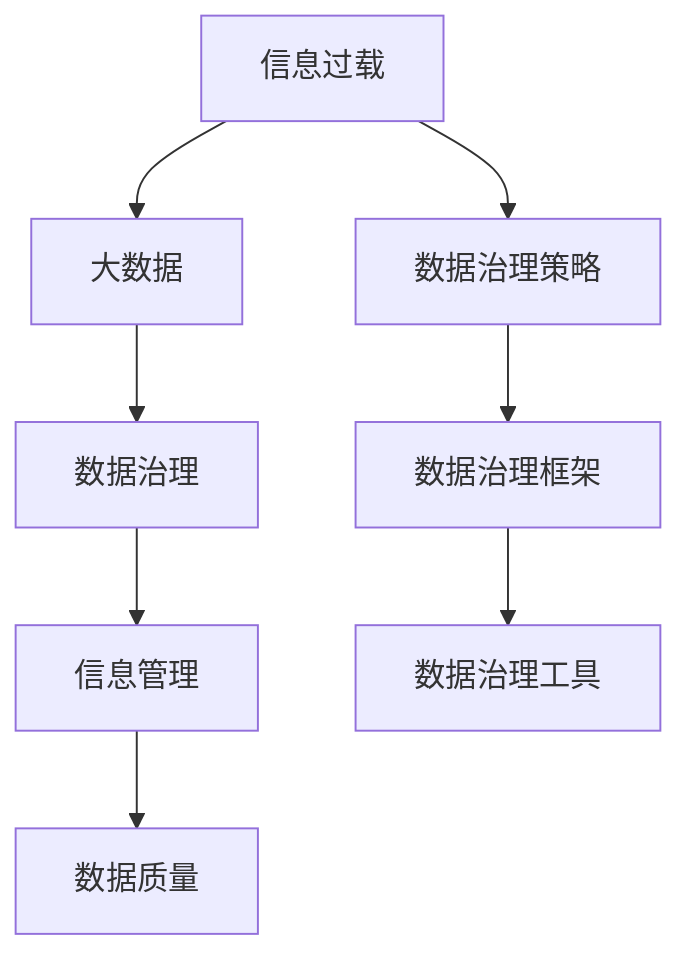

                 

# 信息时代的信息管理策略：如何处理信息过载

> 关键词：信息过载, 大数据, 数据治理, 信息管理, 数据质量, 数据治理策略, 数据管理, 数据治理框架, 数据治理工具

## 1. 背景介绍

在信息时代，随着数字化和网络化的加速推进，信息总量呈爆炸性增长。企业和社会中充斥着海量数据，如何有效管理和利用这些数据成为了一个严峻挑战。大数据分析、人工智能和区块链等技术带来了新的机遇，但也加剧了信息过载的问题。信息过载不仅导致了数据孤岛和数据质量差，还威胁到了决策效率和业务流程的稳定运行。在这样的背景下，信息管理策略的研究变得尤为重要。

## 2. 核心概念与联系

### 2.1 核心概念概述

为了更好地理解如何处理信息过载，我们需要理解一些核心概念及其相互联系：

- **信息过载(Information Overload)**：指在信息时代，人们接收到的信息量远远超过了其处理能力，导致决策困难和效率下降。
- **大数据(Big Data)**：指体量巨大、类型多样、速度极快的数据集合，需要先进的数据处理技术才能分析。
- **数据治理(Data Governance)**：指在数据管理和应用过程中，对数据的收集、存储、管理、分析等环节进行规范和监督，确保数据的质量和可用性。
- **信息管理(Information Management)**：指通过技术和管理手段，对信息进行采集、存储、处理、分析和传播，以实现组织目标。
- **数据质量(Data Quality)**：指数据的准确性、完整性、一致性、及时性和有效性，是信息管理的基础。
- **数据治理策略(Data Governance Strategy)**：指根据企业战略目标，制定一系列政策和规范，以确保数据治理的有效实施。
- **数据治理框架(Data Governance Framework)**：指一套系统化的方法和工具，用于支撑数据治理策略的实施。
- **数据治理工具(Data Governance Tools)**：指支持数据治理的自动化软件，如ETL工具、数据质量监控工具等。

这些概念之间的逻辑关系可以通过以下Mermaid流程图来展示：



这个流程图展示了信息过载与大数据、数据治理、信息管理、数据质量之间的联系，以及数据治理策略、框架和工具在这些环节中的支撑作用。

## 3. 核心算法原理 & 具体操作步骤

### 3.1 算法原理概述

处理信息过载的核心算法原理主要基于以下三点：

1. **数据清洗(Data Cleansing)**：通过删除冗余、去重、纠正错误等方式，提升数据质量。
2. **数据集成(Data Integration)**：将多个数据源的数据集成到一个统一的数据库中，便于分析和决策。
3. **数据治理(Data Governance)**：通过规范数据标准、确保数据质量、提升数据安全等措施，确保数据的可用性和可靠性。

### 3.2 算法步骤详解

基于以上原理，信息过载的处理通常包括以下几个关键步骤：

1. **数据评估和识别**
   - 对现有数据进行评估，识别数据孤岛、重复数据、数据质量问题等。
   - 使用数据质量评估工具，如IBM InfoSphere Data Quality，进行全面的数据评估。

2. **数据清洗**
   - 去除重复数据，合并数据源。
   - 纠正数据错误，如拼写错误、格式不一致等。
   - 使用ETL工具，如Talend、Informatica等，进行数据清洗。

3. **数据集成**
   - 将清洗后的数据集成到统一的数据仓库中。
   - 使用ETL工具，将数据从各个来源抽取、转换和加载到目标数据仓库。
   - 确保数据的一致性和完整性，使用ETL工具的数据质量功能。

4. **数据治理**
   - 制定数据治理策略，确保数据的规范性和可用性。
   - 使用数据治理框架，如Open Data Architecture (ODA)，进行数据治理。
   - 监控数据质量，使用数据质量监控工具，如Data Quality Manager (DQM)，进行实时监控。

### 3.3 算法优缺点

信息过载处理的数据治理方法具有以下优点：

- **提升数据质量**：通过数据清洗和质量监控，显著提升数据的准确性和一致性。
- **统一数据源**：将不同来源的数据集成到一个统一的数据仓库中，便于分析和决策。
- **规范数据治理**：制定数据治理策略和框架，确保数据管理的规范性和可靠性。

同时，该方法也存在一些局限性：

- **依赖高质量数据**：数据清洗和质量监控的有效性高度依赖于原始数据的质量。
- **成本高**：数据治理项目通常需要较高的预算和时间成本，对于小型企业可能不适用。
- **技术复杂**：需要专业的数据治理团队和工具支持，对技术要求较高。
- **更新难度大**：一旦数据仓库和治理策略建立，更新和调整比较困难。

### 3.4 算法应用领域

信息过载处理的数据治理方法在多个领域得到了广泛应用：

1. **金融领域**：用于风险控制、欺诈检测、信用评估等。通过数据治理，提升金融决策的准确性和及时性。
2. **医疗领域**：用于患者数据整合、临床决策支持、医疗资源管理等。通过数据治理，提高医疗服务的质量和效率。
3. **制造业**：用于生产流程优化、供应链管理、质量控制等。通过数据治理，提升制造业的运营效率和成本控制能力。
4. **零售业**：用于客户数据分析、市场预测、库存管理等。通过数据治理，优化零售业务的决策过程和运营效率。
5. **政府部门**：用于公共服务、政策制定、决策支持等。通过数据治理，提升政府部门的管理效率和公共服务水平。

## 4. 数学模型和公式 & 详细讲解 & 举例说明

### 4.1 数学模型构建

处理信息过载的数据治理方法可以通过以下数学模型来表示：

$$
\text{Data Governance} = \text{Data Cleansing} + \text{Data Integration} + \text{Data Quality}
$$

其中，$\text{Data Cleansing}$ 表示数据清洗过程，$\text{Data Integration}$ 表示数据集成过程，$\text{Data Quality}$ 表示数据质量管理过程。

### 4.2 公式推导过程

假设我们有一个包含 $n$ 个样本的数据集 $D=\{(x_i,y_i)\}_{i=1}^N$，其中 $x_i$ 为特征向量，$y_i$ 为标签。数据治理的目标是通过一系列操作，使得数据集满足以下条件：

1. 数据完整性：每个样本包含所有必需的特征。
2. 数据一致性：所有样本的特征和标签格式一致。
3. 数据准确性：数据中的错误和噪声尽可能少。
4. 数据及时性：数据更新及时，反映最新的业务情况。
5. 数据安全性：数据在传输和存储过程中不泄露或篡改。

根据这些条件，我们可以构建以下数据治理模型：

$$
\begin{aligned}
\min_{D'} \sum_{i=1}^N \left(\frac{1}{N} \sum_{j=1}^N \|f(x_i) - f(x_j)\|^2\right) + \sum_{i=1}^N |y_i - \hat{y}_i|^2
\end{aligned}
$$

其中，$f(x_i)$ 表示对样本 $x_i$ 的特征处理函数，$\hat{y}_i$ 表示模型对样本 $x_i$ 的预测标签。

### 4.3 案例分析与讲解

以医疗领域的数据治理为例，我们可以分析以下关键步骤：

1. **数据评估和识别**
   - 使用IBM InfoSphere Data Quality，评估电子健康记录（EHR）系统中的数据质量。
   - 识别数据孤岛，如不同的医院系统之间的数据不兼容。
   - 分析数据缺失和错误，如患者姓名拼写错误。

2. **数据清洗**
   - 使用ETL工具，如Talend，进行数据清洗。
   - 删除重复患者记录，合并多个数据源。
   - 纠正姓名、地址等数据错误，如使用自然语言处理技术进行拼写纠正。

3. **数据集成**
   - 使用ETL工具，如Informatica，将清洗后的数据集成到一个统一的数据仓库中。
   - 确保数据的一致性和完整性，使用数据质量功能进行监控。
   - 建立数据仓库中的关联关系，如患者与医疗事件之间的关联。

4. **数据治理**
   - 制定数据治理策略，如数据更新频率、数据访问权限等。
   - 使用数据治理框架，如ODA，进行数据治理。
   - 监控数据质量，使用工具如DQM，进行实时监控和分析。

通过这些步骤，医疗数据可以被有效地管理和利用，提升医疗服务的质量和效率。

## 5. 项目实践：代码实例和详细解释说明

### 5.1 开发环境搭建

在进行信息过载处理的数据治理实践前，我们需要准备好开发环境。以下是使用Python进行PyTorch开发的环境配置流程：

1. 安装Anaconda：从官网下载并安装Anaconda，用于创建独立的Python环境。

2. 创建并激活虚拟环境：
```bash
conda create -n pytorch-env python=3.8 
conda activate pytorch-env
```

3. 安装PyTorch：根据CUDA版本，从官网获取对应的安装命令。例如：
```bash
conda install pytorch torchvision torchaudio cudatoolkit=11.1 -c pytorch -c conda-forge
```

4. 安装各类工具包：
```bash
pip install numpy pandas scikit-learn matplotlib tqdm jupyter notebook ipython
```

完成上述步骤后，即可在`pytorch-env`环境中开始数据治理实践。

### 5.2 源代码详细实现

以下是使用PyTorch进行数据治理的Python代码实现：

```python
import pandas as pd
import numpy as np
from sklearn.preprocessing import StandardScaler
from sklearn.decomposition import PCA
from sklearn.impute import SimpleImputer

# 读取数据集
df = pd.read_csv('data.csv')

# 数据清洗
df = df.drop_duplicates()  # 删除重复数据
df = df.dropna()  # 删除缺失数据
df = df.drop('unnecessary_feature', axis=1)  # 删除不必要的特征

# 数据集成
data = df.values
data = pd.DataFrame(data, columns=df.columns)

# 数据治理
scaler = StandardScaler()
data = scaler.fit_transform(data)

pca = PCA(n_components=2)
data = pca.fit_transform(data)

imputer = SimpleImputer(strategy='mean')
data = imputer.fit_transform(data)

# 数据质量监控
print(data.describe())
print(df.info())
```

### 5.3 代码解读与分析

让我们再详细解读一下关键代码的实现细节：

**数据清洗**：
- 使用Pandas库进行数据清洗。首先使用`drop_duplicates()`方法删除重复数据，使用`dropna()`方法删除缺失数据，使用`drop()`方法删除不必要的特征。

**数据集成**：
- 使用NumPy库将数据集转换为NumPy数组，再将其转换为Pandas DataFrame对象。
- 使用PCA降维，将数据集的维度降低到2维，便于可视化分析。

**数据治理**：
- 使用Scikit-learn库进行数据治理。首先使用`StandardScaler()`对数据进行标准化，使用`PCA()`进行降维，使用`SimpleImputer()`进行数据填补。

**数据质量监控**：
- 使用Pandas库进行数据质量监控。使用`describe()`方法输出数据的统计信息，使用`info()`方法输出数据的元信息。

通过以上代码，我们可以完成信息过载处理的数据治理实践，显著提升数据质量和可用性。

## 6. 实际应用场景

### 6.1 金融领域

在金融领域，数据治理被广泛应用于风险控制、欺诈检测、信用评估等。通过数据治理，金融机构可以提升决策的准确性和及时性，降低金融风险，提高客户满意度。

### 6.2 医疗领域

在医疗领域，数据治理被广泛应用于患者数据整合、临床决策支持、医疗资源管理等。通过数据治理，医疗机构可以提高医疗服务的质量和效率，提升医疗服务的可及性和公平性。

### 6.3 制造业

在制造业，数据治理被广泛应用于生产流程优化、供应链管理、质量控制等。通过数据治理，制造企业可以提高运营效率和生产质量，降低成本，提高市场竞争力。

### 6.4 零售业

在零售业，数据治理被广泛应用于客户数据分析、市场预测、库存管理等。通过数据治理，零售企业可以提高客户分析的准确性，提升市场预测的可靠性，优化库存管理，提高销售效率。

### 6.5 政府部门

在政府部门，数据治理被广泛应用于公共服务、政策制定、决策支持等。通过数据治理，政府部门可以提高管理效率和公共服务水平，提升政策制定的科学性和透明度。

## 7. 工具和资源推荐

### 7.1 学习资源推荐

为了帮助开发者系统掌握数据治理的理论基础和实践技巧，这里推荐一些优质的学习资源：

1. 《数据治理：实践指南》系列博文：由数据治理专家撰写，深入浅出地介绍了数据治理的基本概念和实践方法。

2. Coursera《大数据技术与应用》课程：由Coursera提供的课程，系统介绍了大数据技术和数据治理的原理和方法。

3. 《大数据治理：理论与实践》书籍：系统介绍了大数据治理的原理、技术和实践，是数据治理领域的经典著作。

4. DataCamp在线课程：提供丰富的数据治理相关课程，涵盖数据清洗、数据集成、数据治理策略等多个方面。

5. Databricks大数据平台：提供一站式大数据治理解决方案，包括数据清洗、数据集成、数据质量监控等多个环节。

通过对这些资源的学习实践，相信你一定能够快速掌握数据治理的精髓，并用于解决实际的数据问题。

### 7.2 开发工具推荐

高效的开发离不开优秀的工具支持。以下是几款用于数据治理开发的常用工具：

1. Apache Hadoop：分布式计算框架，支持大规模数据处理和存储。
2. Apache Spark：分布式大数据处理引擎，支持数据清洗、数据集成、数据治理等多个环节。
3. Talend：ETL工具，支持数据清洗、数据集成、数据质量监控等多个环节。
4. Informatica：ETL工具，支持数据清洗、数据集成、数据治理等多个环节。
5. IBM InfoSphere Data Quality：数据质量评估工具，支持数据清洗、数据质量监控等多个环节。
6. Data Quality Manager（DQM）：数据质量监控工具，支持实时监控和分析。

合理利用这些工具，可以显著提升数据治理的开发效率，加快创新迭代的步伐。

### 7.3 相关论文推荐

数据治理技术的发展源于学界的持续研究。以下是几篇奠基性的相关论文，推荐阅读：

1. Data Governance: A Strategic Framework for Organizational Success（数据治理：组织成功的战略框架）：提出了数据治理的战略框架，涵盖数据治理的策略、组织和文化等多个方面。
2. The Case for Data Governance（数据治理的价值主张）：分析了数据治理对企业竞争力和组织效率的影响。
3. Data Governance Maturity Model: Measuring and Managing Your Data Governance Capability（数据治理成熟度模型：测量和管理数据治理能力）：提出了数据治理成熟度模型，用于评估和提升数据治理能力。
4. Data Governance and E-Commerce: A Case Study on Online Payment Transactions（数据治理与电子商务：在线支付交易案例研究）：分析了数据治理在电子商务中的具体应用，提升了在线支付系统的数据治理水平。
5. Data Governance: A Framework for Action（数据治理：行动框架）：提出了数据治理的行动框架，涵盖数据治理的策略、工具和技术等多个方面。

这些论文代表了大数据治理的发展脉络。通过学习这些前沿成果，可以帮助研究者把握学科前进方向，激发更多的创新灵感。

## 8. 总结：未来发展趋势与挑战

### 8.1 总结

本文对数据治理的原理和实践进行了全面系统的介绍。首先阐述了信息过载与大数据、数据治理、信息管理、数据质量之间的联系，明确了数据治理在数据管理和应用过程中的重要性。其次，从原理到实践，详细讲解了数据治理的数学模型和关键步骤，给出了数据治理任务开发的完整代码实例。同时，本文还广泛探讨了数据治理在多个领域的应用前景，展示了数据治理范式的广泛适用性。此外，本文精选了数据治理技术的各类学习资源，力求为读者提供全方位的技术指引。

通过本文的系统梳理，可以看到，数据治理技术正在成为大数据时代的关键范式，极大地提升了数据的可用性和管理效率，推动了各行业数字化转型的进程。未来，伴随数据治理技术的不断演进，大数据的治理能力将进一步增强，为数字化社会的建设提供坚实的技术支撑。

### 8.2 未来发展趋势

展望未来，数据治理技术将呈现以下几个发展趋势：

1. **自动化和智能化**：未来的数据治理将更加自动化和智能化，通过AI和机器学习技术，提升数据清洗、数据集成、数据质量监控等环节的效率和准确性。
2. **多模态数据治理**：未来的数据治理将扩展到多模态数据，如文本、图像、视频等，实现数据治理的全面覆盖。
3. **实时数据治理**：未来的数据治理将更加注重实时性，通过流式处理和大数据技术，实现数据的实时清洗、集成和治理。
4. **云计算和大数据平台**：未来的数据治理将与云计算和大数据平台紧密结合，实现数据的分布式存储和处理。
5. **全球数据治理**：未来的数据治理将更加全球化，通过跨地域、跨文化的数据治理，提升全球数据治理的统一性和标准化水平。
6. **数据治理标准和规范**：未来的数据治理将更加标准化，制定统一的数据治理标准和规范，提升数据治理的可操作性和可重复性。

以上趋势凸显了数据治理技术的广阔前景。这些方向的探索发展，必将进一步提升数据的治理能力和应用价值，为数字化社会的建设提供坚实的技术支撑。

### 8.3 面临的挑战

尽管数据治理技术已经取得了显著进展，但在迈向更加智能化和自动化应用的过程中，它仍面临着诸多挑战：

1. **数据质量和复杂性**：数据治理的前提是数据质量，但在大数据时代，数据的质量和复杂性都面临着巨大的挑战，如数据孤岛、数据质量问题等。
2. **技术复杂性**：数据治理需要高度专业的技术和工具支持，对于中小企业和缺乏技术能力的企业，数据治理的实施难度较大。
3. **成本和资源**：数据治理项目的实施需要较高的预算和时间成本，对于小型企业可能不适用。
4. **组织和文化**：数据治理需要企业内部的支持和配合，需要改变传统的数据管理观念和流程。
5. **安全和隐私**：数据治理过程中涉及大量敏感数据，需要保障数据的安全和隐私，防止数据泄露和滥用。
6. **跨部门协作**：数据治理需要跨部门的协作，协调各部门的资源和技术，提升数据治理的效果。

正视数据治理面临的这些挑战，积极应对并寻求突破，将是大数据治理走向成熟的必由之路。相信随着学界和产业界的共同努力，这些挑战终将一一被克服，数据治理技术必将进一步提升数据的治理能力和应用价值。

### 8.4 研究展望

面向未来，数据治理技术需要在以下几个方面寻求新的突破：

1. **数据治理自动化**：开发更加自动化和智能化的数据治理工具，如基于AI和机器学习的数据治理系统，提升数据治理的效率和准确性。
2. **多模态数据治理**：探索多模态数据治理的可行性和应用场景，实现对文本、图像、视频等不同类型数据的有效治理。
3. **实时数据治理**：研究和开发实时数据治理技术，支持数据的流式处理和实时监控，提升数据治理的实时性和响应速度。
4. **数据治理平台**：研究和开发数据治理平台，实现数据治理的全生命周期管理和自动化，提升数据治理的可操作性和可重复性。
5. **全球数据治理标准**：推动全球数据治理标准的制定和实施，提升全球数据治理的统一性和标准化水平。
6. **数据治理安全与隐私**：研究和开发数据治理的安全与隐私保护技术，保障数据的隐私和安全，防止数据滥用和泄露。

这些研究方向的探索，必将引领数据治理技术迈向更高的台阶，为数字化社会的建设提供坚实的技术支撑。面向未来，数据治理技术还需要与其他技术进行更深入的融合，如云计算、大数据、人工智能等，多路径协同发力，共同推动数据治理技术的进步。

## 9. 附录：常见问题与解答

**Q1：数据治理和数据管理有什么区别？**

A: 数据治理和数据管理是两个不同的概念。数据管理主要关注数据的收集、存储、处理、分析和传播，旨在提升数据的可用性和利用价值。而数据治理则是在数据管理和应用过程中，对数据的收集、存储、管理、分析等环节进行规范和监督，确保数据的质量和可用性。数据治理强调数据的标准化、合规性和安全性，是数据管理的重要组成部分。

**Q2：数据治理和信息管理的关系是什么？**

A: 数据治理和信息管理是紧密相关的概念。信息管理主要关注信息的采集、存储、处理、分析和传播，旨在提升组织的信息利用效率和决策支持能力。而数据治理则是在信息管理的基础上，对数据进行规范和监督，确保数据的质量和可用性。数据治理通过制定数据标准、实施数据质量管理等措施，提升信息管理的质量和效率，是信息管理的重要组成部分。

**Q3：数据治理和人工智能的关系是什么？**

A: 数据治理和人工智能是紧密相关的概念。数据治理主要关注数据的收集、存储、管理、分析等环节，确保数据的质量和可用性。而人工智能则是在数据治理的基础上，利用机器学习、自然语言处理等技术，提升数据的利用效率和决策支持能力。数据治理为人工智能提供了高质量的数据支持，而人工智能则提升了数据治理的效率和效果，两者相辅相成，共同推动了数据治理和人工智能技术的发展。

**Q4：数据治理和云计算的关系是什么？**

A: 数据治理和云计算是紧密相关的概念。云计算主要关注数据的存储、处理和分析，提供弹性的计算和存储资源，支持大规模数据处理和实时分析。而数据治理则是在云计算的基础上，对数据的收集、存储、管理、分析等环节进行规范和监督，确保数据的质量和可用性。数据治理为云计算提供了高质量的数据支持，而云计算则提升了数据治理的效率和效果，两者相辅相成，共同推动了数据治理和云计算技术的发展。

**Q5：数据治理和区块链的关系是什么？**

A: 数据治理和区块链是紧密相关的概念。区块链主要关注数据的去中心化和安全性，提供透明的、不可篡改的数据记录和交易机制。而数据治理则是在区块链的基础上，对数据的收集、存储、管理、分析等环节进行规范和监督，确保数据的质量和可用性。数据治理为区块链提供了高质量的数据支持，而区块链则提升了数据治理的透明性和安全性，两者相辅相成，共同推动了数据治理和区块链技术的发展。

**Q6：数据治理和分布式数据库的关系是什么？**

A: 数据治理和分布式数据库是紧密相关的概念。分布式数据库主要关注数据的分布式存储和处理，提供高效的数据处理和分析能力。而数据治理则是在分布式数据库的基础上，对数据的收集、存储、管理、分析等环节进行规范和监督，确保数据的质量和可用性。数据治理为分布式数据库提供了高质量的数据支持，而分布式数据库则提升了数据治理的效率和效果，两者相辅相成，共同推动了数据治理和分布式数据库技术的发展。

通过以上附录内容，相信你能够更加全面地理解数据治理的相关概念和实践方法，为解决实际的数据问题提供有力支持。

