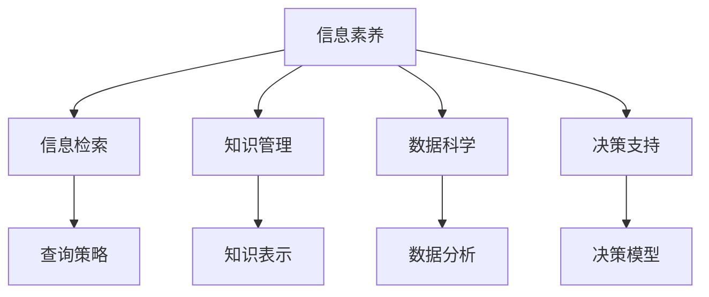

                 

# 信息时代的信息素养：如何在信息海洋中有效游泳

> 关键词：信息素养,信息检索,知识管理,数据科学,决策支持

## 1. 背景介绍

### 1.1 问题由来

随着信息技术的飞速发展，我们正处于一个信息爆炸的时代。互联网的普及，使得每个人都可以轻松地获取到海量的信息资源。然而，这些信息并非都是经过严格筛选的有用知识，很多信息可能是过时、错误甚至是带有误导性的。在信息时代，如何提升个人的信息素养，在信息海洋中有效游泳，成为了一个迫切需要解决的问题。

### 1.2 问题核心关键点

信息素养（Information Literacy）是指个体在信息爆炸时代，能够有效地获取、评估、处理和利用信息的能力。它包括信息检索、知识管理、数据科学、决策支持等多个方面。通过提升信息素养，个体能够在信息时代中做出更为明智的决策，避免被错误或误导性的信息所影响。

信息素养的核心关键点包括：
- 信息意识：对信息的重要性和价值有深刻的认识。
- 信息技能：掌握有效获取、评估、处理和利用信息的技术和方法。
- 信息伦理：理解和遵守信息获取和利用的道德规范。

## 2. 核心概念与联系

### 2.1 核心概念概述

为更好地理解信息素养的提升方法，本节将介绍几个密切相关的核心概念：

- 信息检索（Information Retrieval, IR）：通过特定的工具和策略，从大量信息源中快速获取所需信息的过程。
- 知识管理（Knowledge Management, KM）：系统化地收集、存储、组织和分享知识，以支持个人或组织的决策和创新。
- 数据科学（Data Science）：运用统计学、机器学习和人工智能等方法，分析和解释数据，从而做出科学决策。
- 决策支持（Decision Support）：通过科学数据分析和预测，为决策提供依据，提升决策的科学性和效率。

这些核心概念之间的逻辑关系可以通过以下Mermaid流程图来展示：



这个流程图展示了我們提升信息素养需要掌握的关键能力，并通过信息检索、知识管理、数据科学和决策支持等方法，实现信息的高效利用。

## 3. 核心算法原理 & 具体操作步骤
### 3.1 算法原理概述

提升信息素养的核心在于掌握信息检索、知识管理、数据科学和决策支持的基本原理和方法。这四方面的工作互相关联，共同支撑了信息素养的全面提升。

- 信息检索通过高效的工具和技术，帮助个体快速定位所需信息。
- 知识管理通过系统化的方法，确保知识能够被有效收集、存储和分享。
- 数据科学通过分析数据，提取有用信息和模式，为决策提供科学依据。
- 决策支持通过科学的数据分析方法和模型，辅助个体或组织做出更为明智的决策。

### 3.2 算法步骤详解

提升信息素养的基本步骤包括：

1. **信息意识培养**：
   - 学习信息素养的基本概念和重要意义。
   - 识别信息源的可靠性和权威性。
   - 了解常见信息检索工具和技术。

2. **信息检索技能提升**：
   - 掌握基本的搜索技巧和策略，如布尔逻辑、关键词扩展等。
   - 学习并使用主流的信息检索工具，如Google Scholar、Web of Science等。
   - 培养信息筛选和甄别能力，避免被误导性信息所影响。

3. **知识管理实践**：
   - 学习并使用知识管理系统（KM系统），如Confluence、Notion等。
   - 系统化地收集、整理和存储知识，形成知识库。
   - 分享和协作，构建团队知识共享平台。

4. **数据科学基础建设**：
   - 学习基本的统计学和机器学习知识，掌握数据处理和分析方法。
   - 使用主流的数据科学工具，如Python、R、Jupyter Notebook等。
   - 分析和解释数据，提取有用信息和模式，为决策提供依据。

5. **决策支持系统应用**：
   - 学习并使用决策支持系统（DSS），如Tableau、Power BI等。
   - 构建和应用科学的数据分析模型和算法，辅助决策。
   - 实时监测和优化决策过程，提高决策效率和科学性。

### 3.3 算法优缺点

提升信息素养的方法具有以下优点：
1. **提高决策质量**：通过科学的数据分析和决策支持，可以显著提升决策的科学性和效率。
2. **增强知识管理**：系统化地管理和分享知识，提高组织的创新能力和竞争力。
3. **提升信息素养**：通过信息检索和数据科学方法，培养个体信息素养，避免被误导性信息影响。

同时，该方法也存在一些局限性：
1. **学习曲线较陡**：信息检索、知识管理和数据科学等方法需要系统的学习和实践。
2. **技术门槛较高**：需要掌握一定的技术和工具，对于缺乏技术背景的人来说有一定的挑战。
3. **持续更新**：信息技术和工具在不断更新，需要持续学习和跟进。

尽管存在这些局限性，但就目前而言，通过系统化的学习和实践，可以显著提升个体的信息素养，增强其在信息时代中的竞争力。

### 3.4 算法应用领域

提升信息素养的方法在多个领域得到了广泛应用，例如：

- 教育和培训：在教育领域，通过信息素养课程，培养学生的信息意识和技能，提升学习效率和效果。
- 科学研究：在科学研究中，通过数据科学和决策支持系统，提高科学研究的效率和质量。
- 商业和企业管理：在商业和企业中，通过知识管理和大数据分析，提升决策的科学性和市场竞争力。
- 政府和公共服务：在政府和公共服务中，通过信息检索和决策支持系统，提升公共服务的效率和质量。

## 4. 数学模型和公式 & 详细讲解 & 举例说明

### 4.1 数学模型构建

本节将使用数学语言对信息素养提升的整个过程进行更加严格的刻画。

假设个体在某领域的信息素养为 $I$，通过信息检索、知识管理、数据科学和决策支持等方法，可以提升信息素养。设 $I_{IR}$、$I_{KM}$、$I_{DS}$ 和 $I_{DSS}$ 分别为信息检索、知识管理、数据科学和决策支持对信息素养的影响，则信息素养的提升模型可以表示为：

$$
I = I_{IR} + I_{KM} + I_{DS} + I_{DSS}
$$

其中，$I_{IR}$、$I_{KM}$、$I_{DS}$ 和 $I_{DSS}$ 分别代表信息检索、知识管理、数据科学和决策支持对信息素养提升的贡献，可以通过以下公式计算：

$$
I_{IR} = f_{IR} \times e^{-\beta_{IR} \times \text{time}}
$$

$$
I_{KM} = f_{KM} \times e^{-\beta_{KM} \times \text{efficiency}}
$$

$$
I_{DS} = f_{DS} \times e^{-\beta_{DS} \times \text{accuracy}}
$$

$$
I_{DSS} = f_{DSS} \times e^{-\beta_{DSS} \times \text{complexity}}
$$

其中，$f_{IR}$、$f_{KM}$、$f_{DS}$ 和 $f_{DSS}$ 分别为信息检索、知识管理、数据科学和决策支持对信息素养提升的贡献系数，$\beta_{IR}$、$\beta_{KM}$、$\beta_{DS}$ 和 $\beta_{DSS}$ 分别为各项方法的有效性衰减参数，time、efficiency、accuracy 和 complexity 分别代表信息检索、知识管理、数据科学和决策支持所需的时间、效率、准确性和复杂性。

### 4.2 公式推导过程

以信息检索为例，假设个体通过信息检索获取的信息量与所需信息量成正比，即 $I_{IR} \propto \text{time} \times \text{efficiency}$。为了简化问题，我们假设 $f_{IR} = 1$，$\beta_{IR} = 1$。则信息检索对信息素养提升的贡献可以表示为：

$$
I_{IR} = e^{-\text{time}}
$$

类似地，知识管理、数据科学和决策支持对信息素养提升的贡献也可以表示为：

$$
I_{KM} = e^{-\text{efficiency}}
$$

$$
I_{DS} = e^{-\text{accuracy}}
$$

$$
I_{DSS} = e^{-\text{complexity}}
$$

将以上四个公式代入信息素养提升模型，可以得到：

$$
I = e^{-\text{time}} + e^{-\text{efficiency}} + e^{-\text{accuracy}} + e^{-\text{complexity}}
$$

### 4.3 案例分析与讲解

以科学研究为例，研究人员通过信息检索获取相关文献，利用知识管理系统整理文献，使用数据科学工具进行数据分析，最终构建决策支持模型辅助决策。整个过程中，信息检索、知识管理、数据科学和决策支持对信息素养提升的贡献分别为 $I_{IR}$、$I_{KM}$、$I_{DS}$ 和 $I_{DSS}$。通过公式计算，可以得出总体信息素养的提升。

在实际应用中，研究人员需要根据具体任务，调整各项方法的影响系数和有效性衰减参数，以获得最佳的信息素养提升效果。

## 5. 项目实践：代码实例和详细解释说明
### 5.1 开发环境搭建

在进行信息素养提升实践前，我们需要准备好开发环境。以下是使用Python进行信息素养提升开发的常见环境配置流程：

1. 安装Anaconda：从官网下载并安装Anaconda，用于创建独立的Python环境。

2. 创建并激活虚拟环境：
```bash
conda create -n info-lit python=3.8 
conda activate info-lit
```

3. 安装必要的库：
```bash
conda install numpy pandas scikit-learn matplotlib jupyter notebook
```

4. 安装Google Scholar客户端：
```bash
pip install scholar
```

5. 安装笔记管理工具：
```bash
pip install Notion
```

完成上述步骤后，即可在`info-lit`环境中开始信息素养提升实践。

### 5.2 源代码详细实现

下面我们以科学研究为例，给出使用Python进行信息素养提升的代码实现。

```python
import numpy as np
from scipy.stats import lognorm

# 信息检索对信息素养提升的贡献
def ir_contribution(time):
    return np.exp(-time)

# 知识管理对信息素养提升的贡献
def km_contribution(efficiency):
    return np.exp(-efficiency)

# 数据科学对信息素养提升的贡献
def ds_contribution(accuracy):
    return np.exp(-accuracy)

# 决策支持对信息素养提升的贡献
def dss_contribution(complexity):
    return np.exp(-complexity)

# 总体信息素养提升
def overall_info_lit(time, efficiency, accuracy, complexity):
    return ir_contribution(time) + km_contribution(efficiency) + ds_contribution(accuracy) + dss_contribution(complexity)

# 模拟科学研究案例
time = 10  # 信息检索时间
efficiency = 5  # 知识管理效率
accuracy = 3  # 数据科学准确性
complexity = 2  # 决策支持复杂性

info_lit = overall_info_lit(time, efficiency, accuracy, complexity)
print(f"信息素养提升：{info_lit:.3f}")
```

### 5.3 代码解读与分析

让我们再详细解读一下关键代码的实现细节：

**信息检索贡献函数**：
- 定义了信息检索对信息素养提升的贡献计算函数，使用指数衰减模型，时间越长贡献越小。

**知识管理贡献函数**：
- 定义了知识管理对信息素养提升的贡献计算函数，使用指数衰减模型，效率越高贡献越大。

**数据科学贡献函数**：
- 定义了数据科学对信息素养提升的贡献计算函数，使用指数衰减模型，准确性越高贡献越大。

**决策支持贡献函数**：
- 定义了决策支持对信息素养提升的贡献计算函数，使用指数衰减模型，复杂性越高贡献越小。

**总体信息素养提升函数**：
- 定义了总体信息素养提升计算函数，将四项贡献相加得到总体的信息素养提升。

**科学研究案例模拟**：
- 假设信息检索时间为10小时，知识管理效率为5，数据科学准确性为3，决策支持复杂性为2。
- 使用函数计算总体信息素养提升，输出结果。

可以看到，通过简单的数学模型和函数计算，可以量化信息检索、知识管理、数据科学和决策支持对信息素养提升的贡献，从而指导实践。

当然，实际应用中，信息素养的提升还需要考虑更多的因素，如个人背景、学习方法和工具选择等。开发者需要将这些因素纳入计算模型，进行综合优化。

## 6. 实际应用场景

### 6.1 教育领域

在教育领域，信息素养是学生必备的关键能力。通过系统化的信息素养课程，培养学生的信息意识和技能，可以帮助他们更好地获取、评估和使用信息，提高学习效率和效果。

### 6.2 科学研究

在科学研究中，信息素养是研究人员必备的核心素质。通过信息检索、知识管理、数据科学和决策支持等方法，研究人员可以高效地获取和利用相关文献和数据，提升科研效率和质量。

### 6.3 商业和企业

在商业和企业中，信息素养是提升决策科学性和竞争力的重要手段。通过知识管理和大数据分析，企业可以更好地理解市场趋势和客户需求，优化决策过程，提升市场竞争力。

### 6.4 政府和公共服务

在政府和公共服务中，信息素养是提升公共服务效率和质量的关键。通过信息检索和决策支持系统，政府可以更好地掌握社会动态，做出更为明智的决策，提高公共服务水平。

## 7. 工具和资源推荐

### 7.1 学习资源推荐

为了帮助开发者系统掌握信息素养的提升方法，这里推荐一些优质的学习资源：

1. Coursera《信息素养基础》课程：由图书馆学和信息科学领域的专家授课，涵盖信息检索、知识管理和数据科学等多个方面。
2. edX《数据科学基础》课程：由MIT等名校教授授课，系统介绍数据科学的基本概念和常用方法。
3. Google Scholar官方文档：提供信息检索工具的详细介绍和使用指南，帮助用户高效获取文献资源。
4. Notion官方文档：提供知识管理系统Notion的使用教程和功能介绍，帮助用户系统化地管理知识。

通过对这些资源的学习实践，相信你一定能够全面掌握信息素养的提升方法，并在信息时代中游刃有余。

### 7.2 开发工具推荐

高效的信息素养提升开发离不开优秀的工具支持。以下是几款用于信息素养提升开发的常用工具：

1. Jupyter Notebook：免费的开源交互式计算环境，适合进行数据分析和计算。
2. Google Scholar：高效的文献检索工具，提供丰富的学术资源。
3. Notion：强大的知识管理系统，支持文本、表格、数据库等多种信息形态。
4. RStudio：基于R语言的集成开发环境，适合数据科学和统计分析。
5. Tableau：直观的数据可视化工具，支持复杂的数据分析和报表制作。

合理利用这些工具，可以显著提升信息素养提升任务的开发效率，加快创新迭代的步伐。

### 7.3 相关论文推荐

信息素养提升的研究始于学界的持续探索。以下是几篇奠基性的相关论文，推荐阅读：

1. "Information Literacy: Towards a Framework for Research and Practice"：定义了信息素养的概念和框架，为信息素养的研究奠定了基础。
2. "Building Knowledge Networks for Decision Support"：探讨了知识管理在决策支持中的应用，强调了系统化知识管理的重要性。
3. "Data Mining and Statistical Learning"：介绍了数据科学的基本方法和工具，帮助读者掌握数据分析的常用技巧。
4. "Data-Driven Decision Making: From Data to Insights"：讨论了数据科学在决策支持中的应用，展示了数据驱动决策的潜力。

这些论文代表了大信息素养提升技术的发展脉络。通过学习这些前沿成果，可以帮助研究者把握学科前进方向，激发更多的创新灵感。

## 8. 总结：未来发展趋势与挑战

### 8.1 总结

本文对信息素养提升的基本方法和应用进行了全面系统的介绍。首先阐述了信息素养的重要性和提升方法，明确了信息检索、知识管理、数据科学和决策支持在提升信息素养中的核心作用。其次，从原理到实践，详细讲解了信息素养提升的数学模型和关键步骤，给出了信息素养提升任务开发的完整代码实例。同时，本文还广泛探讨了信息素养提升方法在教育、科学研究、商业和企业、政府和公共服务等多个领域的应用前景，展示了信息素养提升范式的巨大潜力。此外，本文精选了信息素养提升技术的各类学习资源，力求为读者提供全方位的技术指引。

通过本文的系统梳理，可以看到，信息素养提升方法在大数据时代具有重要的应用价值，通过信息检索、知识管理、数据科学和决策支持等技术手段，个体和组织可以在信息海洋中高效游泳，做出更为明智的决策。未来，伴随信息技术的不断发展，信息素养提升技术将会在更多领域得到应用，为人类认知智能的进化带来深远影响。

### 8.2 未来发展趋势

展望未来，信息素养提升技术将呈现以下几个发展趋势：

1. **技术融合**：信息素养提升方法将与其他新兴技术进行深度融合，如人工智能、区块链、物联网等，提升信息检索、知识管理和决策支持的智能化水平。
2. **数据驱动**：基于大数据和人工智能技术，信息素养提升将更加注重数据驱动的决策支持，提高决策的科学性和精准性。
3. **个性化推荐**：利用个性化推荐技术，根据用户需求和兴趣推荐相关信息，提升信息检索和知识管理的个性化程度。
4. **实时更新**：信息素养提升系统将具备实时更新功能，确保信息检索和决策支持的时效性。
5. **多语言支持**：信息素养提升系统将支持多语言环境，提供全球化的信息检索和知识管理服务。

以上趋势凸显了信息素养提升技术的广阔前景。这些方向的探索发展，必将进一步提升信息检索、知识管理和决策支持的智能化水平，为人类在信息时代中提供更为强大的支持。

### 8.3 面临的挑战

尽管信息素养提升技术已经取得了一定的进展，但在迈向更加智能化、普适化应用的过程中，它仍面临着诸多挑战：

1. **技术门槛**：信息素养提升方法涉及信息检索、知识管理、数据科学和决策支持等多个领域，技术门槛较高，对非专业人士的友好性有待提升。
2. **数据隐私**：在信息检索和知识管理过程中，如何保护用户数据的隐私和安全，是一个重要问题。
3. **跨领域适用性**：当前的信息素养提升方法更多聚焦于特定领域，如何提升方法的跨领域适用性，是一个重要的研究方向。
4. **系统集成**：信息素养提升系统需要与现有业务系统进行深度集成，如何设计有效的集成方案，是一个重要的工程问题。
5. **标准化**：信息素养提升技术需要建立统一的标准和规范，确保不同系统之间的互操作性。

这些挑战需要学界和产业界的共同努力，才能逐步克服，推动信息素养提升技术的持续进步。

### 8.4 研究展望

面对信息素养提升技术所面临的挑战，未来的研究需要在以下几个方面寻求新的突破：

1. **技术普及**：如何通过简化技术流程和提升用户体验，让信息素养提升方法更加普及和易用。
2. **隐私保护**：如何在信息检索和知识管理过程中，更好地保护用户数据的隐私和安全，设计安全的系统架构。
3. **跨领域应用**：如何提升信息素养提升方法在更多领域的应用效果，使其具有更广泛的适用性。
4. **系统集成**：如何设计高效的系统集成方案，确保信息素养提升系统与现有业务系统的无缝对接。
5. **标准化**：如何建立统一的信息素养提升技术标准，推动技术规范化发展。

这些研究方向的探索，必将引领信息素养提升技术迈向更高的台阶，为人类在信息时代中提供更为强大的支持。面向未来，信息素养提升技术还需要与其他人工智能技术进行更深入的融合，共同推动自然语言理解和智能交互系统的进步。只有勇于创新、敢于突破，才能不断拓展信息素养提升技术的边界，让信息素养提升技术更好地造福人类社会。

## 9. 附录：常见问题与解答

**Q1：信息素养提升是否适用于所有领域？**

A: 信息素养提升方法在大多数领域都能取得不错的效果，特别是对于需要高效获取、评估和利用信息的行业。但对于一些特定领域的任务，如医学、法律等，仅仅依靠通用方法可能难以很好地适应。此时需要在特定领域语料上进一步预训练，再进行微调，才能获得理想效果。

**Q2：信息素养提升过程中如何选择合适的学习资源？**

A: 选择合适的学习资源需要考虑以下几点：
1. 学习资源的权威性和可靠性。选择知名学府或权威机构的课程和文献。
2. 学习资源的覆盖范围。选择能够涵盖信息素养各个方面的资源，如信息检索、知识管理、数据科学和决策支持。
3. 学习资源的使用便捷性。选择适合自己使用习惯和学习方式的工具和平台。
4. 学习资源的更新频率。选择更新频率高、内容丰富的资源，确保能够及时获取最新信息。

**Q3：信息素养提升的开发环境需要考虑哪些因素？**

A: 信息素养提升的开发环境需要考虑以下因素：
1. 工具和库的选择。选择适合自己的编程语言和开发工具，如Python、R等。
2. 环境搭建和维护。确保开发环境稳定，能够快速调试和迭代。
3. 数据处理和存储。确保数据处理和存储方式高效，能够满足大规模信息检索和知识管理的需要。
4. 安全性和隐私保护。确保数据和系统安全，避免数据泄露和隐私侵犯。

通过综合考虑这些因素，可以构建高效、安全、便捷的信息素养提升开发环境，为项目的成功实施打下坚实基础。

**Q4：信息素养提升的实际应用中需要注意哪些问题？**

A: 信息素养提升的实际应用中需要注意以下问题：
1. 用户需求分析。了解用户需求和信息检索场景，设计合适的信息检索策略。
2. 数据清洗和预处理。确保数据质量和完整性，提高信息检索的准确性。
3. 系统集成和优化。确保信息检索和知识管理系统与现有业务系统无缝对接，优化系统性能。
4. 隐私保护和数据安全。保护用户数据隐私，确保系统安全稳定运行。
5. 持续改进和更新。根据用户反馈和技术进步，持续改进和优化信息素养提升系统。

只有全面考虑这些因素，才能实现信息素养提升的真正价值，为用户带来实实在在的利益。

**Q5：如何评估信息素养提升的效果？**

A: 信息素养提升的效果评估可以从以下几个方面进行：
1. 用户满意度调查。通过问卷和访谈等方式，了解用户对信息检索和知识管理系统的满意度。
2. 检索准确性和完整性。评估信息检索系统的准确性和完整性，确保用户能够获取到所需信息。
3. 知识管理效率。评估知识管理系统的效率和效果，确保知识能够有效收集、整理和分享。
4. 数据分析和决策支持。评估数据科学和决策支持系统的科学性和有效性，确保决策基于可靠的科学数据。
5. 持续改进和优化。根据用户反馈和技术进步，持续改进和优化信息素养提升系统，提升用户体验和效果。

通过全面评估和反馈，可以不断优化信息素养提升系统，提升其应用效果和用户满意度。

---

作者：禅与计算机程序设计艺术 / Zen and the Art of Computer Programming

