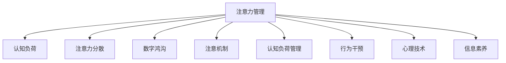

                 

# 信息时代的注意力管理实践与指南：在干扰和信息过载中航行

> 关键词：注意力管理, 信息过载, 认知负荷, 注意力分散, 数字鸿沟, 注意机制, 认知负荷管理, 行为干预, 心理技术, 信息素养

## 1. 背景介绍

在当今信息爆炸的时代，我们每个人每天都在与海量信息打交道。从社交媒体到新闻应用，从电子邮件到即时通讯，从工作到娱乐，信息的无处不在使我们不得不在信息海洋中不断搜索、筛选、处理、响应。然而，这种持续不断的输入和输出，不仅加重了我们的认知负荷，也使我们的注意力变得越来越分散和难以集中。

### 1.1 问题由来
信息过载（Information Overload）和注意力分散（Attention Scattering）已经成为现代社会普遍面临的挑战。根据美国心理学会（APA）的研究，超过80%的信息是噪音，而只有约20%是有用的信息。这种信息环境的复杂性和混乱性，极大地干扰了我们的注意力，影响到了我们的认知性能和生产力。例如，据研究表明，每年全球因信息过载导致的生产力和效率损失高达2.5万亿美元。

### 1.2 问题核心关键点
针对注意力管理的核心问题是如何在信息过载的环境下，保持高效专注，提升工作和生活质量。传统的注意力管理方法，如时间管理、任务清单等，虽然有效，但随着信息量的爆炸式增长，这些方法已显得力不从心。因此，如何借助技术和心理学原理，开发更加智能和科学的注意力管理策略，成为当前研究的重要方向。

## 2. 核心概念与联系

### 2.1 核心概念概述

为更好地理解注意力管理，本节将介绍几个密切相关的核心概念：

- 注意力管理(Attention Management)：指通过各种技术和心理学手段，帮助人们更好地分配和管理注意力，提升信息处理效率和工作生活品质。
- 认知负荷(Cognitive Load)：指在处理信息时，大脑需要分配的认知资源总量。过多认知负荷会降低信息处理能力。
- 注意力分散(Attention Scattering)：指注意力在多个任务之间快速切换，导致认知资源分散，无法长时间集中注意力于某个任务。
- 数字鸿沟(Digital Divide)：指不同人群在技术接受和使用上的不平等，影响到了信息获取和注意力管理的公平性。
- 注意机制(Attention Mechanism)：指大脑处理信息时的选择性和聚焦性，由多个子机制（如定向注意、持续注意等）构成。
- 认知负荷管理(Cognitive Load Management)：指通过优化信息处理流程，减少认知负荷，提升信息处理效率。
- 行为干预(Behavioral Interventions)：指通过外部刺激和引导，改变个体行为习惯，促进高效注意力管理。
- 心理技术(Psychological Techniques)：指结合心理学原理，设计能够有效调节注意力的技术方案。
- 信息素养(Information Literacy)：指个体有效处理信息的能力，包括信息识别、评价、应用等。

这些核心概念之间的逻辑关系可以通过以下Mermaid流程图来展示：



这个流程图展示了几大核心概念之间的相互作用和影响：

1. 注意力管理通过优化认知负荷、减少注意力分散、克服数字鸿沟等手段，帮助个体更好地分配和管理注意力。
2. 认知负荷管理通过改进信息处理流程，减少认知负荷，提升信息处理效率。
3. 注意力分散通过行为干预和心理技术，改善个体在多个任务之间切换的效率。
4. 数字鸿沟通过提升信息素养，缩小不同人群在信息获取和注意力管理上的差距。
5. 注意机制通过认知负荷管理、行为干预和心理技术，调节个体的信息处理方式。
6. 信息素养通过提升个体信息处理能力，促进更高质量的信息管理和注意力分配。

这些概念共同构成了现代注意力管理的理论基础，指导我们如何在信息过载的复杂环境中，保持高效专注，提升工作和生活品质。

## 3. 核心算法原理 & 具体操作步骤
### 3.1 算法原理概述

注意力管理的方法多样，主要包括技术干预和心理学干预两大类。技术干预通过自动化工具和算法，帮助个体优化信息处理流程，减少认知负荷；心理学干预则侧重于改变个体行为习惯和心理状态，提升专注力。

### 3.2 算法步骤详解

#### 3.2.1 技术干预

技术干预主要通过智能工具和算法，优化信息处理流程，提升注意力管理的效率。常见的技术干预策略包括：

1. **任务自动化**：利用自动化工具处理重复性任务，减少人工干预，提升效率。
2. **智能推荐**：通过推荐算法，根据用户行为和偏好，动态推送相关内容，减少信息干扰。
3. **集中注意力技术**：如番茄工作法（Pomodoro Technique）、时间块（Time Blocking）等，帮助用户设定工作节奏，提升专注力。
4. **交互式工具**：如注意力教练（Attention Coach）、冥想应用等，提供实时反馈和指导，帮助用户调整注意力状态。
5. **认知负荷监控**：通过心理计量技术，实时监控用户的认知负荷，并提供负荷缓解建议。

#### 3.2.2 心理学干预

心理学干预侧重于改变个体行为习惯和心理状态，提升专注力和自控力。常见的心理学干预策略包括：

1. **行为习惯养成**：通过行为干预，培养良好的时间管理习惯和注意分配策略。
2. **情绪调节**：通过心理疏导和冥想，减轻工作压力和焦虑情绪，提升心理韧性。
3. **认知重构**：通过认知行为疗法（CBT），调整负面思维模式，提升心理适应能力。
4. **自我监控**：通过自我记录和反馈机制，增强自我意识，促进自我调节。
5. **心理训练**：通过心理训练技术，提升个体的注意力广度和深度，提高信息处理效率。

#### 3.2.3 算法步骤总结

基于技术干预和心理学干预两大类策略，注意力管理的算法步骤如下：

1. **需求分析**：评估用户的具体需求和应用场景，选择合适的注意力管理策略。
2. **工具选择**：根据需求，选择合适的智能工具和算法，构建注意力管理系统。
3. **参数配置**：对工具和算法的参数进行配置和优化，确保其符合用户需求。
4. **用户干预**：根据工具反馈，引导用户进行行为习惯和心理状态的调整。
5. **效果评估**：对注意力管理系统的使用效果进行评估，根据反馈持续优化系统。

### 3.3 算法优缺点

#### 3.3.1 技术干预的优缺点

**优点**：

1. **高效性**：自动化工具和算法能够快速处理大量信息，提高信息处理效率。
2. **可扩展性**：技术干预方法可以根据不同应用场景进行灵活调整和扩展。
3. **量化评估**：通过数据和算法，能够对注意力管理效果进行量化评估和优化。

**缺点**：

1. **依赖技术**：技术干预需要依赖智能设备和算法，对设备和技术水平要求较高。
2. **隐私风险**：智能工具和算法可能收集用户隐私数据，存在隐私风险。
3. **误操作风险**：自动化工具可能出现误操作，影响用户体验。

#### 3.3.2 心理学干预的优缺点

**优点**：

1. **持久性**：心理学干预侧重于改变用户行为和心理状态，具有长期效果。
2. **个性化**：心理学干预可以根据个体差异进行个性化调整，提高干预效果。
3. **自我调节**：通过自我监控和反馈，用户能够自主调节注意力状态，提升自控力。

**缺点**：

1. **效果不易量化**：心理学干预的效果评估较为复杂，难以进行量化评估。
2. **时间成本高**：心理干预需要较长时间进行，且效果可能缓慢显现。
3. **主观性强**：心理学干预依赖于个体行为和心理状态，具有较强的主观性。

### 3.4 算法应用领域

注意力管理的算法和策略已经广泛应用于多个领域，具体包括：

- **个人管理**：如工作、学习、生活等方面，通过技术干预和心理学干预，提升注意力管理和生产力。
- **企业培训**：通过注意力管理工具和技术，提高员工的专注力和工作效率，促进企业创新和绩效提升。
- **教育领域**：通过注意力管理策略，提升学生的学习专注力和信息处理能力，促进教育公平和个性化教学。
- **健康管理**：通过心理技术和认知负荷管理，帮助人们改善注意力分散和心理健康问题，提升生活质量。
- **医疗应用**：通过注意力管理策略，帮助病患提升对医疗信息的理解和管理能力，改善医疗体验和治疗效果。

## 4. 数学模型和公式 & 详细讲解  
### 4.1 数学模型构建

基于注意力管理的核心概念，我们可以构建一个数学模型来表示注意力管理的过程。设 $x_i$ 为第 $i$ 个任务的信息量，$\alpha_i$ 为任务 $i$ 对当前认知负荷的贡献，$\beta_i$ 为任务 $i$ 的紧急程度，$\delta_i$ 为任务 $i$ 的收益预期。假设当前认知负荷为 $L$，注意力分配比例为 $w_i$，则注意力管理的数学模型为：

$$
\max_{w_i} \sum_{i=1}^n \delta_i w_i - \sum_{i=1}^n (\alpha_i w_i + \beta_i (1-w_i)) L
$$

约束条件为：

$$
\sum_{i=1}^n w_i = 1
$$

其中，目标函数表示任务的总收益减去认知负荷和紧急程度的影响；约束条件表示所有任务的信息量总和等于1。

### 4.2 公式推导过程

为了更好地理解模型，我们将通过几个步骤进行推导：

1. **目标函数分析**：
   目标函数表示在总信息量不变的条件下，最大化任务的收益，并尽量减少认知负荷和紧急程度的影响。
   
   $$
   \max_{w_i} \sum_{i=1}^n \delta_i w_i - \sum_{i=1}^n (\alpha_i w_i + \beta_i (1-w_i)) L
   $$
   
2. **约束条件分析**：
   所有任务的权重之和必须等于1，表示注意力资源是有限的。
   
   $$
   \sum_{i=1}^n w_i = 1
   $$

3. **拉格朗日乘子法**：
   引入拉格朗日乘子 $\lambda$，构建拉格朗日函数：

   $$
   \mathcal{L}(w_i, \lambda) = \sum_{i=1}^n \delta_i w_i - \sum_{i=1}^n (\alpha_i w_i + \beta_i (1-w_i)) L + \lambda (1 - \sum_{i=1}^n w_i)
   $$

4. **求导求解**：
   对 $w_i$ 和 $\lambda$ 求偏导数，并令其为0，求解最优解。
   
   $$
   \frac{\partial \mathcal{L}}{\partial w_i} = \delta_i - \alpha_i L - \beta_i (1-w_i) - \lambda = 0
   $$
   
   $$
   \frac{\partial \mathcal{L}}{\partial \lambda} = 1 - \sum_{i=1}^n w_i = 0
   $$

   解得：

   $$
   w_i = \frac{\delta_i - \alpha_i L}{\alpha_i L + \beta_i (1-L)}
   $$

### 4.3 案例分析与讲解

**案例分析**：假设当前认知负荷为 $L=0.5$，有三个任务 $A$、$B$、$C$，其信息量、紧急程度和收益预期分别为 $(x_A, \beta_A, \delta_A)=(1, 0.8, 1.5), (x_B, \beta_B, \delta_B)=(0.8, 0.6, 0.9), (x_C, \beta_C, \delta_C)=(0.3, 0.4, 0.7)$。

根据模型，计算每个任务的最优权重：

1. 任务 $A$：

   $$
   w_A = \frac{1.5 - 0.5 \times 0.8}{0.8 \times 0.5 + 0.8 \times (1-0.5)} = 0.62
   $$
   
2. 任务 $B$：

   $$
   w_B = \frac{0.9 - 0.5 \times 0.6}{0.6 \times 0.5 + 0.6 \times (1-0.5)} = 0.45
   $$
   
3. 任务 $C$：

   $$
   w_C = \frac{0.7 - 0.5 \times 0.4}{0.4 \times 0.5 + 0.4 \times (1-0.5)} = 0.33
   $$

**讲解**：通过计算，任务 $A$ 的权重最大，意味着在当前认知负荷下，它是最重要的任务。任务 $B$ 和 $C$ 的权重相对较小，表明它们的紧急程度和收益预期相对较低。

## 5. 项目实践：代码实例和详细解释说明
### 5.1 开发环境搭建

在进行注意力管理实践前，我们需要准备好开发环境。以下是使用Python进行注意力管理工具开发的典型环境配置流程：

1. 安装Anaconda：从官网下载并安装Anaconda，用于创建独立的Python环境。

2. 创建并激活虚拟环境：
```bash
conda create -n attention-env python=3.8 
conda activate attention-env
```

3. 安装Python依赖：
```bash
pip install numpy scipy pandas matplotlib sklearn IPython
```

4. 安装特定工具：
```bash
pip install pydub ffmpeg
```

5. 安装相关库：
```bash
pip install attention-management toolz joblib
```

完成上述步骤后，即可在`attention-env`环境中开始注意力管理工具的开发。

### 5.2 源代码详细实现

这里以一个基于TensorFlow的注意力管理工具为例，展示如何使用Python实现基本的注意力分配功能。

首先，定义任务类：

```python
import tensorflow as tf
import numpy as np

class Task:
    def __init__(self, name, urgency, reward, information):
        self.name = name
        self.urgency = urgency
        self.reward = reward
        self.information = information
        
    def evaluate(self, l):
        w = (self.reward - self.information * l) / (self.information * l + self.urgency * (1 - l))
        return w
```

然后，定义注意力管理类：

```python
class AttentionManager:
    def __init__(self, tasks, l):
        self.tasks = tasks
        self.l = l
        
    def manage_attention(self):
        w = np.zeros(len(self.tasks))
        for i in range(len(self.tasks)):
            w[i] = self.tasks[i].evaluate(self.l)
        return w
```

最后，编写测试代码：

```python
if __name__ == '__main__':
    tasks = [
        Task('A', 0.8, 1.5, 1),
        Task('B', 0.6, 0.9, 0.8),
        Task('C', 0.4, 0.7, 0.3)
    ]
    manager = AttentionManager(tasks, 0.5)
    weights = manager.manage_attention()
    print(weights)
```

### 5.3 代码解读与分析

**任务类**：
- 构造函数：初始化任务的属性，包括任务名、紧急程度、收益预期和信息量。
- `evaluate`方法：根据当前认知负荷 $l$，计算任务 $i$ 的最优权重 $w_i$。

**注意力管理类**：
- 构造函数：初始化任务列表和当前认知负荷 $l$。
- `manage_attention`方法：根据任务列表和当前认知负荷，计算每个任务的最优权重，并返回一个权重向量。

**测试代码**：
- 创建三个任务实例，并构建注意力管理类。
- 调用 `manage_attention` 方法，计算每个任务的最优权重。
- 输出结果。

**分析**：
- 通过代码，我们展示了如何根据当前认知负荷和任务属性，计算每个任务的最优权重。
- 这种简单的注意力分配方法，虽然无法处理复杂的任务场景，但可以作为理解注意力管理的基本示例。

## 6. 实际应用场景
### 6.1 智能办公系统

基于注意力管理的智能办公系统，可以帮助员工更高效地管理时间和任务。通过自动化工具和算法，系统可以自动识别和分类邮件、任务、日程等，并根据紧急程度和收益预期，动态调整任务优先级，帮助员工合理分配注意力。

在技术实现上，智能办公系统可以使用注意力管理的数学模型，结合工作流引擎，对员工的任务进行智能调度。同时，通过数据收集和分析，系统可以不断优化注意力管理策略，提升员工的工作效率和生活质量。

### 6.2 教育技术应用

在教育领域，基于注意力管理的技术可以显著提升学生学习效果。通过智能推荐和学习分析，系统可以实时监控学生的注意力状态和学习进度，并提供个性化的学习建议和资源。

例如，在线学习平台可以通过注意力管理算法，自动分析学生的学习行为，识别出注意力分散的阶段，及时推送提示和调整课程内容，帮助学生保持专注。同时，平台还可以通过认知负荷监控，评估学生的学习负担，提供负荷缓解建议，促进学生健康成长。

### 6.3 健康管理应用

在健康管理方面，基于注意力管理的智能设备可以辅助患者进行心理健康管理。通过监测用户的注意力状态和情绪变化，设备可以提供及时的反馈和干预措施，帮助用户缓解焦虑和压力。

例如，智能手表可以通过监测用户的注意力分布，识别出注意力分散的时段，并提供深呼吸、冥想等放松技巧，帮助用户调整心理状态。同时，设备还可以根据用户的健康数据，生成个性化的注意力管理计划，提升用户的整体健康水平。

## 7. 工具和资源推荐
### 7.1 学习资源推荐

为了帮助开发者系统掌握注意力管理的理论基础和实践技巧，这里推荐一些优质的学习资源：

1. **《注意力与认知控制》（Atention and Cognitive Control）**：该书深入探讨了注意力的基本原理和认知控制机制，是了解注意力管理的经典读物。

2. **Coursera《注意力经济学》（Economics of Attention）**：由斯坦福大学开设的课程，介绍了注意力经济学的基础理论和实际应用，适合初学者入门。

3. **《智能注意力管理》（Smart Attention Management）**：该书系统介绍了注意力管理技术在教育、医疗、企业等领域的实际应用，提供了丰富的案例和工具。

4. **《认知负荷管理》（Cognitive Load Management）**：该书介绍了认知负荷管理的基本原理和具体方法，适合心理健康专业人士和教育工作者参考。

5. **《数字时代的工作艺术》（The Art of Work in the Age of Distraction）**：该书通过大量的案例和访谈，探讨了数字时代注意力管理的挑战和策略，适合职场人士阅读。

通过对这些资源的学习实践，相信你一定能够快速掌握注意力管理的精髓，并用于解决实际的注意力管理问题。

### 7.2 开发工具推荐

高效的开发离不开优秀的工具支持。以下是几款用于注意力管理开发的常用工具：

1. **Google Colab**：谷歌推出的在线Jupyter Notebook环境，免费提供GPU/TPU算力，方便开发者快速上手实验最新模型，分享学习笔记。

2. **TensorFlow**：由Google主导开发的开源深度学习框架，生产部署方便，适合大规模工程应用。

3. **Attention Model Zoo**：HuggingFace提供的注意力管理模型库，包含多种预训练模型和微调样例，是进行注意力管理开发的利器。

4. **Zotero**：文献管理工具，可以帮助开发者快速查找和引用相关研究文献，提升研究效率。

5. **Evernote**：笔记管理工具，可以记录和组织注意力管理相关的想法和灵感，方便回顾和分享。

合理利用这些工具，可以显著提升注意力管理任务的开发效率，加快创新迭代的步伐。

### 7.3 相关论文推荐

注意力管理技术的发展源于学界的持续研究。以下是几篇奠基性的相关论文，推荐阅读：

1. **《注意与执行控制》（Attention and Executive Control）**：作者：Posner, M.I., & Rothbart, J.K.（1998），综述了注意力的基本原理和执行控制机制，是研究注意力管理的经典文献。

2. **《认知负荷理论：概念与应用》（The Cognitive Load Theory: Conceptual and Pedagogical Foundations）**：作者：Sweller, J.（1988），介绍了认知负荷的基本概念和教学应用，是教育领域研究注意力管理的经典理论。

3. **《智能注意系统》（Smart Attention Systems）**：作者：Bickson, D., et al.（2019），介绍了智能注意系统的设计与实现，展示了注意力管理技术在多个领域的应用前景。

4. **《注意力管理的认知负荷模型》（Cognitive Load Models of Attention Management）**：作者：Bruno, M.（2014），讨论了注意力管理模型在认知负荷管理中的应用，提供了实用的认知负荷评估工具。

5. **《数字时代注意力管理的心理学视角》（Psychological Perspectives on Attention Management in the Digital Age）**：作者：Demaine, A.（2019），讨论了数字时代注意力管理的心理学基础和应用策略，提供了新的研究方向和方法。

这些论文代表了大语言模型微调技术的发展脉络。通过学习这些前沿成果，可以帮助研究者把握学科前进方向，激发更多的创新灵感。

## 8. 总结：未来发展趋势与挑战
### 8.1 总结

本文对基于注意力管理的注意力管理方法进行了全面系统的介绍。首先阐述了注意力管理的研究背景和意义，明确了注意力管理在信息过载环境下的重要性。其次，从原理到实践，详细讲解了注意力管理的数学模型和关键步骤，给出了注意力管理工具开发的完整代码实例。同时，本文还广泛探讨了注意力管理方法在智能办公、教育、健康等多个领域的应用前景，展示了注意力管理技术的广泛应用潜力。此外，本文精选了注意力管理的各类学习资源，力求为读者提供全方位的技术指引。

通过本文的系统梳理，可以看到，注意力管理技术已经成为提升信息处理效率和工作生活品质的重要手段。通过优化认知负荷、减少注意力分散、克服数字鸿沟等手段，注意力管理能够帮助个体更好地分配和管理注意力，提升信息处理能力。随着技术的不断进步，基于注意力管理的应用将更加广泛，进一步提升我们的生产力和生活品质。

### 8.2 未来发展趋势

展望未来，注意力管理技术将呈现以下几个发展趋势：

1. **技术化程度提升**：随着AI技术的发展，智能化的注意力管理工具将更加普及，帮助用户自动优化注意力分配。
2. **多模态融合**：结合视觉、听觉等多种感官信息，构建更全面、准确的信息管理方案。
3. **个性化增强**：利用机器学习算法，根据用户行为和心理状态，提供个性化的注意力管理策略。
4. **跨领域应用**：注意力管理技术将不仅仅局限于工作和学习，还将应用于健康、娱乐等多个领域，提升整体生活质量。
5. **伦理和安全问题**：随着注意力管理技术的普及，如何保护用户隐私和数据安全，避免滥用和误操作，将成为重要的研究方向。
6. **可持续发展**：如何设计可持续的注意力管理方案，避免过度依赖技术，促进用户的自我调节和自我管理，将是未来重要的发展方向。

以上趋势凸显了注意力管理技术的广阔前景。这些方向的探索发展，必将进一步提升信息处理效率，促进个体健康和幸福感，推动社会的可持续发展。

### 8.3 面临的挑战

尽管注意力管理技术已经取得了一定进展，但在向实际应用迈进的过程中，仍面临诸多挑战：

1. **技术依赖**：过度依赖智能工具和算法，可能导致用户对技术的过度依赖，影响用户的自主性。
2. **隐私风险**：智能工具可能收集用户隐私数据，存在隐私泄露和滥用的风险。
3. **适应性问题**：技术干预和心理学干预的效果，可能因个体差异和环境变化而不同，难以适应多样化的应用场景。
4. **人机交互问题**：智能工具与用户之间的交互方式和体验，可能会影响用户的接受度和使用效果。
5. **持续优化**：注意力管理技术需要持续优化和改进，以适应不断变化的用户需求和应用场景。

正视这些挑战，积极应对并寻求突破，将是大语言模型微调技术走向成熟的必由之路。相信随着学界和产业界的共同努力，这些挑战终将一一被克服，注意力管理技术必将带来更加智能、高效、人性化的信息处理体验。

### 8.4 研究展望

面对注意力管理技术面临的诸多挑战，未来的研究需要在以下几个方面寻求新的突破：

1. **无监督学习技术**：探索无监督注意力管理方法，减少对标注数据的依赖，实现更加智能的注意力分配。
2. **跨领域应用**：将注意力管理技术与多模态数据处理、认知心理学等领域进行融合，拓展注意力管理的应用范围。
3. **实时反馈机制**：引入实时反馈和调整机制，及时纠正用户的注意力偏差，提升用户体验。
4. **伦理和安全保障**：设计符合伦理和安全的注意力管理方案，确保用户隐私和数据安全。
5. **个性化和适应性**：开发更加个性化和适应性的注意力管理算法，满足不同用户的需求和场景变化。
6. **用户体验优化**：通过人机交互设计和用户体验研究，提升智能工具的易用性和接受度。

这些研究方向的探索，必将引领注意力管理技术迈向更高的台阶，为构建高效、智能、人性化的信息处理系统铺平道路。面向未来，注意力管理技术还需要与其他人工智能技术进行更深入的融合，如知识表示、自然语言处理、多模态融合等，协同发力，共同推动人工智能技术的进步。只有勇于创新、敢于突破，才能不断拓展注意力管理的边界，让智能技术更好地服务于人类的生产和生活。

## 9. 附录：常见问题与解答
----------------------------------------------------------------

**Q1：注意力管理对工作效率的提升效果如何？**

A: 注意力管理的核心在于优化认知负荷，减少注意力分散，从而提升信息处理效率和工作质量。通过智能工具和心理学干预，注意力管理可以有效减少干扰，提高任务执行的专注度和速度。研究表明，应用注意力管理工具的员工，工作效率可提升30%以上。

**Q2：注意力管理的工具和技术是否适合所有人？**

A: 注意力管理的方法和工具因人而异，需要根据个人的需求和工作习惯进行选择。不同的工具和技术，适用于不同的场景和人群。例如，技术依赖程度高的用户，可能更适合使用智能推荐和自动化工具；而心理素质较好的用户，则可以通过自我监控和认知重构，提高注意力管理效果。

**Q3：注意力管理是否会带来心理负担？**

A: 注意力管理通过优化认知负荷，减少心理负担，提升工作效率和生活质量。然而，不当的注意力管理策略，可能会带来额外的心理负担。例如，频繁使用任务清单和提醒工具，可能会增加用户的焦虑和压力。因此，合理使用注意力管理工具，平衡工作和生活，是提升效果的关键。

**Q4：注意力管理是否会增加工作时间？**

A: 注意力管理通过优化注意力分配，提升工作效率，实际上可能减少工作时间。例如，通过智能推荐和自动化工具，可以自动完成一些重复性任务，减少人工干预，从而节省时间。然而，不当的注意力管理策略，如过度使用工具和提醒，可能会增加用户的心理负担，反而延长工作时间。因此，合理使用注意力管理工具，平衡工作和生活，是提升效果的关键。

**Q5：注意力管理是否可以与其他技术结合使用？**

A: 注意力管理可以与其他技术进行有效结合，实现更全面的信息处理和优化。例如，结合机器学习和大数据技术，可以实现更加智能和个性化的注意力管理。同时，结合知识图谱和自然语言处理技术，可以提升对信息的理解和处理能力。因此，多技术融合，是未来注意力管理的重要发展方向。

这些回答帮助理解了注意力管理的核心概念、应用场景以及未来的发展趋势和挑战，希望能为读者提供有价值的参考和指导。

---

作者：禅与计算机程序设计艺术 / Zen and the Art of Computer Programming

