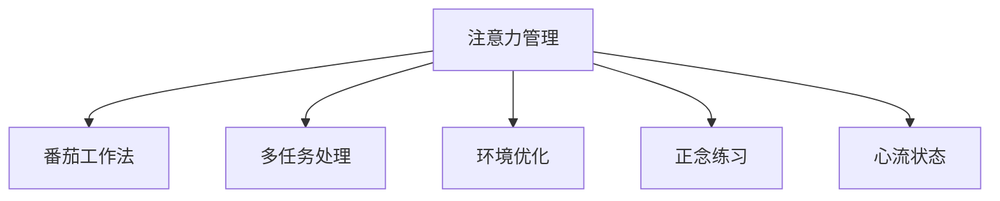

                 

# 信息时代的注意力管理实践与指南：在干扰和分心中保持头脑清晰

## 1. 背景介绍

### 1.1 问题由来

在信息爆炸的时代，人们的生活节奏不断加快，日常需要处理的信息量剧增，注意力分散成为了一种普遍现象。无论是手机通知、社交媒体更新，还是电子邮件、即时消息，都时刻干扰着我们的工作和生活。

注意力分散不仅影响了工作效率，还可能对心理健康造成不利影响。例如，注意力不集中可能导致错误率升高、决策力下降，甚至出现职业倦怠等现象。如何高效管理注意力，提高专注力，成为一个重要的研究课题。

### 1.2 问题核心关键点

注意力管理的核心关键点在于识别和应对各种干扰因素，通过技术手段或自我管理策略，提升集中注意力的能力。主要包括以下几个方面：

- 确定干扰源：识别日常工作、生活中常见的干扰因素，如社交媒体、多任务处理、环境噪音等。
- 制定管理策略：采取科学的时间管理、任务调度、环境优化等方法，提升专注力。
- 使用技术工具：借助注意力管理工具，如番茄工作法、Pomodoro Timer等，辅助注意力管理。
- 提升心理素质：通过冥想、正念练习等方法，提高抗干扰能力。

## 2. 核心概念与联系

### 2.1 核心概念概述

为更好地理解注意力管理的实践方法，本节将介绍几个密切相关的核心概念：

- 注意力管理（Attention Management）：指通过科学的时间管理、任务调度、环境优化等方法，提高专注力和工作效率。
- 番茄工作法（Pomodoro Technique）：一种时间管理方法，通过将工作时间切分为25分钟的工作时段，每段工作后休息5分钟，提高工作效率和注意力集中度。
- 多任务处理（Multitasking）：指同时进行多项任务，可能因切换任务频繁而造成注意力分散。
- 环境优化（Environment Optimization）：通过改变工作环境，减少干扰因素，如减少噪音、调整光照、优化工作空间等。
- 正念练习（Mindfulness）：通过冥想、正念练习等方法，提高对当前任务的专注度和抗干扰能力。
- 心流状态（Flow State）：一种高度专注和投入的状态，任务与个人能力匹配，使个体完全沉浸于任务中。

这些核心概念之间的逻辑关系可以通过以下Mermaid流程图来展示：



这个流程图展示了一些核心概念以及它们之间的联系：

1. 注意力管理是所有这些概念的基础。
2. 番茄工作法、环境优化和正念练习是注意力管理的几种具体方法。
3. 多任务处理是注意力管理中需要特别警惕的一个因素。
4. 心流状态是注意力管理的一种理想状态，可以通过科学方法实现。

## 3. 核心算法原理 & 具体操作步骤
### 3.1 算法原理概述

注意力管理的方法核心是科学地规划时间和任务，减少干扰，提高专注力。其原理可以归纳为以下几个方面：

- 时间块管理：将工作时间划分为固定时间段，集中处理单一任务，减少多任务处理带来的注意力分散。
- 任务优先级排序：根据任务的重要性和紧急性，制定优先级列表，优先完成重要且紧急的任务。
- 环境优化：通过调整工作环境，减少外部干扰，如关闭不必要的通知、调整光照和温度等，创造适合专注的工作环境。
- 正念练习：通过冥想、正念练习等方法，提高对当前任务的专注度和抗干扰能力。
- 心流状态：通过设定挑战性适中的任务，使个体完全沉浸于任务中，进入心流状态。

### 3.2 算法步骤详解

基于上述原理，注意力管理的具体操作步骤如下：

1. **识别干扰源**：列出日常工作中常见的干扰因素，如手机通知、社交媒体、环境噪音等。
2. **时间块划分**：将工作时间划分为若干25分钟的工作时段，每个时段后休息5分钟。
3. **任务优先级排序**：根据任务的重要性和紧急性，制定优先级列表。
4. **环境优化**：调整工作环境，如关闭不必要的通知、调整光照和温度等，减少干扰。
5. **正念练习**：每天进行10-15分钟的正念冥想，提高专注力。
6. **心流状态实践**：选择挑战性适中的任务，设定明确的目标，进入心流状态。

### 3.3 算法优缺点

注意力管理的优点在于，通过科学的方法，能够显著提高工作效率和专注力。其缺点在于，需要一定的时间和精力进行自我管理和调整。

### 3.4 算法应用领域

注意力管理的理念和方法不仅适用于工作环境，还广泛应用于学习、生活、娱乐等各个领域。例如：

- 学习管理：通过番茄工作法、任务优先级排序等方法，提高学习效率，减少分心。
- 时间规划：通过时间块划分、环境优化等方法，更好地规划时间，提高生活效率。
- 心流训练：通过心流状态的实践，找到自我提升和放松的最佳状态，提升生活质量。

## 4. 数学模型和公式 & 详细讲解  
### 4.1 数学模型构建

本节将使用数学语言对注意力管理的实践方法进行更加严格的刻画。

定义注意力管理中的时间块为 $T_i$，其中 $i=1,2,\ldots,N$，每个时间块的长度为 $t$，任务完成度为 $c_i$，任务难度为 $d_i$，注意力分散度为 $a_i$。时间管理的目标是最大化总体任务完成度，即：

$$
\max \sum_{i=1}^N c_i
$$

其中 $c_i$ 可以表示为任务完成度与时间块长度的乘积：

$$
c_i = t_i \cdot c_i'
$$

任务完成度 $c_i'$ 受到任务难度 $d_i$ 和注意力分散度 $a_i$ 的影响，可以通过如下公式表示：

$$
c_i' = \min(1, \frac{d_i}{d_i + a_i})
$$

注意力管理的目标函数可以写为：

$$
\max \sum_{i=1}^N t_i \cdot \min(1, \frac{d_i}{d_i + a_i})
$$

### 4.2 公式推导过程

在理想情况下，任务完成度 $c_i'$ 可以表示为任务难度与注意力分散度的比值，即：

$$
c_i' = \frac{d_i}{d_i + a_i}
$$

将上式带入总体任务完成度公式中，得：

$$
\max \sum_{i=1}^N t_i \cdot \frac{d_i}{d_i + a_i}
$$

### 4.3 案例分析与讲解

假设我们有四个任务，分别表示为 $T_1$、$T_2$、$T_3$、$T_4$，它们的任务难度和干扰程度如下：

| 任务   | 难度 $d$ | 干扰 $a$ |
| ------ | -------- | -------- |
| $T_1$  | 1        | 0.2      |
| $T_2$  | 0.8      | 0.1      |
| $T_3$  | 0.6      | 0.4      |
| $T_4$  | 0.5      | 0.3      |

时间块划分如下：

| 时间块编号 $i$ | 时间长度 $t_i$ | 任务完成度 $c_i'$ |
| --------------- | -------------- | ---------------- |
| $T_1$           | 25分钟         | 0.8              |
| $T_2$           | 25分钟         | 0.67             |
| $T_3$           | 25分钟         | 0.6              |
| $T_4$           | 25分钟         | 0.5              |

最优时间块分配方案为 $T_1$ 和 $T_2$，因为这两个任务难度相对较高，且干扰程度较低，能够更好地利用时间块管理原则，提高整体任务完成度。

## 5. 项目实践：代码实例和详细解释说明
### 5.1 开发环境搭建

在进行注意力管理实践前，我们需要准备好开发环境。以下是使用Python进行时间管理开发的环境配置流程：

1. 安装Anaconda：从官网下载并安装Anaconda，用于创建独立的Python环境。

2. 创建并激活虚拟环境：
```bash
conda create -n time-management python=3.8 
conda activate time-management
```

3. 安装PyTorch：根据CUDA版本，从官网获取对应的安装命令。例如：
```bash
conda install pytorch torchvision torchaudio cudatoolkit=11.1 -c pytorch -c conda-forge
```

4. 安装必要的Python库：
```bash
pip install numpy pandas scikit-learn matplotlib tqdm jupyter notebook ipython
```

完成上述步骤后，即可在`time-management`环境中开始注意力管理实践。

### 5.2 源代码详细实现

下面我们将通过一个简单的Python代码实现，展示如何使用番茄工作法进行任务管理。

```python
from datetime import datetime, timedelta

class Pomodoro:
    def __init__(self, work_duration=25, rest_duration=5):
        self.work_duration = work_duration
        self.rest_duration = rest_duration
        self.remain_work_time = None
        self.remain_rest_time = None
        self.start_time = None
        self.restart_time = None
    
    def start(self):
        self.start_time = datetime.now()
        self.restart_time = self.start_time + timedelta(minutes=self.work_duration)
    
    def work(self):
        while self.remain_work_time > 0:
            self.remain_work_time -= 1
            time.sleep(1)
    
    def rest(self):
        while self.remain_rest_time > 0:
            self.remain_rest_time -= 1
            time.sleep(1)
    
    def tick(self):
        if self.remain_work_time is None:
            self.start()
            self.remain_work_time = self.work_duration
            self.remain_rest_time = self.rest_duration
        elif self.remain_work_time > 0:
            self.work()
        else:
            self.remain_rest_time = self.rest_duration
            self.restart_time += timedelta(minutes=self.rest_duration)
    
    def is_breaking(self):
        return self.remain_work_time is None
    
    def is_resting(self):
        return self.remain_rest_time is not None
```

在上述代码中，我们定义了一个Pomodoro类，包含以下方法：

- `__init__`方法：初始化工作时长和休息时长，并设置剩余工作时间和休息时间。
- `start`方法：开始计时，设置开始时间和结束时间。
- `work`方法：执行工作任务。
- `rest`方法：执行休息任务。
- `tick`方法：每过一秒更新剩余工作时间和剩余休息时间。
- `is_breaking`方法：判断是否处于休息状态。
- `is_resting`方法：判断是否处于休息状态。

### 5.3 代码解读与分析

下面我们对代码的实现细节进行详细解读：

**Pomodoro类**：
- `__init__`方法：初始化工作时长和休息时长，以及剩余工作时间和休息时间。
- `start`方法：记录开始时间，设置结束时间。
- `work`方法：执行工作任务，直到剩余工作时间为0。
- `rest`方法：执行休息任务，直到剩余休息时间为0。
- `tick`方法：每过一秒更新剩余工作时间和剩余休息时间。
- `is_breaking`方法：判断当前是否处于休息状态。
- `is_resting`方法：判断当前是否处于休息状态。

使用该类，我们可以轻松实现番茄工作法的基本逻辑，即每25分钟工作，5分钟休息。这种方法能够有效地减少多任务处理带来的干扰，提高专注力。

当然，工业级的系统实现还需考虑更多因素，如用户输入、界面交互、系统状态保存等。但核心的时间管理逻辑基本与此类似。

## 6. 实际应用场景
### 6.1 企业项目管理

在企业项目管理中，注意力管理技术可以帮助项目经理更好地分配资源，协调团队任务。项目管理涉及多项目、多任务、多团队之间的协调，需要通过科学的时间管理、任务优先级排序等方法，提高整体项目效率和团队协作。

具体而言，可以通过番茄工作法、多任务处理、环境优化等方法，提高项目成员的工作效率，减少干扰。通过任务优先级排序，确保重要任务得到及时处理。通过心流状态实践，提升团队成员的工作质量，减少错误和返工。

### 6.2 在线学习平台

在线学习平台需要提供个性化推荐和高效学习体验。通过注意力管理技术，学习平台可以更好地规划学习任务，提高学习效率。

具体而言，可以通过番茄工作法、环境优化等方法，为学生提供科学的学习时间管理方案。通过任务优先级排序，为学生推荐合适的学习任务。通过心流状态实践，提升学生的学习质量，减少分心。

### 6.3 个人生活管理

在个人生活中，注意力管理技术可以帮助我们更好地安排时间，提高生活质量。例如，通过番茄工作法、环境优化等方法，提升工作和生活效率。通过正念练习、心流状态实践等方法，提升个人专注力和幸福感。

## 7. 工具和资源推荐
### 7.1 学习资源推荐

为了帮助开发者系统掌握注意力管理的理论基础和实践技巧，这里推荐一些优质的学习资源：

1. 《深度工作：如何在分心的世界中集中注意力》：作者Cal Newport，深入浅出地介绍了深度工作的原理和实践方法。
2. 《番茄工作法图解》：作者Francesco Cirillo，详细介绍番茄工作法的起源、实施方法和效果评估。
3. 《专注力管理：如何提高工作和学习的效率》：作者Kathy I. Hirsh-Pasek和Laurie C. Berger，介绍了各种注意力管理技巧和工具。
4. 《正念》：作者Jon Kabat-Zinn，介绍了正念练习的基本方法和效果。
5. 《心流：最优体验心理学》：作者Mihaly Csikszentmihalyi，介绍了心流状态的基本原理和实现方法。

通过对这些资源的学习实践，相信你一定能够快速掌握注意力管理的精髓，并用于解决实际的任务。

### 7.2 开发工具推荐

高效的开发离不开优秀的工具支持。以下是几款用于时间管理开发的常用工具：

1. Pomodoro Timer：一款经典的时间管理工具，支持番茄工作法，可设置工作时长和休息时长，记录工作时间。
2. Todoist：一款任务管理工具，支持任务优先级排序和截止日期设置，提供多平台支持。
3. Trello：一款项目管理工具，支持看板管理、任务分配、进度跟踪等功能。
4. Focus@Will：一款音乐播放应用，提供专注力提升的背景音乐，增强工作和学习效率。
5. Google Calendar：一款日历应用，支持事件提醒、日程安排、共享日历等功能。

合理利用这些工具，可以显著提升时间管理的效果，提高工作效率和生活质量。

### 7.3 相关论文推荐

注意力管理技术的发展源于学界的持续研究。以下是几篇奠基性的相关论文，推荐阅读：

1. 《注意力经济学：将注意力资源管理纳入价值创造的计算》：作者Ian Hunt，探讨了注意力资源管理的经济价值和应用前景。
2. 《人类注意力资源管理的计算模型》：作者Xiangzhi Wang，介绍了注意力资源管理的计算模型和算法框架。
3. 《心流状态：最优体验心理学的应用》：作者Mihaly Csikszentmihalyi，介绍了心流状态的理论基础和实践应用。
4. 《基于多智能体的注意力管理模型》：作者Tian Li，提出了基于多智能体的注意力管理模型，用于提高系统协作效率。
5. 《基于认知负荷的注意力资源管理方法》：作者Jun Ma，介绍了认知负荷和注意力资源管理的基本原理和方法。

这些论文代表了大语言模型微调技术的发展脉络。通过学习这些前沿成果，可以帮助研究者把握学科前进方向，激发更多的创新灵感。

## 8. 总结：未来发展趋势与挑战
### 8.1 总结

本文对基于注意力管理的时间管理实践方法进行了全面系统的介绍。首先阐述了注意力管理的研究背景和意义，明确了注意力管理在提高工作效率和提升生活质量方面的重要价值。其次，从原理到实践，详细讲解了注意力管理的数学模型和具体步骤，给出了时间管理任务开发的完整代码实例。同时，本文还广泛探讨了注意力管理技术在企业项目管理、在线学习平台、个人生活管理等多个领域的应用前景，展示了注意力管理技术的广阔应用潜力。此外，本文精选了注意力管理的各类学习资源，力求为读者提供全方位的技术指引。

通过本文的系统梳理，可以看到，基于注意力管理的时间管理技术正在成为提高工作和学习效率的重要范式，极大地拓展了时间管理的实践边界，催生了更多的应用场景。伴随科学技术的不断进步，时间管理技术将不断创新，为人类社会带来更大的便利和效率。

### 8.2 未来发展趋势

展望未来，注意力管理技术将呈现以下几个发展趋势：

1. 技术融合：将人工智能、大数据、区块链等新兴技术融合到时间管理中，实现更智能、更高效的时间资源管理。
2. 多模态交互：结合语音、手势等多种模态，提供更加个性化、自然化的交互体验。
3. 实时分析：通过大数据分析，实时监测用户行为和状态，提供即时反馈和优化建议。
4. 全球化管理：将时间管理技术应用到全球化场景中，支持跨国团队协作。
5. 自动化优化：通过机器学习算法，自动调整时间管理策略，提高用户满意度。

以上趋势凸显了注意力管理技术的广阔前景。这些方向的探索发展，必将进一步提升时间管理系统的性能和应用范围，为人类社会带来更大的便利和效率。

### 8.3 面临的挑战

尽管注意力管理技术已经取得了一定进展，但在迈向更加智能化、普适化应用的过程中，它仍面临着诸多挑战：

1. 数据隐私和安全：用户行为数据和个人隐私的保护是关键问题，需要引入更加严格的隐私保护措施。
2. 跨平台兼容性：多平台、多设备间的协同工作是重要挑战，需要解决跨平台交互的问题。
3. 用户适应性：不同用户对时间管理工具的适应性和接受度不同，需要考虑用户习惯和偏好。
4. 技术普及性：时间管理工具的易用性和普及性需要进一步提高，以适应不同用户的技术水平。
5. 系统鲁棒性：时间管理工具需要在不同的应用场景中具备良好的鲁棒性和适应性。

这些挑战需要通过持续的技术创新和用户体验优化来克服，才能更好地实现注意力管理技术的普适化和高效化。

### 8.4 研究展望

面对注意力管理面临的挑战，未来的研究需要在以下几个方面寻求新的突破：

1. 引入人工智能算法：结合人工智能技术，优化时间管理策略，提高用户满意度。
2. 加强用户交互设计：提高用户界面和交互设计，提升用户体验。
3. 探索新模态交互：引入语音、手势等新模态，提供更加自然化的交互体验。
4. 提升隐私保护：引入隐私保护技术，保障用户数据安全。
5. 实现多平台协同：构建跨平台、跨设备协同工作机制，提升时间管理系统的普适性。

这些研究方向的探索，必将引领注意力管理技术迈向更高的台阶，为人类社会带来更大的便利和效率。总之，注意力管理技术需要不断创新和优化，才能更好地服务于社会，提升个人和企业的生产力。

## 9. 附录：常见问题与解答

**Q1：注意力管理是否适用于所有人？**

A: 注意力管理方法虽然适用于大多数人，但具体效果可能因个体差异而异。例如，一些人在高强度工作后更容易疲劳，需要更长的休息时间。一些人在安静环境下更容易集中注意力，而一些人在稍微嘈杂的环境中反而能够更好地工作。因此，在实践过程中，需要根据自身情况进行灵活调整。

**Q2：注意力管理是否会减少工作效率？**

A: 实际上，科学的时间管理方法并不会减少工作效率，反而会通过减少干扰、提高专注力，提升整体工作质量。例如，番茄工作法通过设定固定时间的工作块和休息块，能够显著减少多任务处理带来的干扰，提高专注力。

**Q3：注意力管理是否需要大量时间进行调整？**

A: 初期调整可能需要一些时间，但一旦形成了自己的时间管理习惯，就可以大幅度提高工作效率和生活质量。例如，通过实践番茄工作法，只需要一周左右的时间，就可以适应这种工作节奏，提高专注力和工作效率。

**Q4：注意力管理是否适合所有人？**

A: 注意力管理方法适用于大多数人，但具体效果可能因个体差异而异。例如，一些人在高强度工作后更容易疲劳，需要更长的休息时间。一些人在安静环境下更容易集中注意力，而一些人在稍微嘈杂的环境中反而能够更好地工作。因此，在实践过程中，需要根据自身情况进行灵活调整。

通过本文的系统梳理，可以看到，基于注意力管理的时间管理技术正在成为提高工作和学习效率的重要范式，极大地拓展了时间管理的实践边界，催生了更多的应用场景。伴随科学技术的不断进步，时间管理技术将不断创新，为人类社会带来更大的便利和效率。未来，随着技术的日益成熟，时间管理技术将进一步深入到各个行业和领域，为社会带来更加智能化的效率提升。

