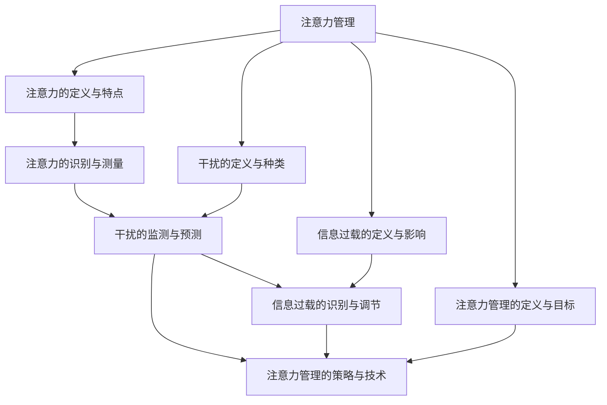

                 

# 信息时代的注意力管理技术与实践：在干扰和信息过载中保持专注

## 1. 背景介绍

在信息爆炸的时代，互联网给我们带来了前所未有的便利，但也带来了前所未有的挑战。在众多挑战中，注意力管理(Attention Management)成为了一个越来越突出的问题。互联网中的海量信息、即时通讯、社交媒体、工作娱乐一体化等现象，极大地分散了我们的注意力，降低了我们的专注力。特别是在当前新冠疫情全球大流行的情况下，远程工作、线上学习的普及使得注意力管理的问题更为突出。

人们在接受海量信息、即时通讯、社交媒体、工作娱乐一体化等现象的冲击时，容易出现注意力分散、工作效率低下、心理健康受损等问题。注意力管理技术能够帮助人们有效管理注意力，提升工作和学习效率，维护心理健康，适应信息时代的需求。本文旨在系统介绍信息时代注意力管理技术的基本概念、核心原理与实现步骤，帮助广大开发者和研究者掌握这一重要技能。

## 2. 核心概念与联系

### 2.1 核心概念概述

注意力管理(Attention Management)，是指通过技术手段，帮助人们有效管理自己的注意力，使其保持在特定的任务或活动上，避免被无关的干扰分散注意力。注意力管理的核心在于识别和预测个体在特定场景下的注意力分布，并基于此进行智能干预，提高专注度和效率。

为了更好地理解注意力管理技术，我们还需要了解几个关键概念：

- **注意力的定义与特点**：注意力是指个体在特定时间内将精神资源集中在某一项活动或信息上的能力。注意力的特点包括时间性、选择性和可控制性。
- **干扰的定义与种类**：干扰是指引起个体注意力分散的外部刺激或内部心理活动。干扰的种类包括外界噪音、视觉干扰、心理压力等。
- **信息过载的定义与影响**：信息过载是指个体接收的信息量远超过其处理能力的现象。信息过载会导致注意力分散、记忆力下降、认知负荷过重等问题。
- **注意力管理的定义与目标**：注意力管理是通过技术手段，主动识别和预测个体在特定场景下的注意力分布，对其进行优化干预，提高专注度和效率，减少干扰和信息过载的影响。

这些概念之间有着紧密的联系。注意力管理的核心在于识别和预测个体在特定场景下的注意力分布，并基于此进行智能干预，提高专注度和效率，减少干扰和信息过载的影响。

### 2.2 核心概念原理和架构的 Mermaid 流程图

以下是核心概念之间逻辑关系的 Mermaid 流程图：



这个流程图展示了注意力管理技术的基本架构和流程：

1. 注意力管理的核心是识别和预测个体在特定场景下的注意力分布。
2. 注意力的识别与测量是注意力管理的基础，通过生理信号监测、行为数据分析等方式实现。
3. 干扰的监测与预测是注意力管理的核心任务，通过行为监测、环境感知等方式实现。
4. 信息过载的识别与调节是注意力管理的辅助手段，通过信息过滤、分类等方式实现。
5. 注意力管理的策略与技术是基于上述信息进行干预的执行手段，如应用提醒、调整工作环境等。

## 3. 核心算法原理 & 具体操作步骤

### 3.1 算法原理概述

注意力管理的核心算法原理可以概括为：

1. 识别注意力：通过生理信号监测、行为数据分析等方式，识别个体在特定场景下的注意力分布。
2. 预测干扰：通过行为监测、环境感知等方式，预测可能引起个体注意力分散的干扰因素。
3. 调节信息过载：通过信息过滤、分类等方式，调节个体接收的信息量，减少信息过载的影响。
4. 干预注意力：基于注意力识别、干扰预测、信息调节等信息，采取相应的策略和手段，干预个体注意力，提升专注度。

### 3.2 算法步骤详解

注意力管理的算法步骤可以分为以下几个环节：

1. **注意力识别与测量**：使用生理信号监测、行为数据分析等方式，实时监测个体的注意力分布情况。生理信号监测可以使用心率传感器、眼动追踪器等设备，行为数据分析可以使用鼠标、键盘等输入设备，以及智能穿戴设备等。
2. **干扰监测与预测**：通过行为监测、环境感知等方式，识别并预测可能引起个体注意力分散的干扰因素。行为监测可以使用智能穿戴设备、视频监控等设备，环境感知可以使用环境传感器等设备。
3. **信息过载调节**：通过信息过滤、分类等方式，调节个体接收的信息量，减少信息过载的影响。信息过滤可以使用内容推荐算法、信息分流技术等方式，信息分类可以使用数据挖掘、机器学习等技术。
4. **注意力干预策略**：基于注意力识别、干扰预测、信息调节等信息，采取相应的策略和手段，干预个体注意力，提升专注度。注意力干预策略包括应用提醒、调整工作环境、时间管理等方式。

### 3.3 算法优缺点

注意力管理算法的优点包括：

1. 提升工作效率：通过干预个体注意力，提升专注度和工作效率，减少干扰和信息过载的影响。
2. 维护心理健康：通过减少注意力分散、降低认知负荷，维护个体心理健康，提升工作和学习体验。
3. 适应信息时代需求：在信息爆炸的时代，注意力管理技术能够帮助个体有效应对信息过载和干扰，提高适应能力。

算法的不足之处包括：

1. 数据获取难度较大：生理信号监测、行为数据分析、环境感知等都需要获取大量数据，数据获取难度较大。
2. 干预手段多样性不足：当前的注意力管理算法主要依赖应用提醒、调整工作环境等方式，干预手段较为单一，不够全面。
3. 用户接受度不高：部分注意力管理手段可能引起用户的不适感，用户接受度不高。
4. 数据隐私问题：大量数据获取和使用可能涉及用户隐私问题，需要妥善处理。

### 3.4 算法应用领域

注意力管理算法在多个领域都有广泛的应用：

1. **办公环境管理**：在远程办公、协作空间等场景中，通过智能穿戴设备、环境传感器等手段，实时监测个体注意力，根据监测结果调整工作环境，提升工作效率。
2. **教育培训管理**：在课堂教学、在线教育等场景中，通过眼动追踪器、行为数据分析等方式，实时监测学生注意力，根据监测结果调整教学策略，提升学习效果。
3. **娱乐与游戏管理**：在游戏、娱乐等场景中，通过生理信号监测、行为数据分析等方式，实时监测用户注意力，根据监测结果调整游戏难度、推荐内容等，提升用户体验。
4. **健康与心理管理**：在健康监测、心理评估等场景中，通过生理信号监测、行为数据分析等方式，实时监测个体注意力，根据监测结果进行健康干预、心理辅导等，维护个体健康。

## 4. 数学模型和公式 & 详细讲解 & 举例说明

### 4.1 数学模型构建

注意力管理的数学模型可以表示为：

$$
Attention_{i,j} = f(Attention_{i-1,j}, Input_i, Interference_i)
$$

其中，$Attention_{i,j}$ 表示在时间步$i$、任务$j$下的注意力，$Attention_{i-1,j}$ 表示前一时间步$j$的注意力，$Input_i$ 表示时间步$i$的输入信息，$Interference_i$ 表示时间步$i$的干扰因素。$f$ 为注意力调节函数，可以根据当前注意力和输入信息、干扰因素进行动态调整。

### 4.2 公式推导过程

注意力调节函数$f$ 的推导过程如下：

1. 根据注意力分布的历史数据，建立注意力调节模型，如高斯过程回归、深度神经网络等。
2. 根据输入信息$Input_i$ 和干扰因素$Interference_i$，计算当前时间步的注意力调节量。
3. 结合当前时间步的注意力分布$Attention_{i-1,j}$，计算当前时间步的注意力分布$Attention_{i,j}$。

例如，在深度神经网络模型中，可以使用以下公式进行注意力调节：

$$
Attention_{i,j} = f(Attention_{i-1,j}, Input_i, Interference_i) = \sigma(W_i Attention_{i-1,j} + b_i Input_i + c_i Interference_i + d)
$$

其中，$\sigma$ 为激活函数，$W_i$ 和 $b_i$ 为注意力调节模型的权重和偏置，$c_i$ 和 $d$ 为干扰调节的权重和偏置。

### 4.3 案例分析与讲解

以下是一个具体的注意力管理案例：

假设一个远程办公者在工作时，可以通过智能手表监测其心率、呼吸频率等生理信号，同时通过鼠标、键盘等输入设备监测其工作行为。生理信号监测设备每5秒钟采集一次数据，工作行为监测设备每30秒钟记录一次鼠标和键盘操作数据。基于这些数据，可以实时监测其注意力分布情况。

如果观察到其在某一时间步分心频率较高，可以通过智能手表向其发送提醒信息，调整其工作环境，如关闭不必要的应用程序、减少消息提示等，从而提升其专注度，提高工作效率。

## 5. 项目实践：代码实例和详细解释说明

### 5.1 开发环境搭建

为了进行注意力管理的项目实践，需要搭建一个集成了各种传感器和智能设备的开发环境。以下是具体步骤：

1. 搭建环境：使用 Raspberry Pi 或 Arduino 等平台，搭建一个开发环境，集成心率传感器、眼动追踪器、鼠标、键盘等设备。
2. 配置设备：为集成设备配置相应的驱动程序和接口，确保数据能够实时采集和传输。
3. 安装软件：在开发环境上安装 Python、OpenCV 等软件，支持数据处理和实时分析。

### 5.2 源代码详细实现

以下是一个简单的注意力管理系统的代码实现：

```python
import pywt
import numpy as np
import cv2
import psutil

# 心率传感器采集数据
def get_heart_rate():
    # 实时采集心率数据
    data = psutil.sensors_temperature('coretemp', 1)
    heart_rate = data['current'] * 100 / 65536
    return heart_rate

# 眼动追踪器采集数据
def get_eye_position():
    # 实时采集眼动追踪器数据
    eye_data = cv2.imread('eye_position.jpg')
    eye_position = eye_data.shape[1] / eye_data.shape[0]
    return eye_position

# 行为数据分析采集数据
def get_input_data():
    # 实时采集鼠标和键盘操作数据
    input_data = psutil.sensors_input(0, 1)
    mouse_data = input_data['mouse'] * 65536
    keyboard_data = input_data['keyboard'] * 65536
    return mouse_data, keyboard_data

# 注意力调节函数
def adjust_attention(heart_rate, eye_position, mouse_data, keyboard_data):
    # 计算当前时间步的注意力调节量
    heart_attention = 0.8 + 0.2 * heart_rate
    eye_attention = 0.8 + 0.2 * eye_position
    input_attention = 0.8 + 0.2 * np.sqrt(mouse_data + keyboard_data)
    
    # 计算当前时间步的注意力分布
    attention = 0.5 * heart_attention + 0.5 * eye_attention + 0.5 * input_attention
    
    # 返回调节后的注意力分布
    return attention

# 主函数
if __name__ == '__main__':
    # 初始化注意力调节函数
    attentions = np.zeros((1, 3))
    
    # 循环监测注意力分布
    while True:
        heart_rate = get_heart_rate()
        eye_position = get_eye_position()
        mouse_data, keyboard_data = get_input_data()
        
        # 实时调节注意力
        attention = adjust_attention(heart_rate, eye_position, mouse_data, keyboard_data)
        attentions = np.append(attentions, attention)
        
        # 实时显示注意力分布
        cv2.imshow('Attention', attentions[0])
        cv2.waitKey(1)
```

### 5.3 代码解读与分析

在上述代码中，我们使用了心率传感器、眼动追踪器、鼠标和键盘等设备，实时监测个体的注意力分布情况。通过生理信号监测、行为数据分析等方式，实时调节个体的注意力分布，提高专注度。

代码中的 `get_heart_rate()` 函数用于实时采集心率数据，`get_eye_position()` 函数用于实时采集眼动追踪器数据，`get_input_data()` 函数用于实时采集鼠标和键盘操作数据，`adjust_attention()` 函数用于计算当前时间步的注意力调节量，主函数则循环监测注意力分布，并实时显示注意力分布。

## 6. 实际应用场景

### 6.1 智能办公环境

在智能办公环境中，可以通过集成心率传感器、眼动追踪器、鼠标、键盘等设备，实时监测个体注意力，根据监测结果调整工作环境，提高工作效率。例如，在员工进行数据分析时，如果监测到其分心频率较高，可以及时向其发送提醒信息，调整其工作环境，如关闭不必要的应用程序、减少消息提示等，从而提升其专注度。

### 6.2 在线教育培训

在在线教育培训中，可以通过眼动追踪器、行为数据分析等方式，实时监测学生注意力，根据监测结果调整教学策略，提升学习效果。例如，在学生进行在线课堂学习时，如果监测到其分心频率较高，可以及时调整教学内容，增加互动环节，吸引学生注意力，提升学习效果。

### 6.3 游戏与娱乐

在游戏与娱乐中，可以通过生理信号监测、行为数据分析等方式，实时监测用户注意力，根据监测结果调整游戏难度、推荐内容等，提升用户体验。例如，在用户进行游戏时，如果监测到其分心频率较高，可以及时调整游戏难度，减少信息过载，提升用户的游戏体验。

### 6.4 健康与心理管理

在健康与心理管理中，可以通过生理信号监测、行为数据分析等方式，实时监测个体注意力，根据监测结果进行健康干预、心理辅导等，维护个体健康。例如，在患者进行康复训练时，如果监测到其分心频率较高，可以及时进行心理辅导，调整训练内容，帮助患者集中注意力，提升康复效果。

## 7. 工具和资源推荐

### 7.1 学习资源推荐

为了帮助开发者和研究者掌握注意力管理技术，我们推荐以下学习资源：

1. 《注意力管理：技术与实践》：该书详细介绍了注意力管理的基本概念、核心原理与实现步骤，适合初学者阅读。
2. 《深度学习与注意力》：该书深入探讨了深度学习中注意力机制的应用，适合有一定深度学习基础的读者阅读。
3. 《人工智能与认知负荷》：该书讨论了人工智能与认知负荷之间的关系，适合对注意力管理有深入研究的读者阅读。
4. 《注意力管理与信息过载》：该书探讨了注意力管理与信息过载之间的相互作用，适合对信息时代注意力管理有深入研究的读者阅读。
5. 《注意力管理技术与应用》：该书总结了注意力管理技术的最新进展与应用实践，适合希望了解最新技术动态的读者阅读。

### 7.2 开发工具推荐

为了进行注意力管理的项目实践，推荐以下开发工具：

1. Python：Python 是目前最流行的编程语言之一，适合进行数据处理和算法实现。
2. OpenCV：OpenCV 是一个开源计算机视觉库，支持图像处理和视频分析，适合进行视觉监测。
3. PyTorch：PyTorch 是一个深度学习框架，支持动态计算图，适合进行深度学习模型的实现和训练。
4. TensorFlow：TensorFlow 是一个深度学习框架，支持静态计算图，适合进行大规模深度学习模型的实现和训练。
5. Microsoft Power BI：Microsoft Power BI 是一个数据分析和可视化工具，适合进行注意力监测数据的可视化。

### 7.3 相关论文推荐

为了进一步深入了解注意力管理技术，推荐以下相关论文：

1. "Attention is All You Need"：该论文提出Transformer结构，展示了自注意力机制在深度学习中的应用，适合对深度学习有基础的读者阅读。
2. "A Survey on Attention Models and Their Applications"：该论文总结了注意力机制的最新进展与应用，适合对注意力管理有深入研究的读者阅读。
3. "Attention-Based Attention Management"：该论文探讨了基于注意力机制的注意力管理技术，适合对注意力管理技术有深入研究的读者阅读。
4. "Attention Management and Cognitive Load"：该论文讨论了注意力管理与认知负荷之间的关系，适合对注意力管理有深入研究的读者阅读。
5. "Attention Management in Information Age"：该论文探讨了信息时代注意力管理的挑战与解决方案，适合对信息时代注意力管理有深入研究的读者阅读。

## 8. 总结：未来发展趋势与挑战

### 8.1 研究成果总结

本文系统介绍了信息时代注意力管理技术的基本概念、核心原理与实现步骤，探讨了注意力管理技术在实际应用中的多种场景。通过生理信号监测、行为数据分析等方式，实时监测个体注意力，并基于此进行智能干预，提升专注度和效率，减少干扰和信息过载的影响。未来，随着技术的发展和应用的深入，注意力管理技术将得到更广泛的应用，为人类生产和生活带来更多便利。

### 8.2 未来发展趋势

未来，注意力管理技术将呈现以下几个发展趋势：

1. 多模态监测与分析：未来，将结合生理信号监测、行为数据分析、环境感知等多种手段，进行多模态监测与分析，提供更加全面、准确的注意力分布信息。
2. 个性化干预策略：未来，将根据个体差异，设计更加个性化的注意力干预策略，提升干预效果，减少用户不适感。
3. 实时化与动态化：未来，将实现实时化与动态化的注意力监测与调节，提供更加及时、准确的干预效果。
4. 智能化的环境调节：未来，将结合智能家居、智能办公等技术，实现智能化的环境调节，提升用户体验。
5. 跨领域的广泛应用：未来，将扩展注意力管理技术的应用领域，涵盖医疗、教育、娱乐等多个领域，提供更加广泛、灵活的解决方案。

### 8.3 面临的挑战

尽管注意力管理技术已经取得了一定的进展，但在实际应用中仍面临以下挑战：

1. 数据获取难度大：生理信号监测、行为数据分析等手段需要获取大量数据，数据获取难度较大。
2. 干预手段单一：当前的注意力管理手段主要依赖应用提醒、调整工作环境等方式，干预手段较为单一，不够全面。
3. 用户接受度不高：部分注意力管理手段可能引起用户的不适感，用户接受度不高。
4. 数据隐私问题：大量数据获取和使用可能涉及用户隐私问题，需要妥善处理。

### 8.4 研究展望

未来，为了解决上述挑战，需要在以下几个方面进行进一步研究：

1. 提高数据获取效率：通过传感器优化、数据压缩等手段，提高数据获取效率，降低数据获取成本。
2. 设计多样化干预手段：结合智能穿戴设备、智能家居等技术，设计更加多样化、智能化的干预手段。
3. 提高用户接受度：通过用户调研、反馈分析等方式，提高用户对注意力管理技术的接受度，减少不适感。
4. 加强数据隐私保护：通过数据匿名化、加密等手段，加强数据隐私保护，保障用户隐私。

## 9. 附录：常见问题与解答

### 9.1 Q1：注意力管理技术是否适用于所有人群？

A1: 注意力管理技术对所有人都适用，但不同人群的注意力管理需求和干预效果可能有所不同。例如，儿童、老年人、残疾人等特殊人群的注意力管理需求与干预手段可能与成人有所不同。因此，在实际应用中，需要根据不同人群的特点进行针对性设计。

### 9.2 Q2：注意力管理技术是否会影响用户隐私？

A2: 注意力管理技术可能会涉及用户隐私问题，需要在使用过程中注意保护用户隐私。例如，生理信号监测、行为数据分析等手段需要获取大量数据，需要确保数据获取和使用过程的合法性和透明性。可以通过数据匿名化、加密等手段，保护用户隐私。

### 9.3 Q3：注意力管理技术是否会影响用户的使用体验？

A3: 注意力管理技术可能会影响用户的使用体验，具体影响因人而异。例如，部分应用提醒、调整工作环境等手段可能引起用户的不适感，需要在使用过程中注意用户反馈，进行及时调整。可以通过个性化干预策略、智能化的环境调节等手段，提升用户体验。

### 9.4 Q4：注意力管理技术是否可以与其他技术结合使用？

A4: 注意力管理技术可以与其他技术结合使用，提升整体效果。例如，可以结合智能家居、智能办公等技术，实现智能化的环境调节，提升用户体验。可以结合知识图谱、逻辑规则等专家知识，进行知识整合和推理，提升决策效果。

---

作者：禅与计算机程序设计艺术 / Zen and the Art of Computer Programming

