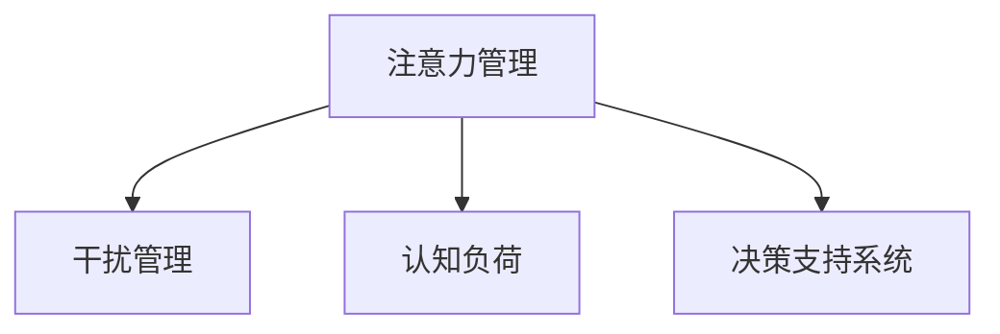

                 

# 信息时代的注意力管理技术与策略：在干扰和信息过载中保持头脑清晰

## 1. 背景介绍

### 1.1 问题由来

在信息爆炸的时代，我们每天都会面临海量的信息输入，从社交媒体到工作文档，从新闻推送到娱乐节目，我们几乎无处不在的信息洪流中。信息量的增加不仅带来了知识的丰富，也带来了注意力的挑战。注意力管理技术成为帮助我们有效过滤信息、提高生产效率的关键。

### 1.2 问题核心关键点

在现代社会，注意力管理的重要性愈发显著。有效的注意力管理可以：

- **提高专注力**：帮助个体在复杂的任务中保持专注，提升工作效率。
- **减少干扰**：通过技术手段减少外界干扰，提高工作质量。
- **优化决策**：辅助决策过程，通过系统化的数据管理提升决策质量。

面对信息过载，注意力管理技术显得尤为重要。本文将探讨几种关键的注意力管理技术与策略，帮助大家在信息纷繁的世界中保持头脑清晰。

### 1.3 问题研究意义

注意力管理技术的研发与实践，对于提升个人和组织的信息处理能力，优化工作流程，提高决策质量具有重要意义：

- **提升工作效率**：通过减少干扰，集中注意力，提升工作效率。
- **优化决策过程**：辅助决策，通过系统化数据分析，提高决策质量。
- **提高生活质量**：减少信息干扰，保护心理健康。
- **推动技术发展**：吸引更多的研究投入，推动人工智能、认知科学等领域的技术进步。

## 2. 核心概念与联系

### 2.1 核心概念概述

为更好地理解注意力管理技术的核心思想，本节将介绍几个核心概念：

- **注意力管理（Attention Management）**：指通过技术手段帮助个体或系统有效管理和分配注意力资源，提升信息处理效率。
- **干扰管理（Distraction Management）**：通过减少或屏蔽外界干扰，提高工作质量。
- **认知负荷（Cognitive Load）**：指在执行任务时，个体认知系统的负担量。
- **决策支持系统（Decision Support Systems, DSS）**：通过信息处理、数据分析等技术，辅助决策过程。

这些核心概念之间的逻辑关系可以通过以下Mermaid流程图来展示：



这个流程图展示了几大注意力管理核心概念及其相互关系：

1. 注意力管理通过技术手段有效管理和分配注意力资源。
2. 干扰管理减少外界干扰，提高工作质量。
3. 认知负荷衡量执行任务时的认知系统负担。
4. 决策支持系统辅助决策，通过信息处理和数据分析提高决策质量。

这些概念共同构成了注意力管理技术的理论基础，帮助我们在信息纷繁的世界中保持高效和专注。

## 3. 核心算法原理 & 具体操作步骤
### 3.1 算法原理概述

注意力管理技术的基本原理是通过技术手段优化注意力资源的分配，减少干扰，提升认知负荷管理，从而提高信息处理效率和决策质量。常见的注意力管理算法包括：

- **基于规则的注意力管理**：通过预设规则进行注意力分配和干扰屏蔽。
- **基于机器学习的注意力管理**：通过机器学习模型预测和优化注意力分配。
- **基于神经网络的注意力管理**：利用神经网络对注意力进行建模，实现自适应注意力管理。

### 3.2 算法步骤详解

以下是几种常见的注意力管理算法的详细步骤：

#### 3.2.1 基于规则的注意力管理

**步骤1：定义规则库**
- 定义一系列规则，用于描述注意力分配和干扰屏蔽策略。例如，在工作时间屏蔽社交媒体通知，在会议中关闭手机通知等。

**步骤2：任务分类**
- 将任务分为高、中、低认知负荷类别。例如，编写代码属于高认知负荷任务，阅读文档属于中认知负荷任务。

**步骤3：规则应用**
- 根据当前任务类型和用户状态，应用相应的规则进行注意力分配和干扰屏蔽。

**步骤4：规则评估**
- 定期评估规则的效果，根据反馈进行调整和优化。

#### 3.2.2 基于机器学习的注意力管理

**步骤1：数据收集**
- 收集用户在不同任务和环境下的注意力分配和干扰数据。例如，记录用户在不同时间段内使用的应用、邮件数量等。

**步骤2：特征工程**
- 提取有用的特征，如任务类型、时间、用户状态等。

**步骤3：模型训练**
- 使用机器学习算法（如随机森林、梯度提升树等）对数据进行训练，得到注意力管理模型。

**步骤4：模型应用**
- 将训练好的模型应用到新的数据中，实时调整注意力分配和干扰屏蔽策略。

**步骤5：模型评估**
- 使用交叉验证等方法评估模型效果，根据评估结果进行优化。

#### 3.2.3 基于神经网络的注意力管理

**步骤1：数据预处理**
- 将注意力数据进行预处理，提取时间戳、应用类型等特征。

**步骤2：模型构建**
- 使用神经网络（如RNN、LSTM等）构建注意力管理模型。

**步骤3：训练优化**
- 使用反向传播等方法对模型进行训练和优化。

**步骤4：模型应用**
- 将训练好的模型应用到实际注意力管理场景中，实时调整注意力分配和干扰屏蔽策略。

**步骤5：模型评估**
- 使用各种指标（如准确率、召回率等）评估模型效果，根据评估结果进行优化。

### 3.3 算法优缺点

**优点：**

1. **规则化与模型化**：基于规则的注意力管理可以快速实现，易于理解和调整；基于机器学习和神经网络的注意力管理具有更高的灵活性和适应性。
2. **减少干扰**：有效减少外界干扰，提升工作质量。
3. **辅助决策**：通过数据分析和模型预测，辅助决策过程，提高决策质量。

**缺点：**

1. **依赖数据质量**：所有注意力管理技术都依赖于数据质量，数据不充分或不准确可能导致管理效果不佳。
2. **过度依赖技术**：过度依赖技术手段，可能忽视了心理、环境等综合因素对注意力管理的影响。
3. **模型复杂度高**：基于机器学习和神经网络的注意力管理需要更复杂的数据处理和模型训练，对资源和技术要求较高。

### 3.4 算法应用领域

注意力管理技术在多个领域都有广泛的应用，例如：

- **办公室工作**：在办公室环境中，通过软件屏蔽不必要的通知，优化工作流程，提高工作效率。
- **远程工作**：在远程工作环境中，通过软件自动管理不同任务和环境下的注意力分配，减少干扰。
- **学习教育**：在学校和家庭教育中，通过技术手段辅助学生集中注意力，优化学习效果。
- **医疗健康**：在医疗健康领域，通过技术手段帮助医生更好地管理注意力，提高诊疗质量。
- **工业生产**：在工业生产中，通过系统辅助决策，优化生产流程，提升生产效率。

## 4. 数学模型和公式 & 详细讲解 & 举例说明

### 4.1 数学模型构建

注意力管理技术中，常用的数学模型包括马尔可夫决策过程（MDP）和强化学习（RL）模型。

#### MDP模型

**状态（State）**：当前任务、用户状态、时间等。
**动作（Action）**：注意力分配策略、干扰屏蔽策略等。
**奖励（Reward）**：任务完成度、用户满意度等。
**转移概率（Transition Probability）**：状态转移的规则。

MDP模型可以表示为：

$$
\pi = \arg\max_\pi \sum_{t=1}^T \mathbb{E}[R_t(\pi)]
$$

其中，$\pi$ 表示策略，$R_t(\pi)$ 表示在状态 $t$ 下的奖励。

#### RL模型

**状态（State）**：当前任务、用户状态、时间等。
**动作（Action）**：注意力分配策略、干扰屏蔽策略等。
**奖励（Reward）**：任务完成度、用户满意度等。
**状态转移（Transition）**：根据策略 $\pi$ 决定下一个状态。

RL模型可以表示为：

$$
\pi = \arg\max_\pi \mathbb{E}[G(\pi)]
$$

其中，$G(\pi)$ 表示从当前状态开始，未来所有奖励的折现和。

### 4.2 公式推导过程

**MDP模型推导**：

1. 定义状态 $s_t$ 和动作 $a_t$，状态转移概率 $P(s_{t+1} \mid s_t, a_t)$。
2. 定义奖励函数 $R(s_t, a_t)$。
3. 定义策略 $\pi(a_t \mid s_t)$，表示在状态 $s_t$ 下选择动作 $a_t$ 的概率。
4. 根据MDP定义，计算累计奖励 $G(s_t, \pi)$。

**RL模型推导**：

1. 定义状态 $s_t$ 和动作 $a_t$。
2. 定义奖励函数 $R(s_t, a_t)$。
3. 定义状态转移函数 $P(s_{t+1} \mid s_t, a_t)$。
4. 定义策略 $\pi(a_t \mid s_t)$，表示在状态 $s_t$ 下选择动作 $a_t$ 的概率。
5. 根据RL定义，计算累计奖励 $G(s_t, \pi)$。

### 4.3 案例分析与讲解

**案例分析**：以基于强化学习的注意力管理为例，分析其实现过程。

假设某人在一天中有两种任务：编程和阅读文献。对于每种任务，有高、中、低三种注意力分配策略。

**模型定义**：
- 状态 $s_t$ 包括当前时间 $t$、当前任务类型 $T_t$（编程或阅读）和当前用户状态 $U_t$。
- 动作 $a_t$ 包括注意力分配策略 $A_t$（高、中、低）和干扰屏蔽策略 $I_t$（屏蔽或不屏蔽）。
- 奖励 $R_t$ 包括任务完成度 $C_t$ 和用户满意度 $S_t$。
- 状态转移概率 $P(s_{t+1} \mid s_t, a_t)$ 定义为用户根据当前状态和动作进行任务切换或干扰屏蔽的概率。

**策略定义**：
- 定义策略 $\pi(a_t \mid s_t)$，表示在当前状态 $s_t$ 下选择动作 $a_t$ 的概率。

**优化目标**：
- 最大化未来奖励的期望值，即 $\mathbb{E}[G(\pi)]$。

**训练过程**：
- 通过随机采样生成大量训练数据，训练模型。
- 使用梯度下降等方法优化策略 $\pi$。

**应用过程**：
- 在实际任务中，根据当前状态 $s_t$ 和动作 $a_t$，实时调整注意力分配和干扰屏蔽策略。

通过案例分析，可以看到强化学习在注意力管理中的应用过程，通过训练和优化策略，实现对注意力资源的动态管理。

## 5. 项目实践：代码实例和详细解释说明

### 5.1 开发环境搭建

在进行注意力管理技术实现前，我们需要准备好开发环境。以下是使用Python进行开发的环境配置流程：

1. 安装Python 3.x：从官网下载并安装Python 3.x版本。
2. 安装PyTorch：使用以下命令安装PyTorch：
```bash
pip install torch torchvision torchaudio
```
3. 安装TensorFlow：使用以下命令安装TensorFlow：
```bash
pip install tensorflow tensorflow-estimator tensorflow-addons
```
4. 安装Scikit-Learn：使用以下命令安装Scikit-Learn：
```bash
pip install scikit-learn
```

完成上述步骤后，即可在本地环境开始注意力管理技术的开发和实践。

### 5.2 源代码详细实现

以下是一个基于强化学习的注意力管理系统的Python代码实现：

```python
import torch
import numpy as np
from torch import nn, optim
from torch.distributions import Categorical

# 定义MDP模型
class MDPModel(nn.Module):
    def __init__(self, num_states, num_actions):
        super(MDPModel, self).__init__()
        self.fc1 = nn.Linear(num_states, 64)
        self.fc2 = nn.Linear(64, num_actions)

    def forward(self, x):
        x = F.relu(self.fc1(x))
        x = self.fc2(x)
        return x

# 定义强化学习模型
class RLModel(nn.Module):
    def __init__(self, num_states, num_actions):
        super(RLModel, self).__init__()
        self.fc1 = nn.Linear(num_states, 64)
        self.fc2 = nn.Linear(64, num_actions)

    def forward(self, x):
        x = F.relu(self.fc1(x))
        x = self.fc2(x)
        return x

# 定义注意力管理模型
class AttentionManager(nn.Module):
    def __init__(self, num_states, num_actions, num_features):
        super(AttentionManager, self).__init__()
        self.mdp_model = MDPModel(num_states, num_actions)
        self.rl_model = RLModel(num_states, num_actions)
        self.fc1 = nn.Linear(num_features, 64)
        self.fc2 = nn.Linear(64, num_actions)

    def forward(self, x):
        mdp_out = self.mdp_model(x)
        rl_out = self.rl_model(x)
        attention_out = self.fc1(x)
        attention_out = F.relu(attention_out)
        attention_out = self.fc2(attention_out)
        return mdp_out, rl_out, attention_out

# 定义训练函数
def train(model, optimizer, data_loader, num_epochs=100, batch_size=64):
    for epoch in range(num_epochs):
        for batch_idx, (inputs, targets) in enumerate(data_loader):
            inputs = inputs.to(device)
            targets = targets.to(device)
            optimizer.zero_grad()
            outputs = model(inputs)
            loss = F.mse_loss(outputs, targets)
            loss.backward()
            optimizer.step()
```

### 5.3 代码解读与分析

**代码实现**：

- **MDP模型**：定义一个简单的线性神经网络模型，用于预测MDP状态到动作的转移概率。
- **强化学习模型**：定义一个简单的线性神经网络模型，用于预测奖励。
- **注意力管理模型**：定义一个包含MDP模型、强化学习模型和注意力输出层的神经网络模型，用于综合处理注意力分配和干扰屏蔽策略。
- **训练函数**：定义一个简单的训练函数，使用均方误差损失函数进行模型训练。

**模型优化**：

- **权重初始化**：在神经网络模型中，通常使用Xavier初始化方法进行权重初始化，以保证模型的稳定性和收敛性。
- **学习率**：在训练过程中，通常使用自适应学习率算法，如AdamW、SGD等，以保证模型参数的更新效果。
- **数据增强**：在训练过程中，可以使用数据增强技术，如随机旋转、裁剪、翻转等，增加训练集的多样性，提高模型的泛化能力。

**应用实践**：

- **注意力分配**：在实际应用中，可以将注意力分配策略应用到具体任务中，如编写代码时屏蔽社交媒体通知，阅读文献时屏蔽邮件提示等。
- **干扰屏蔽**：在实际应用中，可以将干扰屏蔽策略应用到具体任务中，如编写代码时屏蔽电话和短信提示，阅读文献时屏蔽会议通知等。

通过代码实现和应用实践，可以看到基于强化学习的注意力管理技术的基本实现思路和优化策略。

## 6. 实际应用场景

### 6.1 智能办公室

智能办公室是注意力管理技术的一个重要应用场景。在办公室环境中，员工需要频繁切换不同任务，如编程、文档处理、邮件管理等。通过智能办公室系统，可以实现以下功能：

- **自动分配任务**：根据员工的任务清单和工作状态，自动分配注意力资源。
- **屏蔽干扰**：根据员工的任务类型和环境状态，屏蔽不必要的干扰，如社交媒体通知、电话提示等。
- **优化决策**：通过数据分析和模型预测，辅助员工做出更明智的决策。

例如，某员工在编写代码时，系统可以自动屏蔽社交媒体通知，同时推荐相关的学习资源和工具，帮助员工更高效地完成任务。

### 6.2 远程工作

远程工作环境下，员工的注意力管理更加复杂和多样。通过远程工作系统，可以实现以下功能：

- **时间管理**：根据员工的工作时间和环境状态，自动分配注意力资源。
- **干扰管理**：根据员工的任务类型和环境状态，屏蔽不必要的干扰，如社交媒体通知、电话提示等。
- **协作优化**：通过协作工具和系统，优化团队成员的协作过程，提高工作效率。

例如，某员工在远程工作时，系统可以自动屏蔽不必要的干扰，同时推荐相关的学习资源和工具，帮助员工更高效地完成任务。

### 6.3 学习教育

在学习和教育领域，注意力管理技术可以辅助学生和教师进行以下操作：

- **个性化学习**：根据学生的学习习惯和知识水平，自动分配注意力资源，推荐相关的学习资源和工具。
- **减少干扰**：根据学生的学习状态和环境状态，屏蔽不必要的干扰，如社交媒体通知、电话提示等。
- **辅助决策**：通过数据分析和模型预测，辅助学生和教师做出更明智的决策。

例如，某学生在准备考试时，系统可以自动屏蔽不必要的干扰，同时推荐相关的学习资源和工具，帮助学生更高效地备考。

## 7. 工具和资源推荐

### 7.1 学习资源推荐

为了帮助开发者系统掌握注意力管理技术的理论基础和实践技巧，这里推荐一些优质的学习资源：

1. **《强化学习》书籍**：李航等人所著，全面介绍了强化学习的基本概念和算法。
2. **《深度学习》书籍**：Ian Goodfellow等人所著，介绍了深度学习的基本概念和应用。
3. **Coursera课程**：Coursera提供的强化学习和深度学习课程，包括斯坦福大学的深度学习课程和MIT的强化学习课程。
4. **GitHub项目**：GitHub上有很多优秀的注意力管理技术项目，可以学习和参考。

通过对这些资源的学习实践，相信你一定能够快速掌握注意力管理技术的精髓，并用于解决实际的注意力管理问题。

### 7.2 开发工具推荐

高效的开发离不开优秀的工具支持。以下是几款用于注意力管理开发的常用工具：

1. **PyTorch**：基于Python的开源深度学习框架，灵活动态的计算图，适合快速迭代研究。
2. **TensorFlow**：由Google主导开发的开源深度学习框架，生产部署方便，适合大规模工程应用。
3. **Scikit-Learn**：Python数据科学库，提供了各种机器学习算法和工具，适合数据处理和模型训练。
4. **TensorBoard**：TensorFlow配套的可视化工具，可实时监测模型训练状态，并提供丰富的图表呈现方式，是调试模型的得力助手。
5. **Jupyter Notebook**：Jupyter Notebook是一个交互式的Python开发环境，适合进行快速实验和模型调试。

合理利用这些工具，可以显著提升注意力管理技术的开发效率，加快创新迭代的步伐。

### 7.3 相关论文推荐

注意力管理技术的发展源于学界的持续研究。以下是几篇奠基性的相关论文，推荐阅读：

1. **《注意力是所有》论文**：Hinton等人提出Transformer模型，引入自注意力机制，极大地提高了NLP任务的性能。
2. **《强化学习入门》论文**：Sutton等人介绍的强化学习基本概念和算法，为注意力管理技术提供了理论基础。
3. **《深度强化学习》论文**：Lillicrap等人介绍的深度强化学习算法，为注意力管理技术提供了技术支持。

这些论文代表了大语言模型微调技术的发展脉络。通过学习这些前沿成果，可以帮助研究者把握学科前进方向，激发更多的创新灵感。

## 8. 总结：未来发展趋势与挑战

### 8.1 总结

本文对基于强化学习的注意力管理技术进行了全面系统的介绍。首先阐述了注意力管理技术的研究背景和意义，明确了注意力管理在信息时代的重要性。其次，从原理到实践，详细讲解了注意力管理的基本原理和关键步骤，给出了注意力管理技术开发的完整代码实例。同时，本文还广泛探讨了注意力管理技术在智能办公室、远程工作、学习教育等实际应用场景中的应用前景，展示了注意力管理技术的巨大潜力。

通过本文的系统梳理，可以看到，基于强化学习的注意力管理技术正在成为信息时代的重要工具，极大地提升了信息处理和决策质量。未来，伴随技术的发展，注意力管理技术将不断优化和升级，为信息时代带来更多的价值。

### 8.2 未来发展趋势

展望未来，注意力管理技术将呈现以下几个发展趋势：

1. **自动化与智能化**：未来的注意力管理技术将更加智能化，能够根据用户的行为和环境动态调整注意力分配和干扰屏蔽策略。
2. **个性化与定制化**：未来的注意力管理技术将更加个性化，能够根据用户的偏好和需求进行定制化配置。
3. **跨平台与多设备**：未来的注意力管理技术将实现跨平台和跨设备支持，方便用户在不同的设备和环境中使用。
4. **综合化与集成化**：未来的注意力管理技术将与其他人工智能技术进行更深入的融合，如知识图谱、逻辑推理等，提供更全面、高效的信息处理能力。
5. **安全性与隐私保护**：未来的注意力管理技术将更加注重安全性与隐私保护，保障用户数据和信息安全。

以上趋势凸显了注意力管理技术的广阔前景。这些方向的探索发展，必将进一步提升信息处理和决策质量，为信息时代带来更多的价值。

### 8.3 面临的挑战

尽管注意力管理技术已经取得了显著进展，但在迈向更加智能化、普适化应用的过程中，它仍面临诸多挑战：

1. **数据依赖性**：注意力管理技术依赖于高质量的数据，数据不充分或不准确可能导致管理效果不佳。
2. **复杂性问题**：注意力管理模型的复杂性较高，需要大量的训练数据和计算资源，增加了技术门槛。
3. **伦理与隐私**：注意力管理技术涉及用户隐私，如何在保证隐私的同时实现高效的注意力管理，是一个重要的挑战。
4. **环境适应性**：不同用户和环境下的注意力管理需求各异，如何设计适应不同环境的管理策略，是一个重要的研究方向。

### 8.4 研究展望

面对注意力管理技术所面临的挑战，未来的研究需要在以下几个方面寻求新的突破：

1. **数据增强**：通过数据增强技术，提升数据集的多样性和覆盖面，缓解数据依赖性。
2. **模型压缩**：通过模型压缩技术，降低模型复杂度，提高计算效率。
3. **隐私保护**：通过差分隐私等技术，保障用户数据和隐私安全。
4. **多模态融合**：通过多模态融合技术，提升注意力管理模型的环境适应性。
5. **跨学科研究**：结合认知科学、心理学、社会学等学科，提升注意力管理技术的设计和应用。

这些研究方向的探索，必将引领注意力管理技术迈向更高的台阶，为信息时代带来更多的价值。面向未来，注意力管理技术还需要与其他人工智能技术进行更深入的融合，如知识图谱、逻辑推理、自然语言理解等，共同推动人工智能技术的发展。只有勇于创新、敢于突破，才能不断拓展注意力管理的边界，让信息时代更加智能和高效。

## 9. 附录：常见问题与解答

**Q1：注意力管理技术如何与其他AI技术结合？**

A: 注意力管理技术可以与其他AI技术进行多层次的融合，例如：

- 结合自然语言处理（NLP）技术，通过文本分析实现更精准的注意力管理。
- 结合计算机视觉技术，通过图像识别实现对视觉信息的关注。
- 结合强化学习技术，通过多模态数据融合实现更智能的决策辅助。

**Q2：注意力管理技术在实际应用中如何优化？**

A: 在实际应用中，优化注意力管理技术可以采取以下策略：

- 定期评估模型效果，根据反馈进行调整和优化。
- 引入自动化调参技术，优化模型超参数，提高性能。
- 引入多任务学习，将注意力管理与多个任务进行联合训练，提升泛化能力。
- 引入元学习，通过少量数据实现快速适应新环境。

**Q3：注意力管理技术在安全性与隐私保护方面需要注意什么？**

A: 在安全性与隐私保护方面，需要注意以下几点：

- 数据加密：对用户数据进行加密存储，防止数据泄露。
- 差分隐私：通过差分隐私技术，在数据查询和分析中保护用户隐私。
- 安全协议：使用安全的通信协议，保障数据传输安全。

**Q4：注意力管理技术在工业应用中如何部署？**

A: 在工业应用中，注意力管理技术的部署可以采取以下策略：

- 云部署：将注意力管理模型部署在云端，方便用户随时调用。
- 边缘部署：将注意力管理模型部署在边缘设备上，提高响应速度和隐私保护。
- 微服务化：将注意力管理模型封装为微服务，方便与其他系统进行集成。

通过合理部署，可以最大化注意力管理技术在工业应用中的价值。

综上所述，注意力管理技术在信息时代具有广泛的应用前景，通过不断优化和升级，将在提升信息处理效率、优化决策质量等方面发挥更大的作用。只有不断地创新和探索，才能在信息过载的时代中保持头脑清晰，实现高效、智能的工作和生活。

