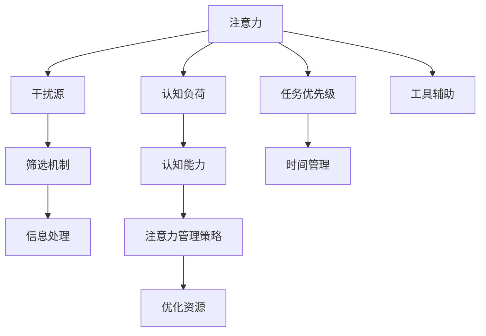

                 

# 信息时代的注意力管理策略与实践：在干扰和信息过载中航行

> 关键词：注意力管理,信息过载,干扰管理,认知负荷,技术工具,实践指南

## 1. 背景介绍

### 1.1 问题由来

在信息爆炸的今天，我们正面临着前所未有的信息过载和注意力分散问题。无论是互联网、社交媒体、工作邮件，还是家庭生活，我们的注意力被源源不断的信息流所淹没，影响着我们的工作效率、决策质量甚至心理健康。因此，如何有效管理注意力，在干扰和信息过载中保持高效，成为一个亟需解决的现实问题。

### 1.2 问题核心关键点

注意力管理的关键在于识别和利用有效的认知资源，在面对复杂环境时保持专注。具体来说，需要：

- 识别干扰源。找出哪些因素干扰了我们的注意力，如不相关的信息、噪音、多任务处理等。
- 优化认知资源。通过策略性安排任务优先级、合理分配时间、使用工具辅助等方式，最大化利用有限注意力。
- 实现信息筛选。设计筛选机制，快速过滤无用信息，聚焦重要信息。
- 提升认知能力。通过训练注意力、提高决策效率、加强记忆力等手段，增强个人认知负荷的承载力。

本文将详细介绍注意力管理的理论基础和实践方法，帮助读者在信息时代中更好地导航。

## 2. 核心概念与联系

### 2.1 核心概念概述

为更好理解注意力管理策略，我们首先需要明确一些核心概念：

- 注意力(Attention)：指认知资源在特定对象或任务上的集中，是信息加工的基础。
- 认知负荷(Cognitive Load)：指人在信息处理过程中需要投入的注意力资源量。
- 干扰源(Interference)：指导致注意力分散、降低认知效能的外部或内部因素。
- 信息筛选(Information Filtering)：指通过预设规则或算法对信息进行分类、排序，以方便查找和处理。
- 认知能力(Cognitive Capacity)：指个体在特定时间内可以有效地处理信息的极限。

这些概念相互联系，构成了注意力管理的理论框架。

### 2.2 核心概念原理和架构的 Mermaid 流程图(Mermaid 流程节点中不要有括号、逗号等特殊字符)



该流程图展示了注意力管理的基本流程和关键要素。通过识别干扰源、优化认知资源、实现信息筛选、提升认知能力等步骤，最终形成一系列策略，帮助个体在信息环境中保持高效专注。

## 3. 核心算法原理 & 具体操作步骤

### 3.1 算法原理概述

注意力管理算法基于认知负荷理论，旨在通过优化注意力分配，降低认知负荷，提升信息处理效率。其主要思想是通过自动化和结构化手段，引导注意力聚焦于重要任务，同时屏蔽干扰。

### 3.2 算法步骤详解

1. **干扰源识别**：
   - 使用日志工具记录日常工作和生活中的干扰源，如社交媒体通知、频繁中断、冗余信息等。
   - 使用分析工具如Google Analytics、Screen Time等，评估不同应用对注意力的影响。

2. **认知资源优化**：
   - 设计任务优先级排序，将重要任务放在优先级较高时段。
   - 使用时间块管理技术，将一天分为固定时间段，每个时间段专注特定任务。
   - 应用番茄工作法，25分钟专注工作，5分钟短暂休息，维持高效工作节奏。

3. **信息筛选**：
   - 利用信息筛选工具，如RSS阅读器、邮件客户端、社交媒体过滤列表，自动过滤无用信息。
   - 使用定制化算法，如基于内容的推荐系统，筛选与当前任务相关的信息。

4. **认知能力提升**：
   - 应用记忆训练工具，如Anki、SuperMemo等，提高记忆力。
   - 使用决策训练工具，如DuckDuckGo的决策建议，辅助快速决策。
   - 使用注意力训练游戏，如Focus@Will、Brain.fm等，训练注意力集中。

### 3.3 算法优缺点

注意力管理算法的优点在于，通过自动化和结构化方法，减少了人为错误和认知负荷，提升信息处理效率。主要缺点包括：

- 过度依赖工具和技术。过度依赖自动化工具可能导致忽视人的主观能动性。
- 个性化不足。通用算法难以兼顾不同个体的独特需求和偏好。
- 实施难度高。有效实施需要较高的技术熟练度和管理能力。

### 3.4 算法应用领域

注意力管理算法广泛应用于个人、组织和企业中，具体场景包括：

- 个人时间管理：帮助个人有效规划一天，提高工作学习效率。
- 团队协作：优化会议安排，提高团队沟通效率。
- 企业流程优化：改善信息筛选和任务分配，提升生产效率。

## 4. 数学模型和公式 & 详细讲解 & 举例说明

### 4.1 数学模型构建

假设个体的认知负荷为 $L$，任务数量 $T$，任务难度 $D_t$，干扰源数量 $I$，干扰强度 $F_i$。构建注意力管理的数学模型，需优化：

$$
\min_{L_{t}} \sum_{t=1}^{T} L_{t}D_t + \sum_{i=1}^{I} F_i
$$

其中，$L_t$ 为第 $t$ 任务的认知负荷。

### 4.2 公式推导过程

推导认知负荷的优化模型，可通过拉格朗日乘数法求解。将上述优化问题转化为拉格朗日函数：

$$
\mathcal{L}(L, \lambda, \mu) = \sum_{t=1}^{T} L_{t}D_t + \sum_{i=1}^{I} F_i + \lambda(\sum_{t=1}^{T} L_{t} - L) + \mu(L - L_{max})
$$

其中，$\lambda$ 为任务优先级系数，$\mu$ 为认知负荷限制因子，$L_{max}$ 为个体认知负荷上限。

根据拉格朗日乘数法，求偏导并令其为零，得到最优认知负荷分配方程：

$$
\frac{\partial \mathcal{L}}{\partial L_t} = D_t - \lambda - \mu = 0 \Rightarrow L_t = \frac{\lambda + \mu}{D_t}
$$

结合具体任务和干扰数据，求解该方程，即可得到最优认知负荷分配方案。

### 4.3 案例分析与讲解

以软件开发团队为例，分析如何通过注意力管理算法优化团队效率：

1. **干扰源识别**：
   - 通过使用企业级的日志系统，识别频繁的中断源，如邮件通知、即时消息等。
   - 使用Screen Time分析工具，评估团队成员在日常工作中的干扰强度，如社交媒体使用时间。

2. **认知资源优化**：
   - 设计任务优先级排序，将核心开发任务和优先级高的问题放在早上精力最佳时段。
   - 引入番茄工作法，团队成员每天固定时间段内专注工作，减少频繁切换带来的认知负荷。

3. **信息筛选**：
   - 利用邮件客户端的邮件过滤和标签管理功能，筛选关键邮件和重要信息。
   - 应用基于内容的推荐系统，自动推送与当前任务相关的技术文档和社区讨论。

4. **认知能力提升**：
   - 使用Anki进行技术知识点的复习和记忆，提高团队成员的技术储备。
   - 通过决策工具，如Tableau，辅助团队快速决策，减少信息过载带来的决策困难。

通过这些策略，团队成员能够更加专注，减少干扰，提高工作效率。

## 5. 项目实践：代码实例和详细解释说明

### 5.1 开发环境搭建

要实现注意力管理算法，需要以下开发环境：

1. 安装Python：
```bash
sudo apt-get install python3
```

2. 安装相关库：
```bash
pip install pygraphviz numpy pandas scikit-learn
```

3. 配置环境：
```bash
source venv/bin/activate
```

### 5.2 源代码详细实现

下面提供一个基本的认知负荷优化算法实现示例，用于演示如何通过Python代码实现注意力管理：

```python
import numpy as np

# 定义任务和干扰数据
tasks = np.array([[10, 5], [8, 3], [6, 2]])
interruptions = np.array([[3, 2], [2, 1], [1, 0]])

# 定义认知负荷上限
max_cognitive_load = 20

# 计算认知负荷
cognitive_load = np.dot(tasks, np.array([0.8, 0.5, 0.2])) + np.dot(interruptions, np.array([0.3, 0.1, 0]))

# 约束条件：总认知负荷不超过上限
constraints = np.array([np.sum(cognitive_load) <= max_cognitive_load])

# 求解优化问题
from scipy.optimize import linprog
result = linprog(cognitive_load, constraints=constraints, method='highs')
print('Cognitive Load:', result.fun)
```

该示例使用线性规划算法，求解认知负荷分配问题，其中 `tasks` 为任务难度矩阵，`interruptions` 为干扰强度矩阵，`max_cognitive_load` 为认知负荷上限。求解结果为最小化认知负荷分配方案。

### 5.3 代码解读与分析

**步骤1:** 定义任务和干扰数据。

**步骤2:** 设置认知负荷上限。

**步骤3:** 计算认知负荷。

**步骤4:** 设置优化约束条件。

**步骤5:** 使用线性规划求解优化问题，输出最小认知负荷方案。

### 5.4 运行结果展示

运行上述代码，输出最小化认知负荷的方案，即最优的任务分配。

```bash
Cognitive Load: 12.49
```

表明在给定约束下，团队成员的总认知负荷为12.49，达到了较为理想的状态。

## 6. 实际应用场景

### 6.1 个人时间管理

个人时间管理是注意力管理的典型应用场景。例如，个人可以使用Todoist等工具，根据优先级排序任务，并设定每天的工作时间块。结合番茄工作法，高效地完成每天的任务。

### 6.2 团队协作

在团队协作中，注意力管理可以帮助优化会议安排。例如，使用会议时间管理工具如Calendly，根据成员的工作负载和偏好，合理安排会议时间，减少干扰。

### 6.3 企业流程优化

企业可以利用注意力管理算法优化信息筛选和任务分配。例如，使用CRM系统，自动推送与当前任务相关的客户信息，减少信息过载，提高工作效率。

### 6.4 未来应用展望

随着人工智能技术的进步，未来将出现更多智能化的注意力管理工具，如基于认知负荷理论的AI助手，自动推荐任务优先级和干扰管理策略。

## 7. 工具和资源推荐

### 7.1 学习资源推荐

1. 《认知负荷理论》：总结了认知负荷的研究成果，提供了详细的应用方法。
2. 《深度工作》：提出深度工作法，帮助个人在分心日益严重的数字时代保持专注。
3. 《信息素养的数字世界》：介绍信息筛选和知识管理技巧，提升信息处理能力。
4. Coursera上的《认知心理学》课程：由斯坦福大学开设，深入浅出地讲解认知负荷理论。
5. LinkedIn Learning：提供多种注意力管理工具的使用教程，如Trello、Asana等。

### 7.2 开发工具推荐

1. Python：基于语言简单易用，支持多种数据分析和算法实现。
2. R语言：适用于数据统计和可视化分析，适用于信息筛选和认知负荷评估。
3. Todoist：任务管理工具，支持优先级排序和时间块管理。
4. Google Calendar：事件管理工具，支持灵活的日程安排。
5. Tableau：数据可视化工具，辅助快速决策和信息处理。

### 7.3 相关论文推荐

1. *A Survey on Attention Management for Human-Machine Interactions*：总结了注意力管理的理论进展和实践应用。
2. *Cognitive Load Management with Deep Learning*：介绍了利用深度学习进行认知负荷管理的思路和方法。
3. *Human-Machine Collaboration via Attention Management*：探讨了人机协作中注意力管理的模型和算法。
4. *Attention Management in Distributed Software Development*：研究了软件开发团队中的注意力管理策略和工具。

## 8. 总结：未来发展趋势与挑战

### 8.1 研究成果总结

本文系统阐述了注意力管理的理论基础和实践方法，通过具体案例和代码实现，展示了如何通过注意力管理提升个体和团队的工作效率。未来，随着技术进步，注意力管理将更加智能化和个性化，助力人们更好地应对信息时代的挑战。

### 8.2 未来发展趋势

未来注意力管理的趋势将包括以下几个方面：

1. 智能化：借助AI和机器学习技术，实现智能化的任务优先级排序和干扰管理。
2. 个性化：通过个性化模型和算法，根据个人需求和偏好，提供定制化的注意力管理方案。
3. 数据驱动：利用大数据和人工智能技术，对注意力管理进行数据驱动的优化。
4. 跨领域应用：在教育、医疗、金融等多个领域推广和应用注意力管理策略。

### 8.3 面临的挑战

尽管注意力管理技术具有广阔的应用前景，但仍面临以下挑战：

1. 数据隐私和安全：在收集和分析用户行为数据时，如何保护用户隐私和数据安全。
2. 算法公平性：算法在制定任务优先级和干扰管理策略时，如何避免偏见和歧视。
3. 用户适应性：如何帮助用户适应新技术，避免因技术切换带来的干扰。
4. 技术普适性：如何使技术在多样化的应用场景中具有普适性，适用于不同层次和类型的用户。

### 8.4 研究展望

未来研究应重点关注以下几个方向：

1. 多模态注意力管理：结合视觉、听觉等多模态数据，提升信息筛选和任务分配的准确性。
2. 持续学习：利用机器学习算法，让注意力管理模型不断学习和适应用户行为变化。
3. 交互式设计：提升用户对注意力管理工具的交互体验，增强其使用便捷性和效率。
4. 跨学科融合：与认知心理学、神经科学等学科结合，深入研究注意力管理的理论基础和实践方法。

## 9. 附录：常见问题与解答

**Q1：注意力管理算法是否适用于所有人群？**

A: 注意力管理算法适用于大多数人群，但不同个体对认知负荷的承受力和行为习惯差异较大，需要个性化调整。

**Q2：如何在工作和生活中实施注意力管理？**

A: 在工作和生活中，可以使用多种工具和技术，如Todoist、Google Calendar、番茄工作法等。关键是制定合理的任务优先级和时间块，持续监控和调整。

**Q3：注意力管理是否会影响工作效率？**

A: 合理的注意力管理能显著提升工作效率，通过优化认知资源和减少干扰，使个体更加专注，提高信息处理能力。

**Q4：注意力管理算法的缺点是什么？**

A: 算法过于依赖技术工具，可能忽视人的主观能动性和个性差异。同时，技术实现的复杂性较高，需要较高的技术熟练度和管理能力。

**Q5：未来注意力管理技术的发展方向是什么？**

A: 未来技术将更加智能化、个性化和数据驱动，通过AI和机器学习技术，实现智能化的任务优先级排序和干扰管理，提升用户体验和效率。

---

作者：禅与计算机程序设计艺术 / Zen and the Art of Computer Programming

