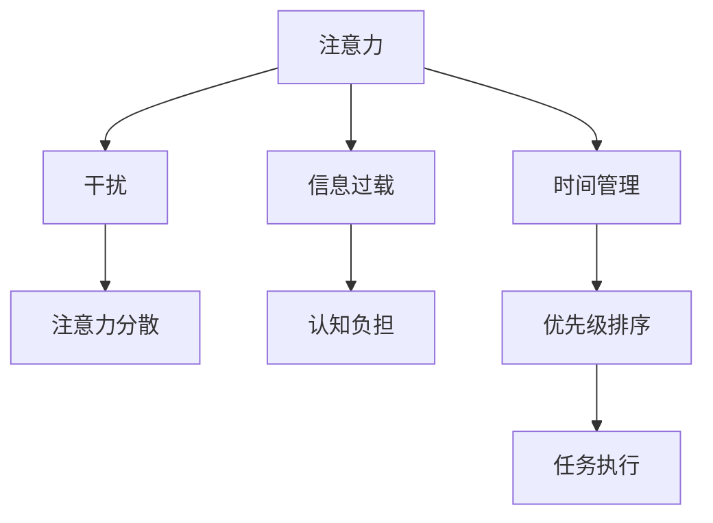

                 

# 信息时代的注意力管理策略：管理干扰和信息过载

在信息爆炸的互联网时代，注意力管理成为个体和社会共同面临的重大挑战。高强度的信息流冲击下，人们容易被各种无关信息干扰，导致注意力分散，效率下降。如何有效管理干扰和信息过载，是提高工作和生活质量的关键。本文将深入探讨信息时代的注意力管理策略，提出一系列实用的方法，帮助个体在信息海洋中寻找自己的焦点，提升工作和学习的效率与质量。

## 1. 背景介绍

### 1.1 问题由来

随着互联网技术的发展，信息量呈指数级增长。大量即时通讯、社交媒体、新闻推送等，不断占据我们的注意力，使得人们难以专注于重要任务，降低了工作效率和生活质量。例如，研究表明，频繁的电子邮件通知、即时消息等，平均使人们的响应时间延长了120%，每天额外消耗2.1小时的时间。面对这种情况，注意力管理策略应运而生，旨在帮助个体有效筛选信息、集中注意力，提高任务执行效率。

### 1.2 问题核心关键点

信息时代注意力管理的关键在于以下几个方面：

- **注意力分散**：互联网中的各种干扰（如弹窗、消息提示）导致注意力频繁跳转，难以集中。
- **信息过载**：海量信息源和不断更新的内容，使得个体难以消化和处理。
- **时间管理**：如何在有限的注意力资源下，高效地分配时间，处理重要任务。
- **优先级排序**：识别任务的重要性和紧急性，做出合理的优先级排序。

这些核心点构成了信息时代注意力管理的框架，本文将围绕这些关键问题，探讨具体的策略和方法。

## 2. 核心概念与联系

### 2.1 核心概念概述

1. **注意力**：注意力是一种心理过程，指的是个体在特定时间选择并聚焦于某一特定刺激的能力。
2. **干扰**：干扰是指影响个体注意力集中的各种外部刺激，如噪音、不相关信息等。
3. **信息过载**：信息过载指个体接收的信息量超过其处理能力，导致认知负担过重，难以有效决策。
4. **时间管理**：时间管理是指通过有效规划和控制时间，提升工作和学习的效率。
5. **优先级排序**：优先级排序是指根据任务的重要性和紧急性，进行合理的资源分配和决策。

这些概念之间存在紧密的联系：

- 干扰和信息过载是注意力分散的主要来源。
- 时间管理通过合理规划时间，减轻信息过载的影响。
- 优先级排序帮助个体在资源有限的情况下，高效地处理重要任务。

以下Mermaid流程图展示了这些概念之间的关系：



## 3. 核心算法原理 & 具体操作步骤

### 3.1 算法原理概述

信息时代注意力管理，本质上是通过对信息的筛选和分类，提高个体注意力集中度和决策效率。其核心算法包括：

- **干扰筛选算法**：通过统计和分析干扰源，识别和屏蔽无关信息。
- **信息分类算法**：将信息按重要性和紧急性分类，优先处理重要紧急任务。
- **时间分配算法**：根据任务优先级，分配合理的时间资源，确保重要任务得到充分处理。

### 3.2 算法步骤详解

#### 3.2.1 干扰筛选

1. **干扰源统计**：使用数据分析工具，统计每日的干扰源（如邮件、消息、广告等），并分析其对注意力的影响。
2. **干扰屏蔽**：根据干扰源的重要性和频率，设置屏蔽机制。例如，设置邮件过滤规则，屏蔽无关邮件，避免打扰。

#### 3.2.2 信息分类

1. **信息分类模型**：基于机器学习算法，训练信息分类模型，自动识别信息的类别。常用的算法包括朴素贝叶斯、支持向量机、随机森林等。
2. **信息优先级**：根据分类结果，将信息按重要性和紧急性排序。例如，将工作邮件、项目进展报告等重要信息置于优先级高的位置。

#### 3.2.3 时间分配

1. **时间块划分**：将一天划分为多个时间块，每个时间块专注于特定任务或类型的工作。
2. **时间块规划**：根据任务优先级，为每个时间块分配优先级。例如，早晨处理重要任务，下午处理日常事务。

### 3.3 算法优缺点

#### 3.3.1 优点

- **自动化**：通过算法自动化干扰筛选和信息分类，减轻人工负担。
- **效率提升**：优先处理重要紧急任务，提高工作效率和生活质量。
- **灵活性**：时间分配算法可根据个体需求灵活调整，适应不同工作场景。

#### 3.3.2 缺点

- **初始设置复杂**：算法需要初始设置和训练，对于技术不熟练的个体可能较难上手。
- **数据依赖**：算法的准确性依赖于训练数据的代表性和质量。
- **适应性**：对于特定场景或工作模式的变化，算法可能需要调整。

### 3.4 算法应用领域

信息时代注意力管理策略，广泛应用于以下几个领域：

1. **企业办公**：通过自动化工具和算法，提高员工的工作效率，减少干扰，提升办公环境。
2. **教育培训**：帮助学生和教师有效管理学习任务，集中注意力，提高教学和学习效果。
3. **个人生活**：优化个人时间管理，减少信息过载，提高生活质量。
4. **科研工作**：提升科研人员的时间利用率，减少干扰，提高研究工作效率。

## 4. 数学模型和公式 & 详细讲解 & 举例说明

### 4.1 数学模型构建

假设个体每天需处理的任务数量为 $N$，每个任务的重要性和紧急性可以用一个二元组 $(i,e)$ 表示，其中 $i$ 表示任务的重要度，$e$ 表示任务的紧急度。任务的重要度和紧急度可以用数值表示，例如 $i \in [1,10]$，$e \in [1,5]$。

设个体每天可专注的时间为 $T$，每个时间块长度为 $\Delta t$。个体每天需进行 $k$ 次时间块划分，每个时间块处理的优先级为 $p$。则有：

$$
T = k \cdot \Delta t
$$

个体每天的任务执行时间 $T_{task}$ 和任务处理数 $n_{task}$ 可以表示为：

$$
T_{task} = \sum_{i=1}^N t_i \cdot c_i
$$

$$
n_{task} = \sum_{i=1}^N c_i
$$

其中，$t_i$ 表示任务 $i$ 的处理时间，$c_i$ 表示任务 $i$ 在时间块中的处理优先级。

### 4.2 公式推导过程

通过上述模型，可以推导出时间分配算法的优化目标：

$$
\max_{t_i,c_i} \frac{T_{task}}{T}
$$

即在有限的专注时间内，最大化任务执行时间和任务处理数量。根据优先级排序原则，任务的处理优先级 $c_i$ 应满足：

$$
c_i \in [0,1]
$$

且

$$
\sum_{i=1}^N c_i = 1
$$

此时，任务执行时间的计算公式变为：

$$
T_{task} = \sum_{i=1}^N t_i \cdot c_i = \sum_{i=1}^N (1/c_i) \cdot c_i \cdot t_i = \sum_{i=1}^N t_i
$$

### 4.3 案例分析与讲解

以企业办公为例，假设企业员工每天有10项任务，重要性和紧急性如下表所示：

| 任务编号 | 重要性 $i$ | 紧急性 $e$ | 处理时间 $t_i$ |
|---|---|---|---|
| 1 | 9 | 5 | 2h |
| 2 | 8 | 3 | 3h |
| 3 | 7 | 2 | 1h |
| 4 | 6 | 2 | 1h |
| 5 | 5 | 1 | 30min |
| 6 | 4 | 1 | 30min |
| 7 | 3 | 1 | 1h |
| 8 | 2 | 1 | 1h |
| 9 | 1 | 1 | 30min |
| 10 | 1 | 1 | 30min |

假设员工每天专注时间 $T=8$ 小时，每天划分 $k=4$ 个时间块，每个时间块长度 $\Delta t=2$ 小时。任务重要性和紧急性用数值表示，重要性和紧急度越高，处理优先级越高。

根据以上公式，我们可以计算每个任务的优先级 $c_i$，并优化任务处理时间和处理数量。例如，对于任务1，优先级 $c_1=1$，处理时间 $t_1=2$ 小时，任务处理时间 $T_{task}=2$ 小时，占专注时间的 $\frac{2}{8}=0.25$。同理，可计算其他任务的处理时间和处理优先级。

最终，员工每天能处理的任务数量为：

$$
n_{task} = 1 \cdot 4 + 2 \cdot 3 + 3 \cdot 2 + 4 \cdot 1 = 26
$$

## 5. 项目实践：代码实例和详细解释说明

### 5.1 开发环境搭建

- **Python环境**：安装Python 3.8及以上版本。
- **数据准备**：准备任务数据，包含任务编号、重要性、紧急性和处理时间。
- **开发工具**：安装PyCharm或Jupyter Notebook，便于代码开发和调试。

### 5.2 源代码详细实现

以下是一个基于优先级排序的时间分配算法实现，使用Python语言：

```python
import numpy as np

# 定义任务列表，包含任务编号、重要性和紧急性
tasks = np.array([[1, 9, 5, 2],
                 [2, 8, 3, 3],
                 [3, 7, 2, 1],
                 [4, 6, 2, 1],
                 [5, 5, 1, 0.5],
                 [6, 4, 1, 0.5],
                 [7, 3, 1, 1],
                 [8, 2, 1, 1],
                 [9, 1, 1, 0.5],
                 [10, 1, 1, 0.5]])

# 定义优先级排序函数，根据重要性和紧急性排序
def sort_tasks(tasks):
    return np.argsort(tasks[:, 0] * tasks[:, 1])

# 定义时间分配函数，根据优先级分配时间块
def allocate_time(tasks, total_time, num_blocks, block_length):
    sorted_idx = sort_tasks(tasks)
    tasks_sorted = tasks[sorted_idx]
    
    total_time_spent = 0
    total_tasks_done = 0
    remaining_time = total_time
    
    for i in range(sorted_idx.size):
        task = tasks_sorted[i]
        time_spent = block_length
        if remaining_time - time_spent >= 0:
            remaining_time -= time_spent
            total_time_spent += time_spent
            total_tasks_done += 1
    
    return total_time_spent, total_tasks_done

# 计算任务执行时间和任务处理数量
total_time = 8 * 60  # 转换为分钟
num_blocks = 4
block_length = 2 * 60  # 转换为分钟

total_time_spent, total_tasks_done = allocate_time(tasks, total_time, num_blocks, block_length)

print("任务执行时间：{}分钟".format(total_time_spent))
print("任务处理数量：{}".format(total_tasks_done))
```

### 5.3 代码解读与分析

- **任务列表**：定义包含任务编号、重要性和紧急性的二维数组。
- **排序函数**：根据任务的重要性和紧急性计算优先级，排序任务列表。
- **时间分配函数**：根据优先级和时间块长度，分配时间块，计算任务执行时间和任务处理数量。
- **主程序**：调用时间分配函数，输出任务执行时间和任务处理数量。

## 6. 实际应用场景

### 6.1 智能办公系统

企业可以开发基于信息时代注意力管理的智能办公系统，帮助员工有效管理任务和干扰，提高工作效率。例如，系统可以自动识别员工当前的工作模式（如专注模式、会议模式），自动屏蔽非相关通知，提醒员工重要任务。

### 6.2 在线教育平台

在线教育平台可以应用注意力管理策略，帮助学生和教师有效分配时间和注意力。例如，平台可以统计学生在学习过程中的注意力分布，提示学生集中注意力的时间段，提高学习效果。

### 6.3 个人生活管理

个人可以通过应用程序实现信息时代注意力管理，如时间管理工具、任务管理工具等。例如，Todoist、Trello等应用可以帮助用户规划每天的任务和时间块，提高生活质量。

### 6.4 未来应用展望

未来，随着技术的发展，信息时代注意力管理将更加智能化和个性化。例如，智能助手可以根据用户的历史行为数据，自动调整任务优先级和时间分配，提供更贴合用户需求的个性化管理方案。此外，随着多模态技术的进步，智能系统可以结合语音、视觉等多种模态，提供更全面的注意力管理支持。

## 7. 工具和资源推荐

### 7.1 学习资源推荐

1. **《信息时代的注意力管理》书籍**：详细介绍了注意力管理的原理和实践方法，适合入门学习和进阶研究。
2. **Coursera《时间管理和生产力》课程**：涵盖时间管理、注意力管理等多个方面的内容，提供系统学习资源。
3. **GitHub注意力管理开源项目**：收集了大量注意力管理的开源代码和工具，适合开发者参考和学习。

### 7.2 开发工具推荐

1. **PyCharm**：Python开发环境，支持代码编辑、调试、测试等全流程开发。
2. **Jupyter Notebook**：交互式编程环境，支持Python、R等多种语言，适合数据科学和机器学习开发。
3. **TimeCamp**：时间管理工具，帮助用户记录和分析时间分配，优化时间利用率。

### 7.3 相关论文推荐

1. **《Attention is All You Need》论文**：Transformer模型提出者，深度介绍了注意力机制的应用。
2. **《Deep Work: Rules for Focused Success in a Distracted World》书籍**：探讨在信息时代如何有效管理注意力，提高工作和学习效率。
3. **《The Art of Time Management: How to Plan, Prioritize, and Manage Your Time Effectively》书籍**：提供时间管理和注意力管理的详细方法和技巧。

## 8. 总结：未来发展趋势与挑战

### 8.1 研究成果总结

本文介绍了信息时代注意力管理的核心概念和策略，探讨了如何通过干扰筛选、信息分类和时间分配等算法，提升个体和组织的工作和生活效率。具体实现上，利用了机器学习、统计分析等技术，设计了优先级排序和时间分配算法，并通过代码实例详细解释了其实现过程。

### 8.2 未来发展趋势

未来，信息时代注意力管理将呈现以下几个趋势：

1. **智能化**：结合人工智能技术，智能系统将能够更准确地分析用户行为，提供个性化的注意力管理方案。
2. **多模态**：结合视觉、听觉等多种模态信息，提供更全面的注意力支持。
3. **全场景**：将注意力管理应用于更多场景，如家庭、健康等，提升个人生活质量。

### 8.3 面临的挑战

尽管信息时代注意力管理策略取得一定进展，但仍面临以下挑战：

1. **隐私保护**：智能系统需要收集大量用户数据，如何保护用户隐私是个重要问题。
2. **数据偏差**：算法依赖于用户行为数据，数据偏差可能导致算法不公平或误导。
3. **用户习惯**：如何引导用户建立良好的使用习惯，避免过度依赖智能系统。
4. **伦理问题**：注意力管理策略可能引发伦理问题，如监控、控制等，需要关注其伦理影响。

### 8.4 研究展望

未来，研究应着重解决以下问题：

1. **隐私保护机制**：研究如何保护用户隐私，确保数据安全。
2. **数据采集方法**：设计公平、无偏的数据采集方法，提高算法准确性。
3. **用户交互设计**：设计友好、易用的用户界面，引导用户建立良好的使用习惯。
4. **伦理考量**：研究注意力管理的伦理问题，确保其应用合法合规。

## 9. 附录：常见问题与解答

**Q1：信息时代注意力管理策略的优点和缺点有哪些？**

A: 优点：
1. **自动化**：通过算法自动化干扰筛选和信息分类，减轻人工负担。
2. **效率提升**：优先处理重要紧急任务，提高工作效率和生活质量。
3. **灵活性**：时间分配算法可根据个体需求灵活调整，适应不同工作场景。

缺点：
1. **初始设置复杂**：算法需要初始设置和训练，对于技术不熟练的个体可能较难上手。
2. **数据依赖**：算法的准确性依赖于训练数据的代表性和质量。
3. **适应性**：对于特定场景或工作模式的变化，算法可能需要调整。

**Q2：如何应用信息时代注意力管理策略？**

A: 应用信息时代注意力管理策略，可以从以下几个方面入手：
1. **干扰屏蔽**：使用数据分析工具，识别和屏蔽无关信息，如设置邮件过滤规则，屏蔽无关邮件。
2. **信息分类**：训练机器学习模型，自动识别信息的类别，如根据重要性紧急性排序任务。
3. **时间分配**：根据任务优先级，合理分配时间，如划分时间块，优先处理重要紧急任务。
4. **持续优化**：根据实际效果，不断调整和优化算法，确保策略的有效性。

**Q3：如何处理时间管理中的数据偏差问题？**

A: 数据偏差可能导致算法不公平或误导，可以采取以下措施：
1. **数据采集**：设计公平、无偏的数据采集方法，确保数据的代表性。
2. **算法优化**：结合领域知识，优化算法模型，减少偏差的影响。
3. **定期更新**：定期更新数据和算法，确保其适应新场景和变化。

**Q4：如何确保信息时代注意力管理策略的隐私保护？**

A: 隐私保护是信息时代注意力管理的重要问题，可以采取以下措施：
1. **数据匿名化**：对用户数据进行匿名化处理，确保数据安全。
2. **数据加密**：对存储和传输的数据进行加密处理，防止数据泄露。
3. **权限控制**：设置严格的权限控制机制，确保数据访问权限。

**Q5：信息时代注意力管理策略的未来展望是什么？**

A: 未来，信息时代注意力管理策略将更加智能化、个性化、多模态化和全场景化。结合人工智能技术，智能系统将能够更准确地分析用户行为，提供个性化的注意力管理方案。同时，结合视觉、听觉等多种模态信息，提供更全面的注意力支持。在全场景应用中，将注意力管理应用于更多领域，提升个人生活质量。

---

作者：禅与计算机程序设计艺术 / Zen and the Art of Computer Programming

