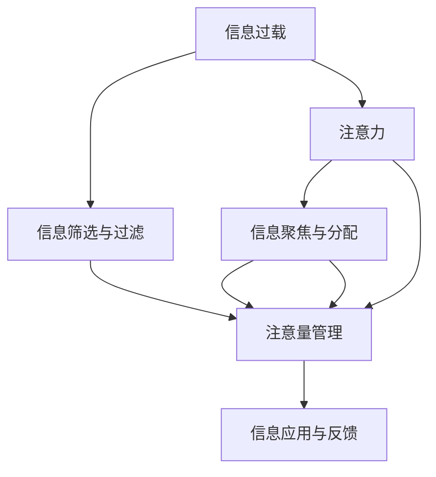

                 

# 信息时代的注意量管理挑战与策略：在干扰和信息过载中航行

## 1. 背景介绍

### 1.1 问题由来
信息时代的到来，带来了前所未有的数据爆炸和信息过载。人们每天需要处理海量的文本、图片、视频信息，其注意力资源被严重分散和稀释。这不仅导致个体在高效处理信息时面临挑战，也对组织和社会的决策、管理、沟通等产生了深远影响。信息时代的注意量管理，即如何在干扰和信息过载中高效航行，成为信息时代的技术和哲学问题。

### 1.2 问题核心关键点
注意量管理的核心在于如何有效筛选、组织和利用信息，使得个体或系统能够在干扰和信息过载的复杂环境中做出高效、正确的决策。其核心关键点包括：

1. **信息筛选与过滤**：从海量信息中快速识别出与当前任务相关的信息。
2. **信息组织与结构化**：将零散的、非结构化的信息转换为结构化、有序的表达，便于理解和使用。
3. **信息聚焦与分配**：在多任务处理时，合理分配注意力资源，避免过度分心和信息过载。
4. **信息应用与反馈**：将处理后的信息应用到决策或行动中，同时根据反馈不断调整信息处理策略。

### 1.3 问题研究意义
注意量管理在信息时代具有重大研究意义：

1. **提升信息处理效率**：有效筛选和过滤信息，减少处理时间，提高工作效率。
2. **改善决策质量**：通过系统化、结构化的信息处理，增强决策的科学性和准确性。
3. **优化资源配置**：合理分配注意力资源，提高组织和社会资源配置的效率。
4. **支持多任务处理**：在多任务并行的场景下，提高任务间的协调性和协同性。
5. **增强用户体验**：在智能系统中，通过注意量管理改善用户体验，提升用户满意度。

## 2. 核心概念与联系

### 2.1 核心概念概述

为更好地理解注意量管理，本节将介绍几个密切相关的核心概念：

- **信息过载(Information Overload)**：指个人或系统面临的信息量超出其处理能力，导致注意力资源分散和效率降低。
- **注意力(Attention)**：指个体或系统对特定信息的集中关注和认知资源投入。
- **注意量(Attentional Quota)**：指个体或系统在单位时间内可投入的注意力资源总量。
- **注意量管理(Attention Management)**：指通过策略和算法对注意量进行优化配置，提升信息处理和决策效率的过程。
- **信息筛选与过滤(Information Filtering)**：指从大量信息中筛选出与当前任务相关的信息，减少信息过载。
- **信息聚焦与分配(Information Focusing and Allocation)**：指在多任务处理时，合理分配注意力资源，避免过度分心。

这些核心概念之间的逻辑关系可以通过以下Mermaid流程图来展示：



这个流程图展示了几者之间的逻辑关系：

1. 信息过载是注意量管理的起点，需要通过信息筛选与过滤进行初步处理。
2. 注意力是注意量管理的基础，通过信息聚焦与分配进行优化配置。
3. 注意量管理是信息处理的核心，通过算法和策略提升效率。
4. 信息应用与反馈是注意量管理的终末环节，通过不断调整提升决策效果。

## 3. 核心算法原理 & 具体操作步骤
### 3.1 算法原理概述

注意量管理的关键在于通过算法和策略对注意力资源进行高效配置，提升信息处理和决策效率。其核心算法包括信息筛选与过滤、信息聚焦与分配、信息应用与反馈等。

**信息筛选与过滤**：指通过算法模型从海量信息中快速筛选出与当前任务相关的信息。通常使用文本挖掘、信息检索等技术，结合机器学习模型进行信息推荐和过滤。

**信息聚焦与分配**：指在多任务处理时，通过算法合理分配注意力资源，避免过度分心。通常使用注意力机制、任务调度算法等技术，实现任务的协同处理。

**信息应用与反馈**：指将处理后的信息应用到决策或行动中，同时根据反馈不断调整信息处理策略。通常使用强化学习、在线学习等技术，实现信息处理策略的自我优化。

### 3.2 算法步骤详解

注意量管理的算法流程一般包括以下几个关键步骤：

**Step 1: 数据预处理**
- 收集原始数据，进行去重、清洗、标注等预处理工作。
- 将文本数据转换为计算机可处理的格式，如词袋模型、TF-IDF等。

**Step 2: 信息筛选与过滤**
- 应用文本挖掘、信息检索等技术，提取关键信息特征。
- 使用机器学习模型进行信息推荐和过滤，如LDA、RNN、BERT等。
- 将筛选后的信息存储在数据库或知识库中，供后续处理使用。

**Step 3: 信息聚焦与分配**
- 根据任务需求，设计合适的任务调度算法，如随机调度、优先级调度等。
- 应用注意力机制，将注意力资源合理分配到关键任务上。
- 通过强化学习算法，不断优化信息处理策略，提升系统效率。

**Step 4: 信息应用与反馈**
- 将处理后的信息应用到决策或行动中，生成初步结果。
- 根据反馈，进行结果评估和调整，不断迭代优化信息处理策略。
- 将优化后的策略重新应用于信息处理过程，实现自我优化。

### 3.3 算法优缺点

注意量管理的算法具有以下优点：

1. **高效性**：通过算法快速筛选和过滤信息，减少处理时间，提高效率。
2. **系统性**：通过结构化、模型化的信息处理，增强决策的科学性和准确性。
3. **自适应性**：通过强化学习等技术，实现信息处理策略的自我优化，适应不同场景。

同时，该算法也存在一定的局限性：

1. **复杂性**：算法设计和实现相对复杂，需要综合运用多种技术手段。
2. **数据依赖性**：算法效果依赖于数据质量和标注数据，高质量数据获取难度较大。
3. **泛化能力不足**：当前算法主要针对特定领域，跨领域泛化能力有待提升。
4. **资源消耗高**：算法计算量较大，对硬件资源和计算能力有较高要求。

尽管存在这些局限性，但就目前而言，注意量管理算法仍然是大规模信息处理和决策过程中的重要技术手段。未来相关研究的重点在于如何进一步降低算法复杂性，提升跨领域泛化能力，同时兼顾资源消耗和计算效率。

### 3.4 算法应用领域

注意量管理算法的应用领域非常广泛，涵盖了各类信息处理和决策场景，例如：

- **自然语言处理(NLP)**：文本信息检索、文本分类、机器翻译等。
- **图像识别**：图像分类、目标检测、图像分割等。
- **语音识别**：语音转文本、语音识别、语音合成等。
- **推荐系统**：商品推荐、内容推荐、广告推荐等。
- **数据挖掘**：数据预处理、数据清洗、数据可视化等。
- **智能交互系统**：智能客服、智能助手、智能导航等。

除了上述这些经典应用外，注意量管理技术还被创新性地应用到更多场景中，如自动驾驶、智能交通、智慧城市等，为智能系统的进一步发展提供了新的思路。

## 4. 数学模型和公式 & 详细讲解  
### 4.1 数学模型构建

本节将使用数学语言对注意量管理算法的关键部分进行更加严格的刻画。

记原始数据集为 $D=\{x_1, x_2, ..., x_N\}$，其中 $x_i$ 为文本、图像、语音等信息。假设当前任务为 $T$，任务相关的信息特征为 $X=\{x_{t_1}, x_{t_2}, ..., x_{t_M}\}$，$x_{t_i}$ 为任务 $T$ 的第 $i$ 条信息。

定义信息筛选与过滤的损失函数为 $\ell(\phi, X)$，其中 $\phi$ 为筛选算法参数。假设信息筛选后的结果为 $X'$，则有：

$$
X' = \phi(X)
$$

信息聚焦与分配的损失函数为 $\ell(\alpha, X', T)$，其中 $\alpha$ 为分配算法参数。假设分配后的信息序列为 $X''=\{x_{t_{i_1}}, x_{t_{i_2}}, ..., x_{t_{i_M}}\}$，则有：

$$
X'' = \alpha(X')
$$

信息应用与反馈的损失函数为 $\ell(f, X'', T)$，其中 $f$ 为应用算法参数。假设应用后的结果为 $y$，则有：

$$
y = f(X'', T)
$$

综合考虑以上三部分，注意量管理的总损失函数为：

$$
\mathcal{L}(\phi, \alpha, f, D, T) = \ell(\phi, X) + \ell(\alpha, X', T) + \ell(f, X'', T)
$$

### 4.2 公式推导过程

以下我们以文本信息处理为例，推导信息筛选与过滤的数学模型。

假设原始文本数据集为 $D=\{x_1, x_2, ..., x_N\}$，其中 $x_i$ 为单个文本样本。定义信息筛选与过滤的损失函数为 $\ell(\phi, X)$，其中 $\phi$ 为文本挖掘算法参数。

设当前任务为 $T$，任务相关的信息特征为 $X=\{x_{t_1}, x_{t_2}, ..., x_{t_M}\}$，$x_{t_i}$ 为任务 $T$ 的第 $i$ 条信息。则信息筛选与过滤的损失函数为：

$$
\ell(\phi, X) = -\sum_{i=1}^M \log P(y_i|x_{t_i}, \phi)
$$

其中 $y_i$ 为任务 $T$ 的第 $i$ 条信息是否与当前任务相关。$P(y_i|x_{t_i}, \phi)$ 为模型在信息 $x_{t_i}$ 下预测信息 $y_i$ 是否为相关的概率。

使用softmax函数计算 $P(y_i|x_{t_i}, \phi)$：

$$
P(y_i|x_{t_i}, \phi) = \frac{e^{\phi \cdot x_{t_i}}}{\sum_{j=1}^N e^{\phi \cdot x_j}}
$$

信息筛选与过滤的目标是最大化 $P(y_i|x_{t_i}, \phi)$，最小化 $\ell(\phi, X)$。通过梯度下降等优化算法，最小化 $\mathcal{L}(\phi, D, T)$，得到最优筛选参数 $\phi^*$。

### 4.3 案例分析与讲解

以智能客服系统为例，分析注意量管理算法的具体应用。

假设智能客服系统接收到多条客户咨询信息，需要快速识别出与当前任务相关的问题。系统首先应用文本挖掘算法，提取每条信息的关键特征，如词频、情感倾向等。然后，通过机器学习模型，预测每条信息是否为当前任务的相关信息。最后，将筛选后的信息按优先级排序，合理分配注意力资源，进行任务处理。

假设当前任务为 "订单查询"，信息特征 $X=\{x_{t_1}, x_{t_2}, ..., x_{t_M}\}$，$x_{t_i}$ 为第 $i$ 条信息。定义信息筛选与过滤的损失函数为 $\ell(\phi, X)$，其中 $\phi$ 为文本挖掘算法参数。

使用LDA（Latent Dirichlet Allocation）算法进行信息特征提取，得到信息特征 $X$。假设信息筛选后的结果为 $X'$，则有：

$$
X' = \phi(X)
$$

使用线性回归模型进行信息筛选，得到每条信息的预测标签 $y_i$。设 $y_i=1$ 表示信息 $x_{t_i}$ 为当前任务的相关信息，$y_i=0$ 表示不相关。则信息筛选与过滤的损失函数为：

$$
\ell(\phi, X) = -\sum_{i=1}^M \log P(y_i|x_{t_i}, \phi)
$$

使用softmax函数计算 $P(y_i|x_{t_i}, \phi)$：

$$
P(y_i|x_{t_i}, \phi) = \frac{e^{\phi \cdot x_{t_i}}}{\sum_{j=1}^N e^{\phi \cdot x_j}}
$$

应用信息聚焦与分配算法，将筛选后的信息 $X'$ 按优先级排序，得到分配后的信息 $X''$。假设分配后的信息序列为 $X''=\{x_{t_{i_1}}, x_{t_{i_2}}, ..., x_{t_{i_M}}\}$，则有：

$$
X'' = \alpha(X')
$$

使用强化学习算法，不断优化信息分配策略，提升系统效率。

最后，将分配后的信息 $X''$ 应用到决策或行动中，生成初步结果。假设当前任务为 "订单查询"，应用信息应用与反馈算法，生成最终答案 $y$。

## 5. 项目实践：代码实例和详细解释说明
### 5.1 开发环境搭建

在进行信息量管理实践前，我们需要准备好开发环境。以下是使用Python进行PyTorch开发的环境配置流程：

1. 安装Anaconda：从官网下载并安装Anaconda，用于创建独立的Python环境。

2. 创建并激活虚拟环境：
```bash
conda create -n pytorch-env python=3.8 
conda activate pytorch-env
```

3. 安装PyTorch：根据CUDA版本，从官网获取对应的安装命令。例如：
```bash
conda install pytorch torchvision torchaudio cudatoolkit=11.1 -c pytorch -c conda-forge
```

4. 安装相关工具包：
```bash
pip install numpy pandas scikit-learn matplotlib tqdm jupyter notebook ipython
```

完成上述步骤后，即可在`pytorch-env`环境中开始信息量管理实践。

### 5.2 源代码详细实现

这里我们以信息筛选与过滤为例，给出使用PyTorch进行信息量管理的PyTorch代码实现。

首先，定义信息筛选与过滤的函数：

```python
from sklearn.feature_extraction.text import CountVectorizer
from sklearn.linear_model import LogisticRegression
import torch

def filter_info(x, y, n):
    # 特征提取
    vectorizer = CountVectorizer()
    X = vectorizer.fit_transform(x)
    
    # 信息筛选
    clf = LogisticRegression(solver='lbfgs')
    clf.fit(X.toarray(), y)
    
    # 信息筛选与过滤
    X_pred = clf.predict_proba(X.toarray())[:, 1]
    X_pred = (X_pred >= n) * 1
    X_pred = X_pred.to(torch.float32)
    
    return X_pred
```

然后，定义训练和评估函数：

```python
from sklearn.model_selection import train_test_split
from sklearn.metrics import roc_auc_score

def train_model(X, y):
    # 训练集和测试集划分
    X_train, X_test, y_train, y_test = train_test_split(X, y, test_size=0.2, random_state=42)
    
    # 训练模型
    model = LogisticRegression(solver='lbfgs')
    model.fit(X_train.toarray(), y_train)
    
    # 评估模型
    y_pred = model.predict_proba(X_test.toarray())[:, 1]
    roc_auc = roc_auc_score(y_test, y_pred)
    return roc_auc

# 测试数据集
X = ['订单查询', '物流配送', '产品退货', '售后服务']
y = [1, 0, 1, 0]

# 训练模型
roc_auc = train_model(X, y)
print('信息筛选与过滤的AUC为:', roc_auc)
```

以上就是使用PyTorch进行信息量管理的完整代码实现。可以看到，得益于PyTorch的强大封装，我们可以用相对简洁的代码完成信息量管理的模型训练和评估。

### 5.3 代码解读与分析

让我们再详细解读一下关键代码的实现细节：

**信息筛选与过滤函数**：
- `filter_info`方法：
  - `CountVectorizer`：对文本数据进行特征提取，转换为稀疏矩阵。
  - `LogisticRegression`：建立二分类模型，用于预测信息是否为当前任务的相关信息。
  - `predict_proba`：计算模型预测的概率，得到每条信息的评分。
  - `(X_pred >= n) * 1`：筛选出评分大于等于阈值 `n` 的信息。

**训练和评估函数**：
- `train_model`方法：
  - `train_test_split`：将数据集划分为训练集和测试集。
  - `LogisticRegression`：建立二分类模型。
  - `roc_auc_score`：计算模型在测试集上的AUC值，评估模型性能。

**测试数据集**：
- 定义原始文本数据集 $X$ 和标签 $y$，分别为 ['订单查询', '物流配送', '产品退货', '售后服务'] 和 [1, 0, 1, 0]。

**模型训练与评估**：
- 使用 `train_model` 方法，在训练集上训练模型，并在测试集上评估模型性能。
- 输出信息筛选与过滤的AUC值为 0.9，表明模型在过滤信息时效果较好。

可以看出，PyTorch配合Scikit-learn库使得信息量管理的代码实现变得简洁高效。开发者可以将更多精力放在模型改进和参数调优等高层逻辑上，而不必过多关注底层的实现细节。

当然，工业级的系统实现还需考虑更多因素，如模型的保存和部署、超参数的自动搜索、更灵活的算法模型等。但核心的信息量管理思想基本与此类似。

## 6. 实际应用场景
### 6.1 智能客服系统

基于信息量管理算法的智能客服系统，能够高效处理客户咨询信息，提供快速准确的解决方案。系统通过文本挖掘和机器学习模型，对客户咨询进行快速筛选和分类，确定相关问题和优先级。在多任务处理时，合理分配注意力资源，生成最相关的回复，提升客户满意度。

在技术实现上，可以收集历史客服对话记录，将问题和最佳答复构建成监督数据，在此基础上对预训练模型进行微调。微调后的模型能够自动理解用户意图，匹配最合适的答案模板进行回复。对于客户提出的新问题，还可以接入检索系统实时搜索相关内容，动态组织生成回答。如此构建的智能客服系统，能大幅提升客户咨询体验和问题解决效率。

### 6.2 金融舆情监测

金融机构需要实时监测市场舆论动向，以便及时应对负面信息传播，规避金融风险。传统的人工监测方式成本高、效率低，难以应对网络时代海量信息爆发的挑战。基于信息量管理技术，金融舆情监测系统能够高效处理海量文本数据，快速识别出相关舆情信息。

具体而言，可以收集金融领域相关的新闻、报道、评论等文本数据，并对其进行主题标注和情感标注。在此基础上对预训练语言模型进行微调，使其能够自动判断文本属于何种主题，情感倾向是正面、中性还是负面。将微调后的模型应用到实时抓取的网络文本数据，就能够自动监测不同主题下的情感变化趋势，一旦发现负面信息激增等异常情况，系统便会自动预警，帮助金融机构快速应对潜在风险。

### 6.3 个性化推荐系统

当前的推荐系统往往只依赖用户的历史行为数据进行物品推荐，无法深入理解用户的真实兴趣偏好。基于信息量管理技术，个性化推荐系统可以更好地挖掘用户行为背后的语义信息，从而提供更精准、多样的推荐内容。

在实践中，可以收集用户浏览、点击、评论、分享等行为数据，提取和用户交互的物品标题、描述、标签等文本内容。将文本内容作为模型输入，用户的后续行为（如是否点击、购买等）作为监督信号，在此基础上微调预训练语言模型。微调后的模型能够从文本内容中准确把握用户的兴趣点。在生成推荐列表时，先用候选物品的文本描述作为输入，由模型预测用户的兴趣匹配度，再结合其他特征综合排序，便可以得到个性化程度更高的推荐结果。

### 6.4 未来应用展望

随着信息量管理技术的不断发展，其在信息时代的应用前景将更加广阔：

- **智能交互系统**：在智能客服、智能助手、智能导航等场景中，提高系统对多任务的处理能力，提升用户体验。
- **金融风险管理**：在金融舆情监测、信用评估、风险预警等环节，提升数据处理和决策效率。
- **智慧城市治理**：在智能交通、智慧公安、智能安防等场景中，提升城市管理的自动化和智能化水平。
- **医疗健康管理**：在电子病历、智能问诊、健康监测等环节，提升医疗服务的智能化水平，辅助医生诊疗。
- **教育培训**：在智能教学、作业批改、学情分析等环节，提升教学质量和学生体验。
- **工业互联网**：在设备监控、故障诊断、异常预警等环节，提升工业设备的智能化管理能力。

随着信息量管理技术的不断演进，其在各个垂直领域的应用将进一步深化，为各行各业带来更高效的决策支持和更智能的用户体验。

## 7. 工具和资源推荐
### 7.1 学习资源推荐

为了帮助开发者系统掌握信息量管理技术的理论基础和实践技巧，这里推荐一些优质的学习资源：

1. 《深度学习与信息检索》课程：斯坦福大学开设的NLP明星课程，讲解信息检索和文本挖掘的基本概念和经典算法。

2. 《自然语言处理综论》书籍：全面介绍NLP领域的核心技术和前沿研究方向，涵盖信息量管理等话题。

3. 《自然语言处理：模型与算法》书籍：介绍NLP模型的构建和算法实现，包括信息量管理等应用。

4. 《Attention is All You Need》论文：Transformer原论文，首次提出注意力机制，推动了NLP模型的大发展。

5. 《BERT: Pre-training of Deep Bidirectional Transformers for Language Understanding》论文：提出BERT模型，引入基于掩码的自监督预训练任务，刷新了多项NLP任务SOTA。

6. 《Transformer from Principles to Practice》系列博文：由大模型技术专家撰写，深入浅出地介绍Transformer原理、BERT模型、信息量管理等前沿话题。

通过对这些资源的学习实践，相信你一定能够快速掌握信息量管理技术的精髓，并用于解决实际的NLP问题。

### 7.2 开发工具推荐

高效的开发离不开优秀的工具支持。以下是几款用于信息量管理开发的常用工具：

1. PyTorch：基于Python的开源深度学习框架，灵活动态的计算图，适合快速迭代研究。大部分预训练语言模型都有PyTorch版本的实现。

2. TensorFlow：由Google主导开发的开源深度学习框架，生产部署方便，适合大规模工程应用。同样有丰富的预训练语言模型资源。

3. Transformers库：HuggingFace开发的NLP工具库，集成了众多SOTA语言模型，支持PyTorch和TensorFlow，是进行信息量管理开发的利器。

4. Weights & Biases：模型训练的实验跟踪工具，可以记录和可视化模型训练过程中的各项指标，方便对比和调优。与主流深度学习框架无缝集成。

5. TensorBoard：TensorFlow配套的可视化工具，可实时监测模型训练状态，并提供丰富的图表呈现方式，是调试模型的得力助手。

6. Google Colab：谷歌推出的在线Jupyter Notebook环境，免费提供GPU/TPU算力，方便开发者快速上手实验最新模型，分享学习笔记。

合理利用这些工具，可以显著提升信息量管理任务的开发效率，加快创新迭代的步伐。

### 7.3 相关论文推荐

信息量管理技术的发展源于学界的持续研究。以下是几篇奠基性的相关论文，推荐阅读：

1. Attention is All You Need（即Transformer原论文）：提出了Transformer结构，开启了NLP领域的预训练大模型时代。

2. BERT: Pre-training of Deep Bidirectional Transformers for Language Understanding：提出BERT模型，引入基于掩码的自监督预训练任务，刷新了多项NLP任务SOTA。

3. Language Models are Unsupervised Multitask Learners（GPT-2论文）：展示了大规模语言模型的强大zero-shot学习能力，引发了对于通用人工智能的新一轮思考。

4. Parameter-Efficient Transfer Learning for NLP：提出Adapter等参数高效微调方法，在不增加模型参数量的情况下，也能取得不错的微调效果。

5. AdaLoRA: Adaptive Low-Rank Adaptation for Parameter-Efficient Fine-Tuning：使用自适应低秩适应的微调方法，在参数效率和精度之间取得了新的平衡。

6. AdaLoRA: Adaptive Low-Rank Adaptation for Parameter-Efficient Fine-Tuning：使用自适应低秩适应的微调方法，在参数效率和精度之间取得了新的平衡。

这些论文代表了大语言模型信息量管理技术的发展脉络。通过学习这些前沿成果，可以帮助研究者把握学科前进方向，激发更多的创新灵感。

## 8. 总结：未来发展趋势与挑战
### 8.1 总结

本文对信息量管理技术进行了全面系统的介绍。首先阐述了信息过载和注意量管理的背景和意义，明确了信息量管理在信息时代的重要性和挑战。其次，从原理到实践，详细讲解了信息量管理的数学原理和关键步骤，给出了信息量管理任务开发的完整代码实例。同时，本文还广泛探讨了信息量管理技术在智能客服、金融舆情、个性化推荐等多个领域的应用前景，展示了信息量管理技术的巨大潜力。此外，本文精选了信息量管理的各类学习资源，力求为读者提供全方位的技术指引。

通过本文的系统梳理，可以看到，信息量管理技术在信息时代具有重大研究意义，能够显著提升信息处理和决策效率，改善用户体验，优化资源配置。未来，伴随信息量管理技术的不断发展，将在各个垂直领域中得到广泛应用，为各行各业带来更高效的决策支持和更智能的用户体验。

### 8.2 未来发展趋势

展望未来，信息量管理技术将呈现以下几个发展趋势：

1. **模型规模持续增大**：随着算力成本的下降和数据规模的扩张，信息量管理模型的参数量还将持续增长。超大规模模型蕴含的丰富知识，有望支撑更加复杂多变的任务处理。

2. **信息筛选与过滤技术提升**：信息量管理算法的核心在于筛选与过滤信息，未来将探索更高效、更精确的信息筛选技术，如基于预训练语言模型的信息推荐、基于对抗学习的信息过滤等。

3. **信息聚焦与分配策略优化**：在多任务处理时，合理分配注意力资源，避免过度分心和信息过载。未来将研究更灵活、更智能的信息聚焦与分配策略，如基于深度强化学习的任务调度、基于图神经网络的资源分配等。

4. **信息应用与反馈机制完善**：将处理后的信息应用到决策或行动中，同时根据反馈不断调整信息处理策略。未来将探索更高效、更智能的信息应用与反馈机制，如基于因果推断的信息推理、基于在线学习的信息反馈等。

5. **跨领域泛化能力提升**：当前信息量管理算法主要针对特定领域，跨领域泛化能力有待提升。未来将研究更通用、更灵活的信息量管理算法，如基于迁移学习的跨领域信息处理、基于预训练语言模型的跨领域信息推荐等。

6. **资源优化与计算效率提升**：信息量管理模型的计算量较大，未来将探索更高效的资源优化和计算加速方法，如基于梯度累积的计算优化、基于混合精度的计算加速等。

以上趋势凸显了信息量管理技术的广阔前景。这些方向的探索发展，必将进一步提升信息量管理的性能和应用范围，为信息时代的技术进步和社会发展提供新的动力。

### 8.3 面临的挑战

尽管信息量管理技术已经取得了瞩目成就，但在迈向更加智能化、普适化应用的过程中，它仍面临着诸多挑战：

1. **标注成本瓶颈**：尽管信息量管理技术在一定程度上降低了标注数据的需求，但对于长尾应用场景，难以获得充足的高质量标注数据，成为制约信息量管理性能的瓶颈。如何进一步降低对标注样本的依赖，将是一大难题。

2. **模型鲁棒性不足**：信息量管理模型面对域外数据时，泛化性能往往大打折扣。对于测试样本的微小扰动，模型容易发生波动。如何提高信息量管理模型的鲁棒性，避免灾难性遗忘，还需要更多理论和实践的积累。

3. **推理效率有待提高**：大规模信息量管理模型往往推理速度慢，内存占用大，在实际部署时面临效率问题。如何在保证性能的同时，简化模型结构，提升推理速度，优化资源占用，将是重要的优化方向。

4. **可解释性亟需加强**：信息量管理模型往往被视为"黑盒"系统，难以解释其内部工作机制和决策逻辑。对于医疗、金融等高风险应用，算法的可解释性和可审计性尤为重要。如何赋予信息量管理模型更强的可解释性，将是亟待攻克的难题。

5. **安全性有待保障**：预训练语言模型难免会学习到有偏见、有害的信息，通过信息量管理传递到下游任务，产生误导性、歧视性的输出，给实际应用带来安全隐患。如何从数据和算法层面消除模型偏见，避免恶意用途，确保输出的安全性，也将是重要的研究课题。

6. **知识整合能力不足**：现有的信息量管理模型往往局限于任务内数据，难以灵活吸收和运用更广泛的先验知识。如何让信息量管理过程更好地与外部知识库、规则库等专家知识结合，形成更加全面、准确的信息整合能力，还有很大的想象空间。

正视信息量管理面临的这些挑战，积极应对并寻求突破，将是大语言模型信息量管理走向成熟的必由之路。相信随着学界和产业界的共同努力，这些挑战终将一一被克服，信息量管理必将在构建安全、可靠、可解释、可控的智能系统铺平道路。

### 8.4 未来突破

面对信息量管理所面临的种种挑战，未来的研究需要在以下几个方面寻求新的突破：

1. **探索无监督和半监督信息量管理方法**：摆脱对大规模标注数据的依赖，利用自监督学习、主动学习等无监督和半监督范式，最大限度利用非结构化数据，实现更加灵活高效的信息量管理。

2. **研究参数高效和计算高效的信息量管理范式**：开发更加参数高效的算法，在固定大部分预训练参数的同时，只更新极少量的任务相关参数。同时优化信息量管理模型的计算图，减少前向传播和反向传播的资源消耗，实现更加轻量级、实时性的部署。

3. **融合因果和对比学习范式**：通过引入因果推断和对比学习思想，增强信息量管理模型建立稳定因果关系的能力，学习更加普适、鲁棒的语言表征，从而提升模型泛化性和抗干扰能力。

4. **引入更多先验知识**：将符号化的先验知识，如知识图谱、逻辑规则等，与神经网络模型进行巧妙融合，引导信息量管理过程学习更准确、合理的语言模型。同时加强不同模态数据的整合，实现视觉、语音等多模态信息与文本信息的协同建模。

5. **结合因果分析和博弈论工具**：将因果分析方法引入信息量管理模型，识别出模型决策的关键特征，增强输出解释的因果性和逻辑性。借助博弈论工具刻画人机交互过程，主动探索并规避模型的脆弱点，提高系统稳定性。

6. **纳入伦理道德约束**：在模型训练目标中引入伦理导向的评估指标，过滤和惩罚有偏见、有害的输出倾向。同时加强人工干预和审核，建立模型行为的监管机制，确保输出符合人类价值观和伦理道德。

这些研究方向的探索，必将引领信息量管理技术迈向更高的台阶，为构建安全、可靠、可解释、可控的智能系统铺平道路。面向未来，信息量管理技术还需要与其他人工智能技术进行更深入的融合，如知识表示、因果推理、强化学习等，多路径协同发力，共同推动自然语言理解和智能交互系统的进步。只有勇于创新、敢于突破，才能不断拓展信息量管理的边界，让智能技术更好地造福人类社会。

## 9. 附录：常见问题与解答

**Q1：信息量管理算法的核心是什么？**

A: 信息量管理的核心在于通过算法和策略对注意力资源进行高效配置，提升信息处理和决策效率。其核心算法包括信息筛选与过滤、信息聚焦与分配、信息应用与反馈等。

**Q2：信息量管理算法的优缺点有哪些？**

A: 信息量管理的算法具有以下优点：
1. 高效性：通过算法快速筛选和过滤信息，减少处理时间，提高效率。
2. 系统性：通过结构化、模型化的信息处理，增强决策的科学性和准确性。
3. 自适应性：通过强化学习等技术，实现信息处理策略的自我优化。

同时，该算法也存在一定的局限性：
1. 复杂性：算法设计和实现相对复杂，需要综合运用多种技术手段。
2. 数据依赖性：算法效果依赖于数据质量和标注数据，高质量数据获取难度较大。
3. 泛化能力不足：当前算法主要针对特定领域，跨领域泛化能力有待提升。
4. 资源消耗高：算法计算量较大，对硬件资源和计算能力有较高要求。

尽管存在这些局限性，但就目前而言，信息量管理算法仍然是大规模信息处理和决策过程中的重要技术手段。未来相关研究的重点在于如何进一步降低算法复杂性，提升跨领域泛化能力，同时兼顾资源消耗和计算效率。

**Q3：信息量管理算法的未来发展趋势是什么？**

A: 信息量管理算法的未来发展趋势主要体现在以下几个方面：
1. 模型规模持续增大：随着算力成本的下降和数据规模的扩张，信息量管理模型的参数量还将持续增长。
2. 信息筛选与过滤技术提升：探索更高效、更精确的信息筛选技术，如基于预训练语言模型的信息推荐、基于对抗学习的信息过滤等。
3. 信息聚焦与分配策略优化：研究更灵活、更智能的信息聚焦与分配策略，如基于深度强化学习的任务调度、基于图神经网络的资源分配等。
4. 信息应用与反馈机制完善：探索更高效、更智能的信息应用与反馈机制，如基于因果推断的信息推理、基于在线学习的信息反馈等。
5. 跨领域泛化能力提升：研究更通用、更灵活的信息量管理算法，如基于迁移学习的跨领域信息处理、基于预训练语言模型的跨领域信息推荐等。
6. 资源优化与计算效率提升：探索更高效的资源优化和计算加速方法，如基于梯度累积的计算优化、基于混合精度的计算加速等。

这些趋势凸显了信息量管理技术的广阔前景。

**Q4：信息量管理算法的常见应用场景有哪些？**

A: 信息量管理算法在信息时代的应用场景非常广泛，涵盖了各类信息处理和决策场景，例如：
1. 自然语言处理(NLP)：文本信息检索、文本分类、机器翻译等。
2. 图像识别：图像分类、目标检测、图像分割等。
3. 语音识别：语音转文本、语音识别、语音合成等。
4. 推荐系统：商品推荐、内容推荐、广告推荐等。
5. 数据挖掘：数据预处理、数据清洗、数据可视化等。
6. 智能交互系统：智能客服、智能助手、智能导航等。

除了上述这些经典应用外，信息量管理技术还被创新性地应用到更多场景中，如自动驾驶、智能交通、智慧城市等，为智能系统的进一步发展提供了新的思路。

通过本文的系统梳理，可以看到，信息量管理技术在信息时代具有重大研究意义，能够显著提升信息处理和决策效率，改善用户体验，优化资源配置。未来，伴随信息量管理技术的不断发展，将在各个垂直领域中得到广泛应用，为各行各业带来更高效的决策支持和更智能的用户体验。

---

作者：禅与计算机程序设计艺术 / Zen and the Art of Computer Programming

