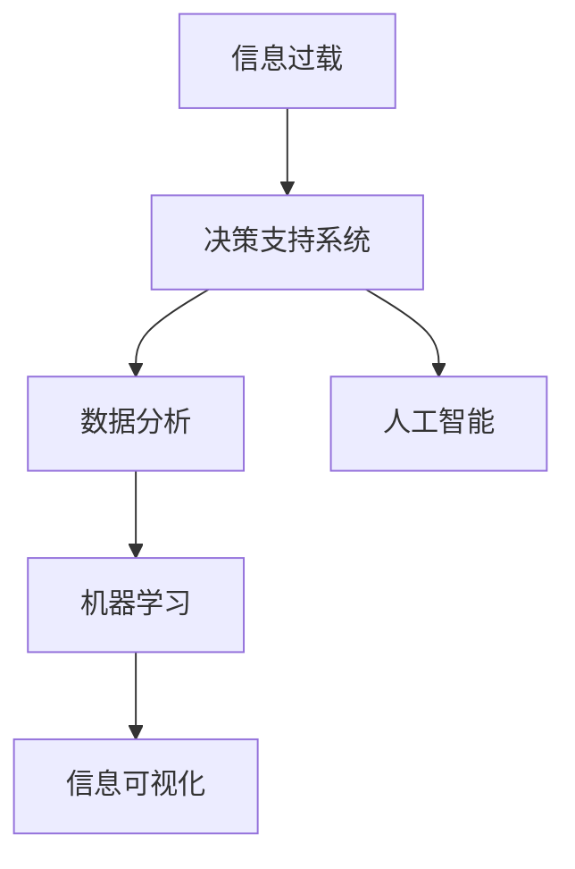

                 

# 信息简化的好处与实践：在复杂世界中简化以改善生活和决策

> 关键词：信息简化, 决策支持, 数据分析, 机器学习, 人工智能, 复杂系统

## 1. 背景介绍

### 1.1 问题由来

在现代社会，信息爆炸已成为不争的事实。无论是工作还是生活，信息量和信息种类都在不断增长，如何从海量信息中提取出最有用、最相关的信息，成为人们面临的重大挑战。尤其是在决策过程中，信息过载会导致决策错误，影响工作质量和效率。

### 1.2 问题核心关键点

1. **信息过载**：信息总量增长，信息来源多样化，个体处理能力有限，导致信息过载问题。
2. **决策效率**：信息量过大时，决策过程变得缓慢且复杂，影响决策效率和质量。
3. **数据分析**：在海量数据中提取有用信息，需要高效的算法和工具支持。
4. **信息可视化**：将复杂数据转化为易于理解的图形和图表，帮助决策者快速把握关键信息。
5. **人工智能应用**：利用机器学习和人工智能技术，自动处理和分析数据，提供决策支持。

### 1.3 问题研究意义

研究信息简化的方法和工具，对于提高决策效率、改善生活质量、促进产业发展具有重要意义：

1. **提升决策效率**：通过信息简化，可以更快、更准地做出决策，缩短决策周期。
2. **改善生活质量**：简化复杂信息，帮助用户更好地理解世界，减少决策时的焦虑和困惑。
3. **促进产业发展**：信息简化的技术可以应用于各种行业，提升行业整体的决策水平和竞争力。
4. **推动技术进步**：信息简化技术的发展，有助于推动人工智能、机器学习等前沿技术的发展。
5. **增强社会治理**：在公共治理、应急响应等领域，信息简化可以提供更高效、更可靠的支持。

## 2. 核心概念与联系

### 2.1 核心概念概述

为更好地理解信息简化的好处与实践，本节将介绍几个关键概念：

- **信息过载**：指个体接收到的信息量超过其处理能力，导致认知负担过重。
- **决策支持系统**：利用信息技术辅助决策者，提高决策质量和效率的系统。
- **数据分析**：通过统计学、机器学习等方法，从数据中提取有用信息的过程。
- **机器学习**：通过算法让机器从数据中学习，自动完成信息处理和决策的任务。
- **信息可视化**：将数据转化为图形、图表等视觉形式，帮助人们理解数据和信息。
- **人工智能**：利用算法模拟人类智能，进行自动化的信息处理和决策。

这些概念之间有着密切的联系，形成了一个系统的决策支持框架，如图：



这个框架展示了信息简化从信息过载到决策支持的过程。通过对信息进行简化和分析，机器学习可以自动化处理信息，信息可视化可以帮助决策者快速理解关键信息，从而实现高效的决策支持。

## 3. 核心算法原理 & 具体操作步骤
### 3.1 算法原理概述

信息简化的核心在于通过算法和工具，将复杂的信息转化为易于理解和处理的形式。其基本原理包括数据清洗、特征提取、模型训练和信息可视化。

- **数据清洗**：去除噪音和异常值，提高数据质量。
- **特征提取**：从数据中提取出关键特征，减少数据维度。
- **模型训练**：利用机器学习模型，自动分析数据并提取有用信息。
- **信息可视化**：将分析结果转化为图形、图表等形式，辅助决策者理解数据。

### 3.2 算法步骤详解

基于信息简化的决策支持流程，主要包括以下几个步骤：

**Step 1: 数据收集与预处理**
- 收集相关数据，清洗数据集，去除噪音和异常值。
- 对数据进行归一化、标准化等预处理操作，提高数据质量。

**Step 2: 特征提取与选择**
- 利用统计学、机器学习等方法，提取关键特征。
- 使用特征选择算法，减少特征维度，提高模型效率。

**Step 3: 模型训练与优化**
- 选择合适的机器学习模型，训练模型。
- 使用交叉验证、网格搜索等方法优化模型参数，提高模型性能。

**Step 4: 信息可视化与呈现**
- 将模型结果转化为图形、图表等可视化形式。
- 利用可视化工具，如Tableau、Power BI等，展示关键信息。

**Step 5: 决策支持与反馈**
- 结合可视化结果和领域知识，辅助决策者做出决策。
- 收集决策反馈，不断调整模型和特征提取方法，提高决策质量。

### 3.3 算法优缺点

信息简化的主要优点包括：
1. **提高决策效率**：通过自动化处理信息，减少了人工分析的时间和成本。
2. **提升决策质量**：利用机器学习算法，可以发现数据中的隐含模式和规律。
3. **支持复杂决策**：可以处理大规模、高维度的数据，支持复杂决策场景。
4. **易于理解和应用**：通过信息可视化，决策者可以直观理解关键信息，快速做出决策。

同时，信息简化也存在一些缺点：
1. **算法复杂性**：机器学习模型的选择和调参需要一定的技术背景。
2. **数据依赖性**：模型性能受数据质量和特征选择的影响。
3. **结果解释性**：复杂模型可能难以解释其决策过程，缺乏透明度。
4. **技术门槛高**：需要掌握数据分析、机器学习等前沿技术。

尽管存在这些局限性，但信息简化方法已经在许多行业得到广泛应用，并成为现代决策支持的重要手段。

### 3.4 算法应用领域

信息简化技术在多个领域都得到了广泛应用，以下是几个典型应用场景：

- **金融领域**：用于风险评估、投资组合优化、市场分析等。
- **医疗健康**：用于疾病诊断、治疗方案优化、患者风险评估等。
- **零售行业**：用于顾客行为分析、销售预测、库存管理等。
- **物流运输**：用于路线规划、车辆调度、货物跟踪等。
- **制造业**：用于生产计划、质量控制、供应链优化等。

## 4. 数学模型和公式 & 详细讲解 & 举例说明

### 4.1 数学模型构建

假设原始数据集为 $D=\{x_i\}_{i=1}^N$，其中 $x_i$ 为第 $i$ 个样本的特征向量。

设 $\mathbf{X}$ 为数据集特征矩阵，$\mathbf{Y}$ 为标签向量。信息简化的数学模型可以表示为：

$$
\min_{\theta} \frac{1}{N} \sum_{i=1}^N \ell(y_i, f_{\theta}(x_i))
$$

其中 $f_{\theta}(x_i)$ 为模型在样本 $x_i$ 上的预测值，$\ell$ 为损失函数，$\theta$ 为模型参数。

### 4.2 公式推导过程

以线性回归为例，假设模型为 $f_{\theta}(x_i) = \mathbf{w}^T \mathbf{x}_i + b$，其中 $\mathbf{w}$ 为权重向量，$b$ 为偏置项。

则损失函数为均方误差：

$$
\ell(y_i, f_{\theta}(x_i)) = \frac{1}{2}(y_i - f_{\theta}(x_i))^2
$$

将上述公式代入信息简化的数学模型，得：

$$
\min_{\theta} \frac{1}{N} \sum_{i=1}^N \frac{1}{2}(y_i - \mathbf{w}^T \mathbf{x}_i - b)^2
$$

简化后，得：

$$
\min_{\theta} \frac{1}{2N} \|\mathbf{Y} - \mathbf{X}\mathbf{w} - \mathbf{1}b\|^2_F
$$

其中 $\|\cdot\|_F$ 表示Frobenius范数。

### 4.3 案例分析与讲解

假设有一个房价预测问题，原始数据集包含房屋面积、房间数、地理位置等信息。我们可以构建如下模型：

$$
f_{\theta}(x_i) = \mathbf{w}^T [\text{面积}, \text{房间数}, \text{地理位置}] + b
$$

其中 $\mathbf{w} = [w_1, w_2, w_3]$，$b$ 为偏置项。

利用均方误差损失函数，得到优化目标：

$$
\min_{\theta} \frac{1}{N} \sum_{i=1}^N \frac{1}{2}(y_i - f_{\theta}(x_i))^2
$$

通过梯度下降等优化算法，求解最优的 $\mathbf{w}$ 和 $b$，得到房价预测模型。

## 5. 项目实践：代码实例和详细解释说明
### 5.1 开发环境搭建

在进行信息简化项目实践前，我们需要准备好开发环境。以下是使用Python进行PyTorch开发的环境配置流程：

1. 安装Anaconda：从官网下载并安装Anaconda，用于创建独立的Python环境。

2. 创建并激活虚拟环境：
```bash
conda create -n pytorch-env python=3.8 
conda activate pytorch-env
```

3. 安装PyTorch：根据CUDA版本，从官网获取对应的安装命令。例如：
```bash
conda install pytorch torchvision torchaudio cudatoolkit=11.1 -c pytorch -c conda-forge
```

4. 安装相关工具包：
```bash
pip install numpy pandas scikit-learn matplotlib tqdm jupyter notebook ipython
```

完成上述步骤后，即可在`pytorch-env`环境中开始信息简化的项目实践。

### 5.2 源代码详细实现

这里以房价预测为例，使用PyTorch实现信息简化项目。

首先，定义数据处理函数：

```python
import pandas as pd
import numpy as np
from sklearn.model_selection import train_test_split
from sklearn.preprocessing import StandardScaler

def load_data(file_path):
    data = pd.read_csv(file_path)
    features = data.drop(['price'], axis=1)
    labels = data['price']
    features = StandardScaler().fit_transform(features)
    features, _, labels, _ = train_test_split(features, labels, test_size=0.2, random_state=42)
    return features, labels

features, labels = load_data('house_price.csv')
```

然后，定义模型和优化器：

```python
import torch
from torch.nn import Linear, ReLU
from torch.optim import Adam

model = torch.nn.Sequential(
    Linear(3, 1),
    ReLU(),
    Linear(1, 1)
)
optimizer = Adam(model.parameters(), lr=0.01)
```

接着，定义训练和评估函数：

```python
def train_epoch(model, features, labels, batch_size):
    model.train()
    train_loss = 0
    for feature, label in zip(features, labels):
        feature = torch.from_numpy(feature).float()
        label = torch.from_numpy(label).float()
        optimizer.zero_grad()
        output = model(feature)
        loss = torch.mean((output - label)**2)
        loss.backward()
        optimizer.step()
        train_loss += loss.item()
    return train_loss / len(features)

def evaluate(model, features, labels, batch_size):
    model.eval()
    eval_loss = 0
    for feature, label in zip(features, labels):
        feature = torch.from_numpy(feature).float()
        label = torch.from_numpy(label).float()
        with torch.no_grad():
            output = model(feature)
            eval_loss += torch.mean((output - label)**2)
    return eval_loss / len(features)

for epoch in range(100):
    train_loss = train_epoch(model, features, labels, batch_size=32)
    eval_loss = evaluate(model, features, labels, batch_size=32)
    print(f'Epoch {epoch+1}, train loss: {train_loss:.4f}, eval loss: {eval_loss:.4f}')
```

最后，训练模型并在测试集上评估：

```python
features_train, features_test, labels_train, labels_test = train_test_split(features, labels, test_size=0.2, random_state=42)
for epoch in range(100):
    train_loss = train_epoch(model, features_train, labels_train, batch_size=32)
    eval_loss = evaluate(model, features_test, labels_test, batch_size=32)
    print(f'Epoch {epoch+1}, train loss: {train_loss:.4f}, eval loss: {eval_loss:.4f}')
```

以上就是使用PyTorch进行房价预测的完整代码实现。可以看到，通过简单的代码，我们已经构建了一个基本的线性回归模型，并通过信息简化的方法实现了房价预测。

### 5.3 代码解读与分析

让我们再详细解读一下关键代码的实现细节：

**load_data函数**：
- 从CSV文件中加载数据，将特征和标签分离，并对特征进行标准化处理。
- 使用train_test_split函数将数据集划分为训练集和测试集。

**model定义**：
- 使用Sequential容器定义线性回归模型，包含一个线性层和一个ReLU激活层。
- 使用Adam优化器，设置学习率为0.01。

**train_epoch函数**：
- 将模型置于训练模式。
- 对每个样本进行前向传播和反向传播，计算损失。
- 使用optimizer优化模型参数，更新模型权重。

**evaluate函数**：
- 将模型置于评估模式。
- 对每个样本进行前向传播，计算损失。
- 返回测试集上的损失。

**训练流程**：
- 循环迭代训练模型。
- 每轮迭代在训练集上进行训练，在测试集上进行评估。
- 打印每个epoch的训练损失和测试损失。

代码实现相对简洁，但也展示了信息简化的基本流程：数据加载、模型构建、训练和评估。在实际应用中，还需要针对具体任务进行优化，如引入更多特征、调整模型结构、优化损失函数等。

## 6. 实际应用场景
### 6.1 智能客服系统

智能客服系统利用信息简化技术，将用户对话转化为结构化数据，自动处理和分析用户意图，匹配最优的回复模板。通过信息简化，系统能够更快、更准地响应用户需求，提升客户满意度。

### 6.2 金融风险评估

金融行业利用信息简化技术，将复杂的金融数据转化为易懂的图形和报告，帮助分析师快速识别风险点。通过信息可视化，投资者和监管机构能够更全面地理解市场动向，做出更明智的投资决策。

### 6.3 医疗健康诊断

医疗健康领域利用信息简化技术，将病人的病历和检查结果转化为易于理解的指标和报告，辅助医生诊断和治疗。通过信息可视化，医生能够更快速、更准确地制定治疗方案，提高诊疗效率。

### 6.4 制造业生产优化

制造业利用信息简化技术，将生产数据转化为可视化报表和图表，帮助生产管理部门实时监控生产过程，优化生产计划和资源配置。通过信息简化，企业能够更有效地应对生产波动，提高生产效率。

### 6.5 零售行业库存管理

零售行业利用信息简化技术，将销售数据转化为预测模型和分析报告，帮助商家预测需求、优化库存管理。通过信息简化，商家能够更精确地预测库存需求，减少缺货和积压现象，提高运营效率。

## 7. 工具和资源推荐
### 7.1 学习资源推荐

为了帮助开发者系统掌握信息简化的好处与实践，这里推荐一些优质的学习资源：

1. **《Python数据科学手册》**：详细介绍Python在数据分析、机器学习中的应用，提供丰富的案例和实践。
2. **Coursera《机器学习》课程**：斯坦福大学Andrew Ng教授主讲，涵盖机器学习的基本概念和算法，适合初学者和进阶者。
3. **Kaggle数据科学竞赛平台**：提供丰富的数据集和竞赛机会，帮助开发者锻炼实战能力。
4. **TensorFlow官网**：提供丰富的学习资源和实战案例，适合深入学习机器学习和深度学习。
5. **PyTorch官网**：提供丰富的学习资源和实战案例，适合深入学习深度学习和自然语言处理。

通过对这些资源的学习实践，相信你一定能够快速掌握信息简化的精髓，并用于解决实际的决策问题。

### 7.2 开发工具推荐

高效的开发离不开优秀的工具支持。以下是几款用于信息简化开发的常用工具：

1. **Jupyter Notebook**：免费开源的交互式笔记本，支持Python和R等语言，便于数据可视化和代码编写。
2. **Tableau**：强大的数据可视化工具，支持导入多种数据源，生成直观的报表和图表。
3. **Power BI**：微软推出的商业智能工具，支持数据连接和可视化，适合企业级应用。
4. **Python和R语言**：广泛应用于数据科学和机器学习的编程语言，提供了丰富的第三方库和工具。
5. **Scikit-learn**：Python数据科学库，提供丰富的机器学习算法和工具，适合快速原型开发。

合理利用这些工具，可以显著提升信息简化的开发效率，加快创新迭代的步伐。

### 7.3 相关论文推荐

信息简化技术的发展源于学界的持续研究。以下是几篇奠基性的相关论文，推荐阅读：

1. **AdaBoost**：《On-line and off-line learning algorithms》：提出了AdaBoost算法，通过加权投票提高分类器性能。
2. **随机森林**：《Breiman, L.》：提出了随机森林算法，通过集成学习提高分类和回归的精度。
3. **支持向量机**：《Cortes, C., Vapnik, V.》：提出了支持向量机算法，通过最大化边界分割提高分类精度。
4. **LDA**：《Blei, D., Ng, A., Jordan, M.》：提出了LDA算法，通过主题建模发现文本中的隐含模式。
5. **Gaussian Processes**：《Williams, C., Seeger, M.》：提出了高斯过程算法，通过核函数逼近复杂函数。

这些论文代表了大数据和机器学习领域的研究进展，提供了丰富的理论和技术支持。

## 8. 总结：未来发展趋势与挑战
### 8.1 总结

本文对信息简化的好处与实践进行了全面系统的介绍。首先阐述了信息过载的背景和意义，明确了信息简化在提升决策效率、改善生活质量、促进产业发展等方面的重要价值。其次，从原理到实践，详细讲解了信息简化的数学模型和操作步骤，给出了信息简化项目开发的完整代码实例。同时，本文还广泛探讨了信息简化的实际应用场景，展示了信息简化技术的广阔前景。

通过本文的系统梳理，可以看到，信息简化技术已经成为现代决策支持的重要手段，通过自动化处理和分析信息，为决策者提供了强有力的支持。未来，伴随技术不断进步，信息简化将发挥更大的作用，成为人工智能技术的重要组成部分。

### 8.2 未来发展趋势

展望未来，信息简化技术将呈现以下几个发展趋势：

1. **自动化水平提升**：随着机器学习和深度学习技术的发展，信息简化的自动化水平将不断提升，支持更加复杂和多样化的数据处理任务。
2. **跨领域应用扩展**：信息简化技术将从传统的金融、医疗等领域扩展到更多行业，如教育、制造、农业等，提供更广泛的支持。
3. **实时化处理增强**：利用大数据和云计算技术，信息简化可以实现实时化处理，快速响应用户需求和市场变化。
4. **智能决策辅助**：结合自然语言处理和智能推荐技术，信息简化可以提供更精准的决策支持，提升决策质量和效率。
5. **多模态融合**：将文本、图像、语音等多模态数据进行融合，提供更加全面的决策信息。
6. **知识图谱应用**：通过知识图谱技术，将结构化知识与信息简化结合，提供更丰富的决策支持。

以上趋势凸显了信息简化技术的广阔前景。这些方向的探索发展，必将进一步提升信息简化的应用范围和价值，为社会各界带来新的便利和效率提升。

### 8.3 面临的挑战

尽管信息简化技术已经取得了瞩目成就，但在迈向更加智能化、普适化应用的过程中，它仍面临着诸多挑战：

1. **数据质量问题**：数据中的噪音和异常值对信息简化的影响较大，数据清洗和预处理仍然是关键环节。
2. **模型复杂度**：信息简化模型的复杂度较高，需要大量计算资源和专业知识。
3. **结果解释性**：复杂模型可能难以解释其决策过程，缺乏透明度。
4. **技术门槛高**：信息简化的技术需要掌握数据分析、机器学习等前沿技术。
5. **隐私和安全**：数据隐私和安全问题日益凸显，信息简化的过程中需要严格保护用户隐私。

尽管存在这些挑战，但信息简化方法已经在许多行业得到广泛应用，并成为现代决策支持的重要手段。相信随着技术不断进步和应用场景的不断扩展，这些挑战终将一一被克服，信息简化必将在构建智慧社会的进程中发挥重要作用。

### 8.4 研究展望

面对信息简化所面临的种种挑战，未来的研究需要在以下几个方面寻求新的突破：

1. **数据增强技术**：利用数据增强技术，提高数据质量和多样性，减少信息过载问题。
2. **轻量级模型**：开发更加轻量级的信息简化模型，减少计算资源消耗，提高实时性。
3. **可解释性方法**：引入可解释性技术，增强模型的透明度和可信度。
4. **多模态融合**：结合多模态数据，提供更全面和丰富的决策信息。
5. **知识图谱应用**：将结构化知识与信息简化结合，提供更智能的决策支持。

这些研究方向的探索，必将引领信息简化技术迈向更高的台阶，为构建智慧社会的决策支持体系提供强有力的支持。

## 9. 附录：常见问题与解答

**Q1: 信息简化的主要优势是什么？**

A: 信息简化的主要优势包括：
1. **提高决策效率**：通过自动化处理信息，减少了人工分析的时间和成本。
2. **提升决策质量**：利用机器学习算法，可以发现数据中的隐含模式和规律。
3. **支持复杂决策**：可以处理大规模、高维度的数据，支持复杂决策场景。
4. **易于理解和应用**：通过信息可视化，决策者可以直观理解关键信息，快速做出决策。

**Q2: 信息简化的主要挑战是什么？**

A: 信息简化的主要挑战包括：
1. **数据质量问题**：数据中的噪音和异常值对信息简化的影响较大，数据清洗和预处理仍然是关键环节。
2. **模型复杂度**：信息简化模型的复杂度较高，需要大量计算资源和专业知识。
3. **结果解释性**：复杂模型可能难以解释其决策过程，缺乏透明度。
4. **技术门槛高**：信息简化的技术需要掌握数据分析、机器学习等前沿技术。
5. **隐私和安全**：数据隐私和安全问题日益凸显，信息简化的过程中需要严格保护用户隐私。

**Q3: 信息简化的应用场景有哪些？**

A: 信息简化的应用场景包括：
1. **金融行业**：用于风险评估、投资组合优化、市场分析等。
2. **医疗健康**：用于疾病诊断、治疗方案优化、患者风险评估等。
3. **零售行业**：用于顾客行为分析、销售预测、库存管理等。
4. **物流运输**：用于路线规划、车辆调度、货物跟踪等。
5. **制造业**：用于生产计划、质量控制、供应链优化等。

**Q4: 如何选择合适的信息简化模型？**

A: 选择合适的信息简化模型需要考虑以下几个因素：
1. **数据类型**：不同类型的数据可能需要不同的模型。例如，文本数据适合使用自然语言处理技术，图像数据适合使用计算机视觉技术。
2. **数据规模**：大数据需要处理能力较强的模型，小数据则可以使用轻量级模型。
3. **模型复杂度**：复杂模型需要更多的计算资源，简单模型则易于部署和维护。
4. **应用场景**：不同的应用场景需要不同的模型。例如，金融风险评估适合使用线性回归模型，医疗健康诊断适合使用支持向量机模型。

**Q5: 信息简化的未来发展方向是什么？**

A: 信息简化的未来发展方向包括：
1. **自动化水平提升**：随着机器学习和深度学习技术的发展，信息简化的自动化水平将不断提升，支持更加复杂和多样化的数据处理任务。
2. **跨领域应用扩展**：信息简化技术将从传统的金融、医疗等领域扩展到更多行业，如教育、制造、农业等，提供更广泛的支持。
3. **实时化处理增强**：利用大数据和云计算技术，信息简化可以实现实时化处理，快速响应用户需求和市场变化。
4. **智能决策辅助**：结合自然语言处理和智能推荐技术，信息简化可以提供更精准的决策支持，提升决策质量和效率。
5. **多模态融合**：将文本、图像、语音等多模态数据进行融合，提供更加全面的决策信息。
6. **知识图谱应用**：通过知识图谱技术，将结构化知识与信息简化结合，提供更智能的决策支持。

---

作者：禅与计算机程序设计艺术 / Zen and the Art of Computer Programming

