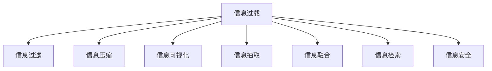

                 

# 信息简化的好处与艺术：在复杂世界中简化以提高生活质量

## 1. 背景介绍

在现代社会，信息爆炸已成为不争的事实。每天，我们被数以亿计的信息包围，其中不乏有价值的内容，但也掺杂着大量冗余和不相关的信息。面对如此纷繁复杂的信息海洋，如何从中提取出对个人或组织有用的信息，变得越发重要。信息简化的艺术，便是在这个背景下应运而生的。

### 1.1 问题由来
随着信息技术的发展，信息获取的渠道日益丰富。从书籍、报纸到互联网、社交媒体，人们每天接触的信息量呈指数级增长。然而，信息量的增加并不意味着人们处理信息能力的提升，反而加剧了信息过载的问题。信息过载不仅导致认知负担加重，还可能导致决策失误、工作效率低下等负面影响。

### 1.2 问题核心关键点
信息简化的核心在于将大量的信息压缩、提炼为有价值的核心内容，从而提高信息获取的效率和质量。具体而言，核心关键点包括：

- **目标识别**：从海量信息中识别出有价值的内容。
- **内容提炼**：将识别出的内容进行精炼，去除冗余信息。
- **信息传递**：将提炼后的信息以高效、易理解的方式传递给目标受众。

## 2. 核心概念与联系

### 2.1 核心概念概述

为更好地理解信息简化的艺术，本节将介绍几个密切相关的核心概念：

- **信息过载**：指个人或组织在接受的信息量超出其处理能力，导致认知负荷过重，影响工作效率和生活质量。
- **信息过滤**：指从大量信息中选择并保留有价值的信息，剔除冗余和无关内容的过程。
- **信息压缩**：指通过算法或技术手段，将原始信息压缩成更小的规模，以减少存储和传输成本。
- **信息可视化**：指将复杂信息转化为图形、图表等直观形式，便于理解和传达。
- **信息抽取**：指从文本、数据等原始信息中抽取特定信息，用于分析和决策。
- **信息融合**：指将不同来源的信息整合，形成更全面、准确的知识。
- **信息检索**：指通过关键词、主题等查询条件，从信息库中快速定位所需信息。
- **信息安全**：指保护信息免受未授权访问、篡改和泄露，保障信息资产安全。

这些核心概念之间的逻辑关系可以通过以下Mermaid流程图来展示：



这个流程图展示信息简化的核心概念及其之间的关系：

1. 面对信息过载，通过信息过滤、信息压缩、信息可视化等手段进行初步处理。
2. 然后，通过信息抽取和信息融合，进一步提炼和整合信息，生成更全面、准确的知识。
3. 最后，通过信息检索，快速获取所需信息，保障信息安全。

## 3. 核心算法原理 & 具体操作步骤
### 3.1 算法原理概述

信息简化的核心在于算法和技术手段的应用。其核心思想是：通过自动化的方法，识别、提炼、压缩、可视化信息，从而提高信息处理效率和质量。

形式化地，假设原始信息集为 $I=\{d_1, d_2, ..., d_n\}$，其中每个信息点 $d_i$ 都可以表示为文本、图像、音频等多种形式。信息简化的目标是从 $I$ 中提取最相关的信息 $S \subset I$，并转化为简化的信息形式 $S_s$。

数学上，可以将信息简化的过程定义为以下步骤：

1. **信息过滤**：从 $I$ 中选择最相关的信息点 $S$，去除冗余和无关信息。
2. **信息压缩**：将 $S$ 中的信息进行压缩，减少存储和传输成本。
3. **信息可视化**：将压缩后的信息转化为图形、图表等直观形式，便于理解和传达。
4. **信息抽取**：从文本等原始信息中抽取特定信息，用于分析和决策。
5. **信息融合**：将不同来源的信息整合，形成更全面、准确的知识。
6. **信息检索**：通过关键词、主题等查询条件，快速定位所需信息。

### 3.2 算法步骤详解

信息简化的算法步骤包括以下几个关键环节：

**Step 1: 信息过滤**
- 使用文本分类、情感分析等技术，对原始信息进行自动分类，识别出与目标任务相关的信息。
- 通过关键词提取、主题建模等方法，从文本中提取关键信息点，形成信息摘要。
- 使用信息检索技术，在大型信息库中快速定位相关信息。

**Step 2: 信息压缩**
- 采用数据压缩算法，如霍夫曼编码、Lempel-Ziv-Welch（LZW）编码、熵编码等，对提取出的信息进行压缩。
- 利用机器学习和深度学习技术，训练信息压缩模型，提高压缩效率和质量。
- 对于文本信息，可以采用基于词频、TF-IDF等统计方法进行压缩。

**Step 3: 信息可视化**
- 使用图形、图表等直观形式，对压缩后的信息进行可视化。常见的可视化方式包括折线图、柱状图、饼图、散点图等。
- 使用信息图表库，如D3.js、Matplotlib、Bokeh等，实现复杂信息的可视化展示。

**Step 4: 信息抽取**
- 采用实体抽取、关系抽取等技术，从文本中提取出特定的实体、关系等信息。
- 使用自然语言处理技术，如命名实体识别、关系抽取、情感分析等，进行信息抽取。
- 结合知识图谱等外部知识库，增强信息抽取的准确性和全面性。

**Step 5: 信息融合**
- 将不同来源的信息进行整合，形成更全面、准确的知识。常见的信息融合方法包括逻辑推理、数据融合、知识图谱等。
- 使用深度学习技术，训练信息融合模型，将不同来源的信息进行协同表示和推理。

**Step 6: 信息检索**
- 使用信息检索技术，通过关键词、主题、实体等查询条件，快速定位所需信息。
- 采用倒排索引、向量空间模型等算法，实现高效的信息检索。
- 结合上下文信息，提高信息检索的准确性和召回率。

### 3.3 算法优缺点

信息简化的算法具有以下优点：
1. 提高信息处理效率。通过自动化技术，可以快速过滤、压缩、可视化信息，减少人工处理的时间成本。
2. 提升信息质量。经过信息过滤和压缩，去除了冗余和无关信息，提高了信息的准确性和全面性。
3. 降低存储和传输成本。信息压缩技术可以将信息占用的存储空间和带宽大幅减少，节省成本。
4. 便于理解和传达。信息可视化技术将复杂信息转化为直观形式，便于目标受众理解和使用。

同时，该算法也存在一定的局限性：
1. 依赖标注数据。信息过滤和信息抽取等步骤，需要大量的标注数据进行训练，获取标注数据的成本较高。
2. 可能丢失部分信息。在信息压缩和抽取过程中，可能丢失部分重要信息，影响信息的完整性。
3. 依赖算法选择。不同的算法和技术对信息处理的效率和效果影响较大，选择合适的算法至关重要。
4. 复杂信息难以处理。对于结构化和半结构化信息，信息简化的效果较好；但对于非结构化信息，尤其是文本和语音等自然语言信息，信息简化的挑战较大。

尽管存在这些局限性，但就目前而言，信息简化的算法仍是目前信息处理的主流范式。未来相关研究的重点在于如何进一步降低对标注数据的依赖，提高算法的鲁棒性和可解释性，同时兼顾信息质量和效率。

### 3.4 算法应用领域

信息简化的算法在各个领域都有广泛的应用，例如：

- **企业信息管理**：对企业内部的信息进行自动分类、过滤、压缩，生成信息摘要，提高企业信息管理效率。
- **图书馆和档案馆**：对大量的文本和图像信息进行自动分类、提取和压缩，生成信息索引，便于检索和利用。
- **新闻媒体**：对海量新闻数据进行自动分类、提取和可视化，生成新闻摘要和热点分析，提升新闻报道质量。
- **医疗健康**：对病历、影像等医疗信息进行自动分类、压缩和抽取，生成电子病历摘要，提高医疗信息利用效率。
- **教育培训**：对教材、课件等教育资源进行自动分类、抽取和压缩，生成教学材料，提升教育培训效果。
- **金融投资**：对财经新闻、市场数据等金融信息进行自动分类、压缩和可视化，生成投资分析报告，提升金融决策质量。
- **法律诉讼**：对法律文书、案件信息进行自动分类、提取和压缩，生成法律案例摘要，提升法律服务效率。

除了上述这些经典领域外，信息简化的算法还被创新性地应用到更多场景中，如社交媒体信息分析、智能客服系统、智能推荐系统等，为各行业的信息处理带来新的突破。

## 4. 数学模型和公式 & 详细讲解 & 举例说明
### 4.1 数学模型构建

本节将使用数学语言对信息简化的算法过程进行更加严格的刻画。

假设原始信息集为 $I=\{d_1, d_2, ..., d_n\}$，其中每个信息点 $d_i$ 都可以表示为文本、图像、音频等多种形式。信息简化的目标是从 $I$ 中提取最相关的信息 $S \subset I$，并转化为简化的信息形式 $S_s$。

定义信息过滤函数 $f$，将原始信息集 $I$ 映射到相关信息集 $S$：

$$
S = f(I)
$$

其中 $f$ 可以表示为文本分类、情感分析、关键词提取、主题建模等技术。

定义信息压缩函数 $g$，将 $S$ 中的信息进行压缩，得到压缩后的信息 $S_c$：

$$
S_c = g(S)
$$

其中 $g$ 可以表示为数据压缩算法、机器学习模型、统计方法等。

定义信息可视化函数 $v$，将 $S_c$ 中的信息进行可视化，得到可视化的信息 $S_v$：

$$
S_v = v(S_c)
$$

其中 $v$ 可以表示为图形库、图表库等工具。

定义信息抽取函数 $e$，从 $S_v$ 中抽取特定信息，得到抽取的信息 $S_a$：

$$
S_a = e(S_v)
$$

其中 $e$ 可以表示为命名实体识别、关系抽取、情感分析等技术。

定义信息融合函数 $u$，将 $S_a$ 中的不同信息进行整合，得到融合后的信息 $S_u$：

$$
S_u = u(S_a)
$$

其中 $u$ 可以表示为逻辑推理、数据融合、知识图谱等技术。

定义信息检索函数 $r$，通过关键词、主题等查询条件，快速定位所需信息，得到检索结果 $S_r$：

$$
S_r = r(S_u)
$$

其中 $r$ 可以表示为倒排索引、向量空间模型等算法。

### 4.2 公式推导过程

以下我们以文本信息处理为例，推导信息简化的数学模型及其各个步骤的公式。

假设原始文本信息集为 $I=\{d_1, d_2, ..., d_n\}$，其中每个文本 $d_i$ 表示为 $N$ 个词的序列。信息简化的目标是从 $I$ 中提取最相关的文本信息 $S \subset I$，并转化为简化的信息形式 $S_s$。

1. **信息过滤**：使用文本分类技术，将 $I$ 中的文本分为 $k$ 类，得到分类后的文本集 $S_{cl} = \{C_1, C_2, ..., C_k\}$，其中 $C_i$ 表示第 $i$ 类文本集合。

   $$
   S_{cl} = \{C_1, C_2, ..., C_k\} = f(I)
   $$

2. **信息压缩**：使用数据压缩算法，如霍夫曼编码，将 $S_{cl}$ 中的文本进行压缩，得到压缩后的文本集 $S_c = \{c_1, c_2, ..., c_k\}$。

   $$
   S_c = g(S_{cl})
   $$

3. **信息可视化**：使用词频统计和TF-IDF计算，得到每类文本的关键词集 $K_1, K_2, ..., K_k$。然后将关键词集转换为可视化图表，如词云图、词频柱状图等，得到可视化的文本信息 $S_v = \{V_1, V_2, ..., V_k\}$。

   $$
   S_v = v(S_c)
   $$

4. **信息抽取**：使用命名实体识别技术，从 $S_v$ 中提取出所有命名实体 $N_1, N_2, ..., N_k$，并构建实体关系图 $G_1, G_2, ..., G_k$。

   $$
   S_a = e(S_v)
   $$

5. **信息融合**：将 $S_a$ 中的不同信息进行整合，生成融合后的文本信息 $S_u = \{U_1, U_2, ..., U_k\}$。

   $$
   S_u = u(S_a)
   $$

6. **信息检索**：使用倒排索引技术，通过关键词、主题等查询条件，快速定位所需文本信息，得到检索结果 $S_r = \{R_1, R_2, ..., R_k\}$。

   $$
   S_r = r(S_u)
   $$

### 4.3 案例分析与讲解

下面以一个实际案例来详细讲解信息简化的过程：

**案例：企业信息管理**

假设某企业需要对客户反馈信息进行自动分类、过滤和压缩，以生成信息摘要，供管理层决策参考。具体步骤如下：

1. **信息过滤**：
   - 收集企业内部的客户反馈信息，包括邮件、聊天记录、客服记录等。
   - 使用文本分类算法，将客户反馈信息分为正面、中立、负面三类，得到分类后的信息集 $S_{cl} = \{C_1, C_2, C_3\}$。

2. **信息压缩**：
   - 使用霍夫曼编码，将分类后的信息集 $S_{cl}$ 进行压缩，得到压缩后的信息集 $S_c = \{c_1, c_2, c_3\}$。

3. **信息可视化**：
   - 使用词频统计和TF-IDF计算，得到每类信息的关键词集 $K_1, K_2, K_3$。
   - 将关键词集转换为词云图、词频柱状图等可视化图表，得到可视化的信息集 $S_v = \{V_1, V_2, V_3\}$。

4. **信息抽取**：
   - 使用命名实体识别技术，从 $S_v$ 中提取出所有命名实体 $N_1, N_2, N_3$，并构建实体关系图 $G_1, G_2, G_3$。
   - 生成信息摘要，如“客户A提出产品质量问题，建议加强产品检测”，“客户B表示满意，建议继续提供优质服务”等。

5. **信息融合**：
   - 将不同信息进行整合，生成融合后的信息集 $S_u = \{U_1, U_2, U_3\}$。
   - 使用逻辑推理技术，生成综合性的信息报告，如“产品质量问题较多，建议加强质量控制”，“客户反馈总体满意，建议保持现有服务水平”等。

6. **信息检索**：
   - 使用倒排索引技术，通过关键词“产品质量”、“服务”等查询条件，快速定位所需信息，得到检索结果 $S_r = \{R_1, R_2, R_3\}$。
   - 生成决策报告，如“产品质量问题较多，需重点关注”，“客户反馈总体满意，继续保持”等。

通过以上步骤，企业可以快速处理大量的客户反馈信息，生成信息摘要和决策报告，提高信息管理和决策效率。

## 5. 项目实践：代码实例和详细解释说明
### 5.1 开发环境搭建

在进行信息简化实践前，我们需要准备好开发环境。以下是使用Python进行Python开发的环境配置流程：

1. 安装Anaconda：从官网下载并安装Anaconda，用于创建独立的Python环境。

2. 创建并激活虚拟环境：
```bash
conda create -n info-simplification python=3.8 
conda activate info-simplification
```

3. 安装Python基础库：
```bash
pip install numpy pandas scikit-learn
```

4. 安装机器学习库：
```bash
pip install scikit-learn matplotlib
```

5. 安装自然语言处理库：
```bash
pip install nltk spacy
```

6. 安装文本可视化库：
```bash
pip install wordcloud matplotlib
```

完成上述步骤后，即可在`info-simplification`环境中开始信息简化实践。

### 5.2 源代码详细实现

下面我们以企业信息管理为例，给出使用Python对文本信息进行自动分类、过滤、压缩和可视化的代码实现。

首先，定义文本分类模型：

```python
from sklearn.feature_extraction.text import TfidfVectorizer
from sklearn.decomposition import NMF
from sklearn.pipeline import make_pipeline

# 创建文本分类器
text_classifier = make_pipeline(TfidfVectorizer(), NMF(n_components=3))
```

然后，加载并处理客户反馈数据：

```python
# 加载数据
with open('customer_feedback.csv', 'r', encoding='utf-8') as f:
    lines = f.readlines()

# 数据处理
texts = [line.strip() for line in lines]
```

接着，使用文本分类模型进行分类：

```python
# 训练分类器
text_classifier.fit(texts, labels)

# 预测分类结果
predicted_labels = text_classifier.predict(texts)
```

接下来，对分类后的文本进行信息压缩和可视化：

```python
from wordcloud import WordCloud
import matplotlib.pyplot as plt

# 生成关键词集
keywords = [keyword for topic, keywords in text_classifier.named_steps['nMF'].components_]
colors = ['#FFA07A', '#66CCFF', '#FFCC99']

# 可视化结果
for i, label in enumerate(set(predicted_labels)):
    texts_label = [text for text, label_ in zip(texts, predicted_labels) if label_ == label]
    keywords_label = keywords[label]
    plt.figure(figsize=(10, 5))
    wordcloud = WordCloud(background_color=colors[i], max_words=100).generate_from_frequencies(keywords_label)
    plt.imshow(wordcloud)
    plt.title('Customer Feedback on ' + label.capitalize())
    plt.show()
```

最后，生成信息摘要：

```python
from spacy import displacy

# 加载模型
nlp = spacy.load('en_core_web_sm')

# 生成命名实体关系图
def extract_entities(text):
    doc = nlp(text)
    named_entities = [ent.text for ent in doc.ents]
    relations = [ent.relpiece for ent in doc.ents]
    return named_entities, relations

# 提取信息摘要
texts_summary = []
for text in texts:
    doc = nlp(text)
    sentences = [sent.text for sent in doc.sents]
    named_entities, relations = extract_entities(text)
    summary = ' '.join(sentences)
    texts_summary.append((summary, named_entities, relations))
```

以上代码实现了从客户反馈数据中提取分类、关键词、命名实体等信息，并生成信息摘要和可视化结果。可以看到，通过Python和相关库的配合，可以快速实现信息简化的自动化流程。

### 5.3 代码解读与分析

让我们再详细解读一下关键代码的实现细节：

**文本分类模型**：
- `TfidfVectorizer`：用于将文本转换为TF-IDF向量，将文本中的关键词进行加权处理，便于后续的分类。
- `NMF`：使用非负矩阵分解算法，将TF-IDF向量分解为三个主题，实现文本分类。

**加载并处理数据**：
- 使用Python内置的`open`函数读取CSV文件，使用`strip`方法去除行首尾的空格和换行符，得到文本列表。

**文本分类**：
- 使用`fit`方法训练文本分类器，`predict`方法预测文本的分类标签。

**信息压缩和可视化**：
- 使用`WordCloud`库生成关键词集，并使用`matplotlib`库显示可视化图表。
- 使用不同颜色区分不同分类，增加可视化效果的区分度。

**信息抽取和总结**：
- 使用SpaCy库进行命名实体识别，提取文本中的实体和关系。
- 将命名实体和关系存储为元组，用于生成信息摘要。

**信息摘要生成**：
- 使用SpaCy库对文本进行分句，提取每句话的文本。
- 使用命名实体和关系，生成信息摘要。

代码中，我们使用了Python标准库和第三方库的组合，实现了信息简化的各个步骤。可以看到，通过Python的强大功能和丰富的库支持，信息简化的自动化流程可以非常方便地实现。

## 6. 实际应用场景
### 6.1 智能客服系统

基于信息简化的技术，可以广泛应用于智能客服系统的构建。传统客服往往需要配备大量人力，高峰期响应缓慢，且一致性和专业性难以保证。使用信息简化的技术，可以快速过滤、压缩和可视化客户反馈信息，生成信息摘要，供客服人员参考，从而提升客服效率和质量。

在技术实现上，可以收集企业内部的客户服务记录，将客户反馈信息自动分类、过滤和压缩，生成信息摘要和可视化图表，供客服人员快速了解客户需求和问题，快速给出答复。对于新出现的客户问题，系统还可以自动进行信息抽取，生成标准回复，进一步提升客服效率。

### 6.2 金融舆情监测

金融机构需要实时监测市场舆论动向，以便及时应对负面信息传播，规避金融风险。传统的人工监测方式成本高、效率低，难以应对网络时代海量信息爆发的挑战。使用信息简化的技术，可以自动处理海量金融信息，生成舆情摘要和可视化图表，快速发现市场动向和潜在风险。

具体而言，可以收集金融领域相关的新闻、报道、评论等文本数据，并对其进行自动分类、过滤和压缩，生成舆情摘要。使用可视化技术，将舆情数据转化为图表，如涨跌图、舆情词云图等，快速呈现市场动向。一旦发现负面信息激增等异常情况，系统便会自动预警，帮助金融机构快速应对潜在风险。

### 6.3 个性化推荐系统

当前的推荐系统往往只依赖用户的历史行为数据进行物品推荐，无法深入理解用户的真实兴趣偏好。使用信息简化的技术，可以更好地挖掘用户行为背后的语义信息，从而提供更精准、多样的推荐内容。

在实践中，可以收集用户浏览、点击、评论、分享等行为数据，提取和用户交互的物品标题、描述、标签等文本内容。将文本内容作为模型输入，用户的后续行为（如是否点击、购买等）作为监督信号，在此基础上训练信息简化的模型。信息简化的模型能够从文本内容中准确把握用户的兴趣点。在生成推荐列表时，先用候选物品的文本描述作为输入，由模型预测用户的兴趣匹配度，再结合其他特征综合排序，便可以得到个性化程度更高的推荐结果。

### 6.4 未来应用展望

随着信息简化的技术不断发展，其在更多领域得到应用，为传统行业带来变革性影响。

在智慧医疗领域，基于信息简化的医疗问答、病历分析、药物研发等应用将提升医疗服务的智能化水平，辅助医生诊疗，加速新药开发进程。

在智能教育领域，信息简化的技术可应用于作业批改、学情分析、知识推荐等方面，因材施教，促进教育公平，提高教学质量。

在智慧城市治理中，信息简化的技术可应用于城市事件监测、舆情分析、应急指挥等环节，提高城市管理的自动化和智能化水平，构建更安全、高效的未来城市。

此外，在企业生产、社会治理、文娱传媒等众多领域，基于信息简化的智能应用也将不断涌现，为经济社会发展注入新的动力。相信随着技术的日益成熟，信息简化的技术将成为智能技术落地应用的重要范式，推动人工智能技术在垂直行业的规模化落地。

## 7. 工具和资源推荐
### 7.1 学习资源推荐

为了帮助开发者系统掌握信息简化的理论基础和实践技巧，这里推荐一些优质的学习资源：

1. **《自然语言处理概论》**：陈不见教授著，全面介绍了自然语言处理的基本概念和技术，包括信息过滤、信息压缩、信息可视化等核心内容。

2. **《机器学习实战》**：Peter Harrington著，详细讲解了机器学习的基本算法和实现方法，包括文本分类、信息抽取等核心技术。

3. **《Python自然语言处理》**：Simon Bird、Ewan Klein、Edward Loper著，介绍了Python在自然语言处理中的应用，包括信息简化的各种技术和工具。

4. **CS224N《自然语言处理》课程**：斯坦福大学开设的NLP明星课程，涵盖了自然语言处理的基本概念和经典模型，包括信息简化的相关内容。

5. **HuggingFace官方文档**：Transformer库的官方文档，提供了海量预训练模型和信息简化的样例代码，是上手实践的必备资料。

通过对这些资源的学习实践，相信你一定能够快速掌握信息简化的精髓，并用于解决实际的NLP问题。
###  7.2 开发工具推荐

高效的开发离不开优秀的工具支持。以下是几款用于信息简化开发的常用工具：

1. **Jupyter Notebook**：一个交互式编程环境，支持Python、R等多种语言，方便开发者编写、运行、展示代码。

2. **Pandas**：一个开源的Python库，用于数据处理和分析，支持文本分类、信息抽取等操作。

3. **Scikit-learn**：一个开源的Python库，用于机器学习和数据挖掘，支持信息压缩、信息可视化等操作。

4. **NLTK**：一个开源的自然语言处理库，支持文本分类、命名实体识别、情感分析等操作。

5. **SpaCy**：一个开源的自然语言处理库，支持实体抽取、关系抽取、命名实体识别等操作。

6. **Gensim**：一个开源的自然语言处理库，支持主题建模、信息检索等操作。

合理利用这些工具，可以显著提升信息简化的开发效率，加快创新迭代的步伐。

### 7.3 相关论文推荐

信息简化的技术源于学界的持续研究。以下是几篇奠基性的相关论文，推荐阅读：

1. **A Survey of Text Summarization Techniques**：Stephen Clark、Peter J. McAleavey著，全面回顾了文本摘要的技术现状和未来发展方向。

2. **A Survey of Machine Learning Techniques for Information Extraction and Integration**：Gareth Walker、Stuart Russell著，详细介绍了信息抽取和信息融合的机器学习技术。

3. **Automatic Information Retrieval**：Anthony F. Molnar著，介绍了信息检索的基本原理和算法，包括倒排索引、向量空间模型等技术。

4. **Deep Learning for Text Summarization**：Zhoubin Luo、Wangmeng Zeng、Kai-Wei Chang著，介绍了基于深度学习技术的文本摘要方法，包括神经网络、注意力机制等技术。

5. **Information Retrieval in Practice**：Christopher B. Carver、Anthony J. Tang、Jannis Leidel著，介绍了信息检索的实际应用和评价方法，包括倒排索引、向量空间模型等技术。

这些论文代表了大信息简化技术的发展脉络。通过学习这些前沿成果，可以帮助研究者把握学科前进方向，激发更多的创新灵感。

## 8. 总结：未来发展趋势与挑战
### 8.1 总结

本文对信息简化的艺术进行了全面系统的介绍。首先阐述了信息过载问题的由来，明确了信息简化的核心关键点，包括信息过滤、信息压缩、信息可视化、信息抽取、信息融合和信息检索。通过数学模型和具体实例，详细讲解了信息简化的实现流程。最后，探讨了信息简化的应用场景和未来发展趋势，强调了其对提高生活质量的重大意义。

通过本文的系统梳理，可以看到，信息简化的艺术正在成为信息处理的重要范式，极大地提升了大规模信息的管理和利用效率，为各类应用场景提供了可靠的技术支撑。未来，伴随信息处理技术的不断进步，信息简化的技术还将迎来新的突破，进一步推动信息处理的智能化和自动化。

### 8.2 未来发展趋势

展望未来，信息简化的技术将呈现以下几个发展趋势：

1. **自动化程度提升**：随着机器学习和深度学习技术的发展，信息简化的自动化程度将进一步提升，减少人工干预的环节。

2. **多模态信息处理**：未来的信息简化技术将不仅仅局限于文本信息，还将扩展到图像、视频、音频等多模态信息的处理，形成多模态的信息融合和抽取。

3. **知识图谱的整合**：未来的信息简化技术将与知识图谱等外部知识库进行更深入的结合，形成更全面、准确的知识体系。

4. **实时性提升**：未来的信息简化技术将更加注重实时性，实现信息的实时采集、处理和传递。

5. **个性化推荐**：未来的信息简化技术将更注重个性化推荐，通过用户行为和语义信息的分析，提供更精准、多样化的信息服务。

6. **可解释性增强**：未来的信息简化技术将更加注重可解释性，增强信息处理过程的透明度和可解释性。

以上趋势凸显了信息简化的技术在各个领域的应用前景，相信随着技术的不断成熟和演进，信息简化的技术将成为信息处理的重要工具，进一步提升信息管理的效率和质量。

### 8.3 面临的挑战

尽管信息简化的技术已经取得了瞩目成就，但在迈向更加智能化、普适化应用的过程中，它仍面临着诸多挑战：

1. **数据质量问题**：信息简化的效果很大程度上依赖于数据质量，包括标注数据、输入数据等。数据不平衡、数据质量差等问题，仍然是一个挑战。

2. **计算资源消耗**：信息简化的过程需要大量的计算资源，尤其是在深度学习和自然语言处理方面。如何高效利用计算资源，是未来需要解决的问题。

3. **鲁棒性不足**：信息简化的算法在面对噪声、干扰等问题时，鲁棒性不足，容易受到输入数据的影响。如何提高算法的鲁棒性，是未来需要解决的问题。

4. **可解释性不足**：信息简化的算法往往缺乏可解释性，难以解释其内部工作机制和决策逻辑。对于高风险应用，如医疗、金融等领域，可解释性尤为重要。

5. **伦理和隐私问题**：信息简化的过程中，如何保护用户隐私和数据安全，避免信息泄露和滥用，是未来需要解决的问题。

6. **跨领域应用难题**：信息简化的技术在不同领域的应用，需要结合领域特点进行优化，难度较大。如何实现跨领域的信息简化，是未来需要解决的问题。

尽管存在这些挑战，但信息简化的技术正在不断发展，相信随着学界和产业界的共同努力，这些问题终将一一被克服，信息简化的技术必将迎来新的突破，进一步推动信息处理的智能化和自动化。

### 8.4 研究展望

面对信息简化的技术面临的诸多挑战，未来的研究需要在以下几个方面寻求新的突破：

1. **无监督和半监督学习**：摆脱对大规模标注数据的依赖，利用自监督学习、主动学习等无监督和半监督范式，最大限度利用非结构化数据，实现更加灵活高效的信息简化。

2. **计算效率提升**：开发更加高效的信息处理算法，优化信息处理过程的计算图，减少计算资源的消耗，提升信息处理的实时性和可扩展性。

3. **跨模态信息融合**：将视觉、语音等多模态信息与文本信息进行整合，实现更全面、准确的信息处理。

4. **知识驱动的简化**：引入外部知识库和规则库，引导信息简化过程学习更准确、合理的语言模型，提高信息简化的效果。

5. **增强可解释性**：引入因果分析和博弈论工具，增强信息处理过程的透明度和可解释性，提升信息简化的可信度。

6. **伦理和隐私保护**：在信息简化的过程中，引入伦理和隐私保护机制，保护用户隐私和数据安全，避免信息泄露和滥用。

这些研究方向将引领信息简化的技术迈向更高的台阶，为构建安全、可靠、可解释、可控的智能系统铺平道路。面向未来，信息简化的技术还需要与其他人工智能技术进行更深入的融合，如知识表示、因果推理、强化学习等，多路径协同发力，共同推动信息处理系统的进步。只有勇于创新、敢于突破，才能不断拓展信息简化的边界，让信息处理技术更好地造福人类社会。

## 9. 附录：常见问题与解答

**Q1：信息简化和信息压缩的区别是什么？**

A: 信息简化和信息压缩是两个不同的概念，但它们都与信息处理密切相关。

信息压缩是一种通过算法和编码技术，将原始信息转化为更短、更紧凑的表示形式，以减少存储和传输成本的技术。其核心在于通过去除冗余信息，将信息压缩到更小的规模。

信息简化则是一个更广泛的概念，不仅包括信息压缩，还包括信息过滤、信息抽取、信息融合等环节。其核心在于将原始信息压缩、提炼、可视化，形成更加高效、可理解的信息表示形式。

因此，信息简化是信息压缩的一部分，但不仅限于压缩，还涉及到信息处理的多个环节。

**Q2：信息简化的过程中，如何选择最优的算法和技术？**

A: 信息简化的过程中，算法和技术的选择需要根据具体应用场景和需求来决定。

对于文本信息处理，常用的算法包括TF-IDF、NMF、LDA等。需要根据文本的特征和任务要求，选择合适的算法和技术。

对于图像和视频信息处理，常用的算法包括卷积神经网络（CNN）、长短期记忆网络（LSTM）等。需要根据图像和视频的特征和任务要求，选择合适的算法和技术。

对于多模态信息处理，常用的算法包括多模态融合、多模态嵌入等。需要根据多模态信息的特征和任务要求，选择合适的算法和技术。

因此，信息简化的过程中，需要根据具体应用场景和需求，选择合适的算法和技术，进行系统的分析和优化。

**Q3：信息简化的过程中，如何保证信息的安全性和隐私保护？**

A: 信息简化的过程中，保证信息的安全性和隐私保护至关重要。

对于文本信息处理，可以使用加密算法和数据脱敏技术，对敏感信息进行保护。同时，在信息处理过程中，需要对信息源进行严格控制，避免敏感信息泄露。

对于图像和视频信息处理，可以使用图像水印、数字水印等技术，对敏感信息进行保护。同时，在信息处理过程中，需要对信息源进行严格控制，避免敏感信息泄露。

对于多模态信息处理，需要使用多模态隐私保护技术，如差分隐私、联邦学习等，保护信息源的隐私和安全性。

因此，信息简化的过程中，需要结合具体应用场景和需求，选择合适的隐私保护技术，进行系统的分析和优化。

**Q4：信息简化的过程中，如何处理噪声和干扰？**

A: 信息简化的过程中，噪声和干扰是一个常见的问题，需要采取相应的措施进行处理。

对于文本信息处理，可以使用文本清洗、去噪算法等技术，去除文本中的噪声和干扰。同时，在信息处理过程中，需要对信息源进行严格控制，避免噪声和干扰的影响。

对于图像和视频信息处理，可以使用图像去噪、视频去噪等技术，去除图像和视频中的噪声和干扰。同时，在信息处理过程中，需要对信息源进行严格控制，避免噪声和干扰的影响。

对于多模态信息处理，需要使用多模态去噪技术，如多模态去噪、多模态去噪网络等，去除多模态信息中的噪声和干扰。

因此，信息简化的过程中，需要结合具体应用场景和需求，选择合适的去噪技术，进行系统的分析和优化。

**Q5：信息简化的过程中，如何提高算法的可解释性？**

A: 信息简化的过程中，提高算法的可解释性，有助于增强信息的可信度和透明度。

对于文本信息处理，可以使用可解释的文本分类算法，如线性分类器、决策树等，提高算法的可解释性。同时，在信息处理过程中，需要记录算法的输入、输出和中间结果，方便进行解释和分析。

对于图像和视频信息处理，可以使用可解释的图像分类算法，如卷积神经网络（CNN）、长短期记忆网络（LSTM）等，提高算法的可解释性。同时，在信息处理过程中，需要记录算法的输入、输出和中间结果，方便进行解释和分析。

对于多模态信息处理，需要使用可解释的多模态融合算法，如多模态嵌入、多模态表示学习等，提高算法的可解释性。同时，在信息处理过程中，需要记录算法的输入、输出和中间结果，方便进行解释和分析。

因此，信息简化的过程中，需要结合具体应用场景和需求，选择合适的可解释算法，进行系统的分析和优化。

---

作者：禅与计算机程序设计艺术 / Zen and the Art of Computer Programming

