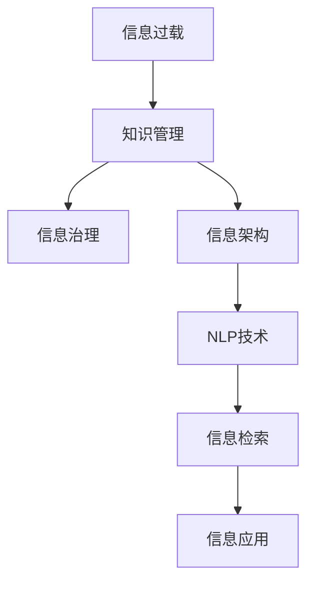

                 

# 信息过载与知识管理策略与实践：管理和组织信息

> 关键词：信息过载,知识管理,信息检索,信息治理,信息架构,自然语言处理

## 1. 背景介绍

### 1.1 问题由来
在信息时代，大数据、互联网、人工智能等技术的飞速发展，使得信息的产生和传播速度呈指数级增长。企业和个人每天都会接触到海量的数据和信息，但真正有价值的内容却难以筛选。信息过载(Information Overload)成为了现代社会普遍面临的问题。

信息过载不仅消耗了大量时间和精力，还会造成认知过载(Cognitive Overload)，导致注意力分散、决策迟缓，严重时甚至可能引发心理健康问题。如何在海量信息中快速获取、筛选、存储、利用有价值的信息，成为了企业和个人亟需解决的问题。

知识管理(Knowledge Management)正是针对这一问题提出的一种管理策略。通过合理的知识管理，能够有效组织、整合、利用海量信息，提升组织和个人的知识产出和决策水平。

本文将从信息过载问题入手，深入分析知识管理的核心概念、方法论和应用实践，探讨如何通过技术手段，更高效地管理和组织信息。

## 2. 核心概念与联系

### 2.1 核心概念概述

为更好地理解知识管理技术，本节将介绍几个密切相关的核心概念：

- 信息过载(Information Overload)：指个人或组织在面对海量的信息时，无法有效处理和利用，导致认知负荷过重、决策效率低下。

- 知识管理(Knowledge Management)：通过知识获取、存储、整合、应用等过程，提高组织和个人的工作效率和决策能力。知识管理贯穿信息生命周期，从原始数据转化为可利用知识，并发挥知识的价值。

- 信息治理(Information Governance)：指对企业信息资产进行统一规划、组织、控制和监督的过程，以确保信息的安全性、完整性和可用性。

- 信息架构(Information Architecture)：旨在通过结构化和层次化的信息组织方式，使信息更易于检索、理解和利用。

- 自然语言处理(Natural Language Processing, NLP)：通过算法和模型，使计算机能够理解和生成人类语言，是知识管理的重要技术手段之一。

这些核心概念之间的逻辑关系可以通过以下Mermaid流程图来展示：



这个流程图展示了几大核心概念之间的联系：

1. 信息过载问题催生了知识管理，通过合理的知识管理策略，可以有效解决信息过载问题。
2. 信息治理和信息架构是知识管理的两个关键环节，保障信息的质量和可用性。
3. 自然语言处理技术是知识管理的重要工具，支持信息检索和信息应用。
4. 信息检索和信息应用是知识管理的最终目的，即实现信息的高效利用和转化为知识。

## 3. 核心算法原理 & 具体操作步骤

### 3.1 算法原理概述

知识管理的核心目标是有效组织和管理海量信息，从中提取出有价值的知识，并应用于实际工作中。其基本思想是通过以下几个步骤：

1. **信息采集与加工**：从各种信息源收集数据，进行预处理和清洗，生成可供分析的原始信息。
2. **信息存储与整合**：利用数据仓库、数据库等工具，将信息存储在结构化的数据系统中，并进行分类、标签等组织方式。
3. **信息检索与推荐**：通过信息检索技术，快速定位所需信息，并结合推荐算法，提供最相关的信息。
4. **知识提取与分享**：利用NLP等技术，从信息中抽取有价值的知识，并通过知识分享平台，供组织内成员共同使用。

知识管理的算法原理主要涉及数据处理、存储、检索和应用等多个方面，旨在通过技术手段，提升信息处理的效率和效果。

### 3.2 算法步骤详解

知识管理的实现过程可以分为以下几个关键步骤：

**Step 1: 信息采集与预处理**

- 确定信息来源：确定信息采集的渠道，如企业内部文档、社交媒体、公开数据库等。
- 数据收集与清洗：从信息源收集数据，并进行去重、清洗、格式转换等预处理操作，生成可供分析的原始信息。

**Step 2: 信息存储与整合**

- 建立数据仓库：搭建数据仓库系统，设计合理的表结构，存储处理后的信息。
- 信息分类与标签：对信息进行分类，并打上合适的标签，以便后续的检索和应用。

**Step 3: 信息检索与推荐**

- 建立检索系统：利用信息检索技术，如倒排索引、向量空间模型等，实现信息的快速定位。
- 推荐算法应用：结合推荐算法，如协同过滤、内容推荐等，提供最相关的信息。

**Step 4: 知识提取与分享**

- 知识抽取与语义理解：利用NLP技术，从信息中抽取有价值的知识，并进行语义理解。
- 知识分享平台：建立知识分享平台，供组织内成员查看、编辑和贡献知识。

### 3.3 算法优缺点

知识管理的主要优点包括：

1. **提高信息利用率**：通过系统化的信息管理，可以快速定位所需信息，减少信息过载。
2. **提升决策质量**：经过深度分析和知识提取，提供高质量的决策支持，减少决策错误。
3. **促进知识共享**：建立知识分享平台，加速知识在组织内的传播和应用。

其主要缺点包括：

1. **高成本投入**：知识管理系统需要投入大量人力、物力和财力，建设复杂。
2. **技术复杂性**：涉及多种技术手段，如数据仓库、信息检索、NLP等，技术门槛较高。
3. **数据隐私和安全**：信息采集和存储过程中，需要严格保护数据隐私和安全，防止泄露。
4. **知识更新频率高**：知识库需要不断更新，以适应外部环境变化，维护成本高。

尽管存在这些局限性，但知识管理在提高组织效率和决策水平方面具有不可替代的作用。未来相关研究将集中在如何降低成本、提升技术可操作性、强化数据安全等方面。

### 3.4 算法应用领域

知识管理技术在多个领域均有广泛应用，例如：

- 企业信息管理：通过建立企业信息门户(Enterprise Information Portal, EIP)，将企业内部文档、外部数据、知识库等集中管理，提高企业决策效率。
- 项目管理：通过知识管理技术，收集、整理和共享项目文档、进度、成果等，优化项目管理过程，提高项目成功率。
- 医疗知识管理：医疗机构建立知识管理系统，管理病历、诊断指南、临床试验等，提升医疗质量和研究水平。
- 教育资源管理：学校和培训机构通过知识管理技术，共享课程、教材、案例等资源，提高教学质量。
- 公共政策制定：政府部门通过知识管理技术，整理和分析政策文件、研究报告等，辅助政策制定和评估。

除了以上应用场景，知识管理技术还在金融、能源、科研等众多领域发挥着重要作用，推动了各行业的数字化转型和智能化升级。

## 4. 数学模型和公式 & 详细讲解  
### 4.1 数学模型构建

本节将使用数学语言对知识管理的核心算法进行更加严格的刻画。

设原始信息为 $I$，经过预处理和清洗后，得到处理后的信息 $D$。在信息存储阶段，将 $D$ 存储在数据仓库 $W$ 中，并通过信息分类和标签 $T$ 进行组织。信息检索系统 $S$ 从 $W$ 中检索相关信息 $S(I)$，结合推荐算法 $R$，输出最相关的信息 $R(S(I))$。知识抽取与语义理解系统 $K$ 从 $R(S(I))$ 中提取知识 $K(I)$，并建立知识库 $K_{db}$ 进行存储和分享。

知识管理的流程可以用以下数学模型表示：

$$
K_{db} = K(K(R(S(W(I,T))))
$$

其中 $K$ 表示知识抽取与语义理解操作，$R$ 表示信息推荐操作，$S$ 表示信息检索操作，$W$ 表示数据仓库，$I$ 表示原始信息，$T$ 表示信息分类与标签。

### 4.2 公式推导过程

以信息检索和推荐为例，详细推导知识管理的基本流程。

假设信息 $I$ 由多个字段组成，如时间戳、地点、内容等。首先将信息 $I$ 进行预处理和清洗，生成处理后的信息 $D$。信息 $D$ 存储在数据仓库 $W$ 中，并对每个字段进行分类和标签 $T$。

信息检索系统 $S$ 通过倒排索引等技术，从 $W$ 中检索相关信息 $S(I)$，输出一个包含相关信息的列表。推荐算法 $R$ 根据用户的查询历史、兴趣偏好等信息，结合 $S(I)$ 的结果，生成最相关的信息列表 $R(S(I))$。

知识抽取与语义理解系统 $K$ 通过NLP技术，从 $R(S(I))$ 中抽取知识 $K(I)$。知识库 $K_{db}$ 记录这些知识，并提供搜索、分享、编辑等操作。用户可以通过查询 $K_{db}$，获取需要的知识，辅助决策和操作。

具体的数学推导过程如下：

1. 数据预处理：
$$
D = preProcess(I)
$$

2. 信息存储与分类：
$$
W = store(D, T)
$$

3. 信息检索：
$$
S(I) = retrieve(I, W)
$$

4. 信息推荐：
$$
R(S(I)) = recommend(S(I))
$$

5. 知识抽取与语义理解：
$$
K(I) = extract(K(R(S(I))))
$$

6. 知识库建立与分享：
$$
K_{db} = store(K(I))
$$

### 4.3 案例分析与讲解

以知识管理在医疗领域的实际应用为例，详细分析知识管理的基本流程和关键技术。

假设某医院建立了医疗知识管理系统，用于管理病历、诊断指南、临床试验等医疗信息。该系统的核心流程如下：

1. **信息采集与预处理**：医院通过电子病历系统(Electronic Health Record, EHR)，将病历信息采集到系统中，并进行去重、清洗、格式转换等预处理操作，生成可供分析的原始信息。

2. **信息存储与整合**：系统建立数据仓库，设计合理的表结构，存储处理后的信息。对病历信息进行分类，打上标签，如"住院病历"、"门诊病历"、"诊断指南"等，以便后续的检索和应用。

3. **信息检索与推荐**：医生可以通过系统检索病历信息，获取最相关的病历。系统结合医生的查询历史、科室、病种等信息，推荐相关的病历和诊断指南。

4. **知识提取与分享**：系统利用NLP技术，从病历和诊断指南中抽取有价值的知识，如常见症状、治疗方案、药物信息等，并建立知识库。医生和其他医务人员可以通过查询知识库，获取需要的知识，辅助诊疗决策。

在具体实现上，可以利用Elasticsearch等搜索引擎作为信息检索系统，利用向量空间模型等算法推荐最相关的信息。通过TF-IDF、LDA等技术，抽取和表示病历中的知识，建立知识库并支持搜索和分享。

## 5. 项目实践：代码实例和详细解释说明
### 5.1 开发环境搭建

在进行知识管理实践前，我们需要准备好开发环境。以下是使用Python进行知识管理系统的环境配置流程：

1. 安装Anaconda：从官网下载并安装Anaconda，用于创建独立的Python环境。

2. 创建并激活虚拟环境：
```bash
conda create -n km-env python=3.8 
conda activate km-env
```

3. 安装Python和PyTorch：
```bash
conda install python=3.8 pytorch torchvision torchaudio cudatoolkit=11.1 -c pytorch -c conda-forge
```

4. 安装必要的库：
```bash
pip install numpy pandas scikit-learn transformers scipy nltk elasticsearch
```

5. 安装Django框架：
```bash
pip install django
```

6. 创建Django项目：
```bash
django-admin startproject knowledge_management
cd knowledge_management
```

完成上述步骤后，即可在`km-env`环境中开始知识管理系统开发。

### 5.2 源代码详细实现

这里我们以医疗知识管理系统为例，给出知识管理系统的Python代码实现。

**models.py**：
```python
from django.db import models

class Patient(models.Model):
    name = models.CharField(max_length=100)
    age = models.IntegerField()
    diagnosis = models.CharField(max_length=200)
    symptoms = models.TextField()
    medication = models.TextField()

class MedicalRecord(models.Model):
    patient = models.ForeignKey(Patient, on_delete=models.CASCADE)
    record_time = models.DateTimeField(auto_now_add=True)
    record_text = models.TextField()
    classification = models.CharField(max_length=100)

class KnowledgeBase(models.Model):
    title = models.CharField(max_length=200)
    content = models.TextField()
    category = models.CharField(max_length=100)
```

**views.py**：
```python
from django.shortcuts import render, redirect
from .models import Patient, MedicalRecord, KnowledgeBase
from .forms import SearchForm

def home(request):
    if request.method == 'POST':
        form = SearchForm(request.POST)
        if form.is_valid():
            search_query = form.cleaned_data['search_query']
            records = MedicalRecord.objects.filter(record_text__icontains=search_query)
            return render(request, 'home.html', {'records': records})
    else:
        form = SearchForm()
    return render(request, 'home.html', {'form': form})

def search(request):
    search_query = request.GET.get('q')
    if search_query:
        records = MedicalRecord.objects.filter(record_text__icontains=search_query)
        return render(request, 'search_results.html', {'records': records})
    else:
        return redirect('home')
```

**forms.py**：
```python
from django import forms

class SearchForm(forms.Form):
    search_query = forms.CharField(max_length=200, required=True)
```

**urls.py**：
```python
from django.urls import path
from . import views

urlpatterns = [
    path('', views.home, name='home'),
    path('search/', views.search, name='search'),
]
```

**home.html**：
```html
<!DOCTYPE html>
<html>
<head>
    <title>Medical Knowledge Management System</title>
</head>
<body>
    <h1>Medical Record Search</h1>
    <form method="post">
        
        {{ form.search_query.label }}
        {{ form.search_query }}
        <button type="submit">Search</button>
    </form>
</body>
</html>
```

**search_results.html**：
```html
<!DOCTYPE html>
<html>
<head>
    <title>Medical Record Search Results</title>
</head>
<body>
    <h1>Search Results</h1>
    <ul>
        
            <li>{{ record.patient.name }} - {{ record.record_time }} - {{ record.classification }}</li>
        
    </ul>
</body>
</html>
```

**settings.py**：
```python
# Django settings file
DATABASES = {
    'default': {
        'ENGINE': 'django.db.backends.mysql',
        'NAME': 'knowledge_management',
        'USER': 'root',
        'PASSWORD': 'password',
        'HOST': 'localhost',
        'PORT': '3306',
    }
}
```

完成上述步骤后，即可启动知识管理系统并使用。

### 5.3 代码解读与分析

让我们再详细解读一下关键代码的实现细节：

**models.py**：
- `Patient` 模型：记录患者的姓名、年龄、诊断、症状和药物信息。
- `MedicalRecord` 模型：记录病历的创建时间、病历文本、分类信息。
- `KnowledgeBase` 模型：记录知识库的标题、内容、分类信息。

**views.py**：
- `home` 视图：显示搜索表单，获取用户输入的搜索词，并在病历中搜索匹配记录。
- `search` 视图：获取搜索词，并在病历中搜索匹配记录，展示搜索结果。

**forms.py**：
- `SearchForm` 表单：提供搜索字段，用于获取用户输入的搜索词。

**urls.py**：
- 定义路由，将请求路由到相应的视图函数。

**home.html**：
- 显示搜索表单，让用户输入搜索词。

**search_results.html**：
- 展示搜索结果，列出匹配的病历记录。

**settings.py**：
- 配置数据库连接信息。

通过上述代码，我们实现了基本的知识管理系统功能，包括搜索病历记录、展示搜索结果等。

## 6. 实际应用场景

### 6.1 智能文档管理系统

智能文档管理系统是一种典型的知识管理应用，旨在管理和优化企业文档的管理和利用。通过建立文档分类体系、制定文档检索策略、建立知识地图等手段，智能文档管理系统能够快速定位和检索所需文档，支持高效的信息利用和知识共享。

在技术实现上，可以搭建企业级文档管理系统，利用搜索技术、分类技术、推荐算法等手段，提升文档管理的效率和效果。文档管理系统可以用于企业的技术文档、项目文档、培训文档等各类文档的统一管理和利用。

### 6.2 在线学习平台

在线学习平台通过知识管理技术，将各类学习资源、学习笔记、讨论交流等内容集中管理，供学习者自由访问和利用。在线学习平台能够帮助学习者快速定位所需学习资源，辅助学习决策，提高学习效果。

在技术实现上，可以利用知识管理技术，构建在线学习平台，利用NLP技术提取和表示学习资源中的知识，结合推荐算法提供个性化的学习资源推荐。通过知识管理，在线学习平台可以实现知识的快速传播和利用，提升学习效率。

### 6.3 企业知识库

企业知识库通过知识管理技术，将企业内部的知识资源、技术文档、培训资料等集中存储和分享，供企业成员自由访问和利用。企业知识库能够帮助企业成员快速定位所需知识，辅助决策和操作，提升企业知识产出和应用水平。

在技术实现上，可以利用知识管理技术，构建企业知识库，利用NLP技术抽取和表示知识资源中的信息，结合推荐算法提供个性化的知识推荐。通过知识管理，企业知识库可以实现知识的快速传播和利用，提升企业知识产出和应用水平。

### 6.4 未来应用展望

随着知识管理技术的不断进步，知识管理的应用场景将更加广泛，在更多领域发挥重要作用。

在智慧医疗领域，知识管理技术可以应用于病历管理、诊断指南、临床试验等环节，提升医疗质量和研究水平。在教育领域，知识管理技术可以应用于在线教育、学习资源管理、教学过程分析等环节，提升教学质量和效果。在金融领域，知识管理技术可以应用于数据分析、风险评估、投资决策等环节，提升金融分析和投资水平。

未来，随着AI、大数据等技术的进一步发展，知识管理技术将与这些技术更加紧密结合，实现更加智能化、个性化的信息管理。通过AI技术，知识管理系统将能够更精准地理解用户需求，提供更加个性化的服务。通过大数据技术，知识管理系统将能够更全面地整合和管理海量信息，提升信息利用效率。

## 7. 工具和资源推荐

### 7.1 学习资源推荐

为了帮助开发者系统掌握知识管理技术，这里推荐一些优质的学习资源：

1. 《Knowledge Management: An Enterprise Approach》书籍：由知名学者撰写，系统介绍了企业知识管理的理论基础和实践方法。

2. CS340《数据与信息检索》课程：斯坦福大学开设的经典课程，涵盖了信息检索的基本概念和技术手段，适合初学者入门。

3. 《Natural Language Processing with Python》书籍：通过Python代码实现NLP技术，从入门到进阶，适合初学者和进阶开发者。

4. Kaggle：数据科学竞赛平台，提供大量真实场景下的知识管理案例，供开发者学习和实践。

5. Coursera：在线学习平台，提供丰富的知识管理相关课程，包括理论知识、技术手段和实践案例。

通过对这些资源的学习实践，相信你一定能够快速掌握知识管理技术的精髓，并用于解决实际的NLP问题。

### 7.2 开发工具推荐

高效的开发离不开优秀的工具支持。以下是几款用于知识管理系统开发的常用工具：

1. Django：开源的Python Web框架，支持数据库访问、URL路由、模板引擎等功能，适合构建Web应用。

2. Elasticsearch：开源的搜索引擎，支持全文检索、高可用性、扩展性强，适合构建知识检索系统。

3. TensorFlow：开源的深度学习框架，支持构建复杂模型，适合利用NLP技术进行知识抽取和语义理解。

4. PyTorch：开源的深度学习框架，灵活高效，适合构建各类深度学习模型。

5. Tableau：开源的数据可视化工具，支持复杂数据报表和可视化，适合构建知识管理系统的报表和展示界面。

6. Jupyter Notebook：开源的交互式编程环境，支持Python、R等多种语言，适合代码调试和快速原型开发。

合理利用这些工具，可以显著提升知识管理系统开发的效率和效果，加快创新迭代的步伐。

### 7.3 相关论文推荐

知识管理技术的发展源于学界的持续研究。以下是几篇奠基性的相关论文，推荐阅读：

1. 《Knowledge Management: Strategy, Process, and Technology》书籍：系统介绍了知识管理的概念、技术和应用，适合入门阅读。

2. 《Managing Unstructured Knowledge: New Possibilities for Organizational Advantage》论文：研究了知识管理在组织中的应用，提出了知识管理的关键步骤和技术手段。

3. 《Towards a Science of Information》论文：从信息科学的角度，探讨了信息管理的基础理论和实践方法。

4. 《Semantic Web and Information Systems》书籍：系统介绍了语义网和信息系统的概念、技术和应用，适合深入学习。

5. 《Natural Language Processing in Biomedical Informatics》论文：研究了NLP技术在生物医学信息管理中的应用，提出了基于NLP的知识抽取方法。

这些论文代表了大语言模型微调技术的发展脉络。通过学习这些前沿成果，可以帮助研究者把握学科前进方向，激发更多的创新灵感。

## 8. 总结：未来发展趋势与挑战

### 8.1 总结

本文对知识管理技术进行了全面系统的介绍。首先阐述了信息过载问题，并介绍了知识管理的核心概念、方法论和应用实践，探讨了如何通过技术手段，更高效地管理和组织信息。

通过本文的系统梳理，可以看到，知识管理技术在提高信息利用率、提升决策质量、促进知识共享方面具有不可替代的作用。未来相关研究需要在如何降低成本、提升技术可操作性、强化数据安全等方面进行深入探索。

### 8.2 未来发展趋势

展望未来，知识管理技术将呈现以下几个发展趋势：

1. 技术融合趋势：知识管理将与其他新兴技术，如AI、大数据、区块链等深度融合，实现更全面、智能的信息管理。

2. 多模态知识管理：知识管理将拓展到多模态数据，如文本、图像、音频等，实现更全面的知识抽取和应用。

3. 个性化知识推荐：知识管理将利用AI技术，结合用户行为数据，实现更加个性化的知识推荐，提升用户体验。

4. 开放知识共享：知识管理将更加注重开放性，支持全球知识共享和协作，提升知识传播效率。

5. 社会化知识管理：知识管理将融合社会化网络技术，支持社区知识共享和协作，提升组织知识产出和应用水平。

6. 知识图谱构建：知识管理将融合知识图谱技术，实现更全面、精准的知识抽取和语义理解。

以上趋势凸显了知识管理技术的广阔前景。这些方向的探索发展，必将进一步提升信息管理的效率和效果，为构建人机协同的智能系统铺平道路。

### 8.3 面临的挑战

尽管知识管理技术已经取得了显著成就，但在迈向更加智能化、普适化应用的过程中，它仍面临着诸多挑战：

1. 高成本投入：知识管理系统需要投入大量人力、物力和财力，建设复杂。如何降低成本，提升系统可用性，将是未来的重要课题。

2. 技术复杂性：知识管理涉及多种技术手段，如搜索技术、分类技术、推荐算法等，技术门槛较高。如何简化技术实现，提升系统易用性，将是未来的关键方向。

3. 数据隐私和安全：信息采集和存储过程中，需要严格保护数据隐私和安全，防止泄露。如何保障数据隐私和安全，将是未来的重要挑战。

4. 知识更新频率高：知识库需要不断更新，以适应外部环境变化，维护成本高。如何提升知识更新效率，降低维护成本，将是未来的重要方向。

5. 知识质量控制：知识库中存储的知识质量如何保证，需要建立严格的审核机制和质量控制流程。如何提升知识质量，将是未来的重要课题。

6. 知识共享机制：知识管理需要建立良好的知识共享机制，促进知识在组织内外的传播和应用。如何构建有效的知识共享机制，将是未来的重要方向。

正视知识管理面临的这些挑战，积极应对并寻求突破，将使知识管理技术走向成熟。相信随着学界和产业界的共同努力，这些挑战终将一一被克服，知识管理技术必将在构建安全、可靠、可解释、可控的智能系统方面发挥更大的作用。

### 8.4 研究展望

面向未来，知识管理技术需要在以下几个方向进行深入研究：

1. 知识表示与推理：如何通过符号化知识表示，实现知识库的逻辑推理，提升知识的推理能力和应用效果。

2. 跨领域知识融合：如何通过跨领域知识融合，实现更全面、智能的知识管理。

3. 开放知识共享：如何通过开放知识共享，构建全球知识协作平台，提升知识传播效率。

4. 知识价值评估：如何建立知识价值评估模型，评估知识对决策和运营的价值，提升知识管理的效果。

5. 知识管理系统的鲁棒性：如何提升知识管理系统的鲁棒性，防止系统崩溃或数据泄露，确保知识管理系统的稳定性和安全性。

6. 知识管理的伦理与法律问题：如何建立知识管理的伦理和法律框架，确保知识管理的公平性、公正性和合法性。

这些研究方向将引领知识管理技术的未来发展，为构建更加智能、普适、安全、可靠的知识管理系统提供强有力的技术保障。

## 9. 附录：常见问题与解答

**Q1：知识管理与信息管理有什么区别？**

A: 知识管理和信息管理虽然密切相关，但并非完全等同。信息管理更侧重于信息的收集、存储和检索，而知识管理更注重信息中的知识提取、利用和共享。知识管理强调将信息转化为知识，提高知识产出和应用水平。

**Q2：如何构建有效的知识共享机制？**

A: 构建有效的知识共享机制需要综合考虑多方面因素，如知识权限管理、知识发布机制、知识评价机制等。可以引入区块链等技术，建立去中心化的知识共享平台，实现知识共享的透明性和可追溯性。同时，可以通过激励机制，如知识积分、奖励等，激发知识共享的动力。

**Q3：知识管理系统的关键技术是什么？**

A: 知识管理系统的关键技术包括信息检索、知识抽取、知识推理、推荐算法等。信息检索技术用于快速定位所需信息，知识抽取技术用于从信息中抽取有价值的知识，知识推理技术用于建立知识之间的关联，推荐算法用于提供个性化的知识推荐。

**Q4：如何提升知识管理系统的鲁棒性？**

A: 提升知识管理系统的鲁棒性需要从多个方面进行综合考虑，如数据备份、容错机制、安全防护等。可以采用分布式存储、多节点备份、异常检测等技术，提升系统的可靠性和稳定性。同时，需要建立完善的安全防护机制，防止数据泄露和系统攻击。

**Q5：知识管理系统的建设过程中需要注意哪些问题？**

A: 知识管理系统的建设过程中，需要注意以下问题：

1. 数据隐私和安全：严格保护数据隐私和安全，防止数据泄露和系统攻击。

2. 技术复杂性：选择合适的技术手段，简化系统实现，提升系统易用性。

3. 知识质量控制：建立严格的审核机制和质量控制流程，确保知识库中存储的知识质量。

4. 知识共享机制：建立良好的知识共享机制，促进知识在组织内外的传播和应用。

5. 知识价值评估：建立知识价值评估模型，评估知识对决策和运营的价值，提升知识管理的效果。

通过合理解决这些问题，可以构建更加高效、可靠、智能的知识管理系统。

---

作者：禅与计算机程序设计艺术 / Zen and the Art of Computer Programming

