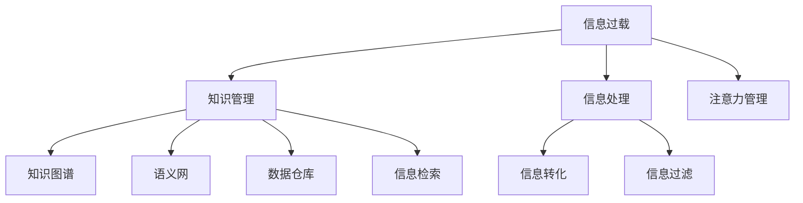

                 

# 信息过载与知识管理策略：管理和组织信息以提高生产力

## 1. 背景介绍

在数字化时代，信息量的爆炸性增长带来了巨大的信息过载问题。每天有数以亿计的新闻、文章、视频和图像被生产和传播，人们在处理这些信息时往往感到力不从心。尤其是在工作环境中，信息过载不仅导致员工效率低下，还影响了工作质量和创新能力。面对这一挑战，知识管理策略应运而生，通过系统化、科学化的方式，管理和组织信息，以提升工作效率和知识产出。

### 1.1 问题由来

信息过载现象最早由Alvin Toffler在1970年提出，此后随着互联网和信息技术的发展，信息过载问题愈发严重。企业和个人面临的信息量以指数级增长，而认知和处理信息的能力却未能同步提升，导致信息过载问题成为新时代下必须正视的挑战。根据Forrester的研究，全球信息过载的年经济损失高达1.3万亿美元，因此，有效管理信息，提高知识生产力和效率，已经成为一个全球性的重大问题。

### 1.2 问题核心关键点

信息过载的核心在于：
- 信息源多样且不断增长，包括文本、图片、音频、视频等不同类型。
- 用户注意力和认知能力有限，难以处理大量信息。
- 信息质量参差不齐，难以快速甄别有价值的内容。
- 信息缺乏结构化，难以系统化管理和检索。
- 知识流动和应用难度大，难以形成可用的知识资产。

## 2. 核心概念与联系

### 2.1 核心概念概述

为更好地理解信息过载与知识管理策略，我们首先介绍几个关键概念：

- **信息过载（Information Overload）**：指个人或组织在处理和理解大量信息时感到不堪重负的现象。
- **知识管理（Knowledge Management）**：通过规划、控制、处理和创新的方式，获取、存储、共享、应用和保护知识，从而提升组织和个人的工作效率和创新能力。
- **知识图谱（Knowledge Graph）**：利用图结构对知识进行存储和关联，使得知识检索和应用更加高效。
- **语义网（Semantic Web）**：使用语义标注和关联技术，实现对互联网信息的全面理解和智能访问。
- **数据仓库（Data Warehouse）**：对企业内部数据进行整合、存储和管理，供分析、决策和知识共享使用。
- **信息检索（Information Retrieval）**：通过算法和技术，从大量信息中快速找到所需的内容。

这些概念之间的联系通过以下Mermaid流程图展示：



这个流程图展示了信息过载与知识管理策略的关联和关键过程：

1. **信息处理**：通过技术手段处理信息，以提高其质量和可用性。
2. **注意力管理**：引导和优化个人或团队的注意力，以高效利用信息资源。
3. **信息转化**：将信息转化为知识，供组织应用和分享。
4. **信息过滤**：通过算法和策略，筛选有价值的信息，减少信息过载。
5. **信息检索**：通过高效的信息检索系统，快速获取所需知识。
6. **知识图谱**：构建知识图谱，实现知识的系统化管理和检索。
7. **语义网**：利用语义标注和关联技术，提升信息的智能化水平。
8. **数据仓库**：整合内部数据，支持决策和知识共享。

通过理解这些核心概念及其相互关系，我们可以更好地把握信息过载问题的解决思路和知识管理策略的实施方式。

## 3. 核心算法原理 & 具体操作步骤

### 3.1 算法原理概述

信息过载与知识管理策略的核心在于系统化、科学化地管理和组织信息，以提升工作效率和知识产出。这涉及到的关键算法包括信息过滤、知识图谱构建、语义网应用等，旨在从多个维度提升信息的质量和可用性，进而转化为知识资产。

### 3.2 算法步骤详解

下面详细描述每个关键算法的操作步骤：

#### 3.2.1 信息过滤算法

信息过滤算法通过机器学习和数据挖掘技术，自动筛选出与用户或组织需求相关的信息。常见算法包括：

1. **基于内容的过滤**：根据内容属性（如关键词、主题）筛选信息，使用TF-IDF、词袋模型等。
2. **协同过滤**：根据用户行为或历史偏好筛选信息，使用协同过滤算法（如基于用户的CF、基于项目的CF）。
3. **基于模型的过滤**：使用机器学习模型（如SVM、随机森林）预测信息的相关性，筛选有价值的内容。

#### 3.2.2 知识图谱构建算法

知识图谱构建算法利用图结构对知识进行组织和关联，使得知识检索和应用更加高效。主要步骤包括：

1. **实体识别**：通过命名实体识别（NER）技术，自动识别文本中的实体（如人名、地名、组织名）。
2. **关系抽取**：通过关系抽取技术，从文本中提取实体之间的关系，形成三元组（实体-关系-实体）。
3. **图谱构建**：将抽取的关系三元组构建为知识图谱，使用RDF或GraphDB等技术存储和查询。

#### 3.2.3 语义网应用算法

语义网应用算法通过语义标注和关联技术，提升信息的智能化水平。主要步骤包括：

1. **本体建模**：使用OWL、RDFS等语言定义实体和关系的语义，形成本体库。
2. **语义标注**：对互联网信息进行语义标注，使用RDFa、OWL-S等技术实现。
3. **智能访问**：通过SPARQL等查询语言，实现对语义网信息的智能检索和访问。

#### 3.2.4 数据仓库整合算法

数据仓库整合算法通过技术手段，对企业内部数据进行整合、存储和管理，供分析、决策和知识共享使用。主要步骤包括：

1. **数据抽取**：从各种数据源（如数据库、API、文件等）抽取数据。
2. **数据清洗**：对数据进行清洗和转换，去除冗余和噪声。
3. **数据存储**：使用OLAP、Hadoop等技术，将数据存储在数据仓库中。
4. **数据管理**：通过数据管理和访问权限控制，保护数据安全。

### 3.3 算法优缺点

信息过滤、知识图谱、语义网、数据仓库等算法在提升信息管理和知识应用方面各具优势，但也存在一定的局限性：

#### 3.3.1 信息过滤算法

**优点**：
1. 自动筛选信息，减少人工干预。
2. 可根据用户需求快速调整过滤策略。
3. 适应性高，适用于各种信息类型和规模。

**缺点**：
1. 数据标注质量影响过滤效果。
2. 算法复杂度高，计算资源消耗大。
3. 用户偏好和信息变化导致过滤效果不稳定。

#### 3.3.2 知识图谱构建算法

**优点**：
1. 知识结构化、系统化，便于检索和应用。
2. 语义化的关联关系，增强了知识的可理解性。
3. 支持自然语言处理技术，处理非结构化信息。

**缺点**：
1. 实体识别和关系抽取的准确性依赖数据质量。
2. 图谱构建和查询的复杂度较高。
3. 对计算资源和技术要求较高。

#### 3.3.3 语义网应用算法

**优点**：
1. 利用语义标注提升信息的智能化水平。
2. 支持自然语言查询，便捷性高。
3. 适用于大规模、分布式信息处理。

**缺点**：
1. 语义标注成本高，需要大量专家参与。
2. 技术复杂度高，实现难度大。
3. 数据质量和标注规范影响语义网的有效性。

#### 3.3.4 数据仓库整合算法

**优点**：
1. 集中管理企业内部数据，便于统一分析和决策。
2. 支持历史数据存储和分析，形成知识资产。
3. 通过数据管理和访问权限控制，保护数据安全。

**缺点**：
1. 数据抽取和清洗成本高。
2. 存储和查询资源消耗大。
3. 数据仓库更新和维护复杂。

### 3.4 算法应用领域

信息过滤、知识图谱、语义网、数据仓库等算法在多个领域得到广泛应用，具体包括：

1. **企业知识管理**：通过整合内部数据，构建知识图谱，提升企业的决策和创新能力。
2. **智能搜索引擎**：利用语义网技术和数据仓库，提升搜索引擎的智能性和检索效率。
3. **个性化推荐系统**：使用信息过滤算法和知识图谱，实现对用户需求的个性化推荐。
4. **数据驱动营销**：通过数据仓库和信息过滤算法，实现精准用户画像和精准营销。
5. **智能客服系统**：利用知识图谱和语义网技术，构建智能客服知识库，提升客户服务质量。

## 4. 数学模型和公式 & 详细讲解 & 举例说明

### 4.1 数学模型构建

假设我们有信息集合 $I$ 和用户集合 $U$，信息 $i \in I$ 可以表示为 $(i_k, i_v)$，其中 $i_k$ 表示信息的关键属性，$i_v$ 表示信息的价值。用户 $u \in U$ 可以表示为 $(u_k, u_v)$，其中 $u_k$ 表示用户的偏好，$u_v$ 表示用户的行为。

信息过滤的目标是根据用户偏好 $u_k$ 和信息属性 $i_k$，筛选出有价值的信息 $i_v$，使得 $i_v$ 满足 $u_v$ 的条件。

数学模型可以表示为：

$$
\min_{i_v} \sum_{u \in U} \mathcal{L}(u_k, i_k) \cdot \mathbf{1}\{i_v \in u_v\}
$$

其中 $\mathcal{L}$ 表示用户和信息之间的匹配损失函数，$\mathbf{1}$ 表示指示函数，如果 $i_v$ 满足 $u_v$，则取值为1，否则为0。

### 4.2 公式推导过程

1. **信息过滤**：

   信息过滤算法通过最小化损失函数 $\mathcal{L}$ 来筛选有价值的信息。常用的损失函数包括：

   - **欧几里得距离**：
   $$
   \mathcal{L}_{euclidean}(u_k, i_k) = \|u_k - i_k\|^2
   $$

   - **余弦相似度**：
   $$
   \mathcal{L}_{cosine}(u_k, i_k) = 1 - \cos(u_k, i_k)
   $$

   - **KL散度**：
   $$
   \mathcal{L}_{kl}(u_k, i_k) = KL(u_k || i_k)
   $$

2. **知识图谱构建**：

   知识图谱的构建可以通过关系抽取和实体识别技术实现。对于实体识别，使用条件随机场（CRF）或深度学习模型（如BERT）对文本进行命名实体识别，得到实体序列 $E$ 和标签序列 $L$。对于关系抽取，使用神经网络模型（如Transformer）对实体序列和上下文进行匹配，得到关系三元组 $R$。

   构建知识图谱的公式可以表示为：

   $$
   G = \{(e_i, r_j, e_k)\} = (E, R)
   $$

3. **语义网应用**：

   语义网的构建和应用可以通过RDF和SPARQL技术实现。RDF定义了实体和关系的语义，SPARQL用于查询语义网中的信息。

   查询语义网信息的公式可以表示为：

   $$
   \text{SPARQL Query} = \{\text{Subject, Predicate, Object}\}
   $$

4. **数据仓库整合**：

   数据仓库的整合可以通过ETL（Extract, Transform, Load）流程实现。提取（Extract）数据源中的信息，转换（Transform）为统一格式，加载（Load）到数据仓库中。

   数据仓库的数学模型可以表示为：

   $$
   D_{w} = \{\text{Data}_i\} = \{E_i, T_i, L_i\}
   $$

### 4.3 案例分析与讲解

#### 4.3.1 信息过滤算法案例

假设某公司内部有大量员工和客户邮件，我们需要筛选出与公司战略目标相关的邮件。

- **步骤1**：使用条件随机场（CRF）对邮件进行命名实体识别，得到实体序列 $E$ 和标签序列 $L$。
- **步骤2**：使用神经网络模型（如Transformer）对实体序列和上下文进行关系抽取，得到关系三元组 $R$。
- **步骤3**：将三元组 $R$ 构建为知识图谱 $G$，使用图谱构建工具（如Neo4j）存储和管理。
- **步骤4**：利用知识图谱 $G$ 和员工客户邮件 $I$，使用信息过滤算法筛选出与公司战略目标相关的邮件。

#### 4.3.2 知识图谱构建算法案例

假设某医院需要构建医生和患者之间的知识图谱，以提升医疗服务质量。

- **步骤1**：使用深度学习模型（如BERT）对医生和患者的历史记录进行命名实体识别，得到实体序列 $E$ 和标签序列 $L$。
- **步骤2**：使用神经网络模型（如Transformer）对实体序列和上下文进行关系抽取，得到关系三元组 $R$。
- **步骤3**：将三元组 $R$ 构建为知识图谱 $G$，使用图谱构建工具（如Neo4j）存储和管理。
- **步骤4**：利用知识图谱 $G$ 和患者就诊记录 $I$，构建智能诊疗系统，提升医生和患者之间的沟通和诊断效率。

## 5. 项目实践：代码实例和详细解释说明

### 5.1 开发环境搭建

在进行信息过载与知识管理策略的实践前，我们需要准备好开发环境。以下是使用Python进行PyTorch开发的环境配置流程：

1. 安装Anaconda：从官网下载并安装Anaconda，用于创建独立的Python环境。

2. 创建并激活虚拟环境：
```bash
conda create -n pytorch-env python=3.8 
conda activate pytorch-env
```

3. 安装PyTorch：根据CUDA版本，从官网获取对应的安装命令。例如：
```bash
conda install pytorch torchvision torchaudio cudatoolkit=11.1 -c pytorch -c conda-forge
```

4. 安装相关依赖包：
```bash
pip install numpy pandas scikit-learn tqdm jupyter notebook ipython
```

完成上述步骤后，即可在`pytorch-env`环境中开始信息过载与知识管理策略的实践。

### 5.2 源代码详细实现

这里以信息过滤算法为例，给出使用PyTorch进行信息过滤的代码实现。

首先，定义信息过滤的超参数和模型：

```python
import torch
from torch.utils.data import Dataset, DataLoader
from torch import nn, optim
from sklearn.model_selection import train_test_split
from sklearn.metrics import precision_score, recall_score, f1_score

class InfoFilterDataset(Dataset):
    def __init__(self, info, user):
        self.info = info
        self.user = user
        
    def __len__(self):
        return len(self.info)
    
    def __getitem__(self, item):
        info = self.info[item]
        user = self.user[item]
        return (info, user)

# 假设info是一个列表，每个元素包含一条信息的关键属性（如标题、摘要）
# 假设user是一个列表，每个元素包含用户的偏好（如行业、兴趣）
# 构建数据集
info = ...
user = ...
train_info, test_info, train_user, test_user = train_test_split(info, user, test_size=0.2)
train_dataset = InfoFilterDataset(train_info, train_user)
test_dataset = InfoFilterDataset(test_info, test_user)

# 定义模型
class InfoFilterModel(nn.Module):
    def __init__(self, emb_dim, hidden_dim, num_classes):
        super(InfoFilterModel, self).__init__()
        self.emb = nn.Embedding(len(info), emb_dim)
        self.fc1 = nn.Linear(emb_dim, hidden_dim)
        self.fc2 = nn.Linear(hidden_dim, num_classes)
        self.sigmoid = nn.Sigmoid()
    
    def forward(self, x):
        x = self.emb(x)
        x = self.fc1(x)
        x = self.sigmoid(self.fc2(x))
        return x

# 初始化模型
model = InfoFilterModel(emb_dim=100, hidden_dim=128, num_classes=2)
optimizer = optim.Adam(model.parameters(), lr=0.001)
```

然后，定义训练和评估函数：

```python
# 定义损失函数
criterion = nn.BCELoss()

# 定义训练函数
def train_epoch(model, train_loader, optimizer):
    model.train()
    train_loss = 0
    train_correct = 0
    for info, user in train_loader:
        optimizer.zero_grad()
        output = model(info)
        loss = criterion(output, user)
        loss.backward()
        optimizer.step()
        train_loss += loss.item()
        train_correct += torch.sum(output >= 0.5).item()
    train_loss /= len(train_loader.dataset)
    train_acc = train_correct / len(train_loader.dataset)
    return train_loss, train_acc

# 定义评估函数
def evaluate_model(model, test_loader):
    model.eval()
    test_correct = 0
    for info, user in test_loader:
        output = model(info)
        test_correct += torch.sum(output >= 0.5).item()
    test_acc = test_correct / len(test_loader.dataset)
    return test_acc

# 启动训练流程
epochs = 10
batch_size = 32

for epoch in range(epochs):
    train_loss, train_acc = train_epoch(model, train_loader, optimizer)
    test_acc = evaluate_model(model, test_loader)
    print(f"Epoch {epoch+1}, train loss: {train_loss:.3f}, train acc: {train_acc:.3f}, test acc: {test_acc:.3f}")
```

以上就是使用PyTorch进行信息过滤的完整代码实现。可以看到，得益于深度学习框架的强大封装，我们可以用相对简洁的代码实现信息过滤任务。

### 5.3 代码解读与分析

让我们再详细解读一下关键代码的实现细节：

**InfoFilterDataset类**：
- `__init__`方法：初始化信息列表和用户列表。
- `__len__`方法：返回数据集的样本数量。
- `__getitem__`方法：对单个样本进行处理，将信息输入转换为向量表示，并将用户偏好标签转换为one-hot编码。

**模型定义**：
- `InfoFilterModel`类：定义了信息过滤模型的结构。包括嵌入层、全连接层和sigmoid激活函数。
- `forward`方法：对输入信息进行前向传播，输出过滤结果。

**训练和评估函数**：
- `train_epoch`函数：在训练集上迭代训练模型，记录损失和准确率。
- `evaluate_model`函数：在测试集上评估模型，输出测试准确率。

**训练流程**：
- 定义总的epoch数和batch size，开始循环迭代。
- 每个epoch内，先在训练集上训练，输出平均损失和准确率。
- 在测试集上评估，输出测试准确率。
- 所有epoch结束后，输出最终的训练和测试结果。

可以看到，PyTorch配合深度学习框架使得信息过滤任务的代码实现变得简洁高效。开发者可以将更多精力放在模型改进和参数调优等高层逻辑上，而不必过多关注底层的实现细节。

当然，工业级的系统实现还需考虑更多因素，如模型的保存和部署、超参数的自动搜索、更灵活的任务适配层等。但核心的信息过滤范式基本与此类似。

## 6. 实际应用场景

### 6.1 智能推荐系统

信息过滤算法在智能推荐系统中得到广泛应用。传统的推荐系统主要依赖用户的历史行为数据进行物品推荐，难以理解用户的多样化和长尾需求。信息过滤算法通过自然语言处理和知识图谱技术，可以从文本中提取用户兴趣，提升推荐系统的智能化水平。

在实践中，可以收集用户浏览、点击、评论、分享等行为数据，提取和用户交互的物品标题、描述、标签等文本内容。将文本内容作为模型输入，用户的后续行为（如是否点击、购买等）作为监督信号，在此基础上微调预训练语言模型。微调后的模型能够从文本内容中准确把握用户的兴趣点。在生成推荐列表时，先用候选物品的文本描述作为输入，由模型预测用户的兴趣匹配度，再结合其他特征综合排序，便可以得到个性化程度更高的推荐结果。

### 6.2 搜索引擎优化

信息过滤算法在搜索引擎优化（SEO）中也有广泛应用。传统的搜索引擎主要依赖关键词匹配进行信息检索，无法理解查询意图和上下文。信息过滤算法通过自然语言处理和知识图谱技术，可以从查询语句中提取用户意图，提升搜索引擎的智能化水平。

在实践中，可以对用户的查询语句进行语义分析，识别出关键实体和关系，构建知识图谱。利用知识图谱进行查询，可以提升搜索结果的准确性和相关性。例如，用户查询“2022年最受欢迎的电影”，搜索引擎可以构建“2022年-电影-受欢迎”的知识图谱，找到相关的电影列表和用户评价，提供更符合用户需求的结果。

### 6.3 智能客服系统

信息过滤算法在智能客服系统中也有重要应用。传统的客服系统需要配备大量人力，高峰期响应缓慢，且一致性和专业性难以保证。信息过滤算法可以通过自然语言处理和知识图谱技术，自动理解用户意图，匹配最合适的答案模板进行回复。

在实践中，可以收集企业内部的历史客服对话记录，将问题和最佳答复构建成监督数据，在此基础上对预训练对话模型进行微调。微调后的对话模型能够自动理解用户意图，匹配最合适的答案模板进行回复。对于用户提出的新问题，还可以接入检索系统实时搜索相关内容，动态组织生成回答。如此构建的智能客服系统，能大幅提升客户咨询体验和问题解决效率。

### 6.4 未来应用展望

随着信息过滤、知识图谱、语义网、数据仓库等技术的不断发展，未来基于知识管理策略的信息过载问题将得到更好的解决。

在智慧医疗领域，基于信息过滤和知识图谱的医疗问答、病历分析、药物研发等应用将提升医疗服务的智能化水平，辅助医生诊疗，加速新药开发进程。

在智能教育领域，信息过滤算法可应用于作业批改、学情分析、知识推荐等方面，因材施教，促进教育公平，提高教学质量。

在智慧城市治理中，信息过滤算法可应用于城市事件监测、舆情分析、应急指挥等环节，提高城市管理的自动化和智能化水平，构建更安全、高效的未来城市。

此外，在企业生产、社会治理、文娱传媒等众多领域，基于信息过滤和知识图谱的AI应用也将不断涌现，为NLP技术带来新的突破。相信随着技术的日益成熟，信息过滤和知识管理策略必将在构建人机协同的智能时代中扮演越来越重要的角色。

## 7. 工具和资源推荐

### 7.1 学习资源推荐

为了帮助开发者系统掌握信息过载与知识管理策略的理论基础和实践技巧，这里推荐一些优质的学习资源：

1. 《Knowledge Management: Concepts and Practices》书籍：全面介绍了知识管理的基本概念和实践方法，适合初学者阅读。

2. 《Information Retrieval》书籍：深入讲解了信息检索的核心技术和算法，涵盖从基本概念到高级技术。

3. 《Semantic Web and Beyond》书籍：介绍了语义网的基本概念、构建技术和应用场景。

4. 《Knowledge Graphs in the Enterprise》报告：涵盖了知识图谱在企业中的应用实例和技术实现。

5. 《Apache Hadoop》书籍：介绍了Hadoop框架的基本概念和数据处理技术，适合学习数据仓库和分布式存储。

6. 《Natural Language Processing with PyTorch》书籍：介绍了使用PyTorch进行自然语言处理的经典算法和技术。

通过对这些资源的学习实践，相信你一定能够快速掌握信息过载与知识管理策略的精髓，并用于解决实际的信息过载问题。

### 7.2 开发工具推荐

高效的开发离不开优秀的工具支持。以下是几款用于信息过载与知识管理策略开发的常用工具：

1. Python和PyTorch：基于Python的开源深度学习框架，灵活动态的计算图，适合快速迭代研究。大部分预训练语言模型都有PyTorch版本的实现。

2. R语言和tidyverse：适合数据清洗、处理和分析，易于使用，功能强大。

3. Apache Spark：用于分布式数据处理和分析的框架，支持多种数据源和算法。

4. Neo4j：关系数据库，支持图数据结构，适合知识图谱的存储和查询。

5. Elasticsearch：全文搜索引擎，适合大规模文本数据的检索和分析。

6. AWS和Google Cloud：云平台，提供强大的计算、存储和数据分析能力，适合部署和运行复杂的知识管理系统。

合理利用这些工具，可以显著提升信息过载与知识管理策略的开发效率，加快创新迭代的步伐。

### 7.3 相关论文推荐

信息过载与知识管理策略的发展源于学界的持续研究。以下是几篇奠基性的相关论文，推荐阅读：

1. "Information Retrieval: Concepts and Processes" 论文：详细讲解了信息检索的核心技术和算法。

2. "Knowledge Management Systems: Concepts, Methodologies, Tools" 论文：全面介绍了知识管理系统的概念、方法和工具。

3. "Semantic Web: An Introduction" 论文：介绍了语义网的基本概念、技术和应用。

4. "Knowledge Graphs: Representation, Querying, and Mining" 论文：全面介绍了知识图谱的构建、查询和挖掘技术。

5. "Big Data: Principles and Best Practices of Scalable Real-time Data Systems" 报告：介绍了大数据技术的基本概念和最佳实践。

这些论文代表了大数据和知识管理领域的发展脉络。通过学习这些前沿成果，可以帮助研究者把握学科前进方向，激发更多的创新灵感。

## 8. 总结：未来发展趋势与挑战

### 8.1 总结

本文对信息过载与知识管理策略进行了全面系统的介绍。首先阐述了信息过载问题的背景和核心关键点，明确了知识管理在解决信息过载问题中的重要性。其次，从原理到实践，详细讲解了信息过滤、知识图谱、语义网、数据仓库等核心算法的操作步骤，给出了信息过载与知识管理策略的完整代码实例。同时，本文还广泛探讨了信息过滤算法在智能推荐系统、搜索引擎优化、智能客服系统等实际应用场景中的效果，展示了信息过滤算法的强大威力。

通过本文的系统梳理，可以看到，信息过滤和知识管理策略正在成为解决信息过载问题的关键手段，极大地提升了工作效率和知识产出。未来，伴随预训练语言模型和知识图谱技术的不断演进，基于信息过滤和知识管理策略的智能化系统必将在更多领域得到应用，为经济社会发展注入新的动力。

### 8.2 未来发展趋势

展望未来，信息过滤和知识管理策略将呈现以下几个发展趋势：

1. 技术自动化程度提升。随着人工智能技术的不断发展，信息过滤和知识管理将更多依赖自动化的算法和模型，减少人工干预。

2. 多模态融合加速。信息过滤和知识管理将更多利用多模态数据，如文本、图像、音频等，提升系统的智能化水平。

3. 实时性和高效性提升。信息过滤和知识管理将更多利用分布式计算和流计算技术，实现实时性和高效性。

4. 社会化协同增强。信息过滤和知识管理将更多依赖社交网络和用户反馈，提升系统的个性化和协同化水平。

5. 语义理解深化。信息过滤和知识管理将更多依赖语义理解和推理技术，提升系统的智能化水平。

6. 数据隐私保护加强。信息过滤和知识管理将更多关注用户隐私保护，提升系统的安全性和合法性。

以上趋势凸显了信息过滤和知识管理策略的广阔前景。这些方向的探索发展，必将进一步提升系统的智能化水平，为各行各业带来新的技术突破。

### 8.3 面临的挑战

尽管信息过滤和知识管理策略已经取得了一定的成就，但在迈向更加智能化、普适化应用的过程中，仍面临诸多挑战：

1. 数据标注成本高昂。信息过滤和知识管理需要大量高质量标注数据，获取这些数据成本较高。如何降低数据标注成本，提高数据标注效率，将是未来的研究方向。

2. 模型泛化能力不足。信息过滤和知识管理模型在面对复杂多样化的数据时，泛化能力不足，难以应对数据分布的变化。如何提升模型的泛化能力，将是未来的研究重点。

3. 计算资源消耗大。信息过滤和知识管理模型在处理大规模数据时，计算资源消耗大，存储成本高。如何降低计算资源消耗，优化模型结构和存储方式，将是未来的研究重点。

4. 模型鲁棒性不足。信息过滤和知识管理模型在面对噪声和异常数据时，鲁棒性不足，容易出现误判。如何提升模型的鲁棒性，避免误判，将是未来的研究重点。

5. 数据安全和隐私保护。信息过滤和知识管理模型在处理敏感数据时，需要确保数据安全和隐私保护。如何构建安全可靠的模型，保护用户隐私，将是未来的研究重点。

6. 用户界面和交互体验。信息过滤和知识管理模型在构建用户界面和交互体验时，需要提升系统的易用性和可访问性。如何设计更好的用户界面和交互体验，提升用户体验，将是未来的研究方向。

正视信息过滤和知识管理面临的这些挑战，积极应对并寻求突破，将是大语言模型微调走向成熟的必由之路。相信随着学界和产业界的共同努力，这些挑战终将一一被克服，信息过滤和知识管理策略必将在构建人机协同的智能时代中扮演越来越重要的角色。

### 8.4 研究展望

面对信息过滤和知识管理策略所面临的挑战，未来的研究需要在以下几个方面寻求新的突破：

1. 探索无监督和半监督信息过滤方法。摆脱对大规模标注数据的依赖，利用自监督学习、主动学习等无监督和半监督范式，最大限度利用非结构化数据，实现更加灵活高效的信息过滤。

2. 研究参数高效和计算高效的信息过滤范式。开发更加参数高效的过滤方法，在固定大部分预训练参数的同时，只更新极少量的任务相关参数。同时优化过滤模型的计算图，减少前向传播和反向传播的资源消耗，实现更加轻量级、实时性的部署。

3. 融合因果和对比学习范式。通过引入因果推断和对比学习思想，增强信息过滤模型建立稳定因果关系的能力，学习更加普适、鲁棒的语言表征，从而提升模型泛化性和抗干扰能力。

4. 引入更多先验知识。将符号化的先验知识，如知识图谱、逻辑规则等，与神经网络模型进行巧妙融合，引导信息过滤过程学习更准确、合理的语言模型。同时加强不同模态数据的整合，实现视觉、语音等多模态信息与文本信息的协同建模。

5. 结合因果分析和博弈论工具。将因果分析方法引入信息过滤模型，识别出模型决策的关键特征，增强输出解释的因果性和逻辑性。借助博弈论工具刻画人机交互过程，主动探索并规避模型的脆弱点，提高系统稳定性。

6. 纳入伦理道德约束。在模型训练目标中引入伦理导向的评估指标，过滤和惩罚有偏见、有害的输出倾向。同时加强人工干预和审核，建立模型行为的监管机制，确保输出符合人类价值观和伦理道德。

这些研究方向的探索，必将引领信息过滤和知识管理策略迈向更高的台阶，为构建安全、可靠、可解释、可控的智能系统铺平道路。面向未来，信息过滤和知识管理策略还需要与其他人工智能技术进行更深入的融合，如知识表示、因果推理、强化学习等，多路径协同发力，共同推动自然语言理解和智能交互系统的进步。只有勇于创新、敢于突破，才能不断拓展信息过滤和知识管理的边界，让智能技术更好地造福人类社会。

## 9. 附录：常见问题与解答

**Q1：信息过滤和知识管理是否适用于所有信息类型？**

A: 信息过滤和知识管理适用于各种信息类型，包括文本、图像、音频、视频等。但不同类型的信息处理方式不同，需要根据信息类型选择合适的处理技术和算法。

**Q2：信息过滤和知识管理是否需要大量标注数据？**

A: 信息过滤和知识管理需要一定量的标注数据来训练模型，但随着深度学习、迁移学习等技术的不断发展，信息过滤和知识管理的标注数据需求也在逐渐降低。未来的研究将更多依赖无监督和半监督学习方法，实现更高效的信息过滤和知识管理。

**Q3：信息过滤和知识管理是否需要高性能计算资源？**

A: 信息过滤和知识管理需要一定的计算资源来存储和处理大规模数据，但随着分布式计算、流计算等技术的不断发展，信息过滤和知识管理的计算资源消耗也在逐渐降低。未来的研究将更多依赖高效的数据处理技术，实现更轻量级、实时性的信息过滤和知识管理。

**Q4：信息过滤和知识管理是否需要高水平的专业知识？**

A: 信息过滤和知识管理需要一定的专业知识来设计算法和构建系统，但随着机器学习和深度学习等技术的不断发展，信息过滤和知识管理的算法设计和系统实现也在逐渐自动化。未来的研究将更多依赖自动化算法和智能系统，减少对专业知识的依赖。

**Q5：信息过滤和知识管理是否需要人工干预？**

A: 信息过滤和知识管理需要一定的人工干预来优化算法和调整系统参数，但随着自动化算法和智能系统的不断发展，人工干预的需求也在逐渐减少。未来的研究将更多依赖自动化算法和智能系统，实现更加智能化、高效化、可靠化的信息过滤和知识管理。

通过本文的系统梳理，可以看到，信息过滤和知识管理策略正在成为解决信息过载问题的关键手段，极大地提升了工作效率和知识产出。未来，伴随深度学习、分布式计算等技术的不断演进，基于信息过滤和知识管理策略的智能化系统必将在更多领域得到应用，为经济社会发展注入新的动力。相信随着学界和产业界的共同努力，这些挑战终将一一被克服，信息过滤和知识管理策略必将在构建人机协同的智能时代中扮演越来越重要的角色。

