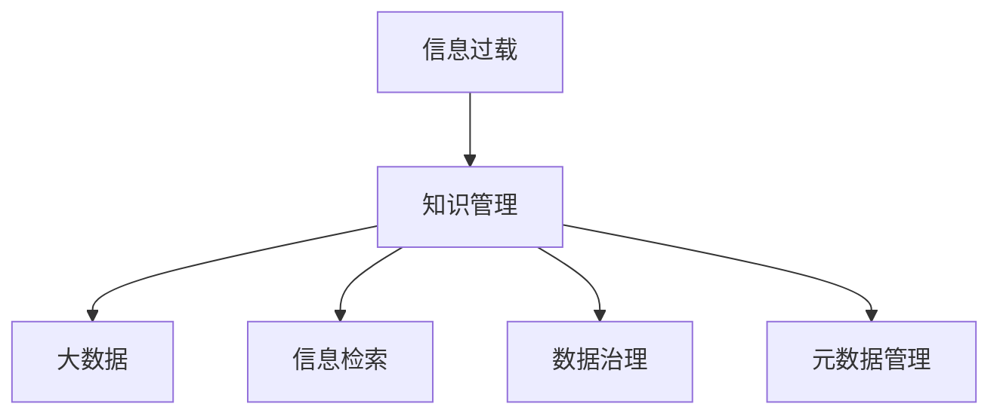
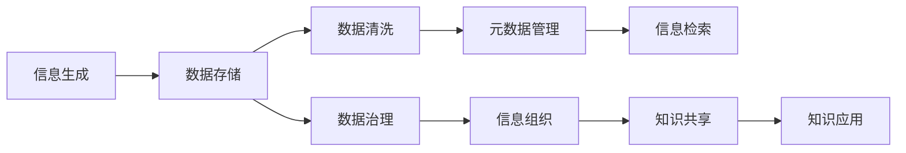

                 

# 信息过载与知识管理系统实施指南：管理和组织信息

> 关键词：信息过载, 知识管理, 大数据, 信息检索, 组织架构, 数据治理, 元数据管理

## 1. 背景介绍

在当今信息爆炸的时代，企业和个人面对的数据量呈指数级增长。无论在商务决策、科学研究还是日常工作，大量且分散的信息对信息的筛选、组织、存储和应用提出了前所未有的挑战。信息的过量产生和高速流动在提升工作效率的同时，也让人们陷入了信息过载（Information Overload）的困境中。

信息过载指的是个人或系统接收到的信息量超出了其有效处理和理解的能力范围，从而导致信息处理效率下降，决策质量受损。企业组织、教育机构、政府部门及个人用户等在面对大量未组织、未筛选的信息时，常常感到压力巨大，效率降低，从而影响了组织的运作效率和决策能力。

因此，如何有效地管理和组织信息，以确保重要的信息能够被及时、准确地识别和使用，是当前面临的一项重要课题。解决这一问题，需要构建一套完善的知识管理系统（Knowledge Management System, KMS），从信息的生成、存储、检索、应用和共享等方面提供全面支持。

## 2. 核心概念与联系

### 2.1 核心概念概述

为了系统性地理解和实施知识管理系统，我们先定义和梳理几个核心概念：

- **知识管理**：指通过计划、控制和利用知识资源，提升组织的学习能力和创新能力，以实现组织目标的一种管理活动。
- **信息过载**：指在信息时代，人们接收到的信息量远超其处理能力，导致决策过程受阻，工作绩效下降。
- **大数据**：指数据量、多样性和速度都达到或超过了传统数据处理模式范围的信息集合，需要先进的数据处理技术来管理和分析。
- **信息检索**：指在大量信息中快速找到所需的信息资源的过程，是知识管理的重要组成部分。
- **数据治理**：指通过一套规则和流程对数据的质量、完整性、一致性进行控制，以确保数据可以安全、高效地被利用。
- **元数据管理**：指对数据描述性信息的组织和管理，元数据有助于数据的理解、查找和集成，是知识管理的基石。

这些概念间的关系可以通过以下Mermaid流程图表示：



这一流程展示了信息过载需要通过知识管理来改善，而知识管理需要处理大数据、实现信息检索、确保数据治理和元数据管理来支撑。

### 2.2 核心概念原理和架构的 Mermaid 流程图



在这个架构图中，信息的生成最终转化为数据存储，并通过数据治理来保证数据质量。清洗后的数据输入元数据管理，元数据使得信息检索更加高效，而经过组织的信息共享到知识共享平台，并应用于知识应用中，最后回流到信息生成以形成一个闭环。

## 3. 核心算法原理 & 具体操作步骤

### 3.1 算法原理概述

知识管理系统实施的核心是算法原理和操作步骤。在处理信息过载的挑战中，以下算法和步骤尤为关键：

1. **信息筛选与过滤**：
   使用过滤算法（如协同过滤、内容过滤）筛选出与用户需求相关性高的信息。

2. **文本挖掘与主题建模**：
   利用文本挖掘和主题建模算法（如TF-IDF、LDA）识别文本中的关键信息，并进行主题归纳和分类。

3. **信息聚类与推荐**：
   通过聚类算法（如K-means、层次聚类）将信息组织成有结构的知识集群，并使用推荐算法（如协同过滤、矩阵分解）推荐关键信息。

4. **信息检索与关联**：
   使用倒排索引、向量空间模型等技术快速检索信息，并建立不同信息之间的关联。

5. **知识图谱构建与演化**：
   构建知识图谱来表示信息之间的结构化关系，并定期进行更新和演化，以适应新信息。

### 3.2 算法步骤详解

下面以信息检索为例，详细说明核心算法的操作步骤：

1. **数据准备**：收集和整理待检索的文本数据，并建立索引。

2. **分词与向量化**：使用分词算法将文本转换为词汇集合，并对词汇进行向量化处理，如TF-IDF、Word2Vec等。

3. **建立倒排索引**：为每个词汇建立逆向索引表，记录该词汇在文本中出现的文档位置。

4. **查询处理**：对用户输入的查询语句进行分词和向量化，并匹配倒排索引，找出最相关的文档。

5. **结果排序与展示**：使用评分函数对文档进行排序，并展示前N篇最相关的文档。

### 3.3 算法优缺点

知识管理系统的算法和技术都有其优缺点：

#### 优点：

- **高效检索**：通过倒排索引等技术，可以快速定位到所需信息，提高信息检索效率。
- **智能推荐**：利用协同过滤、矩阵分解等算法，可以根据用户历史行为推荐信息，提升信息获取的相关性。
- **数据集成**：通过知识图谱等技术，可以将分散的数据集成到一起，实现信息融合和共享。

#### 缺点：

- **复杂度较高**：知识管理系统的构建和维护需要大量的算法和技术的支持，实施成本高。
- **数据质量依赖**：数据清洗和处理的质量直接影响信息检索和推荐效果。
- **动态变化适应性**：系统需要定期更新和维护，以适应数据集的变化和新信息的出现。

### 3.4 算法应用领域

知识管理系统已广泛应用于多个领域，包括但不限于：

- **企业信息管理**：企业内部的文档、邮件、报告等信息的管理和检索。
- **学术研究与知识共享**：学术机构的论文、专利、实验数据等知识资源的共享与查询。
- **医疗信息管理**：医疗机构的病历、影像、研究成果等医学信息的组织和检索。
- **政府公共服务**：政府部门的法规、政策、统计数据等信息的发布和检索。
- **教育机构知识库**：教育资源、教学材料、研究成果等信息的组织和共享。

## 4. 数学模型和公式 & 详细讲解 & 举例说明

### 4.1 数学模型构建

为了有效地管理和组织信息，我们利用以下数学模型构建知识管理系统：

- **向量空间模型（Vector Space Model, VSM）**：将文档和查询转换为向量，计算它们之间的相似度。
- **信息检索模型**：将查询和文档通过相似度匹配，筛选出最相关文档。
- **协同过滤推荐模型**：根据用户的历史行为和兴趣，推荐可能感兴趣的信息。
- **聚类算法**：将相似的信息聚成一组，形成结构化的知识集群。

### 4.2 公式推导过程

#### 向量空间模型公式推导

向量空间模型将文档和查询表示为向量，利用余弦相似度计算两者之间的相似度。

设文本 $d$ 和查询 $q$ 的词袋模型表示为：

$$
d = \{w_1, w_2, ..., w_n\}, \quad q = \{w_i, w_j, ..., w_k\}
$$

其中 $w$ 表示单词。

设单词 $w$ 的权重为 $tf(w) + idf(w)$，其中 $tf(w)$ 为单词在文档中的词频，$idf(w)$ 为逆文档频率。

设 $d$ 和 $q$ 的向量表示为：

$$
d = \{(tf(w_1)+idf(w_1)), (tf(w_2)+idf(w_2)), ..., (tf(w_n)+idf(w_n))\}
$$

$$
q = \{(tf(w_i)+idf(w_i)), (tf(w_j)+idf(w_j)), ..., (tf(w_k)+idf(w_k))\}
$$

则它们之间的余弦相似度为：

$$
\text{similarity}(d,q) = \frac{d \cdot q}{\|d\| \cdot \|q\|} = \frac{\sum_{i=1}^{n} (tf(w_i)+idf(w_i))(tf(w_i)+idf(w_i))}{\sqrt{\sum_{i=1}^{n} (tf(w_i)+idf(w_i))^2} \cdot \sqrt{\sum_{i=1}^{k} (tf(w_i)+idf(w_i))^2}}
$$

### 4.3 案例分析与讲解

以新闻网站的信息检索系统为例，我们来分析向量空间模型如何应用。

设一篇新闻文档 $d$ 为：

$$
d = \{tf("AI"), tf("大数据"), tf("深度学习"), tf("NLP"), idf("AI"), idf("大数据"), idf("深度学习"), idf("NLP")\}
$$

设用户查询 $q$ 为：

$$
q = \{tf("AI"), tf("深度学习"), tf("NLP"), idf("AI"), idf("深度学习"), idf("NLP")\}
$$

将文档和查询转换为向量：

$$
d = \{1+1, 1+1, 1+1, 1+1, 1+2, 1+2, 1+2, 1+2\}
$$

$$
q = \{1+1, 1+2, 1+2, 1+2, 1+2, 1+2\}
$$

计算它们的余弦相似度：

$$
\text{similarity}(d,q) = \frac{(1+1)(1+1) + (1+1)(1+2) + (1+1)(1+2) + (1+1)(1+2)}{\sqrt{(1+1)^2 + (1+1)^2 + (1+1)^2 + (1+1)^2} \cdot \sqrt{(1+1)^2 + (1+2)^2 + (1+2)^2 + (1+2)^2}} \approx 0.785
$$

因此，向量空间模型计算出该查询与文档的相似度为0.785，表明该新闻与查询主题相关性较高。

## 5. 项目实践：代码实例和详细解释说明

### 5.1 开发环境搭建

搭建知识管理系统的开发环境，需要考虑以下因素：

1. **编程语言**：Python是最常用的选择，因为其拥有丰富的科学计算库和机器学习框架。

2. **开发工具**：Jupyter Notebook 或 PyCharm 等IDE 可以帮助进行代码编写和调试。

3. **数据存储与处理**：MySQL, MongoDB 或 Elasticsearch 等数据库用于存储和管理数据。

4. **框架和库**：NLP 相关库如 NLTK, Spacy, Gensim 等用于文本处理和分析，如 Scikit-learn 用于机器学习建模，Flask 用于构建 Web 应用。

5. **云服务**：AWS, Google Cloud, 或 Azure 等云服务可以提供高可扩展性和高可用性的计算资源。

### 5.2 源代码详细实现

以下是一个简单的信息检索系统代码示例：

```python
import gensim
from gensim.models import TfidfModel
from gensim.corpora import Dictionary, Doc2Vec

# 构建词袋模型和词频分布
corpus = ["This is the first document.", "This is the second document.", "And this is the third one.", "Is this the first document?"]
dictionary = Dictionary(corpus)
corpus_bow = [dictionary.doc2bow(text.lower().split()) for text in corpus]

# 构建TF-IDF模型
tfidf = TfidfModel(corpus_bow)
corpus_tfidf = tfidf[corpus_bow]

# 训练Doc2Vec模型
doc2vec = Doc2Vec(corpus_tfidf, vector_size=50, window=5, min_count=1, workers=4, epochs=10)

# 测试查询
test_query = "document"
query_bow = dictionary.doc2bow(test_query.lower().split())
test_tfidf = tfidf[query_bow]
doc2vec_vector = doc2vec.infer_vector(test_tfidf)

# 计算文档相似度
similarity_scores = doc2vec.docsimilarity(doc2vec_vector)
```

### 5.3 代码解读与分析

- `gensim` 库：用于处理文本数据的 Gensim 提供了各种算法和模型，如 TF-IDF, Doc2Vec 等，是构建信息检索系统的核心工具。
- `TfidfModel`：用于建立 TF-IDF 模型，计算词频分布和权重。
- `Doc2Vec`：用于建立文档向量，并计算文档之间的相似度。

这个代码实现了从文本构建 TF-IDF 和 Doc2Vec 模型，并将查询转化为向量，最后计算文档的相似度。实践中，我们可以将更复杂的算法和模型集成到系统中，提升检索的精度和效率。

### 5.4 运行结果展示

在运行完上述代码后，我们可以通过相似度得分来识别出与查询最相关的文档。例如，在查询 "document" 的情况下，文档 1 的相似度最高，表示其与查询最为相关。

## 6. 实际应用场景

### 6.1 新闻信息检索系统

新闻信息检索系统可以自动化处理海量的新闻文章，并为用户提供准确相关的信息。比如，用户可以通过关键词查询最新的新闻报道。系统使用向量空间模型和TF-IDF算法，快速定位到相关的文章。

### 6.2 企业文档管理系统

企业文档管理系统通过知识管理，将企业内部文档、报告、会议记录等信息进行有效组织和检索，支持信息共享和知识再利用。系统可以通过协同过滤推荐相关的文档，提升信息获取效率。

### 6.3 学术机构研究数据库

学术机构的研究数据库利用信息检索和推荐算法，将论文、专利、实验数据等知识资源进行有效管理。研究人员通过查询和浏览，可以快速获取到相关的研究材料和数据，加速科研进程。

### 6.4 医疗信息查询系统

医疗信息查询系统对医院、诊所等医疗机构的数据进行管理，包括病历、影像、研究成果等。系统通过文本挖掘和知识图谱，辅助医生进行诊断和治疗决策。

### 6.5 政府公共信息检索平台

政府公共信息检索平台提供法规、政策、统计数据等信息的检索服务。系统利用信息检索和推荐技术，提升公共服务的效率和质量，方便民众获取政府信息。

## 7. 工具和资源推荐

### 7.1 学习资源推荐

为了帮助开发者系统掌握知识管理系统的理论基础和实践技巧，推荐以下学习资源：

1. **《信息检索理论与实践》**：详细介绍了信息检索的核心算法和技术，如TF-IDF、倒排索引等。
2. **《推荐系统实践》**：介绍了协同过滤、矩阵分解等推荐算法，以及其实现方法。
3. **《数据治理最佳实践》**：介绍了数据治理的基本原则和策略，如何保证数据质量。
4. **《知识图谱：构建与演化》**：讲解了知识图谱的构建方法和应用，如何提升信息检索和推荐的效果。
5. **《KMS系统设计与实现》**：提供了KMS系统的设计和实现案例，结合实际需求进行讲解。

### 7.2 开发工具推荐

1. **PyTorch**：用于深度学习模型构建和训练，支持大规模向量计算。
2. **Scikit-learn**：用于各种机器学习模型的实现和优化，支持数据预处理和分析。
3. **Flask**：用于Web应用的构建和部署，支持快速开发Web服务。
4. **Elasticsearch**：用于分布式存储和检索海量数据，支持高可扩展性。

### 7.3 相关论文推荐

以下是几篇知识管理领域的经典论文，推荐阅读：

1. **《PageRank算法与Google搜索模型》**：PageRank算法是Google搜索的核心算法，解释了如何通过网页链接关系计算网页权重。
2. **《协同过滤推荐系统》**：介绍了协同过滤算法的原理和实现方法，以及如何处理稀疏矩阵问题。
3. **《知识图谱的构建与应用》**：探讨了知识图谱的构建方法和应用场景，如语义搜索、问答系统等。
4. **《深度学习在信息检索中的应用》**：介绍了深度学习在信息检索中的作用，如使用卷积神经网络进行文本分类和信息检索。

## 8. 总结：未来发展趋势与挑战

### 8.1 研究成果总结

知识管理系统的研究集中在以下几个方向：

1. **多模态信息融合**：将文本、图像、视频等多模态数据融合，提升信息检索和推荐效果。
2. **跨领域知识迁移**：利用领域知识迁移技术，将一个领域的专业知识迁移到另一个领域，实现跨领域知识共享。
3. **自然语言处理（NLP）**：利用NLP技术，提升文本分析、信息抽取和知识表示能力。
4. **智能推荐系统**：通过深度学习和强化学习，提高推荐系统的个性化和准确性。
5. **分布式存储和计算**：利用分布式技术和云计算，提升信息管理的可扩展性和计算效率。

### 8.2 未来发展趋势

未来知识管理系统的趋势包括以下几个方面：

1. **自动化和智能化**：利用机器学习和大数据技术，实现信息自动化管理和智能化推荐。
2. **实时性和响应速度**：提升系统实时性和响应速度，以便更快速地处理和响应用户查询。
3. **跨平台和跨设备访问**：支持多种设备和平台，提升信息获取的便利性和可访问性。
4. **隐私保护和安全**：强化数据隐私保护和安全措施，确保用户信息安全。
5. **自适应和动态调整**：系统能够自适应数据变化和用户需求变化，实现动态调整和优化。

### 8.3 面临的挑战

尽管知识管理系统的研究取得了很大进展，但仍面临以下挑战：

1. **数据质量**：数据质量差、数据量不均衡等问题，会影响信息检索和推荐的效果。
2. **计算资源**：系统需要大量计算资源，如何优化计算资源利用效率是关键问题。
3. **用户接受度**：用户对新系统的接受度不高，可能对系统的使用产生阻碍。
4. **技术复杂性**：知识管理系统的技术复杂度高，实施成本和难度较大。
5. **信息过载和噪声干扰**：在海量信息中识别关键信息，并避免噪声干扰，是系统需要解决的重要问题。

### 8.4 研究展望

未来的研究应重点关注以下几个方向：

1. **智能推荐算法优化**：进一步优化协同过滤、矩阵分解等推荐算法，提升推荐准确性和个性化程度。
2. **多模态信息处理技术**：研究图像、视频、语音等多模态信息的处理和融合，提升信息检索和推荐效果。
3. **跨领域知识迁移**：研究如何跨领域迁移知识，提升系统适应性和泛化能力。
4. **用户行为分析**：研究用户行为模型，提升系统对用户需求的预测和响应能力。
5. **隐私保护和数据治理**：加强隐私保护措施和数据治理流程，确保数据安全和使用合规。

## 9. 附录：常见问题与解答

**Q1: 什么是知识管理？**

A: 知识管理是指对知识资源的计划、控制、利用和评价的过程。目的是提高组织的创新能力和学习能力，实现组织目标。

**Q2: 什么是信息过载？**

A: 信息过载指用户接收到的信息量超出了其处理能力，导致决策过程受阻，工作效率下降。

**Q3: 知识管理系统的核心算法有哪些？**

A: 知识管理系统的核心算法包括文本挖掘、信息检索、协同过滤推荐、聚类等。

**Q4: 如何构建知识图谱？**

A: 构建知识图谱需要收集结构化数据，定义实体、属性和关系，并使用工具如Neo4j、Gephi等进行可视化展示。

**Q5: 知识管理系统如何处理海量数据？**

A: 知识管理系统通过分布式存储和计算技术（如Hadoop、Spark）处理海量数据，提高计算效率和系统可扩展性。

通过以上系统化的介绍，相信读者对信息过载与知识管理系统的实施有了更深入的了解和认识。在实际应用中，我们应综合考虑多方面因素，不断优化系统设计，提升信息管理的效率和效果。

